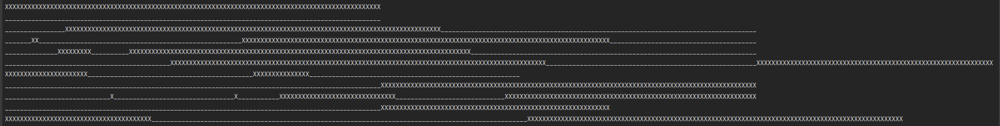
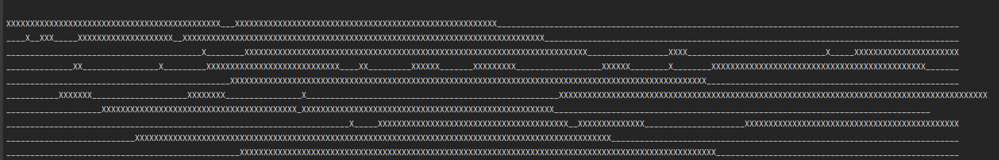
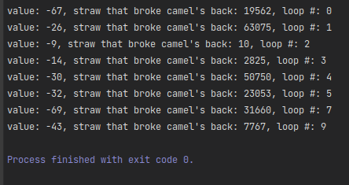

<html lang="en">
<head>
    <meta charset="UTF-8">
    <meta name="viewport" content="width=device-width, initial-scale=1">
    <title>/f0c1s/blog/articles/concurrency</title>
    <link rel="stylesheet" href="../../index.css"/>
    <link rel="stylesheet" href="../../highlight/styles/monokai.min.css"/>
    <script src="../../setup.js"></script>
    <script src="../../highlight/highlight.min.js"></script>
    <script>hljs.highlightAll();</script>
</head>

<body>
<h1>/f0c1s/blog/articles/concurrency</h1>
<nav>
    <a href="../../index.html">/blog</a>
    <a href="../../articles/index.html">articles</a>
    <a href="../../articles/concurrency/concurrency.html">+ concurrency</a>
</nav>

## Definitions

<dl>
<dt>concurrency</dt>
<dd>Ability to have multiple things happen at one time.</dd>
<dt>concurrent application</dt>
<dd>An application that can deal with multiple things happening at one time.</dd>
<dt>process</dt>
<dd>A process is an instance of a running program that is isolated from other processes on the same machine.</dd>
<dt>thread</dt>
<dd>An execution sequence of a part of a program</dd>
<dt>asynchronous function</dt>
<dd>A function that can return early, by setting up a callback which does the heavy work later.</dd>
<dt>synchronous function</dt>
<dd>A function that run to completion, or throw an error, or never return</dd>
<dt>single threaded process</dt>
<dd>Process which has only one thread of execution, if thread sleeps, the process sleeps</dd>
<dt>multi-threaded process</dt>
<dd>Process which has multiple threads of execution; threads can step on one-another's toes</dd>
</dl>

Now read these and may be scratch you head, while saying "huh?"

<blockquote>Concurrency is the simultaneous occurrence of events.</blockquote>

<blockquote>Concurrency means multiple tasks which start, run, and complete in overlapping time periods, in no specific order.</blockquote>

<blockquote>acting in conjunction, contributing to the same effect or event</blockquote>

<blockquote>A thread is a locus of control inside a running program.</blockquote>

<blockquote>A function that can be suspended while it’s partway through execution.</blockquote>

### Sample multi-thread example in C#

```cs
using System;
using System.Threading;

namespace threading_samples
{
    internal class Program
    {
        private static void Main(string[] args)
        {
            for (var i = 0; i < 10; i++)
            {
                var t = new Thread(WriteX);
                t.Start();
                Console.WriteLine();

                Write_();
            }
        }

        private static void Write_()
        {
            for (var i = 0; i < 100; i++) Console.Write("_");
        }

        private static void WriteX()
        {
            for (var i = 0; i < 100; i++) Console.Write("X");
        }
    }
}


```


Contrast the two output from two back-to-back executions of the code above:





This should tell you that the threads are independent of each other and may be scheduled at any point of time.


### Increment Decrement example

In this example we are going to decrement a number 100 times and then increment it. The output should be 0 at the end, always. But this doesn't happen.

```cs
using System;
using System.Threading;

namespace threading_samples
{
    internal static class IncrementDecrement
    {
        private static int _value;

        private static void Main(string[] args)
        {
            for (var loop = 0; loop < 10; loop++)
            {
                _value = 0;
                for (var straw = 0; straw < 123456; straw++)
                {
                    var t = new Thread(Decrement);
                    t.Start(); // decrease by 100
                    Increment(); // increase by 100
                    t.Join(); // wait for the decrement thread to finish

                    if (_value != 0)
                    {
                        Console.WriteLine("value: {0}, straw that broke camel's back: {1}, loop #: {2}",
                            _value,
                            straw,
                            loop);
                        break;
                    }
                }
            }
        }

        private static void Increment()
        {
            for (var i = 0; i < 100; i++) _value++;
        }

        private static void Decrement()
        {
            for (var i = 0; i < 100; i++) _value--;
        }
    }
}
```

```
value: -67, straw that broke camel's back: 19562, loop #: 0
value: -26, straw that broke camel's back: 63075, loop #: 1
value: -9, straw that broke camel's back: 10, loop #: 2
value: -14, straw that broke camel's back: 2825, loop #: 3
value: -30, straw that broke camel's back: 50750, loop #: 4
value: -32, straw that broke camel's back: 23053, loop #: 5
value: -69, straw that broke camel's back: 31660, loop #: 7
value: -43, straw that broke camel's back: 7767, loop #: 9

```

If you notice, loop#6 and #8 are missing, that is when the loop ended with a value of 0.



If I decrease the Increment/Decrement loop count to 10, the execution becomes stabler.

```
value: -10, straw that broke camel's back: 41654, loop #: 1
value: 10, straw that broke camel's back: 26690, loop #: 2
value: 7, straw that broke camel's back: 23717, loop #: 3
value: 6, straw that broke camel's back: 58597, loop #: 5

```

Notice how the inner loop count has jumped to five digits in every case.

Let's decrease the number of inner loop (straw).


```cs
using System;
using System.Threading;

namespace threading_samples
{
    internal static class IncrementDecrement
    {
        private static int _value;

        private static void Main(string[] args)
        {
            for (var loop = 0; loop < 10; loop++)
            {
                _value = 0;
                for (var straw = 0; straw < 100; straw++)
                {
                    var t = new Thread(Decrement);
                    t.Start(); // decrease by 2
                    Increment(); // increase by 2
                    t.Join(); // wait for the decrement thread to finish

                    if (_value != 0)
                    {
                        Console.WriteLine("value: {0}, straw that broke camel's back: {1}, loop #: {2}",
                            _value,
                            straw,
                            loop);
                        break;
                    }
                }
            }
        }

        private static void Increment()
        {
            for (var i = 0; i < 2; i++) _value++;
        }

        private static void Decrement()
        {
            for (var i = 0; i < 2; i++) _value--;
        }
    }
}

```

Nothing. No errors.

That's because computers are fast. Notice, Increment/Decrement loops are running only twice. Inner loop(straw) is running only 100 times, outer loop only 10 times. And there are no errors.

If I increase outer loop (loop) invocations, then we see some errors again. I made condition `loop < 10000;` and it shows some errors:

```
value: 2, straw that broke camel's back: 44, loop #: 1038
value: -2, straw that broke camel's back: 19, loop #: 2416
value: 2, straw that broke camel's back: 47, loop #: 6999

```

And that's it. This is the reason why concurrency/multi-threading errors are hard to figure out. The code can be incorrect logically, but still execute really well.

For example, the following code is logically wrong, but it will almost never show you the error.

```cs
using System;
using System.Threading;

namespace threading_samples
{
    internal static class IncrementDecrement
    {
        private static int _value;

        private static void Main(string[] args)
        {
            for (var loop = 0; loop < 2; loop++)
            {
                _value = 0;
                for (var straw = 0; straw < 2; straw++)
                {
                    var t = new Thread(Decrement);
                    t.Start(); // decrease by 2
                    Increment(); // increase by 2
                    t.Join(); // wait for the decrement thread to finish

                    if (_value != 0)
                    {
                        Console.WriteLine("value: {0}, straw that broke camel's back: {1}, loop #: {2}",
                            _value,
                            straw,
                            loop);
                        break;
                    }
                }
            }
        }

        private static void Increment()
        {
            for (var i = 0; i < 2; i++) _value++;
        }

        private static void Decrement()
        {
            for (var i = 0; i < 2; i++) _value--;
        }
    }
}

```


## References

1. [cmu.edu pdf](https://www.andrew.cmu.edu/user/nbier/15110/lectures/lec24-concurrency.pdf)
2. [concurrency-in-operating-system/](https://www.geeksforgeeks.org/concurrency-in-operating-system/)
3. [difference-between-concurrency-and-parallelism/](https://www.geeksforgeeks.org/difference-between-concurrency-and-parallelism/)
4. [difference between concurrency, parallelism, and asynchronous methods](https://stackoverflow.com/questions/4844637/what-is-the-difference-between-concurrency-parallelism-and-asynchronous-methods)
5. [etymology concurrent](https://www.etymonline.com/word/concurrent)
6. [etymology Concurrency](https://www.etymonline.com/search?q=Concurrency)
7. [mit.edu 6.005](https://web.mit.edu/6.005/www/fa14/classes/17-concurrency/)
8. [swift](https://docs.swift.org/swift-book/LanguageGuide/Concurrency.html)
9.  [python](https://docs.python.org/3/library/concurrency.html)

</body>
</html>
