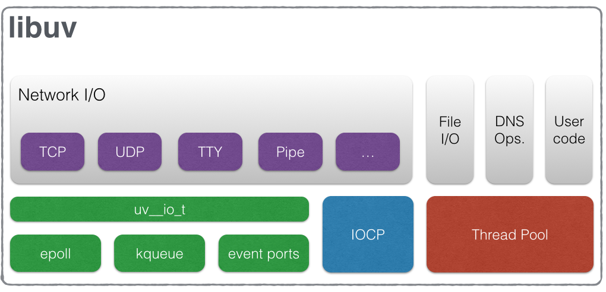
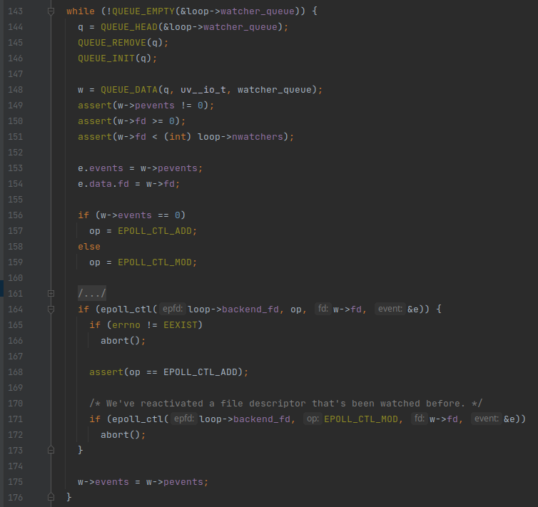
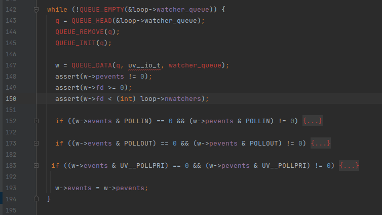

<html lang="en">
<head>
    <meta charset="UTF-8">
    <meta name="viewport" content="width=device-width, initial-scale=1">
    <title>blog.f0c1s.com/js/event-loop</title>
    <link rel="stylesheet" href="../../index.css"/>
    <script src="../../setup.js" async></script>
    <link rel="stylesheet" href="../../highlight/styles/monokai.min.css"/>
    <script src="../../highlight/highlight.min.js"></script>
    <script>hljs.highlightAll();</script></head>
<body onload="setup()">
<h1>
    /f0c1s/blog/js/event-loop
</h1>
<nav>
    <a href="../../index.html">/blog</a>
    <a href="../../js/index.html">/js</a>
    <a href="../../js/event-loop/event-loop-in-js.html">+ event loop in js</a>
</nav>

## Overview

There is no specific single event loop. It depends upon the environment, which includes OS, platform, runtime (browser,
node).

## libuv



<blockquote>
libuv is a multi-platform support library with a focus on asynchronous I/O.
It was primarily developed for use by Node.js, but it's also used by Luvit, Julia, uvloop, and others.
</blockquote>

<blockquote>
features: Full-featured event loop backed by epoll, kqueue, IOCP, event ports.
</blockquote>

<details>
<summary><h3>epoll</h3></summary>
<blockquote>
epoll is a Linux kernel system call for a scalable I/O event notification mechanism,
first introduced in version 2.5.44 of the Linux kernel.

Its function is to monitor multiple file descriptors to see whether I/O is possible on any of them. It is meant to
replace the older POSIX select(2) and poll(2) system calls, to achieve better performance in more demanding
applications, where the number of watched file descriptors is large (unlike the older system calls, which operate in O(
n) time, epoll operates in O(1) time).
</blockquote>

### man 7 epoll

```
EPOLL(7)                                                       Linux Programmer's Manual                                                       EPOLL(7)

NAME
       epoll - I/O event notification facility

SYNOPSIS
       #include <sys/epoll.h>

DESCRIPTION
       The  epoll API performs a similar task to poll(2): monitoring multiple file descriptors to see if I/O is possible on any of them.  The epoll API
       can be used either as an edge-triggered or a level-triggered interface and scales well to large numbers of watched file descriptors.

       The central concept of the epoll API is the epoll instance, an in-kernel data structure which, from a user-space perspective, can be  considered
       as a container for two lists:

       • The  interest  list (sometimes also called the epoll set): the set of file descriptors that the process has registered an interest in monitor‐
         ing.

       • The ready list: the set of file descriptors that are "ready" for I/O.  The ready list is a subset of (or, more precisely, a set of  references
         to)  the  file  descriptors  in the interest list.  The ready list is dynamically populated by the kernel as a result of I/O activity on those
         file descriptors.

       The following system calls are provided to create and manage an epoll instance:

       • epoll_create(2) creates a new epoll instance and returns a file descriptor referring to that instance.  (The more recent epoll_create1(2)  ex‐
         tends the functionality of epoll_create(2).)

       • Interest in particular file descriptors is then registered via epoll_ctl(2), which adds items to the interest list of the epoll instance.

       • epoll_wait(2)  waits for I/O events, blocking the calling thread if no events are currently available.  (This system call can be thought of as
         fetching items from the ready list of the epoll instance.)

   Level-triggered and edge-triggered
       The epoll event distribution interface is able to behave both as edge-triggered (ET) and as level-triggered (LT).  The  difference  between  the
       two mechanisms can be described as follows.  Suppose that this scenario happens:

       1. The file descriptor that represents the read side of a pipe (rfd) is registered on the epoll instance.

       2. A pipe writer writes 2 kB of data on the write side of the pipe.

       3. A call to epoll_wait(2) is done that will return rfd as a ready file descriptor.

       4. The pipe reader reads 1 kB of data from rfd.

       5. A call to epoll_wait(2) is done.

       If the rfd file descriptor has been added to the epoll interface using the EPOLLET (edge-triggered) flag, the call to epoll_wait(2) done in step
       5 will probably hang despite the available data still present in the file input buffer; meanwhile the remote peer might be expecting a  response
       based  on  the  data  it already sent.  The reason for this is that edge-triggered mode delivers events only when changes occur on the monitored
       file descriptor.  So, in step 5 the caller might end up waiting for some data that is already present inside the input buffer.  In the above ex‐
       ample, an event on rfd will be generated because of the write done in 2 and the event is consumed in 3.  Since the read operation done in 4 does
       not consume the whole buffer data, the call to epoll_wait(2) done in step 5 might block indefinitely.

       An application that employs the EPOLLET flag should use nonblocking file descriptors to avoid having a blocking read or write starve a task that
       is handling multiple file descriptors.  The suggested way to use epoll as an edge-triggered (EPOLLET) interface is as follows:

       a) with nonblocking file descriptors; and

       b) by waiting for an event only after read(2) or write(2) return EAGAIN.

       By contrast, when used as a level-triggered interface (the default, when EPOLLET is not specified), epoll is simply a faster poll(2), and can be
       used wherever the latter is used since it shares the same semantics.

       Since even with edge-triggered epoll, multiple events can be generated upon receipt of multiple chunks of data, the caller  has  the  option  to
       specify  the  EPOLLONESHOT flag, to tell epoll to disable the associated file descriptor after the receipt of an event with epoll_wait(2).  When
       the EPOLLONESHOT flag is specified, it is the caller's responsibility to rearm the file descriptor using epoll_ctl(2) with EPOLL_CTL_MOD.

       If multiple threads (or processes, if child processes have inherited the epoll file descriptor across  fork(2))  are  blocked  in  epoll_wait(2)
       waiting  on  the  same epoll file descriptor and a file descriptor in the interest list that is marked for edge-triggered (EPOLLET) notification
       becomes ready, just one of the threads (or processes) is awoken from epoll_wait(2).  This provides a useful optimization for avoiding  "thunder‐
       ing herd" wake-ups in some scenarios.

   Interaction with autosleep
       If  the system is in autosleep mode via /sys/power/autosleep and an event happens which wakes the device from sleep, the device driver will keep
       the device awake only until that event is queued.  To keep the device awake until the event has been processed,  it  is  necessary  to  use  the
       epoll_ctl(2) EPOLLWAKEUP flag.

       When  the  EPOLLWAKEUP  flag  is  set  in  the events field for a struct epoll_event, the system will be kept awake from the moment the event is
       queued, through the epoll_wait(2) call which returns the event until the subsequent epoll_wait(2) call.  If the event  should  keep  the  system
       awake beyond that time, then a separate wake_lock should be taken before the second epoll_wait(2) call.

   /proc interfaces
       The following interfaces can be used to limit the amount of kernel memory consumed by epoll:

       /proc/sys/fs/epoll/max_user_watches (since Linux 2.6.28)
              This  specifies  a  limit on the total number of file descriptors that a user can register across all epoll instances on the system.  The
              limit is per real user ID.  Each registered file descriptor costs roughly 90 bytes on a 32-bit kernel, and roughly 160 bytes on a  64-bit
              kernel.   Currently, the default value for max_user_watches is 1/25 (4%) of the available low memory, divided by the registration cost in
              bytes.

   Example for suggested usage
       While the usage of epoll when employed as a level-triggered interface does have the same semantics as poll(2), the edge-triggered usage requires
       more clarification to avoid stalls in the application event loop.  In this example, listener is a nonblocking socket on which listen(2) has been
       called.  The function do_use_fd() uses the new ready file descriptor until EAGAIN is returned by either read(2) or  write(2).   An  event-driven
       state  machine  application  should, after having received EAGAIN, record its current state so that at the next call to do_use_fd() it will con‐
       tinue to read(2) or write(2) from where it stopped before.

           #define MAX_EVENTS 10
           struct epoll_event ev, events[MAX_EVENTS];
           int listen_sock, conn_sock, nfds, epollfd;

           /* Code to set up listening socket, 'listen_sock',
              (socket(), bind(), listen()) omitted */

           epollfd = epoll_create1(0);
           if (epollfd == -1) {
               perror("epoll_create1");
               exit(EXIT_FAILURE);
           }

           ev.events = EPOLLIN;
           ev.data.fd = listen_sock;
           if (epoll_ctl(epollfd, EPOLL_CTL_ADD, listen_sock, &ev) == -1) {
               perror("epoll_ctl: listen_sock");
               exit(EXIT_FAILURE);
           }

           for (;;) {
               nfds = epoll_wait(epollfd, events, MAX_EVENTS, -1);
               if (nfds == -1) {
                   perror("epoll_wait");
                   exit(EXIT_FAILURE);
               }

               for (n = 0; n < nfds; ++n) {
                   if (events[n].data.fd == listen_sock) {
                       conn_sock = accept(listen_sock,
                                          (struct sockaddr *) &addr, &addrlen);
                       if (conn_sock == -1) {
                           perror("accept");
                           exit(EXIT_FAILURE);
                       }
                       setnonblocking(conn_sock);
                       ev.events = EPOLLIN | EPOLLET;
                       ev.data.fd = conn_sock;
                       if (epoll_ctl(epollfd, EPOLL_CTL_ADD, conn_sock,
                                   &ev) == -1) {
                           perror("epoll_ctl: conn_sock");
                           exit(EXIT_FAILURE);
                       }
                   } else {
                       do_use_fd(events[n].data.fd);
                   }
               }
           }

       When used as an edge-triggered interface, for performance reasons, it is possible  to  add  the  file  descriptor  inside  the  epoll  interface
       (EPOLL_CTL_ADD)  once  by  specifying  (EPOLLIN|EPOLLOUT).  This allows you to avoid continuously switching between EPOLLIN and EPOLLOUT calling
       epoll_ctl(2) with EPOLL_CTL_MOD.

   Questions and answers
       0.  What is the key used to distinguish the file descriptors registered in an interest list?

           The key is the combination of the file descriptor number and the open file description (also known as an "open file  handle",  the  kernel's
           internal representation of an open file).

       1.  What happens if you register the same file descriptor on an epoll instance twice?

           You  will  probably  get EEXIST.  However, it is possible to add a duplicate (dup(2), dup2(2), fcntl(2) F_DUPFD) file descriptor to the same
           epoll instance.  This can be a useful technique for filtering events, if the duplicate file descriptors are registered with different events
           masks.

       2.  Can two epoll instances wait for the same file descriptor?  If so, are events reported to both epoll file descriptors?

           Yes, and events would be reported to both.  However, careful programming may be needed to do this correctly.

       3.  Is the epoll file descriptor itself poll/epoll/selectable?

           Yes.  If an epoll file descriptor has events waiting, then it will indicate as being readable.

       4.  What happens if one attempts to put an epoll file descriptor into its own file descriptor set?

           The epoll_ctl(2) call fails (EINVAL).  However, you can add an epoll file descriptor inside another epoll file descriptor set.

       5.  Can I send an epoll file descriptor over a UNIX domain socket to another process?

           Yes, but it does not make sense to do this, since the receiving process would not have copies of the file descriptors in the interest list.

       6.  Will closing a file descriptor cause it to be removed from all epoll interest lists?

           Yes,  but be aware of the following point.  A file descriptor is a reference to an open file description (see open(2)).  Whenever a file de‐
           scriptor is duplicated via dup(2), dup2(2), fcntl(2) F_DUPFD, or fork(2), a new file descriptor referring to the same open file  description
           is created.  An open file description continues to exist until all file descriptors referring to it have been closed.

           A  file  descriptor  is  removed from an interest list only after all the file descriptors referring to the underlying open file description
           have been closed.  This means that even after a file descriptor that is part of an interest list has been closed, events may be reported for
           that  file  descriptor  if other file descriptors referring to the same underlying file description remain open.  To prevent this happening,
           the file descriptor must be explicitly removed from the interest list (using epoll_ctl(2) EPOLL_CTL_DEL) before it is duplicated.   Alterna‐
           tively,  the application must ensure that all file descriptors are closed (which may be difficult if file descriptors were duplicated behind
           the scenes by library functions that used dup(2) or fork(2)).

       7.  If more than one event occurs between epoll_wait(2) calls, are they combined or reported separately?

           They will be combined.

       8.  Does an operation on a file descriptor affect the already collected but not yet reported events?

           You can do two operations on an existing file descriptor.  Remove would be meaningless for this case.  Modify will reread available I/O.

       9.  Do I need to continuously read/write a file descriptor until EAGAIN when using the EPOLLET flag (edge-triggered behavior)?

           Receiving an event from epoll_wait(2) should suggest to you that such file descriptor is ready for the requested I/O  operation.   You  must
           consider  it  ready  until the next (nonblocking) read/write yields EAGAIN.  When and how you will use the file descriptor is entirely up to
           you.

           For packet/token-oriented files (e.g., datagram socket, terminal in canonical mode), the only way to detect the end of  the  read/write  I/O
           space is to continue to read/write until EAGAIN.

           For  stream-oriented  files (e.g., pipe, FIFO, stream socket), the condition that the read/write I/O space is exhausted can also be detected
           by checking the amount of data read from / written to the target file descriptor.  For example, if you call read(2) by asking to read a cer‐
           tain  amount  of  data  and read(2) returns a lower number of bytes, you can be sure of having exhausted the read I/O space for the file de‐
           scriptor.  The same is true when writing using write(2).  (Avoid this latter technique if you cannot guarantee that the monitored  file  de‐
           scriptor always refers to a stream-oriented file.)

   Possible pitfalls and ways to avoid them
       o Starvation (edge-triggered)

       If  there  is  a large amount of I/O space, it is possible that by trying to drain it the other files will not get processed causing starvation.
       (This problem is not specific to epoll.)

       The solution is to maintain a ready list and mark the file descriptor as ready in its associated data structure, thereby allowing  the  applica‐
       tion  to  remember  which  files need to be processed but still round robin amongst all the ready files.  This also supports ignoring subsequent
       events you receive for file descriptors that are already ready.

       o If using an event cache...

       If you use an event cache or store all the file descriptors returned from epoll_wait(2), then make sure to provide a way to mark its closure dy‐
       namically  (i.e.,  caused  by  a  previous event's processing).  Suppose you receive 100 events from epoll_wait(2), and in event #47 a condition
       causes event #13 to be closed.  If you remove the structure and close(2) the file descriptor for event #13, then your event  cache  might  still
       say there are events waiting for that file descriptor causing confusion.

       One  solution  for  this is to call, during the processing of event 47, epoll_ctl(EPOLL_CTL_DEL) to delete file descriptor 13 and close(2), then
       mark its associated data structure as removed and link it to a cleanup list.  If you find another event for file descriptor  13  in  your  batch
       processing, you will discover the file descriptor had been previously removed and there will be no confusion.

VERSIONS
       The epoll API was introduced in Linux kernel 2.5.44.  Support was added to glibc in version 2.3.2.

CONFORMING TO
       The epoll API is Linux-specific.  Some other systems provide similar mechanisms, for example, FreeBSD has kqueue, and Solaris has /dev/poll.

NOTES
       The  set  of  file descriptors that is being monitored via an epoll file descriptor can be viewed via the entry for the epoll file descriptor in
       the process's /proc/[pid]/fdinfo directory.  See proc(5) for further details.

       The kcmp(2) KCMP_EPOLL_TFD operation can be used to test whether a file descriptor is present in an epoll instance.

SEE ALSO
       epoll_create(2), epoll_create1(2), epoll_ctl(2), epoll_wait(2), poll(2), select(2)

COLOPHON
       This page is part of release 5.10 of the Linux man-pages project.  A description of the project, information about reporting bugs, and the  lat‐
       est version of this page, can be found at https://www.kernel.org/doc/man-pages/.

Linux                                                                  2019-03-06                                                              EPOLL(7)
```

### libuv/epoll.c

`uv__epoll_init` first calls `epoll_create1` which is a modern function and accepts only one value: `O_CLOEXEC`.

```c
int uv__epoll_init(uv_loop_t* loop) {
  int fd;
  fd = epoll_create1(O_CLOEXEC);

  /* epoll_create1() can fail either because it's not implemented (old kernel)
   * or because it doesn't understand the O_CLOEXEC flag.
   */
  if (fd == -1 && (errno == ENOSYS || errno == EINVAL)) {
    fd = epoll_create(256);

    if (fd != -1)
      uv__cloexec(fd, 1);
  }

  loop->backend_fd = fd;
  if (fd == -1)
    return UV__ERR(errno);

  return 0;
}
```

`O_CLOEXEC` is defined as:

```c
// fcntl-linux.h
# define O_CLOEXEC	__O_CLOEXEC	/* Set close_on_exec.  */

#ifndef __O_CLOEXEC
# define __O_CLOEXEC   02000000
#endif
```

### event loop via epoll

```c
void uv__io_poll(uv_loop_t* loop, int timeout) {
// ...
while (!QUEUE_EMPTY(&loop->watcher_queue)) {
    q = QUEUE_HEAD(&loop->watcher_queue);
    QUEUE_REMOVE(q);
    QUEUE_INIT(q);

    w = QUEUE_DATA(q, uv__io_t, watcher_queue);
    assert(w->pevents != 0);
    assert(w->fd >= 0);
    assert(w->fd < (int) loop->nwatchers);

    e.events = w->pevents;
    e.data.fd = w->fd;

    if (w->events == 0)
      op = EPOLL_CTL_ADD;
    else
      op = EPOLL_CTL_MOD;

    /* XXX Future optimization: do EPOLL_CTL_MOD lazily if we stop watching
     * events, skip the syscall and squelch the events after epoll_wait().
     */
    if (epoll_ctl(loop->backend_fd, op, w->fd, &e)) {
      if (errno != EEXIST)
        abort();

      assert(op == EPOLL_CTL_ADD);

      /* We've reactivated a file descriptor that's been watched before. */
      if (epoll_ctl(loop->backend_fd, EPOLL_CTL_MOD, w->fd, &e))
        abort();
    }

    w->events = w->pevents;
  }
// ...
}

```



This function contains the event loop logic.

[Read node start-stop](http://blog.f0c1s.com/node/start-stop/start-stop.html)

```c
// queue.h
typedef void *QUEUE[2];
#define QUEUE_HEAD(q)       (QUEUE_NEXT(q))
#define QUEUE_NEXT(q)       (*(QUEUE **) &((*(q))[0]))

#define QUEUE_REMOVE(q)                                                       \
  do {                                                                        \
    QUEUE_PREV_NEXT(q) = QUEUE_NEXT(q);                                       \
    QUEUE_NEXT_PREV(q) = QUEUE_PREV(q);                                       \
  }                                                                           \
  while (0)

#define QUEUE_INIT(q)                                                         \
  do {                                                                        \
    QUEUE_NEXT(q) = (q);                                                      \
    QUEUE_PREV(q) = (q);                                                      \
  }                                                                           \
  while (0)

#define QUEUE_DATA(ptr, type, field)                                          \
  ((type *) ((char *) (ptr) - offsetof(type, field)))

// unix.h
typedef struct uv__io_s uv__io_t;

struct uv__io_s {
  uv__io_cb cb;
  void* pending_queue[2];
  void* watcher_queue[2];
  unsigned int pevents; /* Pending event mask i.e. mask at next tick. */
  unsigned int events;  /* Current event mask. */
  int fd;
  UV_IO_PRIVATE_PLATFORM_FIELDS
};

typedef void (*uv__io_cb)(struct uv_loop_s* loop,
                          struct uv__io_s* w,
                          unsigned int events);

// uv.h
struct uv_loop_s {
  /* User data - use this for whatever. */
  void* data;
  /* Loop reference counting. */
  unsigned int active_handles;
  void* handle_queue[2];
  union {
    void* unused;
    unsigned int count;
  } active_reqs;
  /* Internal storage for future extensions. */
  void* internal_fields;
  /* Internal flag to signal loop stop. */
  unsigned int stop_flag;
  UV_LOOP_PRIVATE_FIELDS
};
```

</details>

<details>
<summary><h3>kqueue</h3></summary>
<blockquote>
Kqueue is a scalable event notification interface introduced in FreeBSD 4.1 on July 2000,
also supported in NetBSD, OpenBSD, DragonFly BSD, and macOS. Kqueue was originally authored in 2000 by Jonathan Lemon,
then involved with the FreeBSD Core Team.

Kqueue makes it possible for software like nginx to solve the c10k problem.
</blockquote>

<blockquote>
Kqueue provides efficient input and output event pipelines between the kernel and userland.
Thus, it is possible to modify event filters as well as receive pending events while using only
a single system call to kevent(2) per main event loop iteration.

This contrasts with older traditional polling system calls such as poll(2) and select(2) which are less efficient,
especially when polling for events on numerous file descriptors.
</blockquote>

### libuv/src/unix/kqueue.c

#### init

```c
int uv__kqueue_init(uv_loop_t* loop) {
  loop->backend_fd = kqueue();
  if (loop->backend_fd == -1)
    return UV__ERR(errno);

  uv__cloexec(loop->backend_fd, 1);

  return 0;
}
```

#### while loop in `uv__io_poll`

```c
  while (!QUEUE_EMPTY(&loop->watcher_queue)) {
    q = QUEUE_HEAD(&loop->watcher_queue);
    QUEUE_REMOVE(q);
    QUEUE_INIT(q);

    w = QUEUE_DATA(q, uv__io_t, watcher_queue);
    assert(w->pevents != 0);
    assert(w->fd >= 0);
    assert(w->fd < (int) loop->nwatchers);

    if ((w->events & POLLIN) == 0 && (w->pevents & POLLIN) != 0) {
      filter = EVFILT_READ;
      fflags = 0;
      op = EV_ADD;

      if (w->cb == uv__fs_event) {
        filter = EVFILT_VNODE;
        fflags = NOTE_ATTRIB | NOTE_WRITE  | NOTE_RENAME
               | NOTE_DELETE | NOTE_EXTEND | NOTE_REVOKE;
        op = EV_ADD | EV_ONESHOT; /* Stop the event from firing repeatedly. */
      }

      EV_SET(events + nevents, w->fd, filter, op, fflags, 0, 0);

      if (++nevents == ARRAY_SIZE(events)) {
        if (kevent(loop->backend_fd, events, nevents, NULL, 0, NULL))
          abort();
        nevents = 0;
      }
    }

    if ((w->events & POLLOUT) == 0 && (w->pevents & POLLOUT) != 0) {
      EV_SET(events + nevents, w->fd, EVFILT_WRITE, EV_ADD, 0, 0, 0);

      if (++nevents == ARRAY_SIZE(events)) {
        if (kevent(loop->backend_fd, events, nevents, NULL, 0, NULL))
          abort();
        nevents = 0;
      }
    }

   if ((w->events & UV__POLLPRI) == 0 && (w->pevents & UV__POLLPRI) != 0) {
      EV_SET(events + nevents, w->fd, EV_OOBAND, EV_ADD, 0, 0, 0);

      if (++nevents == ARRAY_SIZE(events)) {
        if (kevent(loop->backend_fd, events, nevents, NULL, 0, NULL))
          abort();
        nevents = 0;
      }
    }

    w->events = w->pevents;
  }
```




</details>


## `uv_run`

```c
int uv_run(uv_loop_t* loop, uv_run_mode mode) {
  int timeout;
  int r;
  int ran_pending;

  r = uv__loop_alive(loop);
  if (!r)
    uv__update_time(loop);

  while (r != 0 && loop->stop_flag == 0) {
    uv__update_time(loop);
    uv__run_timers(loop);
    ran_pending = uv__run_pending(loop);
    uv__run_idle(loop);
    uv__run_prepare(loop);

    timeout = 0;
    if ((mode == UV_RUN_ONCE && !ran_pending) || mode == UV_RUN_DEFAULT)
      timeout = uv_backend_timeout(loop);

    uv__io_poll(loop, timeout);

    /* Run one final update on the provider_idle_time in case uv__io_poll
     * returned because the timeout expired, but no events were received. This
     * call will be ignored if the provider_entry_time was either never set (if
     * the timeout == 0) or was already updated b/c an event was received.
     */
    uv__metrics_update_idle_time(loop);

    uv__run_check(loop);
    uv__run_closing_handles(loop);

    if (mode == UV_RUN_ONCE) {
      /* UV_RUN_ONCE implies forward progress: at least one callback must have
       * been invoked when it returns. uv__io_poll() can return without doing
       * I/O (meaning: no callbacks) when its timeout expires - which means we
       * have pending timers that satisfy the forward progress constraint.
       *
       * UV_RUN_NOWAIT makes no guarantees about progress so it's omitted from
       * the check.
       */
      uv__update_time(loop);
      uv__run_timers(loop);
    }

    r = uv__loop_alive(loop);
    if (mode == UV_RUN_ONCE || mode == UV_RUN_NOWAIT)
      break;
  }

  /* The if statement lets gcc compile it to a conditional store. Avoids
   * dirtying a cache line.
   */
  if (loop->stop_flag != 0)
    loop->stop_flag = 0;

  return r;
}
```

This is basically represented by this diagram, which you would have seen in numerous places.


## miscellaneous

<details>
<summary><h3>libkqueue</h3></summary>
<blockquote>
libkqueue is a portable userspace implementation of the kqueue(2) kernel event notification mechanism found in FreeBSD and
other BSD-based operating systems.
The library translates between the kevent structure and the native kernel facilities of the host machine.
</blockquote>
</details>

## References

- [libuv docs](http://docs.libuv.org/en/v1.x/design.html)
- [wiki: event loop](https://en.wikipedia.org/wiki/Event_loop)
- [wiki: epoll](https://en.wikipedia.org/wiki/Epoll)
- [man7: epoll](https://man7.org/linux/man-pages/man7/epoll.7.html)
- [wiki: kqueue](https://en.wikipedia.org/wiki/Kqueue)
- [wiki: libuv](https://en.wikipedia.org/wiki/Libuv)
- [wiki: IOCP](https://en.wikipedia.org/wiki/IOCP)
- [wiki: RedBlackTree](https://en.wikipedia.org/wiki/Red-black_tree)
- [packages.debian: libkqueue](https://packages.debian.org/sid/libkqueue-dev)

</body>
</html>
