<html lang="en">
<head>
    <meta charset="UTF-8">
    <meta name="viewport" content="width=device-width, initial-scale=1">
    <title>blog.f0c1s.com/low-code/appsmith/counter-app</title>
    <link rel="stylesheet" href="../../../index.css"/>
    <script src="../../../setup.js" async></script>
    <link rel="stylesheet" href="../../../index.css" />
    <link rel="stylesheet" href="../../../highlight/styles/monokai.min.css"/>
    <script src="../../../highlight/highlight.min.js"></script>
</head>
<body onload="setup()">
<h1>
    /f0c1s/blog/low-code/appsmith/counter-app
</h1>
<nav>
    <a href="../../../index.html">/blog</a>
    <a href="../../../low-code/index.html">low-code</a>
    <a href="../../../low-code/appsmith/index.html">appsmith</a>
    <a href="../../../low-code/appsmith/counter-app/counter-app.html">+ counter-app</a>
</nav>

## counter app with `appsmith.store`

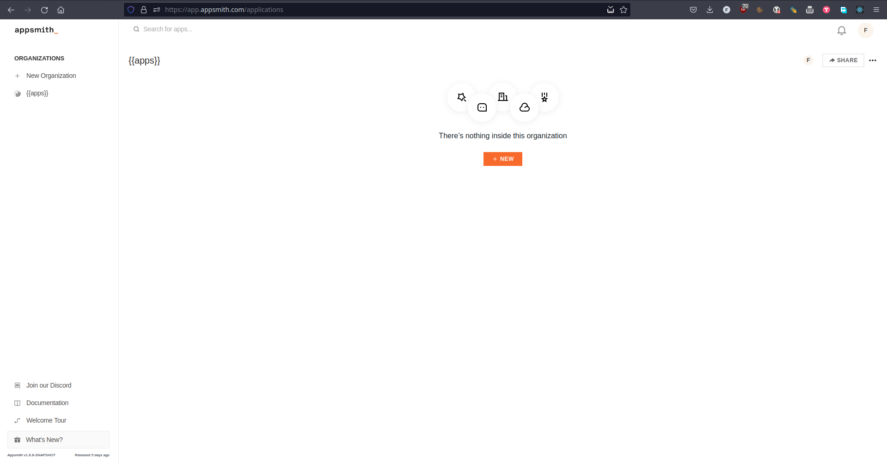

Click "+ New" button, and wait for a second, a brand new application will be created for you.

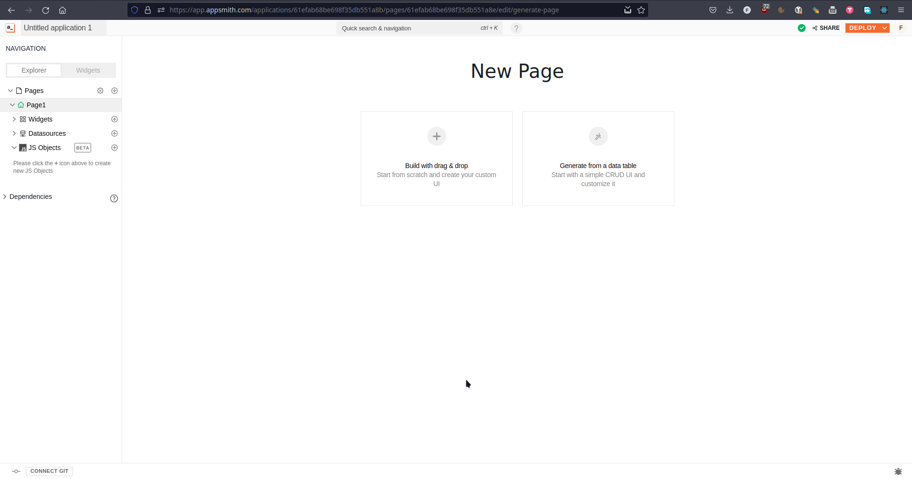

Rename the app to Counter. Click "Widgets", drag a "Text" widget and change the string to "Counter".

There are two things here that I don't like:

1. The "Text" property on the right side pane do not get focused on drag and drop.
2. Hitting enter after entering "Counter" in the text box doesn't save it but introduces a return in the text.

Enter in a text is rarely useful, and when it is required, most apps (slack for example) allows to do so via shift+enter.


Now drop one more text, and two buttons.

Edit the value of the second text (Text2) to `{{ appsmith.store.counter || 0 }}`

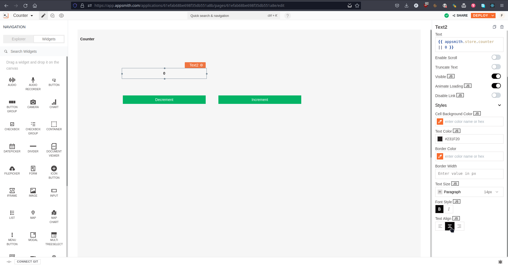

You can rename the components to your wish, but I am keeping them as it is for now.

To enter the decrement logic, click on the onClick (events) section and select "Store value".

The decrement logic is `{{ storeValue('counter', appsmith.store.counter - 1)}}`.

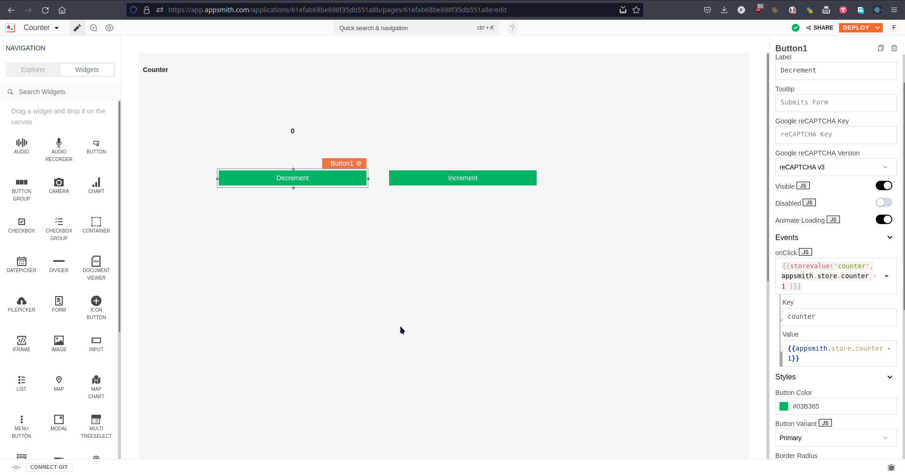

The increment logic should be `{{ storeValue('counter', appsmith.store.counter + 1)}}`.

But the code fails to stay the way we entered in the Value input.

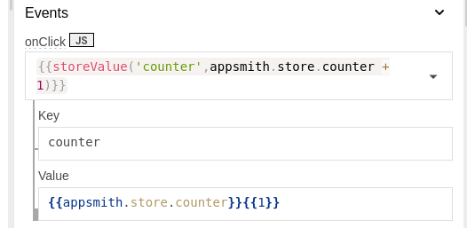

The `+` actually has an issue here.

Even `{{ parseInt(appsmith.store.counter || "0") + 1 }}` and `{{ ((parseInt(appsmith.store.counter || "0")) + 1) }}` are mangled to the `{{}}{{1}}` form.

The `Value` stays mangled: `{{appsmith.store.counter}}{{1}}`.

This however is a JS expression (if we had pure JS expression here and no parsing logic), the output of expression above is `1`.

But, we are actually parsing the `Value` field input and making a `{{storeValue('counter', appsmith.store.counter + 1)}}` expression out of it.

This is enough to run the program successfully and we get a working counter app.

Click the "Deploy" button. It opens a new tab and that tab loads the counter app.

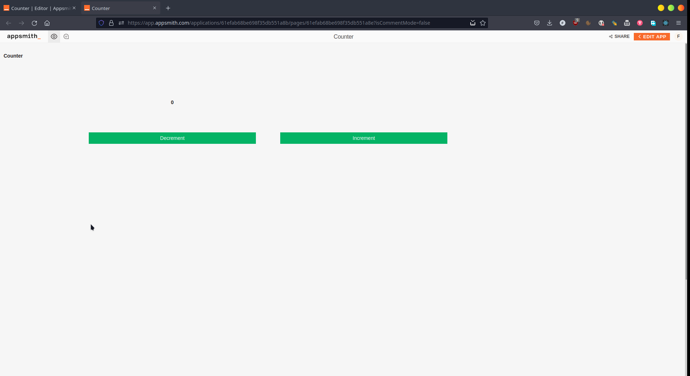

One weird thing to note is that the button click rate is low. It is as if button is stopping us from clicking it too fast. I guess this is because buttons are supposed to submit a form.

## counter app with postgres database

For this example I am going to use self-hosted version of appsmith.

Read:

1. [../../../postgres/setup/setup-postgres-in-docker.html](../../../postgres/setup/setup-postgres-in-docker.html)
2. [../setup/setup-appsmith-in-docker.html](../setup/setup-appsmith-in-docker.html)
3. [../first-app/first-app.html](../first-app/first-app.html)

### setup database

I am going to fire the SQL:

```sql
create table "counter-with-db"
(
    counter int default 0
);

```

and this will create a table: `counter-with-db` with only one column `counter` and with default value of `0`.

Then I am going to fire an insert command which will populate the table with one row.

```sql
INSERT INTO public."counter-with-db" (counter) VALUES (DEFAULT)
```

### Lets create another app: CounterWithDB

#### connect the table as datasource in appsmith

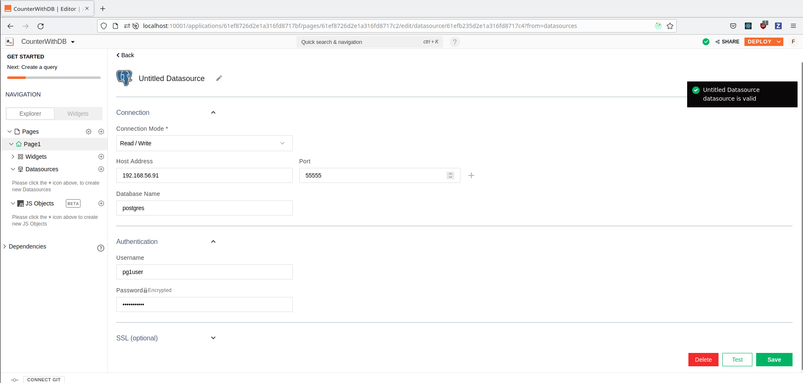

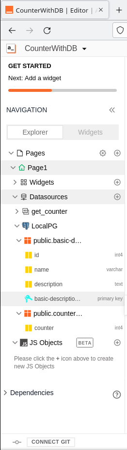

This is amazing, not only the table is described here, I can add a query right from here too.

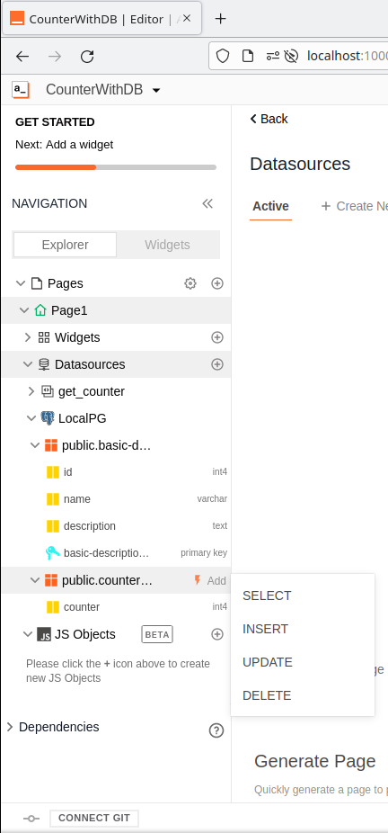

Clicking on "SELECT" opens a query editor.

Running the query as it is runs into errors.

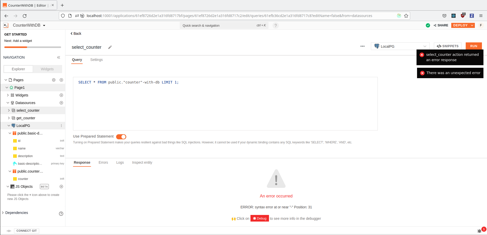


Two things:

1. The position of errors is weird. Its a black tiny block of message which comes and goes from one side. How to I see that again?
2. The SQL query has an issue, the quotes are incorrectly applied to first word after the schema name and the dot.

However there is an error window, which can be accessed by clicking aptly iconised bug.

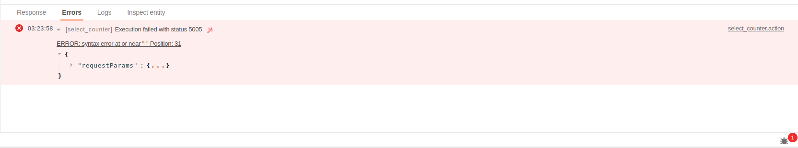

But, this error and its representation are not the same as the black error messages from above.

#### The fix?

Add quotes around the whole table name.

And it works.

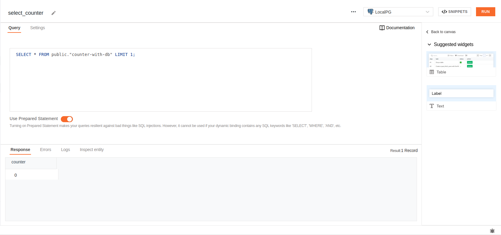

There are few good things here:

1. The error clears out.
2. The bug is not burdened with a round number on its shoulder.
3. The output looks nice in "Response" tab.
4. A couple of widgets are suggested.

But we are not going to use suggested widgets in this post. All we need is this value, and a way to update it on buttons' click.

#### Update query

The generated query has same problem with quotes here too.

```sql
UPDATE public."counter"-with-db SET
    WHERE 1 = 0; -- Specify a valid condition here. Removing the condition may update every row in the table!
```

While writing query, I realized two of my mistakes.

1. I don't want to keep a state in appsmith object this time, so how am I going to get the value and pass its increment or decrement.
2. I can create two queries that increment and decrement.

```sql
UPDATE public."counter-with-db" SET counter = (select counter from public."counter-with-db" LIMIT 1) + 1;
```

I test ran this command a few times, and it did actually work. It updated the value in the table.


```sql
update public."counter-with-db" SET counter = (select counter from public."counter-with-db" limit 1) - 1;
```

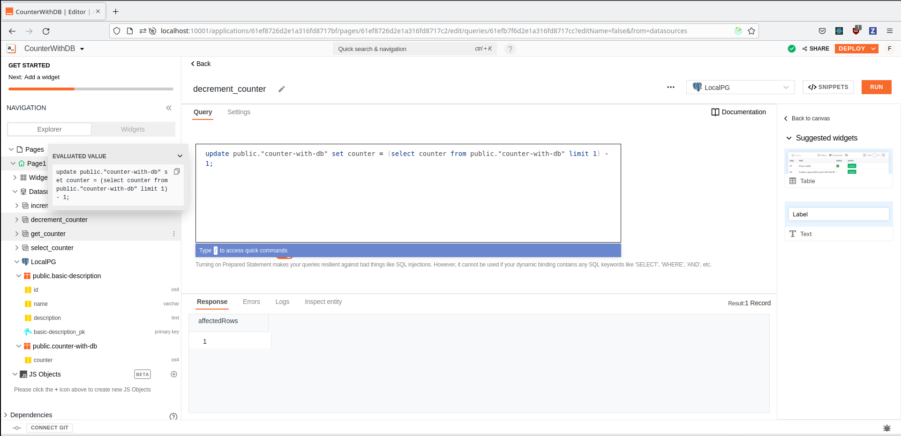

#### adding components on the canvas

Drop a text, value it "Counter with Database".

Drop another text, this will hold our value, assign it `{{select_counter.data[0].counter}}`.

Add a button, call it "Decrement" and assign it a query:decement_counter. The value will look like `{{decrement_counter.run()}}`.

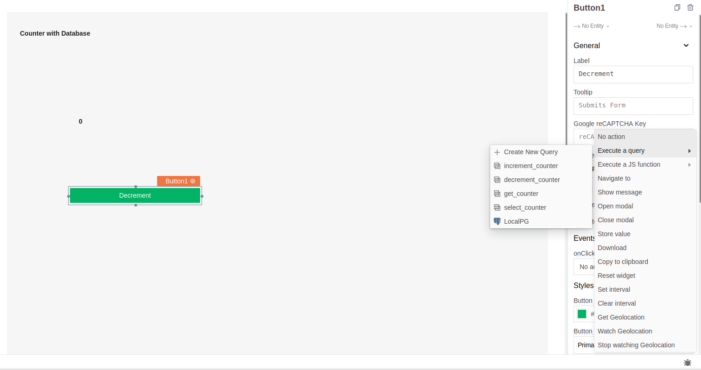

Similarly drop another button and assign it `{{increment_counter.run()}}`.

Deploy it, and...

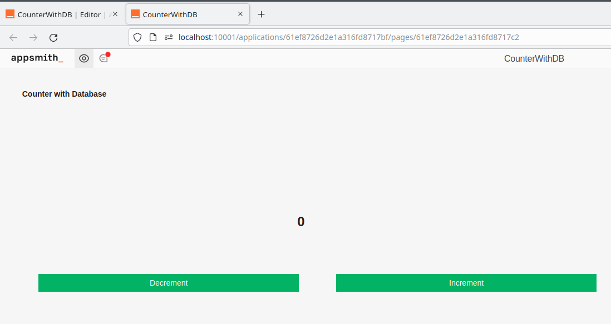

But the database shows updated value.

Back to editing the value.

While editing the value, I met this horrible issue, the error messages come above the "Text" input. How am I suppost to edit now?

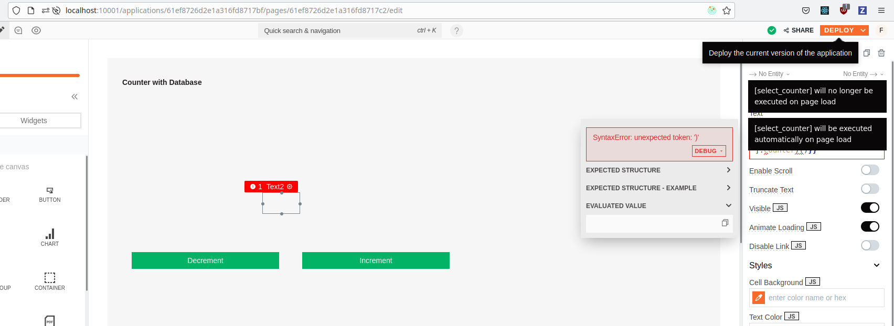

Then I edited to the text value to

```
{{ (function () {
        return select_counter.data[0].counter
    })()
}}
```

This too work only on page load.

Wait, did earlier code work only once, as in, when I assigned the value `select_counter.data[0].counter || 0`, it assigned the value only once and didn't update on page reload. No.

Even earlier code was updating the value on page reload.

I am going to hack the update logic to poll every second. Bad, but it is not clear as of right now what else I can do here.

```
{{ ( const value = 0;
setInterval(function () {
        value = select_counter.data[0].counter
    }, 1000);
    return value;)()
}}
```

Well, this doesn't work. Why should it, it is hack and incorrect logic. Even though setInterval will work every second, the value is already returned. MEMORY LEAK!!!

I need reactivity. I don't see it here.

Let me take a look at the other events.

After a while I guessed if I have a on success callback, I can fetch updated value, and it might update the counter. I was hoping for magical bindings, and it worked.

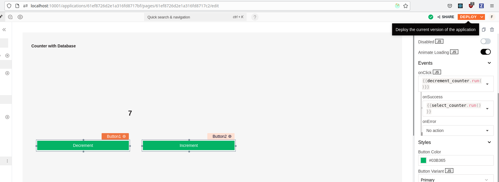

Do this for "Increment" too.

My guess is that the state is maintained in such a way that when a variable is changed, actions or (work) flows based on that values receive the updated values. I guess rxjs?? Gotta see under the hood.

Here is the running application video on YouTube: https://www.youtube.com/watch?v=BFfKBeuaYw8

I didn't have quiet enough environment to create one with audio yet, soon.

This ends our little experiment with creating a counter app with database.

So far we have used `appsmith.store` and postgres database to create our counter apps.

## Counter app with Google Sheets

Here is what the sheet looks like:

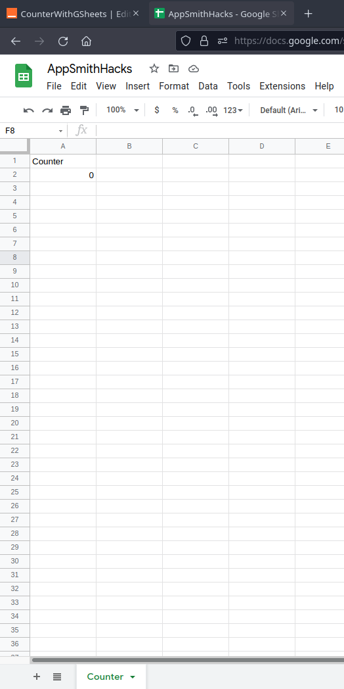

A few things to keep in minde:

1. The name of the document is "AppSmithHacks".
2. The name of the sheet is "Counter".
3. The name of the column header is "Counter".
4. The initial value is 0.

We might need to be careful to see if the value returned to us via appsmith after processing is of the type string or number.

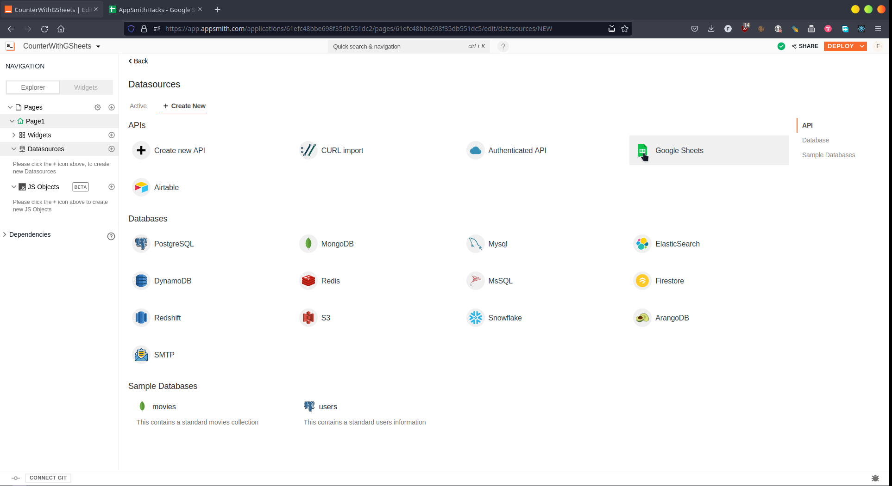

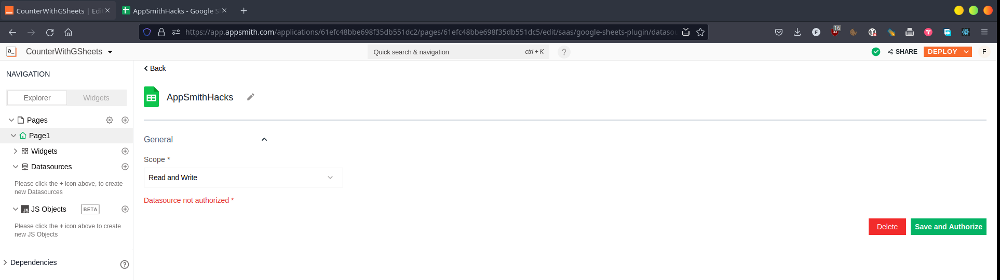

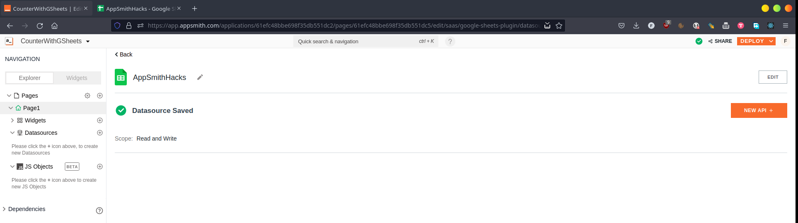

Provide the values required and click Run.

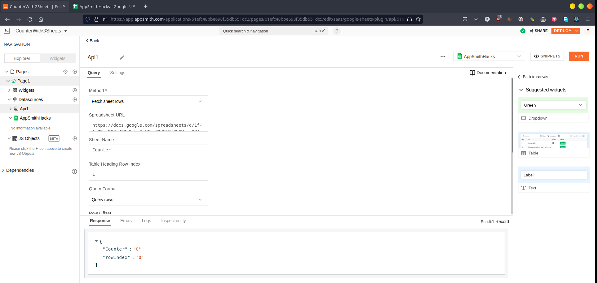

The response is an object, and we need to keep track of this object for the current value of the counter.

```json
{
"Counter":"0"
"rowIndex":"0"
}
```

Lets create increment_counter query.


1. I don't know how to get the value.
2. I don't know what the structure of the update query be.

I mean, how do I access the first_column of the first_row_after_header to insert the new_value. And how do I generate this new value.

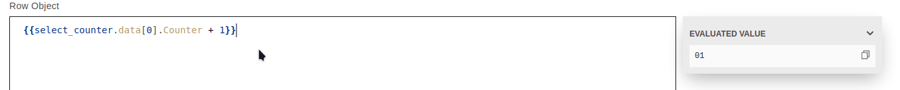

```
{{
parseInt(select_counter.data[0].Counter) + 1
}}
```

The code above returns a number, which we need.

I think the increment query is done if this value somehow gets stored. Don't you think?

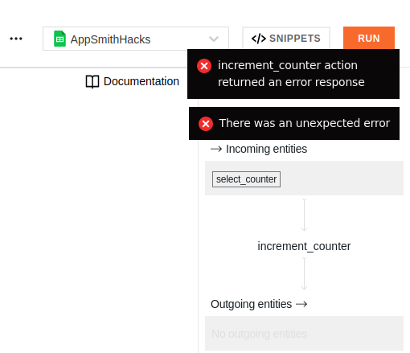

The helpful error message is saying something about string and number mismatch while serialization, I don't know.

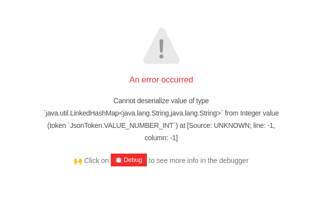

The error message string "Cannot deserialize value of type `java.util.LinkedHashMap<java.lang.String,java.lang.String>` from Integer value (token `JsonToken.VALUE_NUMBER_INT`) at [Source: UNKNOWN; line: -1, column: -1]" whacks the google.

The code below doesn't solve the issue either, I thought it was related to our value being a number, but it is not.

```
{{(parseInt(select_counter.data[0].Counter) + 1).toString()}}
```

### queries

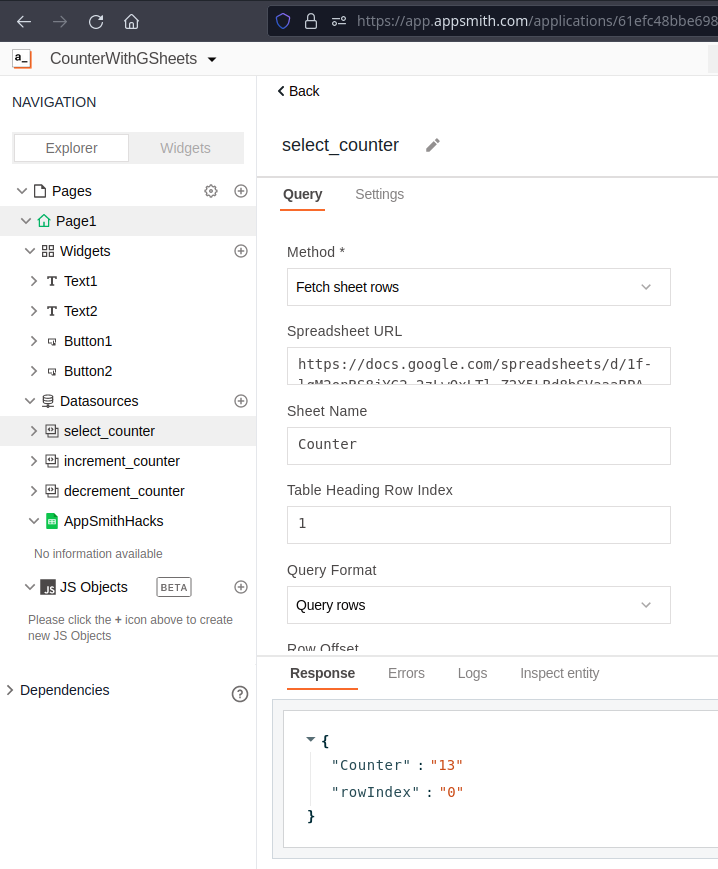

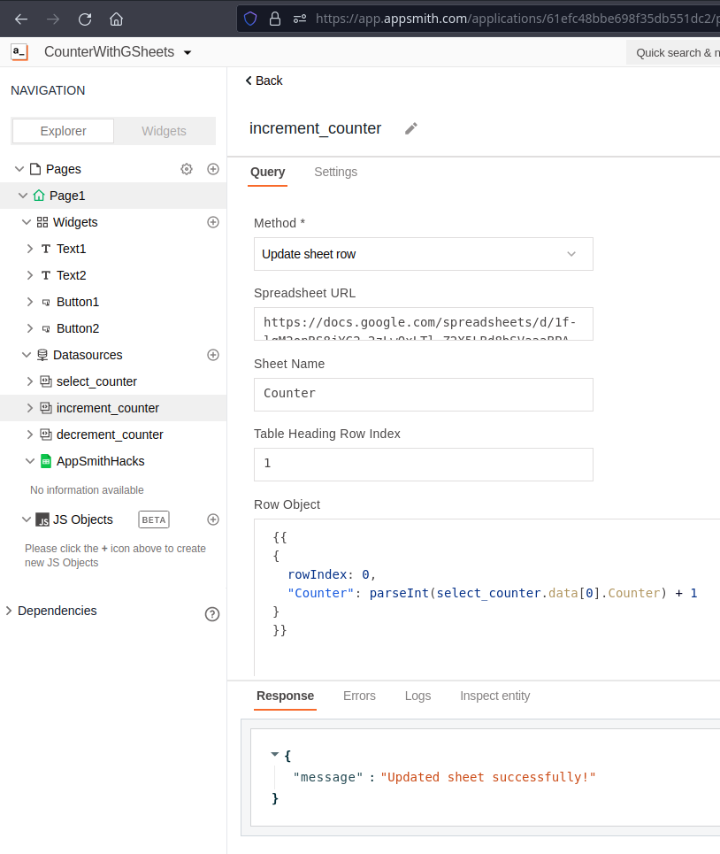

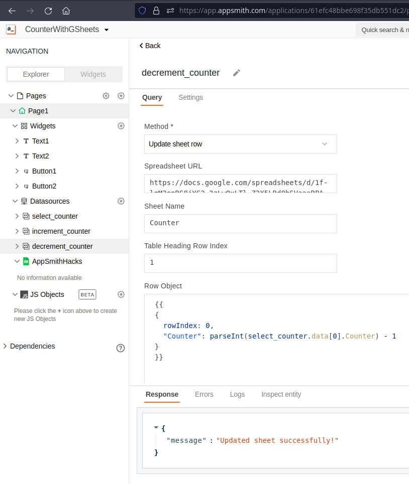

### the page

It is very basic, and just repetitive.

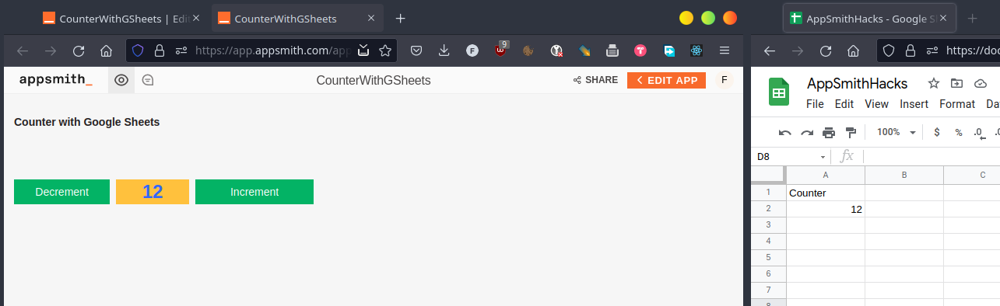

## The end

This marks the end of era where I'd write about appsmith, beause I am not in dev rel or user education.

And because I was told that the videos that I created to highlight the bugs would create a negative impact.

</body>
</html>
