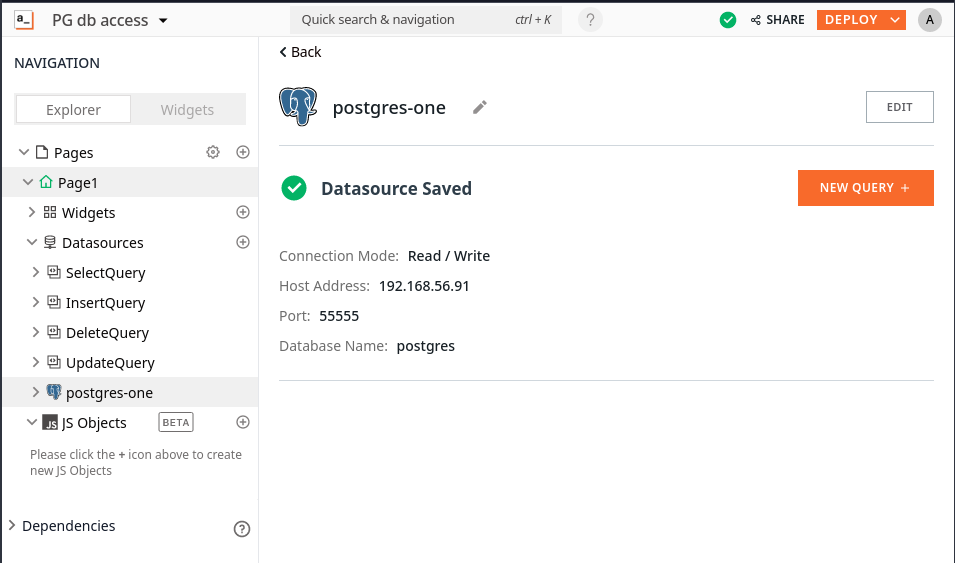
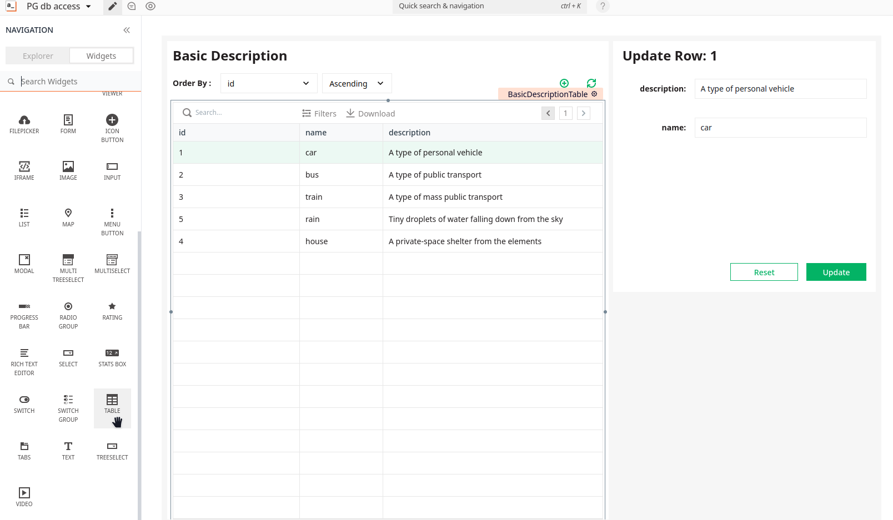
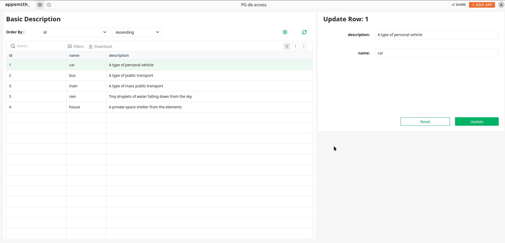

<html lang="en">
<head>
    <meta charset="UTF-8">
    <meta name="viewport" content="width=device-width, initial-scale=1">
    <title>blog.f0c1s.com/low-code/appsmith/first-app</title>
    <link rel="stylesheet" href="../../../index.css"/>
    
</head>
<body onload="setup()">
<h1>
    /f0c1s/blog/low-code/appsmith/first-app
</h1>
<nav>
    <a href="../../../index.html">/blog</a>
    <a href="../../../low-code/index.html">low-code</a>
    <a href="../../../low-code/appsmith/index.html">appsmith</a>
    <a href="../../../low-code/appsmith/first-app/first-app.html">+ first-app</a>

</nav>

## Setup Postgres and Redis

- [Setup postgres in docker](../../../postgres/setup/setup-postgres-in-docker.html)
- [Setup redis in docker](../../../redis/setup/setup-redis-in-docker.html)

## Added data source

## A table widget

Drag and drop a table widget from the widgets pane onto the canvas.

## Deployed app

</body>
</html>
