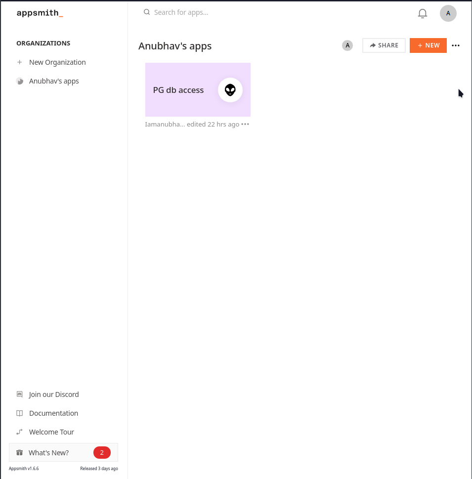

<html lang="en">
<head>
    <meta charset="UTF-8">
    <meta name="viewport" content="width=device-width, initial-scale=1">
    <title>blog.f0c1s.com/low-code/appsmith/setup-appsmith-in-docker</title>
    <link rel="stylesheet" href="../../../index.css"/>
    <script src="../../../setup.js" async></script>
</head>
<body onload="setup()">
<h1>
    /f0c1s/blog/low-code/appsmith/setup-appsmith-in-docker
</h1>
<nav>
    <a href="../../../index.html">/blog</a>
    <a href="../../../low-code/index.html">low-code</a>
    <a href="../../../low-code/appsmith/index.html">appsmith</a>
    <a href="../../../low-code/appsmith/setup/setup-appsmith-in-docker.html">+ setup appsmith in docker</a>

</nav>

## setup appsmith

```shell
docker pull appsmith/appsmith-ce
docker run --name appsmith -p 10001:80 -p 10002:9001 -v /home/f0c1s/Data/appsmith-stacks:/appsmith-stacks -d appsmith/appsmith-ce:latest
docker logs -f appsmith
```


- It requires an internet connection, to work and is not fully offline/self-host.



</body>
</html>
