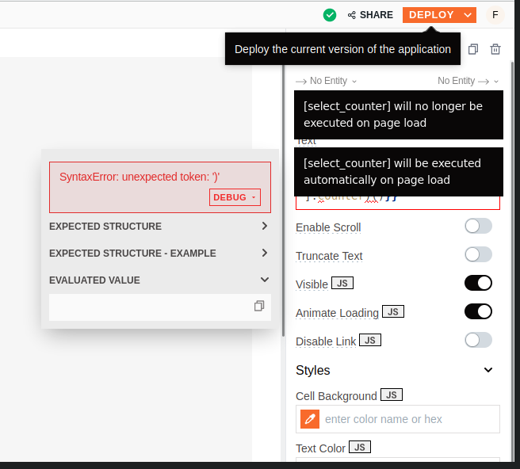
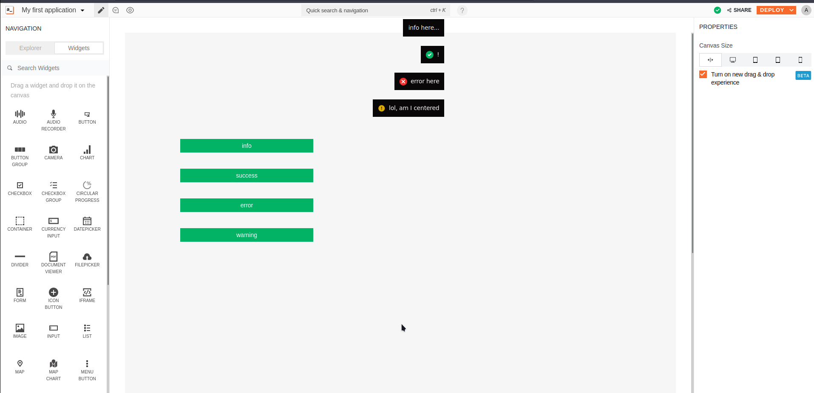
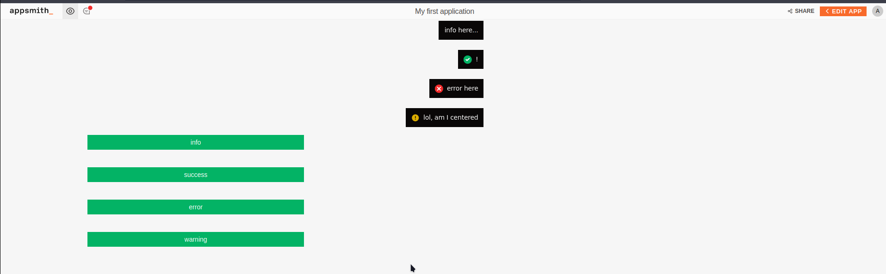
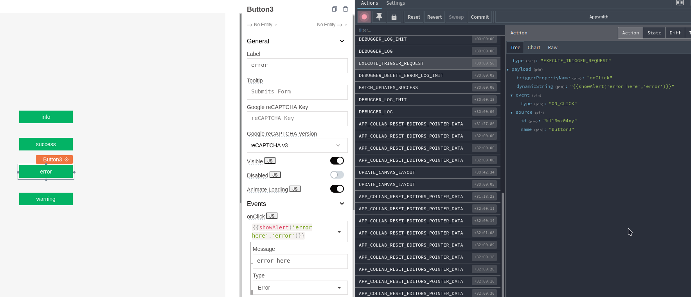
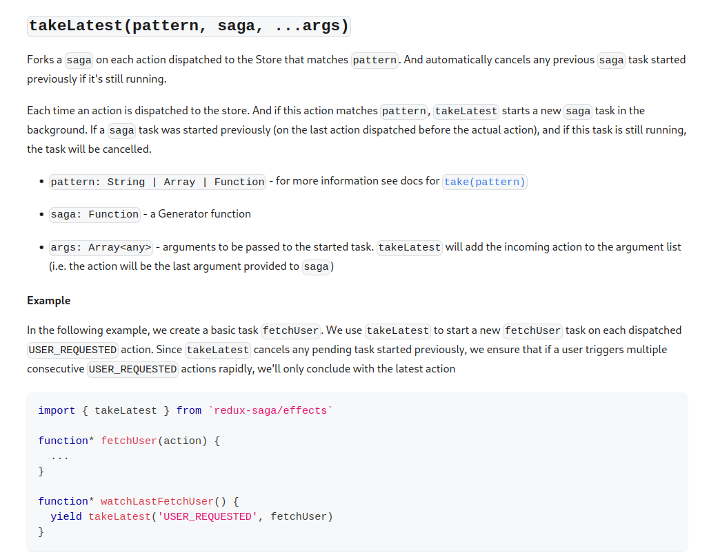
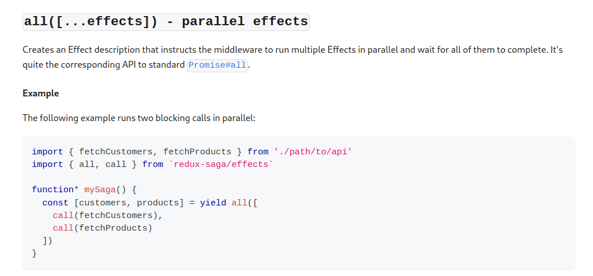
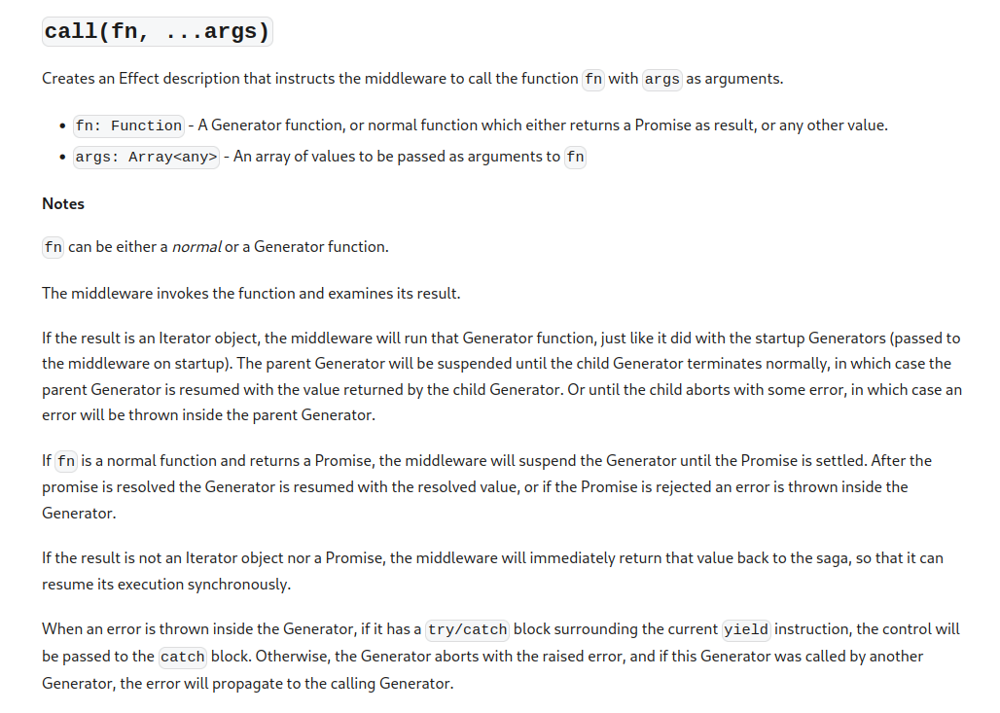
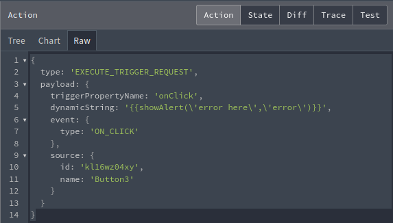

<html lang="en">
<head>
    <meta charset="UTF-8">
    <meta name="viewport" content="width=device-width, initial-scale=1">
    <title>blog.f0c1s.com/low-code/appsmith/toast-bug-10635</title>
    <link rel="stylesheet" href="../../../index.css"/>
    <link rel="stylesheet" href="../../../highlight/styles/monokai.min.css"/>
    <script src="../../../setup.js" async></script>
    <script src="../../../highlight/highlight.min.js"></script>
    <script>hljs.highlightAll();</script>
</head>
<body onload="setup()">
<h1>
    /f0c1s/blog/low-code/appsmith/toast-bug-10635
</h1>
<nav>
    <a href="../../../index.html">/blog</a>
    <a href="../../../low-code/index.html">low-code</a>
    <a href="../../../low-code/appsmith/index.html">appsmith</a>
    <a href="../../../low-code/appsmith/toast-bug-10635/toast-bug-10635.html">+ toast bug #10635</a>

</nav>

## Bug 10635

- [gh bug page](https://github.com/appsmithorg/appsmith/issues/10635)

The issue was when I was editing the code, a few toasts came up and covered the text I was still editing. I find them intrusive.

There are other issues with that too, the top position where toasts start from is surprising `8em` from the top.

I want toasts to be centered and start from right below the top bar or even from the top.



## Fix

I was able to hack the `app/client/src/components/ads/Toast.tsx` file and make two changes:

```typescript
.Toastify__toast-container--top-center {
    top: 2rem;
  }
```

This brings us to:



Above, is the edit mode. Below, is the deployed mode.



This gave it a strange look. Thus I applied minimum width.

```typescript
const ToastTextWrapper = styled.div`
  flex: 1;
  min-width: 15vw;
`;
```


This looks much better, except I need to figure out a way to differentiate between system generated errors and user generated `alerts`.

### redux call




```
{
  type: 'EXECUTE_TRIGGER_REQUEST',
  payload: {
    triggerPropertyName: 'onClick',
    dynamicString: '{{showAlert(\'error here\',\'error\')}}',
    event: {
      type: 'ON_CLICK'
    },
    source: {
      id: 'kl16wz04xy',
      name: 'Button3'
    }
  }
}
```

### ActionExecutionSagas.ts

Tracking the `EXECUTE_TRIGGER_REQUEST`, I reached `app/client/src/sagas/ActionExecution/ActionExecutionSagas.ts`

```typescript
export function* watchActionExecutionSagas() {
  yield all([
    takeEvery(
      ReduxActionTypes.EXECUTE_TRIGGER_REQUEST,
      initiateActionTriggerExecution,
    ),
    takeLatest(
      ReduxActionTypes.SET_APP_VERSION_ON_WORKER,
      setAppVersionOnWorkerSaga,
    ),
    takeLatest(ReduxActionTypes.EVALUATE_SNIPPET, evaluateSnippetSaga),
    takeLatest(ReduxActionTypes.EVALUATE_ARGUMENT, evaluateArgumentSaga),
  ]);
}
```

This function is calling `initiateActionTriggerExecution`.

But before that, redux-saga/core is involved a little bit.

Take a look at [takeEvery](https://redux-saga.js.org/docs/api/#takeeverypattern-saga-args){.in} and
[takeLatest](https://redux-saga.js.org/docs/api/#takelatestpattern-saga-args){.in}.


From this we understand that `ReduxActionTypes.EXECUTE_TRIGGER_REQUEST` is `pattern` and `initiateActionTriggerExecution` is `saga`.



`takeLatest` works on `(pattern, saga)` too.

I realized that I also need to look at `all`.

[all](https://redux-saga.js.org/docs/api/#alleffects---parallel-effects)



### initiateActionTriggerExecution

```typescript
function* initiateActionTriggerExecution(
  action: ReduxAction<ExecuteTriggerPayload>,
) {
  const { event, source, triggerPropertyName } = action.payload;
  // Clear all error for this action trigger. In case the error still exists,
  // it will be created again while execution
  AppsmithConsole.deleteError(`${source?.id}-${triggerPropertyName}`);
  try {
    yield call(executeAppAction, action.payload);
    if (event.callback) {
      event.callback({ success: true });
    }
  } catch (e) {
    if (e instanceof UncaughtPromiseError || e instanceof TriggerFailureError) {
      logActionExecutionError(e.message, source, triggerPropertyName);
    }
    // handle errors here
    if (event.callback) {
      event.callback({ success: false });
    }
    log.error(e);
  }
}
```

We know the `action` from the redux section above.

#### app/client/src/utils/AppsmithConsole.ts

```typescript
// This is used to remove an error from the errors tab
function deleteError(id: string, analytics?: Log["analytics"]) {
  dispatchAction(deleteErrorLogInit(id, analytics));
}
```

#### call

[call](https://redux-saga.js.org/docs/api/#callfn-args)



`executeAppAction` is `fn` and `action.payload` is `args`.

#### `executeAppAction`

```typescript
export function* executeAppAction(payload: ExecuteTriggerPayload) {
  const {
    dynamicString,
    event: { type },
    responseData,
    source,
    triggerPropertyName,
  } = payload;
  log.debug({ dynamicString, responseData });
  if (dynamicString === undefined) {
    throw new Error("Executing undefined action");
  }

  yield call(
    evaluateAndExecuteDynamicTrigger,
    dynamicString,
    type,
    { source, triggerPropertyName },
    responseData,
  );
}
```

If you notice we have something called `dynamicString`. This is basically generated from the values developer provides, and needs parsing to JS.



#### app/client/src/sagas/EvaluationsSaga.ts

```typescript
/*
 * Used to evaluate and execute dynamic trigger end to end
 * Widget action fields and JS Object run triggers this flow
 *
 * We start a duplex request with the worker and wait till the time we get a 'finished' event from the
 * worker. Worker will evaluate a block of code and ask the main thread to execute it. The result of this
 * execution is returned to the worker where it can resolve/reject the current promise.
 */
export function* evaluateAndExecuteDynamicTrigger(
  dynamicTrigger: string,
  eventType: EventType,
  triggerMeta: TriggerMeta,
  callbackData?: Array<any>,
) {
  const unEvalTree = yield select(getUnevaluatedDataTree);
  log.debug({ execute: dynamicTrigger });

  const { requestChannel, responseChannel } = yield call(
    worker.duplexRequest,
    EVAL_WORKER_ACTIONS.EVAL_TRIGGER,
    { dataTree: unEvalTree, dynamicTrigger, callbackData },
  );
  let keepAlive = true;

  while (keepAlive) {
    const { requestData } = yield take(requestChannel);
    log.debug({ requestData });
    if (requestData.finished) {
      keepAlive = false;
      /* Handle errors during evaluation
       * A finish event with errors means that the error was not caught by the user code.
       * We raise an error telling the user that an uncaught error has occured
       * */
      if (requestData.result.errors.length) {
        throw new UncaughtPromiseError(
          requestData.result.errors[0].errorMessage,
        );
      }
      // It is possible to get a few triggers here if the user
      // still uses the old way of action runs and not promises. For that we
      // need to manually execute these triggers outside the promise flow
      const { triggers } = requestData.result;
      if (triggers && triggers.length) {
        log.debug({ triggers });
        yield all(
          triggers.map((trigger: ActionDescription) =>
            call(executeActionTriggers, trigger, eventType, triggerMeta),
          ),
        );
      }
      // Return value of a promise is returned
      return requestData.result;
    }
    yield call(evalErrorHandler, requestData.errors);
    if (requestData.trigger) {
      // if we have found a trigger, we need to execute it and respond back
      log.debug({ trigger: requestData.trigger });
      yield spawn(
        executeTriggerRequestSaga,
        requestData,
        eventType,
        responseChannel,
        triggerMeta,
      );
    }
  }
}
```


</body>
</html>
