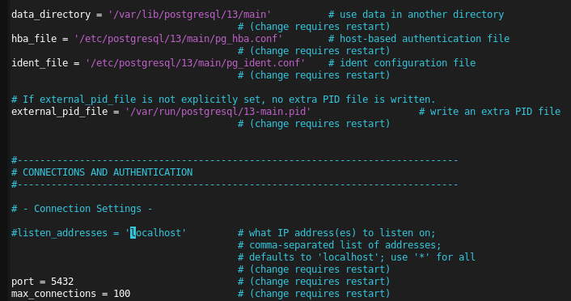
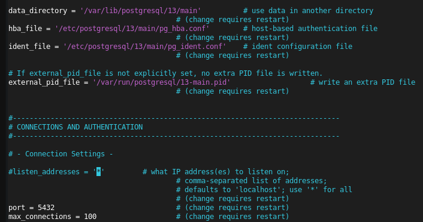
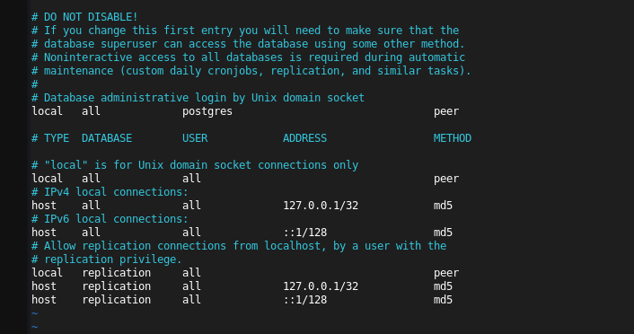
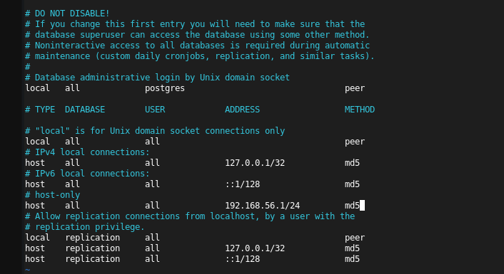
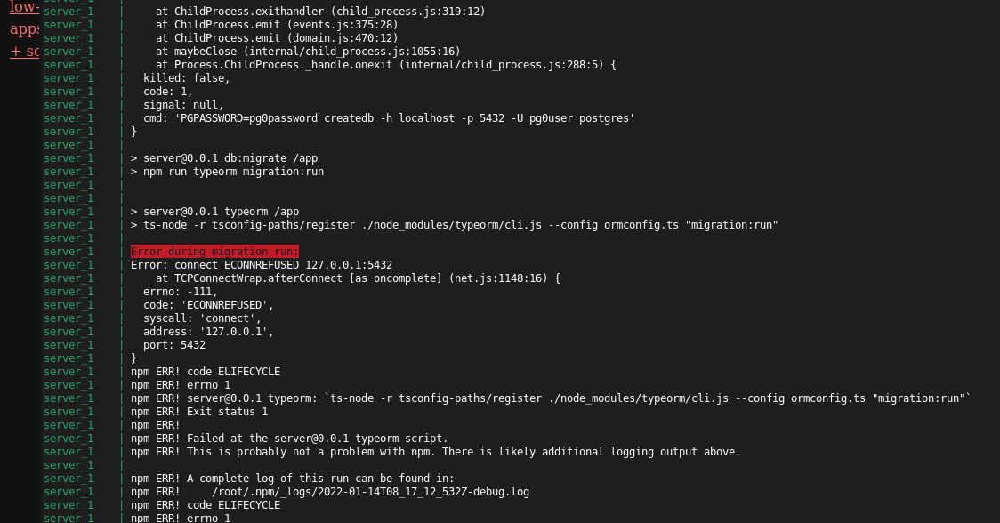
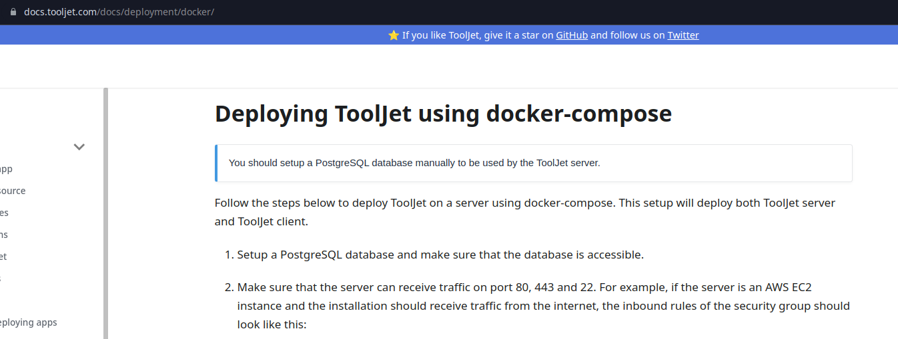

<html lang="en">
<head>
    <meta charset="UTF-8">
    <meta name="viewport" content="width=device-width, initial-scale=1">
    <title>blog.f0c1s.com/low-code/tooljet/setup-tooljet-in-docker</title>
    <link rel="stylesheet" href="../../../index.css"/>
    <script src="../../../setup.js" async></script>
</head>
<body onload="setup()">
<h1>
    /f0c1s/blog/low-code/tooljet/setup-tooljet-in-docker
</h1>
<nav>
    <a href="../../../index.html">/blog</a>
    <a href="../../../low-code/index.html">low-code</a>
    <a href="../../../low-code/tooljet/index.html">tooljet</a>
    <a href="../../../low-code/tooljet/setup/setup-tooljet-in-docker.html">+ setup tooljet in docker</a>

</nav>

## nvm

```shell
curl -o- https://raw.githubusercontent.com/nvm-sh/nvm/v0.39.1/install.sh | bash
nvm install v14
npm i -g npm
```

## docker-compose

```shell
curl -L "https://github.com/docker/compose/releases/download/1.29.2/docker-compose-$(uname -s)-$(uname -m)" -o /usr/local/bin/docker-compose
chmod +x /usr/local/bin/docker-compose
ln -s /usr/local/bin/docker-compose /usr/bin/docker-compose
```

## fetch source

```shell
git clone --depth=1 https://github.com/ToolJet/ToolJet.git
cd ToolJet/
cp .env.example .env
cp .env.example .env.test
openssl rand -hex 64 # SECRET_KEY_BASE in .env
openssl rand -hex 32 # LOCKBOX_MASTER_KEY in .env

```

It requires a postgresql instance running on 5432 port. I couldn't get it to accept docker. I guess it requires creds for postgres.

## install postgresql

```shell
apt install postgresql
pg_ctlcluster 13 main start
```

### edit `/etc/postgresql/13/main/postgresql.conf`



Change `'localhost'` to `'*'`.



### edit `/etc/postgresql/13/main/pg_hba.conf`





## restart cluster

```shell
pg_ctlcluster 13 main restart
```

## setup password

```shell
root@debian:/home/f0c1s/github/ToolJet# sudo -u postgres psql
psql (13.5 (Debian 13.5-0+deb11u1))
Type "help" for help.

postgres=# \password pg0user
Enter new password:
Enter it again:
postgres=#
```

## docker-compose

```shell
docker-compose build
docker-compose up
```

Couldn't run. It installs its own `pgctl_cluster 11`.

Why? WTF?

```shell
f0c1s@debian:~/github/ToolJet$ docker-compose up
Creating tooljet_postgres_1 ...
Creating tooljet_postgres_1 ... error
WARNING: Host is already in use by another container

ERROR: for tooljet_postgres_1  Cannot start service postgres: driver failed programming external connectivity on endpoint tooljet_postgres_1 (8635e75883ebedff16ad809c658241564c35a7a47ba61b85a2667f0548f0badd): Error starting userland proxy: listen tcp4 0.0.0.0:5432: bind: address already in use

^CGracefully stopping... (press Ctrl+C again to force)
f0c1s@debian:~/github/ToolJet$ su
Password:
root@debian:/home/f0c1s/github/ToolJet# pgctl_cluster 13 main stop
bash: pgctl_cluster: command not found
root@debian:/home/f0c1s/github/ToolJet# pg_ctlcluster 13 main stop
root@debian:/home/f0c1s/github/ToolJet# apt remove postgresql
Reading package lists... Done
Building dependency tree... Done
Reading state information... Done
The following packages will be REMOVED:
  postgresql
0 upgraded, 0 newly installed, 1 to remove and 1 not upgraded.
After this operation, 69.6 kB disk space will be freed.
Do you want to continue? [Y/n]
(Reading database ... 140550 files and directories currently installed.)
Removing postgresql (13+225) ...
```

It wants to run its own postgresql db on port 5432.





When you are installing it yourself and don't accept a value from me. Fuck this shit.

## Remove this garbage

```shell
f0c1s@debian:~/github/ToolJet$ cd ..

f0c1s@debian:~/github$ rm -rf ToolJet/

f0c1s@debian:~/github$ docker images
REPOSITORY              TAG              IMAGE ID       CREATED          SIZE
tooljet-server          development      0b0f367da1da   7 minutes ago    1.67GB
tooljet-client          development      f6af7a47b5d9   7 minutes ago    1.26GB
<none>                  <none>           af492e32b3b3   10 minutes ago   1.67GB
<none>                  <none>           fa9340a17e4f   11 minutes ago   1.26GB
<none>                  <none>           f5fd39881d6d   13 minutes ago   1.26GB
redislabs/redismod      latest           c53701fdb006   3 days ago       1.29GB
appsmith/appsmith-ce    latest           aaf18c554646   4 days ago       1.37GB
hoppscotch/hoppscotch   latest           7ad42d5e82c9   8 days ago       1.04GB
postgres                13               0896a8e0282d   10 days ago      371MB
postgres                latest           07e2ee723e2d   10 days ago      374MB
redis                   latest           7614ae9453d1   3 weeks ago      113MB
mongo                   latest           dfda7a2cf273   5 weeks ago      693MB
node                    14.17.3-buster   8652c5a1ceaf   5 months ago     912MB
node                    14.17.3-alpine   f5f48375fc5d   6 months ago     117MB

f0c1s@debian:~/github$ docker images | sed '1d' | head -n5 | awk '{print $3}' | xargs -n1 docker rmi
Untagged: tooljet-server:development
Deleted: sha256:0b0f367da1da73b41519290a1efe733a774264514bce73f6c68c04a6197b2e6d
Deleted: sha256:aff4c990629e16289388c79081d4e9633ab878cafe28b634685962ca0a9eddaa
Deleted: sha256:c60be1cfb2168c783998285c0abbff2e5004a7076751b718557330a14018d598
Deleted: sha256:c5abf8e823965f18d1e97a3d228bb7996e660c093925aaa519eac7c678b168f7
Deleted: sha256:9af78e0b71215a315bb2754abdd83690188862fae6b3e65d8587d3f095faf6b3
Untagged: tooljet-client:development
Deleted: sha256:f6af7a47b5d9401db9696139d5db224368a6c26adbdf8b990045bc8922493fea
Deleted: sha256:2ddcacc3363e7ebdd62f7b77010baf203d7d1b3326506755cd29f20664ad5250
Deleted: sha256:fd354ac81d2d92a0f3441c95c171bfea86758f112c30dddad33bce331b9cdad9
Deleted: sha256:c5126faed1feb31b055c0011004dfe7df9c4cdb1af1b2a6bbba8ee58e087b3d7
Deleted: sha256:af492e32b3b3c5d1d745816ea1d646006bca871f057498b1e1ff2fd0b41f6882
Deleted: sha256:4c22b9153e6ca1964825ae2f8d389e7d301970e9d060d2f1eb0baaa90a1af29e
Deleted: sha256:c6527e572ee7090f6cde1dab3cc55f3677deb2d973603f62d1593e0d9a8b4c54
Deleted: sha256:34a970e9154db0b6d2ccb5f0d1321bec5d130bbcb08f11ab3b19b502bd443371
Deleted: sha256:7b3335bdac027b21ece693e1539bcea5ad5c16901090391420b3bfe8b0421b12
Deleted: sha256:cf249be33c364e19737d088c9add41d4a0452c987c1a51141d502ce0bcccd1a1
Deleted: sha256:da91b53a41dc5073edac7be5156eeb607336d11518506d75e2583a0ad9f77421
Deleted: sha256:869f25a279905263b2a7da9096723d948193a7a9262a049059cbabc8f0321f39
Deleted: sha256:19db1acc39545d5bcdcc4d5e7ea9ab8b635a4c44356d2d11247e77898b88e2d0
Deleted: sha256:fa9340a17e4f3389cfed150d6bf6dec450497efcbf096207ce0b77f57d0be490
Deleted: sha256:4359477ec9f9013cf269fd2857890d1a5d677cbfb3a535dc5defaebf917ba86c
Deleted: sha256:88467e76b38575951347e8ee9fffc7877b9c4db3fe3289e48fe16eff2a2fa50f
Deleted: sha256:562b30d10c930e8c4af5a7529d481f5236e7f0da9251539287da154e60344646
Deleted: sha256:f5fd39881d6dd15a091c5e3ee0990f5168682cba09f09fb3352fa353bbf3bbe6
Deleted: sha256:f5a5d496a0f5c6c2b83d01ed130e86f19caa9815eb05d3ac5f282e5932c6169e
Deleted: sha256:184ac9952f9dc0fd510fd1cb1055086ed24118bee9a4a4febd12e65c03099f22
Deleted: sha256:972ef0973e809f6dae755f49803b704379608a9ac63e73943262b1cb143f96c8
Deleted: sha256:5ccab521798a31096d5ec3140f4f8b9fda4d7c867cfd9df621cb3e0aaf8f2bae
Deleted: sha256:c570ceaffcf605af2cf9358ee7730b4d23dc8d6076ba84559d52811c4b7be663

```

</body>
</html>
