<html lang="en">
<head>
    <meta charset="UTF-8">
    <meta name="viewport" content="width=device-width, initial-scale=1">
    <title>/f0c1s/blog/react-web-dev/counter</title>
    <link rel="stylesheet" href="../../index.css"/>
    <link rel="stylesheet" href="../../highlight/styles/monokai.min.css"/>
    <script src="../../setup.js"></script>
    <script src="../../highlight/highlight.min.js"></script>
    <script>hljs.highlightAll();</script>
</head>

<body class="aoc 2021 aoc2021" onload="setup()">
<h1>/f0c1s/blog/react-web-dev/counter</h1>
<nav>
    <a href="../../index.html">/blog</a>
    <a href="../../react-web-dev/index.html">react web dev</a>
    <a href="../../react-web-dev/counter/counter.html">+ counter</a>
</nav>

## Plain react

```shell
yarn create react-app counter-1 --template typescript
cd counter-1
yarn start
```

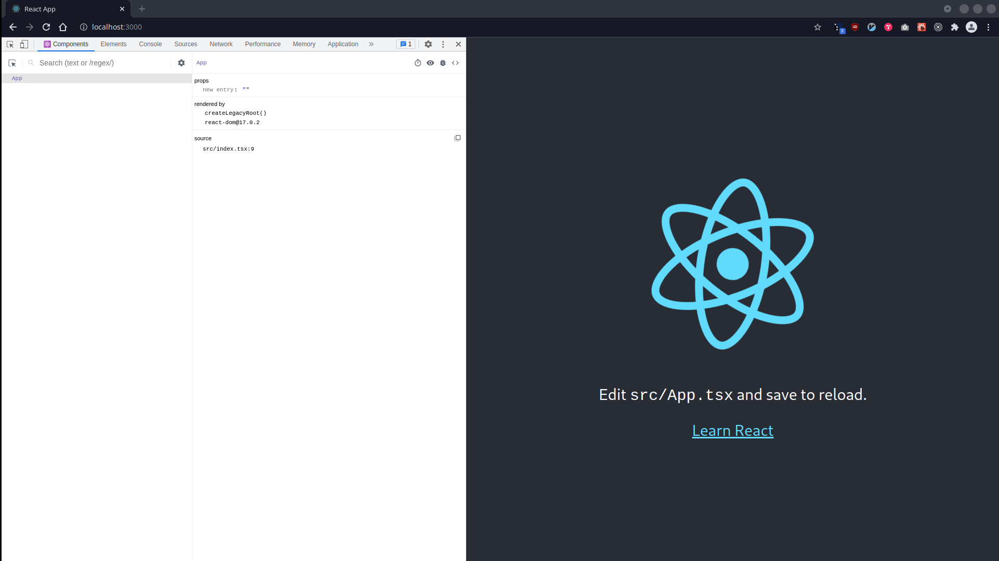

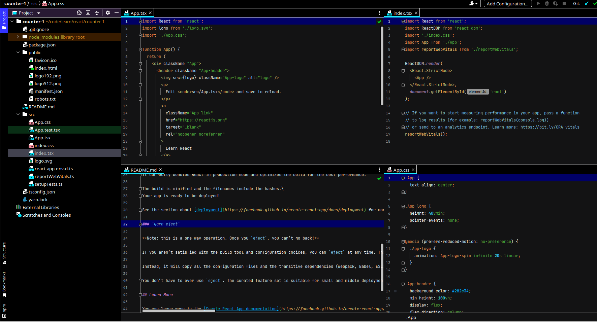

### Making changes to existing project

#### App.css

```css
h1 {
    margin: 0;
    color: red;
    background-color: #333;
    padding: 1rem;
    font-weight: bold;
    text-shadow: 2px 2px 2px black;
    text-transform: uppercase;
}
```

#### App.tsx

```typescript
import React from 'react';
import './App.css';

function App() {
  return (
    <div className="App">
      <h1>counter 1</h1>

    </div>
  );
}

export default App;

```

### Introducing components counter and counter-display

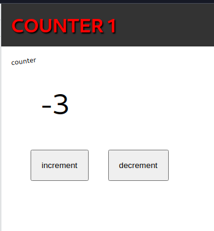

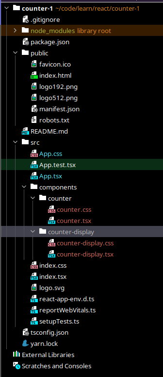

#### App.tsx

```typescript
import React from 'react';
import './App.css';
import Counter from "./components/counter/counter";

function App() {
    return (
        <div className="App">
            <h1>counter 1</h1>
            <Counter/>
        </div>
    );
}

export default App;

```

#### components/counter/counter.tsx

```typescript
import React, {useState} from "react";
import "./counter.css";
import CounterDisplay from "../counter-display/counter-display";

export default function Counter() {
    const [count, setCount] = useState(0);
    return (
        <div className={"counter"}>
            <CounterDisplay count={count}/>
            <div className={"coutner-actions"}>
                <button onClick={() => setCount(count + 1)}>increment</button>
                <button onClick={() => setCount(count - 1)}>decrement</button>
            </div>
        </div>
    );
}

```

#### components/counter/counter.css

```css
.counter {
    margin: 1rem;
    padding: 1rem;
    position: relative;
}

.counter::before {
    content: "counter";
    font-size: 12px;
    position: absolute;
    top: 0;
    left: 0;
    transform: rotate(-7deg);
}

.counter button {
    padding: 1rem;
    margin: 1rem;
    cursor: pointer;
}

```

#### components/counter/counter-display.tsx

```typescript
import React from "react";
import "./counter-display.css";

type CountDisplayPropT = {
    count: number
}

export default function CounterDisplay({count}: CountDisplayPropT) {
    return (<div className={"counter-value"}>{count}</div>);
}

```

#### components/counter/counter-display.css

```css
.counter-value {
    padding: 1rem;
    margin: 1rem;
    font-size: 48px;
}

```

### Moving state outside of components to the main App component


With same structure, here is the code:

#### App.tsx

```typescript
import React, {useState} from 'react';
import './App.css';
import Counter from "./components/counter/counter";

function App() {
    const [count, setCount] = useState(0);
    return (
        <div className="App">
            <h1>counter 1</h1>
            <Counter count={count} setCount={setCount}/>
        </div>
    );
}

export default App;

```

Notice the state is here now, and so is the function that updates it.

#### components/counter/counter.tsx

```typescript
import React from "react";
import "./counter.css";
import CounterDisplay from "../counter-display/counter-display";

type CounterPropT = {
    count: number;
    setCount: Function;
}

export default function Counter({count, setCount}: CounterPropT) {

    return (
        <div className={"counter"}>
            <CounterDisplay count={count}/>
            <div className={"coutner-actions"}>
                <button onClick={() => setCount(count + 1)}>increment</button>
                <button onClick={() => setCount(count - 1)}>decrement</button>
            </div>
        </div>
    );
}

```

Rest of the code didn't require any change.

## Redux Toolkit example

```shell
yarn add @reduxjs/toolkit react-redux
yarn add -D @types/redux @types/react-redux
```

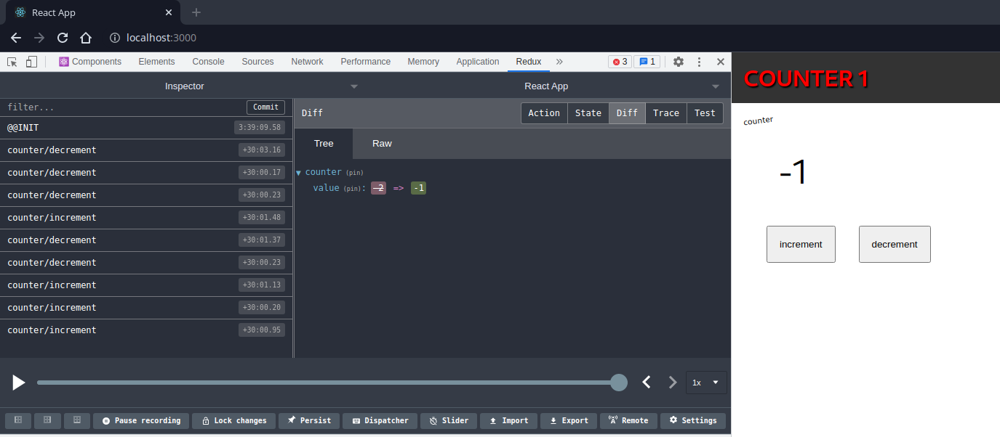

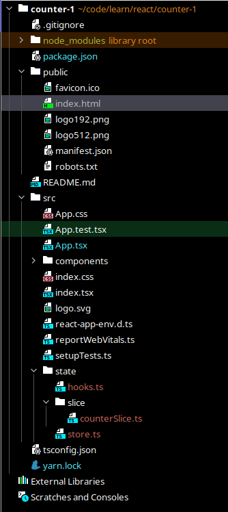

### New files added

- /src/state/hooks.ts
- /src/state/slice/counterSlice.ts
- /src/state/store.ts

#### /src/state/hooks.ts

```typescript
import {TypedUseSelectorHook, useDispatch, useSelector} from "react-redux";
import {AppDispatch, RootState} from "./store";

export const useAppDispatch = () => useDispatch<AppDispatch>();
export const useAppSelector: TypedUseSelectorHook<RootState> = useSelector;

```

#### /src/state/slice/counterSlice.ts

```typescript
import {createSlice} from "@reduxjs/toolkit";

import type {RootState} from "../store";

interface CounterState {
    counter: {
        value: number;
    };
}

const initialState: CounterState = {counter: {value: 0}} as CounterState;

export const counterSlice = createSlice({
    name: 'counter',
    initialState,
    reducers: {
        increment: (state: CounterState) => {
            state.counter.value += 1;
            return state;
        },
        decrement: (state: CounterState) => {
            state.counter.value -= 1;
            return state
        }
    }
});

export const {increment, decrement} = counterSlice.actions;

export const selectCount = (state: RootState) => state.counter.value;

export default counterSlice.reducer;

```

#### /src/state/store.ts

```typescript
import {configureStore} from "@reduxjs/toolkit";
import {counterSlice} from "./slice/counterSlice";

const store = configureStore({
    reducer: counterSlice.reducer
});

export type RootState = ReturnType<typeof store.getState>

export type AppDispatch = typeof store.dispatch

export {store};
```

### Files updated

- /src/App.tsx
- /src/components/counter/counter.tsx

#### /src/App.tsx

```typescript
import React from 'react';
import {Provider} from "react-redux";
import {store} from "./state/store";

import './App.css';

import Counter from "./components/counter/counter";

function App() {
    return (
        <Provider store={store}>
            <div className="App">
                <h1>counter 1</h1>
                <Counter/>
            </div>
        </Provider>
    );
}

export default App;

```

#### /src/components/counter/counter.tsx

```typescript
import React from "react";
import "./counter.css";
import CounterDisplay from "../counter-display/counter-display";

import {useAppSelector, useAppDispatch} from "../../state/hooks";
import {increment, decrement, selectCount} from "../../state/slice/counterSlice";

export default function Counter() {
    const dispatch = useAppDispatch();

    const count = useAppSelector(selectCount);
    return (
        <div className={"counter"}>
            <CounterDisplay count={count}/>
            <div className={"coutner-actions"}>
                <button onClick={() => dispatch(increment())}>increment</button>
                <button onClick={() => dispatch(decrement())}>decrement</button>
            </div>
        </div>
    );
}

```

## I don't understand a word of it.

So let me just figure these out.

### The Slice

```typescript
/**
 * The return value of `createSlice`
 *
 * @public
 */
export interface Slice<
  State = any,
  CaseReducers extends SliceCaseReducers<State> = SliceCaseReducers<State>,
  Name extends string = string
> {
  /**
   * The slice name.
   */
  name: Name

  /**
   * The slice's reducer.
   */
  reducer: Reducer<State>

  /**
   * Action creators for the types of actions that are handled by the slice
   * reducer.
   */
  actions: CaseReducerActions<CaseReducers>

  /**
   * The individual case reducer functions that were passed in the `reducers` parameter.
   * This enables reuse and testing if they were defined inline when calling `createSlice`.
   */
  caseReducers: SliceDefinedCaseReducers<CaseReducers>

  /**
   * Provides access to the initial state value given to the slice.
   * If a lazy state initializer was provided, it will be called and a fresh value returned.
   */
  getInitialState: () => State
}
```

Ok, so Slice Interface is defined as having members: name, reducer, actions, caseReducers and getInitialState.

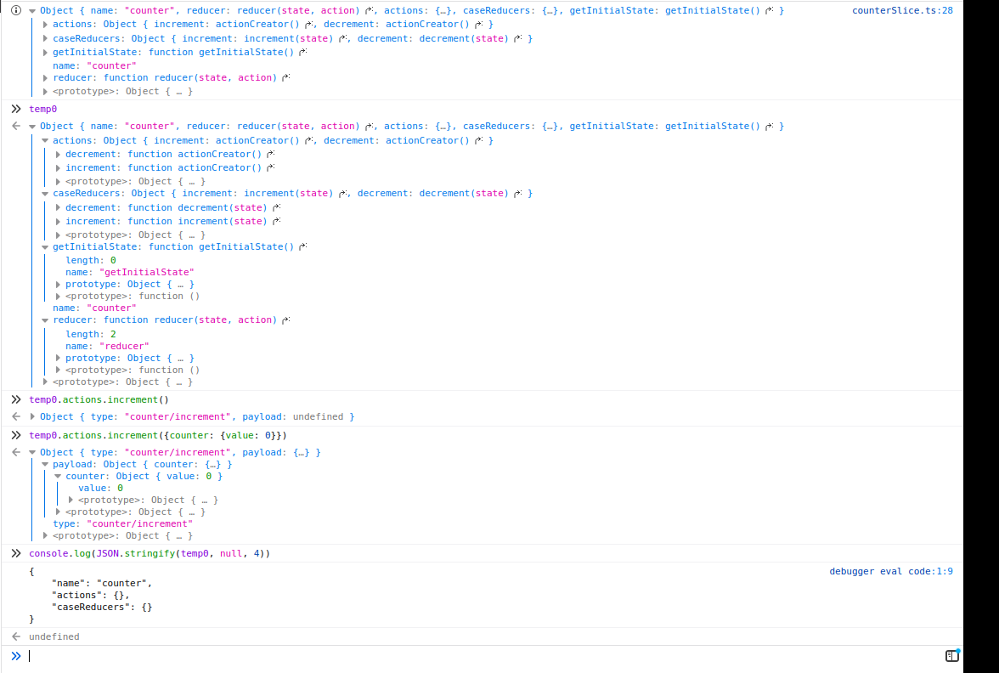

I can see actions, caseReducers, getInitialState, name and reducer.

I can also see that on invocation of actions.increment with the proper state varialbles, an object is returned. This
returned object looks like plain old redux dispatch input. We are telling rootReducer to fire action for "
counter/increment" with values `{ counter: { value: 0} }`.

I need to maintain my own state for the component and pass it to the dispatched function call.

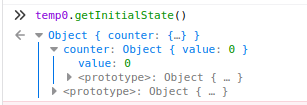

This does return the initial value of the state.

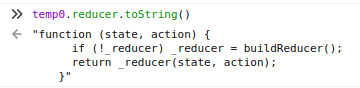

I tried to get source of the reducer function.

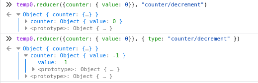

In the first attempt, I just passed state object and action name. It doesn't work. There is a given structure that redux
understands, when I remembered it, and passed `{type: action}`, it worked!

Let's figure out other functions and "words".

### createSlice

```typescript
/**
 * A function that accepts an initial state, an object full of reducer
 * functions, and a "slice name", and automatically generates
 * action creators and action types that correspond to the
 * reducers and state.
 *
 * The `reducer` argument is passed to `createReducer()`.
 *
 * @public
 */
export declare function createSlice
    <State, CaseReducers extends SliceCaseReducers<State>, Name extends string = string>
    (options: CreateSliceOptions<State, CaseReducers, Name>)
    : Slice<State, CaseReducers, Name>;

```

- name is required
- initialState can be a function, if it is not, then a function will be created by calling `createNextState`.
- reducers is initialized as empty object if not passed
- createSlice returns names, reducer, actions, caseReducers, getInitialState as we have seen earlier.

> Curried producer that infers the recipe from the curried output function (e.g. when passing to setState)

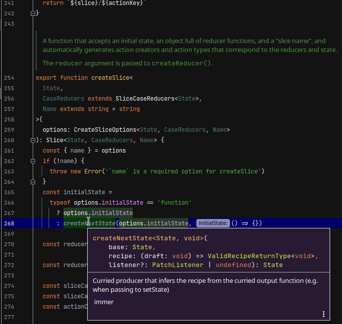

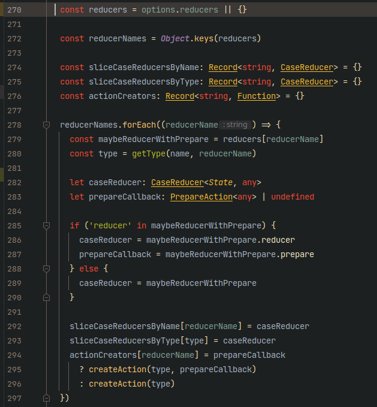

#### Return from createSlice

```typescript
return {
    name,
    reducer(state, action) {
      if (!_reducer) _reducer = buildReducer()

      return _reducer(state, action)
    },
    actions: actionCreators as any,
    caseReducers: sliceCaseReducersByName as any,
    getInitialState() {
      if (!_reducer) _reducer = buildReducer()

      return _reducer.getInitialState()
    },
  }
```

The returned `counterSlice.reducer` is being used in store.ts. Let me figure out what is a `configureStore`.

### `configureStore`

```typescript
/**
 * A friendly abstraction over the standard Redux `createStore()` function.
 *
 * @param config The store configuration.
 * @returns A configured Redux store.
 *
 * @public
 */
export function configureStore<
  S = any,
  A extends Action = AnyAction,
  M extends Middlewares<S> = [ThunkMiddlewareFor<S>]
>(options: ConfigureStoreOptions<S, A, M>): EnhancedStore<S, A, M> {
  const curriedGetDefaultMiddleware = curryGetDefaultMiddleware<S>()

  const {
    reducer = undefined,
    middleware = curriedGetDefaultMiddleware(),
    devTools = true,
    preloadedState = undefined,
    enhancers = undefined,
  } = options || {}

  let rootReducer: Reducer<S, A>

  if (typeof reducer === 'function') {
    rootReducer = reducer
  } else if (isPlainObject(reducer)) {
    rootReducer = combineReducers(reducer)
  } else {
    throw new Error(
      '"reducer" is a required argument, and must be a function or an object of functions that can be passed to combineReducers'
    )
  }

  let finalMiddleware = middleware
  if (typeof finalMiddleware === 'function') {
    finalMiddleware = finalMiddleware(curriedGetDefaultMiddleware)

    if (!IS_PRODUCTION && !Array.isArray(finalMiddleware)) {
      throw new Error(
        'when using a middleware builder function, an array of middleware must be returned'
      )
    }
  }
  if (
    !IS_PRODUCTION &&
    finalMiddleware.some((item) => typeof item !== 'function')
  ) {
    throw new Error(
      'each middleware provided to configureStore must be a function'
    )
  }

  const middlewareEnhancer = applyMiddleware(...finalMiddleware)

  let finalCompose = compose

  if (devTools) {
    finalCompose = composeWithDevTools({
      // Enable capture of stack traces for dispatched Redux actions
      trace: !IS_PRODUCTION,
      ...(typeof devTools === 'object' && devTools),
    })
  }

  let storeEnhancers: StoreEnhancer[] = [middlewareEnhancer]

  if (Array.isArray(enhancers)) {
    storeEnhancers = [middlewareEnhancer, ...enhancers]
  } else if (typeof enhancers === 'function') {
    storeEnhancers = enhancers(storeEnhancers)
  }

  const composedEnhancer = finalCompose(...storeEnhancers) as any

  return createStore(rootReducer, preloadedState, composedEnhancer)
}
```

This basically calls `createStore` and returns the output of that function.

After creating store via `createStore` we are getting this object:

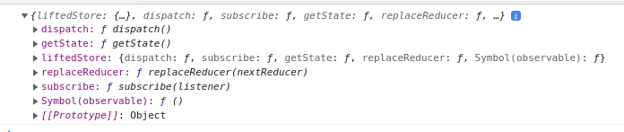

It has the state of our application, and a dispatch function that we can use to update state.

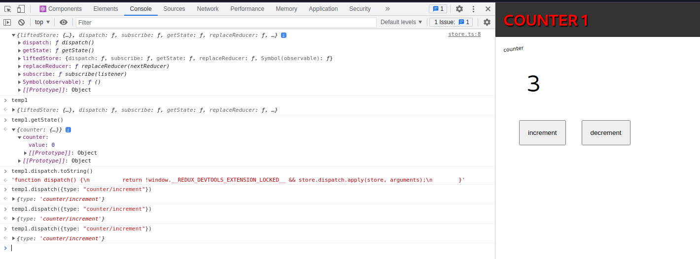

Notice how on firing dispatch three times, the value is updated.

This is because the app state is same as the one being manipulated via redux store's dispatch call.

### `createStore`

This comes from reduxjs/redux/src/createStore.js

```javascript
/**
 * Creates a Redux store that holds the state tree.
 * The only way to change the data in the store is to call `dispatch()` on it.
 *
 * There should only be a single store in your app. To specify how different
 * parts of the state tree respond to actions, you may combine several reducers
 * into a single reducer function by using `combineReducers`.
 *
 * @param {Function} reducer A function that returns the next state tree, given
 * the current state tree and the action to handle.
 *
 * @param {any} [preloadedState] The initial state. You may optionally specify it
 * to hydrate the state from the server in universal apps, or to restore a
 * previously serialized user session.
 * If you use `combineReducers` to produce the root reducer function, this must be
 * an object with the same shape as `combineReducers` keys.
 *
 * @param {Function} [enhancer] The store enhancer. You may optionally specify it
 * to enhance the store with third-party capabilities such as middleware,
 * time travel, persistence, etc. The only store enhancer that ships with Redux
 * is `applyMiddleware()`.
 *
 * @returns {Store} A Redux store that lets you read the state, dispatch actions
 * and subscribe to changes.
 */
export default function createStore(reducer, preloadedState, enhancer) {
// ...a lot of code...
  return {
    dispatch,
    subscribe,
    getState,
    replaceReducer,
    [$$observable]: observable,
  }
}
```

The return is what we have seen earlier. I cannot, ATM, go into the function for a deep dive.

## Adding another counter.

Basically replicating it. This ideally should be very easy.

```typescript
<h2>counter 1</h2>
<Counter/>
<h2>counter 2</h2>
<Counter/>
```

The code above should generate two counters that have different state. But that doesn't happen. Both the counters are
using same state.

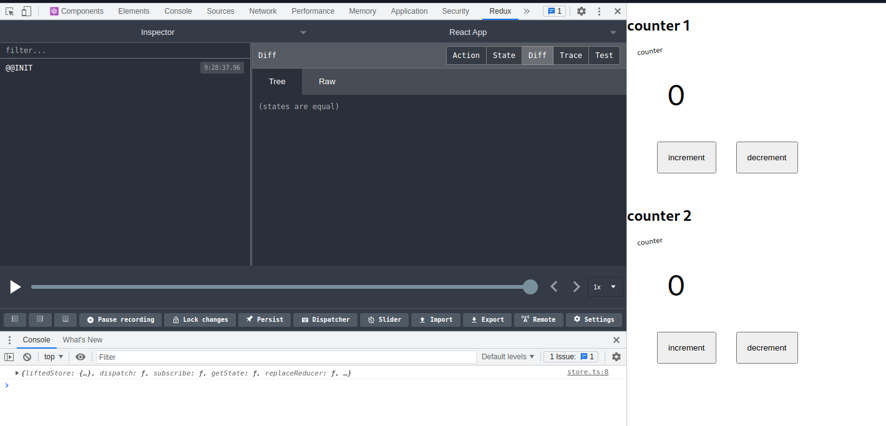

I click increment five times, and both the counters get the same updated value.

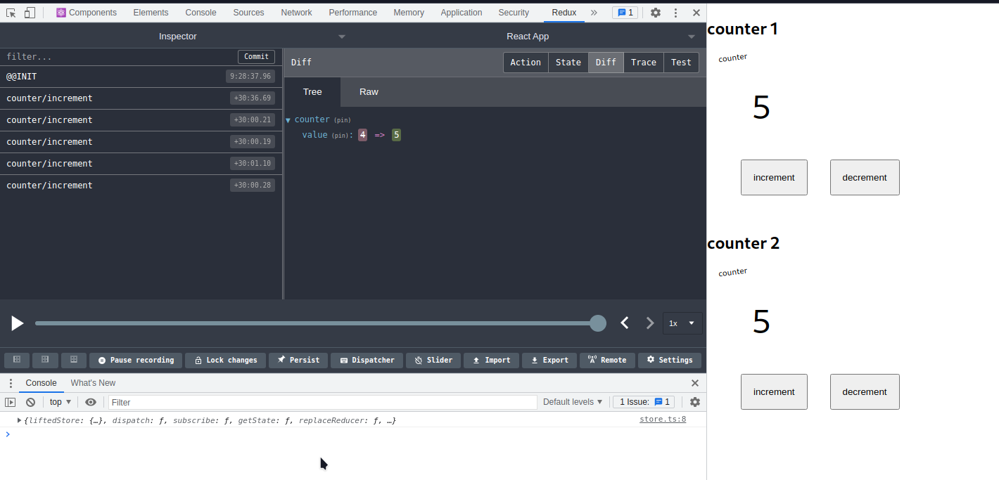

What is happening?

Well, we are using single state `{counter: {value: N} }` in redux, so that's one.

Also, the whole functionality is encapsulated in `Counter` component, the display, the increment and the decrement
functions.

This is great example of component-reuse. Let me add a class variable so that we can see the Counter in black too, but
with same value.

After a while, I will update code in such a way that two counters work independently.

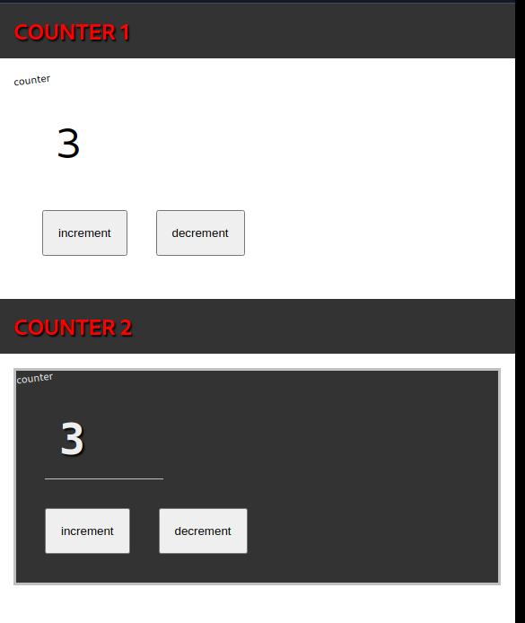

### Changes

#### App.tsx

```typescript
import React from 'react';
import {Provider} from "react-redux";
import {store} from "./state/store";

import './App.css';

import Counter from "./components/counter/counter";

function App() {
    return (
        <Provider store={store}>
            <div className="App">
                <h2>counter 1</h2>
                <Counter klass={"light"}/>
                <h2>counter 2</h2>
                <Counter klass={"dark"}/>
            </div>
        </Provider>
    );
}

export default App;

```

#### counter.tsx

```typescript
import React from "react";
import "./counter.css";
import CounterDisplay from "../counter-display/counter-display";

import {useAppSelector, useAppDispatch} from "../../state/hooks";
import {increment, decrement, selectCount} from "../../state/slice/counterSlice";

interface CounterProps {
    klass?: string;
}

export default function Counter({klass}: CounterProps = {klass: "light"}) {
    const dispatch = useAppDispatch();

    const count = useAppSelector(selectCount);
    return (
        <div className={`counter ${klass}`}>
            <CounterDisplay count={count}/>
            <div className={"coutner-actions"}>
                <button onClick={() => dispatch(increment())}>increment</button>
                <button onClick={() => dispatch(decrement())}>decrement</button>
            </div>
        </div>
    );
}

```

#### counter.css

```css
.counter.dark {
    background-color: #333333;
    color: #eeeeee;
    border: medium solid silver;
}
```

#### counter-display.css

```css
.counter.dark .counter-value {
    min-width: 100px;
    font-weight: bold;
    font-family: monospace;
    text-shadow: 2px 2px 2px black;
    display: inline-block;
    border-bottom: thin solid silver;
}

```

## counter-2

Interestingly a better implementation is found in template project that you can get from `yarn create react-app counter-2 --template redux-typescript `

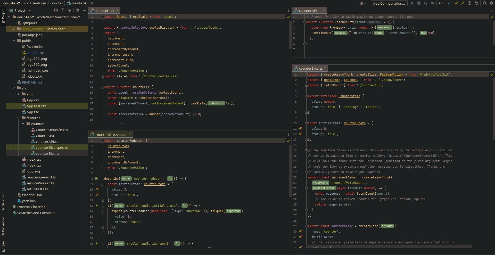

### running app

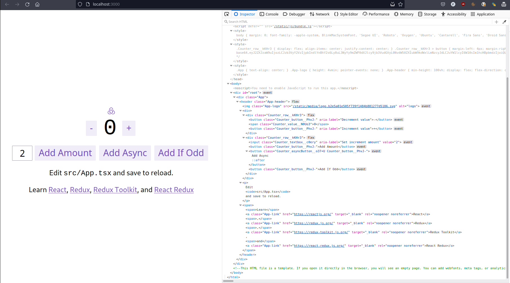

Though it has added features, unfortunately it also is designed for single instance. Singletons be damned.

I should realise that redux is for maintaining a global store. A global store, by design, is singleton.

And thanks to non-preemptive single threadedness of JS, this doesn't become a nightmare everyday.

### /features/counter/Counter.module.css

```css
.row {
  display: flex;
  align-items: center;
  justify-content: center;
}

.row > button {
  margin-left: 4px;
  margin-right: 8px;
}

.row:not(:last-child) {
  margin-bottom: 16px;
}

.value {
  font-size: 78px;
  padding-left: 16px;
  padding-right: 16px;
  margin-top: 2px;
  font-family: 'Courier New', Courier, monospace;
}

.button {
  appearance: none;
  background: none;
  font-size: 32px;
  padding-left: 12px;
  padding-right: 12px;
  outline: none;
  border: 2px solid transparent;
  color: rgb(112, 76, 182);
  padding-bottom: 4px;
  cursor: pointer;
  background-color: rgba(112, 76, 182, 0.1);
  border-radius: 2px;
  transition: all 0.15s;
}

.textbox {
  font-size: 32px;
  padding: 2px;
  width: 64px;
  text-align: center;
  margin-right: 4px;
}

.button:hover,
.button:focus {
  border: 2px solid rgba(112, 76, 182, 0.4);
}

.button:active {
  background-color: rgba(112, 76, 182, 0.2);
}

.asyncButton {
  composes: button;
  position: relative;
}

.asyncButton:after {
  content: '';
  background-color: rgba(112, 76, 182, 0.15);
  display: block;
  position: absolute;
  width: 100%;
  height: 100%;
  left: 0;
  top: 0;
  opacity: 0;
  transition: width 1s linear, opacity 0.5s ease 1s;
}

.asyncButton:active:after {
  width: 0%;
  opacity: 1;
  transition: 0s;
}

```

### /features/counter/Counter.tsx

```typescript
import React, { useState } from 'react';

import { useAppSelector, useAppDispatch } from '../../app/hooks';
import {
  decrement,
  increment,
  incrementByAmount,
  incrementAsync,
  incrementIfOdd,
  selectCount,
} from './counterSlice';
import styles from './Counter.module.css';

export function Counter() {
  const count = useAppSelector(selectCount);
  const dispatch = useAppDispatch();
  const [incrementAmount, setIncrementAmount] = useState('2');

  const incrementValue = Number(incrementAmount) || 0;

  return (
    <div>
      <div className={styles.row}>
        <button
          className={styles.button}
          aria-label="Decrement value"
          onClick={() => dispatch(decrement())}
        >
          -
        </button>
        <span className={styles.value}>{count}</span>
        <button
          className={styles.button}
          aria-label="Increment value"
          onClick={() => dispatch(increment())}
        >
          +
        </button>
      </div>
      <div className={styles.row}>
        <input
          className={styles.textbox}
          aria-label="Set increment amount"
          value={incrementAmount}
          onChange={(e) => setIncrementAmount(e.target.value)}
        />
        <button
          className={styles.button}
          onClick={() => dispatch(incrementByAmount(incrementValue))}
        >
          Add Amount
        </button>
        <button
          className={styles.asyncButton}
          onClick={() => dispatch(incrementAsync(incrementValue))}
        >
          Add Async
        </button>
        <button
          className={styles.button}
          onClick={() => dispatch(incrementIfOdd(incrementValue))}
        >
          Add If Odd
        </button>
      </div>
    </div>
  );
}

```

### /features/counter/counterAPI.ts

```typescript
// A mock function to mimic making an async request for data
export function fetchCount(amount = 1) {
  return new Promise<{ data: number }>((resolve) =>
    setTimeout(() => resolve({ data: amount }), 500)
  );
}

```

### /features/counter/counterSlice.spec.ts

```typescript
import counterReducer, {
  CounterState,
  increment,
  decrement,
  incrementByAmount,
} from './counterSlice';

describe('counter reducer', () => {
  const initialState: CounterState = {
    value: 3,
    status: 'idle',
  };
  it('should handle initial state', () => {
    expect(counterReducer(undefined, { type: 'unknown' })).toEqual({
      value: 0,
      status: 'idle',
    });
  });

  it('should handle increment', () => {
    const actual = counterReducer(initialState, increment());
    expect(actual.value).toEqual(4);
  });

  it('should handle decrement', () => {
    const actual = counterReducer(initialState, decrement());
    expect(actual.value).toEqual(2);
  });

  it('should handle incrementByAmount', () => {
    const actual = counterReducer(initialState, incrementByAmount(2));
    expect(actual.value).toEqual(5);
  });
});

```

One thing that I have not paid any attention to is testing so far. One week, I will sit down to test. Not today.

### /features/counter/counterSlice.ts

```typescript
import { createAsyncThunk, createSlice, PayloadAction } from '@reduxjs/toolkit';
import { RootState, AppThunk } from '../../app/store';
import { fetchCount } from './counterAPI';

export interface CounterState {
  value: number;
  status: 'idle' | 'loading' | 'failed';
}

const initialState: CounterState = {
  value: 0,
  status: 'idle',
};

// The function below is called a thunk and allows us to perform async logic. It
// can be dispatched like a regular action: `dispatch(incrementAsync(10))`. This
// will call the thunk with the `dispatch` function as the first argument. Async
// code can then be executed and other actions can be dispatched. Thunks are
// typically used to make async requests.
export const incrementAsync = createAsyncThunk(
  'counter/fetchCount',
  async (amount: number) => {
    const response = await fetchCount(amount);
    // The value we return becomes the `fulfilled` action payload
    return response.data;
  }
);

export const counterSlice = createSlice({
  name: 'counter',
  initialState,
  // The `reducers` field lets us define reducers and generate associated actions
  reducers: {
    increment: (state) => {
      // Redux Toolkit allows us to write "mutating" logic in reducers. It
      // doesn't actually mutate the state because it uses the Immer library,
      // which detects changes to a "draft state" and produces a brand new
      // immutable state based off those changes
      state.value += 1;
    },
    decrement: (state) => {
      state.value -= 1;
    },
    // Use the PayloadAction type to declare the contents of `action.payload`
    incrementByAmount: (state, action: PayloadAction<number>) => {
      state.value += action.payload;
    },
  },
  // The `extraReducers` field lets the slice handle actions defined elsewhere,
  // including actions generated by createAsyncThunk or in other slices.
  extraReducers: (builder) => {
    builder
      .addCase(incrementAsync.pending, (state) => {
        state.status = 'loading';
      })
      .addCase(incrementAsync.fulfilled, (state, action) => {
        state.status = 'idle';
        state.value += action.payload;
      });
  },
});

export const { increment, decrement, incrementByAmount } = counterSlice.actions;

// The function below is called a selector and allows us to select a value from
// the state. Selectors can also be defined inline where they're used instead of
// in the slice file. For example: `useSelector((state: RootState) => state.counter.value)`
export const selectCount = (state: RootState) => state.counter.value;

// We can also write thunks by hand, which may contain both sync and async logic.
// Here's an example of conditionally dispatching actions based on current state.
export const incrementIfOdd = (amount: number): AppThunk => (
  dispatch,
  getState
) => {
  const currentValue = selectCount(getState());
  if (currentValue % 2 === 1) {
    dispatch(incrementByAmount(amount));
  }
};

export default counterSlice.reducer;

```

#### `createAsyncThunk`

```typescript
export declare function createAsyncThunk
    <Returned, ThunkArg = void>
    (
    typePrefix: string,
    payloadCreator: AsyncThunkPayloadCreator<Returned, ThunkArg, {}>,
    options?: AsyncThunkOptions<ThunkArg, {}>
    )
    : AsyncThunk<Returned, ThunkArg, {}>;

export declare function createAsyncThunk
    <Returned, ThunkArg, ThunkApiConfig extends AsyncThunkConfig>
        (
        typePrefix: string,
        payloadCreator: AsyncThunkPayloadCreator<Returned, ThunkArg, ThunkApiConfig>,
        options?: AsyncThunkOptions<ThunkArg, ThunkApiConfig>
        )
        : AsyncThunk<Returned, ThunkArg, ThunkApiConfig>;

```

Source code from reduxjs/redux-toolkit

```typescript
export function createAsyncThunk<
  Returned,
  ThunkArg,
  ThunkApiConfig extends AsyncThunkConfig
>(
  typePrefix: string,
  payloadCreator: AsyncThunkPayloadCreator<Returned, ThunkArg, ThunkApiConfig>,
  options?: AsyncThunkOptions<ThunkArg, ThunkApiConfig>
): AsyncThunk<Returned, ThunkArg, ThunkApiConfig> {
  type RejectedValue = GetRejectValue<ThunkApiConfig>
  type PendingMeta = GetPendingMeta<ThunkApiConfig>
  type FulfilledMeta = GetFulfilledMeta<ThunkApiConfig>
  type RejectedMeta = GetRejectedMeta<ThunkApiConfig>

  const fulfilled: AsyncThunkFulfilledActionCreator<
    Returned,
    ThunkArg,
    ThunkApiConfig
  > = createAction(
    typePrefix + '/fulfilled',
    (
      payload: Returned,
      requestId: string,
      arg: ThunkArg,
      meta?: FulfilledMeta
    ) => ({
      payload,
      meta: {
        ...((meta as any) || {}),
        arg,
        requestId,
        requestStatus: 'fulfilled' as const,
      },
    })
  )

  const pending: AsyncThunkPendingActionCreator<ThunkArg, ThunkApiConfig> =
    createAction(
      typePrefix + '/pending',
      (requestId: string, arg: ThunkArg, meta?: PendingMeta) => ({
        payload: undefined,
        meta: {
          ...((meta as any) || {}),
          arg,
          requestId,
          requestStatus: 'pending' as const,
        },
      })
    )

  const rejected: AsyncThunkRejectedActionCreator<ThunkArg, ThunkApiConfig> =
    createAction(
      typePrefix + '/rejected',
      (
        error: Error | null,
        requestId: string,
        arg: ThunkArg,
        payload?: RejectedValue,
        meta?: RejectedMeta
      ) => ({
        payload,
        error: ((options && options.serializeError) || miniSerializeError)(
          error || 'Rejected'
        ) as GetSerializedErrorType<ThunkApiConfig>,
        meta: {
          ...((meta as any) || {}),
          arg,
          requestId,
          rejectedWithValue: !!payload,
          requestStatus: 'rejected' as const,
          aborted: error?.name === 'AbortError',
          condition: error?.name === 'ConditionError',
        },
      })
    )

  let displayedWarning = false

  const AC =
    typeof AbortController !== 'undefined'
      ? AbortController
      : class implements AbortController {
          signal: AbortSignal = {
            aborted: false,
            addEventListener() {},
            dispatchEvent() {
              return false
            },
            onabort() {},
            removeEventListener() {},
          }
          abort() {
            if (process.env.NODE_ENV !== 'production') {
              if (!displayedWarning) {
                displayedWarning = true
                console.info(
                  `This platform does not implement AbortController.
If you want to use the AbortController to react to \`abort\` events, please consider importing a polyfill like 'abortcontroller-polyfill/dist/abortcontroller-polyfill-only'.`
                )
              }
            }
          }
        }

  function actionCreator(
    arg: ThunkArg
  ): AsyncThunkAction<Returned, ThunkArg, ThunkApiConfig> {
    return (dispatch, getState, extra) => {
      const requestId = options?.idGenerator
        ? options.idGenerator(arg)
        : nanoid()

      const abortController = new AC()
      let abortReason: string | undefined

      const abortedPromise = new Promise<never>((_, reject) =>
        abortController.signal.addEventListener('abort', () =>
          reject({ name: 'AbortError', message: abortReason || 'Aborted' })
        )
      )

      let started = false
      function abort(reason?: string) {
        if (started) {
          abortReason = reason
          abortController.abort()
        }
      }

      const promise = (async function () {
        let finalAction: ReturnType<typeof fulfilled | typeof rejected>
        try {
          let conditionResult = options?.condition?.(arg, { getState, extra })
          if (isThenable(conditionResult)) {
            conditionResult = await conditionResult
          }
          if (conditionResult === false) {
            // eslint-disable-next-line no-throw-literal
            throw {
              name: 'ConditionError',
              message: 'Aborted due to condition callback returning false.',
            }
          }
          started = true
          dispatch(
            pending(
              requestId,
              arg,
              options?.getPendingMeta?.({ requestId, arg }, { getState, extra })
            )
          )
          finalAction = await Promise.race([
            abortedPromise,
            Promise.resolve(
              payloadCreator(arg, {
                dispatch,
                getState,
                extra,
                requestId,
                signal: abortController.signal,
                rejectWithValue: ((
                  value: RejectedValue,
                  meta?: RejectedMeta
                ) => {
                  return new RejectWithValue(value, meta)
                }) as any,
                fulfillWithValue: ((value: unknown, meta?: FulfilledMeta) => {
                  return new FulfillWithMeta(value, meta)
                }) as any,
              })
            ).then((result) => {
              if (result instanceof RejectWithValue) {
                throw result
              }
              if (result instanceof FulfillWithMeta) {
                return fulfilled(result.payload, requestId, arg, result.meta)
              }
              return fulfilled(result as any, requestId, arg)
            }),
          ])
        } catch (err) {
          finalAction =
            err instanceof RejectWithValue
              ? rejected(null, requestId, arg, err.payload, err.meta)
              : rejected(err as any, requestId, arg)
        }
        // We dispatch the result action _after_ the catch, to avoid having any errors
        // here get swallowed by the try/catch block,
        // per https://twitter.com/dan_abramov/status/770914221638942720
        // and https://github.com/reduxjs/redux-toolkit/blob/e85eb17b39a2118d859f7b7746e0f3fee523e089/docs/tutorials/advanced-tutorial.md#async-error-handling-logic-in-thunks

        const skipDispatch =
          options &&
          !options.dispatchConditionRejection &&
          rejected.match(finalAction) &&
          (finalAction as any).meta.condition

        if (!skipDispatch) {
          dispatch(finalAction)
        }
        return finalAction
      })()
      return Object.assign(promise as Promise<any>, {
        abort,
        requestId,
        arg,
        unwrap() {
          return promise.then<any>(unwrapResult)
        },
      })
    }
  }

  return Object.assign(
    actionCreator as AsyncThunkActionCreator<
      Returned,
      ThunkArg,
      ThunkApiConfig
    >,
    {
      pending,
      rejected,
      fulfilled,
      typePrefix,
    }
  )
}
```

When I print the value via `console.info(incrementAsync);` we get:

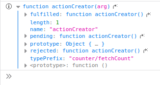

The return values do match.

Executing the object "incrementAsync" obtained from calling `createAsyncThunk`.

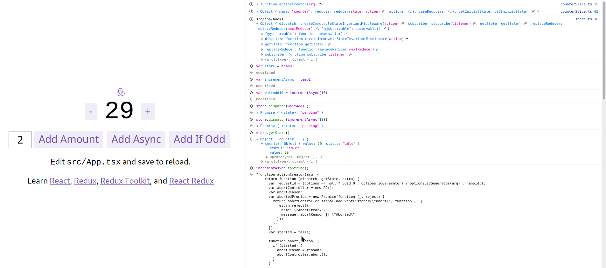

If you notice, temp0 is store, and temp1 is incrementAsync.

As per code, we can call what is returned by `createAsyncThunk` and pass it to `dispatch`.

#### `type AsyncThunk`

```typescript
/**
 * A type describing the return value of `createAsyncThunk`.
 * Might be useful for wrapping `createAsyncThunk` in custom abstractions.
 *
 * @public
 */
export type AsyncThunk<
  Returned,
  ThunkArg,
  ThunkApiConfig extends AsyncThunkConfig
> = AsyncThunkActionCreator<Returned, ThunkArg, ThunkApiConfig> & {
  pending: AsyncThunkPendingActionCreator<ThunkArg, ThunkApiConfig>
  rejected: AsyncThunkRejectedActionCreator<ThunkArg, ThunkApiConfig>
  fulfilled: AsyncThunkFulfilledActionCreator<
    Returned,
    ThunkArg,
    ThunkApiConfig
  >
  typePrefix: string
}
```


#### counter-2/src/features/counter/counterSlice.ts incrementAsync

```typescript
// The function below is called a thunk and allows us to perform async logic. It
// can be dispatched like a regular action: `dispatch(incrementAsync(10))`. This
// will call the thunk with the `dispatch` function as the first argument. Async
// code can then be executed and other actions can be dispatched. Thunks are
// typically used to make async requests.
export const incrementAsync = createAsyncThunk(
    'counter/fetchCount',
    async (amount: number) => {
        const response = await fetchCount(amount);
        // The value we return becomes the `fulfilled` action payload
        return response.data;
    }
);
```

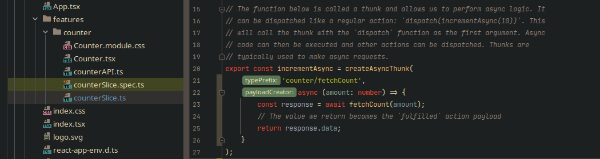

Let me reason about the code.

`incrementAsync` is of the type `AsyncThunk<number, number, {}>` which means as per `AsyncThunk<Returned, ThunkArg, ThunkApiConfig>`, `Returned` and `ThunkArg` are `number`.

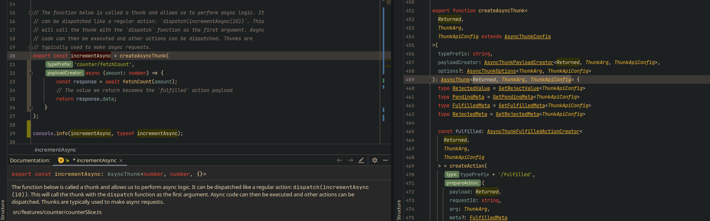

The `Returned` type being `number` should be due to `fetchCount` returning a number value.

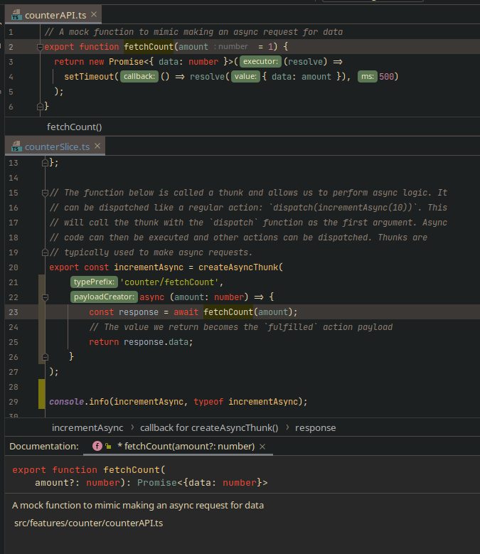

When I change the return type of fetchCount, the type `Returned` in `incrementAsync` changes to `string.

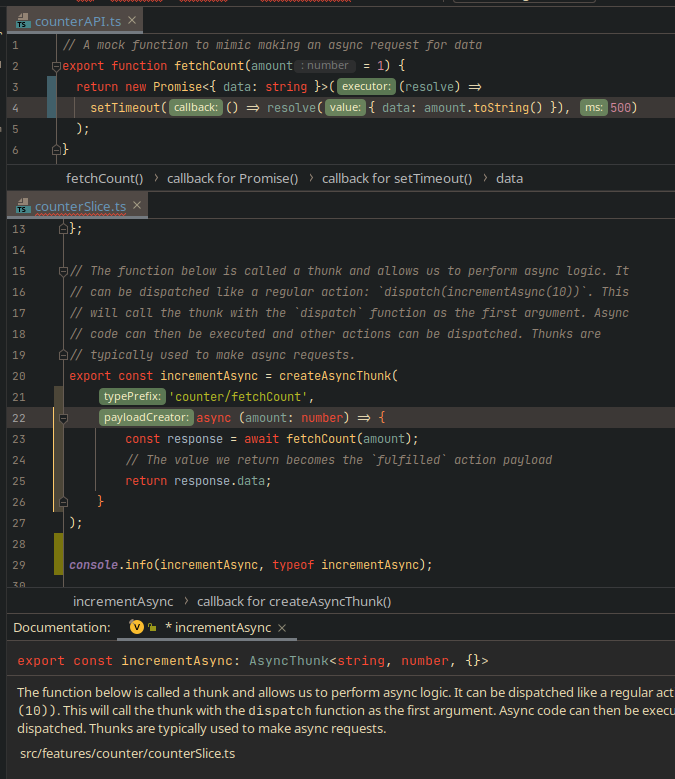

And when I change the input type to string, `ThunkArg` changes to `string`.

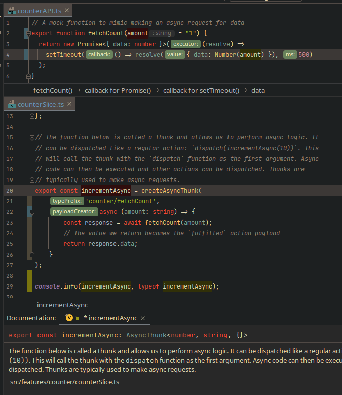

### `PayloadAction`

```typescript
/**
 * An action with a string type and an associated payload. This is the
 * type of action returned by `createAction()` action creators.
 *
 * @template P The type of the action's payload.
 * @template T the type used for the action type.
 * @template M The type of the action's meta (optional)
 * @template E The type of the action's error (optional)
 *
 * @public
 */
export type PayloadAction<
  P = void,
  T extends string = string,
  M = never,
  E = never
> = {
  payload: P
  type: T
} & ([M] extends [never]
  ? {}
  : {
      meta: M
    }) &
  ([E] extends [never]
    ? {}
    : {
        error: E
      })
```

This is used in `counterSlice`'s reducer `incrementByAmount`, which basically allows for passing payload to reducer.

`action.payload` is the number value here; it represents the value by which we want to increment counter (state) value.

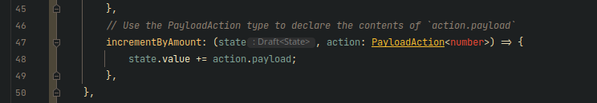

`incrementByAmount` is fired via following code in `Counter.tsx`

```typescript
// Sets up initial value of incrementAmount
const [incrementAmount, setIncrementAmount] = useState('2');
// Sets up incrementValue to either incrementAmount number or zero
const incrementValue = Number(incrementAmount) || 0;

// somewhere down the component
// clicking this button will fire incrementByAmount reducer
<button
    className={styles.button}
    onClick={() => dispatch(incrementByAmount(incrementValue))}
    >
```

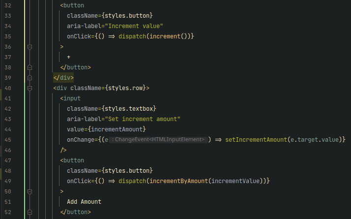

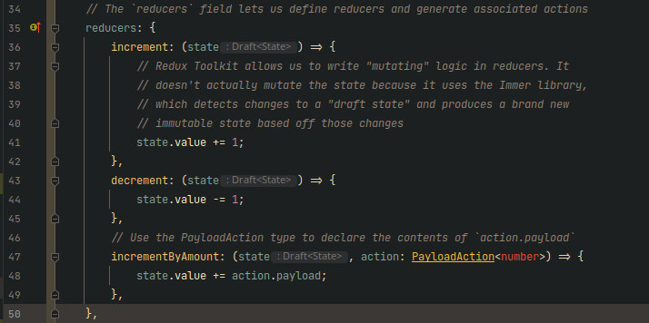

`state` is passed to reducers no matter what. And we can call reducers without state and rest of the params.

In case of increment/decrement reducers, there is no other param, but in case of `incrementByAmount` there is the action param.

`action` param contains payload which is a number in this case.

I am not able to figure out how a value is converted to `action.payload`.

## How a slice turns functions to reducers.

- createSlice gets reducers passed to it via options: createSlice(options:{reducers :{ functions here }})
- createSlice calls buildReducer
- buildReducer calls createReducer
- createSlice calls createAction

### `createAction`

It takes a string and an optional function and retuns a function that can be used by reducer.

The returned `actionCreator` function with patched functionality on it. The returned function has redefined `toString` which just returns `type`.

It also has `type` and `match` properties.

```typescript
/**
 * A utility function to create an action creator for the given action type
 * string. The action creator accepts a single argument, which will be included
 * in the action object as a field called payload. The action creator function
 * will also have its toString() overriden so that it returns the action type,
 * allowing it to be used in reducer logic that is looking for that action type.
 *
 * @param type The action type to use for created actions.
 * @param prepare (optional) a method that takes any number of arguments and returns { payload } or { payload, meta }.
 *                If this is given, the resulting action creator will pass its arguments to this method to calculate payload & meta.
 *
 * @public
 */
export function createAction<P = void, T extends string = string>(
  type: T
): PayloadActionCreator<P, T>

/**
 * A utility function to create an action creator for the given action type
 * string. The action creator accepts a single argument, which will be included
 * in the action object as a field called payload. The action creator function
 * will also have its toString() overriden so that it returns the action type,
 * allowing it to be used in reducer logic that is looking for that action type.
 *
 * @param type The action type to use for created actions.
 * @param prepare (optional) a method that takes any number of arguments and returns { payload } or { payload, meta }.
 *                If this is given, the resulting action creator will pass its arguments to this method to calculate payload & meta.
 *
 * @public
 */
export function createAction<
  PA extends PrepareAction<any>,
  T extends string = string
>(
  type: T,
  prepareAction: PA
): PayloadActionCreator<ReturnType<PA>['payload'], T, PA>

export function createAction(type: string, prepareAction?: Function): any {
  function actionCreator(...args: any[]) {
    if (prepareAction) {
      let prepared = prepareAction(...args)
      if (!prepared) {
        throw new Error('prepareAction did not return an object')
      }

      return {
        type,
        payload: prepared.payload,
        ...('meta' in prepared && { meta: prepared.meta }),
        ...('error' in prepared && { error: prepared.error }),
      }
    }
    return { type, payload: args[0] }
  }

  actionCreator.toString = () => `${type}`

  actionCreator.type = type

  actionCreator.match = (action: Action<unknown>): action is PayloadAction =>
    action.type === type

  return actionCreator
}
```

If `prepareAction` is missing, then `actionCreator` just returns `{type, payload: args[0]}`. This is basically a `{string, any}` type.

One example could be:

```
// createSlice
options: { ... reducers: { increment: state => state + 1 }, name: 'increment' }

// => createAction('increment', undefined) => actionCreator(value) => { type: 'increment', payload: value }
```

#### `createAction` in action

```typescript
// add this to counterSlice.ts
export const doubeIt = createAction("counter/doubleIt", (value: number) => ({payload: value * 2}));

// add this to extrareducers: (builder) => { ...here... }
.addCase(doubeIt, (state, action) => {
    state.value = action.payload;
});

// add this to Counter.tsx
<button className={styles.button} onClick={() => dispatch(doubeIt(count))}>double {count}</button>
```

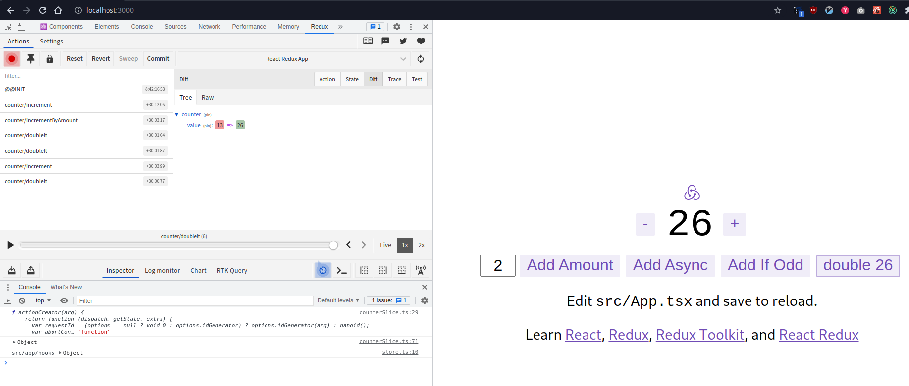

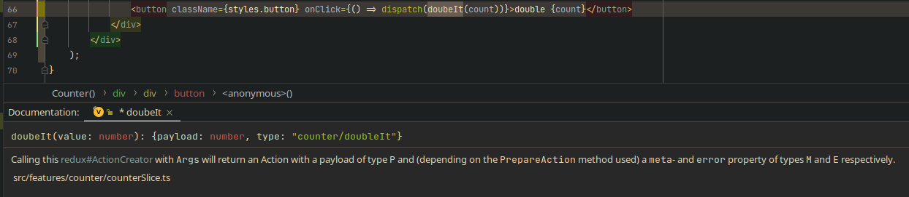

```
doubeIt(value: number): {payload: number, type: "counter/doubleIt"}
Calling this redux#ActionCreator with Args will return an Action with a payload of type P and (depending on the PrepareAction method used) a meta- and error property of types M and E respectively.
```

`doubIt` gets defined as `export const doubeIt: ActionCreatorWithPreparedPayload<[value: number], number, "counter/doubleIt", never, never>`

### `ActionCreatorWithPreparedPayload` interface

```typescript
/**
 * An action creator that takes multiple arguments that are passed
 * to a `PrepareAction` method to create the final Action.
 * @typeParam Args arguments for the action creator function
 * @typeParam P `payload` type
 * @typeParam T `type` name
 * @typeParam E optional `error` type
 * @typeParam M optional `meta` type
 *
 * @inheritdoc {redux#ActionCreator}
 *
 * @public
 */
export interface ActionCreatorWithPreparedPayload<
  Args extends unknown[],
  P,
  T extends string = string,
  E = never,
  M = never
> extends BaseActionCreator<P, T, M, E> {
  /**
   * Calling this {@link redux#ActionCreator} with `Args` will return
   * an Action with a payload of type `P` and (depending on the `PrepareAction`
   * method used) a `meta`- and `error` property of types `M` and `E` respectively.
   */
  (...args: Args): PayloadAction<P, T, M, E>
}
```

to be continued...

## References

- [https://egghead.io/lessons/react-create-a-reducer-with-redux-toolkit-and-dispatch-its-action-with-the-useappdispatch-hook](https://egghead.io/lessons/react-create-a-reducer-with-redux-toolkit-and-dispatch-its-action-with-the-useappdispatch-hook)
- [https://redux-toolkit.js.org/tutorials/overview](https://redux-toolkit.js.org/tutorials/overview)
- [https://redux-toolkit.js.org/usage/usage-guide](https://redux-toolkit.js.org/usage/usage-guide)
- [https://redux-toolkit.js.org/usage/usage-with-typescript](https://redux-toolkit.js.org/usage/usage-with-typescript)
- [https://github.com/reduxjs/cra-template-redux-typescript](https://github.com/reduxjs/cra-template-redux-typescript)
- [https://redux-toolkit.js.org/tutorials/overview](https://redux-toolkit.js.org/tutorials/overview)
- [https://stackoverflow.com/questions/68768408/react-redux-toolkit-type-is-not-assignable-to-type-casereducertype-payload](https://stackoverflow.com/questions/68768408/react-redux-toolkit-type-is-not-assignable-to-type-casereducertype-payload)
- [https://levelup.gitconnected.com/redux-toolkit-an-easier-way-to-set-up-redux-6782b4857f8](https://levelup.gitconnected.com/redux-toolkit-an-easier-way-to-set-up-redux-6782b4857f8)
- [https://www.bezkoder.com/redux-toolkit-example-crud/](https://www.bezkoder.com/redux-toolkit-example-crud/)
- [https://redux.js.org/tutorials/fundamentals/part-8-modern-redux](https://redux.js.org/tutorials/fundamentals/part-8-modern-redux)
- [https://stackoverflow.com/questions/42906358/having-multiple-instance-of-same-reusable-redux-react-components-on-the-same-pag](https://stackoverflow.com/questions/42906358/having-multiple-instance-of-same-reusable-redux-react-components-on-the-same-pag)
- [https://redux.js.org/usage/structuring-reducers/reusing-reducer-logic](https://redux.js.org/usage/structuring-reducers/reusing-reducer-logic)

</body>
</html>
