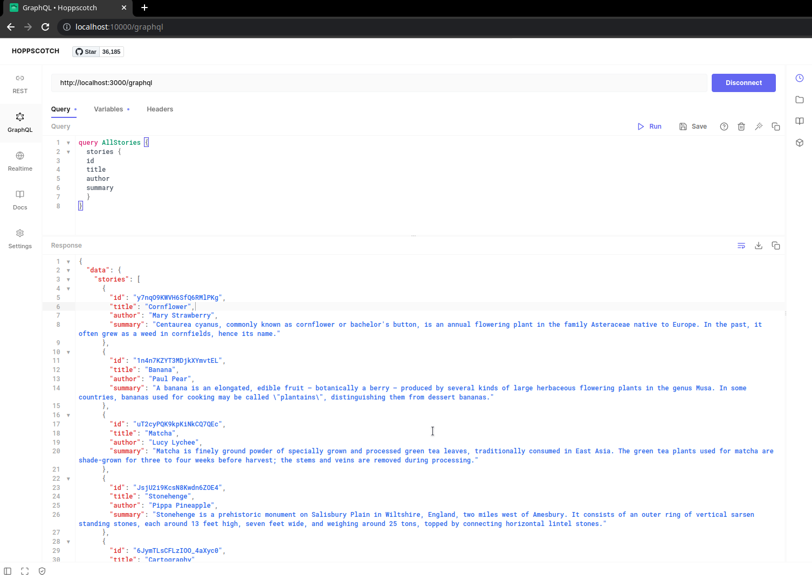
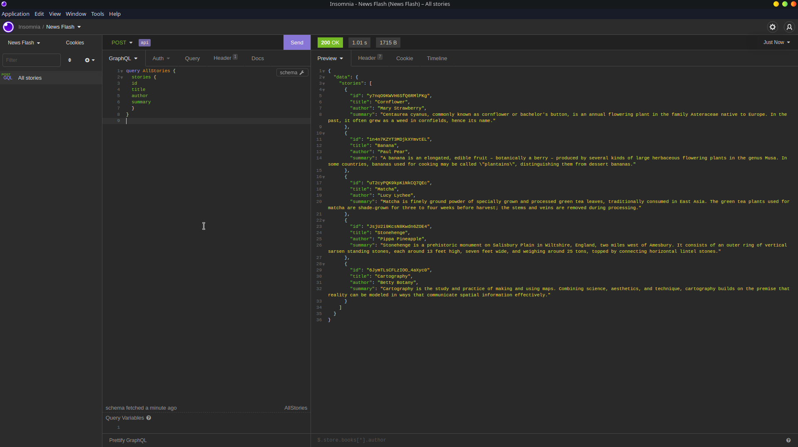

<html lang="en">
<head>
    <meta charset="UTF-8">
    <meta name="viewport" content="width=device-width, initial-scale=1">
    <title>/f0c1s/blog/react-web-dev/news-flash</title>
    <link rel="stylesheet" href="../../index.css"/>
    <link rel="stylesheet" href="../../highlight/styles/monokai.min.css"/>
    <script src="../../setup.js"></script>
    <script src="../../highlight/highlight.min.js"></script>
    <script>hljs.highlightAll();</script>
</head>

<body onload="setup()">
<h1>/f0c1s/blog/react-web-dev/news-flash</h1>
<nav>
    <a href="../../index.html">/blog</a>
    <a href="../../react-web-dev/index.html">react web dev</a>
    <a href="../../react-web-dev/news-flash/news-flash.html">+ news flash app in react-native</a>
</nav>

## Setup

- Clone [news flash api](https://github.com/kadikraman/news-flash-api)
  - `yarn && yarn start`
- Setup hoppscotch: `docker run --name hoppscotch -p 10000:3000 -d hoppscotch/hoppscotch:latest`





## APIs

### All stories

```graphql
query AllStories {
  stories {
  id
  title
  author
  summary
  }
}

```

```json
{
	"data": {
		"stories": [
			{
				"id": "y7nqO9KWVH6SfQ6RMlPKg",
				"title": "Cornflower",
				"author": "Mary Strawberry",
				"summary": "Centaurea cyanus, commonly known as cornflower or bachelor's button, is an annual flowering plant in the family Asteraceae native to Europe. In the past, it often grew as a weed in cornfields, hence its name."
			},
			{
				"id": "1n4n7KZYT3MDjkXYmvtEL",
				"title": "Banana",
				"author": "Paul Pear",
				"summary": "A banana is an elongated, edible fruit – botanically a berry – produced by several kinds of large herbaceous flowering plants in the genus Musa. In some countries, bananas used for cooking may be called \"plantains\", distinguishing them from dessert bananas."
			},
			{
				"id": "uT2cyPQK9kpKiNkCQ7QEc",
				"title": "Matcha",
				"author": "Lucy Lychee",
				"summary": "Matcha is finely ground powder of specially grown and processed green tea leaves, traditionally consumed in East Asia. The green tea plants used for matcha are shade-grown for three to four weeks before harvest; the stems and veins are removed during processing."
			},
			{
				"id": "JsjU2i9KcsN8Kwdn6ZOE4",
				"title": "Stonehenge",
				"author": "Pippa Pineapple",
				"summary": "Stonehenge is a prehistoric monument on Salisbury Plain in Wiltshire, England, two miles west of Amesbury. It consists of an outer ring of vertical sarsen standing stones, each around 13 feet high, seven feet wide, and weighing around 25 tons, topped by connecting horizontal lintel stones."
			},
			{
				"id": "6JymTLsCFLzIOO_4aXyc0",
				"title": "Cartography",
				"author": "Betty Botany",
				"summary": "Cartography is the study and practice of making and using maps. Combining science, aesthetics, and technique, cartography builds on the premise that reality can be modeled in ways that communicate spatial information effectively."
			}
		]
	}
}

```


### StoryById

```graphql
query StoryById($id: ID!) {
	story(id: $id) {
		id
		title
		author
		summary
	}
}


```

The params are:

```json
{
	"id": "y7nqO9KWVH6SfQ6RMlPKg"
}

```


```json

{
	"data": {
		"story": {
			"id": "y7nqO9KWVH6SfQ6RMlPKg",
			"title": "Cornflower",
			"author": "Mary Strawberry",
			"summary": "Centaurea cyanus, commonly known as cornflower or bachelor's button, is an annual flowering plant in the family Asteraceae native to Europe. In the past, it often grew as a weed in cornfields, hence its name."
		}
	}
}

```

### Add bookmark mutation

```graphql
mutation AddBookmark($id: ID!) {
	addBookmark(storyId: $id) {
		id
		story {
			id
			title
			author
			bookmarkId
		}
	}
}

```

Variables

```json
{
	"id": "y7nqO9KWVH6SfQ6RMlPKg"
}

```

```json
{
	"data": {
		"addBookmark": {
			"id": "dIjLD9TfwH18HhAzIX4IO",
			"story": {
				"id": "y7nqO9KWVH6SfQ6RMlPKg",
				"title": "Cornflower",
				"author": "Mary Strawberry",
				"bookmarkId": "dIjLD9TfwH18HhAzIX4IO"
			}
		}
	}
}


```

Response on second call with same data, it is null because we have already bookmarked.

```json
{
	"data": {
		"addBookmark": null
	}
}
```

## References

- [eggheadio course](https://egghead.io/courses/build-a-news-app-with-react-native-graphql-and-typescript-08814691)

</body>
</html>
