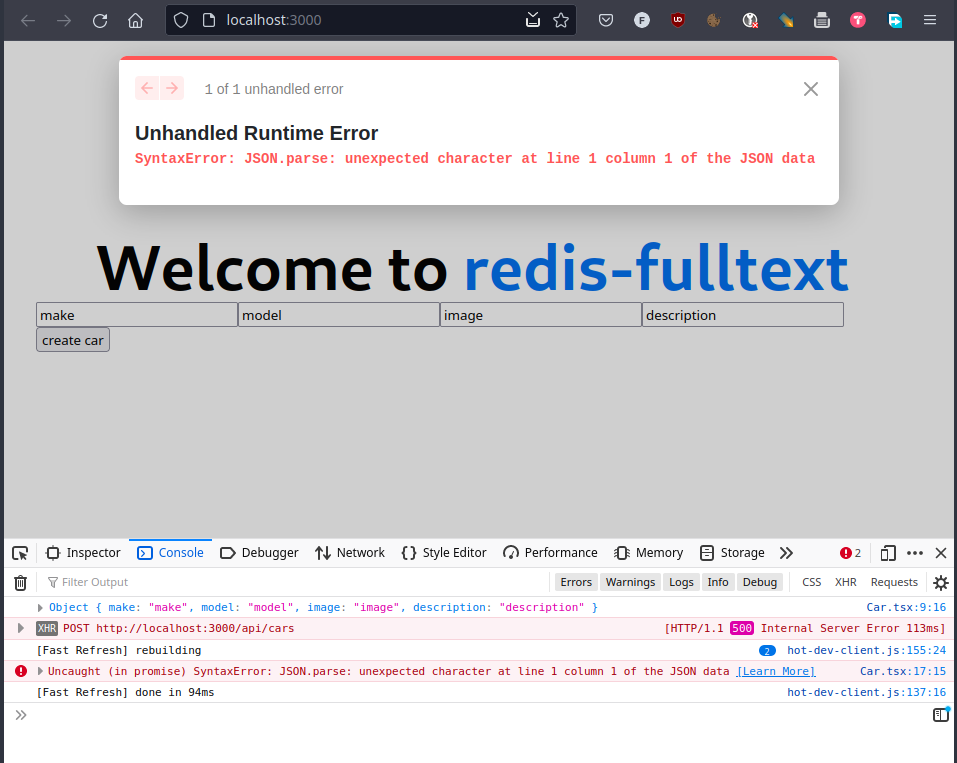
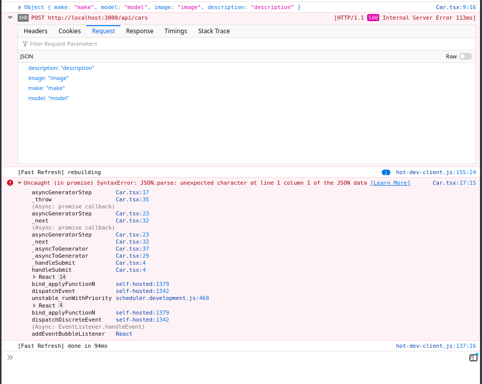
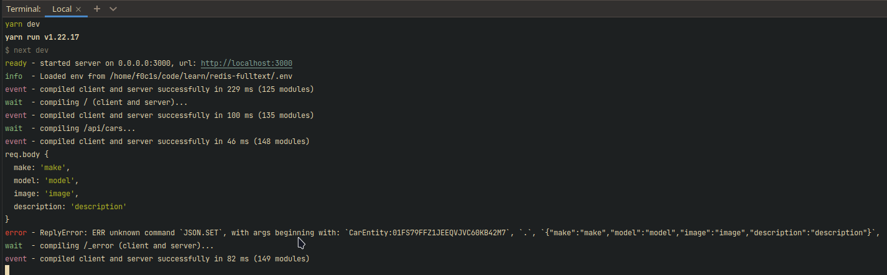
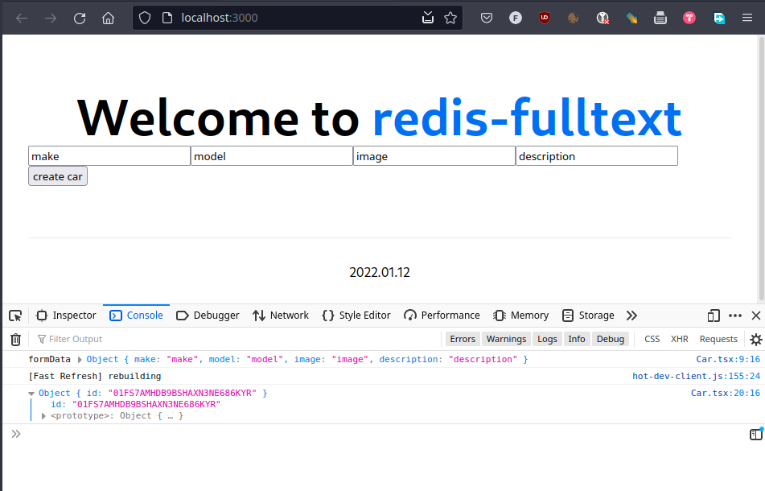
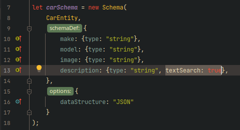
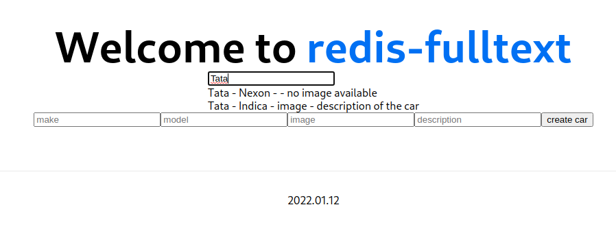

<html lang="en">
<head>
    <meta charset="UTF-8">
    <meta name="viewport" content="width=device-width, initial-scale=1">
    <title>/f0c1s/blog/redis/redis-fulltext</title>
    <link rel="stylesheet" href="../../index.css"/>
    <script src="../../setup.js"></script>
</head>

<body onload="setup()">
<h1>/f0c1s/blog/redis/redis-fulltext</h1>
<nav>
    <a href="../../index.html">/blog</a>
    <a href="../index.html">redis</a>
    <a href="../../redis/redis-fulltext/redis-fulltext.html">+ redis fulltext search app</a>
</nav>

## setting up redis

Read [setup redis in docker](../setup/setup-redis-in-docker.html){.in}

## Setup nextjs app

```shell
yarn create next-app redis-fulltext --typescript
cd redis-fulltext
yarn add redis-om
```

## code

### /lib/redis.ts

```typescript
import {Client} from 'redis-om';

const redisClient = new Client();

async function connectToRedis() {
    if (!redisClient.isOpen()) {
        await redisClient.open(process.env.REDIS_HOST);
    }
}

export {connectToRedis, redisClient};

```

### /lib/car.ts

```typescript
import {Entity, EntityCreationData, Repository, Schema} from "redis-om";
import {redisClient, connectToRedis} from "./redis";

class CarEntity extends Entity {
}

let carSchema = new Schema(
    CarEntity,
    {
        make: {type: "string"},
        model: {type: "string"},
        image: {type: "string"},
        description: {type: "string"},
    },
    {
        dataStructure: "JSON"
    }
);

async function createCar(data: EntityCreationData | undefined): Promise<string> {
    await connectToRedis();
    const repo = new Repository(carSchema, redisClient);

    const car = repo.createEntity(data);

    const id = await repo.save(car);

    return id;
}

export {CarEntity, createCar, carSchema};
```

### /pages/Car.tsx

```typescript
import {FormEvent} from "react";

export default function CarForm() {
    async function handleSubmit(event: FormEvent<HTMLFormElement>) {
        event.preventDefault();
        const form = new FormData(event.target as any);
        const formData = Object.fromEntries(form.entries());

        console.log(formData);

        const res = await fetch('/api/cars', {
            body: JSON.stringify(formData),
            headers: {
                "Content-Type": "application/json"
            },
            method: "POST"
        });

        const result = await res.json();
        console.log(result);
    }

    return (
        <form onSubmit={handleSubmit}>
            <input type={"text"} name={"make"}/>
            <input type={"text"} name={"model"}/>
            <input type={"text"} name={"image"}/>
            <input type={"text"} name={"description"}/>

            <button type={"submit"}>create car</button>
        </form>
    );
}
```

### /pages/api/cars.ts

```typescript
import {createCar} from "../../lib/car";

async function handler(req, res) {
    const id = await createCar(req.body);
    res.status(200).json({id});
}

export {handler};

```





```shell
yarn dev
yarn run v1.22.17
$ next dev
ready - started server on 0.0.0.0:3000, url: http://localhost:3000
info  - Loaded env from /home/f0c1s/code/learn/redis-fulltext/.env
event - compiled client and server successfully in 229 ms (125 modules)
wait  - compiling / (client and server)...
event - compiled client and server successfully in 100 ms (135 modules)
wait  - compiling /api/cars...
event - compiled client and server successfully in 46 ms (148 modules)
req.body {
  make: 'make',
  model: 'model',
  image: 'image',
  description: 'description'
}
error - ReplyError: ERR unknown command `JSON.SET`, with args beginning with: `CarEntity:01FS79FFZ1JEEQVJVC60KB42M7`, `.`, `{"make":"make","model":"model","image":"image","description":"description"}`,
wait  - compiling /_error (client and server)...
event - compiled client and server successfully in 82 ms (149 modules)

```



## success

I had to install redislabs/redismod, stop redis-one, run redismod on port 6379 and it works!



## create redis index

Update `description` field in `carSchema` to have another field: `textSearch: true`.



### Add /api/redisIndex

```typescript
import {createRedisIndex} from "../../lib/redisIndex";

export default async function handler(req: any, res: any) {
    await createRedisIndex();
    res.status(200).send('ok');
}

```


## search

### Add `searchCars` in lib/car.ts

```typescript
async function searchCars(query: string) {
    await connectToRedis();

    const repo = new Repository(carSchema, redisClient);
    const cars = await repo.search()
        .where("make").eq(query)
        .or("model").eq(query)
        .or("description").matches(query)
        .return.all();
    return cars;
}
```

### Add api/searchCars.ts

```typescript
import {searchCars} from "../../lib/car";

export default async function handler(req: any, res: any) {
    const {query} = req.query;
    console.log(req.query)
    const cars = await searchCars(query);
    res.status(200).json({cars});
}

```

### Add pages/Search.tsx

```typescript
import {useState} from "react";

type Car = {
    make: string;
    model: string;
    image: string;
    description: string;
    entityId: string;
}

export default function Search() {
    const [cars, setCars] = useState([] as Car[]);

    async function search(query: string) {
        if (query.length > 2) {
            const params = new URLSearchParams({query});
            const res = await fetch(`/api/searchCars?${params}`);
            const result = await res.json();
            console.log(result);
            setCars(result['cars']);
        }
    }

    return (
        <div>
            <input type={"text"} onChange={(e) => search(e.target.value)} placeholder={"search"}/>
            {
                cars.map((hit: Car) =>
                    <div key={hit.entityId}>
                        {hit.make} - {hit.model} - {hit.image} - {hit.description}
                    </div>
                )
            }
        </div>
    );
}
```




## References

- [Source code: https://github.com/f0c1s/redis-fulltext-sample-app](https://github.com/f0c1s/redis-fulltext-sample-app)
- [YouTube video: https://www.youtube.com/watch?v=DOIWQddRD5M](https://www.youtube.com/watch?v=DOIWQddRD5M)
- [https://github.com/facebook/flow/issues/4799](https://github.com/facebook/flow/issues/4799)
- [https://stackoverflow.com/questions/52094110/err-unknown-command-json-set-rejson-redis](https://stackoverflow.com/questions/52094110/err-unknown-command-json-set-rejson-redis)
- [redisearch commands: https://oss.redis.com/redisearch/Commands/](https://oss.redis.com/redisearch/Commands/)
- [redisearch query syntax: https://oss.redis.com/redisearch/Query_Syntax/](https://oss.redis.com/redisearch/Query_Syntax/)

</body>
</html>
